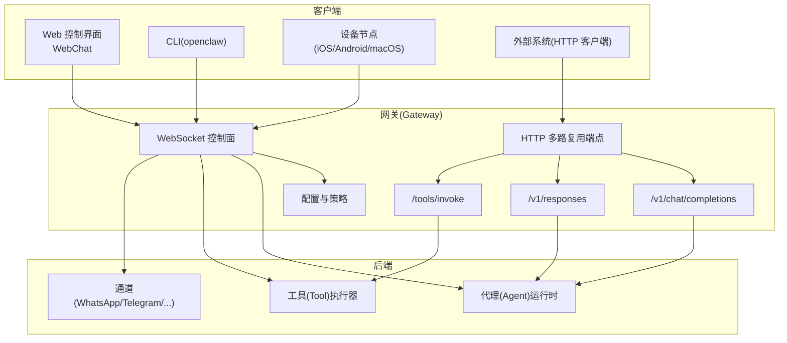
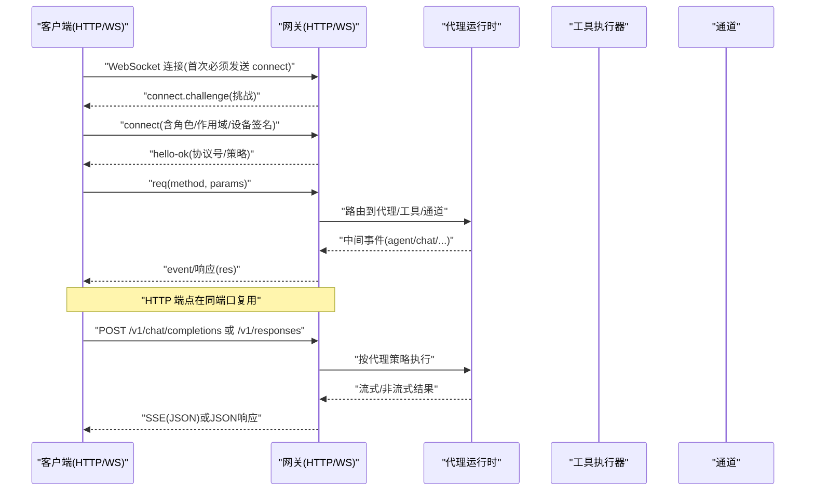
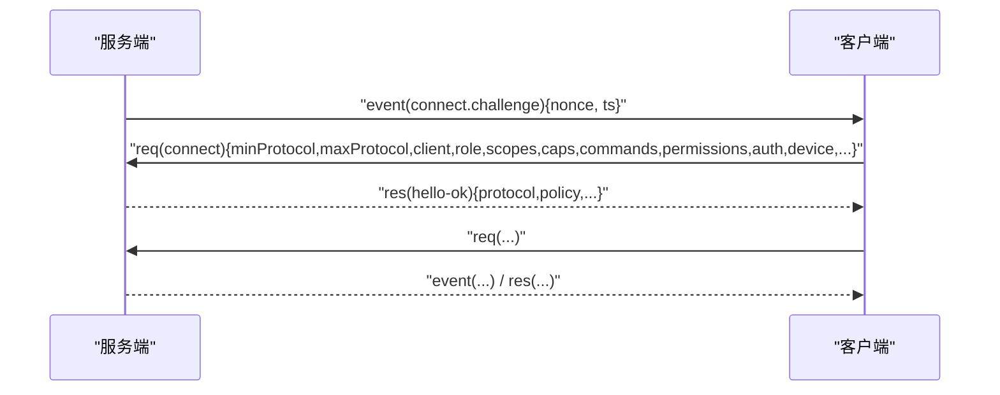
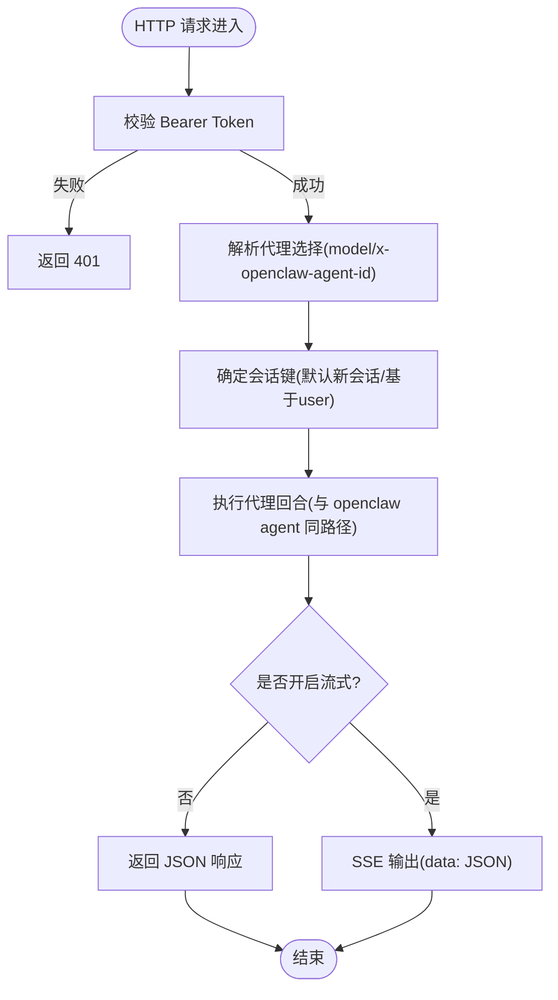
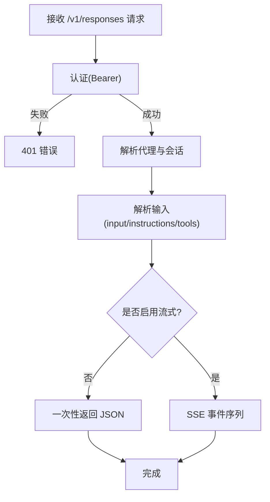
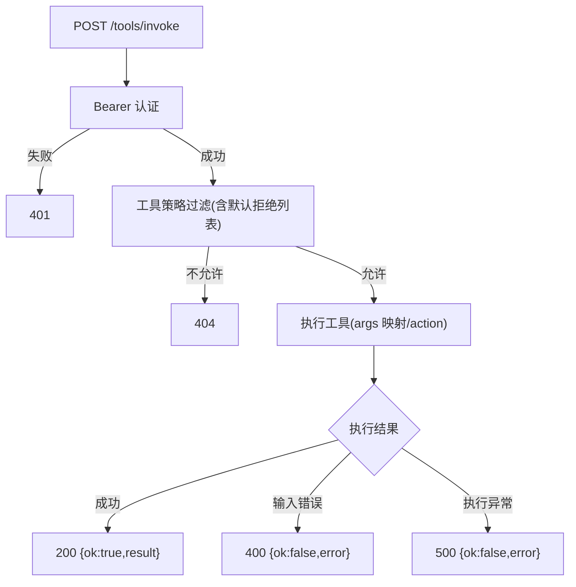
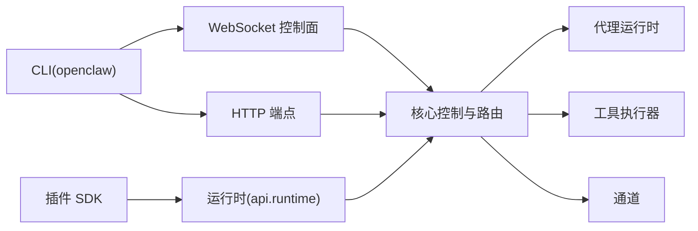

# API参考

<cite>
**本文引用的文件**
- [README.md](file://README.md)
- [docs/gateway/index.md](file://docs/gateway/index.md)
- [docs/gateway/protocol.md](file://docs/gateway/protocol.md)
- [docs/gateway/openai-http-api.md](file://docs/gateway/openai-http-api.md)
- [docs/gateway/openresponses-http-api.md](file://docs/gateway/openresponses-http-api.md)
- [docs/gateway/tools-invoke-http-api.md](file://docs/gateway/tools-invoke-http-api.md)
- [docs/gateway/configuration.md](file://docs/gateway/configuration.md)
- [docs/cli/index.md](file://docs/cli/index.md)
- [docs/reference/rpc.md](file://docs/reference/rpc.md)
- [docs/refactor/plugin-sdk.md](file://docs/refactor/plugin-sdk.md)
</cite>

## 目录
1. [简介](#简介)
2. [项目结构](#项目结构)
3. [核心组件](#核心组件)
4. [架构总览](#架构总览)
5. [详细组件分析](#详细组件分析)
6. [依赖关系分析](#依赖关系分析)
7. [性能考量](#性能考量)
8. [故障排查指南](#故障排查指南)
9. [结论](#结论)
10. [附录](#附录)

## 简介
本文件为 OpenClaw 的 API 参考文档，覆盖以下接口与能力：
- WebSocket 协议（Gateway 控制平面）
- HTTP API（OpenAI 兼容 /v1/chat/completions、OpenResponses 兼容 /v1/responses、工具直调 /tools/invoke）
- CLI 命令参考（openclaw … 子命令与选项）
- 插件 SDK 与运行时（插件开发与集成）

文档目标是帮助两类读者：API 消费者（集成方）与 API 维护者（扩展开发者）。内容涵盖协议规范、认证方式、请求/响应格式、错误处理、版本兼容性、使用限制、性能与最佳实践。

## 项目结构
OpenClaw 的控制平面由“网关（Gateway）”统一提供，其端口复用 WebSocket 控制面与 HTTP 接口；CLI 提供本地运维与调试能力；通道（Channel）与工具（Tool）通过网关进行编排与执行。

图表来源
- [docs/gateway/index.md](file://docs/gateway/index.md#L68-L93)
- [docs/gateway/openai-http-api.md](file://docs/gateway/openai-http-api.md#L10-L17)
- [docs/gateway/openresponses-http-api.md](file://docs/gateway/openresponses-http-api.md#L11-L19)
- [docs/gateway/tools-invoke-http-api.md](file://docs/gateway/tools-invoke-http-api.md#L9-L16)

章节来源
- [README.md](file://README.md#L185-L212)
- [docs/gateway/index.md](file://docs/gateway/index.md#L68-L93)

## 核心组件
- 网关协议（WebSocket）：统一的控制面，支持连接握手、角色与作用域声明、事件与请求/响应帧、设备身份与配对、版本协商与安全边界。
- HTTP 接口：在同端口上复用 HTTP，提供 OpenAI 兼容聊天补全、OpenResponses 兼容响应、工具直调等。
- CLI：提供启动网关、状态检查、日志、配置管理、通道管理、会话与技能等操作。
- 配置与策略：集中式 JSON5 配置，支持热重载、环境变量注入、SecretRef 凭证引用、多文件 include 等。
- 插件 SDK/运行时：标准化的插件开发与运行时注入，约束通道与工具接入。

章节来源
- [docs/gateway/protocol.md](file://docs/gateway/protocol.md#L10-L257)
- [docs/gateway/openai-http-api.md](file://docs/gateway/openai-http-api.md#L8-L132)
- [docs/gateway/openresponses-http-api.md](file://docs/gateway/openresponses-http-api.md#L9-L354)
- [docs/gateway/tools-invoke-http-api.md](file://docs/gateway/tools-invoke-http-api.md#L9-L111)
- [docs/cli/index.md](file://docs/cli/index.md#L9-L800)
- [docs/gateway/configuration.md](file://docs/gateway/configuration.md#L10-L547)
- [docs/refactor/plugin-sdk.md](file://docs/refactor/plugin-sdk.md#L9-L215)

## 架构总览
下图展示从客户端到网关再到代理/工具/通道的整体调用链路与数据流。

图表来源
- [docs/gateway/protocol.md](file://docs/gateway/protocol.md#L22-L78)
- [docs/gateway/openai-http-api.md](file://docs/gateway/openai-http-api.md#L14-L17)
- [docs/gateway/openresponses-http-api.md](file://docs/gateway/openresponses-http-api.md#L15-L19)

章节来源
- [docs/gateway/protocol.md](file://docs/gateway/protocol.md#L10-L257)
- [docs/gateway/index.md](file://docs/gateway/index.md#L68-L93)

## 详细组件分析

### WebSocket 协议（Gateway 控制面）
- 传输与帧格式
  - 文本帧，JSON 负载
  - 首帧必须为 connect 请求
- 握手流程
  - 服务端先发 connect.challenge（包含随机数与时间戳）
  - 客户端签名挑战并携带设备身份与角色/作用域信息
  - 服务端返回 hello-ok，包含协议号与策略
- 角色与作用域
  - operator：控制面客户端（CLI/UI/自动化）
  - node：能力宿主（相机/画布/屏幕/系统命令等）
  - 作用域用于授权读写/管理/批准等能力
- 设备身份与配对
  - 客户端需提供稳定的设备标识与签名
  - 新设备需经批准或满足本地自动批准条件
- 版本与兼容
  - 客户端声明 min/maxProtocol，服务端拒绝不兼容版本
  - 类型模型由 TypeBox 定义生成
- 认证
  - 支持令牌或密码模式；成功配对后可获得设备级令牌
- 安全边界
  - TLS 可选；支持证书指纹固定
- 事件与方法
  - 常见事件：connect.challenge、agent、chat、presence、tick、health、heartbeat、shutdown
  - 方法：工具目录查询、节点能力声明、执行审批、设备令牌轮换等

图表来源
- [docs/gateway/protocol.md](file://docs/gateway/protocol.md#L22-L78)
- [docs/gateway/protocol.md](file://docs/gateway/protocol.md#L135-L161)
- [docs/gateway/protocol.md](file://docs/gateway/protocol.md#L196-L205)
- [docs/gateway/protocol.md](file://docs/gateway/protocol.md#L206-L245)

章节来源
- [docs/gateway/protocol.md](file://docs/gateway/protocol.md#L10-L257)

### HTTP API（OpenAI 兼容 /v1/chat/completions）
- 端点与绑定
  - POST /v1/chat/completions
  - 与网关同端口复用
- 认证
  - 使用网关认证配置；Bearer Token
  - 支持速率限制与 429 Retry-After
- 安全边界
  - 该端点为“全操作员访问”面，应仅限内网/私有入口
- 代理选择
  - 在 model 字段中编码 agentId（如 openclaw:main），或通过头 x-openclaw-agent-id 指定
  - 可通过 x-openclaw-session-key 精确控制会话键
- 会话行为
  - 默认无状态（每次请求生成新会话键）
  - 若请求包含 OpenAI user 字段，则派生稳定会话键
- 流式输出（SSE）
  - Content-Type: text/event-stream
  - 每行 data: <json>，以 data: [DONE] 结束
- 示例
  - 非流式与流式的 curl 示例见文档

图表来源
- [docs/gateway/openai-http-api.md](file://docs/gateway/openai-http-api.md#L14-L17)
- [docs/gateway/openai-http-api.md](file://docs/gateway/openai-http-api.md#L19-L30)
- [docs/gateway/openai-http-api.md](file://docs/gateway/openai-http-api.md#L43-L57)
- [docs/gateway/openai-http-api.md](file://docs/gateway/openai-http-api.md#L90-L103)
- [docs/gateway/openai-http-api.md](file://docs/gateway/openai-http-api.md#L104-L132)

章节来源
- [docs/gateway/openai-http-api.md](file://docs/gateway/openai-http-api.md#L8-L132)

### HTTP API（OpenResponses 兼容 /v1/responses）
- 端点与绑定
  - POST /v1/responses
  - 与网关同端口复用
- 认证与安全边界
  - 同 OpenAI 兼容端点的认证与安全边界
- 代理选择与会话
  - model 中编码 agentId 或通过 x-openclaw-agent-id 指定
  - 可通过 x-openclaw-session-key 控制会话
  - 默认无状态；若提供 user 则派生稳定会话键
- 请求形态（支持项）
  - input：字符串或条目对象数组
  - instructions：合并入系统提示
  - tools：客户端函数工具定义
  - tool_choice：过滤或要求特定工具
  - stream：启用 SSE 流
  - max_output_tokens：尽力而为的输出上限
  - user：稳定会话路由
- 输入类型
  - message：system/developer/user/assistant
  - function_call_output：工具调用结果回传
  - reasoning/item_reference：兼容但忽略
- 图像与文件
  - 支持 base64 或 URL 来源
  - MIME 与大小限制、URL 白名单、PDF 解析策略
- 流式事件
  - response.created、response.in_progress、output_item.added、content_part.added、output_text.delta/done、completed/failed 等
- 错误
  - 401 缺失/无效认证
  - 400 请求体无效
  - 405 方法不被允许
- 示例
  - 非流式与流式的 curl 示例见文档

图表来源
- [docs/gateway/openresponses-http-api.md](file://docs/gateway/openresponses-http-api.md#L11-L19)
- [docs/gateway/openresponses-http-api.md](file://docs/gateway/openresponses-http-api.md#L45-L59)
- [docs/gateway/openresponses-http-api.md](file://docs/gateway/openresponses-http-api.md#L99-L119)
- [docs/gateway/openresponses-http-api.md](file://docs/gateway/openresponses-http-api.md#L120-L187)
- [docs/gateway/openresponses-http-api.md](file://docs/gateway/openresponses-http-api.md#L287-L307)
- [docs/gateway/openresponses-http-api.md](file://docs/gateway/openresponses-http-api.md#L312-L326)
- [docs/gateway/openresponses-http-api.md](file://docs/gateway/openresponses-http-api.md#L326-L354)

章节来源
- [docs/gateway/openresponses-http-api.md](file://docs/gateway/openresponses-http-api.md#L9-L354)

### HTTP API（工具直调 /tools/invoke）
- 端点与绑定
  - POST /tools/invoke
  - 与网关同端口复用
- 认证
  - Bearer Token；支持速率限制与 429
- 请求体字段
  - tool（必填）：工具名
  - action（可选）：映射到 args 的动作
  - args（可选）：工具特定参数
  - sessionKey（可选）：目标会话键，默认 main
  - dryRun（可选）：保留字段
- 策略与路由
  - 通过与代理相同的工具策略链过滤
  - 默认硬性拒绝列表（如 sessions_spawn/sessions_send/gateway 等），可通过 gateway.tools 自定义
- 响应
  - 200：{ ok: true, result }
  - 400：{ ok: false, error: { type, message } }
  - 401：未授权
  - 429：认证受限（带 Retry-After）
  - 404：工具不可用（未找到或未白名单）
  - 405：方法不允许
  - 500：工具执行异常（消息已清洗）
- 示例
  - 调用 sessions_list 的 curl 示例见文档

图表来源
- [docs/gateway/tools-invoke-http-api.md](file://docs/gateway/tools-invoke-http-api.md#L11-L16)
- [docs/gateway/tools-invoke-http-api.md](file://docs/gateway/tools-invoke-http-api.md#L18-L29)
- [docs/gateway/tools-invoke-http-api.md](file://docs/gateway/tools-invoke-http-api.md#L30-L49)
- [docs/gateway/tools-invoke-http-api.md](file://docs/gateway/tools-invoke-http-api.md#L50-L83)
- [docs/gateway/tools-invoke-http-api.md](file://docs/gateway/tools-invoke-http-api.md#L89-L98)
- [docs/gateway/tools-invoke-http-api.md](file://docs/gateway/tools-invoke-http-api.md#L99-L111)

章节来源
- [docs/gateway/tools-invoke-http-api.md](file://docs/gateway/tools-invoke-http-api.md#L9-L111)

### CLI 命令参考（openclaw …）
- 命令树概览
  - 包含 setup、onboard、configure、config、completion、doctor、dashboard、reset、uninstall、update、message、agent、agents、acp、status、health、sessions、gateway、logs、system、models、memory、directory、nodes、devices、node、approvals、sandbox、tui、browser、cron、dns、docs、hooks、webhooks、pairing、qr、plugins、channels、security、secrets、skills、daemon、clawbot、voicecall 等
- 全局标志
  - --dev、--profile、--no-color、--update、-V/--version/-v
- 输出样式
  - TTY 渲染彩色与进度指示；--json/--plain 关闭样式；--no-color 禁用颜色
- 安全审计与密钥
  - security audit、secrets reload/audit/configure/apply
- 内存检索
  - memory status/index/search
- 聊天斜杠命令
  - /status、/config、/debug 等
- 网关相关
  - gateway status/health/probe/discover/install/uninstall/start/stop/restart/run
  - 日志 tail、系统事件、心跳开关、在线状态
- 模型与技能
  - models list/status/set/set-image/aliases/fallbacks/scan/auth
  - skills list/info/check
- 插件管理
  - plugins list/info/install/enable/disable/doctor
- 通道管理
  - channels list/status/logs/add/remove/login/logout
- 设备与配对
  - devices list/approve/reject/remove/clear/rotate/revoke
- Webhook（Gmail Pub/Sub）
  - webhooks gmail setup/run
- DNS 辅助
  - dns setup --apply

章节来源
- [docs/cli/index.md](file://docs/cli/index.md#L9-L800)

### 插件 SDK 与运行时
- 目标
  - 所有消息通道均为插件，使用统一稳定 API，避免直接导入 src/**
- SDK（编译期、稳定、可发布）
  - 类型、辅助函数、配置工具、配对/引导助手、工具参数辅助、文档链接助手
- 运行时（执行表面，注入）
  - 通过 OpenClawPluginApi.runtime 访问核心行为，保持与核心解耦
- 迁移计划（分阶段）
  - 搭建 SDK 与 api.runtime
  - 替换桥接代码（如 BlueBubbles、Zalo、Zalo Personal）
  - 迁移到 SDK+运行时（Matrix、Teams 等）
  - 强化约束（lint/CI 检查禁止 extensions/** 导入 src/**）
- 兼容性与版本
  - SDK：语义化版本，明确稳定性保证
  - 运行时：随核心发布版本；插件声明所需运行时范围
- 测试策略
  - 适配器级单元测试、黄金测试（行为无漂移）、CI 单测样例

章节来源
- [docs/refactor/plugin-sdk.md](file://docs/refactor/plugin-sdk.md#L9-L215)

### RPC 适配器（外部 CLI）
- 模式 A：HTTP 守护（signal-cli）
  - 以 HTTP JSON-RPC 形式运行，事件通过 SSE /api/v1/events
  - 健康探针 /api/v1/check
  - 当 channels.signal.autoStart=true 时由网关生命周期托管
- 模式 B：stdio 子进程（imsg，遗留）
  - 通过 stdin/stdout 行分隔 JSON 对象进行 RPC
  - 无 TCP 端口，无需守护进程
- 通用指导
  - 网关负责进程生命周期（随提供商生命周期启停）
  - 保持客户端弹性（超时、退出重启）
  - 优先使用稳定 ID（如 chat_id）

章节来源
- [docs/reference/rpc.md](file://docs/reference/rpc.md#L9-L44)

## 依赖关系分析
- 网关协议与 HTTP API 的耦合
  - HTTP 端点均走同一控制面代理路径，共享代理策略、会话与工具策略
- CLI 与网关的协作
  - CLI 通过网关 RPC 与 HTTP 接口进行状态查询、配置更新、日志拉取、通道管理等
- 插件生态
  - 通道与工具通过 SDK/运行时接入，避免直接依赖核心实现细节
- 配置与策略
  - 配置文件集中管理，支持热重载与环境变量/SecretRef 注入

图表来源
- [docs/gateway/index.md](file://docs/gateway/index.md#L68-L93)
- [docs/cli/index.md](file://docs/cli/index.md#L9-L800)
- [docs/refactor/plugin-sdk.md](file://docs/refactor/plugin-sdk.md#L40-L145)

章节来源
- [docs/gateway/index.md](file://docs/gateway/index.md#L68-L93)
- [docs/cli/index.md](file://docs/cli/index.md#L9-L800)
- [docs/refactor/plugin-sdk.md](file://docs/refactor/plugin-sdk.md#L9-L215)

## 性能考量
- 端口与绑定
  - 默认 loopback 绑定，建议通过 Tailscale Serve/Funnel 或 SSH 隧道暴露，避免公网直连
- 速率限制
  - HTTP 端点与网关认证支持速率限制，过多失败将返回 429 并带 Retry-After
- 会话与流式
  - OpenAI/Responses 端点默认无状态；启用流式可降低首字节延迟，但需注意 SSE 带宽与客户端缓冲
- 工具直调
  - 仅调用单工具，避免完整代理回合开销；受工具策略与默认拒绝列表约束
- 配置热重载
  - 大多数设置热应用，关键变更（如端口/远程/插件）需重启；hybrid 模式自动处理重启

章节来源
- [docs/gateway/index.md](file://docs/gateway/index.md#L108-L124)
- [docs/gateway/openai-http-api.md](file://docs/gateway/openai-http-api.md#L25-L30)
- [docs/gateway/openresponses-http-api.md](file://docs/gateway/openresponses-http-api.md#L31-L42)
- [docs/gateway/tools-invoke-http-api.md](file://docs/gateway/tools-invoke-http-api.md#L18-L29)
- [docs/gateway/configuration.md](file://docs/gateway/configuration.md#L349-L388)

## 故障排查指南
- 连接与握手
  - 必须先收到 connect.challenge 再发送 connect；设备签名与 nonce 必须匹配且未过期
  - 角色/作用域/设备信息缺失或不一致会导致握手失败
- 认证问题
  - 令牌/密码不匹配导致 401；速率限制触发 429
- 端口冲突与绑定
  - 非 loopback 绑定且未配置认证会被拒绝；端口占用导致启动失败
- 配置验证
  - 严格 JSON5 验证，未知键或非法值将阻止网关启动；使用 doctor 诊断并修复
- 通道健康
  - 使用 channels status --probe 检查通道就绪状态
- 日志与诊断
  - openclaw logs --follow 查看实时日志；openclaw status --deep 获取更全面诊断

章节来源
- [docs/gateway/protocol.md](file://docs/gateway/protocol.md#L220-L245)
- [docs/gateway/openai-http-api.md](file://docs/gateway/openai-http-api.md#L25-L30)
- [docs/gateway/openresponses-http-api.md](file://docs/gateway/openresponses-http-api.md#L31-L42)
- [docs/gateway/index.md](file://docs/gateway/index.md#L235-L244)
- [docs/gateway/configuration.md](file://docs/gateway/configuration.md#L61-L73)
- [docs/cli/index.md](file://docs/cli/index.md#L784-L800)

## 结论
OpenClaw 的 API 体系以“网关控制面 + HTTP 多路复用 + CLI 运维”为核心，提供统一的协议与丰富的扩展面。WebSocket 协议确保客户端与网关的强一致控制；HTTP 端点覆盖主流大模型接口形态；CLI 与配置系统保障了可运维性与安全性。插件 SDK/运行时进一步降低了接入成本并提升了生态一致性。建议在生产环境中遵循安全边界与速率限制，合理使用流式与会话策略，并通过 doctor 与日志持续监控。

## 附录
- 版本与兼容性
  - 协议版本在源码中定义并通过 TypeBox 生成模型；客户端需声明 min/maxProtocol
- 环境与凭证
  - 支持环境变量、$include、SecretRef；提供 shellEnv 导入与变量替换
- 最佳实践
  - 将 HTTP 端点置于 loopback/tailnet 私有入口；为工具直调配置最小权限策略；利用流式提升交互体验；通过配置热重载减少停机

章节来源
- [docs/gateway/protocol.md](file://docs/gateway/protocol.md#L187-L195)
- [docs/gateway/configuration.md](file://docs/gateway/configuration.md#L449-L539)
- [docs/gateway/index.md](file://docs/gateway/index.md#L68-L93)