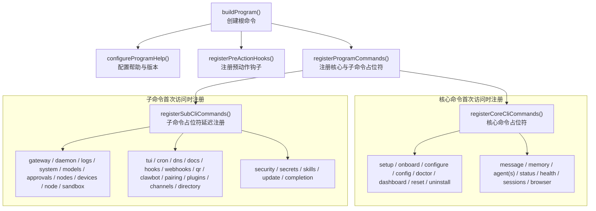
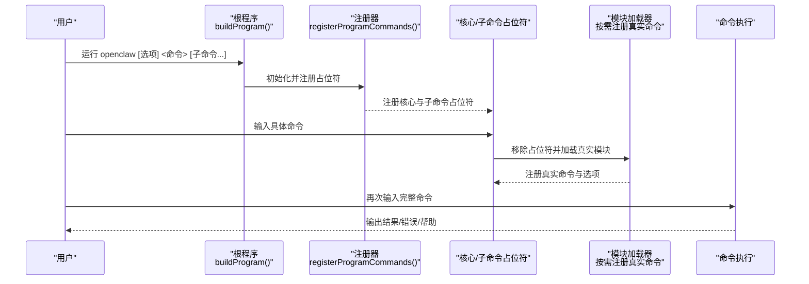
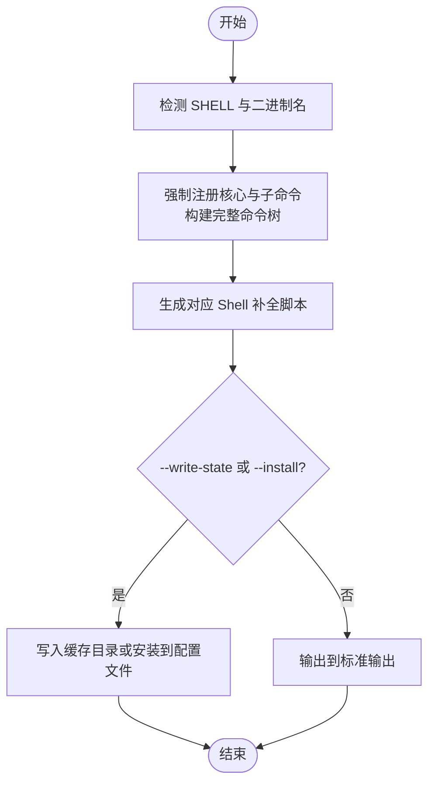
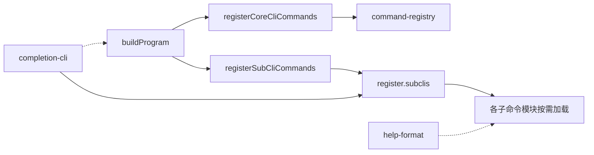

# CLI命令参考

<cite>
**本文引用的文件**
- [docs/cli/index.md](file://docs/cli/index.md)
- [src/cli/completion-cli.ts](file://src/cli/completion-cli.ts)
- [src/cli/config-cli.ts](file://src/cli/config-cli.ts)
- [src/cli/program/build-program.ts](file://src/cli/program/build-program.ts)
- [src/cli/program/register.subclis.ts](file://src/cli/program/register.subclis.ts)
- [src/cli/program/command-registry.ts](file://src/cli/program/command-registry.ts)
- [src/cli/help-format.ts](file://src/cli/help-format.ts)
- [src/cli/command-format.ts](file://src/cli/command-format.ts)
- [src/cli/program.ts](file://src/cli/program.ts)
</cite>

## 目录
1. [简介](#简介)
2. [项目结构](#项目结构)
3. [核心组件](#核心组件)
4. [架构总览](#架构总览)
5. [详细组件分析](#详细组件分析)
6. [依赖关系分析](#依赖关系分析)
7. [性能考量](#性能考量)
8. [故障排查指南](#故障排查指南)
9. [结论](#结论)
10. [附录](#附录)

## 简介
本文件为 OpenClaw 命令行接口（CLI）的完整命令参考与使用指南。内容覆盖：
- 所有顶层命令与子命令的语法、选项、参数与行为
- 配置文件与环境变量的作用范围与优先级
- 帮助信息格式、错误输出规范与交互体验
- 命令行补全机制与安装流程
- 常用命令组合、最佳实践与安全注意事项
- 历史变更、废弃警告与迁移建议

## 项目结构
OpenClaw CLI 采用“核心命令 + 子命令延迟注册”的架构设计，通过 Commander 构建命令树，并在首次访问时按需加载对应模块，以提升启动性能。

图表来源
- [src/cli/program/build-program.ts](file://src/cli/program/build-program.ts#L8-L20)
- [src/cli/program/command-registry.ts](file://src/cli/program/command-registry.ts#L297-L304)
- [src/cli/program/register.subclis.ts](file://src/cli/program/register.subclis.ts#L330-L348)

章节来源
- [src/cli/program/build-program.ts](file://src/cli/program/build-program.ts#L1-L21)
- [src/cli/program/command-registry.ts](file://src/cli/program/command-registry.ts#L1-L305)
- [src/cli/program/register.subclis.ts](file://src/cli/program/register.subclis.ts#L1-L349)

## 核心组件
- 根程序构建器：负责创建根命令、设置上下文、注册帮助与预动作钩子，并一次性注册核心与子命令占位符。
- 命令注册器：将核心命令与子命令以“占位符 + 懒加载”的方式注册到根命令树中；首次执行具体命令时才真正加载对应模块。
- 补全系统：支持 zsh、bash、fish、PowerShell 四种 Shell 的动态生成与缓存写入，提供自动安装与慢速动态补全检测。
- 帮助与格式化：统一的帮助文本格式化工具，支持示例块与内联注释格式。
- 命令格式化：对命令字符串进行 CLI 名称替换与 --profile 注入，便于跨环境复用。

章节来源
- [src/cli/program/build-program.ts](file://src/cli/program/build-program.ts#L8-L20)
- [src/cli/program/command-registry.ts](file://src/cli/program/command-registry.ts#L297-L304)
- [src/cli/completion-cli.ts](file://src/cli/completion-cli.ts#L231-L301)
- [src/cli/help-format.ts](file://src/cli/help-format.ts#L1-L28)
- [src/cli/command-format.ts](file://src/cli/command-format.ts#L8-L26)

## 架构总览
下图展示 CLI 启动到命令执行的关键路径，以及补全与帮助系统的集成点。

图表来源
- [src/cli/program/build-program.ts](file://src/cli/program/build-program.ts#L8-L20)
- [src/cli/program/command-registry.ts](file://src/cli/program/command-registry.ts#L275-L295)
- [src/cli/program/register.subclis.ts](file://src/cli/program/register.subclis.ts#L319-L328)

## 详细组件分析

### 全局选项与输出样式
- 全局选项
  - --dev：隔离状态目录至 ~/.openclaw-dev，并调整默认端口
  - --profile <name>：隔离状态目录至 ~/.openclaw-<name>
  - --no-color：禁用 ANSI 彩色输出
  - --update：等价于 openclaw update（源码安装）
  - -V, --version, -v：打印版本后退出
- 输出样式
  - TTY 会渲染彩色与进度指示（OSC 9/8 超链接）
  - --json 或 --plain 关闭着色与进度，便于机器解析
  - NO_COLOR=1 同样禁用 ANSI 样式
  - 长任务显示进度条（受终端支持）

章节来源
- [docs/cli/index.md](file://docs/cli/index.md#L61-L76)

### 命令树与子命令注册
- 核心命令（首次访问时注册）：setup、onboard、configure、config、doctor、dashboard、reset、uninstall、message、memory、agent(s)、status、health、sessions、browser 等
- 子命令（首次访问时注册）：gateway、daemon、logs、system、models、approvals、nodes、devices、node、sandbox、tui、cron、dns、docs、hooks、webhooks、qr、clawbot、pairing、plugins、channels、directory、security、secrets、skills、update、completion 等
- 延迟注册策略：通过占位符命令与 reparse 机制，在首次命中时移除占位符并加载真实模块，避免启动时的全量导入开销

章节来源
- [docs/cli/index.md](file://docs/cli/index.md#L92-L262)
- [src/cli/program/command-registry.ts](file://src/cli/program/command-registry.ts#L275-L295)
- [src/cli/program/register.subclis.ts](file://src/cli/program/register.subclis.ts#L330-L348)

### 补全机制与安装
- 支持 Shell：zsh、bash、fish、PowerShell
- 动态生成：根据当前命令树生成对应补全脚本
- 缓存写入：可将补全脚本写入 $OPENCLAW_STATE_DIR/completions/<bin>.<ext>，用于快速加载
- 自动安装：向用户 Shell 配置文件追加 source 行，支持检测慢速动态补全模式（source <(...)）并提示优化
- 安装检查：检测是否已安装、是否使用缓存脚本、是否使用慢速动态模式

图表来源
- [src/cli/completion-cli.ts](file://src/cli/completion-cli.ts#L231-L301)
- [src/cli/completion-cli.ts](file://src/cli/completion-cli.ts#L303-L377)

章节来源
- [src/cli/completion-cli.ts](file://src/cli/completion-cli.ts#L18-L61)
- [src/cli/completion-cli.ts](file://src/cli/completion-cli.ts#L231-L301)
- [src/cli/completion-cli.ts](file://src/cli/completion-cli.ts#L303-L377)

### 配置命令（config）
- 子命令
  - get <path> [--json]：按点/方括号路径读取值；--json 输出 JSON
  - set <path> <value> [--strict-json|--json]：设置值；严格 JSON5 解析或回退为原始字符串
  - unset <path>：删除键或数组索引
  - file：打印当前生效配置文件路径
  - validate [--json]：不启动网关验证配置有效性，支持 JSON 输出
- 路径语法
  - 支持点号与方括号混合路径；反斜杠转义
  - 对数组索引进行数值校验
- 安全与兼容
  - 写入前基于“解析后但未合并默认值”的快照进行修改，避免运行时默认值污染配置文件
  - 设置 Ollama API Key 时自动补齐默认 Provider 结构
- 错误处理
  - 非法路径、类型不匹配、值解析失败均返回错误并退出非零

章节来源
- [src/cli/config-cli.ts](file://src/cli/config-cli.ts#L29-L79)
- [src/cli/config-cli.ts](file://src/cli/config-cli.ts#L106-L112)
- [src/cli/config-cli.ts](file://src/cli/config-cli.ts#L114-L138)
- [src/cli/config-cli.ts](file://src/cli/config-cli.ts#L140-L182)
- [src/cli/config-cli.ts](file://src/cli/config-cli.ts#L184-L230)
- [src/cli/config-cli.ts](file://src/cli/config-cli.ts#L232-L244)
- [src/cli/config-cli.ts](file://src/cli/config-cli.ts#L246-L253)
- [src/cli/config-cli.ts](file://src/cli/config-cli.ts#L261-L277)
- [src/cli/config-cli.ts](file://src/cli/config-cli.ts#L279-L308)
- [src/cli/config-cli.ts](file://src/cli/config-cli.ts#L310-L331)
- [src/cli/config-cli.ts](file://src/cli/config-cli.ts#L333-L342)
- [src/cli/config-cli.ts](file://src/cli/config-cli.ts#L344-L393)
- [src/cli/config-cli.ts](file://src/cli/config-cli.ts#L395-L476)

### 帮助与示例格式化
- 统一帮助文本格式：命令高亮、描述弱化
- 示例块：支持分组标题与多条示例，支持内联注释
- 命令字符串格式化：自动注入 --profile，避免重复输入

章节来源
- [src/cli/help-format.ts](file://src/cli/help-format.ts#L1-L28)
- [src/cli/command-format.ts](file://src/cli/command-format.ts#L8-L26)

### 程序入口与上下文
- 入口导出：buildProgram 提供根命令构造；forceFreePort 提供端口占用处理
- 上下文：ProgramContext 在构建阶段创建并注入，贯穿注册与执行生命周期

章节来源
- [src/cli/program.ts](file://src/cli/program.ts#L1-L3)
- [src/cli/program/build-program.ts](file://src/cli/program/build-program.ts#L8-L20)

## 依赖关系分析
- 组件耦合
  - 根程序与注册器低耦合：通过占位符与按需加载降低模块间直接依赖
  - 补全系统独立于业务命令：仅依赖命令树生成脚本
  - 帮助与格式化为纯工具层：无业务副作用
- 外部依赖
  - Commander：命令定义与解析
  - Node 文件系统与进程环境：补全缓存、状态目录、环境变量
- 循环依赖规避
  - 通过异步 import 与占位符命令避免循环引用

图表来源
- [src/cli/program/build-program.ts](file://src/cli/program/build-program.ts#L8-L20)
- [src/cli/program/command-registry.ts](file://src/cli/program/command-registry.ts#L297-L304)
- [src/cli/program/register.subclis.ts](file://src/cli/program/register.subclis.ts#L330-L348)
- [src/cli/completion-cli.ts](file://src/cli/completion-cli.ts#L231-L301)

章节来源
- [src/cli/program/command-registry.ts](file://src/cli/program/command-registry.ts#L1-L305)
- [src/cli/program/register.subclis.ts](file://src/cli/program/register.subclis.ts#L1-L349)
- [src/cli/completion-cli.ts](file://src/cli/completion-cli.ts#L1-L666)

## 性能考量
- 启动性能
  - 通过“占位符 + 懒加载”减少初始模块导入数量，显著缩短 CLI 启动时间
  - 可通过环境变量禁用懒加载以换取更早的命令树构建（调试用途）
- 补全性能
  - 推荐使用缓存脚本安装，避免每次启动都动态生成
  - 慢速动态补全（source <(...)）会增加启动开销，应迁移到缓存脚本
- I/O 与网络
  - 日志与健康检查等操作可能涉及文件与 RPC 访问，建议在 CI/自动化场景中使用 --json 与 --no-color 以稳定输出

[本节为通用指导，无需特定文件引用]

## 故障排查指南
- 补全问题
  - 使用 usesSlowDynamicCompletion 检测是否使用了慢速动态模式；如是，建议先执行 --write-state，再执行 --install
  - 若安装后无效，确认 profile 文件存在且包含正确的 source 行
- 配置问题
  - 使用 config validate 检查配置有效性；必要时使用 doctor 获取修复建议
  - 修改配置后需重启网关以生效
- 输出样式异常
  - 在非 TTY 环境中，彩色与进度条不会显示；可通过 --json 或 --plain 获取稳定输出
  - NO_COLOR=1 将禁用 ANSI 样式

章节来源
- [src/cli/completion-cli.ts](file://src/cli/completion-cli.ts#L208-L229)
- [src/cli/completion-cli.ts](file://src/cli/completion-cli.ts#L303-L377)
- [src/cli/config-cli.ts](file://src/cli/config-cli.ts#L344-L393)
- [docs/cli/index.md](file://docs/cli/index.md#L69-L76)

## 结论
OpenClaw CLI 通过“占位符 + 懒加载”的注册策略实现了高性能启动，同时提供完善的补全、帮助与格式化能力。配合全局选项与输出样式控制，可在交互与自动化场景中灵活切换。建议在生产环境中优先使用缓存补全与 --json 输出，并定期使用 doctor 与 config validate 进行健康检查与配置验证。

[本节为总结性内容，无需特定文件引用]

## 附录

### 常用命令组合与最佳实践
- 快速诊断
  - openclaw status --deep
  - openclaw health
  - openclaw logs --follow
- 配置管理
  - openclaw config get <path>
  - openclaw config set <path> <value> --strict-json
  - openclaw config validate --json
- 补全安装
  - openclaw completion --write-state
  - openclaw completion --install
- 插件与技能
  - openclaw plugins list
  - openclaw skills list --eligible
- 网关与服务
  - openclaw gateway --port <port> --bind <bind>
  - openclaw gateway service status

章节来源
- [docs/cli/index.md](file://docs/cli/index.md#L396-L800)

### 历史变更、废弃警告与迁移指南
- 命令树与子命令注册
  - 子命令采用延迟注册策略，首次访问时才加载模块；如需调试或特殊场景，可通过环境变量禁用懒加载
- 补全策略
  - 强烈建议使用缓存脚本安装；若仍使用动态补全（source <(...)），将在启动时产生额外开销
- 输出样式
  - 在 CI/自动化场景中推荐使用 --json 与 --no-color，确保输出稳定可解析
- 配置变更
  - 配置修改后需重启网关以生效；使用 config validate 预检可减少启动失败概率

章节来源
- [src/cli/program/register.subclis.ts](file://src/cli/program/register.subclis.ts#L17-L29)
- [src/cli/completion-cli.ts](file://src/cli/completion-cli.ts#L208-L229)
- [docs/cli/index.md](file://docs/cli/index.md#L69-L76)
- [src/cli/config-cli.ts](file://src/cli/config-cli.ts#L344-L393)