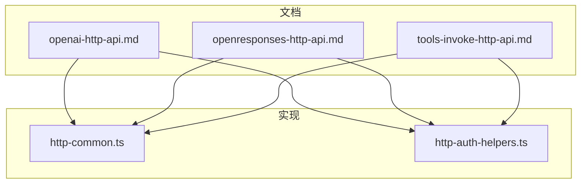
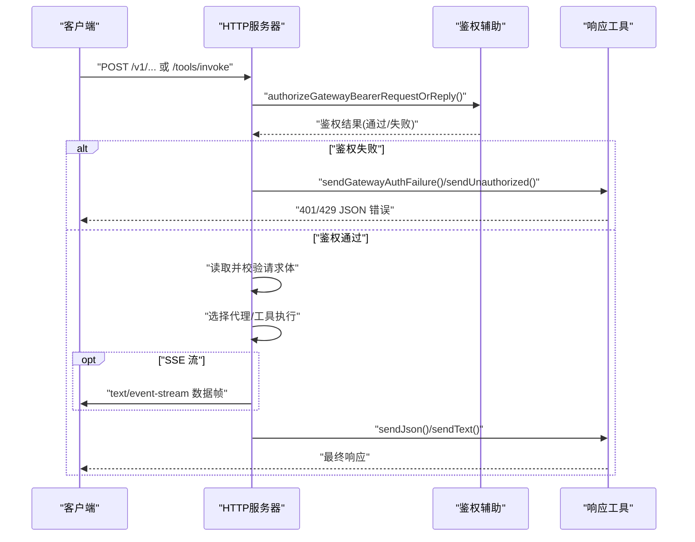
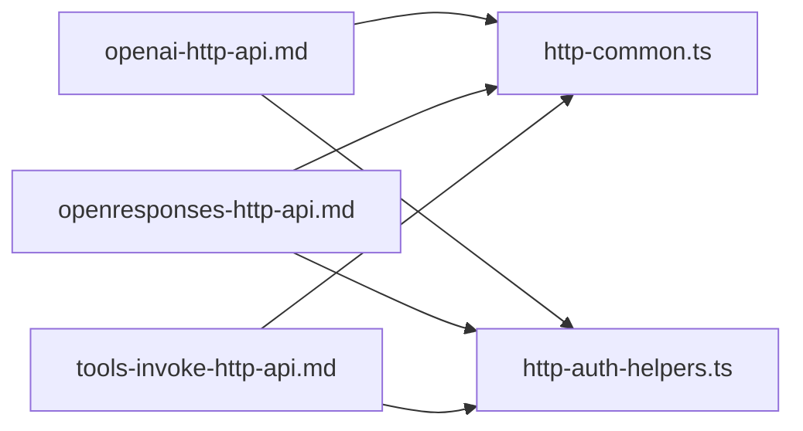

# HTTP API

<cite>
**本文引用的文件**
- [docs/gateway/openai-http-api.md](file://docs/gateway/openai-http-api.md)
- [docs/gateway/openresponses-http-api.md](file://docs/gateway/openresponses-http-api.md)
- [docs/gateway/tools-invoke-http-api.md](file://docs/gateway/tools-invoke-http-api.md)
- [src/gateway/http-common.ts](file://src/gateway/http-common.ts)
- [src/gateway/http-auth-helpers.ts](file://src/gateway/http-auth-helpers.ts)
</cite>

## 目录
1. [简介](#简介)
2. [项目结构](#项目结构)
3. [核心组件](#核心组件)
4. [架构总览](#架构总览)
5. [详细组件分析](#详细组件分析)
6. [依赖关系分析](#依赖关系分析)
7. [性能与容量规划](#性能与容量规划)
8. [故障排查指南](#故障排查指南)
9. [结论](#结论)
10. [附录](#附录)

## 简介
本文件为 OpenClaw 的 HTTP API 参考文档，覆盖以下三类接口：
- OpenAI 兼容接口：/v1/chat/completions（聊天补全）
- OpenResponses 兼容接口：/v1/responses（响应生成）
- 工具直连接口：/tools/invoke（直接调用单个工具）

内容包括端点的 HTTP 方法、URL 模式、请求/响应结构、认证方式、会话行为、流式输出（SSE）、错误码与状态码、配置项、安全边界与最佳实践等。

## 项目结构
- 文档层：位于 docs/gateway/*.md，描述各 HTTP 接口的语义、启用方式、请求/响应与示例。
- 实现层：位于 src/gateway/*，提供通用 HTTP 响应封装、SSE 写入、鉴权辅助与错误处理。

图表来源
- [docs/gateway/openai-http-api.md](file://docs/gateway/openai-http-api.md#L1-L132)
- [docs/gateway/openresponses-http-api.md](file://docs/gateway/openresponses-http-api.md#L1-L354)
- [docs/gateway/tools-invoke-http-api.md](file://docs/gateway/tools-invoke-http-api.md#L1-L111)
- [src/gateway/http-common.ts](file://src/gateway/http-common.ts#L1-L109)
- [src/gateway/http-auth-helpers.ts](file://src/gateway/http-auth-helpers.ts#L1-L30)

章节来源
- [docs/gateway/openai-http-api.md](file://docs/gateway/openai-http-api.md#L1-L132)
- [docs/gateway/openresponses-http-api.md](file://docs/gateway/openresponses-http-api.md#L1-L354)
- [docs/gateway/tools-invoke-http-api.md](file://docs/gateway/tools-invoke-http-api.md#L1-L111)
- [src/gateway/http-common.ts](file://src/gateway/http-common.ts#L1-L109)
- [src/gateway/http-auth-helpers.ts](file://src/gateway/http-auth-helpers.ts#L1-L30)

## 核心组件
- 统一安全头与响应工具：设置默认安全头、JSON/文本/405/401/429/400 等通用响应函数，以及 SSE 头与结束标记写入。
- 鉴权辅助：从请求中提取 Bearer Token 并进行网关级鉴权，支持速率限制与回退策略。
- 三类 HTTP 接口：
  - /v1/chat/completions（OpenAI 兼容）
  - /v1/responses（OpenResponses 兼容）
  - /tools/invoke（工具直连）

章节来源
- [src/gateway/http-common.ts](file://src/gateway/http-common.ts#L11-L109)
- [src/gateway/http-auth-helpers.ts](file://src/gateway/http-auth-helpers.ts#L7-L29)

## 架构总览
下图展示 HTTP 请求在网关中的典型流转：鉴权 -> 参数解析 -> 业务执行 -> 流式或一次性响应。

图表来源
- [src/gateway/http-auth-helpers.ts](file://src/gateway/http-auth-helpers.ts#L7-L29)
- [src/gateway/http-common.ts](file://src/gateway/http-common.ts#L24-L109)

## 详细组件分析

### OpenAI 兼容接口：/v1/chat/completions
- HTTP 方法与路径
  - 方法：POST
  - 路径：/v1/chat/completions
  - 端口：与网关 WS 同端口复用
- 认证方式
  - Bearer Token；支持 token/password 两种模式，失败次数过多可能触发 429（带 Retry-After）。
- 会话与代理选择
  - 通过 model 字段或自定义头选择代理；支持基于 user 字段派生稳定会话键。
- 流式输出（SSE）
  - stream=true 时，Content-Type 为 text/event-stream；以 data: 行分隔，以 data: [DONE] 结束。
- 请求与响应要点
  - 请求体遵循 OpenAI Chat Completions 规范；响应包含 usage（若提供）。
- 安全边界
  - 该端点为“全操作员权限”面，仅限内网/私有入口；暴露到公网风险极高。
- 启用/禁用
  - 通过配置 gateway.http.endpoints.chatCompletions.enabled 开关。

章节来源
- [docs/gateway/openai-http-api.md](file://docs/gateway/openai-http-api.md#L14-L132)
- [src/gateway/http-auth-helpers.ts](file://src/gateway/http-auth-helpers.ts#L14-L28)
- [src/gateway/http-common.ts](file://src/gateway/http-common.ts#L102-L109)

### OpenResponses 兼容接口：/v1/responses
- HTTP 方法与路径
  - 方法：POST
  - 路径：/v1/responses
  - 端口：与网关 WS 同端口复用
- 认证方式
  - Bearer Token；支持速率限制与回退策略。
- 会话与代理选择
  - 支持 model 编码代理 ID 或通过自定义头指定；user 字段用于稳定会话。
- 请求形态（已支持）
  - input（字符串或条目数组）、instructions（合并进系统提示）、tools、tool_choice、stream、max_output_tokens、user。
  - 已接受但当前忽略：max_tool_calls、reasoning、metadata、store、previous_response_id、truncation。
- 输入类型
  - 消息（system/developer/user/assistant）、function_call_output（工具回合输出）、reasoning/item_reference（兼容忽略）。
  - 图像 input_image：支持 URL/base64，限定 MIME 与大小；HEIC/HEIF 将被归一化为 JPEG。
  - 文件 input_file：支持 URL/base64，限定 MIME 与大小；PDF 解析采用 pdfjs-dist（无 worker），小文本时对前几页光栅化后送模型。
- 速率与安全
  - URL 获取受 DNS/私网阻断/重定向上限/超时保护；可配置允许列表与最大 URL 数。
- 流式输出（SSE）
  - stream=true 时，事件类型包括 response.created、in_progress、output_item.added、content_part.added、output_text.delta/done、content_part.done、output_item.done、completed、failed。
- 错误与状态码
  - 401 未授权、400 请求无效、405 方法不允许。
- 启用/禁用与配置
  - 通过 gateway.http.endpoints.responses.enabled 开启；可配置最大请求体、URL 数、文件/图像限制、PDF 解析参数等。

章节来源
- [docs/gateway/openresponses-http-api.md](file://docs/gateway/openresponses-http-api.md#L15-L354)
- [src/gateway/http-auth-helpers.ts](file://src/gateway/http-auth-helpers.ts#L14-L28)
- [src/gateway/http-common.ts](file://src/gateway/http-common.ts#L102-L109)

### 工具直连接口：/tools/invoke
- HTTP 方法与路径
  - 方法：POST
  - 路径：/tools/invoke
  - 端口：与网关 WS 同端口复用
  - 默认最大负载：2 MB
- 认证方式
  - Bearer Token；支持速率限制与回退策略。
- 请求体字段
  - tool（必填）、action（可选）、args（可选）、sessionKey（可选，默认 main）、dryRun（保留字段，当前忽略）。
- 策略与路由
  - 严格遵循网关工具策略链（profile/allow/agents/*/group/subagent），默认硬性拒绝若干高危工具；可通过 gateway.tools 自定义拒绝/允许名单。
- 响应与状态码
  - 200 成功返回 { ok: true, result }；400/401/429/404/405/500 对应不同错误场景。
- 示例
  - 使用 curl 调用 sessions_list 工具并以 JSON 动作返回结果。

章节来源
- [docs/gateway/tools-invoke-http-api.md](file://docs/gateway/tools-invoke-http-api.md#L13-L111)
- [src/gateway/http-auth-helpers.ts](file://src/gateway/http-auth-helpers.ts#L14-L28)

## 依赖关系分析
- 文档与实现的耦合
  - 三份接口文档分别映射到统一的响应与鉴权实现模块，确保错误码、SSE、安全头风格一致。
- 关键依赖
  - http-common.ts 提供 sendJson/sendText/sendUnauthorized/sendRateLimited/sendInvalidRequest/setSseHeaders/writeDone 等能力。
  - http-auth-helpers.ts 提供 getBearerToken + authorizeHttpGatewayConnect 的鉴权流程封装。

图表来源
- [docs/gateway/openai-http-api.md](file://docs/gateway/openai-http-api.md#L1-L132)
- [docs/gateway/openresponses-http-api.md](file://docs/gateway/openresponses-http-api.md#L1-L354)
- [docs/gateway/tools-invoke-http-api.md](file://docs/gateway/tools-invoke-http-api.md#L1-L111)
- [src/gateway/http-common.ts](file://src/gateway/http-common.ts#L1-L109)
- [src/gateway/http-auth-helpers.ts](file://src/gateway/http-auth-helpers.ts#L1-L30)

章节来源
- [src/gateway/http-common.ts](file://src/gateway/http-common.ts#L1-L109)
- [src/gateway/http-auth-helpers.ts](file://src/gateway/http-auth-helpers.ts#L1-L30)

## 性能与容量规划
- 流式输出（SSE）
  - 通过 text/event-stream 降低首字节延迟，适合长文本生成与工具调用反馈。
- 负载与超时
  - 请求体大小限制与超时控制由实现层统一处理；OpenResponses 还对 URL 获取与 PDF 解析设置了超时与重定向上限。
- 速率限制
  - 鉴权失败达到阈值将返回 429 并携带 Retry-After，避免暴力尝试。
- 最佳实践
  - 将 OpenAI/OpenResponses 端点置于内网/私有入口，不直接暴露于公网。
  - 合理设置工具策略与拒绝名单，避免高风险工具被滥用。
  - 对大文件/PDF/远程 URL 严格控制大小与来源白名单，结合网络出口策略加固。

[本节为通用建议，无需特定文件引用]

## 故障排查指南
- 常见错误与定位
  - 401 未授权：检查 Authorization 头是否正确、网关认证模式与凭据是否匹配。
  - 400 请求无效：检查请求体格式、必填字段与类型；实现层会返回标准化错误对象。
  - 405 方法不允许：确认使用了正确的 HTTP 方法（如 POST）。
  - 429 速率限制：鉴权失败过多导致；等待 Retry-After 秒后再试。
  - 404 工具不可用：工具不在策略允许范围内或被默认拒绝名单拦截。
  - 413 负载过大：超过默认或配置的最大请求体限制。
  - 408 请求体超时：请求体读取超时，检查网络与客户端发送速度。
- 诊断步骤
  - 确认端点启用开关与端口配置。
  - 检查自定义头（如 x-openclaw-agent-id、x-openclaw-session-key）是否按文档要求设置。
  - 对 SSE 场景，确认 stream=true 且客户端正确消费事件帧。
  - 对 OpenAI/OpenResponses，核对 model 与 user 字段对会话的影响。

章节来源
- [src/gateway/http-common.ts](file://src/gateway/http-common.ts#L41-L96)
- [src/gateway/http-auth-helpers.ts](file://src/gateway/http-auth-helpers.ts#L14-L28)
- [docs/gateway/tools-invoke-http-api.md](file://docs/gateway/tools-invoke-http-api.md#L89-L98)

## 结论
OpenClaw 的 HTTP API 通过统一的安全头与错误处理、可插拔的鉴权与速率限制，为 OpenAI/OpenResponses 兼容接口与工具直连提供了清晰、可控且安全的接入面。建议在内网或受控入口部署，配合严格的工具策略与资源限制，以平衡易用性与安全性。

[本节为总结性内容，无需特定文件引用]

## 附录

### 统一响应与错误处理（实现要点）
- 安全头：X-Content-Type-Options、Referrer-Policy、Permissions-Policy、可选 HSTS。
- 常用响应：
  - sendJson/sendText：标准 JSON/纯文本响应。
  - sendUnauthorized：401 标准错误。
  - sendRateLimited：429 并设置 Retry-After。
  - sendInvalidRequest：400 标准错误。
  - readJsonBodyOrError：读取并校验请求体，处理超大/超时/非法输入。
  - setSseHeaders/writeDone：SSE 流式输出头与结束标记。

章节来源
- [src/gateway/http-common.ts](file://src/gateway/http-common.ts#L11-L109)

### 鉴权流程（实现要点）
- 从请求头提取 Bearer Token。
- 调用 authorizeHttpGatewayConnect 执行网关级鉴权。
- 若鉴权失败且处于限流状态，返回 429；否则返回 401。

章节来源
- [src/gateway/http-auth-helpers.ts](file://src/gateway/http-auth-helpers.ts#L7-L29)