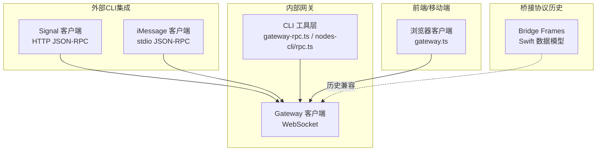
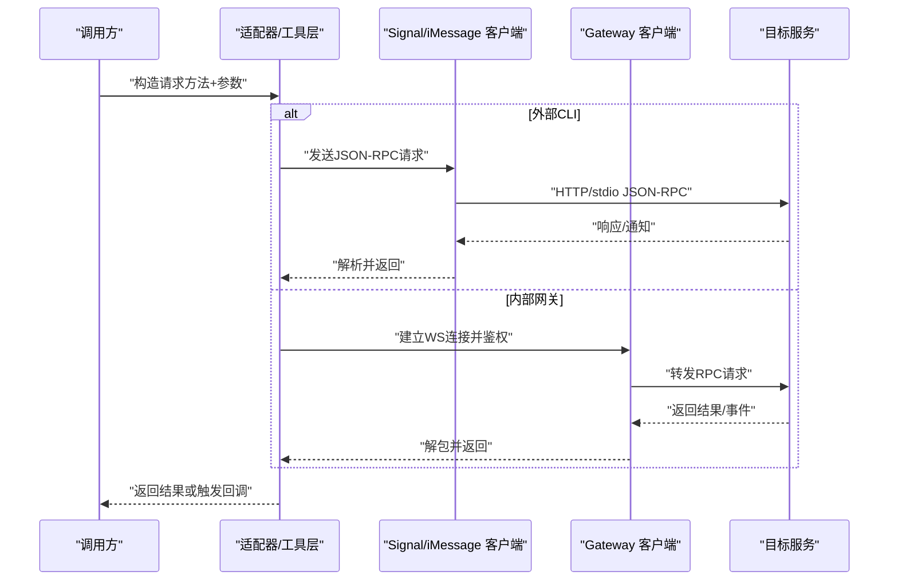
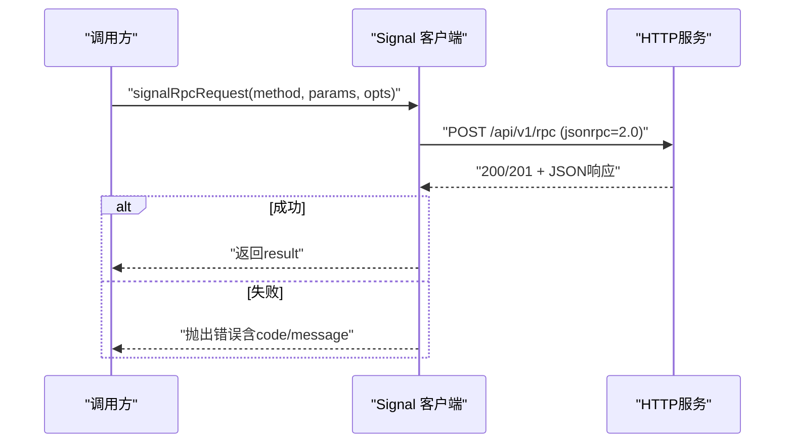
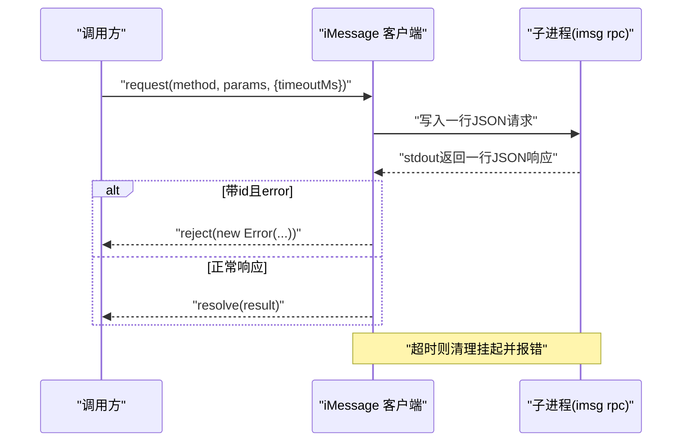
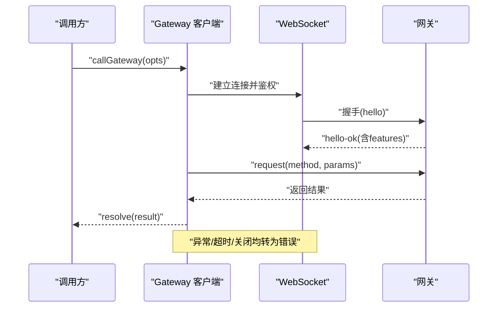
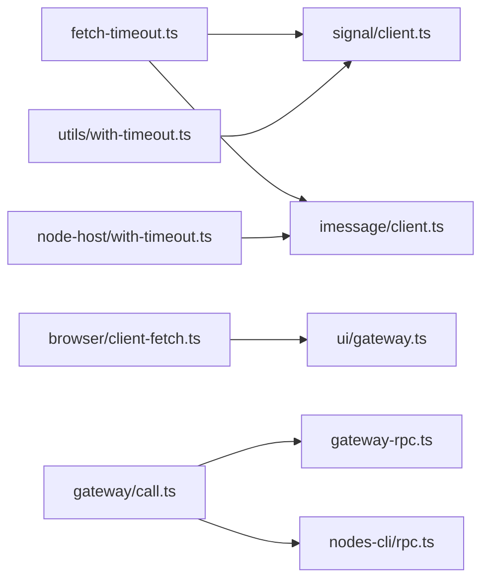

# RPC接口

<cite>
**本文引用的文件**
- [rpc.md](file://docs/reference/rpc.md)
- [bridge-protocol.md](file://docs/gateway/bridge-protocol.md)
- [signal/client.ts](file://src/signal/client.ts)
- [signal/rpc-context.ts](file://src/signal/rpc-context.ts)
- [imessage/client.ts](file://src/imessage/client.ts)
- [gateway/call.ts](file://src/gateway/call.ts)
- [gateway-rpc.ts](file://src/cli/gateway-rpc.ts)
- [nodes-cli/rpc.ts](file://src/cli/nodes-cli/rpc.ts)
- [jsonrpc.ts](file://extensions/acpx/src/runtime-internals/jsonrpc.ts)
- [BridgeFrames.swift](file://apps/shared/OpenClawKit/Sources/OpenClawKit/BridgeFrames.swift)
- [GatewayNodeSession.swift](file://apps/shared/OpenClawKit/Sources/OpenClawKit/GatewayNodeSession.swift)
- [gateway.ts](file://ui/src/ui/gateway.ts)
- [fetch-timeout.ts](file://src/utils/fetch-timeout.ts)
- [with-timeout.ts（Node）](file://src/node-host/with-timeout.ts)
- [with-timeout.ts（通用）](file://src/utils/with-timeout.ts)
- [client-fetch.ts](file://src/browser/client-fetch.ts)
</cite>

## 目录
1. [简介](#简介)
2. [项目结构](#项目结构)
3. [核心组件](#核心组件)
4. [架构总览](#架构总览)
5. [详细组件分析](#详细组件分析)
6. [依赖关系分析](#依赖关系分析)
7. [性能考虑](#性能考虑)
8. [故障排除指南](#故障排除指南)
9. [结论](#结论)
10. [附录](#附录)

## 简介
本文件为 OpenClaw 的远程过程调用（RPC）接口技术参考，覆盖两类外部集成模式与内部网关 RPC 的统一协议。内容包括：
- 调用约定与消息格式
- 参数序列化与结果反序列化规则
- 类型系统与错误传播机制
- 超时与重连策略
- 方法签名、输入输出与业务语义
- 实现示例、性能优化与故障排除
- 版本演进、向后兼容与弃用策略
- 在分布式系统中的作用与设计考量

## 项目结构
围绕 RPC 的关键模块分布如下：
- 外部 CLI 集成：Signal（HTTP JSON-RPC）、iMessage（stdio JSON-RPC）
- 内部网关 RPC：WebSocket 协议，支持鉴权、作用域与超时控制
- 桥接协议（历史遗留）：TCP JSONL，用于节点侧桥接
- 前端与移动端 SDK：对网关连接与 RPC 的封装

图表来源
- [signal/client.ts](file://src/signal/client.ts#L70-L107)
- [imessage/client.ts](file://src/imessage/client.ts#L148-L184)
- [gateway/call.ts](file://src/gateway/call.ts#L737-L753)
- [gateway-rpc.ts](file://src/cli/gateway-rpc.ts#L22-L47)
- [nodes-cli/rpc.ts](file://src/cli/nodes-cli/rpc.ts#L16-L38)
- [BridgeFrames.swift](file://apps/shared/OpenClawKit/Sources/OpenClawKit/BridgeFrames.swift#L1-L262)
- [gateway.ts](file://ui/src/ui/gateway.ts#L105-L152)

章节来源
- [rpc.md](file://docs/reference/rpc.md#L9-L44)
- [signal/client.ts](file://src/signal/client.ts#L1-L216)
- [imessage/client.ts](file://src/imessage/client.ts#L1-L256)
- [gateway/call.ts](file://src/gateway/call.ts#L1-L758)
- [gateway-rpc.ts](file://src/cli/gateway-rpc.ts#L1-L48)
- [nodes-cli/rpc.ts](file://src/cli/nodes-cli/rpc.ts#L1-L97)
- [BridgeFrames.swift](file://apps/shared/OpenClawKit/Sources/OpenClawKit/BridgeFrames.swift#L1-L262)
- [gateway.ts](file://ui/src/ui/gateway.ts#L105-L152)

## 核心组件
- Signal JSON-RPC 客户端：基于 HTTP 的 JSON-RPC 2.0，支持健康检查与事件流。
- iMessage JSON-RPC 客户端：通过子进程 stdio 进行逐行 JSON 对象传输。
- 网关 RPC 客户端：WebSocket 上的统一协议，支持令牌/密码认证、作用域、TLS 指纹校验与超时。
- CLI 工具层：封装网关调用，提供统一的选项与超时配置。
- 桥接协议数据模型：历史遗留的 TCP JSONL 帧结构，用于节点侧桥接。

章节来源
- [signal/client.ts](file://src/signal/client.ts#L5-L28)
- [imessage/client.ts](file://src/imessage/client.ts#L7-L32)
- [gateway/call.ts](file://src/gateway/call.ts#L31-L67)
- [gateway-rpc.ts](file://src/cli/gateway-rpc.ts#L6-L12)
- [nodes-cli/rpc.ts](file://src/cli/nodes-cli/rpc.ts#L9-L14)
- [BridgeFrames.swift](file://apps/shared/OpenClawKit/Sources/OpenClawKit/BridgeFrames.swift#L11-L261)

## 架构总览
下图展示 RPC 的总体交互路径：客户端发起请求，经由适配器或网关层，最终到达目标服务（Signal/iMessage 或内部网关），并返回结果或通知。

图表来源
- [signal/client.ts](file://src/signal/client.ts#L70-L107)
- [imessage/client.ts](file://src/imessage/client.ts#L148-L184)
- [gateway/call.ts](file://src/gateway/call.ts#L605-L677)

## 详细组件分析

### Signal JSON-RPC 客户端
- 调用约定
  - 使用 JSON-RPC 2.0，请求体包含方法名、参数与自增 ID。
  - 默认超时为固定毫秒数；可通过选项覆盖。
  - 健康检查端点与事件流端点分别用于探活与订阅。
- 序列化与反序列化
  - 请求体序列化为 JSON 字符串；响应按字段存在性校验，确保包含 result 或 error。
  - 错误对象包含可选 code、message、data。
- 错误传播
  - 解析失败、空响应、无效响应包均抛出明确错误。
  - 当响应包含 error 字段时，抛出带 code 与 message 的异常。
- 超时与重试
  - 使用带超时的 fetch 包装；超时将中止请求。
  - 未显式重试逻辑，建议上层根据场景进行重试。
- 方法与业务语义
  - 支持健康检查与事件流订阅；核心 RPC 方法通过统一请求函数调用。
- 示例
  - 参考调用路径：[signalRpcRequest](file://src/signal/client.ts#L70-L107)
  - 健康检查：[signalCheck](file://src/signal/client.ts#L109-L132)
  - 事件流：[streamSignalEvents](file://src/signal/client.ts#L134-L216)

图表来源
- [signal/client.ts](file://src/signal/client.ts#L70-L107)

章节来源
- [signal/client.ts](file://src/signal/client.ts#L5-L28)
- [signal/client.ts](file://src/signal/client.ts#L70-L107)
- [signal/client.ts](file://src/signal/client.ts#L109-L132)
- [signal/client.ts](file://src/signal/client.ts#L134-L216)
- [signal/rpc-context.ts](file://src/signal/rpc-context.ts#L4-L24)

### iMessage JSON-RPC 客户端
- 调用约定
  - 子进程以“rpc”命令启动，stdin/stdout 逐行传输 JSON 对象。
  - 请求包含 jsonrpc、id、method、params；响应通过 id 关联。
- 序列化与反序列化
  - 请求序列化为单行 JSON；响应按行解析，严格区分通知与响应。
- 错误传播
  - 子进程退出码非零或关闭时，挂起请求全部失败。
  - 响应 error 字段包含 code、message、data，组合为用户可读信息。
- 超时与生命周期
  - 每个请求可设置超时；超时后取消挂起并报错。
  - 提供启动/停止与等待关闭的生命周期管理。
- 方法与业务语义
  - 支持订阅通知、发送消息、列出聊天等；具体方法见文档说明。

图表来源
- [imessage/client.ts](file://src/imessage/client.ts#L148-L184)
- [imessage/client.ts](file://src/imessage/client.ts#L186-L236)

章节来源
- [imessage/client.ts](file://src/imessage/client.ts#L48-L68)
- [imessage/client.ts](file://src/imessage/client.ts#L148-L184)
- [imessage/client.ts](file://src/imessage/client.ts#L186-L236)

### 网关 RPC 客户端（WebSocket）
- 调用约定
  - 通过 WebSocket 连接网关，支持令牌或密码认证。
  - 支持最小/最大协议版本协商（当前默认使用当前协议版本）。
  - 可指定作用域、实例 ID、平台、客户端名称/模式等。
- 序列化与反序列化
  - 请求与响应遵循统一帧结构；成功后返回结果对象。
- 错误传播
  - 连接异常、关闭码、超时均转换为可读错误信息。
  - 若网关不支持所需方法，抛出明确提示。
- 超时与重连
  - 统一超时控制；连接断开后自动指数回退重连（前端示例）。
- 方法与业务语义
  - 通过统一调用入口分派到不同客户端模式（CLI/后台）与作用域策略。

图表来源
- [gateway/call.ts](file://src/gateway/call.ts#L605-L677)
- [gateway/call.ts](file://src/gateway/call.ts#L737-L753)

章节来源
- [gateway/call.ts](file://src/gateway/call.ts#L31-L67)
- [gateway/call.ts](file://src/gateway/call.ts#L257-L265)
- [gateway/call.ts](file://src/gateway/call.ts#L605-L677)
- [gateway/call.ts](file://src/gateway/call.ts#L737-L753)

### CLI 工具层（网关）
- 功能
  - 为 CLI 提供统一的网关调用入口，支持 URL、令牌、超时等选项。
  - 封装节点工具链调用，支持幂等键与超时参数。
- 超时与进度
  - 统一超时配置；根据输出格式决定是否显示进度条。

章节来源
- [gateway-rpc.ts](file://src/cli/gateway-rpc.ts#L6-L12)
- [gateway-rpc.ts](file://src/cli/gateway-rpc.ts#L22-L47)
- [nodes-cli/rpc.ts](file://src/cli/nodes-cli/rpc.ts#L9-L14)
- [nodes-cli/rpc.ts](file://src/cli/nodes-cli/rpc.ts#L16-L38)
- [nodes-cli/rpc.ts](file://src/cli/nodes-cli/rpc.ts#L40-L57)

### 桥接协议（历史遗留）
- 传输与帧
  - TCP JSONL；包含 hello/pair-request/pair-ok/invoke/invoke-res/req/res/event/ping/pong/error 等帧。
- 作用域与安全
  - 仅暴露有限方法集；通过配对与节点令牌控制接入。
- 版本演进
  - 当前为隐式 v1；后续变更需引入显式版本字段以保证向后兼容。

章节来源
- [bridge-protocol.md](file://docs/gateway/bridge-protocol.md#L10-L92)
- [BridgeFrames.swift](file://apps/shared/OpenClawKit/Sources/OpenClawKit/BridgeFrames.swift#L11-L261)

## 依赖关系分析
- 适配器层依赖通用网络与超时工具
  - fetch 超时包装：[fetchWithTimeout](file://src/utils/fetch-timeout.ts#L24-L37)
  - 通用超时工具：[withTimeout（通用）](file://src/utils/with-timeout.ts#L1-L14)
  - Node 环境超时工具：[withTimeout（Node）](file://src/node-host/with-timeout.ts#L1-L35)
  - 浏览器环境超时工具：[fetchHttp](file://src/browser/client-fetch.ts#L130-L161)
- 网关客户端依赖配置解析、TLS 与协议版本
  - 配置解析与连接细节构建：[buildGatewayConnectionDetails](file://src/gateway/call.ts#L130-L219)
  - 协议版本与作用域：[PROTOCOL_VERSION](file://src/gateway/call.ts#L29)、[executeGatewayRequestWithScopes](file://src/gateway/call.ts#L595-L677)

图表来源
- [fetch-timeout.ts](file://src/utils/fetch-timeout.ts#L24-L37)
- [with-timeout.ts（通用）](file://src/utils/with-timeout.ts#L1-L14)
- [with-timeout.ts（Node）](file://src/node-host/with-timeout.ts#L1-L35)
- [client-fetch.ts](file://src/browser/client-fetch.ts#L130-L161)
- [signal/client.ts](file://src/signal/client.ts#L70-L107)
- [imessage/client.ts](file://src/imessage/client.ts#L148-L184)
- [gateway/call.ts](file://src/gateway/call.ts#L605-L677)
- [gateway-rpc.ts](file://src/cli/gateway-rpc.ts#L22-L47)
- [nodes-cli/rpc.ts](file://src/cli/nodes-cli/rpc.ts#L16-L38)
- [gateway.ts](file://ui/src/ui/gateway.ts#L105-L152)

章节来源
- [fetch-timeout.ts](file://src/utils/fetch-timeout.ts#L1-L37)
- [with-timeout.ts（通用）](file://src/utils/with-timeout.ts#L1-L14)
- [with-timeout.ts（Node）](file://src/node-host/with-timeout.ts#L1-L35)
- [client-fetch.ts](file://src/browser/client-fetch.ts#L130-L161)
- [signal/client.ts](file://src/signal/client.ts#L70-L107)
- [imessage/client.ts](file://src/imessage/client.ts#L148-L184)
- [gateway/call.ts](file://src/gateway/call.ts#L605-L677)
- [gateway-rpc.ts](file://src/cli/gateway-rpc.ts#L22-L47)
- [nodes-cli/rpc.ts](file://src/cli/nodes-cli/rpc.ts#L16-L38)
- [gateway.ts](file://ui/src/ui/gateway.ts#L105-L152)

## 性能考虑
- 超时与背压
  - 为每类 RPC 明确设置合理超时阈值，避免长时间阻塞。
  - 对于长轮询/事件流，采用可中断的读取与合理的缓冲策略。
- 连接复用与重连
  - 网关侧建议复用连接；断线后采用指数回退重连，避免风暴。
  - 前端示例展示了回退策略与关闭后的清理。
- 幂等性与去重
  - 节点调用支持幂等键，避免重复执行。
- 资源释放
  - 子进程/套接字/定时器在错误或关闭时及时清理。

章节来源
- [gateway.ts](file://ui/src/ui/gateway.ts#L145-L152)
- [nodes-cli/rpc.ts](file://src/cli/nodes-cli/rpc.ts#L40-L57)
- [imessage/client.ts](file://src/imessage/client.ts#L121-L142)

## 故障排除指南
- 信号（Signal）相关
  - 健康检查失败：确认基础 URL、网络可达性与超时设置。
  - 事件流异常：检查 SSE 订阅 URL 与账号参数。
  - 响应解析失败：检查返回体是否为空或非 JSON。
- iMessage 相关
  - 子进程启动失败：确认 CLI 路径与数据库参数；测试环境会拒绝启动。
  - 超时：适当增大超时阈值；检查系统负载。
  - 退出码/关闭：查看错误信息并重试或重启。
- 网关相关
  - URL 不安全：确保使用 wss:// 或本地回环；必要时通过隧道访问。
  - 凭据缺失：当 URL 被 CLI/环境覆盖时，必须显式提供凭据。
  - 方法不支持：更新网关或避免使用 SecretRef。
  - 未授权：检查令牌/密码与配对状态。
- 通用
  - 超时与中止：利用 AbortController 与超时工具，确保资源释放。
  - 错误信息拼接：关注 code、message、data 细节，便于定位问题。

章节来源
- [signal/client.ts](file://src/signal/client.ts#L109-L132)
- [signal/client.ts](file://src/signal/client.ts#L134-L216)
- [imessage/client.ts](file://src/imessage/client.ts#L70-L119)
- [imessage/client.ts](file://src/imessage/client.ts#L186-L236)
- [gateway/call.ts](file://src/gateway/call.ts#L182-L200)
- [gateway/call.ts](file://src/gateway/call.ts#L694-L694)
- [gateway/call.ts](file://src/gateway/call.ts#L566-L593)
- [fetch-timeout.ts](file://src/utils/fetch-timeout.ts#L24-L37)
- [with-timeout.ts（通用）](file://src/utils/with-timeout.ts#L1-L14)
- [with-timeout.ts（Node）](file://src/node-host/with-timeout.ts#L1-L35)

## 结论
OpenClaw 的 RPC 接口在外部 CLI 与内部网关之间提供了清晰的抽象与一致的错误传播机制。通过严格的超时控制、可配置的鉴权与作用域、以及面向分布式系统的重连与幂等策略，系统在可用性与安全性之间取得平衡。对于新场景，优先采用统一的网关协议；历史遗留桥接协议仅作为兼容保留。

## 附录

### 类型系统与消息格式
- JSON-RPC 2.0
  - 请求：包含 jsonrpc、method、params、id。
  - 响应：包含 jsonrpc、result 或 error，且二者互斥。
- Signal/iMessage
  - 两者均遵循上述规范；Signal 通过 HTTP，iMessage 通过子进程 stdio。
- 网关（WebSocket）
  - 采用统一帧结构；成功返回 payload，错误返回结构化错误对象。
- 桥接协议（历史）
  - TCP JSONL，包含多种帧类型（req/res、invoke/invoke-res、event、ping/pong、error 等）。

章节来源
- [jsonrpc.ts](file://extensions/acpx/src/runtime-internals/jsonrpc.ts#L3-L47)
- [signal/client.ts](file://src/signal/client.ts#L16-L21)
- [imessage/client.ts](file://src/imessage/client.ts#L13-L20)
- [BridgeFrames.swift](file://apps/shared/OpenClawKit/Sources/OpenClawKit/BridgeFrames.swift#L217-L261)

### 错误传播与超时机制
- 超时
  - fetch 超时包装：[fetchWithTimeout](file://src/utils/fetch-timeout.ts#L24-L37)
  - 通用与 Node 超时工具：[withTimeout（通用）](file://src/utils/with-timeout.ts#L1-L14)、[withTimeout（Node）](file://src/node-host/with-timeout.ts#L1-L35)
  - 浏览器环境：[fetchHttp](file://src/browser/client-fetch.ts#L130-L161)
- 错误
  - Signal：响应 error 字段时抛出带 code/message 的异常。
  - iMessage：解析失败、子进程异常、超时均抛错；error 字段拼接详细信息。
  - 网关：连接关闭、超时、方法不支持、URL 不安全等均有明确错误信息。

章节来源
- [signal/client.ts](file://src/signal/client.ts#L50-L68)
- [signal/client.ts](file://src/signal/client.ts#L101-L106)
- [imessage/client.ts](file://src/imessage/client.ts#L186-L236)
- [imessage/client.ts](file://src/imessage/client.ts#L207-L224)
- [gateway/call.ts](file://src/gateway/call.ts#L547-L564)
- [gateway/call.ts](file://src/gateway/call.ts#L566-L593)
- [fetch-timeout.ts](file://src/utils/fetch-timeout.ts#L24-L37)
- [with-timeout.ts（通用）](file://src/utils/with-timeout.ts#L1-L14)
- [with-timeout.ts（Node）](file://src/node-host/with-timeout.ts#L1-L35)
- [client-fetch.ts](file://src/browser/client-fetch.ts#L130-L161)

### 版本演进、向后兼容与弃用策略
- 网关协议
  - 通过最小/最大协议版本字段进行演进；当前默认使用当前版本。
- 桥接协议
  - 当前为隐式 v1；任何破坏性变更前需引入显式版本字段以保证向后兼容。
- 弃用策略
  - 历史遗留桥接不再默认启用；新节点应使用统一网关协议。
  - CLI 工具层提供统一入口，逐步替代旧适配器。

章节来源
- [gateway/call.ts](file://src/gateway/call.ts#L638-L640)
- [bridge-protocol.md](file://docs/gateway/bridge-protocol.md#L88-L92)

### 分布式系统中的作用与设计考量
- 安全边界
  - 网关协议将敏感操作限制在受控作用域内；桥接协议仅暴露有限方法集。
- 发现与接入
  - 网关支持多客户端模式与配对流程；桥接协议支持 Bonjour 发现与尾网连接。
- 传输选择
  - 新场景优先使用 WebSocket；历史场景保留 TCP JSONL 以兼容旧节点。
- 可观测性与可观测
  - 统一错误信息与连接细节；前端示例提供指数回退与关闭处理。

章节来源
- [bridge-protocol.md](file://docs/gateway/bridge-protocol.md#L21-L30)
- [bridge-protocol.md](file://docs/gateway/bridge-protocol.md#L80-L86)
- [gateway.ts](file://ui/src/ui/gateway.ts#L145-L152)
- [gateway/call.ts](file://src/gateway/call.ts#L182-L200)