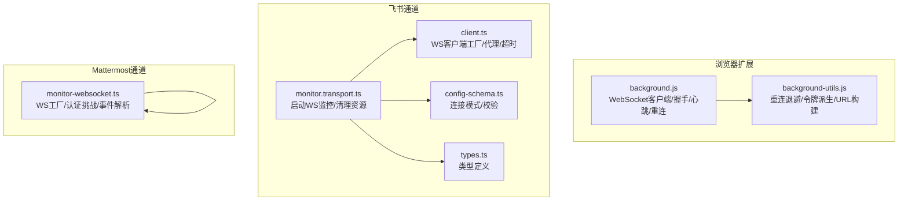
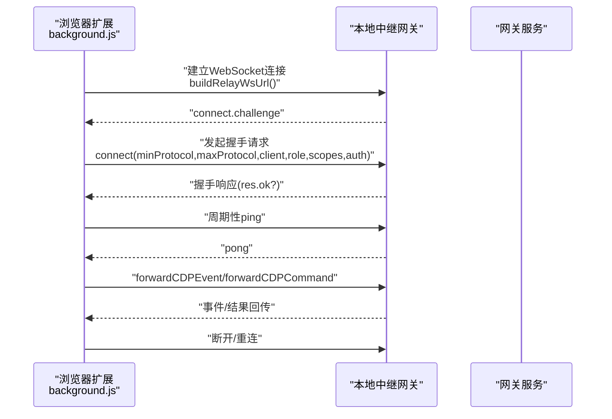
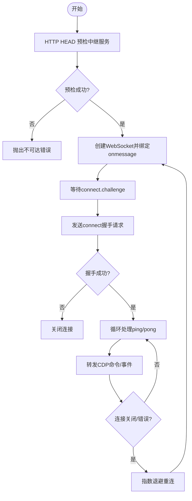
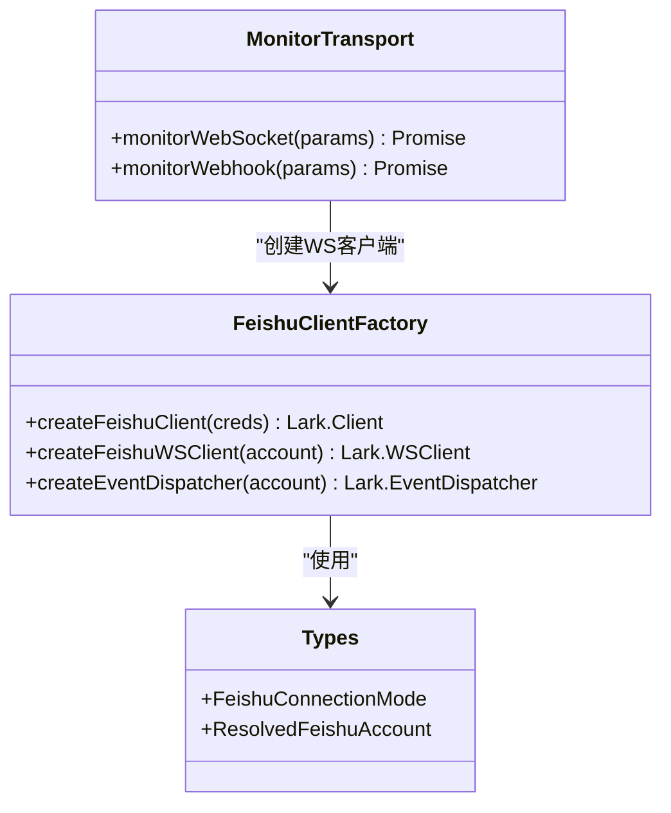
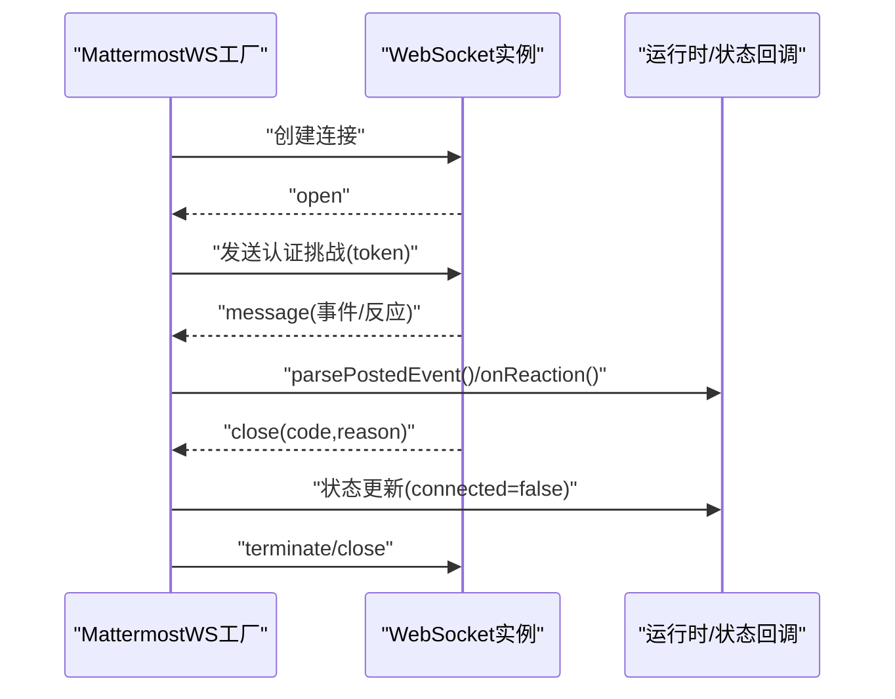
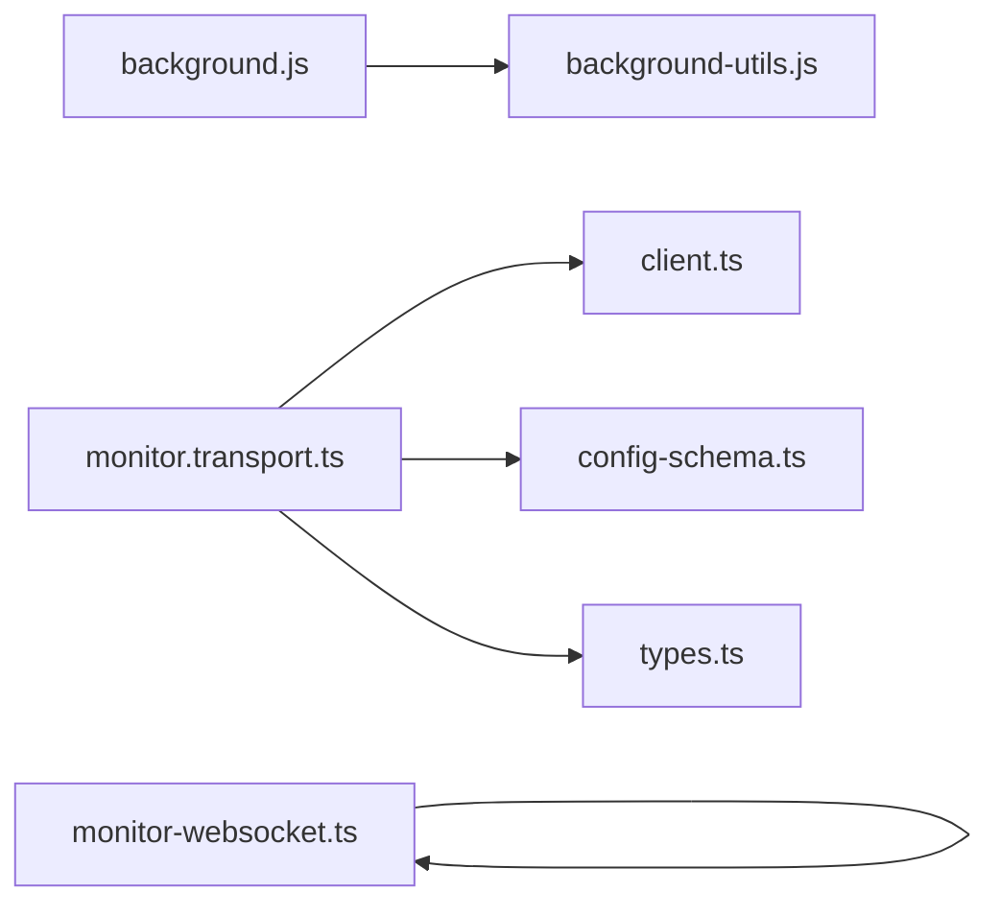

# WebSocket协议

<cite>
**本文引用的文件**
- [assets/chrome-extension/background.js](file://assets/chrome-extension/background.js)
- [assets/chrome-extension/background-utils.js](file://assets/chrome-extension/background-utils.js)
- [extensions/feishu/src/monitor.transport.ts](file://extensions/feishu/src/monitor.transport.ts)
- [extensions/feishu/src/client.ts](file://extensions/feishu/src/client.ts)
- [extensions/feishu/src/config-schema.ts](file://extensions/feishu/src/config-schema.ts)
- [extensions/feishu/src/types.ts](file://extensions/feishu/src/types.ts)
- [extensions/mattermost/src/mattermost/monitor-websocket.ts](file://extensions/mattermost/src/mattermost/monitor-websocket.ts)
</cite>

## 目录
1. [引言](#引言)
2. [项目结构](#项目结构)
3. [核心组件](#核心组件)
4. [架构总览](#架构总览)
5. [详细组件分析](#详细组件分析)
6. [依赖关系分析](#依赖关系分析)
7. [性能考量](#性能考量)
8. [故障排查指南](#故障排查指南)
9. [结论](#结论)
10. [附录](#附录)

## 引言
本文件系统化梳理 OpenClaw 的 WebSocket 协议与实现，覆盖连接建立流程、消息格式规范、事件类型定义、实时交互模式、认证与心跳保活、错误处理与重连策略，并提供跨平台（浏览器扩展、飞书、Mattermost）的客户端实现要点与最佳实践。同时说明协议版本兼容性与向后兼容性保障策略，帮助开发者快速集成与稳定运行。

## 项目结构
围绕 WebSocket 的实现，仓库中主要涉及三类模块：
- 浏览器扩展侧：负责本地中继网关的 WebSocket 客户端、握手与心跳、断线重连与状态持久化。
- 飞书通道：基于 Lark SDK 的 WebSocket 客户端封装，支持多账号、代理、超时控制与事件分发。
- Mattermost 通道：自研 WebSocket 客户端，实现认证挑战、事件解析与错误处理。

图表来源
- [assets/chrome-extension/background.js](file://assets/chrome-extension/background.js#L130-L191)
- [assets/chrome-extension/background-utils.js](file://assets/chrome-extension/background-utils.js#L31-L40)
- [extensions/feishu/src/monitor.transport.ts](file://extensions/feishu/src/monitor.transport.ts#L29-L72)
- [extensions/feishu/src/client.ts](file://extensions/feishu/src/client.ts#L153-L168)
- [extensions/feishu/src/config-schema.ts](file://extensions/feishu/src/config-schema.ts#L14-L15)
- [extensions/mattermost/src/mattermost/monitor-websocket.ts](file://extensions/mattermost/src/mattermost/monitor-websocket.ts#L59-L60)

章节来源
- [assets/chrome-extension/background.js](file://assets/chrome-extension/background.js#L1-L120)
- [extensions/feishu/src/monitor.transport.ts](file://extensions/feishu/src/monitor.transport.ts#L1-L72)
- [extensions/mattermost/src/mattermost/monitor-websocket.ts](file://extensions/mattermost/src/mattermost/monitor-websocket.ts#L1-L60)

## 核心组件
- 浏览器扩展 WebSocket 客户端：负责与本地中继网关建立 WebSocket 连接，执行握手、处理 ping/pong 心跳、转发 CDP 命令与事件、管理断线重连与标签页会话映射。
- 飞书 WebSocket 客户端：通过 Lark SDK 创建 WS 客户端，注入代理与超时控制；由监控器启动并绑定事件分发器。
- Mattermost WebSocket 客户端：自研工厂创建连接，发送认证挑战，解析 posted/reaction 等事件，处理关闭与错误。

章节来源
- [assets/chrome-extension/background.js](file://assets/chrome-extension/background.js#L130-L191)
- [extensions/feishu/src/client.ts](file://extensions/feishu/src/client.ts#L153-L168)
- [extensions/mattermost/src/mattermost/monitor-websocket.ts](file://extensions/mattermost/src/mattermost/monitor-websocket.ts#L101-L143)

## 架构总览
OpenClaw 的 WebSocket 体系由“本地中继网关”与“远端通道”构成：
- 本地中继网关：浏览器扩展作为客户端，通过 token 认证接入，维持长连接，转发调试器命令与事件。
- 远端通道：飞书、Mattermost 等第三方平台通过各自的 WebSocket 或 Webhook 接入，由 OpenClaw 插件侧监听并转换为统一事件模型。

图表来源
- [assets/chrome-extension/background.js](file://assets/chrome-extension/background.js#L407-L460)
- [assets/chrome-extension/background-utils.js](file://assets/chrome-extension/background-utils.js#L31-L40)

## 详细组件分析

### 浏览器扩展 WebSocket 客户端（本地中继）
- 连接建立
  - 通过工具函数生成带 HMAC 令牌的 WebSocket URL，确保仅本地可访问。
  - 建立连接前进行 HTTP HEAD 预检，确认中继服务可达。
  - 绑定 onmessage 在 open 之前，避免错过首个帧（如 connect.challenge）。
- 握手与认证
  - 发送 connect 请求，声明协议版本范围、客户端信息、角色与权限范围等。
  - 若收到 connect.challenge，立即开始握手；若握手被拒，主动关闭连接。
- 心跳与保活
  - 收到 ping 后立即回 pong，维持连接活跃。
- 消息与事件
  - 转发 CDP 命令/事件至中继网关；对请求使用超时与唯一 ID 管理。
- 断线重连
  - 使用指数退避加抖动策略；根据错误类型决定是否继续重试；重连成功后重新宣告已附着标签页。

图表来源
- [assets/chrome-extension/background.js](file://assets/chrome-extension/background.js#L130-L191)
- [assets/chrome-extension/background.js](file://assets/chrome-extension/background.js#L398-L460)
- [assets/chrome-extension/background-utils.js](file://assets/chrome-extension/background-utils.js#L1-L49)

章节来源
- [assets/chrome-extension/background.js](file://assets/chrome-extension/background.js#L130-L191)
- [assets/chrome-extension/background.js](file://assets/chrome-extension/background.js#L398-L460)
- [assets/chrome-extension/background-utils.js](file://assets/chrome-extension/background-utils.js#L1-L49)

### 飞书 WebSocket 客户端（第三方通道）
- 客户端工厂
  - 基于 Lark SDK 创建 WS 客户端，支持代理、日志级别与域名解析。
  - 注入超时感知的 HTTP 实例，避免第三方 API 超时导致死锁。
- 监控器
  - 启动 WS 客户端并绑定事件分发器；在中断信号或异常时清理资源。
- 配置与模式
  - 支持连接模式枚举（websocket/webhook），默认 websocket。
  - 对 webhook 模式要求配置 verificationToken。

图表来源
- [extensions/feishu/src/client.ts](file://extensions/feishu/src/client.ts#L111-L168)
- [extensions/feishu/src/monitor.transport.ts](file://extensions/feishu/src/monitor.transport.ts#L29-L72)
- [extensions/feishu/src/types.ts](file://extensions/feishu/src/types.ts#L14-L36)

章节来源
- [extensions/feishu/src/client.ts](file://extensions/feishu/src/client.ts#L111-L168)
- [extensions/feishu/src/monitor.transport.ts](file://extensions/feishu/src/monitor.transport.ts#L29-L72)
- [extensions/feishu/src/config-schema.ts](file://extensions/feishu/src/config-schema.ts#L14-L15)
- [extensions/feishu/src/types.ts](file://extensions/feishu/src/types.ts#L14-L36)

### Mattermost WebSocket 客户端（第三方通道）
- 工厂与连接
  - 默认工厂创建 ws 连接；支持注入自定义工厂以便测试或适配。
  - 发送认证挑战（authentication_challenge）携带 bot token。
- 事件解析
  - 解析 posted/reaction 等事件，分别触发对应处理器。
  - 将原始数据转为字符串后解析 JSON，增强健壮性。
- 错误与关闭
  - 未打开即关闭视为异常；错误时记录并尝试关闭连接。

图表来源
- [extensions/mattermost/src/mattermost/monitor-websocket.ts](file://extensions/mattermost/src/mattermost/monitor-websocket.ts#L101-L211)

章节来源
- [extensions/mattermost/src/mattermost/monitor-websocket.ts](file://extensions/mattermost/src/mattermost/monitor-websocket.ts#L59-L222)

## 依赖关系分析
- 浏览器扩展依赖本地中继网关提供的 WebSocket 服务，通过 HMAC 令牌与版本协商完成握手。
- 飞书通道依赖 Lark SDK 的 WS 客户端与事件分发器，结合配置模式选择 WebSocket 或 Webhook。
- Mattermost 通道自研 WS 客户端，遵循统一的认证挑战与事件解析流程。

图表来源
- [assets/chrome-extension/background.js](file://assets/chrome-extension/background.js#L1-L50)
- [assets/chrome-extension/background-utils.js](file://assets/chrome-extension/background-utils.js#L1-L49)
- [extensions/feishu/src/monitor.transport.ts](file://extensions/feishu/src/monitor.transport.ts#L1-L72)
- [extensions/feishu/src/client.ts](file://extensions/feishu/src/client.ts#L1-L60)
- [extensions/mattermost/src/mattermost/monitor-websocket.ts](file://extensions/mattermost/src/mattermost/monitor-websocket.ts#L1-L60)

章节来源
- [assets/chrome-extension/background.js](file://assets/chrome-extension/background.js#L1-L120)
- [extensions/feishu/src/monitor.transport.ts](file://extensions/feishu/src/monitor.transport.ts#L1-L72)
- [extensions/mattermost/src/mattermost/monitor-websocket.ts](file://extensions/mattermost/src/mattermost/monitor-websocket.ts#L1-L60)

## 性能考量
- 连接预检：浏览器扩展在建立 WS 之前进行 HTTP HEAD 预检，降低无效连接成本。
- 超时与代理：飞书 WS 客户端注入超时感知 HTTP 实例并支持代理，避免第三方慢响应阻塞。
- 指数退避：浏览器扩展采用指数退避加抖动策略，限制最大等待时间，平衡恢复速度与资源消耗。
- 事件解析健壮性：Mattermost 通道先将二进制数据转为字符串再解析，提升容错能力。

章节来源
- [assets/chrome-extension/background.js](file://assets/chrome-extension/background.js#L140-L146)
- [extensions/feishu/src/client.ts](file://extensions/feishu/src/client.ts#L44-L61)
- [assets/chrome-extension/background-utils.js](file://assets/chrome-extension/background-utils.js#L1-L12)
- [extensions/mattermost/src/mattermost/monitor-websocket.ts](file://extensions/mattermost/src/mattermost/monitor-websocket.ts#L88-L99)

## 故障排查指南
- 握手失败
  - 现象：收到握手拒绝或 connect.challenge 后关闭连接。
  - 处理：检查令牌、角色与权限范围；确认网关版本范围匹配。
- 连接不可达
  - 现象：预检失败或连接超时。
  - 处理：确认本地中继服务运行、端口正确、防火墙放行。
- 心跳异常
  - 现象：长时间无响应或频繁断开。
  - 处理：检查网络质量与代理设置；验证 ping/pong 是否正常往返。
- 重连循环
  - 现象：持续指数退避重连。
  - 处理：查看不可重试错误（如缺少令牌）；修正配置后手动触发重连。
- 事件丢失
  - 现象：首次帧未被及时处理。
  - 处理：确保 onmessage 在 open 之前绑定，避免竞态。

章节来源
- [assets/chrome-extension/background.js](file://assets/chrome-extension/background.js#L157-L171)
- [assets/chrome-extension/background.js](file://assets/chrome-extension/background.js#L407-L432)
- [assets/chrome-extension/background.js](file://assets/chrome-extension/background.js#L220-L247)
- [assets/chrome-extension/background-utils.js](file://assets/chrome-extension/background-utils.js#L42-L49)

## 结论
OpenClaw 的 WebSocket 协议以“本地中继网关 + 第三方通道”为核心，通过严格的握手、心跳与重连机制保障稳定性；在飞书与 Mattermost 等通道上实现了统一的事件模型与错误处理。建议在生产环境启用预检、超时与代理支持，并结合指数退避策略优化用户体验与系统韧性。

## 附录

### 消息格式与事件类型（浏览器扩展）
- 握手请求
  - 字段概览：type、id、method、params（包含 minProtocol、maxProtocol、client、role、scopes、caps、commands、nonce、auth）。
  - 用途：与本地中继网关建立受控连接。
- 握手响应
  - 字段概览：type、id、ok、result/error。
  - 用途：确认握手结果与错误详情。
- 心跳
  - 入站：method="ping"。
  - 出站：method="pong"。
- 事件与命令转发
  - 入站：forwardCDPEvent/forwardCDPCommand。
  - 出站：按请求 id 返回 result 或 error。

章节来源
- [assets/chrome-extension/background.js](file://assets/chrome-extension/background.js#L339-L364)
- [assets/chrome-extension/background.js](file://assets/chrome-extension/background.js#L407-L460)

### 飞书通道配置与模式
- 连接模式
  - 枚举值：websocket、webhook，默认 websocket。
  - webhook 模式需配置 verificationToken。
- 多账号支持
  - 支持 per-account 与全局配置合并，域名可选 lark/feishu/私有部署 URL。
- 客户端特性
  - 代理支持、日志级别、超时注入、事件分发器。

章节来源
- [extensions/feishu/src/config-schema.ts](file://extensions/feishu/src/config-schema.ts#L14-L15)
- [extensions/feishu/src/config-schema.ts](file://extensions/feishu/src/config-schema.ts#L200-L227)
- [extensions/feishu/src/client.ts](file://extensions/feishu/src/client.ts#L10-L18)
- [extensions/feishu/src/client.ts](file://extensions/feishu/src/client.ts#L153-L168)

### Mattermost 通道事件与认证
- 认证挑战
  - 发送 action="authentication_challenge" 并附带 bot token。
- 事件解析
  - posted：解析 post 内容并触发 onPosted。
  - reaction_added / reaction_removed：触发 onReaction。
- 关闭与错误
  - 未打开即关闭抛出自定义异常；错误时记录并尝试关闭连接。

章节来源
- [extensions/mattermost/src/mattermost/monitor-websocket.ts](file://extensions/mattermost/src/mattermost/monitor-websocket.ts#L101-L211)

### 协议版本兼容性与向后兼容
- 版本协商
  - 浏览器扩展握手请求明确声明 minProtocol/maxProtocol，确保两端兼容。
- 配置向后兼容
  - 飞书通道保留旧字段与默认值，避免升级导致的配置失效。
- 模式切换
  - 支持 websocket/webhook 切换，配合 verificationToken 校验保障安全。

章节来源
- [assets/chrome-extension/background.js](file://assets/chrome-extension/background.js#L348-L349)
- [extensions/feishu/src/config-schema.ts](file://extensions/feishu/src/config-schema.ts#L209-L210)
- [extensions/feishu/src/config-schema.ts](file://extensions/feishu/src/config-schema.ts#L241-L250)