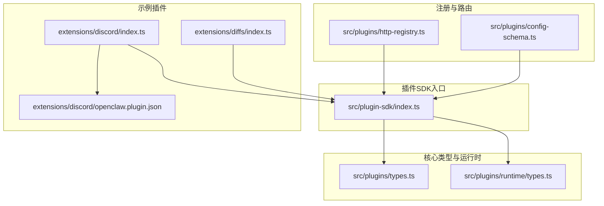
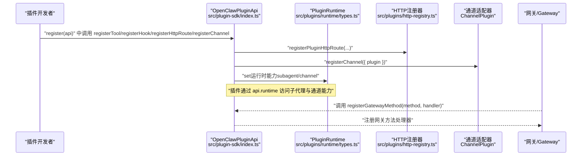
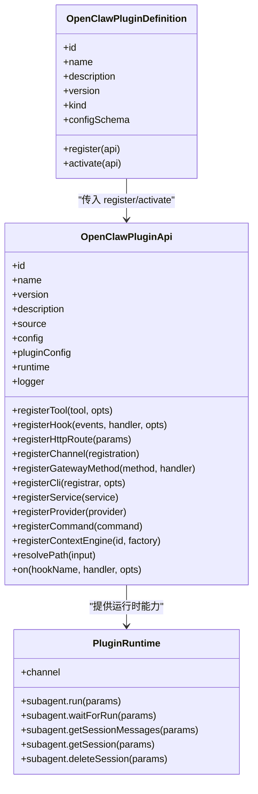
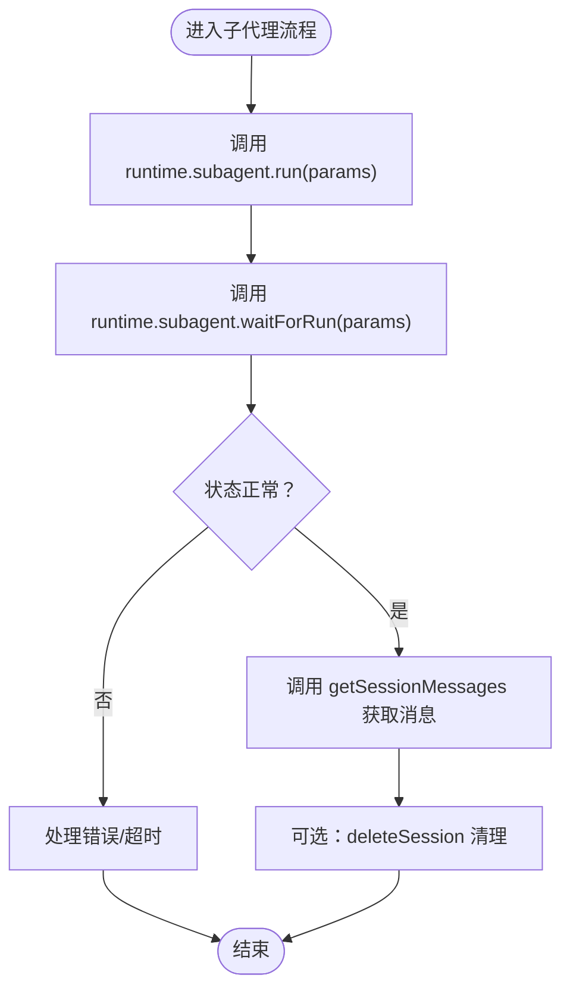
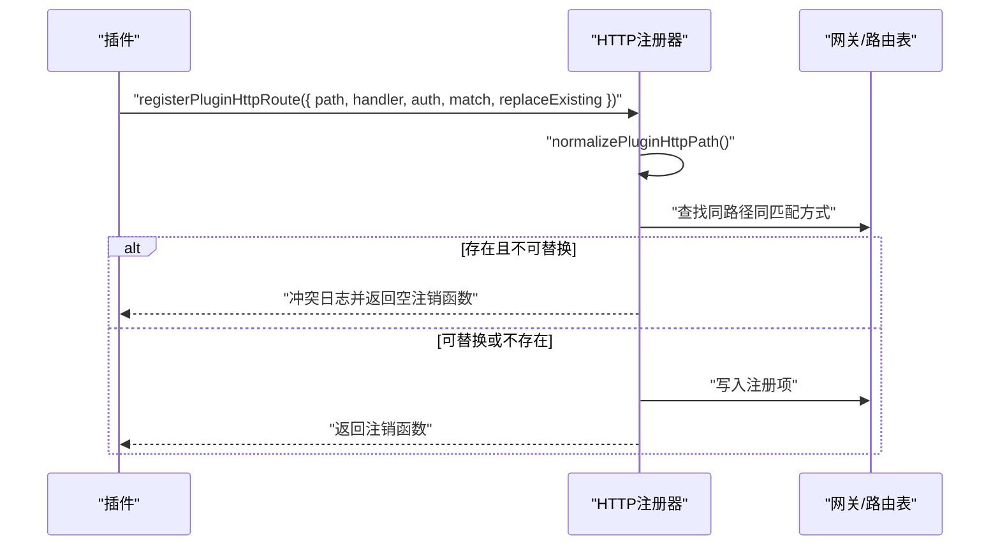
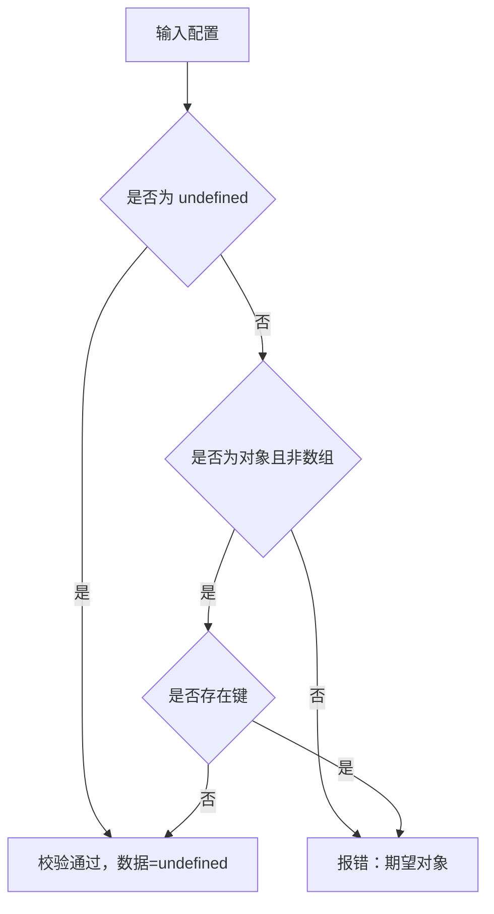
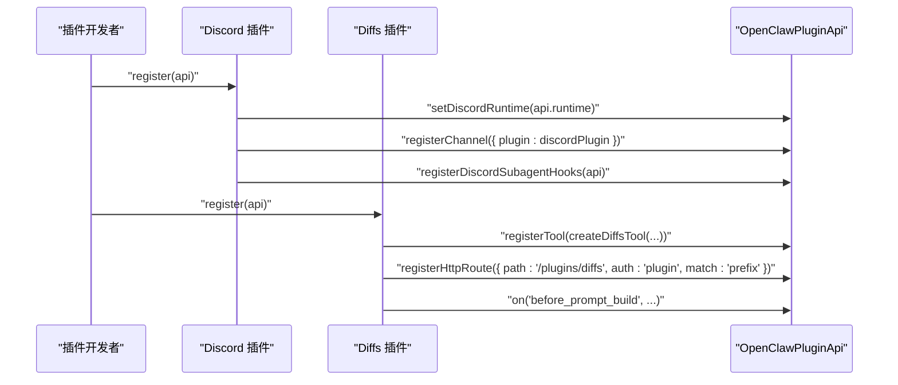
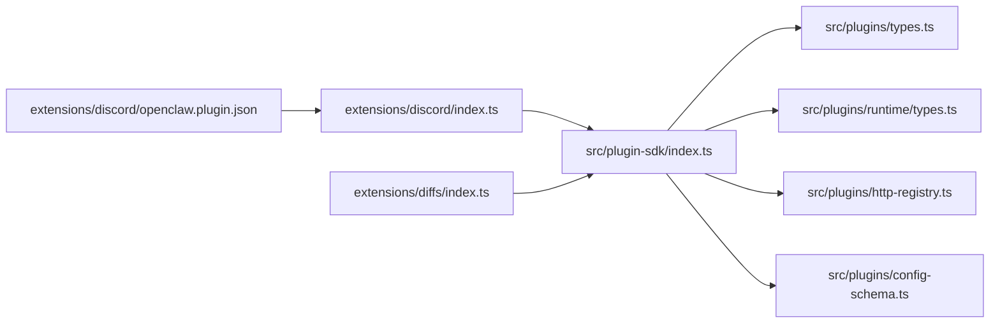

# 插件SDK

<cite>
**本文引用的文件**   
- [src/plugin-sdk/index.ts](file://src/plugin-sdk/index.ts)
- [src/plugins/types.ts](file://src/plugins/types.ts)
- [src/plugins/runtime/types.ts](file://src/plugins/runtime/types.ts)
- [extensions/discord/index.ts](file://extensions/discord/index.ts)
- [extensions/diffs/index.ts](file://extensions/diffs/index.ts)
- [src/plugins/config-schema.ts](file://src/plugins/config-schema.ts)
- [src/plugins/http-registry.ts](file://src/plugins/http-registry.ts)
- [extensions/discord/openclaw.plugin.json](file://extensions/discord/openclaw.plugin.json)
</cite>

## 目录
1. [简介](#简介)
2. [项目结构](#项目结构)
3. [核心组件](#核心组件)
4. [架构总览](#架构总览)
5. [详细组件分析](#详细组件分析)
6. [依赖关系分析](#依赖关系分析)
7. [性能考量](#性能考量)
8. [故障排查指南](#故障排查指南)
9. [结论](#结论)
10. [附录](#附录)

## 简介
本文件为 OpenClaw 插件开发 SDK 的权威 API 参考与实践指南。内容覆盖插件接口定义、生命周期钩子、运行时环境、HTTP 路由与网关方法注册、事件监听、工具扩展、权限与安全边界、沙箱限制、版本兼容与依赖管理、发布流程，以及常见插件模式与架构建议。目标是帮助开发者快速理解并构建稳定、可维护、可扩展的 OpenClaw 插件。

## 项目结构
OpenClaw 将“插件SDK”集中于 src/plugin-sdk 与 src/plugins 下，并通过 extensions 目录提供具体插件实现示例（如 Discord、Diffs）。SDK 入口导出大量类型与工具函数，涵盖通道适配、运行时、钩子、HTTP/Webhook、SSRF 防护、命令行与服务注册等能力。

**图表来源**
- [src/plugin-sdk/index.ts](file://src/plugin-sdk/index.ts#L1-L727)
- [src/plugins/types.ts](file://src/plugins/types.ts#L1-L887)
- [src/plugins/runtime/types.ts](file://src/plugins/runtime/types.ts#L1-L64)
- [extensions/discord/index.ts](file://extensions/discord/index.ts#L1-L20)
- [extensions/diffs/index.ts](file://extensions/diffs/index.ts#L1-L45)
- [extensions/discord/openclaw.plugin.json](file://extensions/discord/openclaw.plugin.json#L1-L10)
- [src/plugins/config-schema.ts](file://src/plugins/config-schema.ts#L1-L34)
- [src/plugins/http-registry.ts](file://src/plugins/http-registry.ts#L1-L80)

**章节来源**
- [src/plugin-sdk/index.ts](file://src/plugin-sdk/index.ts#L1-L727)

## 核心组件
- 插件接口与生命周期
  - 插件定义：id、name、description、version、kind、configSchema、register、activate
  - 生命周期钩子：before_model_resolve、before_prompt_build、before_agent_start、llm_input、llm_output、agent_end、before_compaction、after_compaction、before_reset、message_received、message_sending、message_sent、before_tool_call、after_tool_call、tool_result_persist、before_message_write、session_start、session_end、subagent_spawning、subagent_delivery_target、subagent_spawned、subagent_ended、gateway_start、gateway_stop
  - 钩子上下文：Agent、Message、Tool、Session、Subagent、Gateway 等
- 运行时环境
  - PluginRuntime：提供 subagent 子代理运行、等待、会话消息查询、删除；channel 通道能力
- 注册机制
  - registerTool、registerHook、registerHttpRoute、registerChannel、registerGatewayMethod、registerCli、registerService、registerProvider、registerCommand、registerContextEngine
- 工具与命令
  - 工具工厂：AnyAgentTool 或数组；支持可选工具
  - 命令：OpenClawPluginCommandDefinition，支持 requireAuth、acceptsArgs
- HTTP/Webhook
  - registerPluginHttpRoute：路径规范化、冲突检测、认证策略（gateway/plugin）、匹配方式（exact/prefix）
  - normalizePluginHttpPath、resolveWebhookPath、registerWebhookTarget*
- 安全与沙箱
  - SSRF 防护：buildHostnameAllowlistPolicyFromSuffixAllowlist、isHttpsUrlAllowedByHostnameSuffixAllowlist、isBlockedHostname/Ip
  - fetchWithSsrFGuard、SsrFBlockedError
  - Windows Spawn 程序解析与策略：applyWindowsSpawnProgramPolicy、resolveWindowsSpawnProgram
- 配置与模式
  - OpenClawPluginConfigSchema：safeParse/jsonSchema/uiHints
  - emptyPluginConfigSchema：空配置校验器
- 示例插件
  - Discord：注册通道与运行时
  - Diffs：注册工具、HTTP 路由、生命周期钩子注入系统提示

**章节来源**
- [src/plugins/types.ts](file://src/plugins/types.ts#L242-L300)
- [src/plugins/types.ts](file://src/plugins/types.ts#L315-L366)
- [src/plugins/runtime/types.ts](file://src/plugins/runtime/types.ts#L51-L63)
- [src/plugin-sdk/index.ts](file://src/plugin-sdk/index.ts#L125-L164)
- [src/plugin-sdk/index.ts](file://src/plugin-sdk/index.ts#L395-L412)
- [src/plugins/config-schema.ts](file://src/plugins/config-schema.ts#L13-L33)
- [extensions/discord/index.ts](file://extensions/discord/index.ts#L7-L17)
- [extensions/diffs/index.ts](file://extensions/diffs/index.ts#L14-L42)

## 架构总览
下图展示插件在运行期如何与 SDK、运行时、通道、网关交互，以及注册与事件流：

**图表来源**
- [src/plugin-sdk/index.ts](file://src/plugin-sdk/index.ts#L257-L300)
- [src/plugins/runtime/types.ts](file://src/plugins/runtime/types.ts#L51-L63)
- [src/plugins/http-registry.ts](file://src/plugins/http-registry.ts#L11-L79)

## 详细组件分析

### 组件A：插件接口与生命周期
- 接口要点
  - OpenClawPluginDefinition：插件元信息与生命周期回调
  - OpenClawPluginApi：插件注册与运行时访问入口
  - 钩子名称集合与类型映射：PluginHookName 与 PluginHookHandlerMap
- 生命周期钩子
  - 模型解析前：before_model_resolve
  - 提示构建前：before_prompt_build（支持系统提示、上下文拼接）
  - 代理启动前：before_agent_start（兼容旧钩子）
  - LLM 输入/输出：llm_input/llm_output
  - 会话与消息：session_start/end、message_received/sending/sent、before_message_write
  - 工具调用：before_tool_call/after_tool_call、tool_result_persist
  - 压缩与重置：before_compaction/after_compaction、before_reset
  - 子代理：subagent_* 系列
  - 网关：gateway_start/stop
- 上下文与结果
  - 各钩子事件携带上下文字段（如 agentId、sessionId、channelId、toolName 等）
  - 部分钩子支持返回修改后的结果（如 message_sending、tool_result_persist、before_message_write）

**图表来源**
- [src/plugins/types.ts](file://src/plugins/types.ts#L242-L300)
- [src/plugins/types.ts](file://src/plugins/types.ts#L315-L366)
- [src/plugins/types.ts](file://src/plugins/types.ts#L781-L878)
- [src/plugins/runtime/types.ts](file://src/plugins/runtime/types.ts#L51-L63)

**章节来源**
- [src/plugins/types.ts](file://src/plugins/types.ts#L242-L300)
- [src/plugins/types.ts](file://src/plugins/types.ts#L315-L366)
- [src/plugins/types.ts](file://src/plugins/types.ts#L781-L878)
- [src/plugins/runtime/types.ts](file://src/plugins/runtime/types.ts#L51-L63)

### 组件B：运行时环境与子代理
- 子代理运行
  - run：发起一次子代理运行，返回 runId
  - waitForRun：按 runId 等待完成或超时
  - getSessionMessages：获取会话消息列表
  - getSession：已废弃，使用 getSessionMessages
  - deleteSession：删除会话（可选删除转录）
- 通道能力
  - runtime.channel 提供通道相关能力（由具体通道插件实现）

**图表来源**
- [src/plugins/runtime/types.ts](file://src/plugins/runtime/types.ts#L8-L63)

**章节来源**
- [src/plugins/runtime/types.ts](file://src/plugins/runtime/types.ts#L8-L63)

### 组件C：HTTP 路由注册与 Webhook
- 注册流程
  - normalizePluginHttpPath 规范化路径
  - 冲突检测：同路径同匹配方式存在时，根据 replaceExisting 与 pluginId 决策
  - 记录注册项：path、handler、auth、match、pluginId、source
  - 返回注销函数：用于移除注册
- 认证策略
  - gateway：网关级鉴权
  - plugin：插件级鉴权
- 匹配方式
  - exact：精确匹配
  - prefix：前缀匹配

**图表来源**
- [src/plugins/http-registry.ts](file://src/plugins/http-registry.ts#L11-L79)

**章节来源**
- [src/plugin-sdk/index.ts](file://src/plugin-sdk/index.ts#L125-L127)
- [src/plugin-sdk/index.ts](file://src/plugin-sdk/index.ts#L137-L147)
- [src/plugins/http-registry.ts](file://src/plugins/http-registry.ts#L11-L79)

### 组件D：配置模式与校验
- OpenClawPluginConfigSchema
  - 支持 safeParse、parse、validate、uiHints、jsonSchema
- emptyPluginConfigSchema
  - 空对象校验器：要求配置为 undefined 或空对象

**图表来源**
- [src/plugins/config-schema.ts](file://src/plugins/config-schema.ts#L13-L33)

**章节来源**
- [src/plugins/config-schema.ts](file://src/plugins/config-schema.ts#L1-L34)

### 组件E：示例插件（Discord 与 Diffs）
- Discord 插件
  - 设置运行时、注册通道、注册子代理钩子
- Diffs 插件
  - 解析默认与安全配置
  - 创建工具与 HTTP 处理器
  - 注册前缀路由，允许远程查看开关
  - 在 before_prompt_build 注入系统提示

**图表来源**
- [extensions/discord/index.ts](file://extensions/discord/index.ts#L7-L17)
- [extensions/diffs/index.ts](file://extensions/diffs/index.ts#L14-L42)

**章节来源**
- [extensions/discord/index.ts](file://extensions/discord/index.ts#L1-L20)
- [extensions/diffs/index.ts](file://extensions/diffs/index.ts#L1-L45)
- [extensions/discord/openclaw.plugin.json](file://extensions/discord/openclaw.plugin.json#L1-L10)

## 依赖关系分析
- 导出聚合
  - SDK 入口将大量类型与工具统一导出，便于插件侧按需引入
- 内部耦合
  - 插件 API 依赖运行时类型与通道类型
  - HTTP 注册器依赖注册表与路径规范化
- 外部依赖
  - Node http 请求/响应类型
  - OpenClaw 配置、通道、网关、钩子、上下文引擎等模块

**图表来源**
- [src/plugin-sdk/index.ts](file://src/plugin-sdk/index.ts#L1-L727)
- [src/plugins/types.ts](file://src/plugins/types.ts#L1-L887)
- [src/plugins/runtime/types.ts](file://src/plugins/runtime/types.ts#L1-L64)
- [src/plugins/http-registry.ts](file://src/plugins/http-registry.ts#L1-L80)
- [src/plugins/config-schema.ts](file://src/plugins/config-schema.ts#L1-L34)
- [extensions/discord/index.ts](file://extensions/discord/index.ts#L1-L20)
- [extensions/diffs/index.ts](file://extensions/diffs/index.ts#L1-L45)
- [extensions/discord/openclaw.plugin.json](file://extensions/discord/openclaw.plugin.json#L1-L10)

**章节来源**
- [src/plugin-sdk/index.ts](file://src/plugin-sdk/index.ts#L1-L727)

## 性能考量
- 钩子链路
  - 避免在高频钩子（如 llm_input/llm_output、message_sending）中执行阻塞操作
  - 使用异步处理与缓存（如持久化去重、临时文件）
- 子代理
  - 合理设置 idempotencyKey，避免重复运行
  - 使用 waitForRun 控制并发与超时
- HTTP/Webhook
  - 使用前缀匹配减少路由数量
  - 限制请求体大小与速率，启用异常追踪
- SSRF 防护
  - 仅允许受信主机后缀，必要时强制 HTTPS

[本节为通用指导，无需特定文件来源]

## 故障排查指南
- HTTP 路由冲突
  - 现象：注册时报冲突或被拒绝
  - 排查：确认路径与匹配方式是否重复；检查 replaceExisting 与 pluginId
- 权限与认证
  - 现象：请求被拒绝或鉴权失败
  - 排查：核对 auth 策略（gateway/plugin）与凭据范围
- 配置校验失败
  - 现象：插件无法加载或配置无效
  - 排查：使用 safeParse/jsonSchema/uiHints 检查输入结构
- SSRF/网络问题
  - 现象：外部请求被拦截或失败
  - 排查：检查主机白名单与 HTTPS 强制策略
- 钩子未触发
  - 现象：自定义逻辑未生效
  - 排查：确认钩子名称正确、优先级设置、事件上下文字段齐全

**章节来源**
- [src/plugins/http-registry.ts](file://src/plugins/http-registry.ts#L35-L61)
- [src/plugins/config-schema.ts](file://src/plugins/config-schema.ts#L13-L33)
- [src/plugin-sdk/index.ts](file://src/plugin-sdk/index.ts#L395-L412)

## 结论
OpenClaw 插件 SDK 提供了从接口定义、生命周期钩子、运行时能力到 HTTP/Webhook 注册与安全防护的完整能力集。通过标准化的注册与配置模式，开发者可以快速构建稳定、可扩展的插件。建议在实际开发中遵循最小权限原则、明确的配置校验、严格的路由冲突控制与安全策略，并结合示例插件（如 Discord、Diffs）进行对照实现。

[本节为总结，无需特定文件来源]

## 附录

### A. 插件注册机制与清单
- 插件清单字段
  - id：插件唯一标识
  - channels：支持的通道列表
  - configSchema：插件配置模式
- 注册流程
  - 插件模块导出 OpenClawPluginDefinition 或函数式注册
  - 在 register 回调中调用 api.register* 完成注册

**章节来源**
- [extensions/discord/openclaw.plugin.json](file://extensions/discord/openclaw.plugin.json#L1-L10)
- [extensions/discord/index.ts](file://extensions/discord/index.ts#L7-L17)
- [extensions/diffs/index.ts](file://extensions/diffs/index.ts#L14-L21)

### B. 常见插件模式与最佳实践
- 工具扩展
  - 使用 registerTool 注册工具工厂，支持可选工具与多工具返回
- 命令处理
  - 使用 registerCommand 实现无需 LLM 的简单命令（如状态切换）
- HTTP 能力
  - 使用 registerHttpRoute 提供插件内部服务或前端资源
- 钩子注入
  - 在 before_prompt_build 注入静态系统提示，降低每轮 token 成本
- 安全边界
  - 严格限制外部访问（SSRF 白名单、HTTPS 强制）
  - 最小权限原则：仅授予必要环境变量与系统调用

**章节来源**
- [src/plugins/types.ts](file://src/plugins/types.ts#L267-L287)
- [src/plugin-sdk/index.ts](file://src/plugin-sdk/index.ts#L125-L127)
- [src/plugin-sdk/index.ts](file://src/plugin-sdk/index.ts#L395-L412)

### C. 版本兼容与依赖管理
- 版本与来源
  - 插件定义包含 version 字段，SDK 提供 source 与运行时环境
- 依赖管理
  - 插件应声明最小依赖与兼容范围
  - 使用空配置校验器确保向后兼容
- 发布流程
  - 在本地验证配置校验、HTTP 路由冲突、钩子注册
  - 通过 CI 校验类型与导出一致性

**章节来源**
- [src/plugins/types.ts](file://src/plugins/types.ts#L242-L251)
- [src/plugins/config-schema.ts](file://src/plugins/config-schema.ts#L13-L33)