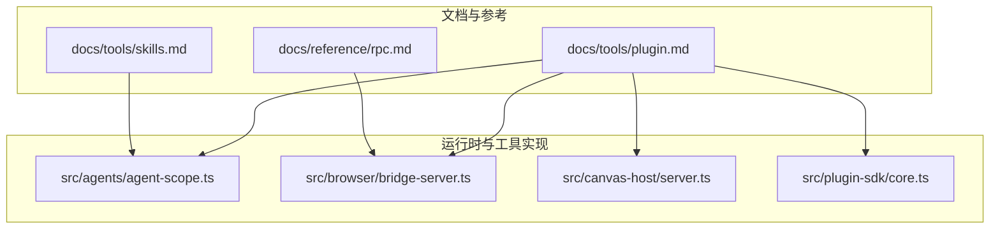
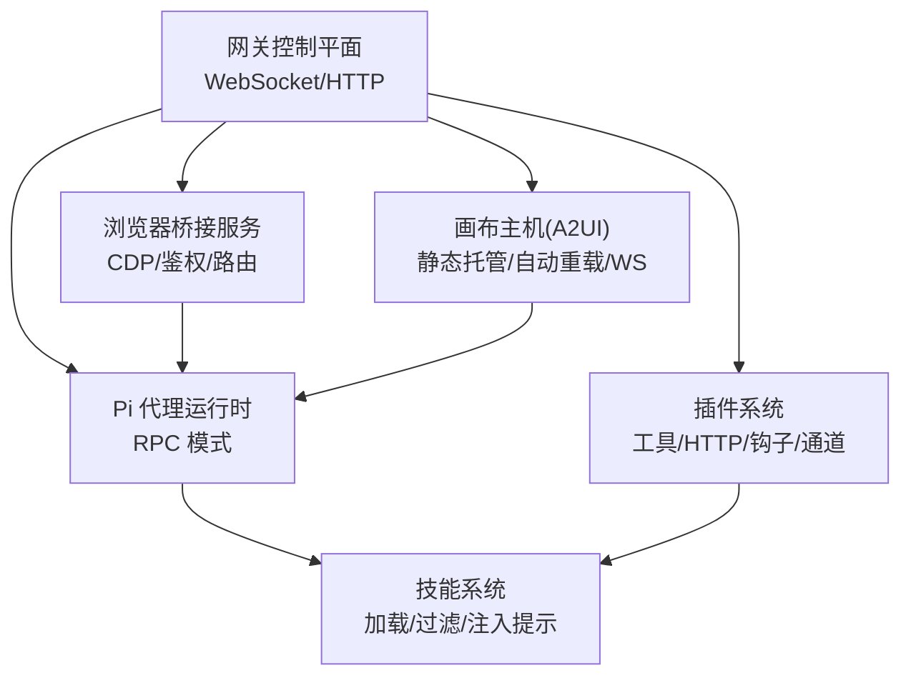
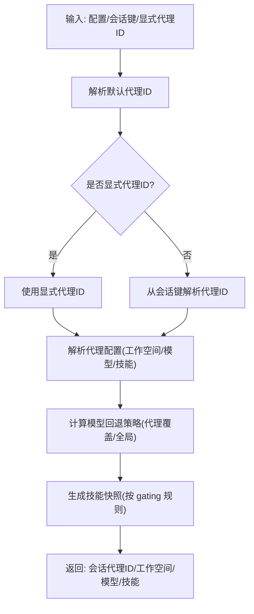
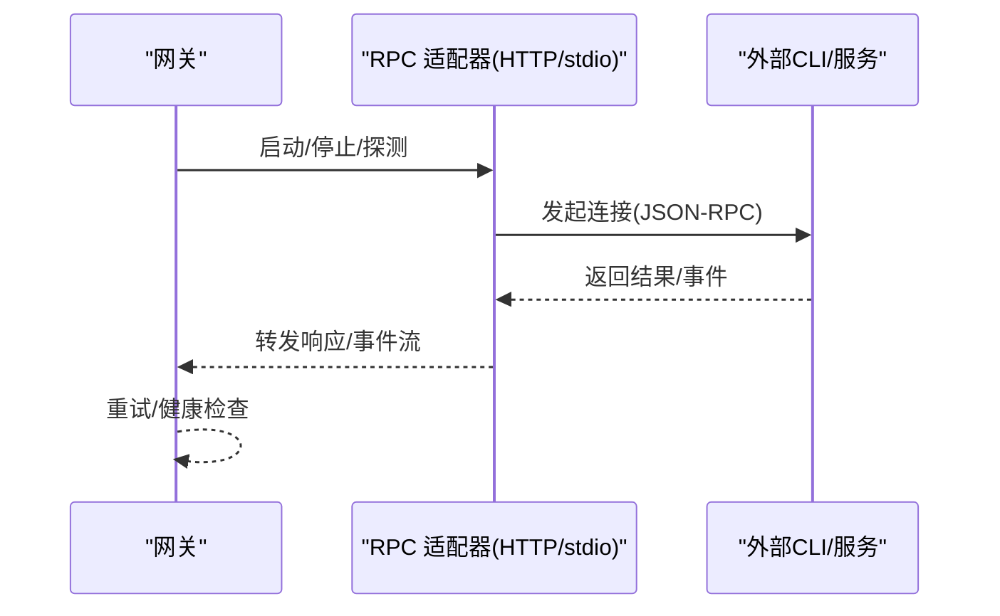
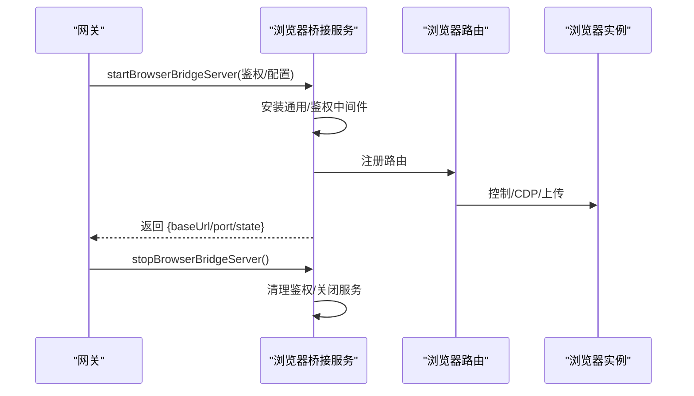
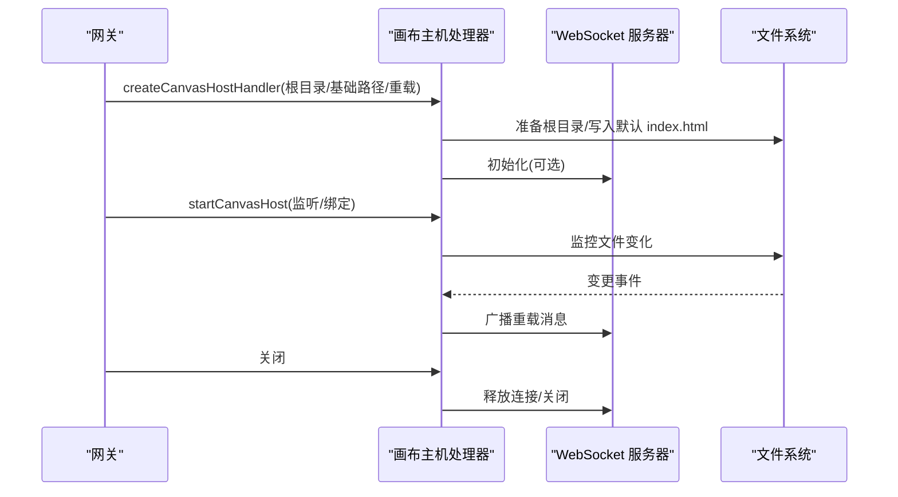
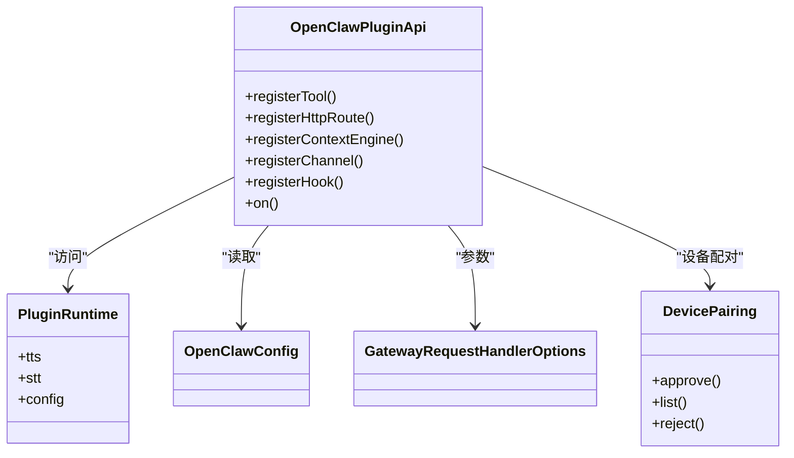
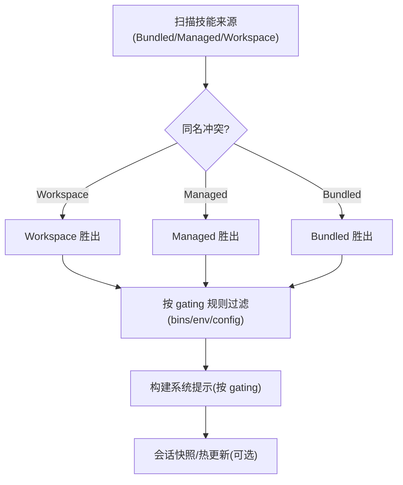
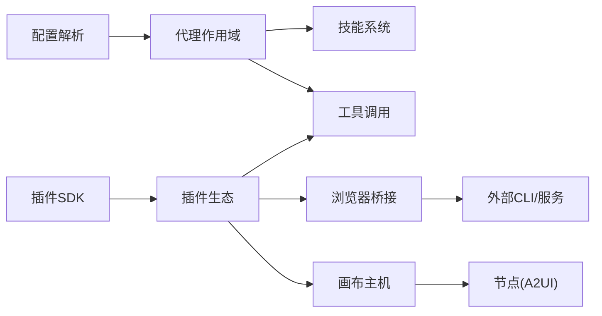

# 代理和工具系统

<cite>
**本文引用的文件**
- [README.md](file://README.md)
- [rpc.md](file://docs/reference/rpc.md)
- [skills.md](file://docs/tools/skills.md)
- [plugin.md](file://docs/tools/plugin.md)
- [agent-scope.ts](file://src/agents/agent-scope.ts)
- [bridge-server.ts](file://src/browser/bridge-server.ts)
- [server.ts](file://src/canvas-host/server.ts)
- [core.ts](file://src/plugin-sdk/core.ts)
</cite>

## 目录
1. [简介](#简介)
2. [项目结构](#项目结构)
3. [核心组件](#核心组件)
4. [架构总览](#架构总览)
5. [组件详解](#组件详解)
6. [依赖关系分析](#依赖关系分析)
7. [性能考量](#性能考量)
8. [故障排除指南](#故障排除指南)
9. [结论](#结论)
10. [附录](#附录)

## 简介
本文件面向工具开发者与使用者，系统化阐述 OpenClaw 的代理运行时与工具系统：包括 Pi 代理运行时的 RPC 模式、工具开发框架、浏览器控制、画布系统（Canvas/A2UI）以及节点通信机制；同时覆盖技能系统的架构设计、插件 SDK 使用方法、最佳实践、安全与性能优化策略，并提供丰富的参考路径与排障建议。

## 项目结构
- 文档与参考：位于 docs/ 下，涵盖 RPC 适配器、技能系统、插件体系等主题文档。
- 运行时与工具实现：位于 src/ 下，包含代理作用域解析、浏览器桥接服务、画布主机服务、插件 SDK 导出等。
- 扩展与技能：extensions/ 与 skills/ 目录提供可安装的扩展与技能包，支持 ClawHub 注册表生态。

图表来源
- [rpc.md](file://docs/reference/rpc.md#L1-L44)
- [skills.md](file://docs/tools/skills.md#L1-L302)
- [plugin.md](file://docs/tools/plugin.md#L1-L961)
- [agent-scope.ts](file://src/agents/agent-scope.ts#L1-L282)
- [bridge-server.ts](file://src/browser/bridge-server.ts#L1-L147)
- [server.ts](file://src/canvas-host/server.ts#L1-L479)
- [core.ts](file://src/plugin-sdk/core.ts#L1-L37)

章节来源
- [README.md](file://README.md#L1-L560)

## 核心组件
- 代理运行时与作用域
  - 通过代理作用域解析器确定默认/会话代理 ID、工作空间目录、模型主备回退策略等，支撑多代理路由与隔离。
- 浏览器控制与桥接
  - 提供受控的本地浏览器实例管理、CDP 代理、鉴权与中间件、HTTP 路由注册与生命周期管理。
- 画布系统（Canvas/A2UI）
  - 提供静态资源托管、自动重载、WebSocket 实时推送、A2UI 注入与升级通道，支持 iOS/Android 节点交互。
- 插件与工具开发框架
  - 以插件 SDK 暴露统一 API，支持注册工具、HTTP 路由、上下文引擎、通道插件、钩子与生命周期事件，便于扩展能力。

章节来源
- [agent-scope.ts](file://src/agents/agent-scope.ts#L1-L282)
- [bridge-server.ts](file://src/browser/bridge-server.ts#L1-L147)
- [server.ts](file://src/canvas-host/server.ts#L1-L479)
- [core.ts](file://src/plugin-sdk/core.ts#L1-L37)

## 架构总览
OpenClaw 的代理运行时与工具系统围绕“网关控制平面 + 多客户端/节点 + 工具与技能”的模式构建。Pi 代理在 RPC 模式下与外部 CLI/服务交互，同时通过工具与技能扩展能力；浏览器与画布作为可视化与交互载体，节点通过 WebSocket 与网关通信。

图表来源
- [README.md](file://README.md#L185-L212)
- [rpc.md](file://docs/reference/rpc.md#L9-L44)
- [bridge-server.ts](file://src/browser/bridge-server.ts#L59-L132)
- [server.ts](file://src/canvas-host/server.ts#L399-L479)
- [plugin.md](file://docs/tools/plugin.md#L81-L113)

## 组件详解

### 代理运行时与作用域（Pi 代理）
- 代理 ID 解析与会话路由
  - 支持从会话键解析代理 ID，允许显式指定或回退到默认代理。
- 工作空间与模型回退
  - 优先使用代理级配置，其次使用全局默认；模型回退列表可按代理覆盖。
- 技能过滤与注入
  - 在会话启动时快照可用技能，后续回合复用，变更在新会话生效或启用监视后热更新。

图表来源
- [agent-scope.ts](file://src/agents/agent-scope.ts#L85-L110)
- [agent-scope.ts](file://src/agents/agent-scope.ts#L117-L144)
- [agent-scope.ts](file://src/agents/agent-scope.ts#L207-L253)

章节来源
- [agent-scope.ts](file://src/agents/agent-scope.ts#L1-L282)

### RPC 模式与外部集成
- 两类 RPC 模式
  - HTTP 守护进程模式（如 signal-cli）：通过 JSON-RPC over HTTP 与事件流对接。
  - stdio 子进程模式（如 legacy imsg）：通过行分隔 JSON 对 stdin/stdout 通信。
- 适配器指导
  - 网关负责生命周期管理（启动/停止）、容错（超时/退出重启）、稳定标识（如 chat_id）。

图表来源
- [rpc.md](file://docs/reference/rpc.md#L13-L44)

章节来源
- [rpc.md](file://docs/reference/rpc.md#L1-L44)

### 浏览器控制与桥接
- 服务职责
  - 受限于回环绑定、鉴权令牌/密码校验、通用中间件、路由注册与状态管理。
- 关键流程
  - 启动时安装中间件与鉴权，注册路由，监听端口；停止时清理鉴权记录并关闭服务。
- Sandbox 观察器
  - 提供 noVNC 观察器入口，基于令牌解析目标端口与密码，返回引导页面。

图表来源
- [bridge-server.ts](file://src/browser/bridge-server.ts#L59-L132)

章节来源
- [bridge-server.ts](file://src/browser/bridge-server.ts#L1-L147)

### 画布系统（Canvas/A2UI）
- 主机职责
  - 静态资源托管、自动重载（文件监控 + WebSocket 推送）、A2UI 注入与升级通道、HTTP 升级处理。
- 生命周期
  - 创建处理器 -> 绑定 HTTP 服务器 -> 监听升级事件 -> 提供请求处理 -> 关闭时释放资源。
- 环境开关
  - 通过环境变量禁用画布主机（测试/特定环境），并在测试模式下调整监控参数。

图表来源
- [server.ts](file://src/canvas-host/server.ts#L205-L397)
- [server.ts](file://src/canvas-host/server.ts#L399-L479)

章节来源
- [server.ts](file://src/canvas-host/server.ts#L1-L479)

### 插件与工具开发框架
- SDK 导出与类型
  - 统一导出工具类型、插件 API、运行时服务、配置类型、网关请求处理类型、设备配对、命令执行、临时目录、网关绑定地址、Tailscale 状态等。
- 插件能力
  - 注册工具、HTTP 路由、上下文引擎、通道插件、钩子、生命周期事件；支持读写通道检查、发现与优先级、安全缓存、包打包与外部目录目录清单。
- 控制 UI 与配置
  - 基于 JSON Schema + uiHints 渲染表单，合并插件提供的字段提示；支持插件槽位（独占类别）选择。

图表来源
- [core.ts](file://src/plugin-sdk/core.ts#L1-L37)

章节来源
- [core.ts](file://src/plugin-sdk/core.ts#L1-L37)
- [plugin.md](file://docs/tools/plugin.md#L81-L113)
- [plugin.md](file://docs/tools/plugin.md#L227-L276)
- [plugin.md](file://docs/tools/plugin.md#L426-L458)

### 技能系统
- 加载与优先级
  - 按 Bundled/Managed/Workspace 顺序加载，Workspace 最高优先级；可通过额外目录扩展。
- 多代理与共享
  - 每个代理有独立工作空间，共享技能位于 Managed 目录；可通过 extraDirs 添加共享目录。
- 插件技能
  - 插件可在 manifest 中声明 skills 目录，随插件启用参与优先级规则。
- 安全与注入
  - 第三方技能视为不受信；支持在运行时注入环境变量与密钥；会话快照减少提示词开销。
- 配置与刷新
  - 通过配置开关与 per-skill 字段控制；支持监视器热更新。

图表来源
- [skills.md](file://docs/tools/skills.md#L13-L49)
- [skills.md](file://docs/tools/skills.md#L105-L186)
- [skills.md](file://docs/tools/skills.md#L241-L252)

章节来源
- [skills.md](file://docs/tools/skills.md#L1-L302)

## 依赖关系分析
- 代理作用域依赖配置解析与会话键解析，输出工作空间与模型回退策略，为技能注入与工具调用提供上下文。
- 浏览器桥接服务依赖网关鉴权与路由注册，向外部浏览器实例暴露受控接口。
- 画布主机服务依赖文件系统与 WebSocket，提供静态资源与实时重载。
- 插件 SDK 为插件提供统一 API，贯穿工具、HTTP、钩子、通道与上下文引擎等能力。

图表来源
- [agent-scope.ts](file://src/agents/agent-scope.ts#L117-L144)
- [bridge-server.ts](file://src/browser/bridge-server.ts#L59-L132)
- [server.ts](file://src/canvas-host/server.ts#L399-L479)
- [core.ts](file://src/plugin-sdk/core.ts#L1-L37)

章节来源
- [agent-scope.ts](file://src/agents/agent-scope.ts#L1-L282)
- [bridge-server.ts](file://src/browser/bridge-server.ts#L1-L147)
- [server.ts](file://src/canvas-host/server.ts#L1-L479)
- [core.ts](file://src/plugin-sdk/core.ts#L1-L37)

## 性能考量
- 技能提示词成本
  - 技能列表注入采用紧凑 XML，基础开销与每项字段长度相关；建议控制技能数量与字段长度，避免过度膨胀提示词。
- 画布自动重载
  - 文件监控与 WebSocket 推送在开发场景非常有用，但在生产或大体量文件目录下应谨慎开启，必要时降低监控阈值或关闭重载。
- 浏览器桥接
  - 回环绑定与鉴权强制提升安全性，避免不必要的网络暴露；CDP 代理与事件流需注意超时与重连策略。
- 插件发现与缓存
  - 插件发现与清单元数据具备短期缓存，可通过环境变量禁用或调节缓存窗口，平衡启动与变更响应速度。

章节来源
- [skills.md](file://docs/tools/skills.md#L268-L285)
- [server.ts](file://src/canvas-host/server.ts#L222-L286)
- [bridge-server.ts](file://src/browser/bridge-server.ts#L69-L71)
- [plugin.md](file://docs/tools/plugin.md#L218-L226)

## 故障排除指南
- 浏览器桥接服务
  - 必须绑定回环地址且提供鉴权令牌或密码；缺少鉴权会直接报错；noVNC 观察器需有效令牌解析。
- 画布主机
  - 若未创建 index.html 或目录不存在，会返回 404/错误页；确认根目录准备与权限；监控异常会降级并记录错误。
- RPC 适配器
  - HTTP 守护进程需正确暴露健康探针与事件流；stdio 子进程需保持稳定的行分隔 JSON 通信。
- 插件与技能
  - 插件发现与清单校验失败会记录警告；技能 gating 不满足时不会加载；通过配置开关与 per-skill 字段进行调试。

章节来源
- [bridge-server.ts](file://src/browser/bridge-server.ts#L69-L101)
- [bridge-server.ts](file://src/browser/bridge-server.ts#L77-L95)
- [server.ts](file://src/canvas-host/server.ts#L177-L191)
- [server.ts](file://src/canvas-host/server.ts#L276-L285)
- [rpc.md](file://docs/reference/rpc.md#L13-L44)
- [plugin.md](file://docs/tools/plugin.md#L261-L269)
- [skills.md](file://docs/tools/skills.md#L69-L76)

## 结论
OpenClaw 的代理运行时与工具系统以“网关控制平面 + 多客户端/节点 + 可扩展插件与技能”为核心，通过 Pi 代理的 RPC 模式连接外部能力，借助浏览器与画布提供可视化交互，配合插件 SDK 与技能系统实现强大的可扩展性与安全性。遵循本文的最佳实践与排障建议，可帮助开发者高效构建工具与技能，同时保障运行时的稳定性与性能。

## 附录
- 快速参考
  - 代理作用域与工作空间：参见代理作用域解析函数与工作空间解析逻辑。
  - 浏览器桥接：参见浏览器桥接服务启动/停止与鉴权中间件安装。
  - 画布主机：参见画布主机处理器创建与 HTTP/WS 处理流程。
  - 插件 SDK：参见统一导出类型与运行时服务。
  - 技能系统：参见加载优先级、gating 规则与会话快照。

章节来源
- [agent-scope.ts](file://src/agents/agent-scope.ts#L255-L282)
- [bridge-server.ts](file://src/browser/bridge-server.ts#L59-L132)
- [server.ts](file://src/canvas-host/server.ts#L205-L397)
- [core.ts](file://src/plugin-sdk/core.ts#L1-L37)
- [skills.md](file://docs/tools/skills.md#L13-L49)