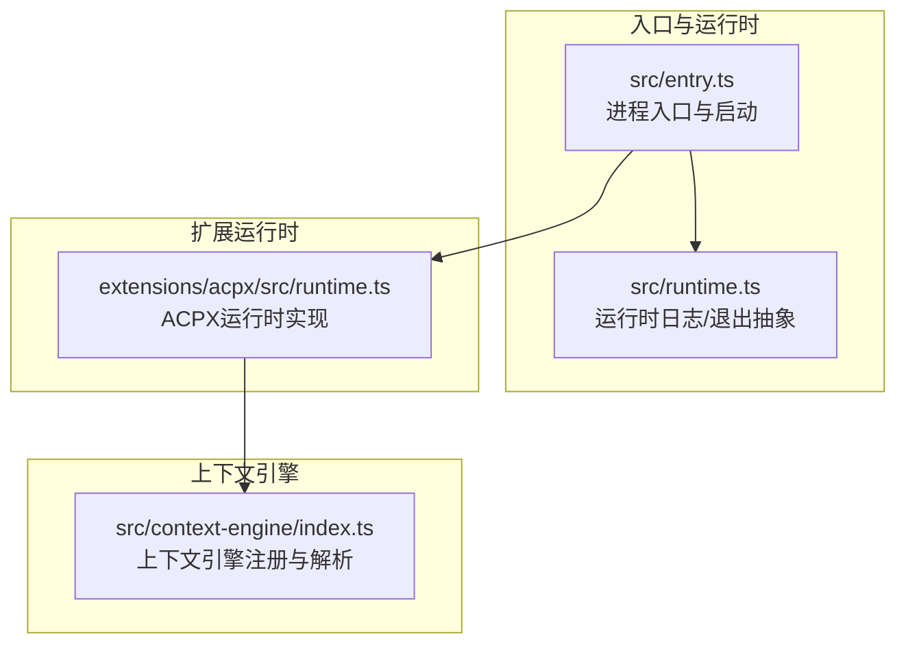
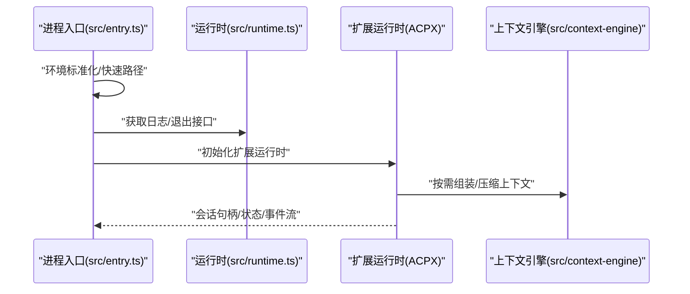
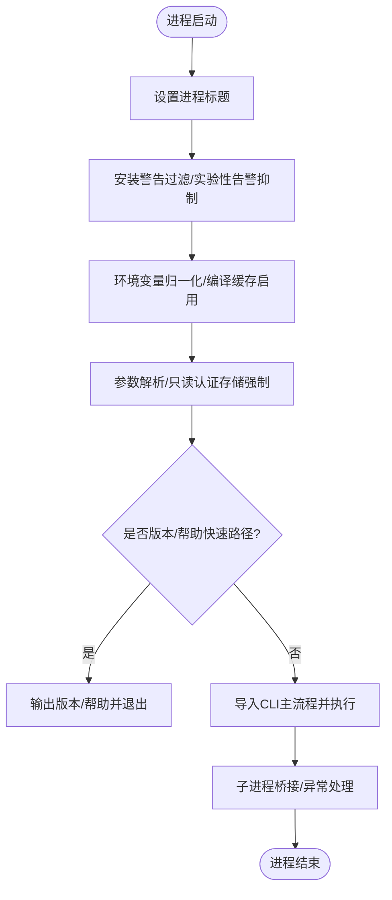
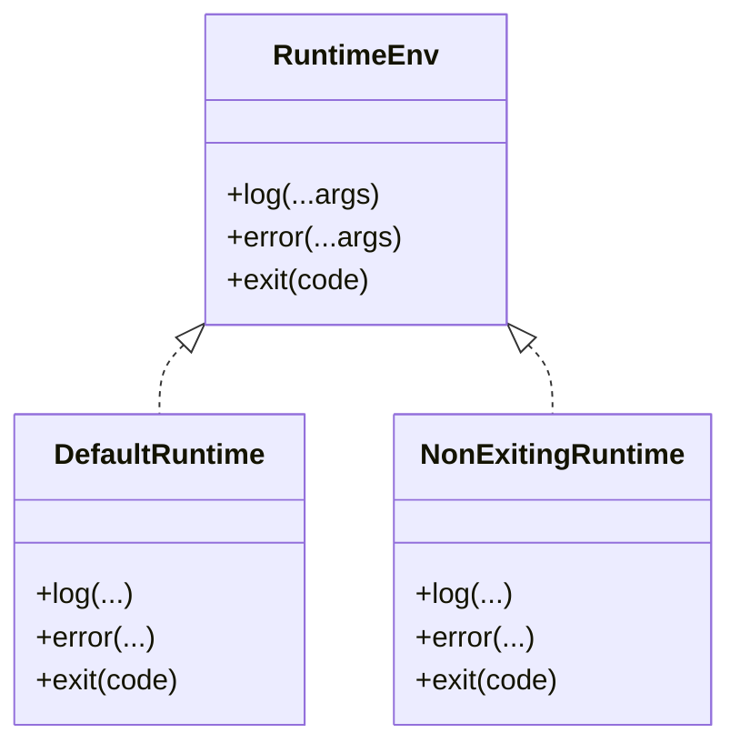
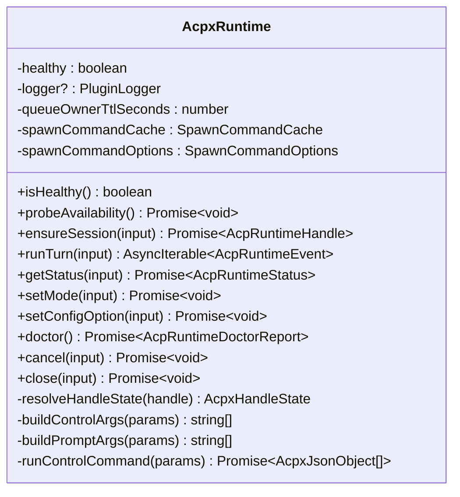
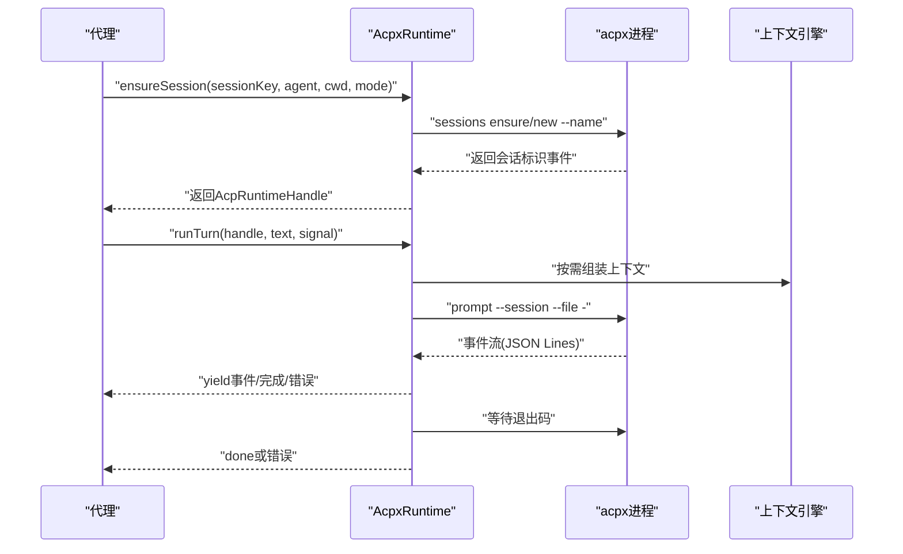
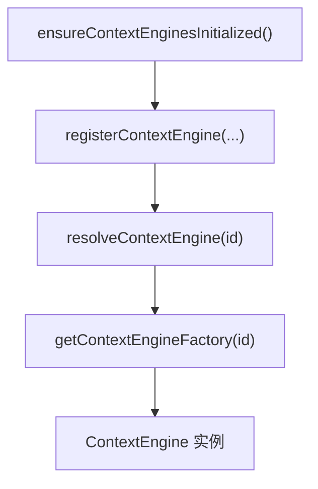
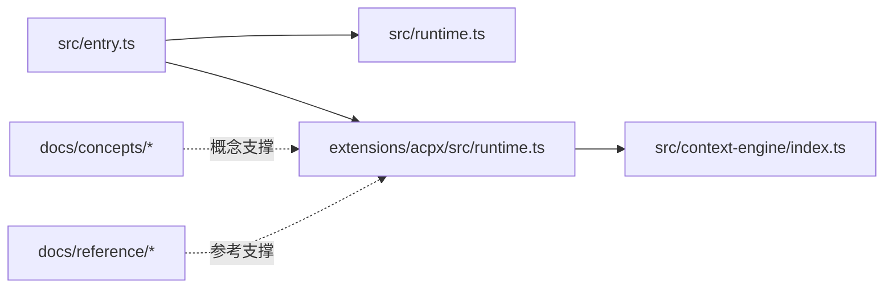
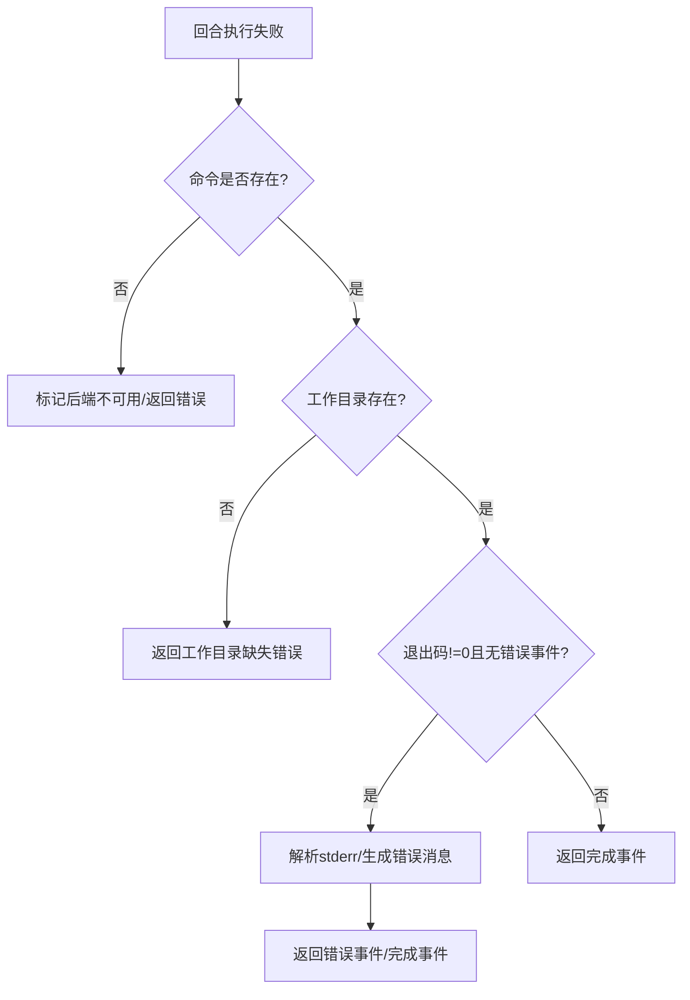

# 代理运行时

<cite>
**本文引用的文件**
- [src/entry.ts](file://src/entry.ts)
- [src/runtime.ts](file://src/runtime.ts)
- [extensions/acpx/src/runtime.ts](file://extensions/acpx/src/runtime.ts)
- [src/context-engine/index.ts](file://src/context-engine/index.ts)
- [docs/concepts/agent.md](file://docs/concepts/agent.md)
- [docs/concepts/session.md](file://docs/concepts/session.md)
- [docs/concepts/session-tool.md](file://docs/concepts/session-tool.md)
- [docs/concepts/agent-loop.md](file://docs/concepts/agent-loop.md)
- [docs/concepts/context.md](file://docs/concepts/context.md)
- [docs/gateway/configuration-reference.md](file://docs/gateway/configuration-reference.md)
- [docs/tools/agent-send.md](file://docs/tools/agent-send.md)
- [docs/cli/agent.md](file://docs/cli/agent.md)
- [docs/cli/agents.md](file://docs/cli/agents.md)
- [docs/cli/sessions.md](file://docs/cli/sessions.md)
- [docs/reference/rpc.md](file://docs/reference/rpc.md)
- [docs/help/debugging.md](file://docs/help/debugging.md)
- [docs/security/README.md](file://docs/security/README.md)
- [docs/gateway/security/authentication.md](file://docs/gateway/security/authentication.md)
- [docs/gateway/security/sandboxing.md](file://docs/gateway/security/sandboxing.md)
- [docs/gateway/logging.md](file://docs/gateway/logging.md)
- [docs/diagnostics/flags.md](file://docs/diagnostics/flags.md)
- [docs/start/getting-started.md](file://docs/start/getting-started.md)
</cite>

## 目录
1. [简介](#简介)
2. [项目结构](#项目结构)
3. [核心组件](#核心组件)
4. [架构总览](#架构总览)
5. [组件详解](#组件详解)
6. [依赖关系分析](#依赖关系分析)
7. [性能考量](#性能考量)
8. [故障排查指南](#故障排查指南)
9. [结论](#结论)
10. [附录](#附录)

## 简介
本文件面向OpenClaw的代理运行时系统，聚焦Pi代理运行时（以ACPX为例）的架构设计、RPC模式实现、会话管理机制与工具调用流程。文档同时覆盖代理生命周期管理、上下文窗口处理、模型选择策略、错误恢复机制，并提供配置选项、性能优化技巧、调试方法、最佳实践、安全与监控策略，帮助开发者理解并定制扩展代理能力。

## 项目结构
OpenClaw采用多平台应用与插件化扩展的组织方式：入口脚本负责进程初始化、环境规范化与CLI分发；运行时抽象定义统一的日志与退出接口；扩展（如ACPX）实现具体后端的会话与回合执行；上下文引擎负责上下文组装与压缩；文档体系提供概念、参考与运维指南。

**图示来源**
- [src/entry.ts](file://src/entry.ts#L1-L191)
- [src/runtime.ts](file://src/runtime.ts#L1-L54)
- [extensions/acpx/src/runtime.ts](file://extensions/acpx/src/runtime.ts#L1-L674)
- [src/context-engine/index.ts](file://src/context-engine/index.ts#L1-L20)

**章节来源**
- [src/entry.ts](file://src/entry.ts#L1-L191)
- [src/runtime.ts](file://src/runtime.ts#L1-L54)
- [extensions/acpx/src/runtime.ts](file://extensions/acpx/src/runtime.ts#L1-L674)
- [src/context-engine/index.ts](file://src/context-engine/index.ts#L1-L20)

## 核心组件
- 进程入口与启动：负责环境标准化、实验性警告抑制、快速路径（版本/帮助）、CLI主流程分发与子进程桥接。
- 运行时抽象：提供统一的日志输出与退出接口，支持非退出式运行时以适配测试场景。
- ACPX运行时：实现Pi代理运行时的具体逻辑，包括后端可用性探测、会话确保、回合执行、状态查询、控制命令、取消与关闭等。
- 上下文引擎：负责上下文组装、压缩与工厂注册，支撑代理在不同场景下的上下文窗口管理。

**章节来源**
- [src/entry.ts](file://src/entry.ts#L1-L191)
- [src/runtime.ts](file://src/runtime.ts#L1-L54)
- [extensions/acpx/src/runtime.ts](file://extensions/acpx/src/runtime.ts#L1-L674)
- [src/context-engine/index.ts](file://src/context-engine/index.ts#L1-L20)

## 架构总览
Pi代理运行时通过“入口—运行时—扩展运行时—上下文引擎”的分层结构实现：
- 入口模块完成进程级初始化与参数解析；
- 运行时模块提供日志与退出抽象；
- 扩展运行时模块对接外部后端（如ACPX），封装会话与回合执行；
- 上下文引擎模块负责上下文窗口的组装与压缩。

**图示来源**
- [src/entry.ts](file://src/entry.ts#L1-L191)
- [src/runtime.ts](file://src/runtime.ts#L1-L54)
- [extensions/acpx/src/runtime.ts](file://extensions/acpx/src/runtime.ts#L1-L674)
- [src/context-engine/index.ts](file://src/context-engine/index.ts#L1-L20)

## 组件详解

### 进程入口与启动（src/entry.ts）
- 职责：进程标题设置、警告过滤安装、环境变量归一化、编译缓存启用、只读认证存储强制、颜色开关、实验性警告抑制与自重启、版本/帮助快速路径、CLI主流程分发、子进程桥接。
- 关键点：
  - 通过包装器对映表避免重复执行入口逻辑；
  - 在未抑制实验性警告时，通过子进程带标志重启以消除告警；
  - 支持Windows参数归一化与NODE_OPTIONS兼容处理；
  - 异常时输出结构化错误信息并设置退出码。

**图示来源**
- [src/entry.ts](file://src/entry.ts#L1-L191)

**章节来源**
- [src/entry.ts](file://src/entry.ts#L1-L191)

### 运行时抽象（src/runtime.ts）
- 职责：提供统一的日志与错误输出接口，以及退出行为抽象；支持非退出式运行时用于测试。
- 关键点：
  - 日志输出前清理进度行，避免终端状态混乱；
  - 退出时恢复终端状态，保证TTY一致性；
  - 测试场景可替换退出行为以捕获退出码。

**图示来源**
- [src/runtime.ts](file://src/runtime.ts#L1-L54)

**章节来源**
- [src/runtime.ts](file://src/runtime.ts#L1-L54)

### ACPX运行时（extensions/acpx/src/runtime.ts）
- 职责：实现Pi代理运行时的完整生命周期与RPC交互，包括后端健康检查、会话确保、回合执行、状态查询、控制命令、取消与关闭。
- 关键点：
  - 句柄编码/解码：使用前缀+Base64URL承载会话状态；
  - 命令解析与缓存：解析外部命令、记录解析结果、缓存解析结果以提升性能；
  - 事件流：回合执行通过JSON Lines事件流驱动，支持done/error标记；
  - 错误恢复：根据退出码与stderr生成可读错误消息，必要时标记后端不可用；
  - 控制命令：支持mode切换、配置项设置、状态查询、doctor报告、取消与关闭。

**图示来源**
- [extensions/acpx/src/runtime.ts](file://extensions/acpx/src/runtime.ts#L1-L674)

**图示来源**
- [extensions/acpx/src/runtime.ts](file://extensions/acpx/src/runtime.ts#L190-L373)
- [src/context-engine/index.ts](file://src/context-engine/index.ts#L1-L20)

**章节来源**
- [extensions/acpx/src/runtime.ts](file://extensions/acpx/src/runtime.ts#L1-L674)

### 上下文引擎（src/context-engine/index.ts）
- 职责：暴露上下文引擎类型、注册与解析接口，支持工厂模式与遗留实现，提供初始化入口。
- 关键点：
  - 注册与解析：通过工厂函数注册实现，按ID解析；
  - 初始化：提供集中初始化入口，确保上下文引擎可用。

**图示来源**
- [src/context-engine/index.ts](file://src/context-engine/index.ts#L1-L20)

**章节来源**
- [src/context-engine/index.ts](file://src/context-engine/index.ts#L1-L20)

## 依赖关系分析
- 入口模块依赖运行时模块以获得一致的日志与退出行为；
- ACPX运行时依赖上下文引擎以进行上下文组装与压缩；
- 文档模块提供概念、参考与运维指南，支撑运行时设计与使用。

**图示来源**
- [src/entry.ts](file://src/entry.ts#L1-L191)
- [src/runtime.ts](file://src/runtime.ts#L1-L54)
- [extensions/acpx/src/runtime.ts](file://extensions/acpx/src/runtime.ts#L1-L674)
- [src/context-engine/index.ts](file://src/context-engine/index.ts#L1-L20)

**章节来源**
- [src/entry.ts](file://src/entry.ts#L1-L191)
- [src/runtime.ts](file://src/runtime.ts#L1-L54)
- [extensions/acpx/src/runtime.ts](file://extensions/acpx/src/runtime.ts#L1-L674)
- [src/context-engine/index.ts](file://src/context-engine/index.ts#L1-L20)

## 性能考量
- 编译缓存：入口模块在允许情况下启用编译缓存，减少启动时间。
- 命令解析缓存：ACPX运行时缓存命令解析结果，降低重复解析开销。
- 事件流消费：回合执行采用逐行解析的异步迭代器，避免一次性加载大文本，降低内存峰值。
- 终端状态管理：运行时在日志输出前清理进度行，在退出时恢复终端状态，避免I/O阻塞与TTY异常。

**章节来源**
- [src/entry.ts](file://src/entry.ts#L46-L52)
- [extensions/acpx/src/runtime.ts](file://extensions/acpx/src/runtime.ts#L120-L146)
- [src/runtime.ts](file://src/runtime.ts#L21-L44)

## 故障排查指南
- 后端不可用：当外部命令不存在或工作目录缺失时，运行时会抛出明确的错误代码与消息，并可能标记后端不可用。
- 权限问题：在非交互会话中写入/执行被拒绝时，提示调整权限模式配置。
- Doctor报告：提供版本校验、命令可用性与工作目录存在性检查，输出安装建议与详细信息。
- 调试方法：结合CLI调试文档与诊断标志，定位启动、网络与权限问题。

**图示来源**
- [extensions/acpx/src/runtime.ts](file://extensions/acpx/src/runtime.ts#L332-L373)
- [extensions/acpx/src/runtime.ts](file://extensions/acpx/src/runtime.ts#L459-L538)

**章节来源**
- [extensions/acpx/src/runtime.ts](file://extensions/acpx/src/runtime.ts#L50-L67)
- [extensions/acpx/src/runtime.ts](file://extensions/acpx/src/runtime.ts#L459-L538)
- [docs/help/debugging.md](file://docs/help/debugging.md)
- [docs/diagnostics/flags.md](file://docs/diagnostics/flags.md)

## 结论
OpenClaw的代理运行时通过清晰的分层设计与扩展机制，实现了Pi代理运行时的高内聚低耦合：入口模块负责进程级初始化，运行时模块提供一致的日志与退出抽象，扩展运行时模块对接外部后端并封装回合执行与会话管理，上下文引擎模块支撑上下文窗口的组装与压缩。配合完善的错误恢复、性能优化与调试手段，开发者可以在此基础上进行定制与扩展。

## 附录

### 代理生命周期管理
- 初始化：入口模块完成环境准备与CLI分发；扩展运行时进行后端健康检查与doctor报告。
- 会话管理：ensureSession确保会话存在并返回句柄；getStatus查询状态；setMode与setConfigOption动态调整运行参数。
- 回合执行：runTurn通过事件流驱动，支持中断信号；cancel用于取消当前回合；close用于关闭会话。
- 关闭：退出时恢复终端状态，保证TTY一致性。

**章节来源**
- [src/entry.ts](file://src/entry.ts#L164-L189)
- [extensions/acpx/src/runtime.ts](file://extensions/acpx/src/runtime.ts#L163-L188)
- [extensions/acpx/src/runtime.ts](file://extensions/acpx/src/runtime.ts#L190-L263)
- [extensions/acpx/src/runtime.ts](file://extensions/acpx/src/runtime.ts#L265-L373)
- [extensions/acpx/src/runtime.ts](file://extensions/acpx/src/runtime.ts#L379-L420)
- [extensions/acpx/src/runtime.ts](file://extensions/acpx/src/runtime.ts#L422-L457)
- [extensions/acpx/src/runtime.ts](file://extensions/acpx/src/runtime.ts#L540-L564)
- [src/runtime.ts](file://src/runtime.ts#L37-L44)

### 上下文窗口处理
- 上下文引擎提供统一的组装与压缩接口，支持工厂注册与遗留实现，确保在不同场景下上下文窗口的一致性与高效性。

**章节来源**
- [src/context-engine/index.ts](file://src/context-engine/index.ts#L1-L20)

### 模型选择策略
- 模型选择与回退策略由上层配置与文档定义，运行时模块不直接参与模型决策，但可通过doctor报告与配置项调整影响后端可用性与性能。

**章节来源**
- [docs/concepts/model-failover.md](file://docs/concepts/model-failover.md)
- [docs/concepts/models.md](file://docs/concepts/models.md)
- [docs/gateway/configuration-reference.md](file://docs/gateway/configuration-reference.md)

### 错误恢复机制
- 外部命令缺失：标记后端不可用并返回安装建议；
- 工作目录缺失：返回明确的路径错误；
- 退出码异常：解析stderr生成可读错误消息；
- 权限拒绝：提示调整权限模式配置。

**章节来源**
- [extensions/acpx/src/runtime.ts](file://extensions/acpx/src/runtime.ts#L332-L373)
- [extensions/acpx/src/runtime.ts](file://extensions/acpx/src/runtime.ts#L459-L538)

### 配置选项与最佳实践
- 配置参考：通过网关配置参考文档了解可用字段与默认值；
- 最佳实践：合理设置队列持有TTL、权限模式与超时；在测试环境中使用非退出式运行时；利用doctor报告定期检查后端健康。

**章节来源**
- [docs/gateway/configuration-reference.md](file://docs/gateway/configuration-reference.md)
- [extensions/acpx/src/runtime.ts](file://extensions/acpx/src/runtime.ts#L124-L146)
- [src/runtime.ts](file://src/runtime.ts#L46-L53)

### 安全与监控
- 安全：遵循认证与沙箱策略，限制权限范围，避免不必要的写入与执行；
- 监控：通过日志与诊断标志持续观察运行状态，结合doctor报告与错误恢复机制提升稳定性。

**章节来源**
- [docs/security/README.md](file://docs/security/README.md)
- [docs/gateway/security/authentication.md](file://docs/gateway/security/authentication.md)
- [docs/gateway/security/sandboxing.md](file://docs/gateway/security/sandboxing.md)
- [docs/gateway/logging.md](file://docs/gateway/logging.md)

### 开发与调试
- CLI参考：通过CLI文档了解代理、会话与工具的使用方式；
- 调试：结合调试指南与诊断标志，定位启动、网络与权限问题；
- 示例：参考会话与工具文档中的示例，验证运行时行为。

**章节来源**
- [docs/cli/agent.md](file://docs/cli/agent.md)
- [docs/cli/agents.md](file://docs/cli/agents.md)
- [docs/cli/sessions.md](file://docs/cli/sessions.md)
- [docs/tools/agent-send.md](file://docs/tools/agent-send.md)
- [docs/help/debugging.md](file://docs/help/debugging.md)
- [docs/diagnostics/flags.md](file://docs/diagnostics/flags.md)