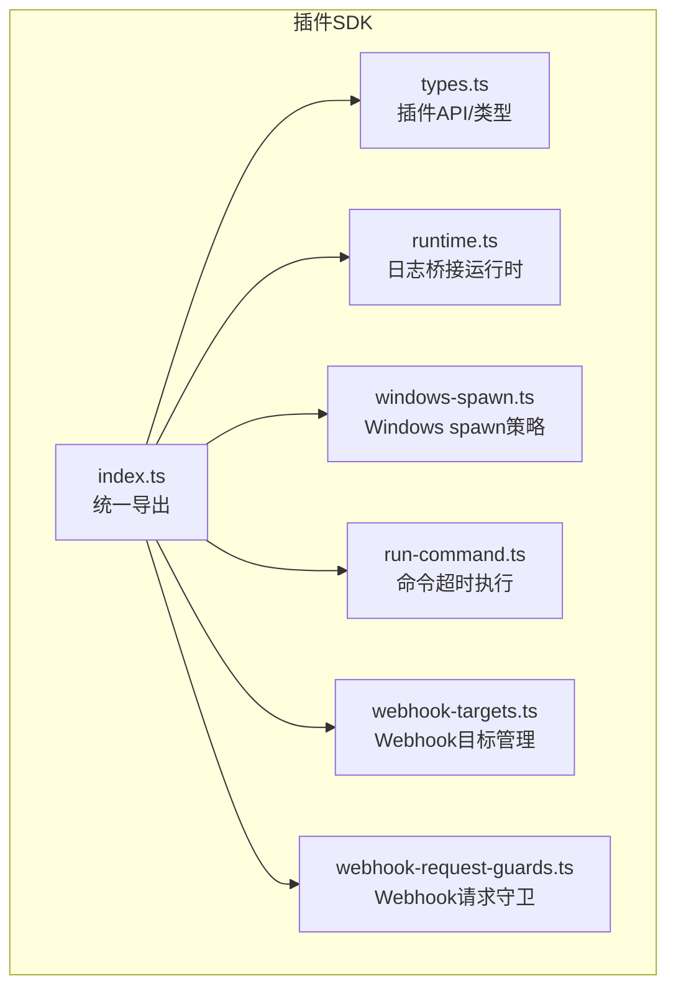
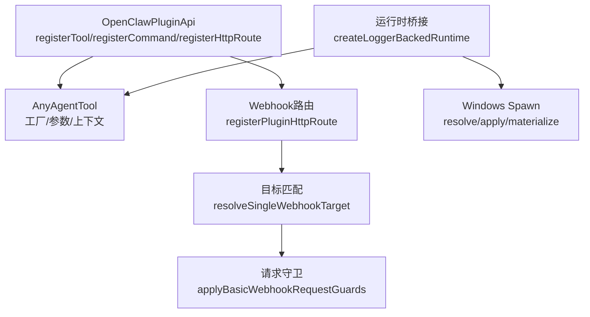
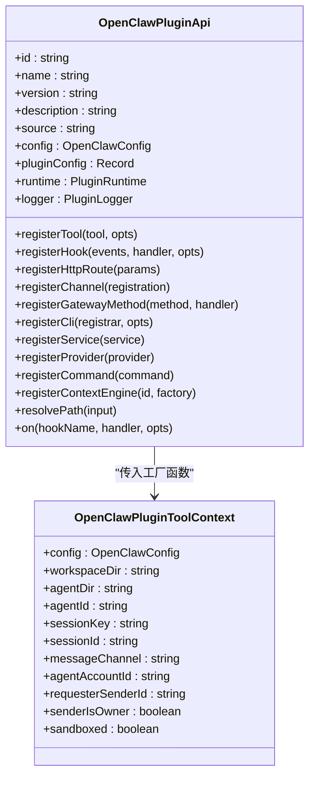
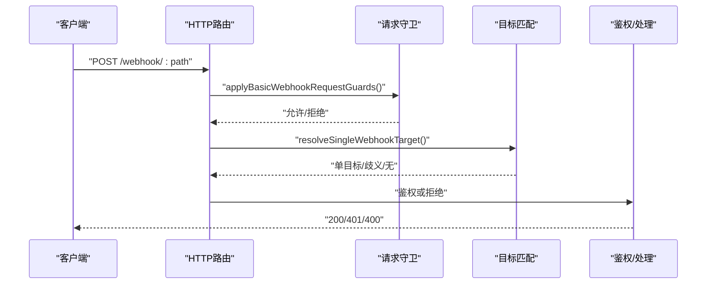
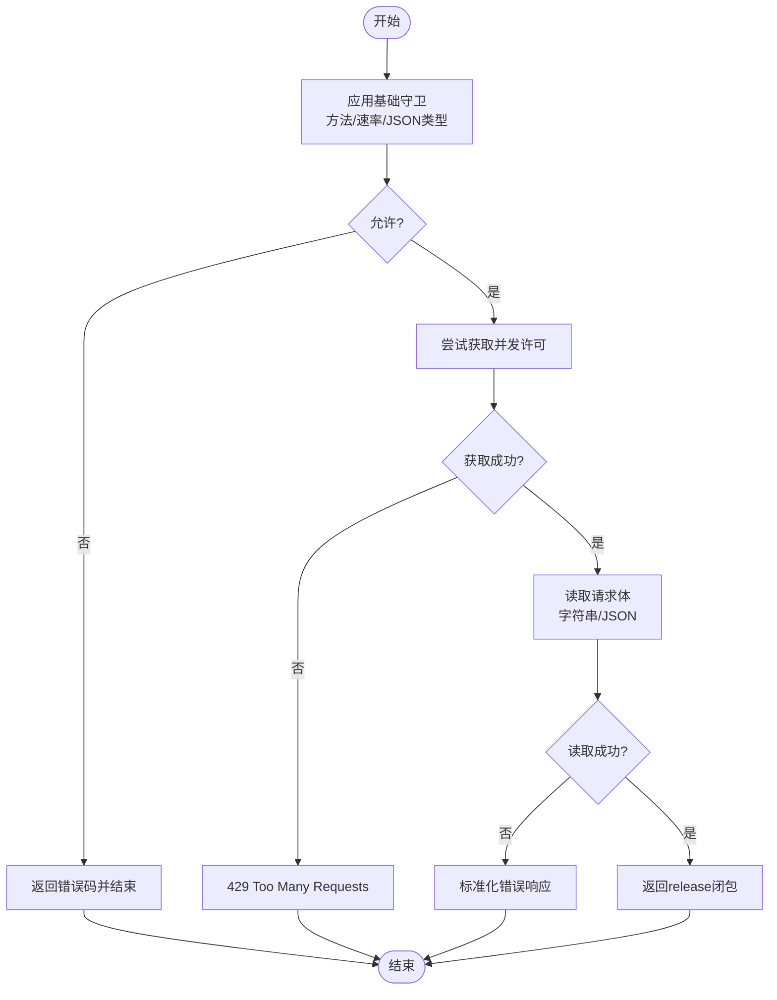
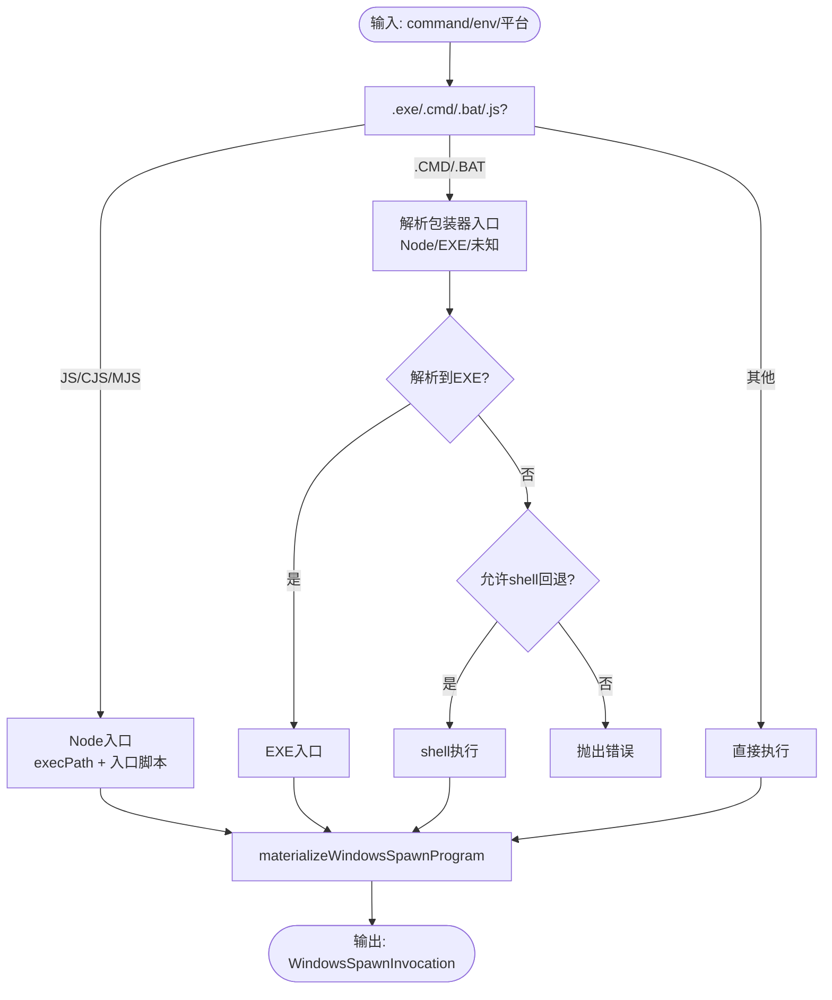
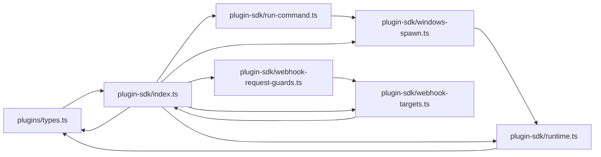

# 工具开发框架

<cite>
**本文引用的文件**
- [src/plugin-sdk/index.ts](file://src/plugin-sdk/index.ts)
- [src/plugins/types.ts](file://src/plugins/types.ts)
- [src/plugin-sdk/webhook-targets.ts](file://src/plugin-sdk/webhook-targets.ts)
- [src/plugin-sdk/webhook-request-guards.ts](file://src/plugin-sdk/webhook-request-guards.ts)
- [src/plugin-sdk/windows-spawn.ts](file://src/plugin-sdk/windows-spawn.ts)
- [src/plugin-sdk/run-command.ts](file://src/plugin-sdk/run-command.ts)
- [src/plugin-sdk/runtime.ts](file://src/plugin-sdk/runtime.ts)
</cite>

## 目录
1. [简介](#简介)
2. [项目结构](#项目结构)
3. [核心组件](#核心组件)
4. [架构总览](#架构总览)
5. [详细组件分析](#详细组件分析)
6. [依赖关系分析](#依赖关系分析)
7. [性能考量](#性能考量)
8. [故障排查指南](#故障排查指南)
9. [结论](#结论)
10. [附录](#附录)

## 简介
本文件面向希望在 OpenClaw 平台上开发“工具（Tool）”与“插件（Plugin）”的开发者，系统化阐述工具开发框架的设计理念、接口规范、开发模式与生命周期。内容覆盖工具注册机制、参数校验、执行流程、结果处理、测试策略、发布流程、安全模型与权限控制、沙箱执行机制等，并提供可操作的最佳实践与性能优化建议。

## 项目结构
OpenClaw 的工具开发框架主要由以下模块构成：
- 插件 SDK 导出层：统一导出工具、通道适配器、运行时、Webhook、安全与配置相关能力
- 插件类型定义：定义插件 API、工具上下文、命令、HTTP 路由、服务、Hook 等类型
- Webhook 注册与鉴权：提供路径归一化、目标匹配、鉴权拒绝、请求守卫（限流、并发、体限制）
- 运行时与系统调用：封装 Windows 平台 spawn 行为、命令超时执行、日志桥接运行时
- 安全与策略：SSRF 防护策略、OAuth 辅助、临时路径与媒体加载等

**图表来源**
- [src/plugin-sdk/index.ts](file://src/plugin-sdk/index.ts#L1-L727)
- [src/plugins/types.ts](file://src/plugins/types.ts#L1-L887)
- [src/plugin-sdk/runtime.ts](file://src/plugin-sdk/runtime.ts#L1-L25)
- [src/plugin-sdk/windows-spawn.ts](file://src/plugin-sdk/windows-spawn.ts#L1-L300)
- [src/plugin-sdk/run-command.ts](file://src/plugin-sdk/run-command.ts#L1-L46)
- [src/plugin-sdk/webhook-targets.ts](file://src/plugin-sdk/webhook-targets.ts#L1-L228)
- [src/plugin-sdk/webhook-request-guards.ts](file://src/plugin-sdk/webhook-request-guards.ts#L1-L291)

**章节来源**
- [src/plugin-sdk/index.ts](file://src/plugin-sdk/index.ts#L1-L727)

## 核心组件
- 插件 API 与生命周期
  - 插件通过 OpenClawPluginApi 注册工具、命令、HTTP 路由、服务、Hook、Provider、上下文引擎等
  - 生命周期钩子贯穿会话、消息、工具调用、压缩、重置、网关启停等阶段
- 工具接口规范
  - 工具工厂函数接收 OpenClawPluginToolContext，返回一个或多个 AnyAgentTool
  - 工具参数通过上下文与 Schema 校验，支持 UI 提示与敏感字段标记
- Webhook 与安全
  - Webhook 目标按路径归一化与注册，支持单目标匹配与鉴权拒绝
  - 请求守卫支持方法白名单、速率限制、JSON 内容类型、并发上限、请求体大小与超时
- 运行时与系统集成
  - Windows 平台 spawn 解析与策略，支持 Node 入口、可执行入口、CMD/BAT 包装器回退
  - 命令超时执行，带超时与错误输出标准化
  - 日志桥接运行时，统一日志与退出语义

**章节来源**
- [src/plugins/types.ts](file://src/plugins/types.ts#L257-L300)
- [src/plugins/types.ts](file://src/plugins/types.ts#L58-L77)
- [src/plugin-sdk/webhook-targets.ts](file://src/plugin-sdk/webhook-targets.ts#L52-L95)
- [src/plugin-sdk/webhook-request-guards.ts](file://src/plugin-sdk/webhook-request-guards.ts#L179-L227)
- [src/plugin-sdk/windows-spawn.ts](file://src/plugin-sdk/windows-spawn.ts#L191-L286)
- [src/plugin-sdk/run-command.ts](file://src/plugin-sdk/run-command.ts#L16-L45)
- [src/plugin-sdk/runtime.ts](file://src/plugin-sdk/runtime.ts#L9-L24)

## 架构总览
下图展示工具开发框架的关键交互：插件通过 API 注册工具与命令；Webhook 路由由 SDK 统一管理；请求经守卫与鉴权后进入目标解析；系统调用与运行时桥接保证跨平台与安全。

**图表来源**
- [src/plugins/types.ts](file://src/plugins/types.ts#L257-L300)
- [src/plugin-sdk/webhook-targets.ts](file://src/plugin-sdk/webhook-targets.ts#L22-L37)
- [src/plugin-sdk/webhook-targets.ts](file://src/plugin-sdk/webhook-targets.ts#L132-L148)
- [src/plugin-sdk/webhook-request-guards.ts](file://src/plugin-sdk/webhook-request-guards.ts#L139-L177)
- [src/plugin-sdk/runtime.ts](file://src/plugin-sdk/runtime.ts#L9-L24)
- [src/plugin-sdk/windows-spawn.ts](file://src/plugin-sdk/windows-spawn.ts#L278-L299)

## 详细组件分析

### 组件A：插件 API 与工具注册
- 设计要点
  - OpenClawPluginApi 提供 registerTool、registerCommand、registerHttpRoute、registerService、registerHook 等能力
  - 工具工厂函数以 OpenClawPluginToolContext 为输入，支持多工具批量返回
  - Hook 名称集合与事件类型严格定义，便于静态校验与 IDE 支持
- 开发模式
  - 在插件初始化阶段调用 registerTool 注册工具；在激活阶段可补充注册命令与 HTTP 路由
  - 使用 Hook 拦截提示构建、模型选择、消息发送、工具调用前后等关键节点
- 参数校验
  - 插件可提供 configSchema，支持 Zod/JSON Schema/自定义校验，配合 UI 提示与敏感字段标注
- 执行流程
  - 工具被调用时，从上下文提取会话、请求者身份、沙箱状态等信息
  - 结果通过 AgentMessage 或 ReplyPayload 返回，支持持久化与后续处理
- 结果处理
  - 可使用 before_message_write、tool_result_persist 等 Hook 对消息进行修改或过滤

**图表来源**
- [src/plugins/types.ts](file://src/plugins/types.ts#L257-L300)
- [src/plugins/types.ts](file://src/plugins/types.ts#L58-L77)

**章节来源**
- [src/plugins/types.ts](file://src/plugins/types.ts#L257-L300)
- [src/plugins/types.ts](file://src/plugins/types.ts#L58-L77)

### 组件B：Webhook 注册与鉴权
- 设计要点
  - registerWebhookTargetWithPluginRoute 将目标映射到路径并自动注册 HTTP 路由
  - resolveSingleWebhookTarget 支持同步/异步匹配，返回单目标、歧义或无匹配
  - resolveWebhookTargetWithAuthOrReject 提供鉴权失败与歧义场景的统一响应
- 执行流程
  - 请求到达后先经 applyBasicWebhookRequestGuards（方法、速率、JSON 类型）
  - 再通过 resolveSingleWebhookTarget 获取目标，最后鉴权决定是否放行
- 安全模型
  - rejectNonPostWebhookRequest 强制 POST 方法
  - 支持并发上限（inFlightLimiter）与请求体大小/超时限制

**图表来源**
- [src/plugin-sdk/webhook-request-guards.ts](file://src/plugin-sdk/webhook-request-guards.ts#L139-L177)
- [src/plugin-sdk/webhook-targets.ts](file://src/plugin-sdk/webhook-targets.ts#L132-L148)
- [src/plugin-sdk/webhook-targets.ts](file://src/plugin-sdk/webhook-targets.ts#L168-L194)
- [src/plugin-sdk/webhook-targets.ts](file://src/plugin-sdk/webhook-targets.ts#L219-L227)

**章节来源**
- [src/plugin-sdk/webhook-targets.ts](file://src/plugin-sdk/webhook-targets.ts#L22-L37)
- [src/plugin-sdk/webhook-targets.ts](file://src/plugin-sdk/webhook-targets.ts#L97-L148)
- [src/plugin-sdk/webhook-targets.ts](file://src/plugin-sdk/webhook-targets.ts#L168-L194)
- [src/plugin-sdk/webhook-request-guards.ts](file://src/plugin-sdk/webhook-request-guards.ts#L179-L227)

### 组件C：请求守卫与并发/限流
- 设计要点
  - 固定窗口限流器与并发上限（inFlightLimiter）结合，避免过载
  - 请求体读取支持分档配置（预认证/认证后），默认值与可选参数
  - 错误码标准化：413（负载过大）、408（超时）、400（无效体）、429（频控）
- 处理逻辑
  - beginWebhookRequestPipelineOrReject 统一入口，返回 release 闭包用于释放并发
  - readWebhookBodyOrReject/readJsonWebhookBodyOrReject 提供字符串/JSON 读取与错误响应

**图表来源**
- [src/plugin-sdk/webhook-request-guards.ts](file://src/plugin-sdk/webhook-request-guards.ts#L179-L227)
- [src/plugin-sdk/webhook-request-guards.ts](file://src/plugin-sdk/webhook-request-guards.ts#L229-L261)
- [src/plugin-sdk/webhook-request-guards.ts](file://src/plugin-sdk/webhook-request-guards.ts#L263-L290)

**章节来源**
- [src/plugin-sdk/webhook-request-guards.ts](file://src/plugin-sdk/webhook-request-guards.ts#L13-L27)
- [src/plugin-sdk/webhook-request-guards.ts](file://src/plugin-sdk/webhook-request-guards.ts#L179-L227)
- [src/plugin-sdk/webhook-request-guards.ts](file://src/plugin-sdk/webhook-request-guards.ts#L229-L290)

### 组件D：Windows 平台 spawn 策略
- 设计要点
  - 解析命令扩展名，区分 .js/.cjs/.mjs（Node 入口）、.cmd/.bat（包装器）、直接可执行
  - 包装器解析 Node 入口或 EXE 入口，不解析则可选择 shell 回退（受策略控制）
  - materializeWindowsSpawnProgram 生成最终调用参数
- 安全与兼容性
  - 避免 shell 执行的策略可通过 allowShellFallback 控制
  - WindowsHide 等进程属性可按入口类型设置

**图表来源**
- [src/plugin-sdk/windows-spawn.ts](file://src/plugin-sdk/windows-spawn.ts#L191-L286)
- [src/plugin-sdk/windows-spawn.ts](file://src/plugin-sdk/windows-spawn.ts#L288-L299)

**章节来源**
- [src/plugin-sdk/windows-spawn.ts](file://src/plugin-sdk/windows-spawn.ts#L191-L286)
- [src/plugin-sdk/windows-spawn.ts](file://src/plugin-sdk/windows-spawn.ts#L288-L299)

### 组件E：命令超时执行与运行时桥接
- 设计要点
  - runPluginCommandWithTimeout 封装外部命令执行，支持超时与错误标准化
  - createLoggerBackedRuntime 将插件日志桥接到运行时，统一 error/log/exit 语义
- 使用建议
  - 对可能长时间阻塞的外部命令使用超时保护
  - 在 Windows 平台结合 windows-spawn 策略，确保入口正确与隐藏窗口属性

**章节来源**
- [src/plugin-sdk/run-command.ts](file://src/plugin-sdk/run-command.ts#L16-L45)
- [src/plugin-sdk/runtime.ts](file://src/plugin-sdk/runtime.ts#L9-L24)

## 依赖关系分析
- 模块内聚与耦合
  - 插件 SDK 导出层集中暴露能力，降低上层对内部实现的耦合
  - Webhook 子系统内部协作紧密：目标管理 -> 路由注册 -> 请求守卫 -> 鉴权
  - Windows spawn 策略独立于 Webhook，但可被命令执行模块复用
- 外部依赖与集成点
  - Node HTTP 流与进程执行接口
  - 运行时环境（RuntimeEnv）与日志系统
  - 配置与 Schema 校验（Zod/JSON Schema）

**图表来源**
- [src/plugins/types.ts](file://src/plugins/types.ts#L1-L887)
- [src/plugin-sdk/index.ts](file://src/plugin-sdk/index.ts#L1-L727)
- [src/plugin-sdk/runtime.ts](file://src/plugin-sdk/runtime.ts#L1-L25)
- [src/plugin-sdk/windows-spawn.ts](file://src/plugin-sdk/windows-spawn.ts#L1-L300)
- [src/plugin-sdk/run-command.ts](file://src/plugin-sdk/run-command.ts#L1-L46)
- [src/plugin-sdk/webhook-targets.ts](file://src/plugin-sdk/webhook-targets.ts#L1-L228)
- [src/plugin-sdk/webhook-request-guards.ts](file://src/plugin-sdk/webhook-request-guards.ts#L1-L291)

**章节来源**
- [src/plugin-sdk/index.ts](file://src/plugin-sdk/index.ts#L1-L727)

## 性能考量
- Webhook 并发与限流
  - 合理设置 inFlightLimiter 的每键最大并发与跟踪键数，避免内存膨胀
  - 使用固定窗口限流器控制突发流量，结合路径级 key 提升公平性
- 请求体读取
  - 预认证阶段采用较小体限制与较短超时，认证后放宽限制
  - 对大体积 JSON 使用空对象回退策略，减少解析开销
- 工具执行
  - 对外部命令设置合理超时，避免阻塞主流程
  - Windows 平台优先选择 Node/EXE 入口，减少 shell 启动成本
- 日志与运行时
  - 使用 createLoggerBackedRuntime 统一日志格式，便于可观测性与问题定位

[本节为通用建议，无需特定文件引用]

## 故障排查指南
- Webhook 常见问题
  - 方法不被允许：检查 allowMethods 列表与守卫配置
  - 非 JSON 内容类型：确认 Content-Type 与 requireJsonContentType 设置
  - 负载过大/超时：调整 read limits 或优化上游发送
  - 并发过多：增大 maxInFlightPerKey 或减少 inFlightKey 覆盖范围
- 目标匹配问题
  - 单目标与歧义：确认路径归一化与唯一性；必要时增加更精确的匹配条件
  - 鉴权失败：核对鉴权回调逻辑与拒绝状态码/消息
- Windows spawn 问题
  - 包装器无法解析入口：检查 CMD/BAT 包装器内容与 package.json bin 字段
  - shell 回退被禁用：根据策略需求开启 allowShellFallback
- 命令执行问题
  - 超时：提升 timeoutMs 或优化外部程序性能
  - 无输出超时：检查外部程序是否卡死或未正确输出

**章节来源**
- [src/plugin-sdk/webhook-request-guards.ts](file://src/plugin-sdk/webhook-request-guards.ts#L139-L177)
- [src/plugin-sdk/webhook-targets.ts](file://src/plugin-sdk/webhook-targets.ts#L196-L217)
- [src/plugin-sdk/windows-spawn.ts](file://src/plugin-sdk/windows-spawn.ts#L253-L276)
- [src/plugin-sdk/run-command.ts](file://src/plugin-sdk/run-command.ts#L16-L45)

## 结论
OpenClaw 工具开发框架通过清晰的 API、严格的类型约束与完善的安全与运行时支持，为开发者提供了高扩展性与强健性的工具生态。遵循本文的注册机制、参数校验、执行流程与安全策略，可高效构建高质量工具插件，并在多平台与多渠道环境中稳定运行。

[本节为总结，无需特定文件引用]

## 附录
- 开发最佳实践
  - 使用 configSchema 提供 UI 提示与敏感字段标注，提升用户体验
  - 在工具工厂中最小化副作用，参数尽量来自上下文与配置
  - 利用 Hook 在关键节点注入策略与可观测性，避免侵入式修改
  - 对外部系统调用统一走 runPluginCommandWithTimeout，避免阻塞
- 发布流程建议
  - 在本地与 CI 中运行单元测试与集成测试，确保 Webhook 与工具行为一致
  - 使用最小权限原则配置鉴权与路径，避免过度开放
  - 对 Windows 平台提供明确的入口解析策略，减少用户配置成本

[本节为通用建议，无需特定文件引用]