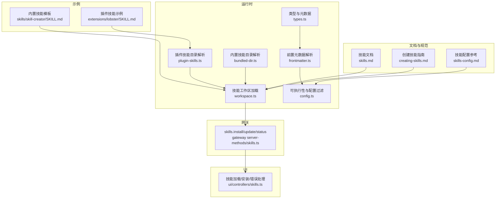
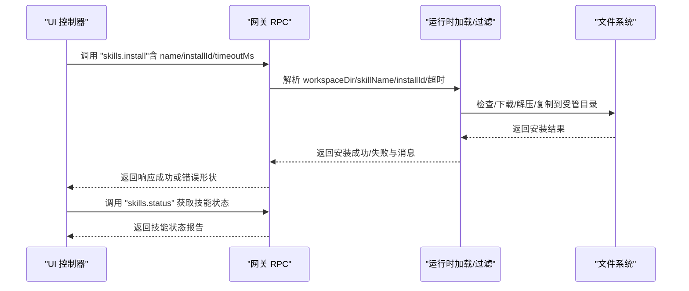
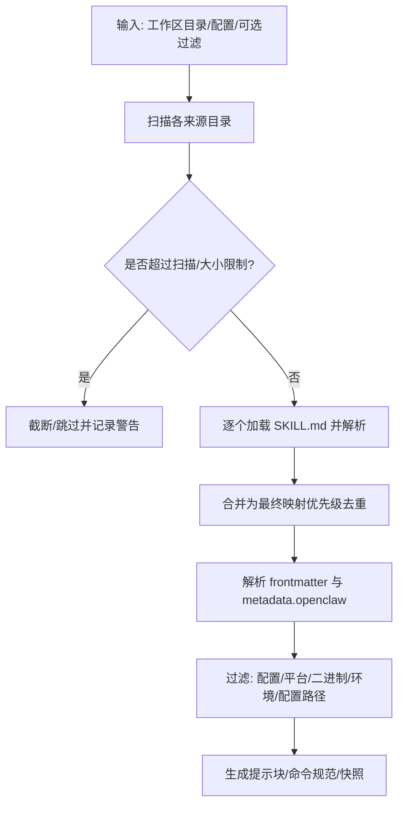
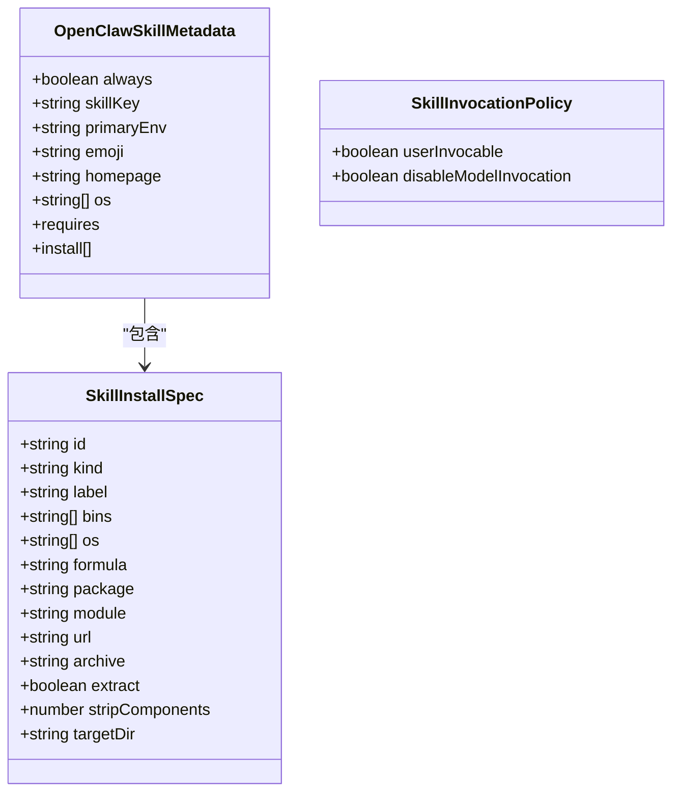
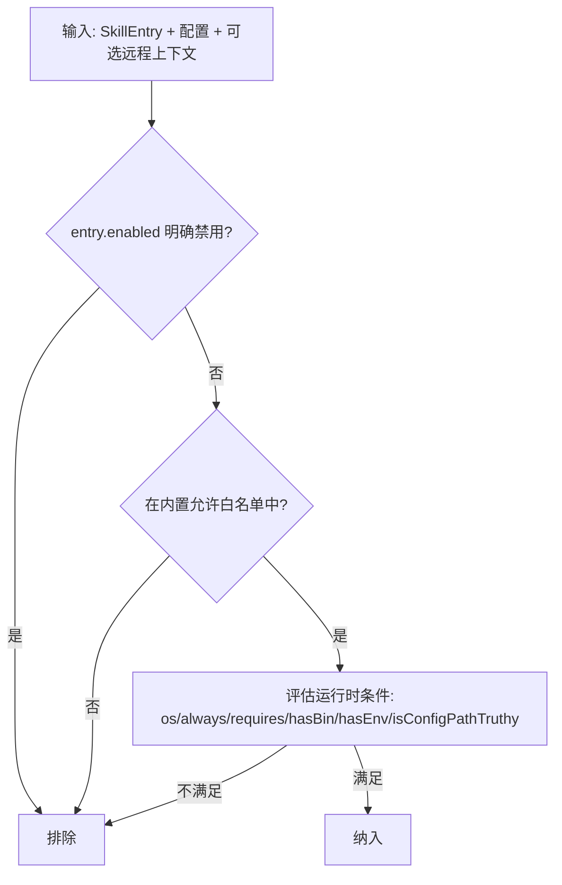
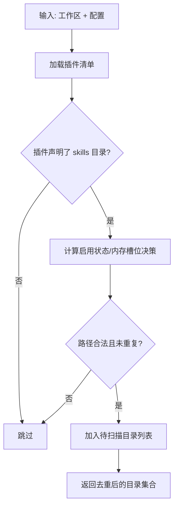
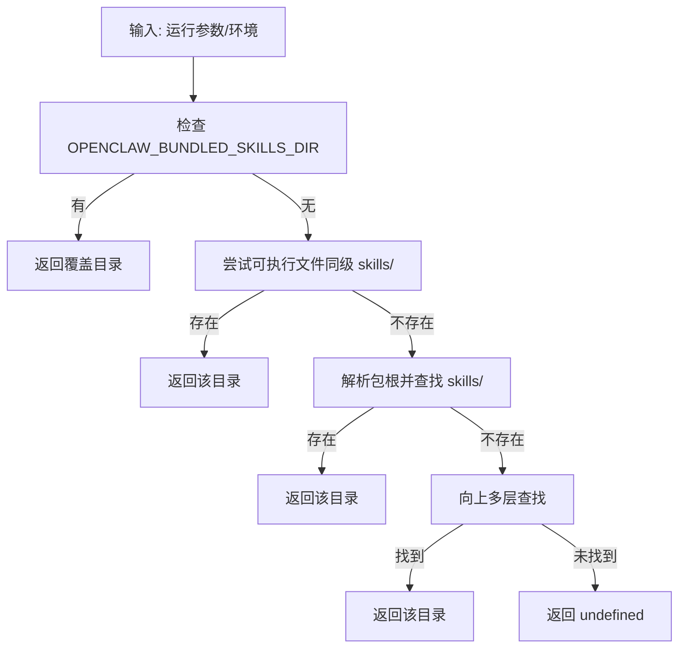
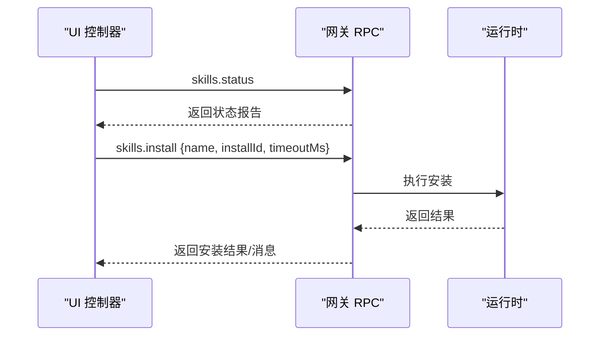
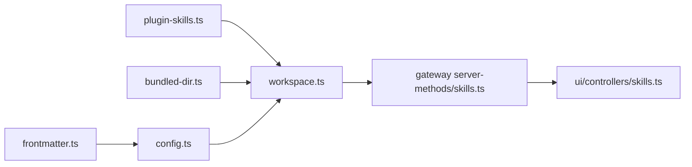

# 技能系统

<cite>
**本文引用的文件**
- [skills.md](file://docs/tools/skills.md)
- [creating-skills.md](file://docs/tools/creating-skills.md)
- [skills-config.md](file://docs/tools/skills-config.md)
- [workspace.ts](file://src/agents/skills/workspace.ts)
- [types.ts](file://src/agents/skills/types.ts)
- [frontmatter.ts](file://src/agents/skills/frontmatter.ts)
- [config.ts](file://src/agents/skills/config.ts)
- [plugin-skills.ts](file://src/agents/skills/plugin-skills.ts)
- [bundled-dir.ts](file://src/agents/skills/bundled-dir.ts)
- [skills.ts（网关服务端）](file://src/gateway/server-methods/skills.ts)
- [skills.ts（UI 控制器）](file://ui/src/ui/controllers/skills.ts)
- [SKILL.md（技能模板）](file://skills/skill-creator/SKILL.md)
- [SKILL.md（lobster 插件技能）](file://extensions/lobster/SKILL.md)
</cite>

## 目录
1. [简介](#简介)
2. [项目结构](#项目结构)
3. [核心组件](#核心组件)
4. [架构总览](#架构总览)
5. [详细组件分析](#详细组件分析)
6. [依赖关系分析](#依赖关系分析)
7. [性能考量](#性能考量)
8. [故障排查指南](#故障排查指南)
9. [结论](#结论)
10. [附录](#附录)

## 简介
本文件系统性阐述 OpenClaw 的“技能系统”，覆盖技能的定义、安装、配置与管理机制；解释技能生命周期、依赖解析与版本控制；说明内置技能与插件技能的实现原理；并提供自定义技能开发流程、测试方法与发布策略，以及安全模型、权限控制与性能优化建议。目标是帮助用户与开发者高效使用与扩展技能系统。

## 项目结构
技能系统由“文档规范 + 核心运行时 + 网关 RPC + UI 控制器 + 示例技能”构成，关键位置如下：
- 文档层：技能格式、配置、安装与更新、安全与性能等说明
- 运行时层：技能发现、加载、过滤、命令生成、提示词注入与快照
- 网关层：RPC 方法提供安装、更新、状态查询等能力
- UI 层：技能列表、安装、错误处理与消息反馈
- 示例层：内置技能与插件技能样例

图表来源
- [skills.md](file://docs/tools/skills.md#L1-L302)
- [creating-skills.md](file://docs/tools/creating-skills.md#L1-L59)
- [skills-config.md](file://docs/tools/skills-config.md#L1-L78)
- [workspace.ts](file://src/agents/skills/workspace.ts#L1-L761)
- [types.ts](file://src/agents/skills/types.ts#L1-L90)
- [frontmatter.ts](file://src/agents/skills/frontmatter.ts#L1-L229)
- [config.ts](file://src/agents/skills/config.ts#L1-L103)
- [plugin-skills.ts](file://src/agents/skills/plugin-skills.ts#L1-L90)
- [bundled-dir.ts](file://src/agents/skills/bundled-dir.ts#L1-L91)
- [skills.ts（网关服务端）](file://src/gateway/server-methods/skills.ts#L134-L180)
- [skills.ts（UI 控制器）](file://ui/src/ui/controllers/skills.ts#L46-L157)
- [SKILL.md（技能模板）](file://skills/skill-creator/SKILL.md#L1-L373)
- [SKILL.md（lobster 插件技能）](file://extensions/lobster/SKILL.md#L1-L98)

章节来源
- [skills.md](file://docs/tools/skills.md#L1-L302)
- [creating-skills.md](file://docs/tools/creating-skills.md#L1-L59)
- [skills-config.md](file://docs/tools/skills-config.md#L1-L78)

## 核心组件
- 技能定义与格式
  - 基于 AgentSkills 规范，每个技能为包含 SKILL.md 的目录；SKILL.md 使用 YAML frontmatter 提供 name/description 等元信息，正文提供使用说明与工具定义。
  - 支持 metadata.openclaw 扩展字段，用于 gating（平台、二进制、环境变量、配置项）、安装器、主密钥环境变量等。
- 技能加载与优先级
  - 来源与优先级：工作区技能（最高）→ 受管本地技能 → 内置技能（最低），并支持额外扫描目录与插件技能目录。
  - 加载限制：按来源与候选数量限制扫描，避免过大目录导致性能问题；对 SKILL.md 大小进行上限控制。
- 可执行性与配置过滤
  - 在加载阶段根据 metadata.openclaw 与配置决定是否纳入；支持允许白名单仅启用特定内置技能。
- 提示词注入与会话快照
  - 将可用技能汇总为紧凑 XML 注入系统提示，支持按字符数与数量限制；会话开始时快照，后续回合复用，变更在新会话或监视器触发时热更新。
- 命令生成与分发
  - 将技能名称规范化为用户可调用的斜杠命令，去重与长度截断；支持“直接工具分发”模式，绕过模型直接调用指定工具。
- 安装与更新
  - 网关提供 skills.install/skills.update RPC；UI 提供安装入口与错误反馈；支持多平台安装器（brew/node/go/uv/download）与偏好设置。
- 插件与内置技能
  - 插件可在 openclaw.plugin.json 中声明 skills 目录，随插件启用参与优先级；内置技能目录通过多种方式解析，支持打包或编译后场景。

章节来源
- [workspace.ts](file://src/agents/skills/workspace.ts#L221-L406)
- [config.ts](file://src/agents/skills/config.ts#L70-L102)
- [frontmatter.ts](file://src/agents/skills/frontmatter.ts#L192-L224)
- [types.ts](file://src/agents/skills/types.ts#L19-L90)
- [plugin-skills.ts](file://src/agents/skills/plugin-skills.ts#L15-L89)
- [bundled-dir.ts](file://src/agents/skills/bundled-dir.ts#L36-L90)
- [skills.ts（网关服务端）](file://src/gateway/server-methods/skills.ts#L134-L180)
- [skills.ts（UI 控制器）](file://ui/src/ui/controllers/skills.ts#L46-L157)

## 架构总览
下图展示从 UI 到网关再到运行时的技能安装与状态查询流程：

图表来源
- [skills.ts（网关服务端）](file://src/gateway/server-methods/skills.ts#L134-L180)
- [skills.ts（UI 控制器）](file://ui/src/ui/controllers/skills.ts#L46-L157)
- [workspace.ts](file://src/agents/skills/workspace.ts#L589-L645)

## 详细组件分析

### 组件一：技能加载与优先级（workspace.ts）
- 功能要点
  - 从多个来源收集技能：内置、受管本地、额外目录、个人/项目级 agents 技能、工作区技能，并按优先级合并。
  - 对每个来源进行扫描限制与大小限制，避免异常目录拖慢系统。
  - 解析 SKILL.md 的 frontmatter 与 metadata.openclaw，生成 SkillEntry。
  - 生成技能提示块与命令规范，支持“直接工具分发”。
- 关键流程（节选）

图表来源
- [workspace.ts](file://src/agents/skills/workspace.ts#L221-L406)
- [frontmatter.ts](file://src/agents/skills/frontmatter.ts#L192-L224)
- [config.ts](file://src/agents/skills/config.ts#L70-L102)

章节来源
- [workspace.ts](file://src/agents/skills/workspace.ts#L221-L406)
- [frontmatter.ts](file://src/agents/skills/frontmatter.ts#L192-L224)
- [config.ts](file://src/agents/skills/config.ts#L70-L102)

### 组件二：元数据与安装器解析（frontmatter.ts）
- 功能要点
  - 解析 metadata.openclaw，提取 always/os/requires/install 等字段。
  - 校验安装器参数（brew/node/go/uv/download），确保安全与合法性。
  - 解析用户可调用策略与禁用模型调用策略。
- 关键类型（节选）

图表来源
- [types.ts](file://src/agents/skills/types.ts#L19-L57)
- [frontmatter.ts](file://src/agents/skills/frontmatter.ts#L110-L190)

章节来源
- [frontmatter.ts](file://src/agents/skills/frontmatter.ts#L192-L224)
- [types.ts](file://src/agents/skills/types.ts#L19-L57)

### 组件三：可执行性与配置过滤（config.ts）
- 功能要点
  - 读取配置中的 skills.entries.* 字段，支持 enabled/env/apiKey/config。
  - 允许白名单仅启用特定内置技能。
  - 评估运行时可执行性：平台匹配、二进制存在、任一二进制存在、环境变量存在、配置路径为真。
- 关键流程（节选）

图表来源
- [config.ts](file://src/agents/skills/config.ts#L70-L102)

章节来源
- [config.ts](file://src/agents/skills/config.ts#L70-L102)

### 组件四：插件技能目录解析（plugin-skills.ts）
- 功能要点
  - 从插件清单中解析已启用插件的 skills 目录，校验路径安全性（不可逃逸插件根）。
  - 支持 ACP 路由插件在 ACP 明确关闭时的特殊处理。
- 关键流程（节选）

图表来源
- [plugin-skills.ts](file://src/agents/skills/plugin-skills.ts#L15-L89)

章节来源
- [plugin-skills.ts](file://src/agents/skills/plugin-skills.ts#L15-L89)

### 组件五：内置技能目录解析（bundled-dir.ts）
- 功能要点
  - 支持通过环境变量覆盖内置技能目录。
  - 在不同运行环境下（打包/编译/开发）自动定位内置 skills 目录。
- 关键流程（节选）

图表来源
- [bundled-dir.ts](file://src/agents/skills/bundled-dir.ts#L36-L90)

章节来源
- [bundled-dir.ts](file://src/agents/skills/bundled-dir.ts#L36-L90)

### 组件六：安装与更新（网关 RPC + UI）
- 网关 RPC
  - skills.install：接收 name/installId/timeoutMs，调用运行时安装逻辑，返回结果或错误形状。
  - skills.update：接收 skillKey/enabled/apiKey/env 等，合并到配置并持久化。
  - skills.status：返回技能状态报告。
- UI 控制器
  - 调用 skills.status 获取技能列表与状态。
  - 调用 skills.install 发起安装，设置忙碌态与消息反馈，捕获错误并显示。

图表来源
- [skills.ts（网关服务端）](file://src/gateway/server-methods/skills.ts#L134-L180)
- [skills.ts（UI 控制器）](file://ui/src/ui/controllers/skills.ts#L46-L157)

章节来源
- [skills.ts（网关服务端）](file://src/gateway/server-methods/skills.ts#L134-L180)
- [skills.ts（UI 控制器）](file://ui/src/ui/controllers/skills.ts#L46-L157)

### 组件七：内置技能与插件技能示例
- 内置模板技能（skill-creator）
  - 提供技能设计原则、资源组织、命名规范与打包流程，适合作为自定义技能的起点。
- 插件技能示例（lobster）
  - 展示如何编写面向多步骤工作流与审批点的技能说明与行为约束。

章节来源
- [SKILL.md（技能模板）](file://skills/skill-creator/SKILL.md#L1-L373)
- [SKILL.md（lobster 插件技能）](file://extensions/lobster/SKILL.md#L1-L98)

## 依赖关系分析
- 组件耦合
  - workspace.ts 依赖 frontmatter.ts、config.ts、plugin-skills.ts、bundled-dir.ts，形成“解析元数据 → 过滤 → 合并 → 生成命令/提示”的闭环。
  - 网关 RPC 依赖运行时加载与过滤逻辑，UI 依赖网关 RPC。
- 外部依赖
  - AgentSkills 规范与 pi-coding-agent 的提示格式化工具。
  - 插件清单与启用状态影响技能目录解析。
- 潜在循环
  - 当前模块间以单向依赖为主，未见明显循环。

图表来源
- [workspace.ts](file://src/agents/skills/workspace.ts#L1-L761)
- [frontmatter.ts](file://src/agents/skills/frontmatter.ts#L1-L229)
- [config.ts](file://src/agents/skills/config.ts#L1-L103)
- [plugin-skills.ts](file://src/agents/skills/plugin-skills.ts#L1-L90)
- [bundled-dir.ts](file://src/agents/skills/bundled-dir.ts#L1-L91)
- [skills.ts（网关服务端）](file://src/gateway/server-methods/skills.ts#L134-L180)
- [skills.ts（UI 控制器）](file://ui/src/ui/controllers/skills.ts#L46-L157)

章节来源
- [workspace.ts](file://src/agents/skills/workspace.ts#L1-L761)
- [frontmatter.ts](file://src/agents/skills/frontmatter.ts#L1-L229)
- [config.ts](file://src/agents/skills/config.ts#L1-L103)
- [plugin-skills.ts](file://src/agents/skills/plugin-skills.ts#L1-L90)
- [bundled-dir.ts](file://src/agents/skills/bundled-dir.ts#L1-L91)
- [skills.ts（网关服务端）](file://src/gateway/server-methods/skills.ts#L134-L180)
- [skills.ts（UI 控制器）](file://ui/src/ui/controllers/skills.ts#L46-L157)

## 性能考量
- 提示词注入成本
  - 基础开销与每技能字符数呈线性增长；建议控制技能数量与描述长度，必要时使用“技能检查”审计。
- 快照与热更新
  - 会话开始时快照技能列表，减少重复构建；启用监视器可实现变更后的下一轮热更新。
- 加载限制
  - 按来源限制最大加载数量与候选扫描数量，限制 SKILL.md 最大大小，避免异常目录造成性能问题。
- 系统提示压缩
  - 将路径中的家目录替换为“~”以降低 token 成本。

章节来源
- [skills.md](file://docs/tools/skills.md#L268-L285)
- [workspace.ts](file://src/agents/skills/workspace.ts#L44-L53)
- [workspace.ts](file://src/agents/skills/workspace.ts#L482-L517)

## 故障排查指南
- 安装失败
  - 检查安装器偏好与平台兼容性；确认网络可达与目标目录写权限；查看 UI 错误消息与网关返回的错误形状。
- 技能未出现
  - 确认技能名称与 frontmatter；检查是否被配置禁用或内置允许白名单过滤；核对优先级与路径合法性。
- 环境变量未生效
  - 受限于运行模式：沙箱内需通过全局或镜像 bake 注入；非沙箱模式下仅在宿主运行时注入。
- 提示词过大
  - 使用“技能检查”审计；减少技能数量或缩短描述；必要时调整限制配置。

章节来源
- [skills.ts（UI 控制器）](file://ui/src/ui/controllers/skills.ts#L125-L157)
- [skills.ts（网关服务端）](file://src/gateway/server-methods/skills.ts#L146-L180)
- [skills-config.md](file://docs/tools/skills-config.md#L67-L78)
- [skills.md](file://docs/tools/skills.md#L286-L302)

## 结论
OpenClaw 的技能系统以 AgentSkills 兼容格式为核心，结合 metadata.openclaw 的强表达力实现灵活的可执行性与安装器管理；通过多来源优先级与严格的安全校验，兼顾易用性与可控性。运行时提供会话快照与热更新，网关与 UI 提供完善的安装与状态管理。遵循本文的开发、测试与发布流程，可高效构建高质量技能并保障安全与性能。

## 附录

### A. 技能开发与测试流程
- 创建步骤
  - 在工作区创建技能目录并编写 SKILL.md（frontmatter + 正文）。
  - 可选：添加 scripts/references/assets 等资源。
  - 通过“刷新技能”或重启网关使新技能生效。
- 测试建议
  - 使用命令行或 UI 触发技能，验证提示词注入与工具调用。
  - 在沙箱与非沙箱两种模式下分别测试敏感操作。
- 发布策略
  - 推荐通过 ClawHub 分发；遵循安全最佳实践，避免注入不受信任代码。

章节来源
- [creating-skills.md](file://docs/tools/creating-skills.md#L17-L59)
- [SKILL.md（技能模板）](file://skills/skill-creator/SKILL.md#L201-L373)

### B. 技能市场与安装器
- ClawHub
  - 提供技能浏览、安装、更新与备份；常用命令包括安装与同步。
- 安装器
  - 支持 brew/node/go/uv/download；可按平台过滤与偏好选择；Node 管理器可配置（npm/pnpm/yarn/bun）。

章节来源
- [skills.md](file://docs/tools/skills.md#L50-L68)
- [frontmatter.ts](file://src/agents/skills/frontmatter.ts#L110-L190)
- [skills-config.md](file://docs/tools/skills-config.md#L22-L26)

### C. 安全模型与权限控制
- 第三方技能视为不受信；建议沙箱运行与最小权限原则。
- secrets 注入仅在宿主运行时生效；沙箱内需通过全局或镜像 bake 注入。
- 路径合法性校验防止插件技能逃逸插件根。

章节来源
- [skills.md](file://docs/tools/skills.md#L69-L76)
- [plugin-skills.ts](file://src/agents/skills/plugin-skills.ts#L76-L79)
- [skills-config.md](file://docs/tools/skills-config.md#L67-L78)