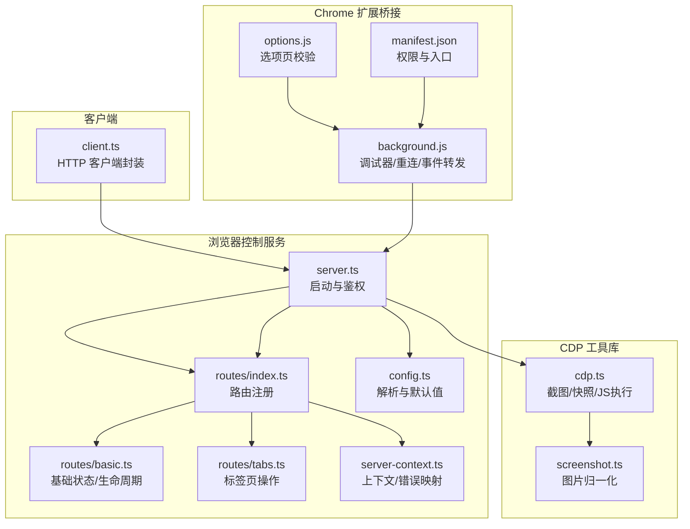
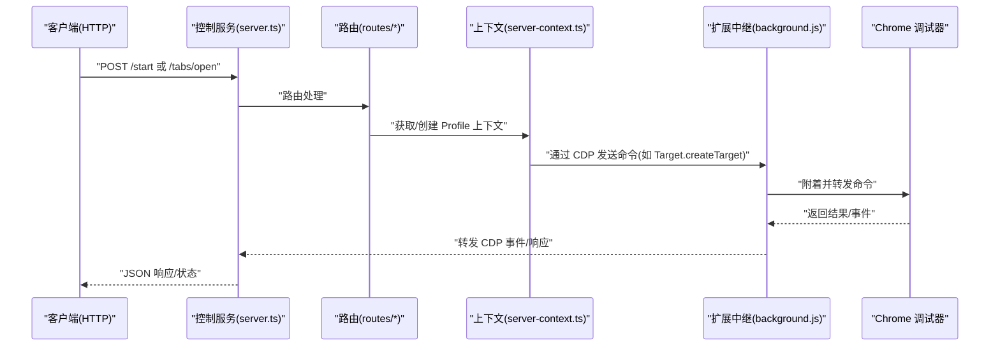
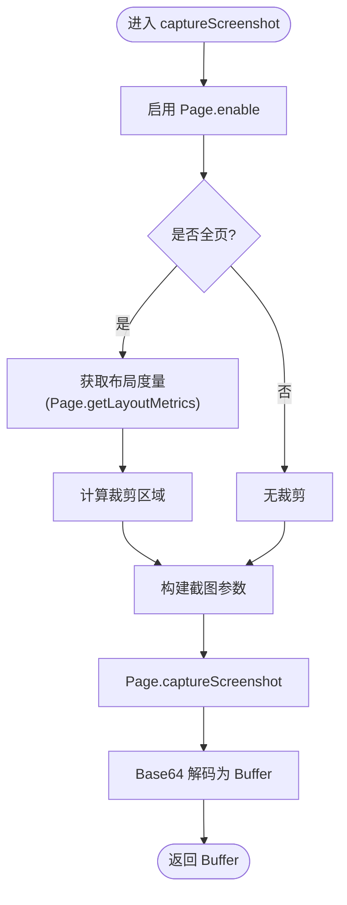
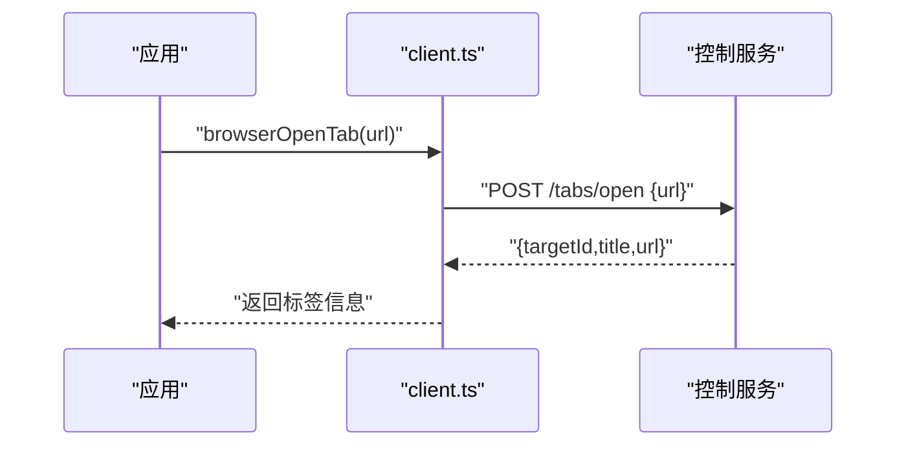
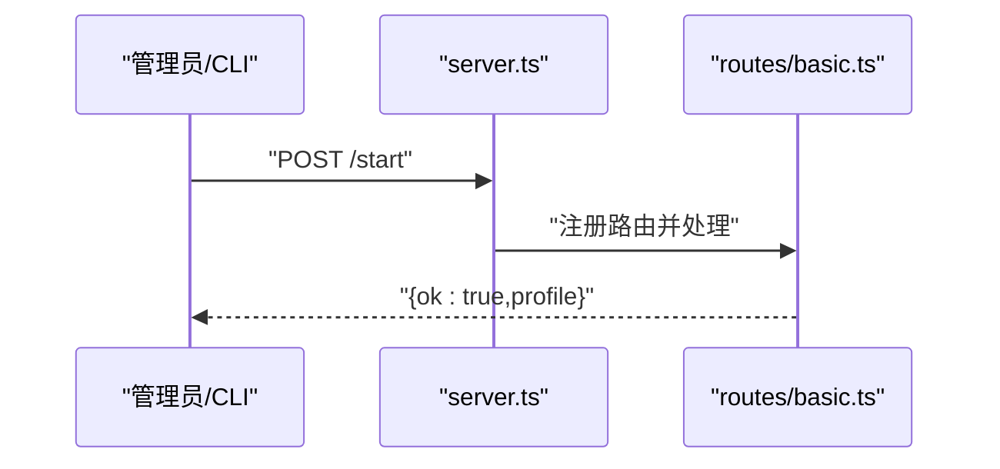
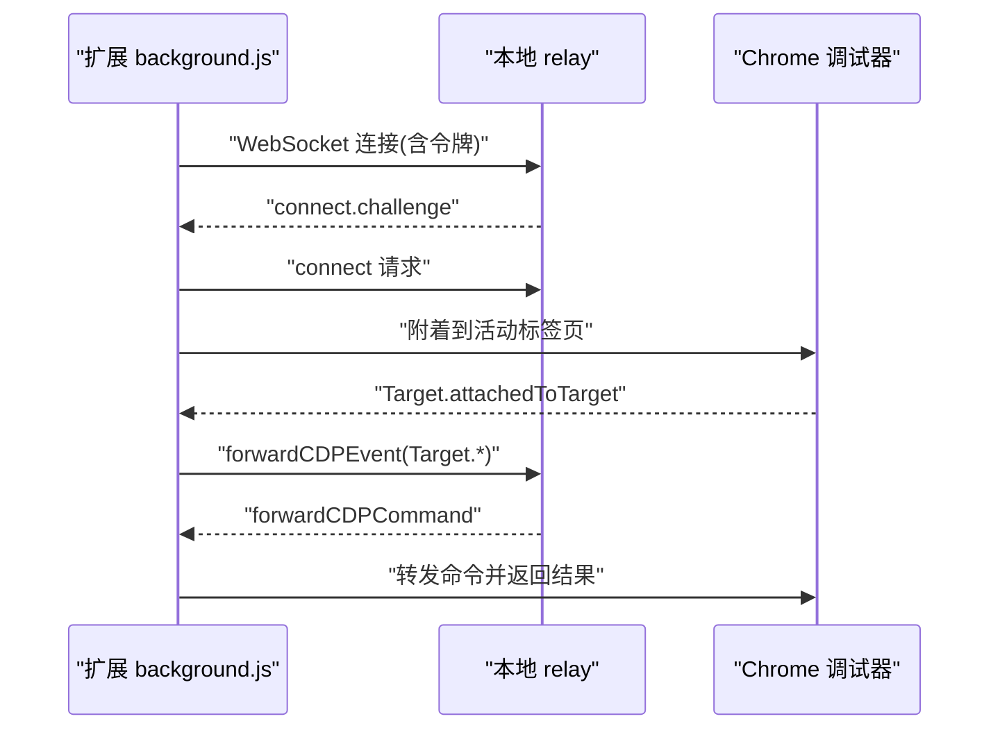
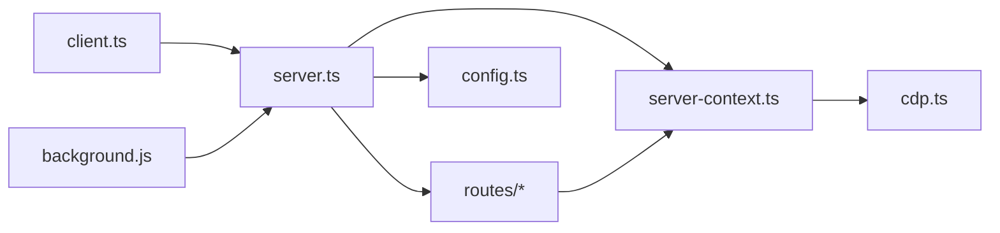
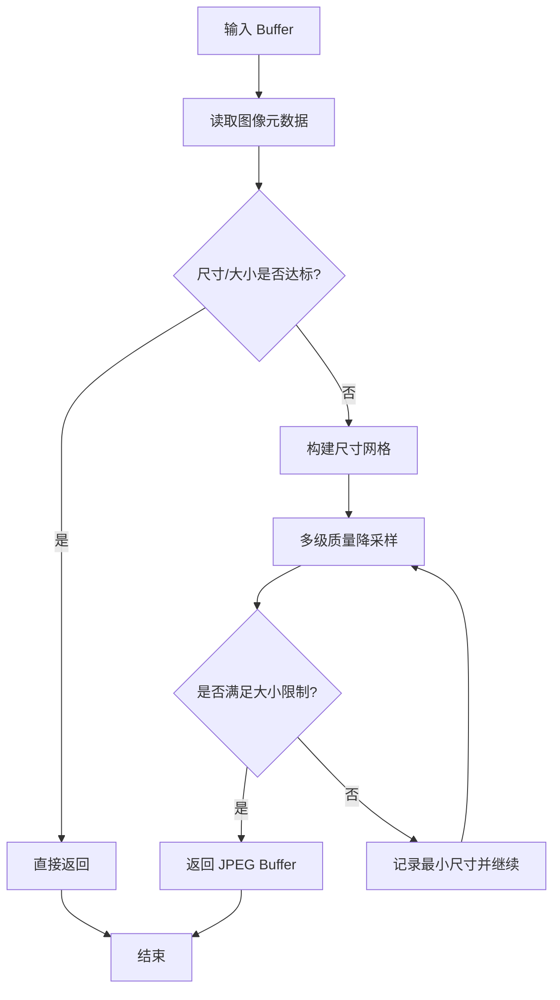

# 浏览器控制

<cite>
**本文引用的文件**
- [src/browser/cdp.ts](file://src/browser/cdp.ts)
- [src/browser/client.ts](file://src/browser/client.ts)
- [src/browser/server.ts](file://src/browser/server.ts)
- [src/browser/config.ts](file://src/browser/config.ts)
- [src/browser/routes/index.ts](file://src/browser/routes/index.ts)
- [src/browser/routes/basic.ts](file://src/browser/routes/basic.ts)
- [src/browser/routes/tabs.ts](file://src/browser/routes/tabs.ts)
- [src/browser/server-context.ts](file://src/browser/server-context.ts)
- [src/browser/screenshot.ts](file://src/browser/screenshot.ts)
- [assets/chrome-extension/background.js](file://assets/chrome-extension/background.js)
- [assets/chrome-extension/options.js](file://assets/chrome-extension/options.js)
- [assets/chrome-extension/manifest.json](file://assets/chrome-extension/manifest.json)
</cite>

## 目录
1. [简介](#简介)
2. [项目结构](#项目结构)
3. [核心组件](#核心组件)
4. [架构总览](#架构总览)
5. [详细组件分析](#详细组件分析)
6. [依赖关系分析](#依赖关系分析)
7. [性能考量](#性能考量)
8. [故障排除指南](#故障排除指南)
9. [结论](#结论)
10. [附录](#附录)

## 简介
本文件面向开发者，系统化阐述 OpenClaw 的浏览器控制系统，重点覆盖以下方面：
- Chrome DevTools Protocol（CDP）在本地与扩展桥接中的使用方式
- 页面自动化与交互控制（导航、元素查询、截图、下载等）
- 浏览器实例管理、标签页操作、用户代理与会话持久化策略
- 配置项、性能优化与跨平台兼容性
- 安全限制与调试技巧

该系统通过本地 HTTP 控制服务暴露浏览器能力，并通过 Chrome 扩展作为“本地中继”将现有 Chrome 标签页接入 OpenClaw 的 CDP 命令流，从而实现对真实浏览器的读写控制。

## 项目结构
浏览器控制子系统由“服务端控制接口 + CDP 工具库 + 客户端调用 + Chrome 扩展桥接”四部分组成，采用按职责分层组织：

图表来源
- [src/browser/server.ts](file://src/browser/server.ts#L21-L92)
- [src/browser/routes/index.ts](file://src/browser/routes/index.ts#L7-L11)
- [src/browser/routes/basic.ts](file://src/browser/routes/basic.ts#L25-L202)
- [src/browser/routes/tabs.ts](file://src/browser/routes/tabs.ts#L97-L217)
- [src/browser/server-context.ts](file://src/browser/server-context.ts#L117-L242)
- [src/browser/config.ts](file://src/browser/config.ts#L204-L301)
- [src/browser/cdp.ts](file://src/browser/cdp.ts#L33-L85)
- [src/browser/screenshot.ts](file://src/browser/screenshot.ts#L11-L58)
- [assets/chrome-extension/background.js](file://assets/chrome-extension/background.js#L130-L191)
- [assets/chrome-extension/options.js](file://assets/chrome-extension/options.js#L26-L49)
- [assets/chrome-extension/manifest.json](file://assets/chrome-extension/manifest.json#L12-L24)

章节来源
- [src/browser/server.ts](file://src/browser/server.ts#L21-L92)
- [src/browser/routes/index.ts](file://src/browser/routes/index.ts#L7-L11)
- [src/browser/config.ts](file://src/browser/config.ts#L204-L301)

## 核心组件
- 控制服务与路由
  - 启动与鉴权：加载配置、安装中间件、绑定路由、监听本地回环端口
  - 路由注册：基础状态/生命周期、标签页操作、智能体专用端点
- CDP 工具库
  - 截图：支持 PNG/JPEG、全页布局测量、裁剪
  - 快照：可访问性树与 DOM 树抽取
  - JavaScript 执行：运行时启用、结果返回与异常详情
- 客户端
  - 封装 HTTP 接口：状态、生命周期、标签页、快照等
- Chrome 扩展桥接
  - 本地中继：WebSocket 连接本地 relay，转发 CDP 命令/事件
  - 自动重连：指数退避、断线恢复、状态持久化
  - 导航重附着：SPA/重 JS 加载场景下的自动再附着

章节来源
- [src/browser/server.ts](file://src/browser/server.ts#L21-L92)
- [src/browser/routes/basic.ts](file://src/browser/routes/basic.ts#L25-L202)
- [src/browser/routes/tabs.ts](file://src/browser/routes/tabs.ts#L97-L217)
- [src/browser/cdp.ts](file://src/browser/cdp.ts#L33-L85)
- [src/browser/client.ts](file://src/browser/client.ts#L101-L337)
- [assets/chrome-extension/background.js](file://assets/chrome-extension/background.js#L130-L191)

## 架构总览
OpenClaw 的浏览器控制采用“本地控制服务 + 扩展中继”的双层架构：
- 本地控制服务：提供 HTTP API，负责浏览器生命周期、标签页管理、配置热更新与错误映射
- 扩展中继：以 Chrome Debugger API 附着到现有标签页，通过 WebSocket 将 CDP 命令/事件转发至本地控制服务
- CDP 工具库：在本地或通过扩展中继，统一执行截图、快照、JS 评估等操作

图表来源
- [src/browser/server.ts](file://src/browser/server.ts#L54-L62)
- [src/browser/routes/basic.ts](file://src/browser/routes/basic.ts#L94-L121)
- [src/browser/routes/tabs.ts](file://src/browser/routes/tabs.ts#L114-L131)
- [src/browser/server-context.ts](file://src/browser/server-context.ts#L117-L142)
- [assets/chrome-extension/background.js](file://assets/chrome-extension/background.js#L629-L703)

## 详细组件分析

### CDP 工具库（截图、快照、JS 执行）
- 截图
  - 支持 PNG/JPEG，可选质量参数；全页模式基于布局度量计算裁剪区域
  - 通过 withCdpSocket 统一封装 WebSocket 生命周期
- 可访问性快照与 DOM 快照
  - Accessibility.getFullAXTree + 格式化输出
  - DOM 快照通过注入脚本遍历节点，限制节点数与文本长度
- JavaScript 执行
  - Runtime.evaluate，支持 awaitPromise 与 returnByValue
  - 返回结果与异常详情，便于上层诊断

图表来源
- [src/browser/cdp.ts](file://src/browser/cdp.ts#L33-L85)

章节来源
- [src/browser/cdp.ts](file://src/browser/cdp.ts#L33-L85)
- [src/browser/cdp.ts](file://src/browser/cdp.ts#L136-L164)
- [src/browser/cdp.ts](file://src/browser/cdp.ts#L259-L272)
- [src/browser/cdp.ts](file://src/browser/cdp.ts#L274-L341)
- [src/browser/cdp.ts](file://src/browser/cdp.ts#L358-L397)
- [src/browser/cdp.ts](file://src/browser/cdp.ts#L399-L451)

### 客户端 API（HTTP 客户端封装）
- 基础状态与生命周期
  - 浏览器状态、启动/停止、重置配置
- 标签页操作
  - 列表、打开、聚焦、关闭、动作集合（列表/新建/关闭/选择）
- 快照
  - 支持 ARIA 与 AI 模式，可选限制与标签生成

图表来源
- [src/browser/client.ts](file://src/browser/client.ts#L216-L228)
- [src/browser/routes/tabs.ts](file://src/browser/routes/tabs.ts#L114-L131)

章节来源
- [src/browser/client.ts](file://src/browser/client.ts#L101-L337)

### 服务端控制与路由
- 启动流程
  - 读取配置、解析鉴权、安装中间件、注册路由、绑定本地端口
  - 失败闭合策略：鉴权初始化失败且无回退时拒绝启动
- 基础路由
  - /profiles、/、/start、/stop、/reset-profile、/profiles/create、/profiles/:name
- 标签页路由
  - /tabs、/tabs/open、/tabs/focus、/tabs/:targetId、/tabs/action

图表来源
- [src/browser/server.ts](file://src/browser/server.ts#L21-L92)
- [src/browser/routes/basic.ts](file://src/browser/routes/basic.ts#L93-L121)

章节来源
- [src/browser/server.ts](file://src/browser/server.ts#L21-L92)
- [src/browser/routes/basic.ts](file://src/browser/routes/basic.ts#L25-L202)
- [src/browser/routes/tabs.ts](file://src/browser/routes/tabs.ts#L97-L217)

### 服务器上下文与错误映射
- Profile 上下文
  - 为每个配置文件生成独立上下文，封装可用性检查、标签页操作、重置等
- 错误映射
  - 将底层异常映射为 HTTP 状态码与消息，便于客户端处理

章节来源
- [src/browser/server-context.ts](file://src/browser/server-context.ts#L117-L242)

### 配置解析与默认值
- 默认端口派生：从网关端口推导控制端口与 CDP 端口范围
- SSRF 策略：允许私有网络、主机白名单等
- 默认配置：颜色、headless、no-sandbox、attach-only、额外启动参数等

章节来源
- [src/browser/config.ts](file://src/browser/config.ts#L204-L301)

### Chrome 扩展桥接（本地中继）
- 中继连接
  - 通过本地 relay 端口与网关令牌建立 WebSocket，预检可达性
  - 成功后注册消息处理与断线重连
- 调试器附着
  - 附着到活动标签页，启用 Page.enable，记录会话/目标 ID
  - 支持 Target.createTarget、Target.closeTarget、Target.activateTarget
- 事件转发
  - 将 Target.*、Runtime.* 等事件转发给本地控制服务
- 自动重连与导航重附着
  - 断线指数退避；导航后尝试多次重附着，提升 SPA 场景稳定性
- 选项页校验
  - 通过后台脚本绕过 CORS，验证 relay 可达性与令牌有效性

图表来源
- [assets/chrome-extension/background.js](file://assets/chrome-extension/background.js#L130-L191)
- [assets/chrome-extension/background.js](file://assets/chrome-extension/background.js#L398-L460)
- [assets/chrome-extension/background.js](file://assets/chrome-extension/background.js#L629-L703)
- [assets/chrome-extension/options.js](file://assets/chrome-extension/options.js#L26-L49)
- [assets/chrome-extension/manifest.json](file://assets/chrome-extension/manifest.json#L12-L24)

章节来源
- [assets/chrome-extension/background.js](file://assets/chrome-extension/background.js#L130-L191)
- [assets/chrome-extension/background.js](file://assets/chrome-extension/background.js#L629-L703)
- [assets/chrome-extension/background.js](file://assets/chrome-extension/background.js#L800-L837)
- [assets/chrome-extension/options.js](file://assets/chrome-extension/options.js#L26-L49)
- [assets/chrome-extension/manifest.json](file://assets/chrome-extension/manifest.json#L12-L24)

## 依赖关系分析
- 组件耦合
  - server.ts 仅依赖配置解析与中间件，路由模块化，降低耦合
  - cdp.ts 与扩展桥接解耦，既可本地直连也可经扩展中继
  - client.ts 仅依赖 HTTP 接口，便于替换实现
- 外部依赖
  - Express、Chrome Debugger API、WebSocket
- 潜在循环依赖
  - 路由与上下文通过函数式注入避免直接循环引用

图表来源
- [src/browser/server.ts](file://src/browser/server.ts#L54-L62)
- [src/browser/routes/index.ts](file://src/browser/routes/index.ts#L7-L11)
- [src/browser/server-context.ts](file://src/browser/server-context.ts#L117-L142)
- [src/browser/cdp.ts](file://src/browser/cdp.ts#L1-L10)
- [src/browser/client.ts](file://src/browser/client.ts#L1-L10)

章节来源
- [src/browser/server.ts](file://src/browser/server.ts#L54-L62)
- [src/browser/routes/index.ts](file://src/browser/routes/index.ts#L7-L11)
- [src/browser/server-context.ts](file://src/browser/server-context.ts#L117-L142)

## 性能考量
- 截图体积控制
  - 归一化流程根据最大边长与字节上限进行多轮缩放与降质，优先满足大小约束
- 快照与 DOM 抽取
  - 对节点数量、文本长度、HTML 长度设置上限，避免内存与带宽压力
- CDP 命令批量化
  - 在扩展桥接中，建议合并频繁命令，减少往返
- 端口与进程管理
  - 通过配置派生端口范围，避免冲突；必要时启用 no-sandbox 与 headless 以提升吞吐

章节来源
- [src/browser/screenshot.ts](file://src/browser/screenshot.ts#L11-L58)
- [src/browser/cdp.ts](file://src/browser/cdp.ts#L274-L341)
- [src/browser/cdp.ts](file://src/browser/cdp.ts#L399-L451)
- [src/browser/config.ts](file://src/browser/config.ts#L204-L301)

## 故障排除指南
- 启动失败（鉴权未就绪）
  - 现象：启动被拒绝，日志提示鉴权引导失败且无回退
  - 处理：配置网关令牌或回退密码，确保本地 relay 可用
- 无法连接本地 relay
  - 现象：扩展选项页提示不可达或令牌无效
  - 处理：确认端口、令牌正确；后台脚本已内置预检与错误分类
- 断线与重连
  - 现象：中继断开，徽章闪烁
  - 处理：扩展采用指数退避自动重连；导航后会多次尝试重附着
- 标签页操作失败
  - 现象：404/409 等错误
  - 处理：服务端上下文将底层异常映射为明确状态码；检查 targetId、索引与浏览器状态

章节来源
- [src/browser/server.ts](file://src/browser/server.ts#L45-L52)
- [assets/chrome-extension/options.js](file://assets/chrome-extension/options.js#L26-L49)
- [assets/chrome-extension/background.js](file://assets/chrome-extension/background.js#L193-L247)
- [assets/chrome-extension/background.js](file://assets/chrome-extension/background.js#L800-L837)
- [src/browser/server-context.ts](file://src/browser/server-context.ts#L205-L223)

## 结论
OpenClaw 的浏览器控制系统通过清晰的分层设计与本地中继机制，实现了对真实浏览器的稳定控制。CDP 工具库提供了截图、快照与 JS 执行等核心能力；服务端路由与上下文保证了可维护性与可观测性；Chrome 扩展桥接则打通了现有标签页与控制服务之间的通道。配合完善的配置、错误映射与重连策略，开发者可以在此基础上构建强大的浏览器自动化工具链。

## 附录

### 关键流程：截图归一化

图表来源
- [src/browser/screenshot.ts](file://src/browser/screenshot.ts#L11-L58)