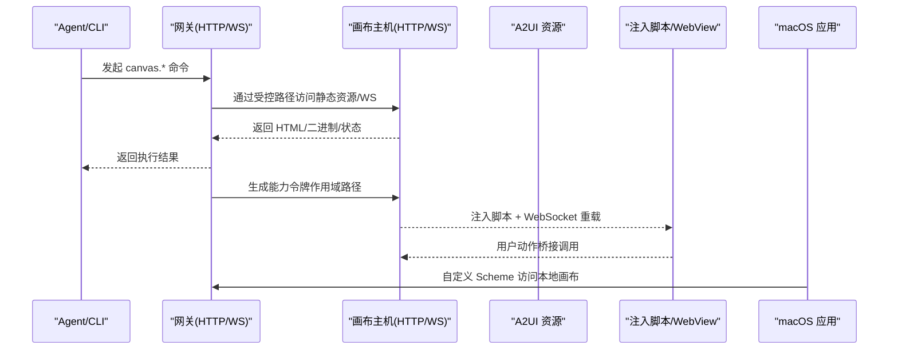
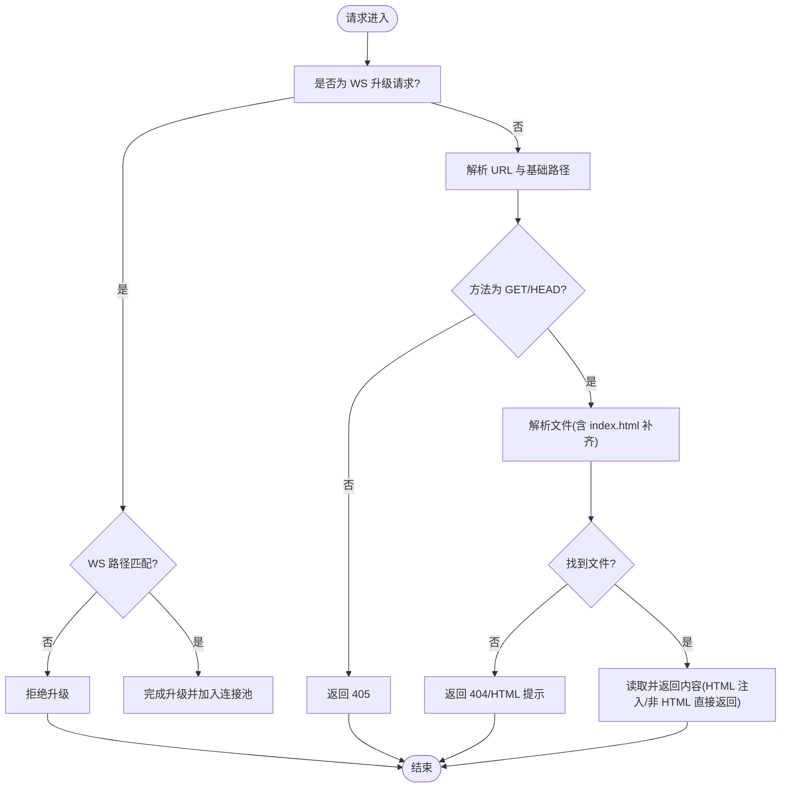
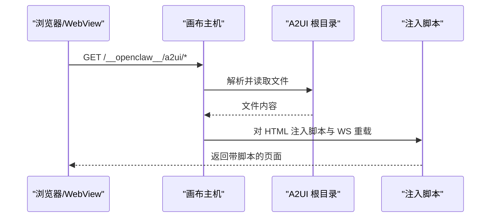
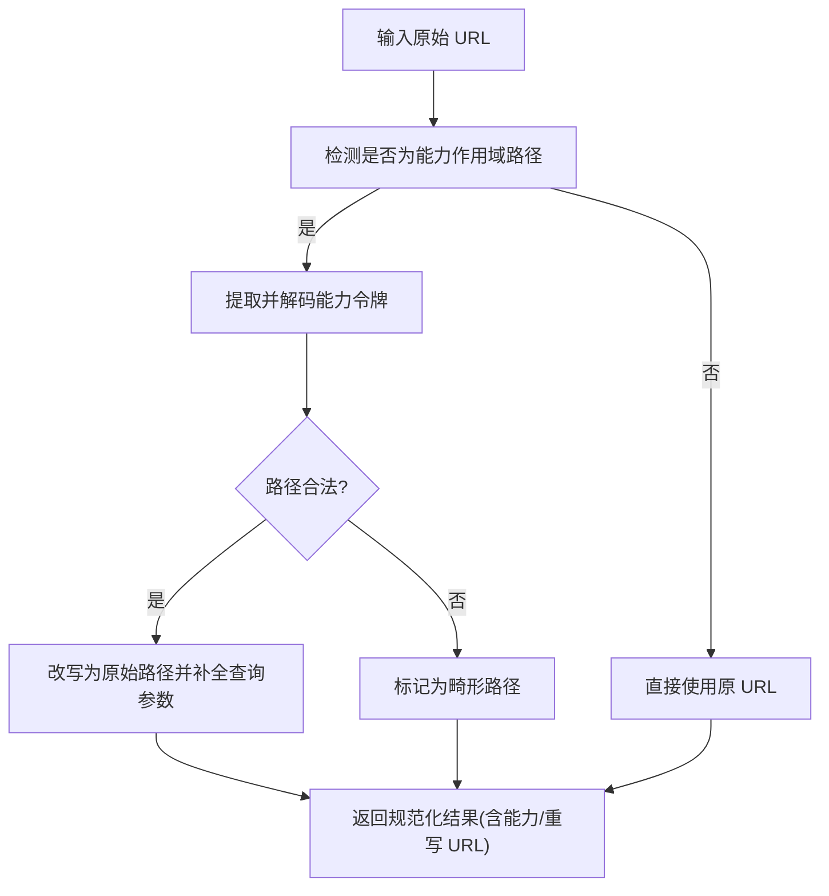
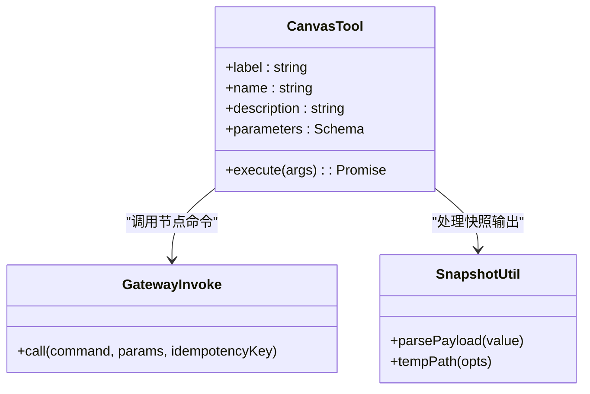
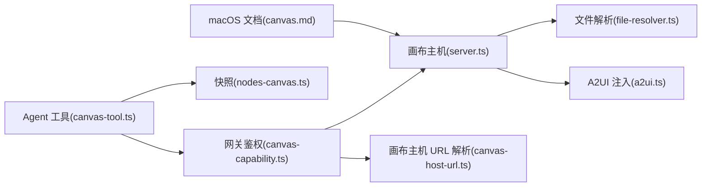

# 画布系统

<cite>
**本文引用的文件**
- [server.ts](file://src/canvas-host/server.ts)
- [a2ui.ts](file://src/canvas-host/a2ui.ts)
- [file-resolver.ts](file://src/canvas-host/file-resolver.ts)
- [canvas-capability.ts](file://src/gateway/canvas-capability.ts)
- [canvas-host-url.ts](file://src/infra/canvas-host-url.ts)
- [canvas-tool.ts](file://src/agents/tools/canvas-tool.ts)
- [nodes-canvas.ts](file://src/cli/nodes-canvas.ts)
- [CanvasCommands.swift](file://apps/shared/OpenClawKit/Sources/OpenClawKit/CanvasCommands.swift)
- [CanvasA2UICommands.swift](file://apps/shared/OpenClawKit/Sources/OpenClawKit/CanvasA2UICommands.swift)
- [CanvasA2UIAction.swift](file://apps/shared/OpenClawKit/Sources/OpenClawKit/CanvasA2UIAction.swift)
- [canvas.md](file://docs/platforms/mac/canvas.md)
- [canvas-a2ui-copy.ts](file://scripts/canvas-a2ui-copy.ts)
- [server.canvas-auth.test.ts](file://src/gateway/server.canvas-auth.test.ts)
</cite>

## 目录
1. [简介](#简介)
2. [项目结构](#项目结构)
3. [核心组件](#核心组件)
4. [架构总览](#架构总览)
5. [组件详解](#组件详解)
6. [依赖关系分析](#依赖关系分析)
7. [性能与网络适配](#性能与网络适配)
8. [故障排查指南](#故障排查指南)
9. [结论](#结论)
10. [附录：配置与部署](#附录配置与部署)

## 简介
本文件系统性阐述 OpenClaw 的画布系统，覆盖实时画布渲染、屏幕共享与图像处理机制；详述画布服务器架构、客户端连接管理与数据传输协议；包含屏幕捕获、图像编码、实时同步与权限控制的实现细节；并提供配置项、性能优化与网络适配策略，以及跨平台支持、安全与故障恢复建议，帮助开发者快速理解并正确使用画布能力。

## 项目结构
画布系统由“网关侧画布主机”“A2UI 资产托管”“命令与工具层”“平台集成（macOS）”等部分组成，形成“服务端静态资源 + WebSocket 实时推送 + 网关鉴权 + 客户端渲染”的闭环。

```mermaid
graph TB
subgraph "网关与画布主机"
GW["网关(HTTP/WS)"]
CH["画布主机(HTTP/WS)"]
CAP["能力令牌与作用域路径"]
end
subgraph "客户端与平台"
MAC["macOS 应用(WKWebView)"]
A2UI["A2UI 静态资源"]
JS["浏览器/WebView 注入脚本"]
end
GW --> CH
GW --> CAP
CH <- --> A2UI
MAC --> GW
JS --> CH
JS --> GW
```

图表来源
- [server.ts](file://src/canvas-host/server.ts#L399-L479)
- [a2ui.ts](file://src/canvas-host/a2ui.ts#L14-L210)
- [canvas-capability.ts](file://src/gateway/canvas-capability.ts#L1-L88)
- [canvas-host-url.ts](file://src/infra/canvas-host-url.ts#L57-L94)

章节来源
- [server.ts](file://src/canvas-host/server.ts#L1-L479)
- [a2ui.ts](file://src/canvas-host/a2ui.ts#L1-L210)
- [canvas-capability.ts](file://src/gateway/canvas-capability.ts#L1-L88)
- [canvas-host-url.ts](file://src/infra/canvas-host-url.ts#L1-L94)

## 核心组件
- 画布主机（Canvas Host）
  - 提供静态文件服务与 WebSocket 实时刷新，支持根目录隔离、路径规范化、文件解析与热重载。
- A2UI 资产托管
  - 托管 A2UI 前端资源，注入用户动作桥接脚本与 WebSocket 重载逻辑，支持跨平台（iOS/Android）消息通道。
- 能力令牌与作用域路径
  - 生成一次性能力令牌，将节点会话限定在特定路径前缀下，配合网关鉴权实现细粒度访问控制。
- 命令与工具层
  - CLI 与 Agent 工具封装画布操作（呈现/隐藏/导航/执行/快照/A2UI 推送），统一参数校验与错误处理。
- 平台集成（macOS）
  - 通过自定义 URL Scheme 挂载本地画布，支持自动重载、会话隔离与安全限制。

章节来源
- [server.ts](file://src/canvas-host/server.ts#L205-L397)
- [a2ui.ts](file://src/canvas-host/a2ui.ts#L142-L210)
- [canvas-capability.ts](file://src/gateway/canvas-capability.ts#L20-L87)
- [canvas-tool.ts](file://src/agents/tools/canvas-tool.ts#L80-L216)
- [canvas.md](file://docs/platforms/mac/canvas.md#L10-L126)

## 架构总览
画布系统采用“网关统一入口 + 画布主机静态服务 + A2UI 实时渲染 + 能力令牌鉴权”的分层设计。客户端通过网关建立 WebSocket 连接，同时可访问受控的画布静态资源与 A2UI 页面。平台侧（如 macOS）以 WKWebView 渲染本地或远程画布内容，并通过自定义 Scheme 与网关交互。



图表来源
- [server.ts](file://src/canvas-host/server.ts#L416-L478)
- [a2ui.ts](file://src/canvas-host/a2ui.ts#L81-L140)
- [canvas-capability.ts](file://src/gateway/canvas-capability.ts#L24-L87)
- [canvas.md](file://docs/platforms/mac/canvas.md#L16-L42)

## 组件详解

### 画布主机（HTTP/WS 服务）
- 功能要点
  - 静态文件服务：基于根目录与基础路径，解析 URL 并返回对应文件，自动补齐 index.html。
  - WebSocket 实时刷新：在启用 liveReload 时，监听文件变更并通过 WS 推送“reload”事件，触发页面自动刷新。
  - 升级处理：仅允许特定 WS 路径进行升级，其他请求交由 HTTP 处理器。
  - 安全与隔离：使用安全打开策略避免目录穿越，拒绝符号链接与非法路径。
- 关键行为
  - 环境开关：可通过环境变量禁用画布主机（测试/开发场景）。
  - 根目录准备：若缺少默认 index.html，自动写入内置骨架页。
  - 错误处理：请求失败记录日志并返回标准错误码。



图表来源
- [server.ts](file://src/canvas-host/server.ts#L301-L397)
- [file-resolver.ts](file://src/canvas-host/file-resolver.ts#L11-L50)

章节来源
- [server.ts](file://src/canvas-host/server.ts#L205-L397)
- [file-resolver.ts](file://src/canvas-host/file-resolver.ts#L1-L51)

### A2UI 资产托管与注入脚本
- 功能要点
  - 资产定位：多候选路径解析 A2UI 根目录，确保打包后与开发态均可用。
  - 注入脚本：向 HTML 注入跨平台动作桥接函数与 WebSocket 重载逻辑，支持 iOS/Android WebView。
  - 请求处理：对 A2UI 路径前缀的请求进行安全解析与 MIME 类型判定。
- 关键行为
  - 若未找到 A2UI 资产，返回 503。
  - HEAD 请求仅返回头信息，不读取文件体。
  - HTML 文件自动注入脚本与 WS 重载。



图表来源
- [a2ui.ts](file://src/canvas-host/a2ui.ts#L142-L210)
- [server.ts](file://src/canvas-host/server.ts#L301-L397)

章节来源
- [a2ui.ts](file://src/canvas-host/a2ui.ts#L1-L210)
- [canvas-a2ui-copy.ts](file://scripts/canvas-a2ui-copy.ts#L1-L41)

### 能力令牌与作用域路径（权限控制）
- 功能要点
  - 能力令牌：随机生成一次性令牌，用于限定节点访问范围。
  - 作用域路径：将原始路径改写为“能力前缀 + 原始路径”，并在查询参数中回写能力值。
  - 规范化：对路径进行解码、标准化与合法性检查，支持错误路径识别。
- 关键行为
  - 网关侧鉴权：结合客户端角色、能力有效性与过期时间，决定是否放行 HTTP 与 WS 升级。
  - 测试覆盖：包含 IPv6、代理转发、速率限制等边界场景。



图表来源
- [canvas-capability.ts](file://src/gateway/canvas-capability.ts#L42-L87)
- [server.canvas-auth.test.ts](file://src/gateway/server.canvas-auth.test.ts#L196-L280)

章节来源
- [canvas-capability.ts](file://src/gateway/canvas-capability.ts#L1-L88)
- [server.canvas-auth.test.ts](file://src/gateway/server.canvas-auth.test.ts#L176-L387)

### 命令与工具层（Agent/CLI）
- 功能要点
  - 支持动作：present/hide/navigate/eval/snapshot/a2ui_push/a2ui_reset。
  - 参数校验：TypeBox Schema 校验，严格约束字段类型与可选范围。
  - 安全策略：A2UI JSONL 读取受入站路径策略限制，防止越权访问。
  - 快照处理：调用 canvas.snapshot 后写入临时文件，返回图片结果。
- 关键行为
  - 节点解析：根据 gatewayUrl/token/node 参数解析目标节点。
  - 去重与幂等：调用时生成随机 idempotencyKey，避免重复执行。
  - 结果封装：快照返回图片路径、MIME 类型与格式详情。



图表来源
- [canvas-tool.ts](file://src/agents/tools/canvas-tool.ts#L80-L216)
- [nodes-canvas.ts](file://src/cli/nodes-canvas.ts#L5-L25)

章节来源
- [canvas-tool.ts](file://src/agents/tools/canvas-tool.ts#L1-L216)
- [nodes-canvas.ts](file://src/cli/nodes-canvas.ts#L1-L25)

### 平台集成（macOS）
- 功能要点
  - 自定义 URL Scheme：通过 openclaw-canvas://<session>/<path> 访问本地画布根。
  - 会话隔离：不同 session 对应不同根目录，面板自动记忆尺寸与位置。
  - 安全限制：禁止目录穿越，仅允许本地内容；外部 URL 需显式导航。
  - A2UI 自动导航：当网关暴露画布主机时，首次打开自动跳转到 A2UI 主页。
- 关键行为
  - 禁用开关：设置中可关闭 Canvas，此时节点命令返回特定状态。
  - 模板与骨架：缺失 index.html 时显示内置骨架页。

章节来源
- [canvas.md](file://docs/platforms/mac/canvas.md#L10-L126)

### 跨平台命令与桥接（iOS/Android）
- 功能要点
  - 命令枚举：canvas.present/hide/navigate/eval/snapshot 与 A2UI push/reset。
  - 用户动作桥接：在 WebView 中注入全局函数，跨平台发送用户动作至宿主。
  - 日志与标签：格式化动作上下文，便于可观测性与审计。
- 关键行为
  - Android：通过 window.openclawCanvasA2UIAction.postMessage 调用。
  - iOS：通过 window.webkit.messageHandlers.openclawCanvasA2UIAction.postMessage 调用。
  - JS 状态回调：通过自定义事件通知动作执行状态。

章节来源
- [CanvasCommands.swift](file://apps/shared/OpenClawKit/Sources/OpenClawKit/CanvasCommands.swift#L1-L10)
- [CanvasA2UICommands.swift](file://apps/shared/OpenClawKit/Sources/OpenClawKit/CanvasA2UICommands.swift#L1-L27)
- [CanvasA2UIAction.swift](file://apps/shared/OpenClawKit/Sources/OpenClawKit/CanvasA2UIAction.swift#L1-L105)
- [a2ui.ts](file://src/canvas-host/a2ui.ts#L81-L140)

## 依赖关系分析
- 低耦合高内聚
  - 画布主机与 A2UI 资产分离，便于独立迭代与部署。
  - 权限控制与网关鉴权解耦，通过能力令牌与作用域路径实现细粒度访问。
- 外部依赖
  - WebSocket 服务器、文件系统安全打开、MIME 类型检测、路径解析与注入脚本。
- 可能的循环依赖
  - 无直接循环依赖；模块间通过接口与常量路径（如路径前缀）耦合，保持清晰边界。



图表来源
- [server.ts](file://src/canvas-host/server.ts#L1-L479)
- [file-resolver.ts](file://src/canvas-host/file-resolver.ts#L1-L51)
- [a2ui.ts](file://src/canvas-host/a2ui.ts#L1-L210)
- [canvas-capability.ts](file://src/gateway/canvas-capability.ts#L1-L88)
- [canvas-host-url.ts](file://src/infra/canvas-host-url.ts#L1-L94)
- [canvas-tool.ts](file://src/agents/tools/canvas-tool.ts#L1-L216)
- [nodes-canvas.ts](file://src/cli/nodes-canvas.ts#L1-L25)
- [canvas.md](file://docs/platforms/mac/canvas.md#L1-L126)

章节来源
- [server.ts](file://src/canvas-host/server.ts#L1-L479)
- [canvas-capability.ts](file://src/gateway/canvas-capability.ts#L1-L88)
- [canvas-host-url.ts](file://src/infra/canvas-host-url.ts#L1-L94)
- [canvas-tool.ts](file://src/agents/tools/canvas-tool.ts#L1-L216)

## 性能与网络适配
- 性能优化
  - 画布主机
    - 启用 liveReload 时，使用防抖与写入稳定阈值减少频繁刷新。
    - 对 HTML 注入脚本与 WS 重载，避免重复解析与注入。
  - A2UI 资产
    - 预打包并复制到 dist 目标，避免运行时查找失败。
  - 网络适配
    - 通过环境变量与配置决定是否启用画布主机，便于测试与开发。
    - 画布主机 URL 解析支持 Host/Forwarded-Proto/端口映射，适配反向代理与 HTTPS 场景。
- 网络与安全
  - 仅允许特定 WS 路径升级，其他请求走 HTTP。
  - 文件解析严格限制相对路径与符号链接，避免目录穿越。
  - 能力令牌与作用域路径配合网关鉴权，实现节点级访问控制。

章节来源
- [server.ts](file://src/canvas-host/server.ts#L224-L285)
- [canvas-a2ui-copy.ts](file://scripts/canvas-a2ui-copy.ts#L13-L28)
- [canvas-host-url.ts](file://src/infra/canvas-host-url.ts#L57-L94)
- [file-resolver.ts](file://src/canvas-host/file-resolver.ts#L11-L50)
- [server.canvas-auth.test.ts](file://src/gateway/server.canvas-auth.test.ts#L353-L387)

## 故障排查指南
- 常见问题
  - A2UI 资产缺失：返回 503，需确认构建产物存在或执行打包脚本。
  - 画布主机被禁用：检查环境变量或测试模式，必要时开启 liveReload 或调整根目录。
  - 能力令牌无效：确认令牌有效、未过期且与客户端角色匹配；检查作用域路径是否正确。
  - 代理与 IPv6：在 IPv6 环境下注意受信代理配置与地址格式。
  - 速率限制：连续失败认证会触发 429，检查凭据与来源 IP。
- 排查步骤
  - 确认画布主机端口与绑定地址，查看日志输出。
  - 使用受控路径访问静态资源，验证 HTML 注入与 WS 重载。
  - 在 macOS 中检查自定义 Scheme 是否可用，面板是否自动重载。
  - 使用测试用例思路复现：构造能力令牌、模拟 WS 升级与 HTTP 请求。

章节来源
- [a2ui.ts](file://src/canvas-host/a2ui.ts#L165-L171)
- [server.ts](file://src/canvas-host/server.ts#L152-L166)
- [server.canvas-auth.test.ts](file://src/gateway/server.canvas-auth.test.ts#L196-L387)

## 结论
OpenClaw 的画布系统通过“网关鉴权 + 能力令牌 + 画布主机 + A2UI 注入”的组合，实现了安全可控、跨平台一致的实时画布渲染与交互体验。其模块化设计便于扩展与维护，配合严格的路径安全与权限控制，满足生产环境的安全与稳定性要求。开发者可基于本文档快速集成与优化画布能力。

## 附录：配置与部署
- 环境变量与开关
  - OPENCLAW_SKIP_CANVAS_HOST：禁用画布主机（测试/开发场景）。
  - OPENCLAW_A2UI_SRC_DIR / OPENCLAW_A2UI_OUT_DIR：A2UI 资产源与输出目录。
  - OPENCLAW_A2UI_SKIP_MISSING：缺失资产时跳过复制（调试用途）。
- 命令与工具
  - Agent 工具：canvas.present/hide/navigate/eval/snapshot/a2ui_push/a2ui_reset。
  - CLI：nodes canvas 子命令，支持快照输出与 A2UI 推送。
- 平台注意事项
  - macOS：自定义 Scheme 访问本地画布，支持自动重载与会话隔离。
  - iOS/Android：通过 WebView 注入桥接函数发送用户动作，支持状态回调。

章节来源
- [server.ts](file://src/canvas-host/server.ts#L152-L166)
- [canvas-a2ui-copy.ts](file://scripts/canvas-a2ui-copy.ts#L7-L11)
- [canvas-tool.ts](file://src/agents/tools/canvas-tool.ts#L80-L216)
- [canvas.md](file://docs/platforms/mac/canvas.md#L10-L126)