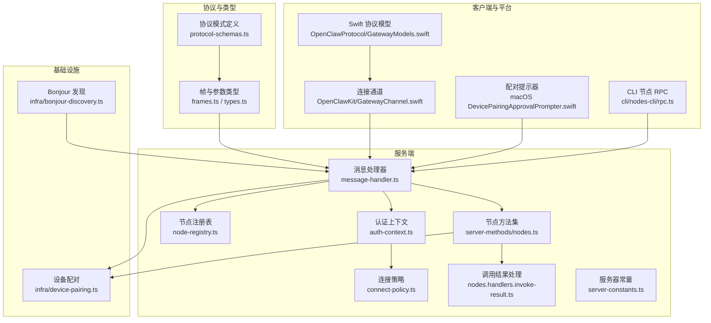
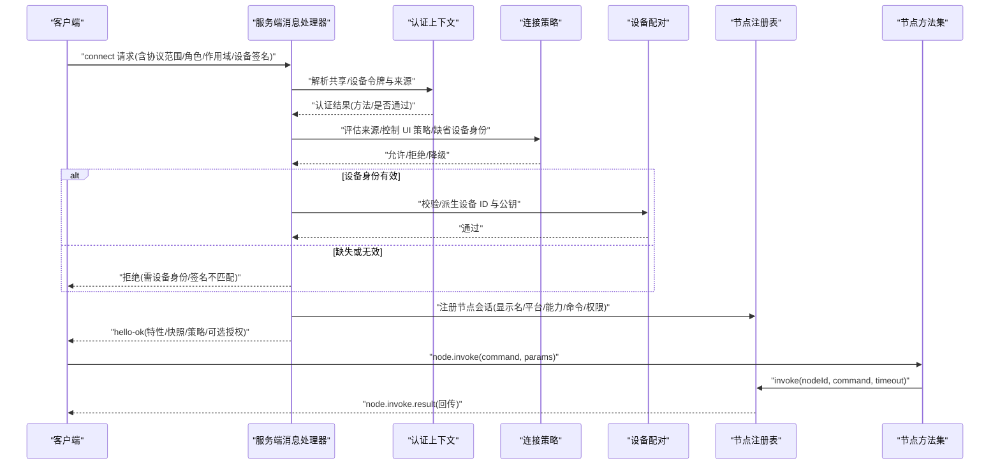
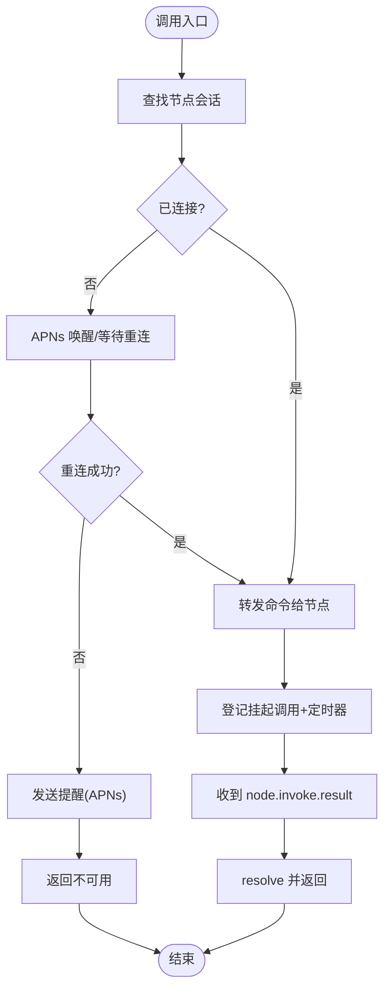
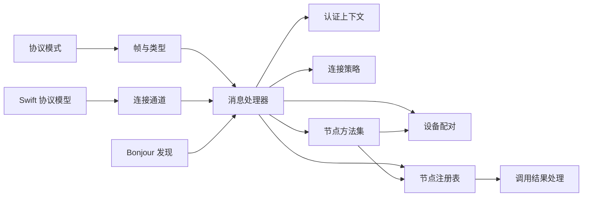

# 节点通信

<cite>
**本文引用的文件**
- [src/gateway/protocol/schema/protocol-schemas.ts](file://src/gateway/protocol/schema/protocol-schemas.ts)
- [src/gateway/protocol/schema/frames.ts](file://src/gateway/protocol/schema/frames.ts)
- [src/gateway/protocol/schema/types.ts](file://src/gateway/protocol/schema/types.ts)
- [src/gateway/server/ws-connection/message-handler.ts](file://src/gateway/server/ws-connection/message-handler.ts)
- [src/gateway/server/ws-connection/auth-context.ts](file://src/gateway/server/ws-connection/auth-context.ts)
- [src/gateway/server/ws-connection/connect-policy.ts](file://src/gateway/server/ws-connection/connect-policy.ts)
- [src/gateway/node-registry.ts](file://src/gateway/node-registry.ts)
- [src/gateway/server-methods/nodes.ts](file://src/gateway/server-methods/nodes.ts)
- [src/gateway/server-methods/nodes.handlers.invoke-result.ts](file://src/gateway/server-methods/nodes.handlers.invoke-result.ts)
- [src/gateway/server-constants.ts](file://src/gateway/server-constants.ts)
- [src/infra/device-pairing.ts](file://src/infra/device-pairing.ts)
- [src/infra/bonjour-discovery.ts](file://src/infra/bonjour-discovery.ts)
- [apps/shared/OpenClawKit/Sources/OpenClawProtocol/GatewayModels.swift](file://apps/shared/OpenClawKit/Sources/OpenClawProtocol/GatewayModels.swift)
- [apps/macos/Sources/OpenClawProtocol/GatewayModels.swift](file://apps/macos/Sources/OpenClawProtocol/GatewayModels.swift)
- [apps/shared/OpenClawKit/Sources/OpenClawKit/GatewayChannel.swift](file://apps/shared/OpenClawKit/Sources/OpenClawKit/GatewayChannel.swift)
- [apps/macos/Sources/OpenClaw/DevicePairingApprovalPrompter.swift](file://apps/macos/Sources/OpenClaw/DevicePairingApprovalPrompter.swift)
- [src/cli/nodes-cli/rpc.ts](file://src/cli/nodes-cli/rpc.ts)
- [docs/zh-CN/network.md](file://docs/zh-CN/network.md)
</cite>

## 目录
1. [简介](#简介)
2. [项目结构](#项目结构)
3. [核心组件](#核心组件)
4. [架构总览](#架构总览)
5. [详细组件分析](#详细组件分析)
6. [依赖关系分析](#依赖关系分析)
7. [性能考量](#性能考量)
8. [故障排查指南](#故障排查指南)
9. [结论](#结论)
10. [附录](#附录)

## 简介
本文件面向开发者，系统化阐述 OpenClaw 的节点通信体系：从节点发现、握手与认证、连接建立、消息路由与事件分发，到状态同步、故障转移与重连、设备配对与权限控制、以及跨平台协议适配与网络优化策略。文档以代码级事实为依据，辅以图示帮助理解与扩展。

## 项目结构
节点通信相关能力主要分布在以下模块：
- 协议与类型定义：协议帧、参数与结果类型、版本常量
- 服务端接入层：WebSocket 握手、认证上下文、连接策略、消息处理
- 节点注册与调用：节点会话管理、命令调用、结果回传
- 设备配对与节点配对：持久化状态、令牌轮换与作用域展开
- 客户端 SDK 与平台集成：跨平台协议模型、连接通道与配对提示器
- 发现与网络：Bonjour/mDNS 发现、跨平台探测

图表来源
- [src/gateway/protocol/schema/protocol-schemas.ts](file://src/gateway/protocol/schema/protocol-schemas.ts#L157-L292)
- [src/gateway/protocol/schema/frames.ts](file://src/gateway/protocol/schema/frames.ts#L1-L164)
- [src/gateway/server/ws-connection/message-handler.ts](file://src/gateway/server/ws-connection/message-handler.ts#L1-L800)
- [src/gateway/server/ws-connection/auth-context.ts](file://src/gateway/server/ws-connection/auth-context.ts#L1-L219)
- [src/gateway/server/ws-connection/connect-policy.ts](file://src/gateway/server/ws-connection/connect-policy.ts#L1-L103)
- [src/gateway/node-registry.ts](file://src/gateway/node-registry.ts#L1-L210)
- [src/gateway/server-methods/nodes.ts](file://src/gateway/server-methods/nodes.ts#L1-L857)
- [src/gateway/server-methods/nodes.handlers.invoke-result.ts](file://src/gateway/server-methods/nodes.handlers.invoke-result.ts#L1-L72)
- [src/gateway/server-constants.ts](file://src/gateway/server-constants.ts#L1-L37)
- [src/infra/device-pairing.ts](file://src/infra/device-pairing.ts#L51-L270)
- [src/infra/bonjour-discovery.ts](file://src/infra/bonjour-discovery.ts#L258-L557)
- [apps/shared/OpenClawKit/Sources/OpenClawProtocol/GatewayModels.swift](file://apps/shared/OpenClawKit/Sources/OpenClawProtocol/GatewayModels.swift#L870-L926)
- [apps/macos/Sources/OpenClawProtocol/GatewayModels.swift](file://apps/macos/Sources/OpenClawProtocol/GatewayModels.swift#L870-L926)
- [apps/shared/OpenClawKit/Sources/OpenClawKit/GatewayChannel.swift](file://apps/shared/OpenClawKit/Sources/OpenClawKit/GatewayChannel.swift#L363-L390)
- [apps/macos/Sources/OpenClaw/DevicePairingApprovalPrompter.swift](file://apps/macos/Sources/OpenClaw/DevicePairingApprovalPrompter.swift#L51-L184)
- [src/cli/nodes-cli/rpc.ts](file://src/cli/nodes-cli/rpc.ts#L75-L96)

章节来源
- [src/gateway/protocol/schema/protocol-schemas.ts](file://src/gateway/protocol/schema/protocol-schemas.ts#L157-L292)
- [src/gateway/protocol/schema/frames.ts](file://src/gateway/protocol/schema/frames.ts#L1-L164)
- [src/gateway/server/ws-connection/message-handler.ts](file://src/gateway/server/ws-connection/message-handler.ts#L1-L800)
- [src/gateway/server/ws-connection/auth-context.ts](file://src/gateway/server/ws-connection/auth-context.ts#L1-L219)
- [src/gateway/server/ws-connection/connect-policy.ts](file://src/gateway/server/ws-connection/connect-policy.ts#L1-L103)
- [src/gateway/node-registry.ts](file://src/gateway/node-registry.ts#L1-L210)
- [src/gateway/server-methods/nodes.ts](file://src/gateway/server-methods/nodes.ts#L1-L857)
- [src/gateway/server-methods/nodes.handlers.invoke-result.ts](file://src/gateway/server-methods/nodes.handlers.invoke-result.ts#L1-L72)
- [src/gateway/server-constants.ts](file://src/gateway/server-constants.ts#L1-L37)
- [src/infra/device-pairing.ts](file://src/infra/device-pairing.ts#L51-L270)
- [src/infra/bonjour-discovery.ts](file://src/infra/bonjour-discovery.ts#L258-L557)
- [apps/shared/OpenClawKit/Sources/OpenClawProtocol/GatewayModels.swift](file://apps/shared/OpenClawKit/Sources/OpenClawProtocol/GatewayModels.swift#L870-L926)
- [apps/macos/Sources/OpenClawProtocol/GatewayModels.swift](file://apps/macos/Sources/OpenClawProtocol/GatewayModels.swift#L870-L926)
- [apps/shared/OpenClawKit/Sources/OpenClawKit/GatewayChannel.swift](file://apps/shared/OpenClawKit/Sources/OpenClawKit/GatewayChannel.swift#L363-L390)
- [apps/macos/Sources/OpenClaw/DevicePairingApprovalPrompter.swift](file://apps/macos/Sources/OpenClaw/DevicePairingApprovalPrompter.swift#L51-L184)
- [src/cli/nodes-cli/rpc.ts](file://src/cli/nodes-cli/rpc.ts#L75-L96)

## 核心组件
- 协议与帧模型：定义握手参数、请求/响应/事件帧、错误形状、快照与版本等，统一跨平台序列化与校验。
- 消息处理器：负责协议协商、角色与作用域解析、浏览器来源检查、设备身份验证、配对决策与连接状态更新。
- 节点注册表：维护节点会话、挂起调用、超时与清理；提供 invoke 与事件广播。
- 节点方法集：实现 node.* 方法族，包括配对请求/列表/审批/拒绝/校验、重命名、列举、描述、画布能力刷新、命令调用与结果回传。
- 设备配对：持久化待审批与已配对设备，令牌轮换与作用域展开，支持隐含作用域推导。
- Bonjour 发现：跨平台 DNS-SD/avahi 探测，聚合网关信标。
- 客户端 SDK：Swift 协议模型与连接通道，支持设备令牌与共享令牌回退、鉴权来源记录与降级策略。
- CLI 与平台：节点解析与查询、macOS 配对提示器弹窗与后台推送。

章节来源
- [src/gateway/protocol/schema/protocol-schemas.ts](file://src/gateway/protocol/schema/protocol-schemas.ts#L157-L292)
- [src/gateway/protocol/schema/frames.ts](file://src/gateway/protocol/schema/frames.ts#L1-L164)
- [src/gateway/server/ws-connection/message-handler.ts](file://src/gateway/server/ws-connection/message-handler.ts#L1-L800)
- [src/gateway/node-registry.ts](file://src/gateway/node-registry.ts#L1-L210)
- [src/gateway/server-methods/nodes.ts](file://src/gateway/server-methods/nodes.ts#L1-L857)
- [src/infra/device-pairing.ts](file://src/infra/device-pairing.ts#L51-L270)
- [src/infra/bonjour-discovery.ts](file://src/infra/bonjour-discovery.ts#L258-L557)
- [apps/shared/OpenClawKit/Sources/OpenClawProtocol/GatewayModels.swift](file://apps/shared/OpenClawKit/Sources/OpenClawProtocol/GatewayModels.swift#L870-L926)
- [apps/shared/OpenClawKit/Sources/OpenClawKit/GatewayChannel.swift](file://apps/shared/OpenClawKit/Sources/OpenClawKit/GatewayChannel.swift#L363-L390)
- [apps/macos/Sources/OpenClaw/DevicePairingApprovalPrompter.swift](file://apps/macos/Sources/OpenClaw/DevicePairingApprovalPrompter.swift#L51-L184)
- [src/cli/nodes-cli/rpc.ts](file://src/cli/nodes-cli/rpc.ts#L75-L96)

## 架构总览
下图展示从客户端发起连接到服务端完成握手、认证与配对决策，再到节点注册与命令调用的全链路：

图表来源
- [src/gateway/server/ws-connection/message-handler.ts](file://src/gateway/server/ws-connection/message-handler.ts#L436-L724)
- [src/gateway/server/ws-connection/auth-context.ts](file://src/gateway/server/ws-connection/auth-context.ts#L75-L154)
- [src/gateway/server/ws-connection/connect-policy.ts](file://src/gateway/server/ws-connection/connect-policy.ts#L68-L102)
- [src/infra/device-pairing.ts](file://src/infra/device-pairing.ts#L226-L270)
- [src/gateway/node-registry.ts](file://src/gateway/node-registry.ts#L43-L79)
- [src/gateway/server-methods/nodes.ts](file://src/gateway/server-methods/nodes.ts#L611-L790)

## 详细组件分析

### 协议与帧模型
- 帧类型：请求/响应/事件三类帧，统一的鉴别字段与序列化约束，便于下游代码生成与强类型消费。
- 参数与结果：ConnectParams、HelloOk、RequestFrame、ResponseFrame、EventFrame、Node* 相关参数与结果类型，均通过 TypeBox 定义并导出静态类型。
- 版本与策略：协议版本常量与服务器策略（最大负载、缓冲上限、心跳间隔）在帧中透传，客户端据此调整行为。

章节来源
- [src/gateway/protocol/schema/frames.ts](file://src/gateway/protocol/schema/frames.ts#L20-L164)
- [src/gateway/protocol/schema/protocol-schemas.ts](file://src/gateway/protocol/schema/protocol-schemas.ts#L157-L292)
- [src/gateway/server-constants.ts](file://src/gateway/server-constants.ts#L1-L37)

### 握手、认证与配对决策
- 协议协商：服务端检查客户端声明的最小/最大协议版本，若不兼容则关闭连接并返回错误。
- 角色与作用域：默认“operator”，作用域必须显式声明；若未提供设备身份且未使用共享凭据，服务端会清空作用域以避免自声明权限。
- 浏览器来源检查：根据 Host/Origin/代理头决定是否强制来源校验，并记录 Host 头回退统计。
- 设备身份校验：校验设备 ID 与公钥派生一致性、签名时间窗口、随机数匹配、签名有效性；支持 v2/v3 载荷版本。
- 认证决策：优先共享凭据，其次设备令牌；当存在显式设备令牌时启用独立速率限制；可信代理 operator 连接可跳过设备身份。
- 配对策略：本地/受信任代理/允许绕过策略可使控制 UI 在特定条件下无需设备身份；否则要求设备身份或共享凭据。

章节来源
- [src/gateway/server/ws-connection/message-handler.ts](file://src/gateway/server/ws-connection/message-handler.ts#L462-L724)
- [src/gateway/server/ws-connection/auth-context.ts](file://src/gateway/server/ws-connection/auth-context.ts#L75-L219)
- [src/gateway/server/ws-connection/connect-policy.ts](file://src/gateway/server/ws-connection/connect-policy.ts#L12-L102)

### 节点注册与调用
- 注册：将连接信息转换为节点会话，记录显示名、平台、版本、能力、命令、权限、远端 IP、连接时间等。
- 调用：构造 node.invoke.request 事件并发送；维护挂起调用映射，按超时时间清理并返回超时错误。
- 结果回传：节点侧通过 node.invoke.result 返回，服务端在注册表中匹配并 resolve 对应 Promise；延迟到达的结果被静默忽略以减少噪声。

图表来源
- [src/gateway/server-methods/nodes.ts](file://src/gateway/server-methods/nodes.ts#L611-L790)
- [src/gateway/node-registry.ts](file://src/gateway/node-registry.ts#L107-L181)

章节来源
- [src/gateway/node-registry.ts](file://src/gateway/node-registry.ts#L1-L210)
- [src/gateway/server-methods/nodes.ts](file://src/gateway/server-methods/nodes.ts#L1-L857)
- [src/gateway/server-methods/nodes.handlers.invoke-result.ts](file://src/gateway/server-methods/nodes.handlers.invoke-result.ts#L1-L72)

### 节点方法族与状态同步
- 配对：node.pair.request/list/approve/reject/verify，支持静默模式与事件广播；校验后写入持久化状态。
- 列举与描述：合并已配对与已连接节点，去重排序，暴露能力与命令集合。
- 画布能力：为节点会话签发临时能力令牌与受限 URL，用于资源访问。
- 命令调用：执行前进行命令白名单与权限检查，必要时转交审批管理器；支持幂等键与超时控制。

章节来源
- [src/gateway/server-methods/nodes.ts](file://src/gateway/server-methods/nodes.ts#L267-L610)

### 设备配对与权限管理
- 状态文件：待审批与已配对设备分别存储，带 TTL 清理；支持令牌轮换与创建时间/轮换时间/撤销时间等元数据。
- 作用域展开：内置隐含作用域推导（如 admin 包含 read/write/approvals/pairing），对外比较时自动展开。
- 权限绑定：未提供设备身份且未使用共享凭据时，清空作用域以避免自声明权限；设备令牌仅在满足条件时参与鉴权。

章节来源
- [src/infra/device-pairing.ts](file://src/infra/device-pairing.ts#L51-L270)

### 节点发现与网络优化
- Bonjour 发现：跨平台调用 dns-sd/avahi，解析实例并聚合为网关信标；支持广域域解析与多域并发。
- 传输协议：基于 WebSocket，采用帧模型与策略参数；服务端设置最大负载与缓冲上限，避免高分辨率画布快照导致断开。
- 心跳与健康：固定心跳周期与健康快照刷新；通道健康策略根据启动期、忙碌态、事件时效等判定健康状态。

章节来源
- [src/infra/bonjour-discovery.ts](file://src/infra/bonjour-discovery.ts#L258-L557)
- [src/gateway/server-constants.ts](file://src/gateway/server-constants.ts#L1-L37)
- [src/gateway/channel-health-policy.ts](file://src/gateway/channel-health-policy.ts#L74-L112)

### 跨平台协议与客户端集成
- Swift 协议模型：NodeInvokeParams/NodeInvokeResultParams/NodeEventParams 等，统一字段命名与可选载荷。
- 连接通道：支持设备令牌与共享令牌回退，记录最近鉴权来源，必要时降级为共享令牌；支持设备身份开关。
- macOS 配对提示器：拉取待审批列表、弹窗三按钮操作（延后/同意/拒绝）、后台推送任务与状态管理。

章节来源
- [apps/shared/OpenClawKit/Sources/OpenClawProtocol/GatewayModels.swift](file://apps/shared/OpenClawKit/Sources/OpenClawProtocol/GatewayModels.swift#L870-L926)
- [apps/macos/Sources/OpenClawProtocol/GatewayModels.swift](file://apps/macos/Sources/OpenClawProtocol/GatewayModels.swift#L870-L926)
- [apps/shared/OpenClawKit/Sources/OpenClawKit/GatewayChannel.swift](file://apps/shared/OpenClawKit/Sources/OpenClawKit/GatewayChannel.swift#L363-L390)
- [apps/macos/Sources/OpenClaw/DevicePairingApprovalPrompter.swift](file://apps/macos/Sources/OpenClaw/DevicePairingApprovalPrompter.swift#L51-L184)

### CLI 与节点解析
- 节点解析：优先 node.list，失败回退 node.pair.list，再在结果集中按查询词解析目标节点。
- 用途：CLI 工具链在无法直接访问网关时，仍能定位并操作节点。

章节来源
- [src/cli/nodes-cli/rpc.ts](file://src/cli/nodes-cli/rpc.ts#L75-L96)

## 依赖关系分析

图表来源
- [src/gateway/server/ws-connection/message-handler.ts](file://src/gateway/server/ws-connection/message-handler.ts#L1-L800)
- [src/gateway/server/ws-connection/auth-context.ts](file://src/gateway/server/ws-connection/auth-context.ts#L1-L219)
- [src/gateway/server/ws-connection/connect-policy.ts](file://src/gateway/server/ws-connection/connect-policy.ts#L1-L103)
- [src/gateway/node-registry.ts](file://src/gateway/node-registry.ts#L1-L210)
- [src/gateway/server-methods/nodes.ts](file://src/gateway/server-methods/nodes.ts#L1-L857)
- [src/gateway/server-methods/nodes.handlers.invoke-result.ts](file://src/gateway/server-methods/nodes.handlers.invoke-result.ts#L1-L72)
- [src/gateway/protocol/schema/frames.ts](file://src/gateway/protocol/schema/frames.ts#L1-L164)
- [src/gateway/protocol/schema/protocol-schemas.ts](file://src/gateway/protocol/schema/protocol-schemas.ts#L157-L292)
- [apps/shared/OpenClawKit/Sources/OpenClawProtocol/GatewayModels.swift](file://apps/shared/OpenClawKit/Sources/OpenClawProtocol/GatewayModels.swift#L870-L926)
- [apps/shared/OpenClawKit/Sources/OpenClawKit/GatewayChannel.swift](file://apps/shared/OpenClawKit/Sources/OpenClawKit/GatewayChannel.swift#L363-L390)
- [src/infra/bonjour-discovery.ts](file://src/infra/bonjour-discovery.ts#L258-L557)

章节来源
- [src/gateway/server/ws-connection/message-handler.ts](file://src/gateway/server/ws-connection/message-handler.ts#L1-L800)
- [src/gateway/server/ws-connection/auth-context.ts](file://src/gateway/server/ws-connection/auth-context.ts#L1-L219)
- [src/gateway/server/ws-connection/connect-policy.ts](file://src/gateway/server/ws-connection/connect-policy.ts#L1-L103)
- [src/gateway/node-registry.ts](file://src/gateway/node-registry.ts#L1-L210)
- [src/gateway/server-methods/nodes.ts](file://src/gateway/server-methods/nodes.ts#L1-L857)
- [src/gateway/server-methods/nodes.handlers.invoke-result.ts](file://src/gateway/server-methods/nodes.handlers.invoke-result.ts#L1-L72)
- [src/gateway/protocol/schema/frames.ts](file://src/gateway/protocol/schema/frames.ts#L1-L164)
- [src/gateway/protocol/schema/protocol-schemas.ts](file://src/gateway/protocol/schema/protocol-schemas.ts#L157-L292)
- [apps/shared/OpenClawKit/Sources/OpenClawProtocol/GatewayModels.swift](file://apps/shared/OpenClawKit/Sources/OpenClawProtocol/GatewayModels.swift#L870-L926)
- [apps/shared/OpenClawKit/Sources/OpenClawKit/GatewayChannel.swift](file://apps/shared/OpenClawKit/Sources/OpenClawKit/GatewayChannel.swift#L363-L390)
- [src/infra/bonjour-discovery.ts](file://src/infra/bonjour-discovery.ts#L258-L557)

## 性能考量
- 负载与缓冲：服务端为每连接设定最大负载与发送缓冲上限，避免高分辨率快照导致断开；客户端与服务端保持一致以降低丢包风险。
- 心跳与健康：固定心跳周期与健康快照刷新，通道健康策略在启动期、忙碌态、事件时效等维度判定健康状态，避免误判。
- 调用超时：节点调用默认超时，超时后清理挂起调用并返回超时错误；APNs 唤醒与重试策略在可用时提升可达性。
- 速率限制：设备令牌与共享令牌分别施加速率限制，防止暴力破解；在特定场景下允许回退至共享令牌以维持可用性。

章节来源
- [src/gateway/server-constants.ts](file://src/gateway/server-constants.ts#L1-L37)
- [src/gateway/server/ws-connection/auth-context.ts](file://src/gateway/server/ws-connection/auth-context.ts#L175-L218)
- [src/gateway/server-methods/nodes.ts](file://src/gateway/server-methods/nodes.ts#L611-L790)

## 故障排查指南
- 握手失败
  - 协议不匹配：检查客户端 min/maxProtocol 与服务端协议版本是否兼容。
  - 角色非法：确认 connect.params.role 是否为受支持的角色。
  - 浏览器来源不被允许：核对 allowedOrigins 与 Host 头回退配置。
  - 设备身份缺失/签名无效：确认设备公钥、签名时间戳、随机数与载荷版本。
- 认证失败
  - 共享令牌/密码错误：检查 gateway 配置与提供的 token/password。
  - 设备令牌不匹配：确认设备令牌与设备身份、角色、作用域匹配。
  - 速率限制：查看速率限制记录与 retry-after。
- 节点不可达
  - APNs 未配置或不可用：检查推送证书与注册信息；观察唤醒阶段日志。
  - 节点未重连：确认心跳与健康策略；必要时触发提醒(APNs)。
- 配对问题
  - 待审批队列堆积：检查 TTL 清理逻辑与 pending 列表。
  - 作用域展开：确认隐含作用域是否正确展开。

章节来源
- [src/gateway/server/ws-connection/message-handler.ts](file://src/gateway/server/ws-connection/message-handler.ts#L462-L724)
- [src/gateway/server/ws-connection/auth-context.ts](file://src/gateway/server/ws-connection/auth-context.ts#L156-L218)
- [src/gateway/server-methods/nodes.ts](file://src/gateway/server-methods/nodes.ts#L94-L246)
- [src/infra/device-pairing.ts](file://src/infra/device-pairing.ts#L79-L95)

## 结论
OpenClaw 的节点通信体系以强类型的协议帧为基础，结合严格的握手与认证策略、完善的节点注册与调用机制、稳健的配对与权限管理，以及跨平台的发现与连接通道，形成了高可靠、可扩展且易于维护的节点通信框架。通过合理的网络优化与健康策略，系统在复杂网络环境下仍能保持稳定与高效。

## 附录
- 更多网络与配对文档索引：[网络中心](file://docs/zh-CN/network.md#L1-L52)