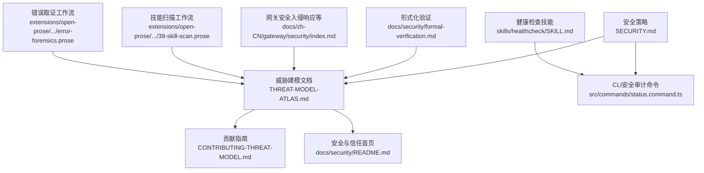
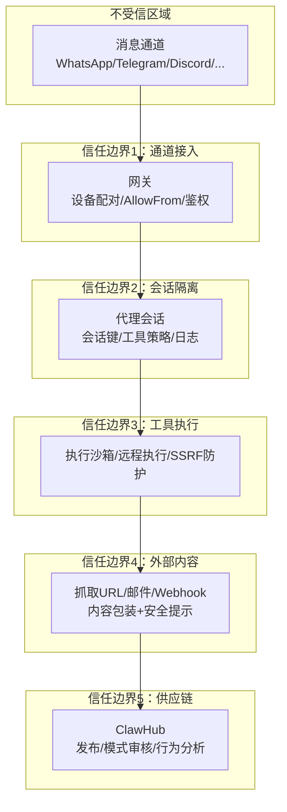
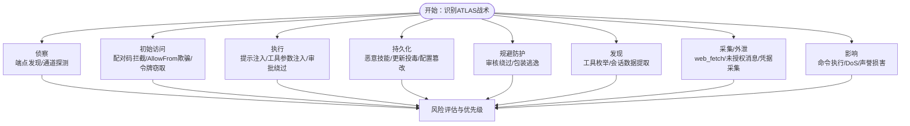
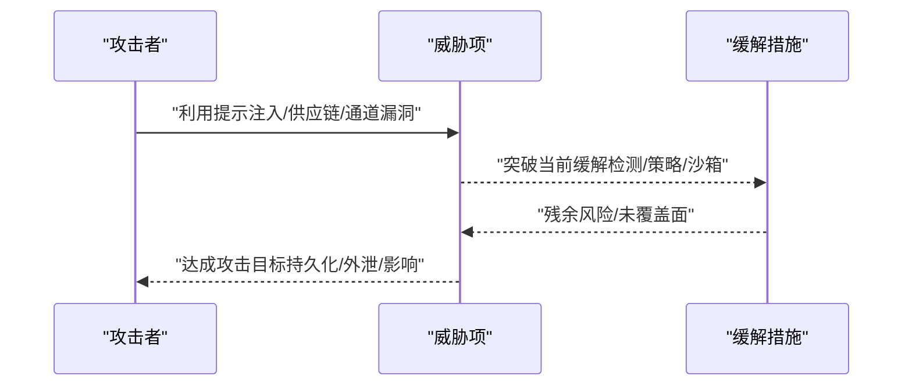
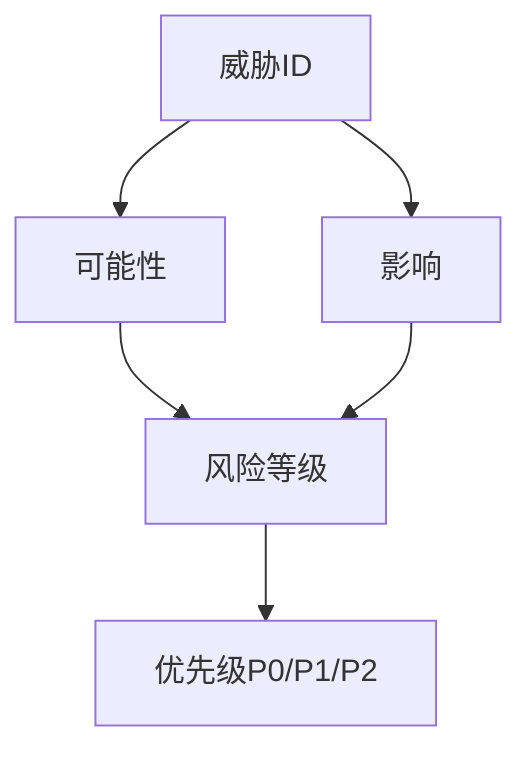
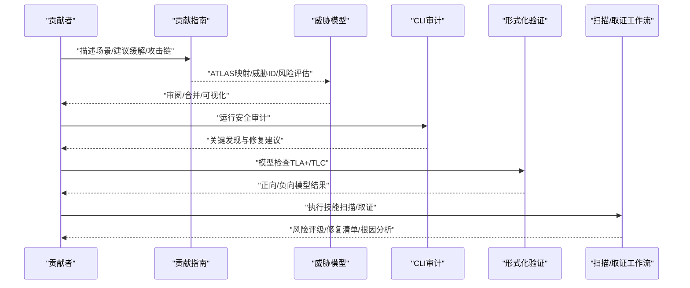
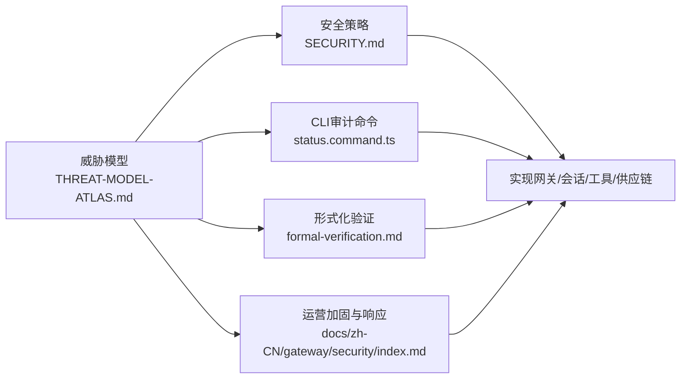

# 威胁建模

<cite>
**本文档引用的文件**
- [CONTRIBUTING-THREAT-MODEL.md](file://docs/security/CONTRIBUTING-THREAT-MODEL.md)
- [THREAT-MODEL-ATLAS.md](file://docs/security/THREAT-MODEL-ATLAS.md)
- [README.md（安全与信任）](file://docs/security/README.md)
- [SECURITY.md](file://SECURITY.md)
- [formal-verification.md](file://docs/security/formal-verification.md)
- [status.command.ts](file://src/commands/status.command.ts)
- [CHANGLOG.md（安全相关条目）](file://CHANGELOG.md)
- [index.md（网关安全）](file://docs/zh-CN/gateway/security/index.md)
- [SKILL.md（健康检查技能）](file://skills/healthcheck/SKILL.md)
- [38-skill-scan.prose](file://extensions/open-prose/skills/prose/examples/38-skill-scan.prose)
- [error-forensics.prose](file://extensions/open-prose/skills/prose/lib/error-forensics.prose)
</cite>

## 目录
1. [引言](#引言)
2. [项目结构](#项目结构)
3. [核心组件](#核心组件)
4. [架构总览](#架构总览)
5. [详细组件分析](#详细组件分析)
6. [依赖关系分析](#依赖关系分析)
7. [性能考量](#性能考量)
8. [故障排查指南](#故障排查指南)
9. [结论](#结论)
10. [附录](#附录)

## 引言
本文件面向OpenClaw的威胁建模体系，系统化阐述威胁识别方法、攻击场景分析、风险评估模型与缓解策略。文档基于MITRE ATLAS框架，结合项目实际实现与安全策略，提供可操作的工具使用建议、定期评估流程、威胁情报集成思路，并给出模板、风险登记册与应急响应计划要点，帮助团队建立“持续演进”的主动防御体系。

## 项目结构
OpenClaw的安全与威胁建模相关内容集中在docs/security与根级SECURITY.md中，CLI命令提供安全审计能力，部分扩展与技能体现自动化扫描与取证能力。下图展示与威胁建模直接相关的文档与命令入口：

图表来源
- [THREAT-MODEL-ATLAS.md](file://docs/security/THREAT-MODEL-ATLAS.md#L1-L604)
- [CONTRIBUTING-THREAT-MODEL.md](file://docs/security/CONTRIBUTING-THREAT-MODEL.md#L1-L91)
- [README.md（安全与信任）](file://docs/security/README.md#L1-L18)
- [SECURITY.md](file://SECURITY.md#L1-L284)
- [status.command.ts](file://src/commands/status.command.ts#L471-L506)
- [formal-verification.md](file://docs/security/formal-verification.md#L1-L168)
- [index.md（网关安全）](file://docs/zh-CN/gateway/security/index.md#L273-L315)
- [SKILL.md（健康检查技能）](file://skills/healthcheck/SKILL.md#L109-L175)
- [38-skill-scan.prose](file://extensions/open-prose/skills/prose/examples/38-skill-scan.prose#L174-L249)
- [error-forensics.prose](file://extensions/open-prose/skills/prose/lib/error-forensics.prose#L199-L250)

章节来源
- [THREAT-MODEL-ATLAS.md](file://docs/security/THREAT-MODEL-ATLAS.md#L1-L604)
- [SECURITY.md](file://SECURITY.md#L1-L284)

## 核心组件
- 威胁识别与分类：基于MITRE ATLAS的八类战术（侦察、初始访问、执行、持久化、规避防护、发现、采集/外泄、影响），结合OpenClaw通道、网关、代理会话、工具执行、外部内容与供应链等组件进行映射。
- 攻击场景与链路：提炼关键攻击链（如“技能型数据窃取”“提示注入到RCE”“间接注入经由抓取内容”），明确各阶段威胁ID与残余风险。
- 风险评估矩阵：按“可能性×影响”形成风险等级与优先级（P0/P1/P2），指导修复优先顺序。
- 缓解策略：覆盖认证与访问控制、会话隔离、工具策略、SSRF防护、外部内容包装、供应链审核、速率限制、凭据加密、输出验证、沙箱默认启用等。
- 工具与流程：CLI安全审计命令、威胁建模贡献流程、形式化验证模型、自动化扫描与取证工作流、定期评估与入侵响应流程。

章节来源
- [THREAT-MODEL-ATLAS.md](file://docs/security/THREAT-MODEL-ATLAS.md#L138-L529)
- [CONTRIBUTING-THREAT-MODEL.md](file://docs/security/CONTRIBUTING-THREAT-MODEL.md#L34-L91)
- [SECURITY.md](file://SECURITY.md#L203-L284)

## 架构总览
下图展示OpenClaw的威胁建模视角下的信任边界与数据流，映射到ATLAS战术与具体威胁项。

图表来源
- [THREAT-MODEL-ATLAS.md](file://docs/security/THREAT-MODEL-ATLAS.md#L56-L123)

章节来源
- [THREAT-MODEL-ATLAS.md](file://docs/security/THREAT-MODEL-ATLAS.md#L56-L135)

## 详细组件分析

### 组件A：MITRE ATLAS战术映射与威胁清单
- 侦察（RECON）：端点发现、通道探测。
- 初始访问（ACCESS）：配对码拦截、AllowFrom欺骗、令牌窃取。
- 执行（EXEC）：直接/间接提示注入、工具参数注入、执行审批绕过。
- 持久化（PERSIST）：恶意技能安装、技能更新投毒、代理配置篡改。
- 防护规避（EVADE）：审核模式绕过、内容包装逃逸。
- 发现（DISC）：工具枚举、会话数据提取。
- 采集/外泄（EXFIL）：web_fetch数据窃取、未授权消息发送、凭据采集。
- 影响（IMPACT）：未授权命令执行、资源耗尽DoS、声誉损害。

图表来源
- [THREAT-MODEL-ATLAS.md](file://docs/security/THREAT-MODEL-ATLAS.md#L140-L434)

章节来源
- [THREAT-MODEL-ATLAS.md](file://docs/security/THREAT-MODEL-ATLAS.md#L140-L434)

### 组件B：攻击链分析与关键路径
- 技能型数据窃取链：恶意技能发布 → 审核绕过 → 凭据采集。
- 提示注入到RCE链：直接注入 → 审批绕过 → 命令执行。
- 间接注入经由抓取内容：污染URL内容 → 代理抓取并遵循指令 → 外部窃取。

图表来源
- [THREAT-MODEL-ATLAS.md](file://docs/security/THREAT-MODEL-ATLAS.md#L505-L527)

章节来源
- [THREAT-MODEL-ATLAS.md](file://docs/security/THREAT-MODEL-ATLAS.md#L485-L527)

### 组件C：风险矩阵与优先级
- 关键威胁（P0）：T-EXEC-001、T-PERSIST-001、T-EXFIL-003、T-IMPACT-001。
- 高优先级（P1）：T-EXEC-002、T-EXEC-004、T-ACCESS-003、T-EXFIL-001、T-IMPACT-002。
- 中优先级（P2）：T-EVADE-001、T-ACCESS-001、T-ACCESS-002、T-PERSIST-002。

图表来源
- [THREAT-MODEL-ATLAS.md](file://docs/security/THREAT-MODEL-ATLAS.md#L489-L504)

章节来源
- [THREAT-MODEL-ATLAS.md](file://docs/security/THREAT-MODEL-ATLAS.md#L485-L504)

### 组件D：缓解策略与技术要点
- 认证与访问控制：Tailscale/令牌/密码/AllowFrom；降低配对宽限期；通道身份校验。
- 会话隔离：按sender/sessionKey隔离；敏感上下文脱敏。
- 工具策略与执行：默认沙箱；exec审批；参数化调用；命令归一化。
- 外部内容与SSRF：XML包装+安全提示；URL白名单；DNS固定/IP阻断。
- 供应链安全：GitHub账户年龄验证；模式审核；VirusTotal（进行中）；签名与回滚。
- 速率限制与成本预算：每发送方限流；API配额预算。
- 凭据管理：凭据加密存储；轮换机制。
- 输出验证与告警：敏感动作二次确认；输出过滤层。

章节来源
- [THREAT-MODEL-ATLAS.md](file://docs/security/THREAT-MODEL-ATLAS.md#L168-L434)
- [SECURITY.md](file://SECURITY.md#L203-L284)

### 组件E：威胁建模工具与流程
- 贡献流程：新增威胁/建议缓解/提出攻击链/修正内容；48小时分流审阅；ATLAS映射与威胁ID分配；合并后可视化。
- CLI安全审计：命令输出汇总严重性；列出关键发现与修复建议。
- 形式化验证：TLA+/TLC模型检查，覆盖网关暴露、节点执行管道、配对存储等高风险路径。
- 自动化扫描与取证：技能扫描工作流产出风险评级与修复清单；错误取证工作流生成根因分析与修复建议。

图表来源
- [CONTRIBUTING-THREAT-MODEL.md](file://docs/security/CONTRIBUTING-THREAT-MODEL.md#L68-L91)
- [status.command.ts](file://src/commands/status.command.ts#L471-L506)
- [formal-verification.md](file://docs/security/formal-verification.md#L37-L168)
- [38-skill-scan.prose](file://extensions/open-prose/skills/prose/examples/38-skill-scan.prose#L174-L249)
- [error-forensics.prose](file://extensions/open-prose/skills/prose/lib/error-forensics.prose#L199-L250)

章节来源
- [CONTRIBUTING-THREAT-MODEL.md](file://docs/security/CONTRIBUTING-THREAT-MODEL.md#L5-L91)
- [status.command.ts](file://src/commands/status.command.ts#L471-L506)
- [formal-verification.md](file://docs/security/formal-verification.md#L1-L168)
- [38-skill-scan.prose](file://extensions/open-prose/skills/prose/examples/38-skill-scan.prose#L174-L249)
- [error-forensics.prose](file://extensions/open-prose/skills/prose/lib/error-forensics.prose#L199-L250)

### 组件F：定期评估与威胁情报集成
- 定期评估：安装/加固后至少一次基线审计与版本检查；周期性深度审计；变更后重审。
- 威胁情报：结合已知攻击模式（如提示注入、供应链投毒、SSRF）与项目实现的薄弱点，持续更新审核规则与缓解策略。
- 集成建议：将外部威胁情报源（如CVE、ATT&CK、ATLAS案例研究）映射到威胁ID与缓解策略；在自动化扫描中加入情报特征匹配。

章节来源
- [SKILL.md（健康检查技能）](file://skills/healthcheck/SKILL.md#L109-L175)
- [CHANGLOG.md（安全相关条目）](file://CHANGELOG.md#L112-L1289)

### 组件G：应急响应计划
- 阻止影响扩散：禁用提权工具/停止网关；锁定入站接口（私信策略、群组白名单、提及门控）。
- 轮换密钥：轮换网关鉴权令牌/密码、Hook令牌、模型提供商凭证；撤销可疑节点配对。
- 审查产物：检查网关日志与会话记录中的异常工具调用；审查extensions并移除不可信内容。
- 再审计：运行深度安全审计，确认系统恢复至清洁状态。
- 教训总结：从真实事件中提炼教训，固化到配置加固与操作手册。

章节来源
- [index.md（网关安全）](file://docs/zh-CN/gateway/security/index.md#L273-L315)

## 依赖关系分析
- 文档与实现耦合：威胁模型与安全策略文档（SECURITY.md、THREAT-MODEL-ATLAS.md）指导实现（网关鉴权、会话隔离、工具策略、SSRF防护、外部内容包装、供应链审核）。
- 工具与流程耦合：CLI审计命令(status.command.ts)输出关键发现；形式化验证（formal-verification.md）提供模型检查；扫描/取证工作流（open-prose）产出风险与修复建议。
- 流程与治理：贡献指南（CONTRIBUTING-THREAT-MODEL.md）规范威胁提交、映射与合并流程；变更日志（CHANGELOG.md）记录安全加固与硬化的演进。

图表来源
- [THREAT-MODEL-ATLAS.md](file://docs/security/THREAT-MODEL-ATLAS.md#L1-L604)
- [SECURITY.md](file://SECURITY.md#L1-L284)
- [status.command.ts](file://src/commands/status.command.ts#L471-L506)
- [formal-verification.md](file://docs/security/formal-verification.md#L1-L168)
- [index.md（网关安全）](file://docs/zh-CN/gateway/security/index.md#L273-L315)

章节来源
- [THREAT-MODEL-ATLAS.md](file://docs/security/THREAT-MODEL-ATLAS.md#L1-L604)
- [SECURITY.md](file://SECURITY.md#L1-L284)
- [status.command.ts](file://src/commands/status.command.ts#L471-L506)
- [formal-verification.md](file://docs/security/formal-verification.md#L1-L168)
- [index.md（网关安全）](file://docs/zh-CN/gateway/security/index.md#L273-L315)

## 性能考量
- 安全审计的输出与排序：CLI命令对严重性进行排序并截断显示，避免长列表影响可读性。
- 模型检查规模：TLA+/TLC模型检查受限于状态空间，需明确假设与边界，避免过度泛化。
- 扫描与取证：技能扫描与取证工作流应考虑并发与缓存，减少重复计算与I/O开销。

章节来源
- [status.command.ts](file://src/commands/status.command.ts#L471-L506)
- [formal-verification.md](file://docs/security/formal-verification.md#L31-L36)

## 故障排查指南
- 常见误报与拒收：提示注入仅链路、操作员意图本地功能、授权用户触发本地动作、仅显示启发式差异、缺少边界绕过等情形通常不构成漏洞。
- 报告接受门槛：要求精确路径、可复现PoC、与信任边界相关的演示影响、排除共享网关主机配置等。
- 入侵响应：若怀疑被入侵，立即阻止影响范围、轮换密钥、审查产物、再审计。

章节来源
- [SECURITY.md](file://SECURITY.md#L33-L129)
- [index.md（网关安全）](file://docs/zh-CN/gateway/security/index.md#L273-L315)

## 结论
OpenClaw的威胁建模以MITRE ATLAS为骨架，结合项目架构与实现细节，形成了覆盖全生命周期的威胁识别、攻击链分析、风险评估与缓解策略体系。通过贡献流程、CLI审计、形式化验证与自动化扫描/取证工作流，构建了“持续演进”的主动防御闭环。建议在实践中持续集成威胁情报，完善供应链与外部内容防护，强化默认沙箱与输出验证，并将定期评估与应急响应纳入日常运营。

## 附录

### 威胁建模模板（示例字段）
- 威胁ID：T-类别-编号（如T-EXEC-001）
- ATLAS ID：对应战术/技术
- 描述：简述攻击场景与目标
- 攻击向量：网络扫描/提示注入/供应链投毒等
- 受影响组件：网关/通道/代理/工具/ClawHub等
- 当前缓解：现有控制措施
- 残余风险：可能性与影响评估
- 建议缓解：具体、可执行的修复建议

章节来源
- [CONTRIBUTING-THREAT-MODEL.md](file://docs/security/CONTRIBUTING-THREAT-MODEL.md#L40-L67)
- [THREAT-MODEL-ATLAS.md](file://docs/security/THREAT-MODEL-ATLAS.md#L140-L434)

### 风险登记册（示例结构）
- 威胁ID、ATLAS ID、类别、受影响组件、可能性、影响、风险等级、优先级、建议缓解、负责人、状态

章节来源
- [THREAT-MODEL-ATLAS.md](file://docs/security/THREAT-MODEL-ATLAS.md#L485-L504)

### 应急响应计划（步骤）
- 阻止影响范围、轮换密钥、审查产物、再审计、教训总结

章节来源
- [index.md（网关安全）](file://docs/zh-CN/gateway/security/index.md#L273-L315)