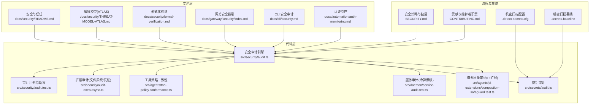
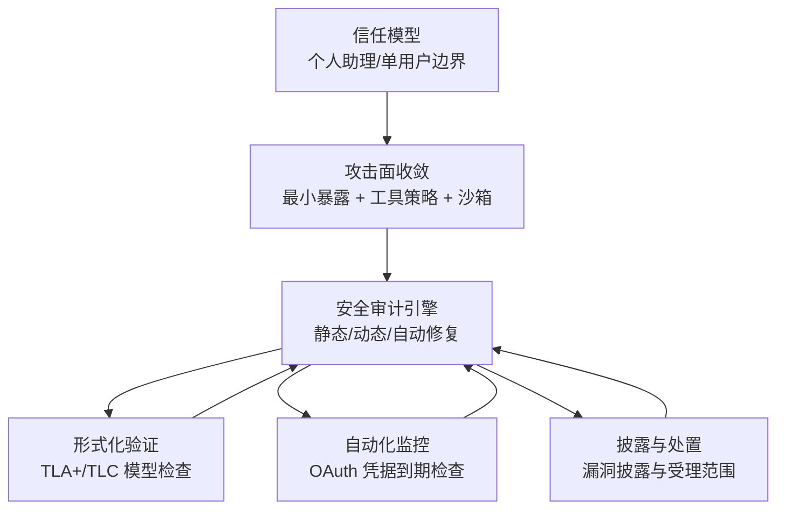
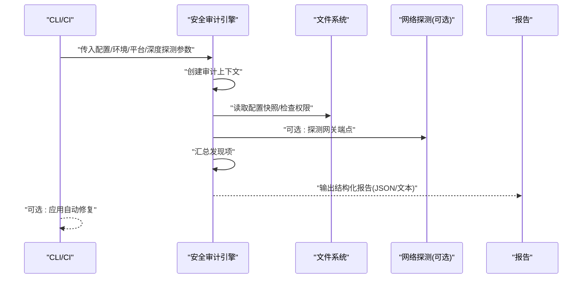
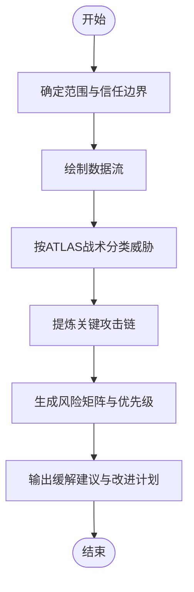
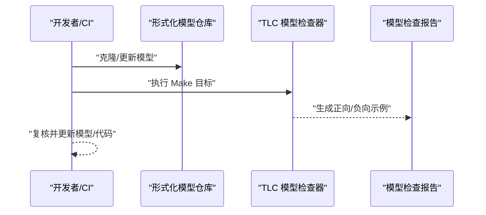
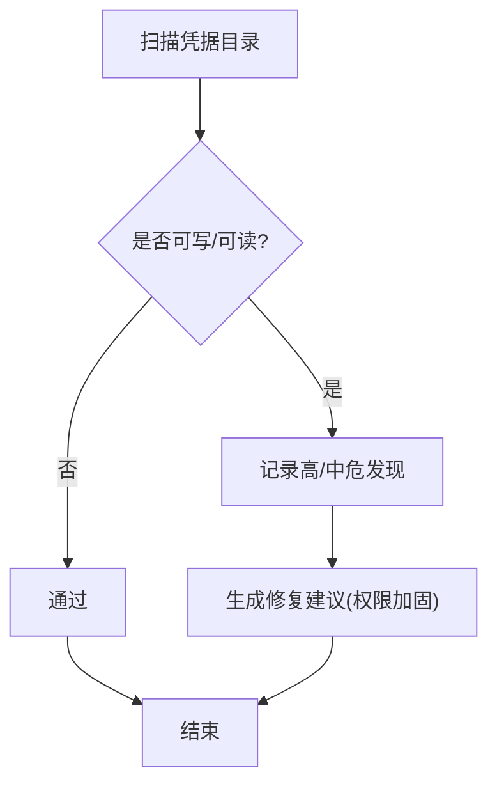
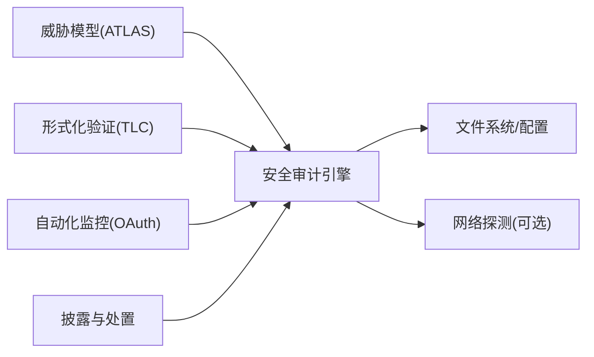

# 安全合规

<cite>
**本文档引用的文件**
- [SECURITY.md](file://SECURITY.md)
- [CONTRIBUTING.md](file://CONTRIBUTING.md)
- [docs/security/README.md](file://docs/security/README.md)
- [docs/security/THREAT-MODEL-ATLAS.md](file://docs/security/THREAT-MODEL-ATLAS.md)
- [docs/security/formal-verification.md](file://docs/security/formal-verification.md)
- [docs/gateway/security/index.md](file://docs/gateway/security/index.md)
- [docs/cli/security.md](file://docs/cli/security.md)
- [docs/automation/auth-monitoring.md](file://docs/automation/auth-monitoring.md)
- [src/security/audit.ts](file://src/security/audit.ts)
- [src/security/audit.test.ts](file://src/security/audit.test.ts)
- [src/security/audit-extra.async.ts](file://src/security/audit-extra.async.ts)
- [src/agents/tool-policy.conformance.ts](file://src/agents/tool-policy.conformance.ts)
- [src/daemon/service-audit.test.ts](file://src/daemon/service-audit.test.ts)
- [src/secrets/audit.ts](file://src/secrets/audit.ts)
- [src/agents/pi-extensions/compaction-safeguard.test.ts](file://src/agents/pi-extensions/compaction-safeguard.test.ts)
- [.detect-secrets.cfg](file://.detect-secrets.cfg)
- [.secrets.baseline](file://.secrets.baseline)
</cite>

## 目录
1. [引言](#引言)
2. [项目结构](#项目结构)
3. [核心组件](#核心组件)
4. [架构总览](#架构总览)
5. [详细组件分析](#详细组件分析)
6. [依赖关系分析](#依赖关系分析)
7. [性能考量](#性能考量)
8. [故障排查指南](#故障排查指南)
9. [结论](#结论)
10. [附录](#附录)

## 引言
本文件面向企业级安全合规运营，系统梳理 OpenClaw 的安全合规体系，覆盖合规框架对照、安全标准遵循与认证流程设计思路，并结合项目现有威胁模型、安全审计与自动化监控机制，给出可落地的合规检查清单、风险评估与改进计划，帮助组织建立持续合规的治理与运营闭环。

## 项目结构
OpenClaw 将安全合规相关能力分布在多个层次：
- 文档层：安全与信任说明、威胁模型、形式化验证、网关安全指引、CLI 安全审计说明、自动化认证监控等
- 代码层：安全审计引擎、工具策略一致性快照、密钥与凭据审计、服务审计、执行审批与沙箱策略等
- 流程层：漏洞披露与处置流程、可信供应链与插件信任模型、运行时权限与暴露面管理

图表来源
- [docs/security/README.md](file://docs/security/README.md#L1-L18)
- [docs/security/THREAT-MODEL-ATLAS.md](file://docs/security/THREAT-MODEL-ATLAS.md#L1-L604)
- [docs/security/formal-verification.md](file://docs/security/formal-verification.md#L1-L88)
- [docs/gateway/security/index.md](file://docs/gateway/security/index.md#L1-L800)
- [docs/cli/security.md](file://docs/cli/security.md#L43-L72)
- [docs/automation/auth-monitoring.md](file://docs/automation/auth-monitoring.md#L1-L45)
- [src/security/audit.ts](file://src/security/audit.ts#L1093-L1156)
- [src/security/audit.test.ts](file://src/security/audit.test.ts#L258-L292)
- [src/security/audit-extra.async.ts](file://src/security/audit-extra.async.ts#L983-L1067)
- [src/agents/tool-policy.conformance.ts](file://src/agents/tool-policy.conformance.ts#L1-L17)
- [src/secrets/audit.ts](file://src/secrets/audit.ts#L95-L129)
- [src/daemon/service-audit.test.ts](file://src/daemon/service-audit.test.ts#L121-L139)
- [src/agents/pi-extensions/compaction-safeguard.test.ts](file://src/agents/pi-extensions/compaction-safeguard.test.ts#L724-L819)
- [SECURITY.md](file://SECURITY.md#L1-L284)
- [.detect-secrets.cfg](file://.detect-secrets.cfg)
- [.secrets.baseline](file://.secrets.baseline)

章节来源
- [docs/security/README.md](file://docs/security/README.md#L1-L18)
- [docs/security/THREAT-MODEL-ATLAS.md](file://docs/security/THREAT-MODEL-ATLAS.md#L1-L604)
- [docs/security/formal-verification.md](file://docs/security/formal-verification.md#L1-L88)
- [docs/gateway/security/index.md](file://docs/gateway/security/index.md#L1-L800)
- [docs/cli/security.md](file://docs/cli/security.md#L43-L72)
- [docs/automation/auth-monitoring.md](file://docs/automation/auth-monitoring.md#L1-L45)
- [src/security/audit.ts](file://src/security/audit.ts#L1093-L1156)
- [src/security/audit.test.ts](file://src/security/audit.test.ts#L258-L292)
- [src/security/audit-extra.async.ts](file://src/security/audit-extra.async.ts#L983-L1067)
- [src/agents/tool-policy.conformance.ts](file://src/agents/tool-policy.conformance.ts#L1-L17)
- [src/secrets/audit.ts](file://src/secrets/audit.ts#L95-L129)
- [src/daemon/service-audit.test.ts](file://src/daemon/service-audit.test.ts#L121-L139)
- [src/agents/pi-extensions/compaction-safeguard.test.ts](file://src/agents/pi-extensions/compaction-safeguard.test.ts#L724-L819)
- [SECURITY.md](file://SECURITY.md#L1-L284)
- [.detect-secrets.cfg](file://.detect-secrets.cfg)
- [.secrets.baseline](file://.secrets.baseline)

## 核心组件
- 安全审计引擎：统一收集攻击面、网关暴露、浏览器控制、日志脱敏、沙箱配置、工具策略、模型健康度等维度的发现项，支持深度探测与自动修复建议
- 威胁模型（ATLAS）：基于 MITRE ATLAS 的对抗威胁图谱，覆盖侦察、初始访问、执行、持久化、防御规避、发现、数据收集与影响等战术
- 形式化验证：以 TLA+/TLC 为载体的安全模型检查，针对网关暴露、节点执行管线、配对存储等高风险路径进行可执行的攻击者驱动验证
- 工具策略一致性：静态构建期快照，用于 CI 对比实现与正式模型/提取器的策略漂移
- 凭据与密钥审计：扫描凭据目录与认证配置文件的权限与敏感信息暴露风险
- 自动化认证监控：通过 CLI 模型状态检查与 systemd/定时任务实现 OAuth 凭据到期预警与自动提醒
- 安全策略与披露：明确漏洞披露流程、受理范围、误报模式与信任模型，支撑合规披露与处置

章节来源
- [src/security/audit.ts](file://src/security/audit.ts#L1131-L1156)
- [docs/security/THREAT-MODEL-ATLAS.md](file://docs/security/THREAT-MODEL-ATLAS.md#L1-L604)
- [docs/security/formal-verification.md](file://docs/security/formal-verification.md#L1-L88)
- [src/agents/tool-policy.conformance.ts](file://src/agents/tool-policy.conformance.ts#L1-L17)
- [src/security/audit-extra.async.ts](file://src/security/audit-extra.async.ts#L983-L1067)
- [docs/automation/auth-monitoring.md](file://docs/automation/auth-monitoring.md#L1-L45)
- [SECURITY.md](file://SECURITY.md#L1-L284)

## 架构总览
OpenClaw 的安全合规架构以“信任模型 + 攻击面收敛 + 持续审计 + 自动化监控 + 可追溯披露”为核心，形成从策略制定、实施、测试、审计到改进的闭环。

图表来源
- [docs/gateway/security/index.md](file://docs/gateway/security/index.md#L10-L25)
- [docs/security/THREAT-MODEL-ATLAS.md](file://docs/security/THREAT-MODEL-ATLAS.md#L1-L604)
- [docs/security/formal-verification.md](file://docs/security/formal-verification.md#L1-L88)
- [docs/automation/auth-monitoring.md](file://docs/automation/auth-monitoring.md#L1-L45)
- [SECURITY.md](file://SECURITY.md#L1-L284)

## 详细组件分析

### 组件A：安全审计引擎
- 能力概览
  - 统一入口：接收配置、环境变量、平台信息与可选的深度探测参数，构建审计上下文
  - 发现维度：网关绑定与鉴权、浏览器控制暴露、日志敏感信息、工具策略与执行、沙箱配置、钩子与会话键、模型健康度、暴露矩阵、多用户启发等
  - 输出格式：结构化报告，支持 JSON 与自动修复建议
- 关键流程
  - 创建审计上下文
  - 收集攻击面摘要
  - 扫描文件系统权限与敏感路径
  - 检查网关与浏览器控制配置
  - 评估日志与模型健康度
  - 生成报告与修复建议

图表来源
- [src/security/audit.ts](file://src/security/audit.ts#L1093-L1156)
- [src/security/audit.ts](file://src/security/audit.ts#L1131-L1156)
- [docs/cli/security.md](file://docs/cli/security.md#L43-L72)

章节来源
- [src/security/audit.ts](file://src/security/audit.ts#L1093-L1156)
- [src/security/audit.ts](file://src/security/audit.ts#L1131-L1156)
- [docs/cli/security.md](file://docs/cli/security.md#L43-L72)

### 组件B：威胁模型（ATLAS）
- 方法论：采用 MITRE ATLAS 框架，覆盖侦察、初始访问、执行、持久化、防御规避、发现、收集与影响等战术
- 关键要点
  - 明确信任边界与数据流，识别关键攻击链
  - 对高风险威胁（如技能供应链、提示注入、远程命令执行）提出优先级与缓解建议
  - 与形式化验证互补，提供可操作的风险矩阵与推荐措施

图表来源
- [docs/security/THREAT-MODEL-ATLAS.md](file://docs/security/THREAT-MODEL-ATLAS.md#L1-L604)

章节来源
- [docs/security/THREAT-MODEL-ATLAS.md](file://docs/security/THREAT-MODEL-ATLAS.md#L1-L604)

### 组件C：形式化验证（TLA+/TLC）
- 目标：对高风险路径进行可执行的攻击者驱动模型检查，提供机器可验证的安全回归
- 覆盖路径：网关暴露、节点执行管线、配对存储等
- 使用方式：克隆模型仓库，使用 Make 目标运行 TLC，产出正向/负向示例

图表来源
- [docs/security/formal-verification.md](file://docs/security/formal-verification.md#L1-L88)

章节来源
- [docs/security/formal-verification.md](file://docs/security/formal-verification.md#L1-L88)

### 组件D：工具策略一致性
- 作用：静态构建期快照，用于 CI 对比实现与正式模型/提取器的策略漂移
- 价值：降低策略不一致导致的合规风险

章节来源
- [src/agents/tool-policy.conformance.ts](file://src/agents/tool-policy.conformance.ts#L1-L17)

### 组件E：凭据与密钥审计
- 能力：扫描凭据目录与认证配置文件的权限与敏感信息暴露风险
- 关键发现：凭据目录可写/可读、认证配置文件可读等

图表来源
- [src/security/audit-extra.async.ts](file://src/security/audit-extra.async.ts#L983-L1067)

章节来源
- [src/security/audit-extra.async.ts](file://src/security/audit-extra.async.ts#L983-L1067)

### 组件F：自动化认证监控
- 能力：通过 CLI 模型状态检查与 systemd/定时任务实现 OAuth 凭据到期预警与自动提醒
- 价值：降低凭据过期导致的业务中断与安全风险

章节来源
- [docs/automation/auth-monitoring.md](file://docs/automation/auth-monitoring.md#L1-L45)

### 组件G：服务审计（令牌漂移检测）
- 能力：检测配置与服务令牌之间的漂移，避免因配置不一致导致的鉴权问题
- 价值：保障服务一致性与合规性

章节来源
- [src/daemon/service-audit.test.ts](file://src/daemon/service-audit.test.ts#L121-L139)

### 组件H：摘要质量审计（PI扩展）
- 能力：对摘要质量进行审计，确保关键节标题与标识符保留策略符合要求
- 价值：提升信息资产处理的合规性与可追溯性

章节来源
- [src/agents/pi-extensions/compaction-safeguard.test.ts](file://src/agents/pi-extensions/compaction-safeguard.test.ts#L724-L819)

## 依赖关系分析
- 审计引擎依赖威胁模型与形式化验证提供的风险画像与模型边界，指导发现项与严重级别
- 凭据与密钥审计依赖文件系统权限检查与配置解析
- 自动化监控与披露流程支撑持续合规运营

图表来源
- [docs/security/THREAT-MODEL-ATLAS.md](file://docs/security/THREAT-MODEL-ATLAS.md#L1-L604)
- [docs/security/formal-verification.md](file://docs/security/formal-verification.md#L1-L88)
- [src/security/audit.ts](file://src/security/audit.ts#L1093-L1156)
- [docs/automation/auth-monitoring.md](file://docs/automation/auth-monitoring.md#L1-L45)
- [SECURITY.md](file://SECURITY.md#L1-L284)

章节来源
- [docs/security/THREAT-MODEL-ATLAS.md](file://docs/security/THREAT-MODEL-ATLAS.md#L1-L604)
- [docs/security/formal-verification.md](file://docs/security/formal-verification.md#L1-L88)
- [src/security/audit.ts](file://src/security/audit.ts#L1093-L1156)
- [docs/automation/auth-monitoring.md](file://docs/automation/auth-monitoring.md#L1-L45)
- [SECURITY.md](file://SECURITY.md#L1-L284)

## 性能考量
- 审计引擎默认聚焦关键发现，深度探测可选且带超时控制，平衡准确性与性能
- 文件系统与网络探测仅在必要时启用，避免对生产环境造成额外负载
- 形式化验证以有限状态空间探索，需合理设置边界与假设，避免状态爆炸

## 故障排查指南
- 审计报告无输出或为空
  - 检查配置路径解析与环境变量
  - 确认 includeFilesystem/includeChannelSecurity 参数
- 深度探测失败
  - 调整 deepTimeoutMs 或关闭深度探测
  - 检查网络连通性与代理配置
- 权限检查误报
  - 核对平台差异与权限位计算
  - 使用 --fix 自动修复常见权限问题
- 凭据目录可读/可写
  - 按照发现项的修复建议调整权限
  - 定期运行安全审计以持续监控

章节来源
- [src/security/audit.ts](file://src/security/audit.ts#L1093-L1156)
- [src/security/audit-extra.async.ts](file://src/security/audit-extra.async.ts#L983-L1067)
- [docs/cli/security.md](file://docs/cli/security.md#L43-L72)

## 结论
OpenClaw 的安全合规体系以“信任模型 + 攻击面收敛 + 持续审计 + 自动化监控 + 可追溯披露”为核心，结合威胁模型与形式化验证，形成从策略制定到持续改进的闭环。通过 CLI 安全审计、凭据与密钥审计、自动化认证监控与漏洞披露流程，组织可在企业级场景中实现稳健的安全治理与持续合规运营。

## 附录

### 合规框架对照与认证流程设计思路
- 合规框架对照
  - 个人信息保护：遵循最小必要与去标识化原则，严格控制日志与会话数据的敏感信息暴露
  - 访问控制与身份鉴别：采用强认证（令牌/密码）、设备身份校验与受信代理模式
  - 数据完整性与保密性：文件系统权限加固、凭据加密与轮换、传输加密与 HSTS
  - 供应链安全：插件/技能信任模型、发布流程与审核机制、镜像与依赖安全扫描
  - 运行时安全：沙箱执行、工具策略与执行审批、最小权限与最小暴露面
- 认证流程设计思路
  - 内部自评估：定期运行安全审计与形式化验证，形成评估报告与修复计划
  - 第三方审计：邀请外部机构进行渗透测试与配置审计，覆盖网关、通道集成与供应链
  - 持续监控：建立 OAuth 凭据到期监控与告警机制，纳入 CI/CD 安全门禁
  - 披露与处置：依据安全策略进行漏洞披露、影响评估与修复验证

章节来源
- [SECURITY.md](file://SECURITY.md#L1-L284)
- [docs/gateway/security/index.md](file://docs/gateway/security/index.md#L1-L800)
- [docs/automation/auth-monitoring.md](file://docs/automation/auth-monitoring.md#L1-L45)

### 安全政策制定与内部控制测试
- 安全政策制定
  - 明确信任模型与边界（个人助理/单用户），禁止共享网关承载多租户隔离
  - 制定最小暴露面策略（默认 loopback 绑定、强认证、严格工具策略）
  - 建立凭据生命周期管理（生成、轮换、销毁与审计）
  - 规范插件/技能安装与变更流程，实施最小权限与最小暴露面
- 内部控制测试
  - 审计测试：定期运行安全审计，覆盖文件系统权限、网关暴露、日志脱敏、工具策略与沙箱配置
  - 渗透测试：模拟提示注入、远程命令执行与供应链攻击，验证缓解措施有效性
  - 变更控制：对配置与代码变更进行安全评审与回归测试

章节来源
- [docs/gateway/security/index.md](file://docs/gateway/security/index.md#L1-L800)
- [src/security/audit.ts](file://src/security/audit.ts#L1131-L1156)
- [src/security/audit.test.ts](file://src/security/audit.test.ts#L258-L292)

### 第三方审计准备
- 准备材料
  - 威胁模型与风险矩阵、形式化验证报告、安全审计报告与修复计划
  - 配置基线与权限检查结果、凭据与密钥审计报告
  - 插件/技能发布与审核流程文档、镜像与依赖扫描报告
- 审计关注点
  - 信任边界与数据流映射、攻击面收敛与最小暴露面
  - 工具策略与执行审批、沙箱与宿主机隔离
  - 日志与会话数据的敏感信息处理、传输与存储加密
  - 供应链安全与发布流程、变更控制与回滚策略

章节来源
- [docs/security/THREAT-MODEL-ATLAS.md](file://docs/security/THREAT-MODEL-ATLAS.md#L1-L604)
- [docs/security/formal-verification.md](file://docs/security/formal-verification.md#L1-L88)
- [src/security/audit.ts](file://src/security/audit.ts#L1131-L1156)
- [src/security/audit-extra.async.ts](file://src/security/audit-extra.async.ts#L983-L1067)

### 合规检查清单
- 配置与权限
  - 网关默认 loopback 绑定，强认证（令牌/密码），严格工具策略
  - 文件系统权限：状态目录与配置文件仅限用户读写
  - 凭据目录与认证配置文件权限加固
- 运行时安全
  - 沙箱执行与最小权限，执行审批与白名单
  - 日志脱敏与敏感信息过滤
- 供应链与变更
  - 插件/技能安装与变更流程、最小权限与最小暴露面
  - 机密扫描与基线管理
- 监控与告警
  - OAuth 凭据到期监控与自动提醒
  - 安全审计与修复计划跟踪

章节来源
- [docs/gateway/security/index.md](file://docs/gateway/security/index.md#L1-L800)
- [src/security/audit-extra.async.ts](file://src/security/audit-extra.async.ts#L983-L1067)
- [docs/automation/auth-monitoring.md](file://docs/automation/auth-monitoring.md#L1-L45)
- [.detect-secrets.cfg](file://.detect-secrets.cfg)
- [.secrets.baseline](file://.secrets.baseline)

### 风险评估报告与改进计划
- 风险评估
  - 高风险：提示注入、远程命令执行、供应链攻击、凭据泄露
  - 中风险：日志敏感信息泄漏、工具策略宽松、沙箱配置不当
  - 低风险：HSTS 缺失（本地/loopback 场景）、启发式误报
- 改进计划
  - 立即（P0）：完善供应链安全（行为分析、签名与回滚）、实现技能沙箱、输出验证
  - 短期（P1）：速率限制、凭据加密、执行审批 UX 与验证、URL 白名单
  - 中期（P2）：通道身份加密验证、配置完整性校验、更新签名与版本固定

章节来源
- [docs/security/THREAT-MODEL-ATLAS.md](file://docs/security/THREAT-MODEL-ATLAS.md#L485-L556)
- [docs/security/formal-verification.md](file://docs/security/formal-verification.md#L1-L88)