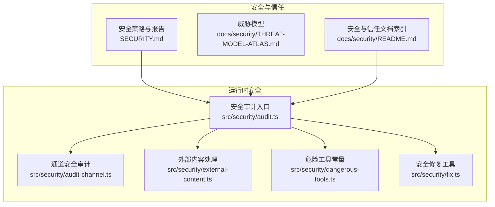
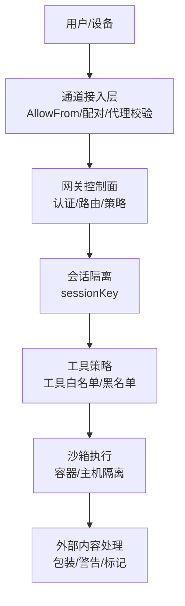
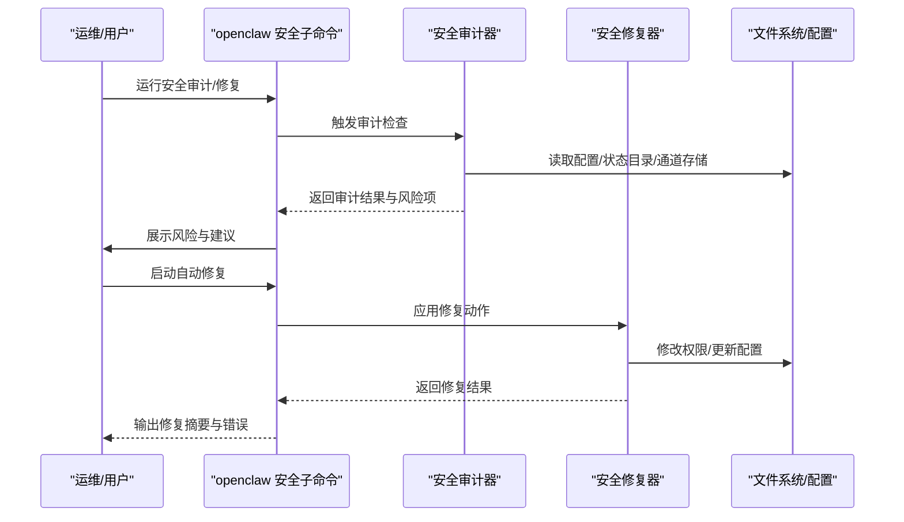
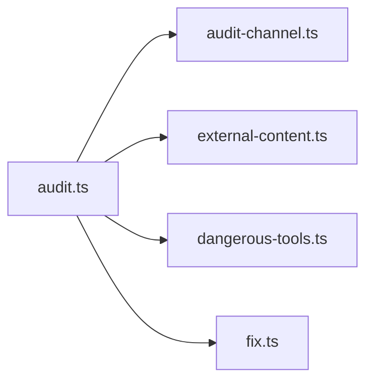

# 安全和权限

<cite>
**本文引用的文件**
- [SECURITY.md](file://SECURITY.md)
- [安全审计入口（audit.ts）](file://src/security/audit.ts)
- [通道安全审计（audit-channel.ts）](file://src/security/audit-channel.ts)
- [外部内容处理（external-content.ts）](file://src/security/external-content.ts)
- [危险工具常量（dangerous-tools.ts）](file://src/security/dangerous-tools.ts)
- [安全修复（fix.ts）](file://src/security/fix.ts)
- [威胁模型（THREAT-MODEL-ATLAS.md）](file://docs/security/THREAT-MODEL-ATLAS.md)
- [安全与信任（security/README.md）](file://docs/security/README.md)
</cite>

## 目录
1. [简介](#简介)
2. [项目结构](#项目结构)
3. [核心组件](#核心组件)
4. [架构总览](#架构总览)
5. [详细组件分析](#详细组件分析)
6. [依赖关系分析](#依赖关系分析)
7. [性能考量](#性能考量)
8. [故障排查指南](#故障排查指南)
9. [结论](#结论)
10. [附录](#附录)

## 简介
本文件系统化梳理 OpenClaw 的安全模型与权限控制体系，聚焦“本地优先”的信任模型、设备配对与身份验证、会话隔离、工具策略与沙箱执行、外部内容处理与数据保护等关键能力。文档同时给出威胁模型、防护措施、合规与最佳实践建议，并提供可操作的审计与修复流程，兼顾安全专业人员与普通用户的需求。

## 项目结构
OpenClaw 将安全与信任作为核心设计原则，贯穿于网关认证、通道接入控制、会话隔离、工具调用策略、外部内容处理与供应链治理等环节。安全相关代码主要集中在 src/security 下，配套文档位于 docs/security。

图示来源
- [安全审计入口（audit.ts）](file://src/security/audit.ts#L1-L120)
- [通道安全审计（audit-channel.ts）](file://src/security/audit-channel.ts#L1-L120)
- [外部内容处理（external-content.ts）](file://src/security/external-content.ts#L1-L120)
- [危险工具常量（dangerous-tools.ts）](file://src/security/dangerous-tools.ts#L1-L40)
- [安全修复（fix.ts）](file://src/security/fix.ts#L1-L120)
- [威胁模型（THREAT-MODEL-ATLAS.md）](file://docs/security/THREAT-MODEL-ATLAS.md#L1-L120)
- [安全与信任（security/README.md）](file://docs/security/README.md#L1-L18)

章节来源
- [安全审计入口（audit.ts）](file://src/security/audit.ts#L1-L120)
- [威胁模型（THREAT-MODEL-ATLAS.md）](file://docs/security/THREAT-MODEL-ATLAS.md#L1-L120)

## 核心组件
- 本地优先的信任模型：以“个人助理”为边界，单用户/单网关为主，避免多租户对抗场景；默认主机优先执行，可通过沙箱增强隔离。
- 设备配对与身份验证：基于 30 秒宽限期的配对码，结合通道允许列表与可信代理，形成端到端的设备与发送者授权链。
- 会话隔离与工具策略：按会话键隔离上下文，工具调用受策略约束，高危工具默认拒绝或需显式批准。
- 外部内容处理：统一的边界包装与安全提示，降低注入风险与误执行概率。
- 审计与修复：内置安全审计与自动修复工具，帮助快速定位并纠正常见风险点。

章节来源
- [安全审计入口（audit.ts）](file://src/security/audit.ts#L340-L687)
- [通道安全审计（audit-channel.ts）](file://src/security/audit-channel.ts#L200-L262)
- [外部内容处理（external-content.ts）](file://src/security/external-content.ts#L235-L261)
- [危险工具常量（dangerous-tools.ts）](file://src/security/dangerous-tools.ts#L9-L37)

## 架构总览
下图展示从通道接入到工具执行的关键信任边界与控制点，体现 OpenClaw 的分层安全设计：

图示来源
- [威胁模型（THREAT-MODEL-ATLAS.md）](file://docs/security/THREAT-MODEL-ATLAS.md#L56-L123)
- [通道安全审计（audit-channel.ts）](file://src/security/audit-channel.ts#L200-L262)
- [外部内容处理（external-content.ts）](file://src/security/external-content.ts#L235-L261)
- [危险工具常量（dangerous-tools.ts）](file://src/security/dangerous-tools.ts#L9-L37)

## 详细组件分析

### 本地优先的安全架构
- 信任模型：单用户/单网关为主，不假设多租户对抗；会话标识仅用于路由，非严格的多用户授权边界。
- 默认主机执行：agents.defaults.sandbox.mode 默认关闭，exec 路由偏好为“沙箱优先”，若无可用沙箱则回退主机执行。
- 建议：在共享环境或多用户场景，启用沙箱模式并严格限制工具策略。

章节来源
- [SECURITY.md（运营指导）](file://SECURITY.md#L87-L101)
- [安全审计入口（audit.ts）](file://src/security/audit.ts#L340-L396)

### 权限控制机制
- 通道接入控制：各通道通过 AllowFrom 列表与配对存储进行发送者授权；Telegram 需要纯数字 ID，Discord 支持名称匹配但为“破窗模式”。
- 网关认证与暴露控制：支持令牌/密码/Tailscale/可信代理等多种认证方式；默认仅绑定本地回环，非本地暴露需严格配置 allowedOrigins 与反向代理信任。
- 工具调用控制：HTTP 上默认禁止高危工具（如 sessions_spawn、gateway 等），需显式允许且承担更高风险；ACP 场景对 mutating/执行类工具一律要求显式批准。

章节来源
- [通道安全审计（audit-channel.ts）](file://src/security/audit-channel.ts#L200-L262)
- [通道安全审计（audit-channel.ts）](file://src/security/audit-channel.ts#L306-L467)
- [通道安全审计（audit-channel.ts）](file://src/security/audit-channel.ts#L589-L721)
- [安全审计入口（audit.ts）](file://src/security/audit.ts#L414-L427)
- [危险工具常量（dangerous-tools.ts）](file://src/security/dangerous-tools.ts#L9-L37)

### 沙箱执行模型
- 执行路径：会话隔离 → 工具策略 → 沙箱/主机执行；沙箱模式可显著降低命令注入与横向移动风险。
- 配置建议：生产环境建议启用沙箱（non-main/all），并配合严格的工具策略与最小权限原则。

章节来源
- [威胁模型（THREAT-MODEL-ATLAS.md）](file://docs/security/THREAT-MODEL-ATLAS.md#L94-L100)
- [安全审计入口（audit.ts）](file://src/security/audit.ts#L34-L46)

### 数据保护策略
- 外部内容处理：统一包装外部输入，附加安全提示与边界标记，防止注入与误执行；对潜在边界标记进行清洗与折叠。
- 敏感信息脱敏：日志敏感度可配置，默认推荐“tools”级别；审计工具可自动修复常见权限问题。
- 临时目录边界：媒体与沙箱相关临时文件根目录受控，仅允许受管路径下的绝对路径。

章节来源
- [外部内容处理（external-content.ts）](file://src/security/external-content.ts#L235-L261)
- [外部内容处理（external-content.ts）](file://src/security/external-content.ts#L137-L206)
- [安全审计入口（audit.ts）](file://src/security/audit.ts#L799-L800)
- [SECURITY.md（临时目录边界）](file://SECURITY.md#L186-L202)

### 设备配对机制与身份验证
- 配对流程：30 秒宽限期的配对码，通过现有通道下发；配对成功后写入通道允许列表或配对存储。
- 身份验证：支持令牌/密码/Tailscale/可信代理；非本地暴露需严格 Origin 白名单与反向代理信任。
- 审计发现：若未配置认证或暴露范围过大，将被标记为高危或严重风险。

章节来源
- [威胁模型（THREAT-MODEL-ATLAS.md）](file://docs/security/THREAT-MODEL-ATLAS.md#L72-L78)
- [通道安全审计（audit-channel.ts）](file://src/security/audit-channel.ts#L200-L262)
- [安全审计入口（audit.ts）](file://src/security/audit.ts#L428-L436)
- [安全审计入口（audit.ts）](file://src/security/audit.ts#L463-L492)

### 授权策略与审计功能
- 授权策略：通道级 groupPolicy 默认“允许清单”，建议保持；DM 策略与会话隔离（dmScope）影响上下文泄露风险。
- 审计能力：内置安全审计与修复工具，覆盖文件系统权限、网关暴露、通道配置、浏览器控制、危险标志位等；支持深度探测与自动修复。

章节来源
- [通道安全审计（audit-channel.ts）](file://src/security/audit-channel.ts#L200-L262)
- [安全审计入口（audit.ts）](file://src/security/audit.ts#L1-L120)
- [安全修复（fix.ts）](file://src/security/fix.ts#L276-L303)
- [安全修复（fix.ts）](file://src/security/fix.ts#L387-L477)

### 安全审计与修复流程（序列图）

图示来源
- [安全审计入口（audit.ts）](file://src/security/audit.ts#L1-L120)
- [安全修复（fix.ts）](file://src/security/fix.ts#L387-L477)

## 依赖关系分析
- 组件耦合
  - 审计入口聚合多个子审计模块（通道、文件系统、网关、浏览器、工具策略等），形成统一的“安全体检”。
  - 外部内容处理模块独立于执行路径，仅负责包装与提示，降低对主流程的侵入。
  - 危险工具常量集中定义高危工具集，确保网关 HTTP 限制、审计与 ACP 提示一致。
- 关键依赖链
  - audit.ts → audit-channel.ts（通道安全）、external-content.ts（外部内容包装）、dangerous-tools.ts（工具风险）
  - audit.ts → fix.ts（修复动作）

图示来源
- [安全审计入口（audit.ts）](file://src/security/audit.ts#L1-L120)
- [通道安全审计（audit-channel.ts）](file://src/security/audit-channel.ts#L1-L120)
- [外部内容处理（external-content.ts）](file://src/security/external-content.ts#L1-L120)
- [危险工具常量（dangerous-tools.ts）](file://src/security/dangerous-tools.ts#L1-L40)
- [安全修复（fix.ts）](file://src/security/fix.ts#L1-L120)

章节来源
- [安全审计入口（audit.ts）](file://src/security/audit.ts#L1-L120)

## 性能考量
- 审计扫描的 I/O 与网络探测成本可控，建议在非高峰时段运行深度审计。
- 外部内容包装为轻量字符串处理，对吞吐影响极小。
- 沙箱执行会带来额外开销，建议在高危场景启用，日常使用可按需开启。

## 故障排查指南
- 常见问题与处置
  - 网关暴露无认证：检查 gateway.bind 与 gateway.auth 配置，确保仅本地回环或严格可信代理。
  - 控制 UI 允许任意来源：设置 gateway.controlUi.allowedOrigins 明确白名单，禁用 Host 头回退。
  - 通道 DM 开放：将 dmPolicy 设为“受限”，并配置 allowFrom 或配对存储。
  - 文件系统权限过宽：使用安全修复工具自动收紧 stateDir 与 config 权限。
  - 浏览器控制未鉴权：为浏览器控制启用网关认证令牌或密码。
- 审计与修复
  - 使用 openclaw security audit 生成风险报告，结合 openclaw security fix 自动修复常见问题。
  - 对通道配置进行一致性检查，确保 AllowFrom 与配对存储一致。

章节来源
- [安全审计入口（audit.ts）](file://src/security/audit.ts#L428-L492)
- [通道安全审计（audit-channel.ts）](file://src/security/audit-channel.ts#L200-L262)
- [安全修复（fix.ts）](file://src/security/fix.ts#L387-L477)

## 结论
OpenClaw 的安全模型以“本地优先、单用户信任”为核心，通过严格的通道接入控制、会话隔离、工具策略与外部内容包装，构建了从入口到执行的多层防线。配合内置审计与修复工具，可在部署与运维阶段持续降低风险。建议在共享或多用户环境中启用沙箱与最小权限策略，并定期运行安全审计与修复。

## 附录

### 安全威胁模型要点
- 五道信任边界：通道接入、会话隔离、工具执行、外部内容、供应链。
- 关键威胁与缓解：提示注入、命令注入、供应链投毒、凭证窃取、资源耗尽等。
- 攻击链示例：技能型数据窃取、提示注入到 RCE、间接注入 via 外部抓取。

章节来源
- [威胁模型（THREAT-MODEL-ATLAS.md）](file://docs/security/THREAT-MODEL-ATLAS.md#L56-L123)
- [威胁模型（THREAT-MODEL-ATLAS.md）](file://docs/security/THREAT-MODEL-ATLAS.md#L485-L527)

### 合规与报告
- 披露流程与最低要求：标题、严重性评估、影响、受影响组件、技术复现、影响证据、环境、修复建议。
- 报告接受门槛：明确脆弱路径、版本信息、可复现 PoC、与信任边界关联的影响、凭证归属证明等。
- 常见误报：仅提示注入、操作员触发的本地行为、仅启发式差异等。

章节来源
- [SECURITY.md（披露与接受门槛）](file://SECURITY.md#L20-L67)
- [SECURITY.md（运营指导）](file://SECURITY.md#L203-L241)