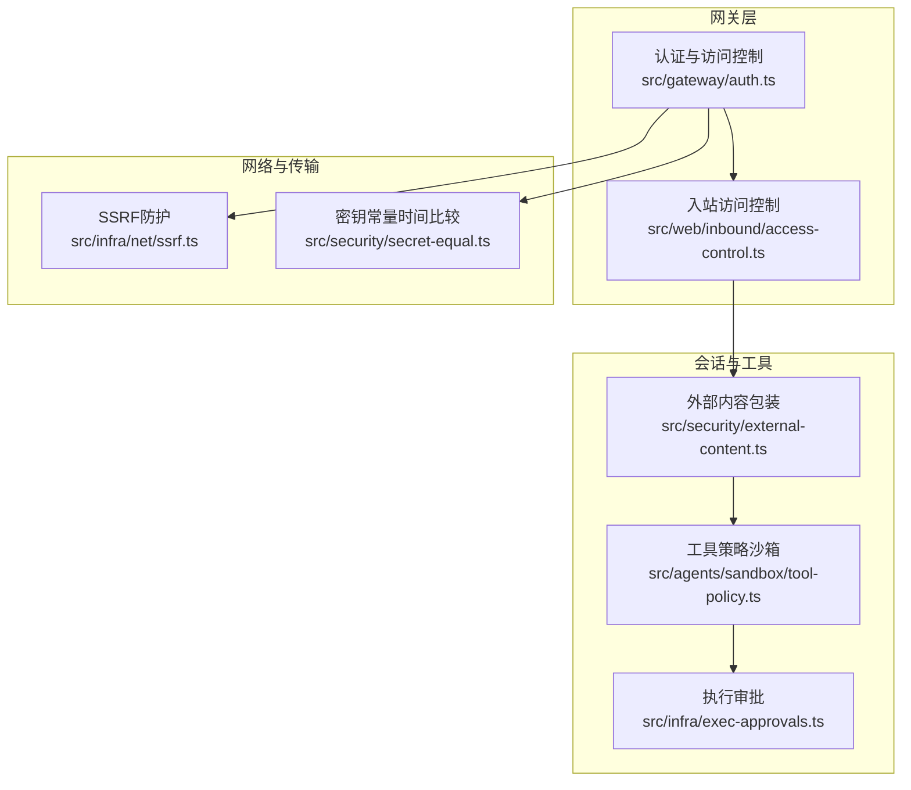
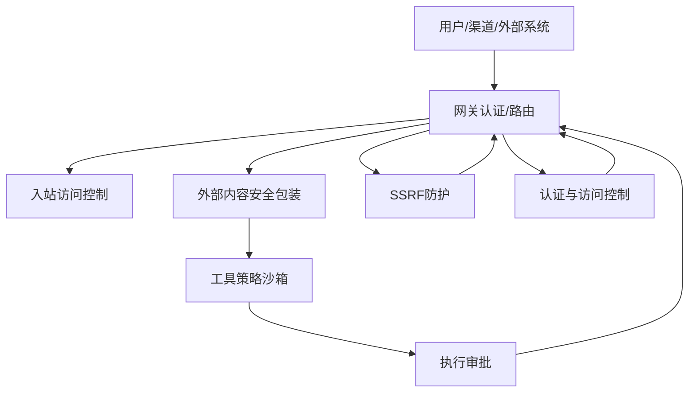
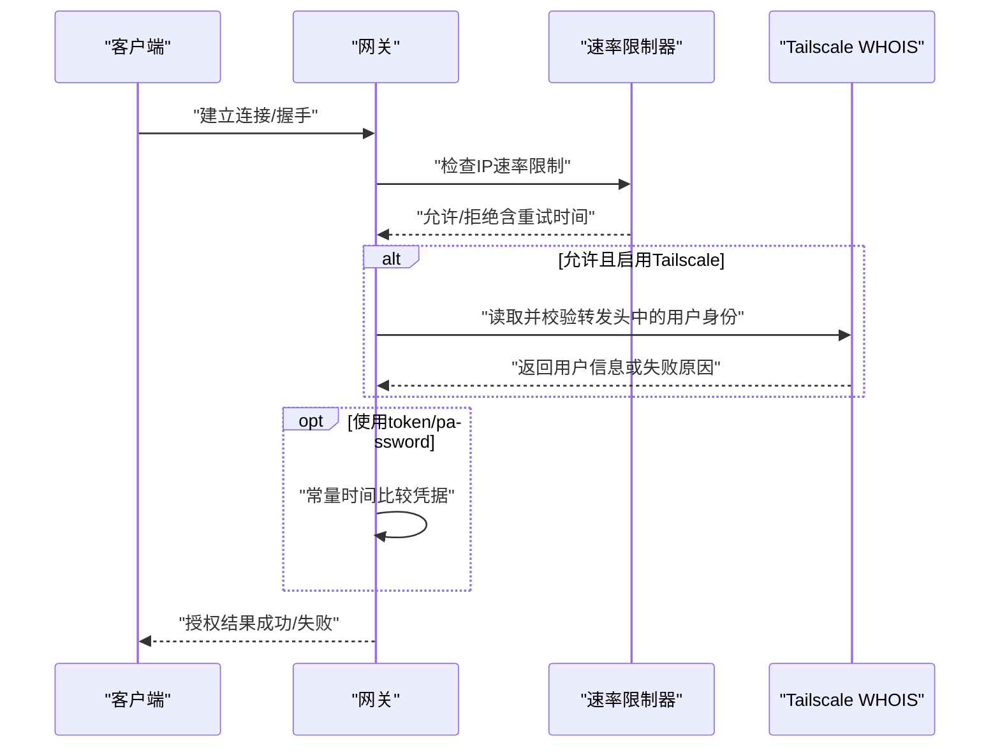
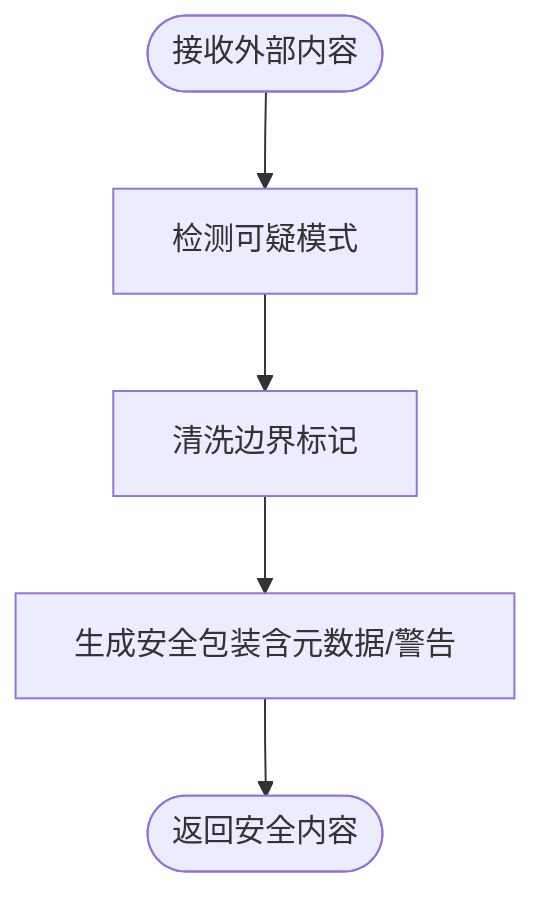
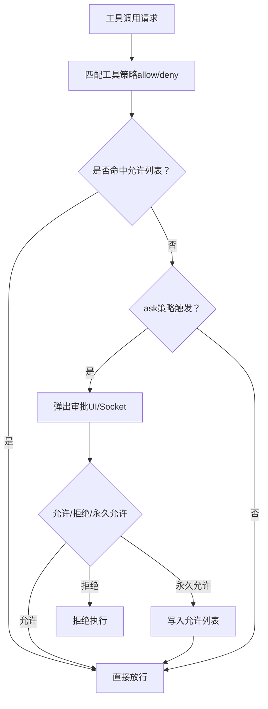
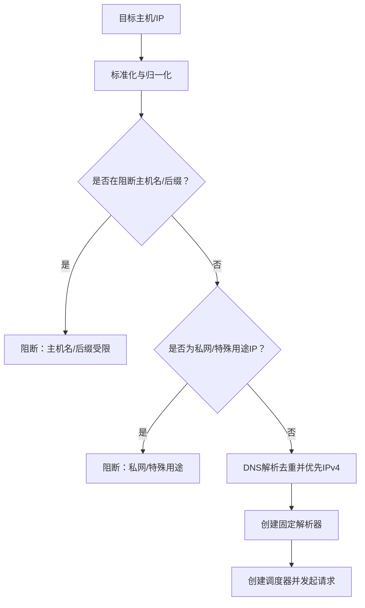
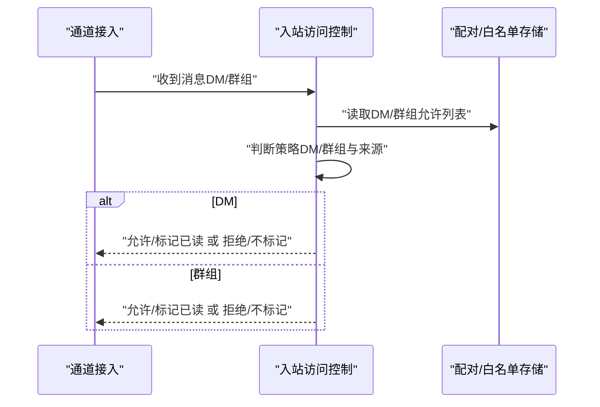
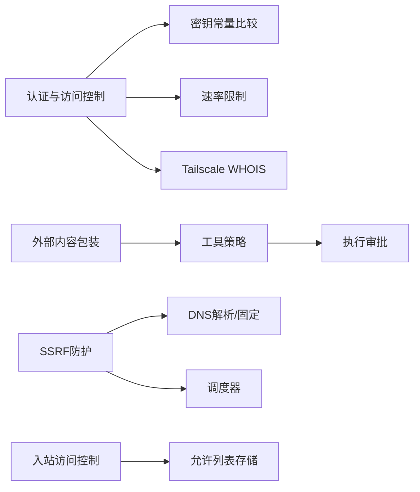

# 安全架构

<cite>
**本文引用的文件**
- [SECURITY.md](file://SECURITY.md)
- [docs/security/README.md](file://docs/security/README.md)
- [docs/security/CONTRIBUTING-THREAT-MODEL.md](file://docs/security/CONTRIBUTING-THREAT-MODEL.md)
- [docs/security/THREAT-MODEL-ATLAS.md](file://docs/security/THREAT-MODEL-ATLAS.md)
- [src/security/external-content.ts](file://src/security/external-content.ts)
- [src/gateway/auth.ts](file://src/gateway/auth.ts)
- [src/agents/sandbox/tool-policy.ts](file://src/agents/sandbox/tool-policy.ts)
- [src/infra/exec-approvals.ts](file://src/infra/exec-approvals.ts)
- [src/infra/net/ssrf.ts](file://src/infra/net/ssrf.ts)
- [src/web/inbound/access-control.ts](file://src/web/inbound/access-control.ts)
- [src/security/secret-equal.ts](file://src/security/secret-equal.ts)
</cite>

## 目录
1. [引言](#引言)
2. [项目结构](#项目结构)
3. [核心组件](#核心组件)
4. [架构总览](#架构总览)
5. [详细组件分析](#详细组件分析)
6. [依赖关系分析](#依赖关系分析)
7. [性能考量](#性能考量)
8. [故障排查指南](#故障排查指南)
9. [结论](#结论)
10. [附录](#附录)

## 引言
本文件面向OpenClaw的安全架构，系统化阐述其“本地优先”的安全模型、分布式安全设计与零信任网络原则在工程中的落地方式。文档覆盖安全边界划分、数据与传输安全、存储安全、威胁建模与缓解策略，并提供关键组件的交互流程与时序图，帮助开发者与运营人员正确配置与加固系统。

## 项目结构
OpenClaw的安全相关能力主要分布在以下模块：
- 网关认证与访问控制：负责入口鉴权、可信代理、设备令牌、速率限制等
- 外部内容处理：对邮件、Webhook、网页抓取等外部输入进行包装与安全提示
- 执行审批与沙箱策略：工具调用白名单、执行审批、主机命令执行控制
- SSRF防护：域名解析与地址判定，阻断私有/特殊用途网络
- 入站访问控制：按通道与账号维度的发送方白名单与组消息策略
- 密钥比较：常量时间比较，降低侧信道风险

图表来源
- [src/gateway/auth.ts](file://src/gateway/auth.ts#L1-L491)
- [src/web/inbound/access-control.ts](file://src/web/inbound/access-control.ts#L1-L226)
- [src/security/external-content.ts](file://src/security/external-content.ts#L1-L342)
- [src/agents/sandbox/tool-policy.ts](file://src/agents/sandbox/tool-policy.ts#L1-L110)
- [src/infra/exec-approvals.ts](file://src/infra/exec-approvals.ts#L1-L557)
- [src/infra/net/ssrf.ts](file://src/infra/net/ssrf.ts#L1-L364)
- [src/security/secret-equal.ts](file://src/security/secret-equal.ts#L1-L13)

章节来源
- [SECURITY.md](file://SECURITY.md#L1-L284)
- [docs/security/README.md](file://docs/security/README.md#L1-L18)

## 核心组件
- 认证与访问控制：支持token/password/trusted-proxy/none模式；默认token；支持速率限制；支持Tailscale转发身份校验；区分HTTP与WS控制界面的不同授权面
- 外部内容处理：对外部邮件、Webhook、网页抓取内容进行安全包装与警告；检测可疑注入模式；对边界标记进行清洗与防伪
- 工具策略与执行审批：基于通配符的工具白/黑名单；可要求“首次命中即审批”或“总是审批”；支持允许列表持久化与自动学习
- SSRF防护：严格禁止私有/特殊用途网络地址；支持主机名白名单；DNS解析固定与调度器绑定；阻断解析回环到私网
- 入站访问控制：按账号与通道维度的DM/群组策略；支持“仅配对”“白名单”“开放”“禁用”；历史消息配对宽限期
- 密钥比较：常量时间哈希比较，抵御时序侧信道

章节来源
- [src/gateway/auth.ts](file://src/gateway/auth.ts#L1-L491)
- [src/security/external-content.ts](file://src/security/external-content.ts#L1-L342)
- [src/agents/sandbox/tool-policy.ts](file://src/agents/sandbox/tool-policy.ts#L1-L110)
- [src/infra/exec-approvals.ts](file://src/infra/exec-approvals.ts#L1-L557)
- [src/infra/net/ssrf.ts](file://src/infra/net/ssrf.ts#L1-L364)
- [src/web/inbound/access-control.ts](file://src/web/inbound/access-control.ts#L1-L226)
- [src/security/secret-equal.ts](file://src/security/secret-equal.ts#L1-L13)

## 架构总览
OpenClaw采用“本地优先 + 零信任”的分布式安全模型：
- 本地优先：默认以本地主机为信任边界，网关控制平面与节点执行扩展在同一操作者信任域内
- 零信任网络：所有入站请求均需通过认证与访问控制；工具调用必须经策略与审批；外部内容必须被安全包装
- 分布式安全：认证、访问控制、内容包装、工具策略、执行审批、SSRF防护在不同层级协同，形成纵深防御

图表来源
- [src/gateway/auth.ts](file://src/gateway/auth.ts#L1-L491)
- [src/web/inbound/access-control.ts](file://src/web/inbound/access-control.ts#L1-L226)
- [src/security/external-content.ts](file://src/security/external-content.ts#L1-L342)
- [src/agents/sandbox/tool-policy.ts](file://src/agents/sandbox/tool-policy.ts#L1-L110)
- [src/infra/exec-approvals.ts](file://src/infra/exec-approvals.ts#L1-L557)
- [src/infra/net/ssrf.ts](file://src/infra/net/ssrf.ts#L1-L364)

## 详细组件分析

### 组件A：认证与访问控制（网关）
职责与特性：
- 模式选择：支持none/token/password/trusted-proxy，默认token；支持覆盖与环境变量注入
- 可信代理：校验代理头、用户头、允许用户列表；支持必需头检查
- Tailscale身份：在非本地直连场景下，通过转发头与WHOIS校验用户身份
- 速率限制：失败尝试按客户端IP记录，成功则重置；支持共享密钥作用域
- 表面区分：HTTP与WS控制界面的授权面不同，WS允许使用Tailscale头认证

图表来源
- [src/gateway/auth.ts](file://src/gateway/auth.ts#L367-L491)
- [src/security/secret-equal.ts](file://src/security/secret-equal.ts#L1-L13)

章节来源
- [src/gateway/auth.ts](file://src/gateway/auth.ts#L1-L491)
- [src/security/secret-equal.ts](file://src/security/secret-equal.ts#L1-L13)

### 组件B：外部内容安全包装
职责与特性：
- 包装策略：对外部邮件、Webhook、API、浏览器、元数据、Web搜索、网页抓取统一加边界标记与安全提示
- 注入检测：内置可疑模式集合，用于监控但不阻断；仍对内容进行安全包装
- 边界标记清洗：对可能的伪造边界标记进行清洗，防止内容逃逸
- 警告与元数据：附加来源、发件人、主题等元信息；必要时附加安全警告块

图表来源
- [src/security/external-content.ts](file://src/security/external-content.ts#L1-L342)

章节来源
- [src/security/external-content.ts](file://src/security/external-content.ts#L1-L342)

### 组件C：工具策略与执行审批
职责与特性：
- 工具策略：支持全局与单Agent粒度的工具白/黑名单；默认保留图像类工具；支持工具组展开
- 执行审批：支持deny/allowlist/full三种安全级别；ask支持off/on-miss/always；允许列表持久化与自动学习
- 决策流程：根据ask与allowlist命中情况决定是否需要审批；支持通过Unix Socket与UI交互决策

图表来源
- [src/agents/sandbox/tool-policy.ts](file://src/agents/sandbox/tool-policy.ts#L1-L110)
- [src/infra/exec-approvals.ts](file://src/infra/exec-approvals.ts#L1-L557)

章节来源
- [src/agents/sandbox/tool-policy.ts](file://src/agents/sandbox/tool-policy.ts#L1-L110)
- [src/infra/exec-approvals.ts](file://src/infra/exec-approvals.ts#L1-L557)

### 组件D：SSRF防护
职责与特性：
- 主机名与IP判定：严格阻断localhost、.internal、.local、RFC特殊用途IP；支持IPv4/IPv6与嵌入式IPv4
- 解析固定与调度器：对目标主机进行DNS解析固定，避免解析到私网；调度器强制使用固定解析
- 白名单与例外：支持显式允许主机名与私网豁免策略；对允许主机名跳过私网检查

图表来源
- [src/infra/net/ssrf.ts](file://src/infra/net/ssrf.ts#L1-L364)

章节来源
- [src/infra/net/ssrf.ts](file://src/infra/net/ssrf.ts#L1-L364)

### 组件E：入站访问控制（通道）
职责与特性：
- DM策略：支持“仅配对”“白名单”“开放”“禁用”，默认“仅配对”
- 群组策略：支持“开放”“白名单”“禁用”，默认由运行时组策略决定
- 自对话与历史消息：自对话与历史消息的配对回复存在宽限期；阻止来自Me的消息
- 发送方校验：对DM与群组分别进行允许列表校验；支持通配符与号码归一化

图表来源
- [src/web/inbound/access-control.ts](file://src/web/inbound/access-control.ts#L1-L226)

章节来源
- [src/web/inbound/access-control.ts](file://src/web/inbound/access-control.ts#L1-L226)

## 依赖关系分析
- 认证与访问控制依赖速率限制、Tailscale WHOIS、可信代理配置与密钥常量比较
- 外部内容包装与工具策略共同约束LLM与工具调用输入输出
- 执行审批依赖工具策略与UI/Socket交互
- SSRF防护贯穿外部网络请求链路，与DNS解析与调度器绑定
- 入站访问控制依赖账号配置与允许列表存储

图表来源
- [src/gateway/auth.ts](file://src/gateway/auth.ts#L1-L491)
- [src/security/secret-equal.ts](file://src/security/secret-equal.ts#L1-L13)
- [src/security/external-content.ts](file://src/security/external-content.ts#L1-L342)
- [src/agents/sandbox/tool-policy.ts](file://src/agents/sandbox/tool-policy.ts#L1-L110)
- [src/infra/exec-approvals.ts](file://src/infra/exec-approvals.ts#L1-L557)
- [src/infra/net/ssrf.ts](file://src/infra/net/ssrf.ts#L1-L364)
- [src/web/inbound/access-control.ts](file://src/web/inbound/access-control.ts#L1-L226)

章节来源
- [src/gateway/auth.ts](file://src/gateway/auth.ts#L1-L491)
- [src/security/external-content.ts](file://src/security/external-content.ts#L1-L342)
- [src/agents/sandbox/tool-policy.ts](file://src/agents/sandbox/tool-policy.ts#L1-L110)
- [src/infra/exec-approvals.ts](file://src/infra/exec-approvals.ts#L1-L557)
- [src/infra/net/ssrf.ts](file://src/infra/net/ssrf.ts#L1-L364)
- [src/web/inbound/access-control.ts](file://src/web/inbound/access-control.ts#L1-L226)
- [src/security/secret-equal.ts](file://src/security/secret-equal.ts#L1-L13)

## 性能考量
- 常量时间比较：避免时序差异导致的侧信道泄露，开销极低
- 速率限制：按IP与共享密钥作用域进行快速判定，减少无效请求处理
- DNS解析固定：减少DNS抖动与重试成本，提升外部请求稳定性
- 工具策略与执行审批：白名单命中优先放行，避免不必要的UI交互
- 外部内容包装：仅在必要时进行边界标记清洗与安全提示，尽量保持轻量

## 故障排查指南
常见问题与定位建议：
- 认证失败
  - 检查网关认证模式与凭据配置；确认速率限制是否触发
  - 若使用Tailscale，检查转发头与WHOIS返回
- 外部内容异常
  - 观察是否被错误清洗边界标记；确认来源标签与元数据是否正确
- 工具调用被阻
  - 检查工具策略allow/deny与当前Agent配置；确认是否需要审批
  - 查看允许列表持久化状态与最近使用记录
- SSRF请求失败
  - 检查目标主机名/IP是否在阻断列表；确认是否在允许主机名白名单中
  - 核对DNS解析结果与调度器绑定
- 入站消息未到达
  - 检查DM/群组策略与允许列表；确认是否处于配对宽限期内
  - 排查自对话与历史消息逻辑

章节来源
- [src/gateway/auth.ts](file://src/gateway/auth.ts#L1-L491)
- [src/security/external-content.ts](file://src/security/external-content.ts#L1-L342)
- [src/agents/sandbox/tool-policy.ts](file://src/agents/sandbox/tool-policy.ts#L1-L110)
- [src/infra/exec-approvals.ts](file://src/infra/exec-approvals.ts#L1-L557)
- [src/infra/net/ssrf.ts](file://src/infra/net/ssrf.ts#L1-L364)
- [src/web/inbound/access-control.ts](file://src/web/inbound/access-control.ts#L1-L226)

## 结论
OpenClaw的安全架构以“本地优先 + 零信任”为核心，通过多层边界与纵深防御实现对AI代理系统的整体安全：从网关认证与入站访问控制，到外部内容包装与工具策略，再到执行审批与SSRF防护，形成闭环。建议在生产环境中默认绑定loopback、启用速率限制、严格管理允许列表与工具策略，并持续完善供应链与内容审核机制。

## 附录

### 安全威胁模型与缓解要点
- MITRE ATLAS框架下的威胁识别与缓解建议详见威胁模型文档
- 关键推荐包括：完善病毒扫描与技能沙箱、改进输出验证、实施速率限制、加密凭据、优化执行审批体验与参数校验

章节来源
- [docs/security/THREAT-MODEL-ATLAS.md](file://docs/security/THREAT-MODEL-ATLAS.md#L1-L604)
- [docs/security/CONTRIBUTING-THREAT-MODEL.md](file://docs/security/CONTRIBUTING-THREAT-MODEL.md#L1-L91)

### 安全配置示例（说明性）
- 网关绑定与认证
  - 默认绑定loopback，使用token或密码认证；在受控网络中可启用Tailscale
- 外部内容处理
  - 对邮件/Webhook/网页抓取内容进行安全包装；开启安全警告与元数据标注
- 工具策略与执行审批
  - 严格工具白名单；ask策略设为“on-miss”或“always”；允许列表持久化
- SSRF防护
  - 明确允许主机名白名单；默认阻断私网与特殊用途地址
- 入站访问控制
  - DM默认“仅配对”，群组策略按需开启；允许列表最小化

章节来源
- [SECURITY.md](file://SECURITY.md#L203-L284)
- [src/gateway/auth.ts](file://src/gateway/auth.ts#L1-L491)
- [src/security/external-content.ts](file://src/security/external-content.ts#L1-L342)
- [src/agents/sandbox/tool-policy.ts](file://src/agents/sandbox/tool-policy.ts#L1-L110)
- [src/infra/exec-approvals.ts](file://src/infra/exec-approvals.ts#L1-L557)
- [src/infra/net/ssrf.ts](file://src/infra/net/ssrf.ts#L1-L364)
- [src/web/inbound/access-control.ts](file://src/web/inbound/access-control.ts#L1-L226)