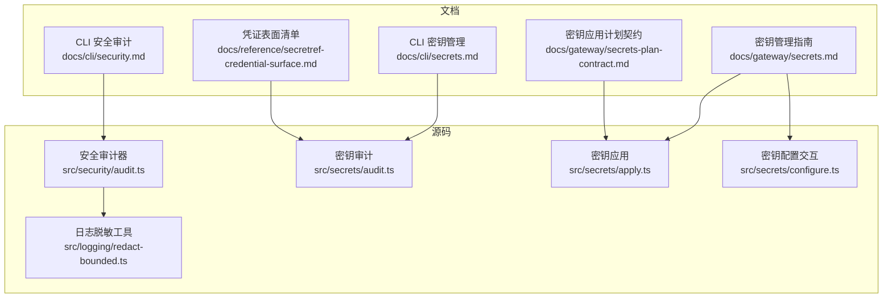
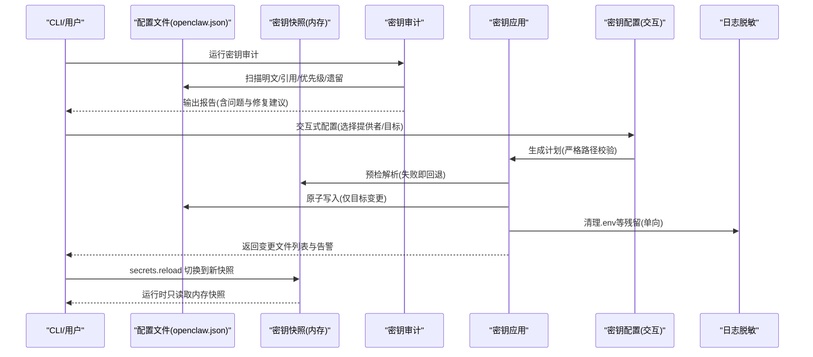
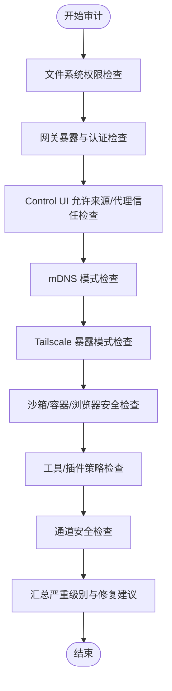
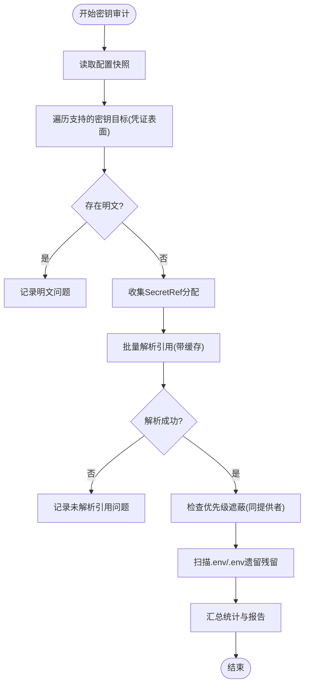
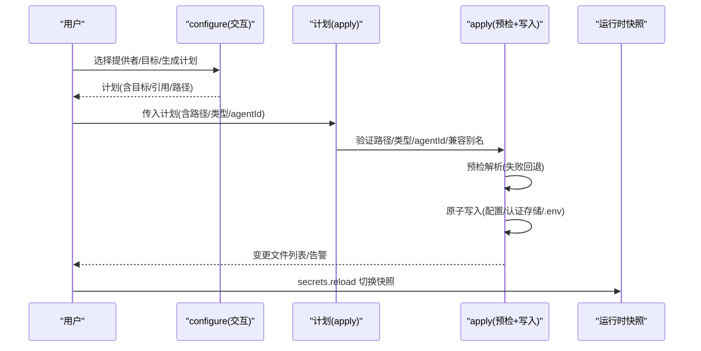
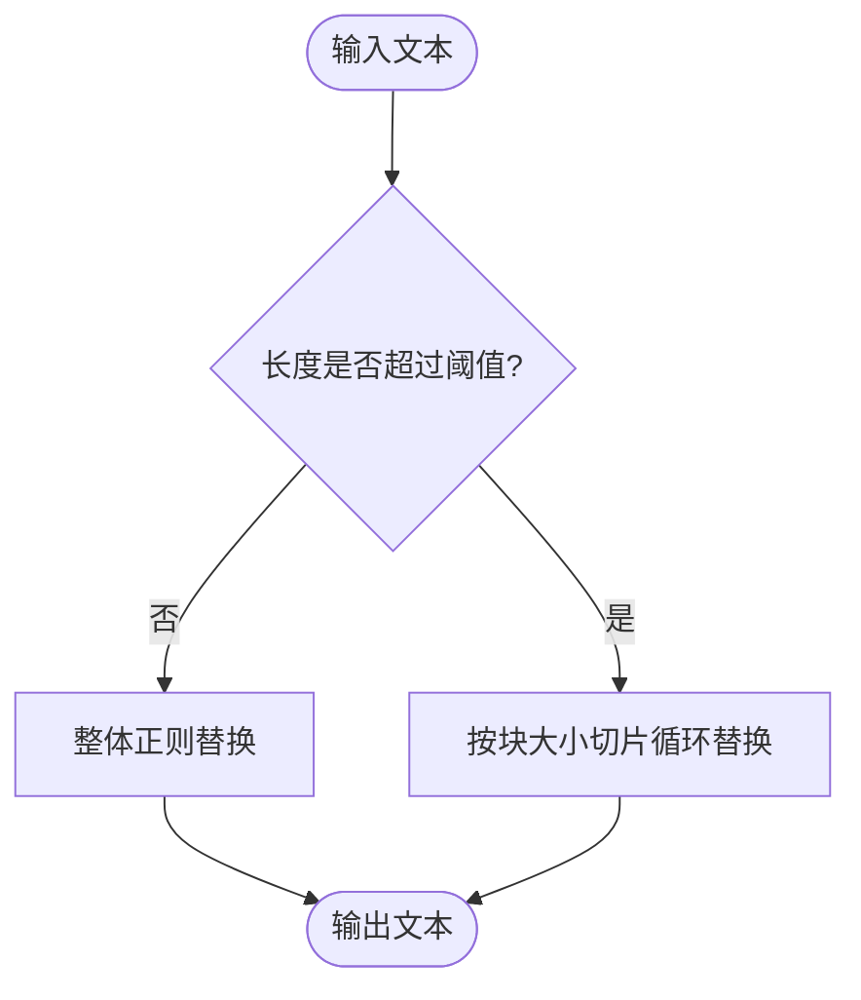
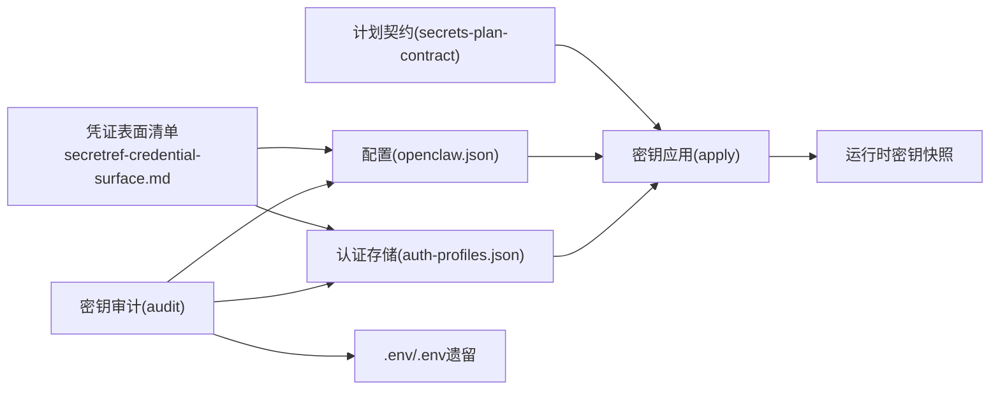

# 数据保护

<cite>
**本文引用的文件**
- [docs/cli/security.md](file://docs/cli/security.md)
- [docs/cli/secrets.md](file://docs/cli/secrets.md)
- [docs/gateway/secrets.md](file://docs/gateway/secrets.md)
- [docs/reference/secretref-credential-surface.md](file://docs/reference/secretref-credential-surface.md)
- [docs/gateway/secrets-plan-contract.md](file://docs/gateway/secrets-plan-contract.md)
- [src/security/audit.ts](file://src/security/audit.ts)
- [src/secrets/audit.ts](file://src/secrets/audit.ts)
- [src/secrets/apply.ts](file://src/secrets/apply.ts)
- [src/secrets/configure.ts](file://src/secrets/configure.ts)
- [src/logging/redact-bounded.ts](file://src/logging/redact-bounded.ts)
</cite>

## 目录
1. [引言](#引言)
2. [项目结构](#项目结构)
3. [核心组件](#核心组件)
4. [架构总览](#架构总览)
5. [详细组件分析](#详细组件分析)
6. [依赖关系分析](#依赖关系分析)
7. [性能考量](#性能考量)
8. [故障排查指南](#故障排查指南)
9. [结论](#结论)
10. [附录](#附录)

## 引言
本文件面向OpenClaw的数据保护体系，聚焦于数据加密、密钥管理、敏感信息处理、端到端保护、数据脱敏、访问日志与审计追踪、数据分类与保留销毁策略，以及配置示例、合规性检查与风险评估方法。文档以仓库内现有实现与文档为依据，结合代码级分析，帮助技术与非技术读者理解并正确使用系统的数据保护能力。

## 项目结构
OpenClaw在“文档”和“源码”两层提供了完整的数据保护能力说明与实现：
- 文档层：CLI安全审计、密钥管理（Secrets）指南、凭证表面清单、计划契约等
- 源码层：安全审计器、密钥审计/配置/应用流程、日志脱敏工具

图表来源
- [docs/cli/security.md](file://docs/cli/security.md#L1-L72)
- [docs/cli/secrets.md](file://docs/cli/secrets.md#L1-L169)
- [docs/gateway/secrets.md](file://docs/gateway/secrets.md#L1-L446)
- [docs/reference/secretref-credential-surface.md](file://docs/reference/secretref-credential-surface.md#L1-L126)
- [docs/gateway/secrets-plan-contract.md](file://docs/gateway/secrets-plan-contract.md#L1-L107)
- [src/security/audit.ts](file://src/security/audit.ts#L1-L800)
- [src/secrets/audit.ts](file://src/secrets/audit.ts#L1-L551)
- [src/secrets/apply.ts](file://src/secrets/apply.ts#L1-L778)
- [src/secrets/configure.ts](file://src/secrets/configure.ts#L1-L978)
- [src/logging/redact-bounded.ts](file://src/logging/redact-bounded.ts#L1-L27)

章节来源
- [docs/cli/security.md](file://docs/cli/security.md#L1-L72)
- [docs/cli/secrets.md](file://docs/cli/secrets.md#L1-L169)
- [docs/gateway/secrets.md](file://docs/gateway/secrets.md#L1-L446)
- [docs/reference/secretref-credential-surface.md](file://docs/reference/secretref-credential-surface.md#L1-L126)
- [docs/gateway/secrets-plan-contract.md](file://docs/gateway/secrets-plan-contract.md#L1-L107)
- [src/security/audit.ts](file://src/security/audit.ts#L1-L800)
- [src/secrets/audit.ts](file://src/secrets/audit.ts#L1-L551)
- [src/secrets/apply.ts](file://src/secrets/apply.ts#L1-L778)
- [src/secrets/configure.ts](file://src/secrets/configure.ts#L1-L978)
- [src/logging/redact-bounded.ts](file://src/logging/redact-bounded.ts#L1-L27)

## 核心组件
- 安全审计器：扫描配置、状态目录、网关暴露面、浏览器控制、沙箱与工具策略等，输出严重级别与修复建议
- 密钥审计：扫描openclaw.json、auth-profiles.json、.env、遗留auth.json等，识别明文、未解析引用、优先级遮蔽、遗留残留
- 密钥配置与应用：交互式构建计划、严格路径校验、一次性单向清理明文残留、原子写入与回滚快照
- 日志脱敏：对大文本进行分块正则替换，避免高内存占用

章节来源
- [src/security/audit.ts](file://src/security/audit.ts#L1-L800)
- [src/secrets/audit.ts](file://src/secrets/audit.ts#L1-L551)
- [src/secrets/apply.ts](file://src/secrets/apply.ts#L1-L778)
- [src/secrets/configure.ts](file://src/secrets/configure.ts#L1-L978)
- [src/logging/redact-bounded.ts](file://src/logging/redact-bounded.ts#L1-L27)

## 架构总览
下图展示从“配置/状态文件”到“运行时密钥快照”的关键流转，以及“审计/应用/配置”三类操作如何保证密钥不落地明文、最小化暴露面与可追溯性。

图表来源
- [src/secrets/audit.ts](file://src/secrets/audit.ts#L464-L551)
- [src/secrets/apply.ts](file://src/secrets/apply.ts#L700-L778)
- [src/secrets/configure.ts](file://src/secrets/configure.ts#L740-L978)
- [src/logging/redact-bounded.ts](file://src/logging/redact-bounded.ts#L9-L27)

## 详细组件分析

### 组件A：安全审计器（Security Audit）
- 职责：对网关绑定/认证、反向代理信任、Control UI允许来源、mDNS模式、Tailscale暴露、受信代理认证、小模型+浏览器工具组合、沙箱危险设置、插件与工具策略、通道安全等进行系统性扫描
- 关键点：
  - 严重级别区分（info/warn/critical），支持深度探测（如网关连通性）
  - 对共享收件箱、多用户入口、Docker网络模式、桥接网络、浏览器CDP等场景给出加固建议
  - 对未解析引用、权限不当、明文残留等直接触发修复建议
- 适用场景：部署前健康检查、CI策略、合规基线比对

图表来源
- [src/security/audit.ts](file://src/security/audit.ts#L339-L687)

章节来源
- [src/security/audit.ts](file://src/security/audit.ts#L1-L800)
- [docs/cli/security.md](file://docs/cli/security.md#L17-L72)

### 组件B：密钥审计（Secrets Audit）
- 职责：扫描配置、认证存储、遗留文件与环境变量中的明文或未解析引用，统计问题类型并输出报告
- 关键点：
  - 支持“--check”退出码；未解析引用返回更高优先级退出码
  - 报告包含明文计数、未解析引用计数、遮蔽计数、遗留残留计数
  - 对auth-profiles与openclaw.json的优先级遮蔽进行诊断
- 适用场景：日常巡检、CI门禁、上线前检查

图表来源
- [src/secrets/audit.ts](file://src/secrets/audit.ts#L464-L551)

章节来源
- [src/secrets/audit.ts](file://src/secrets/audit.ts#L1-L551)
- [docs/cli/secrets.md](file://docs/cli/secrets.md#L58-L87)
- [docs/reference/secretref-credential-surface.md](file://docs/reference/secretref-credential-surface.md#L19-L126)

### 组件C：密钥配置与应用（Secrets Configure + Apply）
- 配置（configure）：
  - 交互式选择提供者（env/file/exec）、目标字段（基于凭证表面清单）、生成计划
  - 支持“仅提供者”“跳过提供者设置”“按agent作用域”等模式
- 应用（apply）：
  - 严格计划契约：路径规范化、禁止段名、目标类型匹配、agentId必填、兼容别名
  - 预检解析通过后才写入；失败时尽力恢复原文件
  - 单向清理：删除明文值、清理遗留auth.json条目、清理.env中已迁移密钥
  - 原子写入：配置文件与认证存储按需写入，权限严格（例如0600）

图表来源
- [src/secrets/configure.ts](file://src/secrets/configure.ts#L740-L978)
- [src/secrets/apply.ts](file://src/secrets/apply.ts#L179-L257)
- [src/secrets/apply.ts](file://src/secrets/apply.ts#L700-L778)
- [docs/gateway/secrets-plan-contract.md](file://docs/gateway/secrets-plan-contract.md#L16-L107)

章节来源
- [src/secrets/configure.ts](file://src/secrets/configure.ts#L1-L978)
- [src/secrets/apply.ts](file://src/secrets/apply.ts#L1-L778)
- [docs/gateway/secrets-plan-contract.md](file://docs/gateway/secrets-plan-contract.md#L1-L107)
- [docs/gateway/secrets.md](file://docs/gateway/secrets.md#L416-L446)

### 组件D：日志脱敏（Redact Bounded）
- 职责：对超长日志文本进行分块正则替换，避免一次性大文本导致内存峰值过高
- 关键点：阈值与块大小可配置，默认阈值与块大小保障大文本处理稳定性

图表来源
- [src/logging/redact-bounded.ts](file://src/logging/redact-bounded.ts#L9-L27)

章节来源
- [src/logging/redact-bounded.ts](file://src/logging/redact-bounded.ts#L1-L27)

## 依赖关系分析
- 凭证表面（Credential Surface）决定哪些字段可被SecretRef覆盖，哪些不可（如会话类、OAuth刷新材料等）
- 计划契约（Plan Contract）约束apply的目标路径、类型、agentId等，确保严格验证
- 审计与应用联动：先审计发现问题，再通过configure生成计划，apply执行预检与原子写入，最后reload切换快照

图表来源
- [docs/reference/secretref-credential-surface.md](file://docs/reference/secretref-credential-surface.md#L19-L126)
- [docs/gateway/secrets-plan-contract.md](file://docs/gateway/secrets-plan-contract.md#L43-L107)
- [src/secrets/audit.ts](file://src/secrets/audit.ts#L464-L551)
- [src/secrets/apply.ts](file://src/secrets/apply.ts#L179-L257)

章节来源
- [docs/reference/secretref-credential-surface.md](file://docs/reference/secretref-credential-surface.md#L1-L126)
- [docs/gateway/secrets-plan-contract.md](file://docs/gateway/secrets-plan-contract.md#L1-L107)
- [src/secrets/audit.ts](file://src/secrets/audit.ts#L1-L551)
- [src/secrets/apply.ts](file://src/secrets/apply.ts#L1-L257)

## 性能考量
- 密钥解析并发：审计阶段对引用解析采用并发限制，避免阻塞与资源争用
- 大文本脱敏：日志脱敏采用分块策略，降低峰值内存占用
- 原子写入：应用阶段对文件写入采用快照捕获与原子替换，减少部分写入风险

章节来源
- [src/secrets/audit.ts](file://src/secrets/audit.ts#L318-L433)
- [src/logging/redact-bounded.ts](file://src/logging/redact-bounded.ts#L9-L27)
- [src/secrets/apply.ts](file://src/secrets/apply.ts#L670-L778)

## 故障排查指南
- 审计报告解读
  - 明文问题：定位到具体文件与路径，优先迁移到SecretRef
  - 未解析引用：确认提供者可用、命令/文件权限、环境变量可见性
  - 优先级遮蔽：auth-profiles中的凭据可能覆盖openclaw.json中的引用，需调整或清理
  - 遗留残留：清理遗留auth.json与.env中的静态密钥
- 应用失败回退
  - apply失败会尽力恢复原文件；若仍失败，检查计划目标路径是否符合契约
- 运行时切换
  - 使用reload切换到新的密钥快照，确保所有目标均能解析并通过预检

章节来源
- [src/secrets/audit.ts](file://src/secrets/audit.ts#L464-L551)
- [src/secrets/apply.ts](file://src/secrets/apply.ts#L700-L778)
- [docs/cli/secrets.md](file://docs/cli/secrets.md#L43-L57)

## 结论
OpenClaw通过“凭证表面+计划契约+交互配置+严格审计+原子应用”的闭环，实现了密钥不落地明文、最小暴露面与可追溯性。配合安全审计器与日志脱敏工具，系统在部署与运维层面具备良好的安全性与可观测性。建议将密钥审计纳入CI门禁，将密钥应用作为上线流程的关键步骤，并定期进行安全审计与合规检查。

## 附录

### 数据分类与保留策略（基于现有实现的实践建议）
- 分类维度（建议）：公开/内部/机密/极高机密
  - 公开：公开渠道令牌（如部分Web搜索API Key，视供应商策略）
  - 内部：网关认证令牌/密码、远程访问凭据
  - 机密：第三方服务API Key、OAuth Access Token（如适用）
  - 极高机密：个人身份凭据、本地密钥库
- 保留与销毁
  - 通过SecretRef覆盖明文，避免在配置与状态目录中长期留存
  - 应用阶段对遗留auth.json与.env中的静态密钥进行清理
  - 审计阶段发现的明文应尽快迁移至SecretRef并清理残留

章节来源
- [docs/reference/secretref-credential-surface.md](file://docs/reference/secretref-credential-surface.md#L14-L18)
- [src/secrets/audit.ts](file://src/secrets/audit.ts#L282-L316)
- [src/secrets/apply.ts](file://src/secrets/apply.ts#L566-L625)

### 端到端加密与数据脱敏
- 端到端加密：仓库未提供内置传输层加密实现；建议通过反向代理/Tailscale等网络边界实现加密传输
- 数据脱敏：日志脱敏工具支持对大文本进行分块正则替换；安全审计器对明文与未解析引用进行识别与修复建议

章节来源
- [src/logging/redact-bounded.ts](file://src/logging/redact-bounded.ts#L1-L27)
- [src/security/audit.ts](file://src/security/audit.ts#L339-L687)

### 访问日志与审计追踪
- 审计范围：文件系统权限、网关暴露与认证、Control UI来源白名单、mDNS元数据泄露、沙箱与容器网络、工具/插件策略、通道安全
- 建议：将安全审计纳入CI，使用--json输出便于自动化处理；对critical/warn/info分别制定处置策略

章节来源
- [docs/cli/security.md](file://docs/cli/security.md#L17-L72)
- [src/security/audit.ts](file://src/security/audit.ts#L1-L800)

### 合规性检查与风险评估方法
- 合规性检查清单（建议）
  - 配置文件权限：仅属主可读写（0600）
  - 状态目录权限：仅属主可读写（0700）
  - 网关绑定：仅本地回环或受控尾网
  - Control UI来源白名单：明确可信来源
  - mDNS模式：最小化或关闭
  - 沙箱与容器网络：避免host/bridge无界网络
  - 工具策略：默认拒绝危险工具，必要时最小化放行
- 风险评估方法
  - 将安全审计结果映射到威胁模型（如供应链、配置错误、暴露面扩大）
  - 对高危项（critical）建立SLA修复时限
  - 对历史遗留（legacy）进行迁移计划与时间表

章节来源
- [docs/cli/security.md](file://docs/cli/security.md#L17-L72)
- [src/security/audit.ts](file://src/security/audit.ts#L339-L687)

### 数据保护配置示例（步骤化）
- 密钥审计
  - 运行审计并检查结果：openclaw secrets audit --check
- 交互式配置
  - 生成计划：openclaw secrets configure
  - 预演（可选）：openclaw secrets apply --from <plan.json> --dry-run
- 应用与清理
  - 执行应用：openclaw secrets apply --from <plan.json>
  - 刷新运行时：openclaw secrets reload
- 安全审计（可选）
  - 运行openclaw security audit（可--deep）以检查网关暴露与策略

章节来源
- [docs/cli/secrets.md](file://docs/cli/secrets.md#L21-L30)
- [docs/cli/security.md](file://docs/cli/security.md#L19-L24)