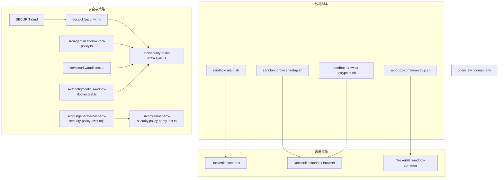
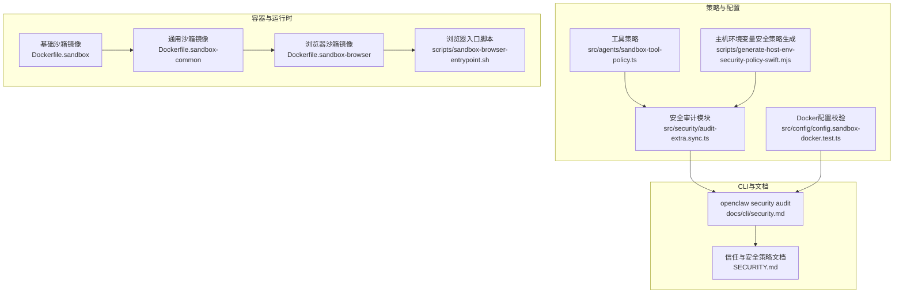
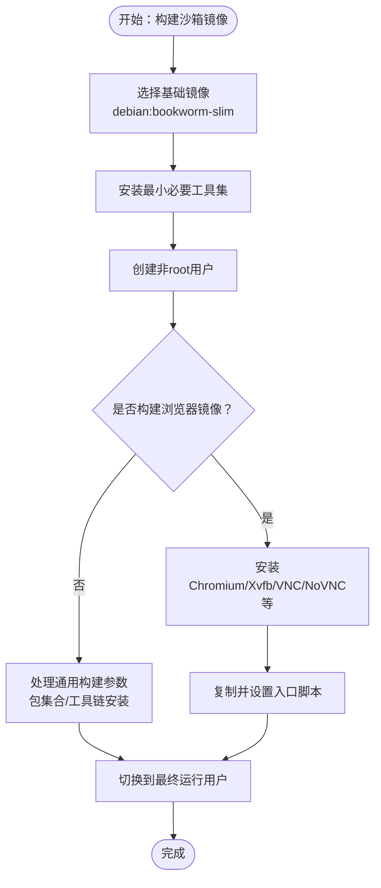
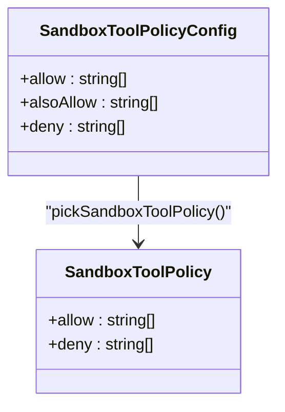
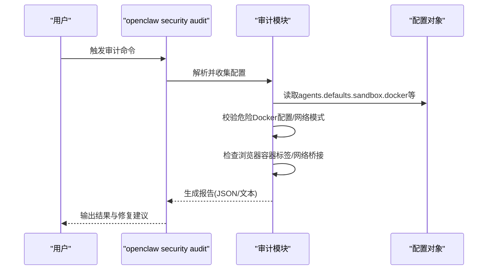
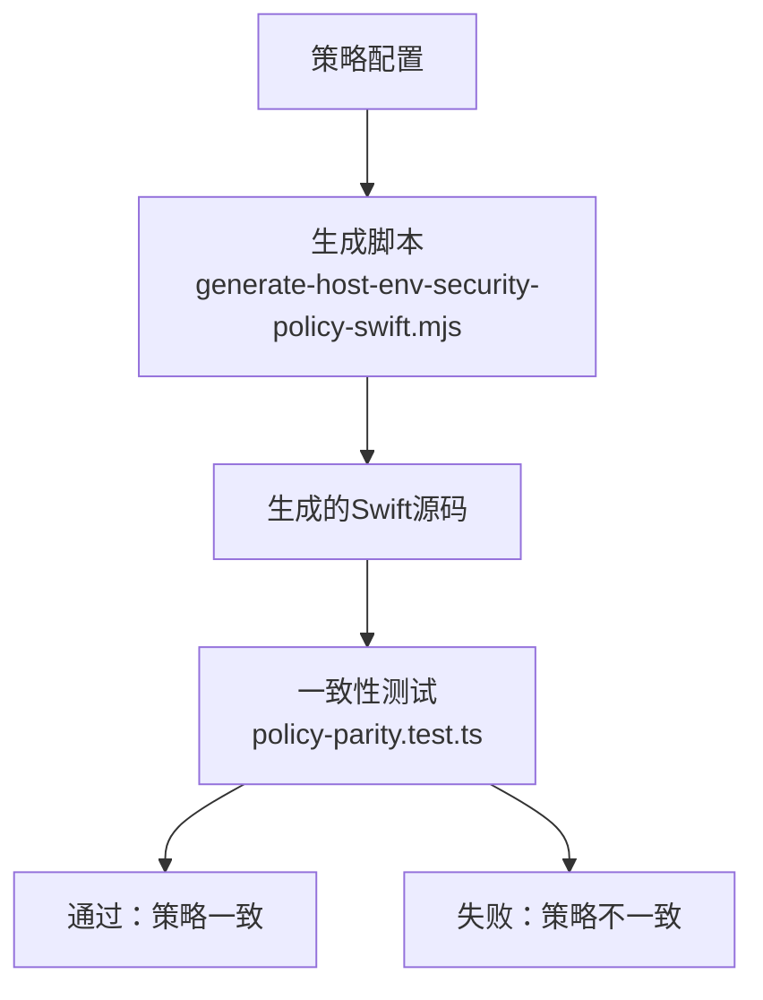
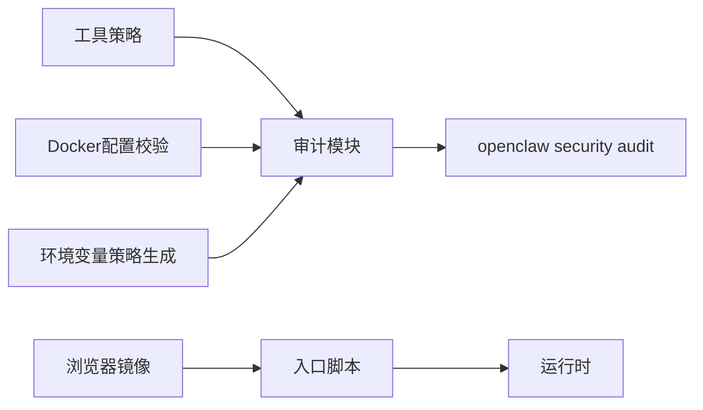

# 安全策略

<cite>
**本文引用的文件**
- [Dockerfile.sandbox](file://Dockerfile.sandbox)
- [Dockerfile.sandbox-browser](file://Dockerfile.sandbox-browser)
- [Dockerfile.sandbox-common](file://Dockerfile.sandbox-common)
- [scripts/sandbox-browser-entrypoint.sh](file://scripts/sandbox-browser-entrypoint.sh)
- [scripts/sandbox-browser-setup.sh](file://scripts/sandbox-browser-setup.sh)
- [scripts/sandbox-common-setup.sh](file://scripts/sandbox-common-setup.sh)
- [scripts/sandbox-setup.sh](file://scripts/sandbox-setup.sh)
- [docs/cli/security.md](file://docs/cli/security.md)
- [SECURITY.md](file://SECURITY.md)
- [openclaw.podman.env](file://openclaw.podman.env)
- [src/agents/sandbox-tool-policy.ts](file://src/agents/sandbox-tool-policy.ts)
- [src/security/audit-extra.sync.ts](file://src/security/audit-extra.sync.ts)
- [src/security/audit.test.ts](file://src/security/audit.test.ts)
- [src/config/config.sandbox-docker.test.ts](file://src/config/config.sandbox-docker.test.ts)
- [scripts/generate-host-env-security-policy-swift.mjs](file://scripts/generate-host-env-security-policy-swift.mjs)
- [src/infra/host-env-security.policy-parity.test.ts](file://src/infra/host-env-security.policy-parity.test.ts)
</cite>

## 目录
1. [简介](#简介)
2. [项目结构](#项目结构)
3. [核心组件](#核心组件)
4. [架构总览](#架构总览)
5. [详细组件分析](#详细组件分析)
6. [依赖关系分析](#依赖关系分析)
7. [性能考量](#性能考量)
8. [故障排查指南](#故障排查指南)
9. [结论](#结论)
10. [附录](#附录)

## 简介
本文件面向OpenClaw的沙箱与安全策略，聚焦于容器化沙箱基线、访问控制与权限模型、文件系统权限、网络访问控制、系统调用白名单、威胁模型与漏洞评估、安全审计与合规检查、以及风险缓解与最佳实践。内容以仓库现有实现与文档为依据，结合CLI安全审计工具与容器镜像构建脚本，形成可操作的安全配置模板与落地建议。

## 项目结构
围绕沙箱与安全的关键目录与文件包括：
- 容器镜像定义：Dockerfile.sandbox、Dockerfile.sandbox-browser、Dockerfile.sandbox-common
- 沙箱浏览器入口与构建脚本：scripts/sandbox-browser-entrypoint.sh、scripts/sandbox-browser-setup.sh、scripts/sandbox-common-setup.sh、scripts/sandbox-setup.sh
- 安全审计与策略：docs/cli/security.md、SECURITY.md、src/security/audit-extra.sync.ts、src/security/audit.test.ts、src/config/config.sandbox-docker.test.ts
- 工具策略与环境变量安全：src/agents/sandbox-tool-policy.ts、scripts/generate-host-env-security-policy-swift.mjs、src/infra/host-env-security.policy-parity.test.ts
- 运行时环境示例：openclaw.podman.env

图表来源
- [Dockerfile.sandbox](file://Dockerfile.sandbox#L1-L21)
- [Dockerfile.sandbox-browser](file://Dockerfile.sandbox-browser#L1-L33)
- [Dockerfile.sandbox-common](file://Dockerfile.sandbox-common#L1-L46)
- [scripts/sandbox-setup.sh](file://scripts/sandbox-setup.sh#L1-L8)
- [scripts/sandbox-common-setup.sh](file://scripts/sandbox-common-setup.sh#L1-L41)
- [scripts/sandbox-browser-setup.sh](file://scripts/sandbox-browser-setup.sh#L1-L8)
- [scripts/sandbox-browser-entrypoint.sh](file://scripts/sandbox-browser-entrypoint.sh#L1-L128)
- [docs/cli/security.md](file://docs/cli/security.md#L1-L72)
- [SECURITY.md](file://SECURITY.md#L1-L284)
- [src/agents/sandbox-tool-policy.ts](file://src/agents/sandbox-tool-policy.ts#L1-L37)
- [src/security/audit-extra.sync.ts](file://src/security/audit-extra.sync.ts#L804-L845)
- [src/security/audit.test.ts](file://src/security/audit.test.ts#L1027-L1088)
- [src/config/config.sandbox-docker.test.ts](file://src/config/config.sandbox-docker.test.ts#L136-L180)
- [scripts/generate-host-env-security-policy-swift.mjs](file://scripts/generate-host-env-security-policy-swift.mjs#L43-L74)
- [src/infra/host-env-security.policy-parity.test.ts](file://src/infra/host-env-security.policy-parity.test.ts#L38-L62)
- [openclaw.podman.env](file://openclaw.podman.env#L1-L25)

章节来源
- [Dockerfile.sandbox](file://Dockerfile.sandbox#L1-L21)
- [Dockerfile.sandbox-browser](file://Dockerfile.sandbox-browser#L1-L33)
- [Dockerfile.sandbox-common](file://Dockerfile.sandbox-common#L1-L46)
- [scripts/sandbox-browser-entrypoint.sh](file://scripts/sandbox-browser-entrypoint.sh#L1-L128)
- [scripts/sandbox-browser-setup.sh](file://scripts/sandbox-browser-setup.sh#L1-L8)
- [scripts/sandbox-common-setup.sh](file://scripts/sandbox-common-setup.sh#L1-L41)
- [scripts/sandbox-setup.sh](file://scripts/sandbox-setup.sh#L1-L8)
- [docs/cli/security.md](file://docs/cli/security.md#L1-L72)
- [SECURITY.md](file://SECURITY.md#L1-L284)
- [openclaw.podman.env](file://openclaw.podman.env#L1-L25)
- [src/agents/sandbox-tool-policy.ts](file://src/agents/sandbox-tool-policy.ts#L1-L37)
- [src/security/audit-extra.sync.ts](file://src/security/audit-extra.sync.ts#L804-L845)
- [src/security/audit.test.ts](file://src/security/audit.test.ts#L1027-L1088)
- [src/config/config.sandbox-docker.test.ts](file://src/config/config.sandbox-docker.test.ts#L136-L180)
- [scripts/generate-host-env-security-policy-swift.mjs](file://scripts/generate-host-env-security-policy-swift.mjs#L43-L74)
- [src/infra/host-env-security.policy-parity.test.ts](file://src/infra/host-env-security.policy-parity.test.ts#L38-L62)

## 核心组件
- 沙箱容器基线与运行用户
  - 基础镜像采用精简发行版，安装最小必要工具集，并以非特权用户运行，降低攻击面。
- 沙箱浏览器镜像与入口
  - 提供带Xvfb、Chromium、VNC/NoVNC等组件的浏览器沙箱，入口脚本负责参数去重、端口映射、图形与扩展禁用等安全加固。
- 安全审计与策略
  - CLI安全审计支持深度扫描、自动修复、JSON输出；后端审计模块对危险Docker配置、网络模式、Seccomp/AppArmor状态进行告警与校验。
- 工具策略与环境变量安全
  - 工具策略通过allow/deny集合控制可用工具；主机环境变量安全策略生成与一致性测试保障跨语言实现一致。
- 运行时环境与Podman示例
  - 提供Podman环境变量模板，强调认证令牌、端口映射与绑定方式等关键安全参数。

章节来源
- [Dockerfile.sandbox](file://Dockerfile.sandbox#L1-L21)
- [Dockerfile.sandbox-browser](file://Dockerfile.sandbox-browser#L1-L33)
- [scripts/sandbox-browser-entrypoint.sh](file://scripts/sandbox-browser-entrypoint.sh#L1-L128)
- [docs/cli/security.md](file://docs/cli/security.md#L17-L72)
- [SECURITY.md](file://SECURITY.md#L203-L241)
- [src/agents/sandbox-tool-policy.ts](file://src/agents/sandbox-tool-policy.ts#L1-L37)
- [scripts/generate-host-env-security-policy-swift.mjs](file://scripts/generate-host-env-security-policy-swift.mjs#L43-L74)
- [src/infra/host-env-security.policy-parity.test.ts](file://src/infra/host-env-security.policy-parity.test.ts#L38-L62)
- [openclaw.podman.env](file://openclaw.podman.env#L1-L25)

## 架构总览
下图展示从“配置与策略”到“容器运行时”的整体安全架构，包括工具策略、Docker配置校验、审计与修复、以及浏览器沙箱入口流程。

图表来源
- [src/agents/sandbox-tool-policy.ts](file://src/agents/sandbox-tool-policy.ts#L1-L37)
- [src/security/audit-extra.sync.ts](file://src/security/audit-extra.sync.ts#L804-L845)
- [src/config/config.sandbox-docker.test.ts](file://src/config/config.sandbox-docker.test.ts#L136-L180)
- [scripts/generate-host-env-security-policy-swift.mjs](file://scripts/generate-host-env-security-policy-swift.mjs#L43-L74)
- [Dockerfile.sandbox](file://Dockerfile.sandbox#L1-L21)
- [Dockerfile.sandbox-common](file://Dockerfile.sandbox-common#L1-L46)
- [Dockerfile.sandbox-browser](file://Dockerfile.sandbox-browser#L1-L33)
- [scripts/sandbox-browser-entrypoint.sh](file://scripts/sandbox-browser-entrypoint.sh#L1-L128)
- [docs/cli/security.md](file://docs/cli/security.md#L1-L72)
- [SECURITY.md](file://SECURITY.md#L1-L284)

## 详细组件分析

### 组件A：容器沙箱基线与运行用户
- 基线镜像
  - 使用精简发行版作为基础，仅安装必要工具（如bash、ca-certificates、curl、git、jq、python3、ripgrep），减少潜在攻击面。
  - 通过非root用户运行，避免容器内提权风险。
- 浏览器镜像
  - 在基础镜像上增加Chromium、Xvfb、VNC/NoVNC、websockify等组件，满足远程可视化与无头执行需求。
  - 入口脚本负责：
    - 参数去重与合并，避免重复或冲突参数。
    - 设置显示与用户数据目录，限制临时文件范围。
    - 关闭DevShm使用、禁用翻译UI、崩溃报告、扩展等不必要功能。
    - 可选禁用GPU、软件光栅化，降低图形相关攻击面。
    - 将Chromium调试端口通过socat转发至宿主指定端口，支持可控访问。
    - 在启用NoVNC时生成随机密码并设置认证。
- 通用沙箱镜像
  - 支持通过构建参数注入包集合、安装pnpm/bun、Linuxbrew（Homebrew）等工具链。
  - 默认以最终用户运行，允许覆盖。

图表来源
- [Dockerfile.sandbox](file://Dockerfile.sandbox#L1-L21)
- [Dockerfile.sandbox-browser](file://Dockerfile.sandbox-browser#L1-L33)
- [Dockerfile.sandbox-common](file://Dockerfile.sandbox-common#L1-L46)
- [scripts/sandbox-browser-setup.sh](file://scripts/sandbox-browser-setup.sh#L1-L8)
- [scripts/sandbox-common-setup.sh](file://scripts/sandbox-common-setup.sh#L1-L41)
- [scripts/sandbox-setup.sh](file://scripts/sandbox-setup.sh#L1-L8)

章节来源
- [Dockerfile.sandbox](file://Dockerfile.sandbox#L1-L21)
- [Dockerfile.sandbox-browser](file://Dockerfile.sandbox-browser#L1-L33)
- [Dockerfile.sandbox-common](file://Dockerfile.sandbox-common#L1-L46)
- [scripts/sandbox-browser-entrypoint.sh](file://scripts/sandbox-browser-entrypoint.sh#L1-L128)
- [scripts/sandbox-browser-setup.sh](file://scripts/sandbox-browser-setup.sh#L1-L8)
- [scripts/sandbox-common-setup.sh](file://scripts/sandbox-common-setup.sh#L1-L41)
- [scripts/sandbox-setup.sh](file://scripts/sandbox-setup.sh#L1-L8)

### 组件B：工具策略与权限模型
- 工具策略
  - 通过allow/deny集合表达工具白名单/黑名单，支持alsoAllow在默认“全部允许”基础上追加。
  - 当未显式配置时返回空策略，表示不限制。
- 权限模型
  - 信任模型为“个人助理”，默认单用户/单网关，避免多租户对抗场景。
  - 插件属于可信计算基的一部分，安装即授予与本地代码同等信任级别。
  - 执行审批（允许/询问）用于减少误执行，而非多租户授权边界。

图表来源
- [src/agents/sandbox-tool-policy.ts](file://src/agents/sandbox-tool-policy.ts#L1-L37)

章节来源
- [src/agents/sandbox-tool-policy.ts](file://src/agents/sandbox-tool-policy.ts#L1-L37)
- [SECURITY.md](file://SECURITY.md#L87-L101)

### 组件C：安全审计与漏洞评估
- CLI审计能力
  - 支持普通/深度扫描、自动修复、JSON输出，便于CI与策略检查。
  - 告警范围覆盖：共享收件箱安全、Webhook会话键、Docker网络/挂载/Seccomp/AppArmor危险配置、浏览器容器标签缺失、包管理完整性等。
- 后端审计模块
  - 对“沙箱Docker配置模式开启但沙箱关闭”、“危险Docker网络模式/挂载/安全配置”等进行严重告警。
  - 单元测试覆盖危险配置组合，确保Zod校验拒绝不安全值（如unconfined）。
- 漏洞评估要点
  - 高危：host网络、container:*命名空间加入、seccomp/apparmor unconfined、敏感路径挂载。
  - 中危：bridge网络无源地址范围限制、per-channel-peer会话策略缺失、工具策略过于宽松。
  - 低危：日志脱敏级别不足、组策略开放、通道白名单依赖可变标识符。

图表来源
- [docs/cli/security.md](file://docs/cli/security.md#L17-L72)
- [src/security/audit-extra.sync.ts](file://src/security/audit-extra.sync.ts#L804-L845)
- [src/security/audit.test.ts](file://src/security/audit.test.ts#L1027-L1088)
- [src/config/config.sandbox-docker.test.ts](file://src/config/config.sandbox-docker.test.ts#L136-L180)

章节来源
- [docs/cli/security.md](file://docs/cli/security.md#L17-L72)
- [src/security/audit-extra.sync.ts](file://src/security/audit-extra.sync.ts#L804-L845)
- [src/security/audit.test.ts](file://src/security/audit.test.ts#L1027-L1088)
- [src/config/config.sandbox-docker.test.ts](file://src/config/config.sandbox-docker.test.ts#L136-L180)

### 组件D：主机环境变量安全策略
- 生成与校验
  - 脚本根据策略生成跨语言（如Swift）的blockedKeys/blockedOverrideKeys/blockedPrefixes常量。
  - 测试确保生成源与Sanitizer源中引用的策略数组保持一致。
- 实践意义
  - 通过统一策略清单，避免环境变量被滥用导致的越权或信息泄露。

图表来源
- [scripts/generate-host-env-security-policy-swift.mjs](file://scripts/generate-host-env-security-policy-swift.mjs#L43-L74)
- [src/infra/host-env-security.policy-parity.test.ts](file://src/infra/host-env-security.policy-parity.test.ts#L38-L62)

章节来源
- [scripts/generate-host-env-security-policy-swift.mjs](file://scripts/generate-host-env-security-policy-swift.mjs#L43-L74)
- [src/infra/host-env-security.policy-parity.test.ts](file://src/infra/host-env-security.policy-parity.test.ts#L38-L62)

### 组件E：运行时环境与Podman示例
- 示例环境变量
  - 包含网关认证令牌、宿主端口映射、绑定模式等关键参数。
- 最佳实践
  - 使用只读根文件系统、丢弃所有能力、限制网络暴露。
  - 通过环境文件与启动脚本分离敏感配置，避免明文写入镜像。

章节来源
- [openclaw.podman.env](file://openclaw.podman.env#L1-L25)
- [SECURITY.md](file://SECURITY.md#L257-L271)

## 依赖关系分析
- 组件耦合
  - 工具策略与审计模块存在间接耦合：工具策略决定可执行范围，审计模块据此评估风险。
  - Docker配置校验与审计模块强耦合：Zod校验拒绝不安全值，审计模块补充发现与修复建议。
  - 主机环境变量安全策略生成与测试强耦合：保证跨语言实现一致性。
- 外部依赖
  - 容器运行时（Docker/Podman）能力与网络模式直接影响沙箱隔离强度。
  - 浏览器入口脚本依赖Xvfb/Chromium/socat/x11vnc/websockify等组件。

图表来源
- [src/agents/sandbox-tool-policy.ts](file://src/agents/sandbox-tool-policy.ts#L1-L37)
- [src/security/audit-extra.sync.ts](file://src/security/audit-extra.sync.ts#L804-L845)
- [src/config/config.sandbox-docker.test.ts](file://src/config/config.sandbox-docker.test.ts#L136-L180)
- [scripts/generate-host-env-security-policy-swift.mjs](file://scripts/generate-host-env-security-policy-swift.mjs#L43-L74)
- [scripts/sandbox-browser-entrypoint.sh](file://scripts/sandbox-browser-entrypoint.sh#L1-L128)

章节来源
- [src/agents/sandbox-tool-policy.ts](file://src/agents/sandbox-tool-policy.ts#L1-L37)
- [src/security/audit-extra.sync.ts](file://src/security/audit-extra.sync.ts#L804-L845)
- [src/config/config.sandbox-docker.test.ts](file://src/config/config.sandbox-docker.test.ts#L136-L180)
- [scripts/generate-host-env-security-policy-swift.mjs](file://scripts/generate-host-env-security-policy-swift.mjs#L43-L74)
- [scripts/sandbox-browser-entrypoint.sh](file://scripts/sandbox-browser-entrypoint.sh#L1-L128)

## 性能考量
- 镜像体积与启动时间
  - 精简基础镜像与按需安装工具可缩短构建与拉取时间，减少容器启动延迟。
- 浏览器沙箱资源占用
  - 禁用GPU与扩展、限制渲染进程数量可降低内存/CPU占用。
- 审计与修复的开销
  - 深度扫描与自动修复在CI中应结合缓存与增量检查，避免重复扫描。

## 故障排查指南
- 审计报告解读
  - 关注严重/高危项：危险Docker网络模式、挂载敏感路径、Seccomp/AppArmor未受约束、浏览器容器标签缺失。
  - 使用JSON输出在CI中过滤严重问题并自动化修复。
- 浏览器沙箱常见问题
  - 端口无法访问：检查CDP端口映射与socat监听范围，确认源地址范围配置。
  - VNC登录失败：确认密码生成与权限设置，确保宿主端口可达。
- 配置校验失败
  - 若出现Zod校验错误，优先调整为受支持的配置值（例如移除unconfined）。

章节来源
- [docs/cli/security.md](file://docs/cli/security.md#L43-L72)
- [src/security/audit.test.ts](file://src/security/audit.test.ts#L1027-L1088)
- [src/config/config.sandbox-docker.test.ts](file://src/config/config.sandbox-docker.test.ts#L136-L180)
- [scripts/sandbox-browser-entrypoint.sh](file://scripts/sandbox-browser-entrypoint.sh#L106-L125)

## 结论
OpenClaw的沙箱安全策略以“个人助理”信任模型为核心，结合容器化基线、工具策略、Docker配置校验与CLI安全审计，形成从配置到运行时的闭环安全控制。通过严格限制网络与系统调用、最小化工具集、统一环境变量策略与持续审计修复，可在多数部署场景下显著降低风险。建议在生产环境中强制启用沙箱模式、收紧Docker配置、使用只读文件系统与能力降级，并配合定期安全审计与合规检查。

## 附录

### 安全配置模板（基于仓库实现）
- 容器运行参数（示例）
  - 只读根文件系统、丢弃所有能力、挂载受限卷、限制网络暴露。
- 沙箱Docker配置（示例）
  - 禁止host网络、container:*命名空间加入、seccomp/apparmor unconfined。
  - 明确bind挂载路径与只读标志，避免敏感路径直通。
- 浏览器沙箱参数（示例）
  - 禁用GPU与扩展、限制渲染进程数、设置CDP源地址范围、启用VNC认证。
- 环境变量安全策略（示例）
  - blockedKeys/blockedOverrideKeys/blockedPrefixes清单，确保跨语言实现一致。

章节来源
- [SECURITY.md](file://SECURITY.md#L257-L271)
- [src/config/config.sandbox-docker.test.ts](file://src/config/config.sandbox-docker.test.ts#L136-L180)
- [scripts/sandbox-browser-entrypoint.sh](file://scripts/sandbox-browser-entrypoint.sh#L40-L94)
- [scripts/generate-host-env-security-policy-swift.mjs](file://scripts/generate-host-env-security-policy-swift.mjs#L43-L74)