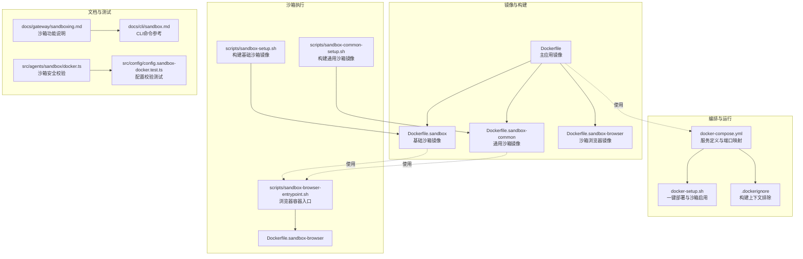
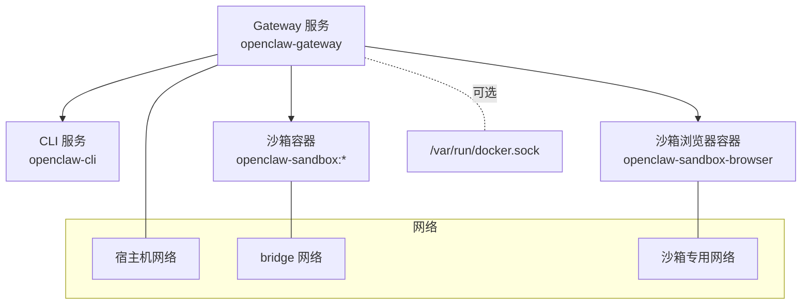
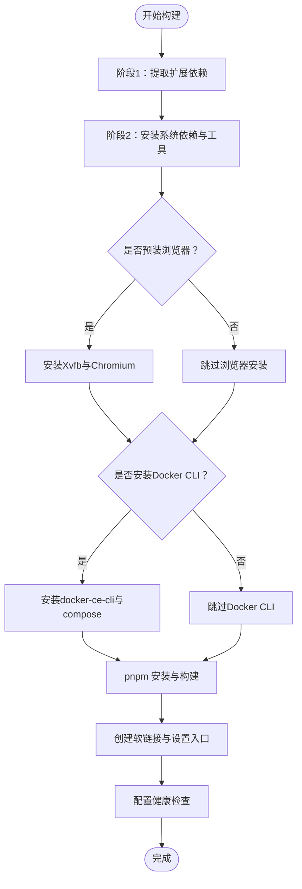
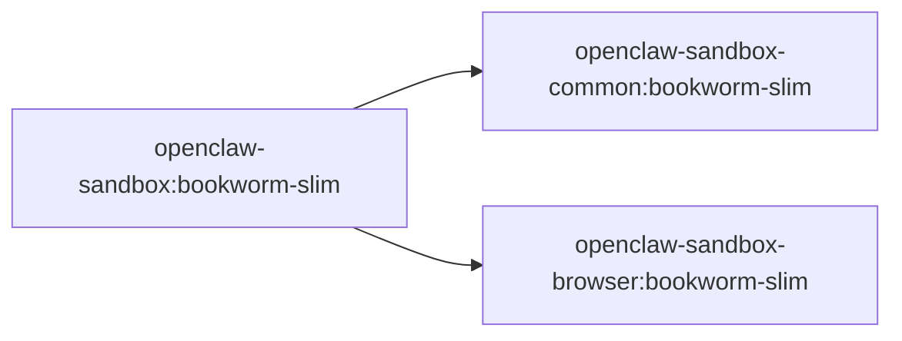
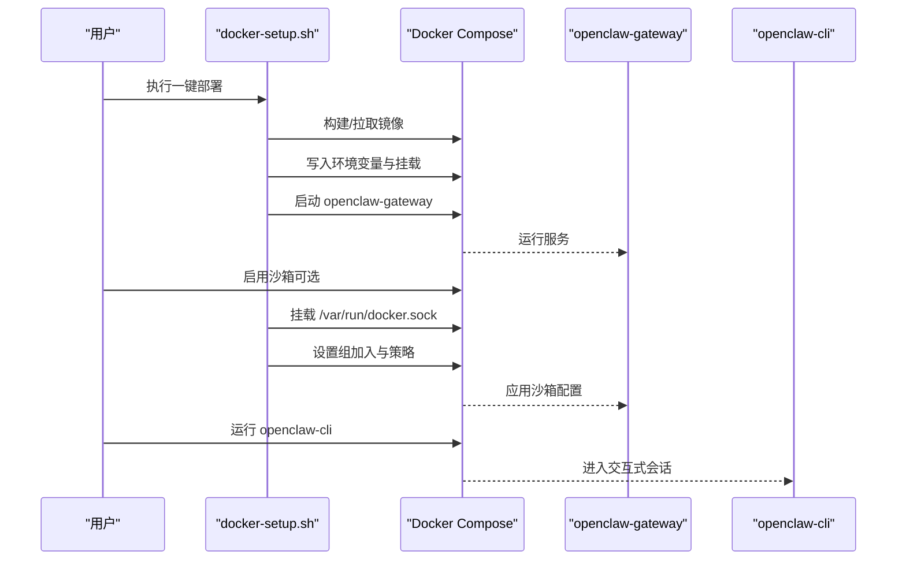
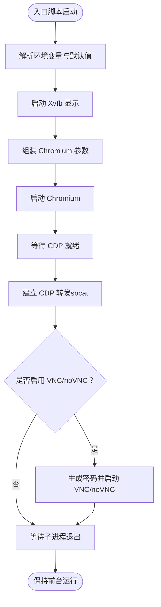
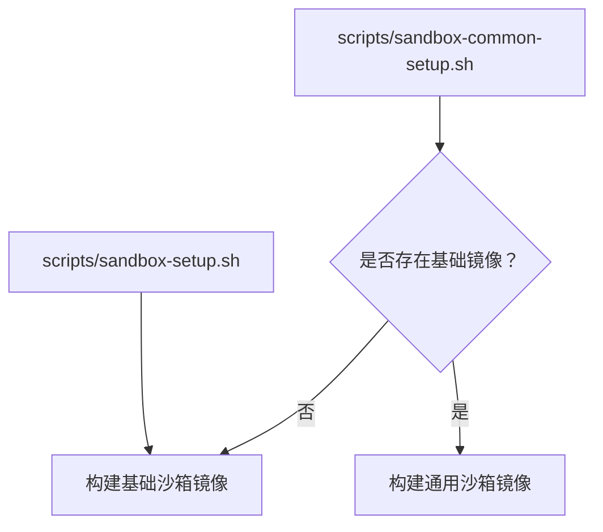
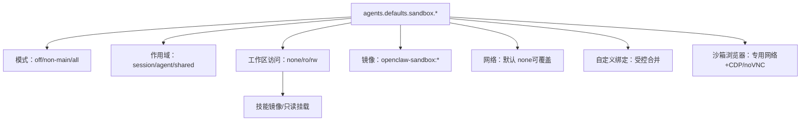
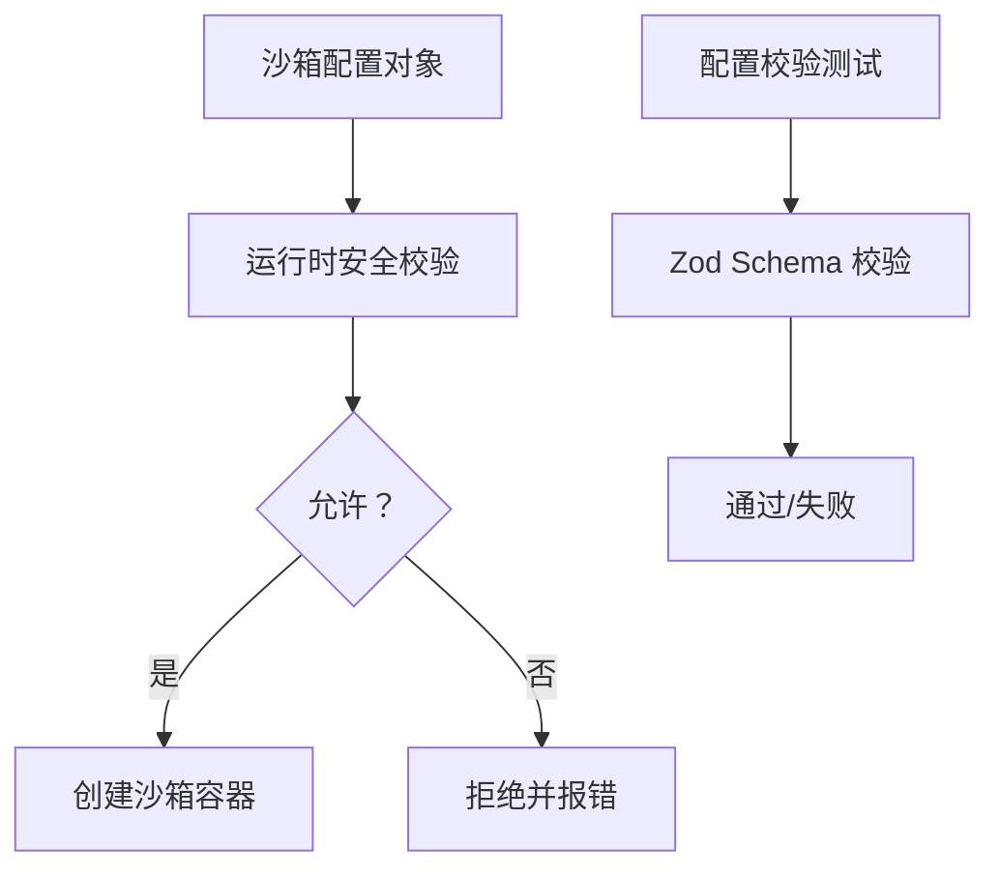
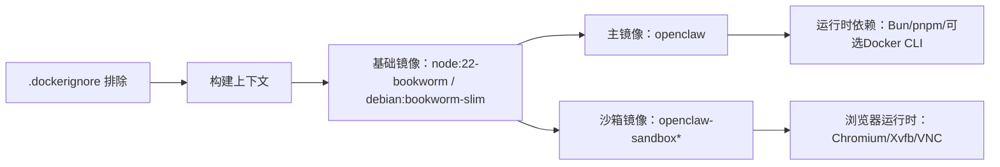

# 容器化沙箱

<cite>
**本文引用的文件**
- [Dockerfile](file://Dockerfile)
- [Dockerfile.sandbox](file://Dockerfile.sandbox)
- [Dockerfile.sandbox-browser](file://Dockerfile.sandbox-browser)
- [Dockerfile.sandbox-common](file://Dockerfile.sandbox-common)
- [docker-compose.yml](file://docker-compose.yml)
- [.dockerignore](file://.dockerignore)
- [docker-setup.sh](file://docker-setup.sh)
- [openclaw.podman.env](file://openclaw.podman.env)
- [scripts/podman/openclaw.container.in](file://scripts/podman/openclaw.container.in)
- [scripts/sandbox-browser-entrypoint.sh](file://scripts/sandbox-browser-entrypoint.sh)
- [scripts/sandbox-setup.sh](file://scripts/sandbox-setup.sh)
- [scripts/sandbox-common-setup.sh](file://scripts/sandbox-common-setup.sh)
- [docs/gateway/sandboxing.md](file://docs/gateway/sandboxing.md)
- [docs/cli/sandbox.md](file://docs/cli/sandbox.md)
- [src/agents/sandbox/docker.ts](file://src/agents/sandbox/docker.ts)
- [src/config/config.sandbox-docker.test.ts](file://src/config/config.sandbox-docker.test.ts)
</cite>

## 目录
1. [简介](#简介)
2. [项目结构](#项目结构)
3. [核心组件](#核心组件)
4. [架构总览](#架构总览)
5. [组件详解](#组件详解)
6. [依赖关系分析](#依赖关系分析)
7. [性能与资源优化](#性能与资源优化)
8. [故障排查指南](#故障排查指南)
9. [结论](#结论)
10. [附录](#附录)

## 简介
本文件面向OpenClaw的容器化沙箱系统，系统性阐述Docker镜像构建、镜像分层与依赖管理、容器生命周期与编排、网络隔离与存储卷挂载、资源限制与安全加固、健康检查与故障恢复策略，并提供可操作的最佳实践与性能优化建议。读者无需深入技术背景即可理解并落地使用。

## 项目结构
围绕容器化与沙箱的关键文件组织如下：
- 镜像定义：根镜像与多阶段构建、沙箱基础镜像与浏览器镜像、通用工具镜像
- 编排与运行：Compose服务定义、环境变量与挂载、启动脚本
- 沙箱执行：浏览器容器入口脚本、沙箱镜像构建脚本、CLI沙箱管理命令
- 文档与测试：沙箱功能说明、CLI命令参考、安全校验测试

**图表来源**
- [Dockerfile](file://Dockerfile#L1-L155)
- [Dockerfile.sandbox](file://Dockerfile.sandbox#L1-L21)
- [Dockerfile.sandbox-common](file://Dockerfile.sandbox-common#L1-L46)
- [Dockerfile.sandbox-browser](file://Dockerfile.sandbox-browser#L1-L33)
- [docker-compose.yml](file://docker-compose.yml#L1-L77)
- [.dockerignore](file://.dockerignore#L1-L65)
- [docker-setup.sh](file://docker-setup.sh#L1-L574)
- [scripts/sandbox-browser-entrypoint.sh](file://scripts/sandbox-browser-entrypoint.sh#L1-L128)
- [scripts/sandbox-setup.sh](file://scripts/sandbox-setup.sh#L1-L8)
- [scripts/sandbox-common-setup.sh](file://scripts/sandbox-common-setup.sh#L1-L41)
- [docs/gateway/sandboxing.md](file://docs/gateway/sandboxing.md#L1-L260)
- [docs/cli/sandbox.md](file://docs/cli/sandbox.md#L1-L153)
- [src/agents/sandbox/docker.ts](file://src/agents/sandbox/docker.ts#L315-L341)
- [src/config/config.sandbox-docker.test.ts](file://src/config/config.sandbox-docker.test.ts#L136-L180)

**章节来源**
- [Dockerfile](file://Dockerfile#L1-L155)
- [docker-compose.yml](file://docker-compose.yml#L1-L77)
- [.dockerignore](file://.dockerignore#L1-L65)
- [docker-setup.sh](file://docker-setup.sh#L1-L574)
- [scripts/sandbox-setup.sh](file://scripts/sandbox-setup.sh#L1-L8)
- [scripts/sandbox-common-setup.sh](file://scripts/sandbox-common-setup.sh#L1-L41)
- [scripts/sandbox-browser-entrypoint.sh](file://scripts/sandbox-browser-entrypoint.sh#L1-L128)
- [docs/gateway/sandboxing.md](file://docs/gateway/sandboxing.md#L1-L260)
- [docs/cli/sandbox.md](file://docs/cli/sandbox.md#L1-L153)
- [src/agents/sandbox/docker.ts](file://src/agents/sandbox/docker.ts#L315-L341)
- [src/config/config.sandbox-docker.test.ts](file://src/config/config.sandbox-docker.test.ts#L136-L180)

## 核心组件
- 主应用镜像（Gateway）：基于Node官方镜像，安装Bun与包管理器，构建产物，暴露健康检查端点，以非root用户运行，支持可选安装Docker CLI用于沙箱容器管理。
- 沙箱镜像族：
  - 基础沙箱镜像：最小工具集，供通用任务使用。
  - 通用沙箱镜像：预装常用开发工具链与包管理器，适合需要运行脚本或工具的场景。
  - 沙箱浏览器镜像：内置Chromium与VNC/无头访问能力，提供CDP与noVNC服务。
- Compose编排：定义网关与CLI服务，支持端口映射、卷挂载、健康检查、重启策略等。
- 启动与沙箱启用脚本：自动构建镜像、写入环境、挂载Docker Socket、设置沙箱策略并重启服务。
- 沙箱执行入口：浏览器容器通过入口脚本配置Xvfb、Chromium、CDP转发、VNC/noVNC服务。
- 文档与CLI：沙箱功能说明、CLI命令参考；后端对沙箱参数进行安全校验与配置验证。

**章节来源**
- [Dockerfile](file://Dockerfile#L1-L155)
- [Dockerfile.sandbox](file://Dockerfile.sandbox#L1-L21)
- [Dockerfile.sandbox-common](file://Dockerfile.sandbox-common#L1-L46)
- [Dockerfile.sandbox-browser](file://Dockerfile.sandbox-browser#L1-L33)
- [docker-compose.yml](file://docker-compose.yml#L1-L77)
- [docker-setup.sh](file://docker-setup.sh#L1-L574)
- [scripts/sandbox-browser-entrypoint.sh](file://scripts/sandbox-browser-entrypoint.sh#L1-L128)
- [docs/gateway/sandboxing.md](file://docs/gateway/sandboxing.md#L1-L260)
- [docs/cli/sandbox.md](file://docs/cli/sandbox.md#L1-L153)

## 架构总览
下图展示容器化沙箱的整体架构：Gateway在宿主机上运行，沙箱容器按会话/代理粒度隔离执行工具；浏览器沙箱通过专用网络与CDP/noVNC对外提供可视化调试能力；Docker Socket可选挂载以支持在容器内创建沙箱容器。

**图表来源**
- [docker-compose.yml](file://docker-compose.yml#L1-L77)
- [Dockerfile.sandbox-browser](file://Dockerfile.sandbox-browser#L1-L33)
- [docs/gateway/sandboxing.md](file://docs/gateway/sandboxing.md#L142-L198)

**章节来源**
- [docker-compose.yml](file://docker-compose.yml#L1-L77)
- [docs/gateway/sandboxing.md](file://docs/gateway/sandboxing.md#L142-L198)

## 组件详解

### 主应用镜像（Gateway）
- 分层与依赖管理
  - 多阶段构建：先提取扩展依赖清单，再进行完整构建，避免无关源码变更导致缓存失效。
  - 可选安装Chromium与Xvfb，减少容器启动时Playwright安装开销。
  - 可选安装Docker CLI，便于在容器内管理沙箱容器。
- 安全与运行时
  - 非root用户运行，降低逃逸风险。
  - 健康检查端点：/healthz（存活）、/readyz（就绪），别名 /health、/ready。
- 构建参数
  - OPENCLAW_EXTENSIONS：按需注入扩展依赖。
  - OPENCLAW_DOCKER_APT_PACKAGES：按需安装系统依赖。
  - OPENCLAW_INSTALL_BROWSER：是否预装浏览器。
  - OPENCLAW_INSTALL_DOCKER_CLI：是否安装Docker CLI。

**图表来源**
- [Dockerfile](file://Dockerfile#L1-L155)

**章节来源**
- [Dockerfile](file://Dockerfile#L1-L155)

### 沙箱镜像族
- 基础沙箱镜像
  - 最小工具集，适合轻量任务。
- 通用沙箱镜像
  - 预装常用工具链与包管理器，适合需要运行脚本或工具的场景。
- 沙箱浏览器镜像
  - 内置Chromium与VNC/无头访问能力，提供CDP与noVNC服务，暴露端口用于远程调试。

**图表来源**
- [Dockerfile.sandbox](file://Dockerfile.sandbox#L1-L21)
- [Dockerfile.sandbox-common](file://Dockerfile.sandbox-common#L1-L46)
- [Dockerfile.sandbox-browser](file://Dockerfile.sandbox-browser#L1-L33)

**章节来源**
- [Dockerfile.sandbox](file://Dockerfile.sandbox#L1-L21)
- [Dockerfile.sandbox-common](file://Dockerfile.sandbox-common#L1-L46)
- [Dockerfile.sandbox-browser](file://Dockerfile.sandbox-browser#L1-L33)

### Compose编排与运行
- 服务定义
  - openclaw-gateway：端口映射、卷挂载、健康检查、重启策略、命令行参数。
  - openclaw-cli：共享网络、能力降级、安全选项、卷挂载、TTY与交互。
- 环境变量
  - 支持从宿主机读取令牌、桥接端口、绑定模式等。
- 沙箱启用（可选）
  - 通过挂载Docker Socket与group_add，使Gateway具备在容器内创建沙箱容器的能力。

**图表来源**
- [docker-setup.sh](file://docker-setup.sh#L1-L574)
- [docker-compose.yml](file://docker-compose.yml#L1-L77)

**章节来源**
- [docker-compose.yml](file://docker-compose.yml#L1-L77)
- [docker-setup.sh](file://docker-setup.sh#L1-L574)

### 浏览器沙箱容器
- 入口脚本职责
  - 配置DISPLAY、用户数据目录、CDP端口派生规则。
  - 启动Xvfb与Chromium，按需禁用GPU/扩展，限制渲染进程数。
  - 通过socat将CDP端口映射到宿主，按需开启VNC与noVNC。
- 端口暴露
  - CDP端口、VNC端口、noVNC端口可通过环境变量控制。

**图表来源**
- [scripts/sandbox-browser-entrypoint.sh](file://scripts/sandbox-browser-entrypoint.sh#L1-L128)
- [Dockerfile.sandbox-browser](file://Dockerfile.sandbox-browser#L1-L33)

**章节来源**
- [scripts/sandbox-browser-entrypoint.sh](file://scripts/sandbox-browser-entrypoint.sh#L1-L128)
- [Dockerfile.sandbox-browser](file://Dockerfile.sandbox-browser#L1-L33)

### 沙箱镜像构建脚本
- 基础镜像构建：一键生成openclaw-sandbox:bookworm-slim。
- 通用镜像构建：按参数选择安装pnpm/bun/homebrew，指定最终用户，生成openclaw-sandbox-common:bookworm-slim。

**图表来源**
- [scripts/sandbox-setup.sh](file://scripts/sandbox-setup.sh#L1-L8)
- [scripts/sandbox-common-setup.sh](file://scripts/sandbox-common-setup.sh#L1-L41)

**章节来源**
- [scripts/sandbox-setup.sh](file://scripts/sandbox-setup.sh#L1-L8)
- [scripts/sandbox-common-setup.sh](file://scripts/sandbox-common-setup.sh#L1-L41)

### 沙箱功能与安全策略
- 功能范围
  - 工具执行、可选沙箱浏览器（CDP可达、专用网络、noVNC保护）。
  - 不在沙箱内的组件：Gateway进程、明确允许在宿主执行的工具。
- 策略维度
  - 模式：off/non-main/all；作用时机。
  - 作用域：session/agent/shared；容器数量。
  - 工作区访问：none/ro/rw；入站媒体复制与技能镜像。
- 安全边界
  - 默认无网络；禁止host网络与容器命名空间join；危险绑定源阻断。
  - 可通过配置项放宽但需自担风险。

**图表来源**
- [docs/gateway/sandboxing.md](file://docs/gateway/sandboxing.md#L1-L260)

**章节来源**
- [docs/gateway/sandboxing.md](file://docs/gateway/sandboxing.md#L1-L260)

### 后端安全校验与配置验证
- 运行时安全校验：对沙箱创建参数进行安全约束（绑定源、网络模式、命名空间join等）。
- 配置Schema校验：拒绝不安全的Seccomp/AppArmor配置、校验绑定数组格式等。

**图表来源**
- [src/agents/sandbox/docker.ts](file://src/agents/sandbox/docker.ts#L315-L341)
- [src/config/config.sandbox-docker.test.ts](file://src/config/config.sandbox-docker.test.ts#L136-L180)

**章节来源**
- [src/agents/sandbox/docker.ts](file://src/agents/sandbox/docker.ts#L315-L341)
- [src/config/config.sandbox-docker.test.ts](file://src/config/config.sandbox-docker.test.ts#L136-L180)

## 依赖关系分析
- 构建上下文与排除
  - .dockerignore排除大体积与无关文件，仅保留必要构建产物，缩短构建时间。
- 镜像依赖
  - 主镜像依赖Node官方镜像；沙箱镜像依赖Debian Slim；浏览器镜像额外依赖Chromium与VNC工具。
- 运行时依赖
  - Gateway可选安装Docker CLI以便在容器内管理沙箱；沙箱浏览器容器依赖Xvfb与Chromium。

**图表来源**
- [.dockerignore](file://.dockerignore#L1-L65)
- [Dockerfile](file://Dockerfile#L1-L155)
- [Dockerfile.sandbox](file://Dockerfile.sandbox#L1-L21)
- [Dockerfile.sandbox-browser](file://Dockerfile.sandbox-browser#L1-L33)

**章节来源**
- [.dockerignore](file://.dockerignore#L1-L65)
- [Dockerfile](file://Dockerfile#L1-L155)
- [Dockerfile.sandbox](file://Dockerfile.sandbox#L1-L21)
- [Dockerfile.sandbox-browser](file://Dockerfile.sandbox-browser#L1-L33)

## 性能与资源优化
- 构建性能
  - 多阶段构建与扩展依赖清单分离，避免无关变更导致缓存失效。
  - 在主镜像中预装浏览器与Xvfb，减少容器启动时的下载与安装时间。
- 运行性能
  - 沙箱默认无网络，降低不必要的出站流量；按需覆盖网络配置。
  - 浏览器沙箱禁用GPU与扩展，减少资源占用；必要时可调整渲染进程限制。
- 资源限制
  - Compose中可结合宿主cgroup与容器运行时策略进行CPU/内存限制（依据实际部署环境配置）。
  - 沙箱容器按会话/代理粒度创建，避免共享容器带来的资源争用。

[本节为通用指导，不直接分析具体文件]

## 故障排查指南
- 健康检查失败
  - 检查Gateway绑定模式与端口映射；确认健康检查路径与端口一致。
- 沙箱无法启动
  - 确认已安装Docker CLI或启用Docker Socket挂载；检查沙箱镜像是否存在；核对沙箱策略配置。
- 浏览器沙箱无法连接
  - 检查CDP端口派生规则与socat转发；确认noVNC密码与端口；验证容器网络与防火墙。
- 权限问题
  - 使用docker-setup.sh修复宿主挂载目录权限；确保容器内node用户可写。
- CLI命令
  - 使用openclaw sandbox命令查看沙箱状态、重建容器、解释生效策略。

**章节来源**
- [docker-compose.yml](file://docker-compose.yml#L1-L77)
- [docker-setup.sh](file://docker-setup.sh#L1-L574)
- [scripts/sandbox-browser-entrypoint.sh](file://scripts/sandbox-browser-entrypoint.sh#L1-L128)
- [docs/cli/sandbox.md](file://docs/cli/sandbox.md#L1-L153)

## 结论
OpenClaw的容器化沙箱体系通过清晰的镜像分层、严格的运行时安全策略与完善的编排与运维脚本，实现了在保证安全性的同时兼顾易用性与可维护性。建议在生产环境中启用沙箱、合理配置网络与绑定、定期重建容器以应用新镜像与策略，并结合健康检查与日志监控实现稳定运行。

[本节为总结性内容，不直接分析具体文件]

## 附录

### 容器网络与存储卷挂载最佳实践
- 网络
  - 默认无网络；若需联网，显式配置网络；避免使用host网络。
  - 沙箱浏览器使用专用网络，减少跨容器影响。
- 存储
  - 使用命名卷或宿主路径挂载配置与工作区；确保权限正确。
  - 沙箱工作区默认隔离于宿主文件系统，必要时按需只读/读写挂载。

**章节来源**
- [docker-compose.yml](file://docker-compose.yml#L1-L77)
- [docs/gateway/sandboxing.md](file://docs/gateway/sandboxing.md#L142-L198)

### 健康检查与故障恢复
- 健康检查
  - 使用内置探针端点；在Compose中配置合理的间隔、超时与重试。
- 故障恢复
  - 启用unless-stopped或on-failure重启策略；结合日志与指标监控快速定位问题。

**章节来源**
- [Dockerfile](file://Dockerfile#L148-L154)
- [docker-compose.yml](file://docker-compose.yml#L26-L49)

### Podman部署参考
- 环境文件与Quadlet模板
  - 通过环境文件与Podman Quadlet（rootless）实现与Docker一致的运行体验。

**章节来源**
- [openclaw.podman.env](file://openclaw.podman.env#L1-L25)
- [scripts/podman/openclaw.container.in](file://scripts/podman/openclaw.container.in#L1-L29)