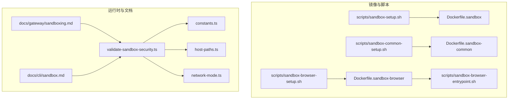
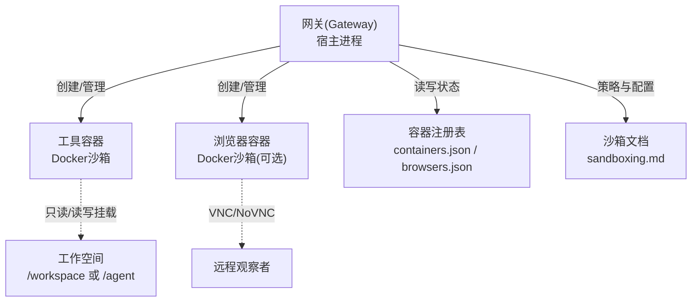
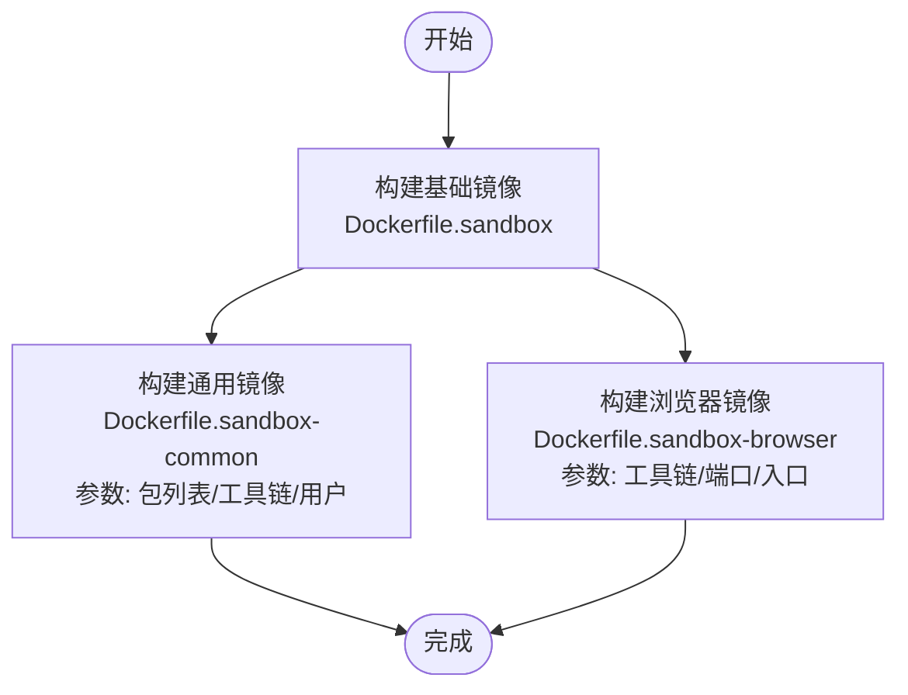
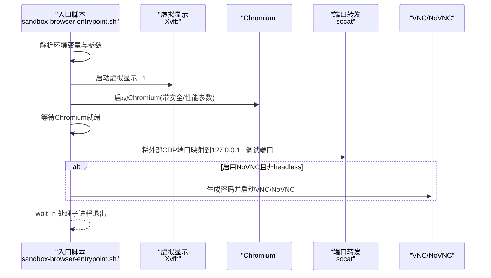
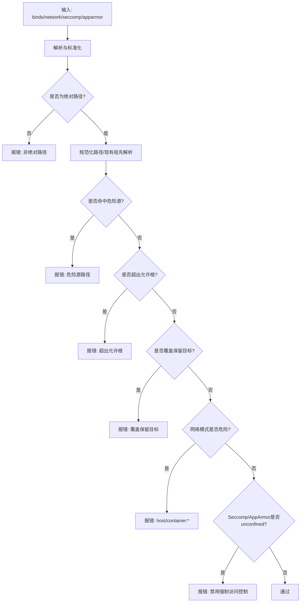
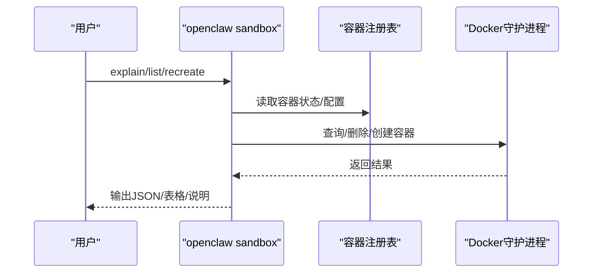
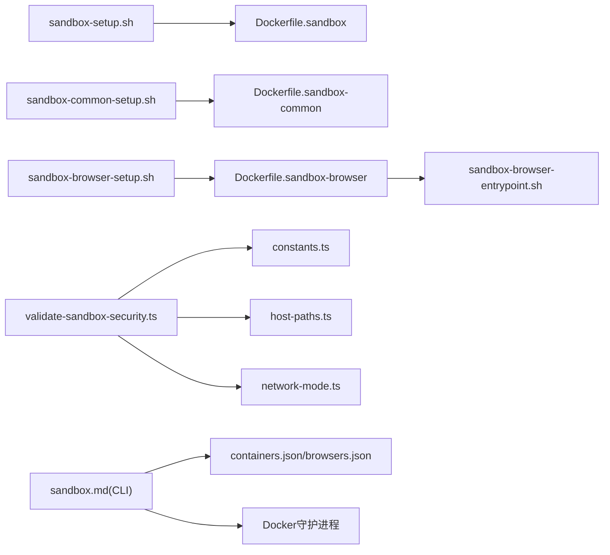

# 沙箱执行

<cite>
**本文引用的文件**
- [Dockerfile.sandbox](file://Dockerfile.sandbox)
- [Dockerfile.sandbox-common](file://Dockerfile.sandbox-common)
- [Dockerfile.sandbox-browser](file://Dockerfile.sandbox-browser)
- [sandbox-setup.sh](file://scripts/sandbox-setup.sh)
- [sandbox-common-setup.sh](file://scripts/sandbox-common-setup.sh)
- [sandbox-browser-setup.sh](file://scripts/sandbox-browser-setup.sh)
- [sandbox-browser-entrypoint.sh](file://scripts/sandbox-browser-entrypoint.sh)
- [sandboxing.md](file://docs/gateway/sandboxing.md)
- [sandbox.md](file://docs/cli/sandbox.md)
- [validate-sandbox-security.ts](file://src/agents/sandbox/validate-sandbox-security.ts)
- [constants.ts](file://src/agents/sandbox/constants.ts)
- [host-paths.ts](file://src/agents/sandbox/host-paths.ts)
- [network-mode.ts](file://src/agents/sandbox/network-mode.ts)
</cite>

## 目录
1. [简介](#简介)
2. [项目结构](#项目结构)
3. [核心组件](#核心组件)
4. [架构总览](#架构总览)
5. [详细组件分析](#详细组件分析)
6. [依赖关系分析](#依赖关系分析)
7. [性能考量](#性能考量)
8. [故障排查指南](#故障排查指南)
9. [结论](#结论)
10. [附录](#附录)

## 简介
本文件面向OpenClaw的沙箱执行系统，系统性阐述容器化沙箱、进程隔离机制、资源限制与安全策略；详解Docker沙箱配置、文件系统隔离、网络访问控制与系统调用过滤；并覆盖沙箱生命周期管理、性能监控与故障恢复建议。同时提供配置模板、安全基线与合规性检查清单，确保在容器安全与进程隔离方面遵循最佳实践。

## 项目结构
围绕沙箱执行的关键文件与目录如下：
- Docker镜像构建：Dockerfile.sandbox、Dockerfile.sandbox-common、Dockerfile.sandbox-browser
- 镜像构建脚本：scripts/sandbox-setup.sh、scripts/sandbox-common-setup.sh、scripts/sandbox-browser-setup.sh
- 浏览器沙箱入口：scripts/sandbox-browser-entrypoint.sh
- 文档：docs/gateway/sandboxing.md（沙箱总体说明）、docs/cli/sandbox.md（CLI命令）
- 运行时安全校验：src/agents/sandbox/validate-sandbox-security.ts、constants.ts、host-paths.ts、network-mode.ts

图表来源
- [Dockerfile.sandbox](file://Dockerfile.sandbox#L1-L21)
- [Dockerfile.sandbox-common](file://Dockerfile.sandbox-common#L1-L46)
- [Dockerfile.sandbox-browser](file://Dockerfile.sandbox-browser#L1-L33)
- [sandbox-setup.sh](file://scripts/sandbox-setup.sh#L1-L8)
- [sandbox-common-setup.sh](file://scripts/sandbox-common-setup.sh#L1-L41)
- [sandbox-browser-setup.sh](file://scripts/sandbox-browser-setup.sh#L1-L8)
- [sandbox-browser-entrypoint.sh](file://scripts/sandbox-browser-entrypoint.sh#L1-L128)
- [validate-sandbox-security.ts](file://src/agents/sandbox/validate-sandbox-security.ts#L1-L344)
- [constants.ts](file://src/agents/sandbox/constants.ts#L1-L55)
- [host-paths.ts](file://src/agents/sandbox/host-paths.ts#L1-L44)
- [network-mode.ts](file://src/agents/sandbox/network-mode.ts#L1-L29)
- [sandboxing.md](file://docs/gateway/sandboxing.md#L1-L260)
- [sandbox.md](file://docs/cli/sandbox.md#L1-L153)

章节来源
- [Dockerfile.sandbox](file://Dockerfile.sandbox#L1-L21)
- [Dockerfile.sandbox-common](file://Dockerfile.sandbox-common#L1-L46)
- [Dockerfile.sandbox-browser](file://Dockerfile.sandbox-browser#L1-L33)
- [sandbox-setup.sh](file://scripts/sandbox-setup.sh#L1-L8)
- [sandbox-common-setup.sh](file://scripts/sandbox-common-setup.sh#L1-L41)
- [sandbox-browser-setup.sh](file://scripts/sandbox-browser-setup.sh#L1-L8)
- [sandbox-browser-entrypoint.sh](file://scripts/sandbox-browser-entrypoint.sh#L1-L128)
- [sandboxing.md](file://docs/gateway/sandboxing.md#L1-L260)
- [sandbox.md](file://docs/cli/sandbox.md#L1-L153)
- [validate-sandbox-security.ts](file://src/agents/sandbox/validate-sandbox-security.ts#L1-L344)
- [constants.ts](file://src/agents/sandbox/constants.ts#L1-L55)
- [host-paths.ts](file://src/agents/sandbox/host-paths.ts#L1-L44)
- [network-mode.ts](file://src/agents/sandbox/network-mode.ts#L1-L29)

## 核心组件
- 基础沙箱镜像：最小化Debian Slim，预装基础工具与非特权用户，作为默认运行环境。
- 通用沙箱镜像：在基础镜像之上安装常用开发工具链（如Node、Python、Go、Rust、包管理器等），满足多数技能运行需求。
- 浏览器沙箱镜像：内置Chromium、VNC/NoVNC、Xvfb等，提供可远程观测的无头/有头浏览器环境，并暴露调试端口。
- 安全校验模块：对绑定挂载、网络模式、Seccomp/AppArmor等进行强制校验，阻断高危配置。
- CLI管理：提供沙箱解释、列表、重建等命令，便于运维与排障。
- 默认常量与策略：定义工作空间根路径、镜像名、容器前缀、默认端口、默认工具白名单/黑名单等。

章节来源
- [Dockerfile.sandbox](file://Dockerfile.sandbox#L1-L21)
- [Dockerfile.sandbox-common](file://Dockerfile.sandbox-common#L1-L46)
- [Dockerfile.sandbox-browser](file://Dockerfile.sandbox-browser#L1-L33)
- [validate-sandbox-security.ts](file://src/agents/sandbox/validate-sandbox-security.ts#L1-L344)
- [constants.ts](file://src/agents/sandbox/constants.ts#L1-L55)
- [sandboxing.md](file://docs/gateway/sandboxing.md#L1-L260)
- [sandbox.md](file://docs/cli/sandbox.md#L1-L153)

## 架构总览
下图展示OpenClaw在启用沙箱时的整体执行流：网关驻留宿主，工具执行在容器中；浏览器工具可选地通过专用浏览器容器提供远程调试与可视化能力。

图表来源
- [sandboxing.md](file://docs/gateway/sandboxing.md#L10-L37)
- [constants.ts](file://src/agents/sandbox/constants.ts#L50-L55)
- [sandbox.md](file://docs/cli/sandbox.md#L12-L14)

## 详细组件分析

### 组件A：Docker沙箱镜像与构建流程
- 基础镜像（Dockerfile.sandbox）：最小化Debian Slim，安装必要工具，创建非特权用户，设置默认命令为长存活进程，避免容器退出。
- 通用镜像（Dockerfile.sandbox-common）：在基础镜像上安装Node、Python、Go、Rust、包管理器、brew等，支持多语言运行时与常见工具。
- 浏览器镜像（Dockerfile.sandbox-browser）：在基础镜像上安装Chromium、VNC/NoVNC、Xvfb等，暴露调试端口，提供远程可视化能力。
- 构建脚本：分别构建三类镜像，支持参数化定制（如安装pnpm/bun、Linuxbrew路径、最终用户等）。

图表来源
- [Dockerfile.sandbox](file://Dockerfile.sandbox#L1-L21)
- [Dockerfile.sandbox-common](file://Dockerfile.sandbox-common#L1-L46)
- [Dockerfile.sandbox-browser](file://Dockerfile.sandbox-browser#L1-L33)
- [sandbox-setup.sh](file://scripts/sandbox-setup.sh#L1-L8)
- [sandbox-common-setup.sh](file://scripts/sandbox-common-setup.sh#L1-L41)
- [sandbox-browser-setup.sh](file://scripts/sandbox-browser-setup.sh#L1-L8)

章节来源
- [Dockerfile.sandbox](file://Dockerfile.sandbox#L1-L21)
- [Dockerfile.sandbox-common](file://Dockerfile.sandbox-common#L1-L46)
- [Dockerfile.sandbox-browser](file://Dockerfile.sandbox-browser#L1-L33)
- [sandbox-setup.sh](file://scripts/sandbox-setup.sh#L1-L8)
- [sandbox-common-setup.sh](file://scripts/sandbox-common-setup.sh#L1-L41)
- [sandbox-browser-setup.sh](file://scripts/sandbox-browser-setup.sh#L1-L8)

### 组件B：浏览器沙箱入口与启动参数
- 入口脚本（sandbox-browser-entrypoint.sh）负责：
  - 设置显示与用户数据目录（使用/tmp隔离用户数据）。
  - 解析并去重Chromium启动参数，应用安全与性能相关标志。
  - 可选禁用GPU/扩展/3D渲染以降低风险与资源消耗。
  - 通过socat将外部CDP端口映射到容器内Chromium调试端口。
  - 在启用NoVNC时生成随机密码并启动VNC/NoVNC服务。
  - 等待Chromium就绪后保持前台运行，处理子进程退出。

图表来源
- [sandbox-browser-entrypoint.sh](file://scripts/sandbox-browser-entrypoint.sh#L1-L128)

章节来源
- [sandbox-browser-entrypoint.sh](file://scripts/sandbox-browser-entrypoint.sh#L1-L128)
- [sandboxing.md](file://docs/gateway/sandboxing.md#L142-L184)

### 组件C：运行时安全校验（绑定挂载、网络、系统调用）
- 绑定挂载校验：
  - 阻止危险源路径（如/etc、/proc、/sys、/dev、/root、/boot、/run*、docker套接字等）进入容器。
  - 要求绝对路径，禁止相对路径或卷名，避免不可控解析。
  - 支持允许根目录白名单，结合“现有祖先解析”防止符号链接逃逸。
  - 禁止覆盖保留目标路径（如/workspace、/agent）。
- 网络模式校验：
  - 默认阻止host网络与容器命名空间加入（container:*），除非显式允许。
- 系统调用与强制访问控制：
  - 明确阻断unconfined的Seccomp/AppArmor配置，要求使用自定义策略文件或禁用。
- 错误信息格式化：针对不同违规类型输出清晰提示，指导修复。

图表来源
- [validate-sandbox-security.ts](file://src/agents/sandbox/validate-sandbox-security.ts#L96-L281)
- [network-mode.ts](file://src/agents/sandbox/network-mode.ts#L8-L23)

章节来源
- [validate-sandbox-security.ts](file://src/agents/sandbox/validate-sandbox-security.ts#L1-L344)
- [host-paths.ts](file://src/agents/sandbox/host-paths.ts#L1-L44)
- [network-mode.ts](file://src/agents/sandbox/network-mode.ts#L1-L29)

### 组件D：CLI生命周期管理
- openclaw sandbox explain：查看生效的沙箱模式、作用域、工作空间访问、工具策略与提升开关。
- openclaw sandbox list：列出所有沙箱容器及其状态、年龄、空闲时间、关联会话/代理。
- openclaw sandbox recreate：按会话/代理/浏览器范围重建容器，强制应用新镜像与配置。
- 配置位置：~/.openclaw/openclaw.json 中的 agents.defaults.sandbox 与 agents.list[].sandbox。

图表来源
- [sandbox.md](file://docs/cli/sandbox.md#L18-L121)

章节来源
- [sandbox.md](file://docs/cli/sandbox.md#L1-L153)

### 组件E：默认常量与策略
- 默认工作空间根路径、镜像名、容器前缀、默认工作目录、闲置与最大存活时间。
- 默认工具白名单（exec、process、read、write、edit、apply_patch、图像、会话相关等）。
- 默认工具黑名单（browser、canvas、nodes、cron、gateway及各渠道）。
- 浏览器默认镜像、网络、端口、自动启动超时、安全哈希版本。
- 挂载点约定：/agent（只读工作空间）、/workspace（读写工作空间）。

章节来源
- [constants.ts](file://src/agents/sandbox/constants.ts#L1-L55)
- [sandboxing.md](file://docs/gateway/sandboxing.md#L57-L70)

## 依赖关系分析
- 构建脚本依赖对应Dockerfile；浏览器镜像依赖入口脚本。
- 运行时安全校验依赖常量与路径解析模块，用于拒绝高危配置。
- CLI命令依赖容器注册表与Docker守护进程交互。
- 文档为配置与行为提供权威参考。

图表来源
- [sandbox-setup.sh](file://scripts/sandbox-setup.sh#L1-L8)
- [sandbox-common-setup.sh](file://scripts/sandbox-common-setup.sh#L1-L41)
- [sandbox-browser-setup.sh](file://scripts/sandbox-browser-setup.sh#L1-L8)
- [Dockerfile.sandbox](file://Dockerfile.sandbox#L1-L21)
- [Dockerfile.sandbox-common](file://Dockerfile.sandbox-common#L1-L46)
- [Dockerfile.sandbox-browser](file://Dockerfile.sandbox-browser#L1-L33)
- [sandbox-browser-entrypoint.sh](file://scripts/sandbox-browser-entrypoint.sh#L1-L128)
- [validate-sandbox-security.ts](file://src/agents/sandbox/validate-sandbox-security.ts#L1-L344)
- [constants.ts](file://src/agents/sandbox/constants.ts#L1-L55)
- [host-paths.ts](file://src/agents/sandbox/host-paths.ts#L1-L44)
- [network-mode.ts](file://src/agents/sandbox/network-mode.ts#L1-L29)
- [sandbox.md](file://docs/cli/sandbox.md#L1-L153)

章节来源
- [sandboxing.md](file://docs/gateway/sandboxing.md#L1-L260)
- [sandbox.md](file://docs/cli/sandbox.md#L1-L153)

## 性能考量
- 容器镜像层与工具链选择：通用镜像包含多种运行时，可减少容器内安装开销，但会增加镜像体积与拉取时间；按需选择基础镜像或通用镜像。
- 浏览器容器的图形与网络参数：禁用GPU/扩展/3D渲染可降低资源占用；仅在需要时开启NoVNC，避免额外网络与CPU开销。
- 端口映射与CDP：通过socat进行本地回环转发，减少不必要的外向连接。
- 工作空间挂载：只读挂载可减少写放大与同步成本；读写挂载需注意I/O与快照一致性。
- 自动清理：合理设置闲置与最大存活时间，平衡资源占用与热启动延迟。

## 故障排查指南
- 镜像缺失或版本不匹配
  - 现象：容器无法启动或行为异常。
  - 排查：确认镜像存在并版本正确；使用构建脚本重新构建。
  - 参考：构建脚本与文档中的镜像说明。
- 绑定挂载被拒绝
  - 现象：创建容器时报错，提示危险源/非绝对路径/超出允许根/覆盖保留目标。
  - 排查：检查binds格式与路径；确保使用绝对路径；避免挂载系统敏感目录；不要覆盖/workspace与/agent。
  - 参考：安全校验模块的错误格式化逻辑。
- 网络模式被阻断
  - 现象：指定host或container:*网络导致失败。
  - 排查：改用bridge或none；如确需容器命名空间加入，使用明确的“危险放行”选项。
  - 参考：网络模式校验逻辑。
- 浏览器容器无法访问/响应
  - 现象：CDP不可达、VNC无画面。
  - 排查：检查端口映射、socat转发、Chromium就绪状态；确认NoVNC密码生成与防火墙；必要时调整图形与扩展参数。
  - 参考：浏览器入口脚本与文档。
- 容器生命周期与重建
  - 现象：更新镜像或配置后旧容器仍在运行。
  - 排查：使用openclaw sandbox recreate按范围重建；或等待自动清理。
  - 参考：CLI命令与自动清理策略。

章节来源
- [sandbox.md](file://docs/cli/sandbox.md#L69-L121)
- [validate-sandbox-security.ts](file://src/agents/sandbox/validate-sandbox-security.ts#L199-L227)
- [network-mode.ts](file://src/agents/sandbox/network-mode.ts#L8-L23)
- [sandbox-browser-entrypoint.sh](file://scripts/sandbox-browser-entrypoint.sh#L96-L128)
- [sandboxing.md](file://docs/gateway/sandboxing.md#L185-L198)

## 结论
OpenClaw的沙箱执行体系通过最小化基础镜像、可选通用工具链与浏览器可视化能力，结合严格的运行时安全校验与CLI生命周期管理，实现了可控的进程隔离与资源边界。遵循本文的安全基线与配置模板，可在保证功能可用的同时最大化安全性与可维护性。

## 附录

### A. 沙箱配置模板（示例片段）
- 最小启用示例（非主会话沙箱化）
  - 参考：文档中的最小启用示例片段。
- 工作空间访问策略
  - none：仅沙箱工作空间。
  - ro：挂载只读工作空间至/agent。
  - rw：挂载读写工作空间至/workspace。
- 绑定挂载示例
  - 使用host:container:mode格式；合并全局与每代理配置；共享作用域忽略每代理绑定。
- 浏览器容器专属绑定
  - 当设置时替换全局绑定；否则回退到全局绑定。
- 网络与安全
  - 默认无网络；可通过配置覆盖；host与container:*默认阻断；可使用危险放行选项。

章节来源
- [sandboxing.md](file://docs/gateway/sandboxing.md#L57-L116)
- [sandboxing.md](file://docs/gateway/sandboxing.md#L117-L198)

### B. 安全基线与合规性检查清单
- 镜像与构建
  - 使用官方最小基础镜像；避免安装无关软件；定期更新镜像。
  - 通用镜像按需安装运行时；避免在容器内做一次性安装（优先预置镜像）。
- 文件系统隔离
  - 严格限制binds绝对路径；禁止挂载系统敏感目录；避免覆盖/workspace与/agent。
  - 对敏感凭据使用只读挂载。
- 网络访问控制
  - 默认无网络；需要时使用bridge或none；禁止host与container:*。
  - 如需容器命名空间加入，必须明确危险放行并评估风险。
- 系统调用与强制访问控制
  - 禁止unconfined的Seccomp/AppArmor；使用自定义策略文件。
- 浏览器容器
  - 禁用GPU/扩展/3D渲染以降低风险；仅在需要时启用NoVNC。
  - 控制渲染进程数量；合理设置CDP端口与来源范围。
- 生命周期与可观测性
  - 合理设置闲置与最大存活时间；使用CLI命令重建容器以应用变更。
  - 记录容器状态与日志，便于审计与排障。

章节来源
- [validate-sandbox-security.ts](file://src/agents/sandbox/validate-sandbox-security.ts#L18-L34)
- [network-mode.ts](file://src/agents/sandbox/network-mode.ts#L8-L23)
- [sandboxing.md](file://docs/gateway/sandboxing.md#L185-L198)
- [sandbox.md](file://docs/cli/sandbox.md#L122-L153)