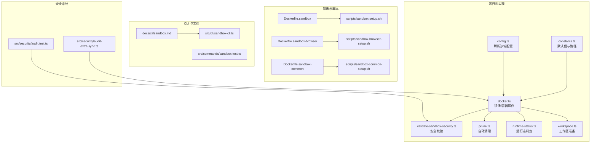
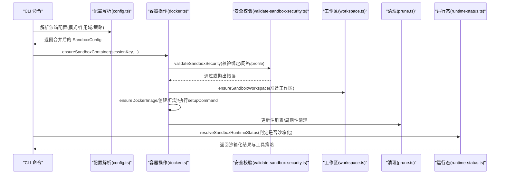
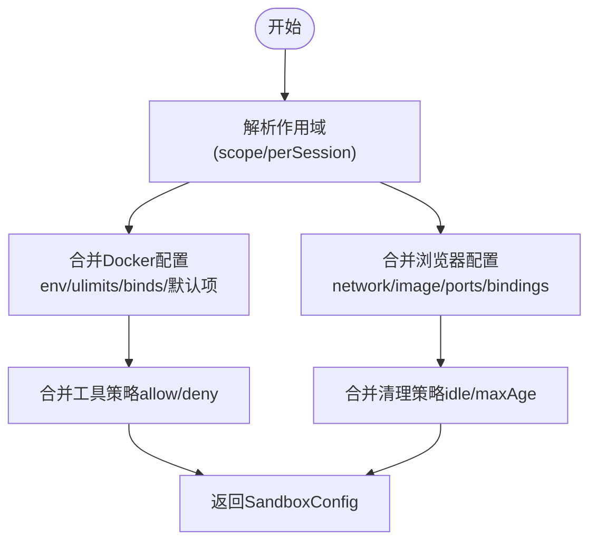
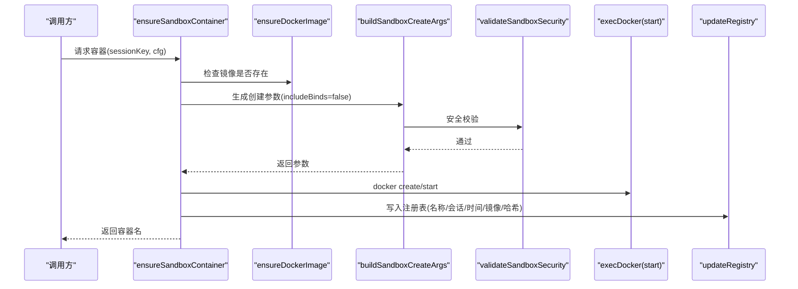
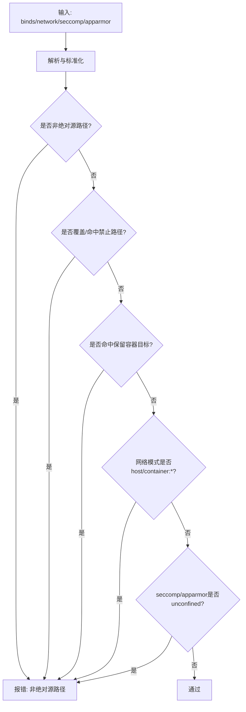
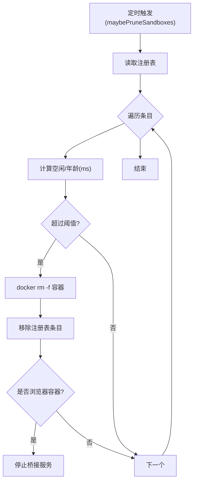
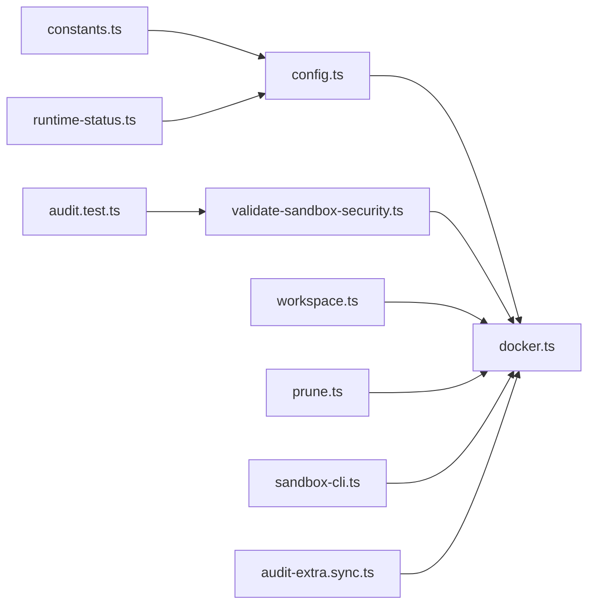
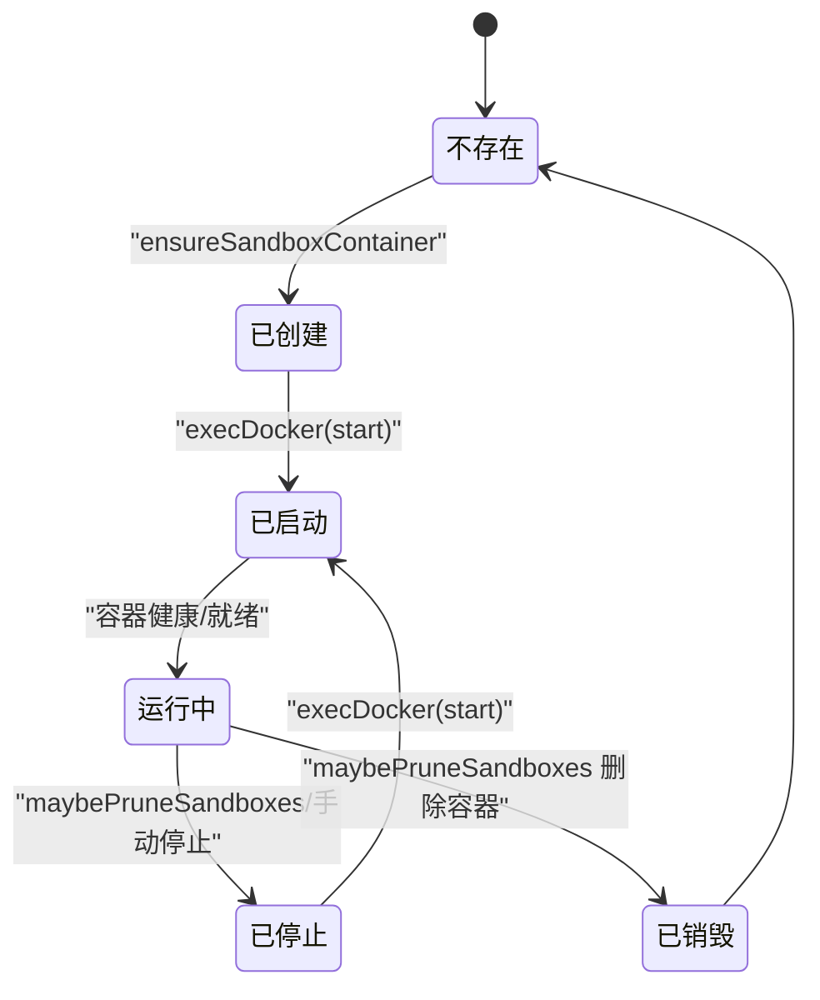

# 沙箱生命周期

<cite>
**本文引用的文件**
- [Dockerfile.sandbox](file://Dockerfile.sandbox)
- [Dockerfile.sandbox-browser](file://Dockerfile.sandbox-browser)
- [Dockerfile.sandbox-common](file://Dockerfile.sandbox-common)
- [scripts/sandbox-setup.sh](file://scripts/sandbox-setup.sh)
- [scripts/sandbox-browser-setup.sh](file://scripts/sandbox-browser-setup.sh)
- [scripts/sandbox-common-setup.sh](file://scripts/sandbox-common-setup.sh)
- [scripts/sandbox-browser-entrypoint.sh](file://scripts/sandbox-browser-entrypoint.sh)
- [docs/cli/sandbox.md](file://docs/cli/sandbox.md)
- [src/agents/sandbox/docker.ts](file://src/agents/sandbox/docker.ts)
- [src/agents/sandbox/config.ts](file://src/agents/sandbox/config.ts)
- [src/agents/sandbox/constants.ts](file://src/agents/sandbox/constants.ts)
- [src/agents/sandbox/prune.ts](file://src/agents/sandbox/prune.ts)
- [src/agents/sandbox/runtime-status.ts](file://src/agents/sandbox/runtime-status.ts)
- [src/agents/sandbox/workspace.ts](file://src/agents/sandbox/workspace.ts)
- [src/agents/sandbox/validate-sandbox-security.ts](file://src/agents/sandbox/validate-sandbox-security.ts)
- [src/agents/sandbox/validate-sandbox-security.test.ts](file://src/agents/sandbox/validate-sandbox-security.test.ts)
- [src/cli/sandbox-cli.ts](file://src/cli/sandbox-cli.ts)
- [src/commands/sandbox.test.ts](file://src/commands/sandbox.test.ts)
- [src/security/audit.test.ts](file://src/security/audit.test.ts)
- [src/security/audit-extra.sync.ts](file://src/security/audit-extra.sync.ts)
</cite>

## 目录
1. [简介](#简介)
2. [项目结构](#项目结构)
3. [核心组件](#核心组件)
4. [架构总览](#架构总览)
5. [详细组件分析](#详细组件分析)
6. [依赖关系分析](#依赖关系分析)
7. [性能考量](#性能考量)
8. [故障排查指南](#故障排查指南)
9. [结论](#结论)
10. [附录](#附录)

## 简介
本文件系统性阐述 OpenClaw 的沙箱生命周期管理，覆盖从创建、启动、运行、暂停到销毁的完整流程；解释状态转换、事件触发与清理机制；说明生命周期钩子、监控指标与故障恢复策略；并提供可复用的生命周期配置模板、自动化管理与运维最佳实践。目标是帮助开发者与运维人员在保证安全隔离的前提下，高效地管理容器化的代理执行环境。

## 项目结构
围绕沙箱生命周期的关键目录与文件如下：
- 镜像构建：Dockerfile.sandbox、Dockerfile.sandbox-browser、Dockerfile.sandbox-common 及其构建脚本
- 运行时实现：agents/sandbox 下的配置解析、镜像与容器操作、安全校验、工作区与清理
- CLI 与文档：CLI 命令与用户文档，指导沙箱容器的列举、重建与解释
- 安全审计：对危险配置的检测与告警

图表来源
- [Dockerfile.sandbox](file://Dockerfile.sandbox#L1-L21)
- [Dockerfile.sandbox-browser](file://Dockerfile.sandbox-browser#L1-L33)
- [Dockerfile.sandbox-common](file://Dockerfile.sandbox-common#L1-L46)
- [scripts/sandbox-setup.sh](file://scripts/sandbox-setup.sh#L1-L8)
- [scripts/sandbox-browser-setup.sh](file://scripts/sandbox-browser-setup.sh#L1-L8)
- [scripts/sandbox-common-setup.sh](file://scripts/sandbox-common-setup.sh#L1-L41)
- [src/agents/sandbox/config.ts](file://src/agents/sandbox/config.ts#L1-L217)
- [src/agents/sandbox/docker.ts](file://src/agents/sandbox/docker.ts#L1-L565)
- [src/agents/sandbox/validate-sandbox-security.ts](file://src/agents/sandbox/validate-sandbox-security.ts#L1-L344)
- [src/agents/sandbox/prune.ts](file://src/agents/sandbox/prune.ts#L1-L113)
- [src/agents/sandbox/runtime-status.ts](file://src/agents/sandbox/runtime-status.ts#L1-L139)
- [src/agents/sandbox/workspace.ts](file://src/agents/sandbox/workspace.ts#L1-L66)
- [src/agents/sandbox/constants.ts](file://src/agents/sandbox/constants.ts#L1-L55)
- [docs/cli/sandbox.md](file://docs/cli/sandbox.md#L1-L153)
- [src/cli/sandbox-cli.ts](file://src/cli/sandbox-cli.ts#L131-L174)
- [src/security/audit.test.ts](file://src/security/audit.test.ts#L1027-L1088)
- [src/security/audit-extra.sync.ts](file://src/security/audit-extra.sync.ts#L928-L965)

章节来源
- [Dockerfile.sandbox](file://Dockerfile.sandbox#L1-L21)
- [Dockerfile.sandbox-browser](file://Dockerfile.sandbox-browser#L1-L33)
- [Dockerfile.sandbox-common](file://Dockerfile.sandbox-common#L1-L46)
- [scripts/sandbox-setup.sh](file://scripts/sandbox-setup.sh#L1-L8)
- [scripts/sandbox-browser-setup.sh](file://scripts/sandbox-browser-setup.sh#L1-L8)
- [scripts/sandbox-common-setup.sh](file://scripts/sandbox-common-setup.sh#L1-L41)
- [docs/cli/sandbox.md](file://docs/cli/sandbox.md#L1-L153)

## 核心组件
- 配置解析与合并：根据全局与代理级配置解析沙箱模式、作用域、Docker 参数、浏览器参数、工具策略与清理策略
- 镜像与容器操作：拉取/存在性检查、构建创建参数、启动、执行初始化命令、更新注册表
- 安全校验：禁止挂载系统关键路径、网络模式 host/container:*、禁用 seccomp/AppArmor 的 unconfined 等
- 工作区准备：按需从种子复制关键文件，确保代理工作区存在
- 自动清理：基于空闲时长与最大存活时间进行周期性清理，并处理浏览器桥接资源
- 运行态判定：根据会话键与主会话键决定是否沙箱化，输出工具策略阻断提示
- CLI 与文档：提供沙箱解释、列举、重建等命令，配套中文文档

章节来源
- [src/agents/sandbox/config.ts](file://src/agents/sandbox/config.ts#L170-L217)
- [src/agents/sandbox/docker.ts](file://src/agents/sandbox/docker.ts#L315-L565)
- [src/agents/sandbox/validate-sandbox-security.ts](file://src/agents/sandbox/validate-sandbox-security.ts#L328-L344)
- [src/agents/sandbox/workspace.ts](file://src/agents/sandbox/workspace.ts#L17-L66)
- [src/agents/sandbox/prune.ts](file://src/agents/sandbox/prune.ts#L87-L113)
- [src/agents/sandbox/runtime-status.ts](file://src/agents/sandbox/runtime-status.ts#L45-L139)
- [src/cli/sandbox-cli.ts](file://src/cli/sandbox-cli.ts#L131-L174)
- [docs/cli/sandbox.md](file://docs/cli/sandbox.md#L1-L153)

## 架构总览
下图展示沙箱生命周期在运行时的关键交互：配置解析、镜像与容器操作、安全校验、工作区准备、清理与运行态判定。

图表来源
- [src/agents/sandbox/config.ts](file://src/agents/sandbox/config.ts#L170-L217)
- [src/agents/sandbox/docker.ts](file://src/agents/sandbox/docker.ts#L489-L565)
- [src/agents/sandbox/validate-sandbox-security.ts](file://src/agents/sandbox/validate-sandbox-security.ts#L328-L344)
- [src/agents/sandbox/workspace.ts](file://src/agents/sandbox/workspace.ts#L17-L66)
- [src/agents/sandbox/prune.ts](file://src/agents/sandbox/prune.ts#L87-L113)
- [src/agents/sandbox/runtime-status.ts](file://src/agents/sandbox/runtime-status.ts#L45-L79)

## 详细组件分析

### 组件一：配置解析与合并（config.ts）
- 作用域解析：支持 off、non-main、all 三种模式；perSession 与 scope 互斥优先级
- Docker 配置合并：环境变量、ulimit、binds 合并；默认只读根文件系统、none 网络、drop 全部能力
- 浏览器配置：独立于 Docker，可覆盖网络、镜像、端口、VNC/noVNC、自动启动等
- 清理策略：空闲小时数与最大存活天数，支持共享作用域覆盖
- 危险开关：允许保留容器目标路径、允许外部绑定源、允许容器命名空间加入（需显式开启）

图表来源
- [src/agents/sandbox/config.ts](file://src/agents/sandbox/config.ts#L63-L217)

章节来源
- [src/agents/sandbox/config.ts](file://src/agents/sandbox/config.ts#L1-L217)

### 组件二：镜像与容器操作（docker.ts）
- 镜像管理：存在性检查、默认镜像拉取与标签化
- 创建参数：构建 docker create 参数，含标签、只读根、tmpfs、网络、用户、能力、安全选项、DNS、主机名、CPU/内存限制、ulimit、绑定挂载等
- 容器生命周期：
  - ensureSandboxContainer：检查容器存在与运行状态，计算配置哈希，必要时重建；启动后执行 setupCommand
  - execDocker/execDockerRaw：封装 docker 子进程调用，支持中断、输入、错误格式化
  - 环境变量清洗：屏蔽敏感变量，记录阻断与警告
- 安全前置：在构建参数前执行 validateSandboxSecurity

图表来源
- [src/agents/sandbox/docker.ts](file://src/agents/sandbox/docker.ts#L435-L565)
- [src/agents/sandbox/validate-sandbox-security.ts](file://src/agents/sandbox/validate-sandbox-security.ts#L328-L344)

章节来源
- [src/agents/sandbox/docker.ts](file://src/agents/sandbox/docker.ts#L1-L565)

### 组件三：安全校验（validate-sandbox-security.ts）
- 禁止路径：/etc、/proc、/sys、/dev、/root、/boot、/run、/var/run、/run/docker.sock 等
- 绑定挂载校验：非绝对路径、越权覆盖系统根、超出允许根、命中保留容器目标路径
- 网络模式：禁止 host 与 container:*（可通过危险开关放行）
- 安全配置：禁止 seccomp/AppArmor 使用 unconfined
- 错误信息：提供清晰的阻断原因与修复建议

图表来源
- [src/agents/sandbox/validate-sandbox-security.ts](file://src/agents/sandbox/validate-sandbox-security.ts#L96-L344)

章节来源
- [src/agents/sandbox/validate-sandbox-security.ts](file://src/agents/sandbox/validate-sandbox-security.ts#L1-L344)
- [src/agents/sandbox/validate-sandbox-security.test.ts](file://src/agents/sandbox/validate-sandbox-security.test.ts#L1-L300)

### 组件四：工作区准备（workspace.ts）
- 递归创建工作区目录
- 可选从种子目录复制关键文件（代理、身份、工具、心跳等），使用边界读取避免越界
- 确保代理引导文件存在

章节来源
- [src/agents/sandbox/workspace.ts](file://src/agents/sandbox/workspace.ts#L17-L66)

### 组件五：自动清理（prune.ts）
- 触发条件：周期性检查（每 5 分钟内最多一次）
- 判定规则：空闲时长超过阈值或创建时间超过最大年龄
- 执行动作：删除容器并移除注册表条目；若为浏览器容器，停止对应桥接服务
- 失败容忍：忽略清理失败，继续后续条目

图表来源
- [src/agents/sandbox/prune.ts](file://src/agents/sandbox/prune.ts#L87-L113)

章节来源
- [src/agents/sandbox/prune.ts](file://src/agents/sandbox/prune.ts#L1-L113)

### 组件六：运行态判定与工具策略（runtime-status.ts）
- 模式判定：off/non-main/all 三种模式，结合主会话键与当前会话键
- 工具策略阻断消息：当工具被拒绝或不在允许列表时，给出明确原因与修复建议（包括切换会话、调整策略、关闭沙箱等）

章节来源
- [src/agents/sandbox/runtime-status.ts](file://src/agents/sandbox/runtime-status.ts#L1-L139)

### 组件七：CLI 与文档（sandbox-cli.ts 与 docs/cli/sandbox.md）
- 命令：explain（解释有效策略）、list（列出容器）、recreate（重建容器）
- 输出：人类可读与 JSON；支持按会话/代理/浏览器过滤
- 文档：配置示例、使用场景、注意事项与最佳实践

章节来源
- [src/cli/sandbox-cli.ts](file://src/cli/sandbox-cli.ts#L131-L174)
- [src/commands/sandbox.test.ts](file://src/commands/sandbox.test.ts#L90-L122)
- [docs/cli/sandbox.md](file://docs/cli/sandbox.md#L1-L153)

### 组件八：镜像与入口脚本（Dockerfile 与脚本）
- 基础镜像：debian bookworm slim，安装 bash、ca-certificates、curl、git、jq、python3、ripgrep 等
- 浏览器镜像：在基础镜像上安装 Chromium、novnc、websockify、x11vnc、xvfb 等
- 通用镜像：在基础镜像上安装 node/npm、pnpm、bun、brew 等工具链
- 入口脚本：浏览器容器启动时设置显示、用户数据目录、远程调试端口、VNC/noVNC、渲染进程限制、沙箱开关等，并通过 socat 暴露 CDP 端口

章节来源
- [Dockerfile.sandbox](file://Dockerfile.sandbox#L1-L21)
- [Dockerfile.sandbox-browser](file://Dockerfile.sandbox-browser#L1-L33)
- [Dockerfile.sandbox-common](file://Dockerfile.sandbox-common#L1-L46)
- [scripts/sandbox-browser-entrypoint.sh](file://scripts/sandbox-browser-entrypoint.sh#L1-L128)
- [scripts/sandbox-setup.sh](file://scripts/sandbox-setup.sh#L1-L8)
- [scripts/sandbox-browser-setup.sh](file://scripts/sandbox-browser-setup.sh#L1-L8)
- [scripts/sandbox-common-setup.sh](file://scripts/sandbox-common-setup.sh#L1-L41)

## 依赖关系分析
- 配置层依赖：config.ts 依赖 constants.ts 中的默认值与常量，依赖 tool-policy 解析工具策略
- 运行时层依赖：docker.ts 依赖 validate-sandbox-security.ts 进行安全前置校验；依赖 registry 与 workspace；prune.ts 依赖 docker.ts 与 registry；runtime-status.ts 依赖 config.ts 与 tool-policy
- CLI 层依赖：sandbox-cli.ts 调用命令实现，命令实现依赖 agents/sandbox 下各模块
- 安全审计：audit.test.ts 与 audit-extra.sync.ts 对危险配置进行检测与告警

图表来源
- [src/agents/sandbox/config.ts](file://src/agents/sandbox/config.ts#L1-L217)
- [src/agents/sandbox/docker.ts](file://src/agents/sandbox/docker.ts#L1-L565)
- [src/agents/sandbox/validate-sandbox-security.ts](file://src/agents/sandbox/validate-sandbox-security.ts#L1-L344)
- [src/agents/sandbox/workspace.ts](file://src/agents/sandbox/workspace.ts#L1-L66)
- [src/agents/sandbox/prune.ts](file://src/agents/sandbox/prune.ts#L1-L113)
- [src/agents/sandbox/runtime-status.ts](file://src/agents/sandbox/runtime-status.ts#L1-L139)
- [src/cli/sandbox-cli.ts](file://src/cli/sandbox-cli.ts#L131-L174)
- [src/security/audit.test.ts](file://src/security/audit.test.ts#L1027-L1088)
- [src/security/audit-extra.sync.ts](file://src/security/audit-extra.sync.ts#L928-L965)

章节来源
- [src/agents/sandbox/docker.ts](file://src/agents/sandbox/docker.ts#L1-L565)
- [src/agents/sandbox/config.ts](file://src/agents/sandbox/config.ts#L1-L217)
- [src/agents/sandbox/validate-sandbox-security.ts](file://src/agents/sandbox/validate-sandbox-security.ts#L1-L344)
- [src/agents/sandbox/prune.ts](file://src/agents/sandbox/prune.ts#L1-L113)
- [src/agents/sandbox/runtime-status.ts](file://src/agents/sandbox/runtime-status.ts#L1-L139)
- [src/cli/sandbox-cli.ts](file://src/cli/sandbox-cli.ts#L131-L174)
- [src/security/audit.test.ts](file://src/security/audit.test.ts#L1027-L1088)
- [src/security/audit-extra.sync.ts](file://src/security/audit-extra.sync.ts#L928-L965)

## 性能考量
- 容器热身窗口：最近使用的容器在配置变更时不会立即删除，而是提示重建，减少频繁重启带来的抖动
- 清理频率：每 5 分钟最多执行一次清理，避免高频 IO
- 端口映射与 CDP：浏览器容器通过 socat 将本地端口映射到容器内调试端口，注意仅在需要时启用且限制来源范围
- 资源限制：通过 CPU/内存/ulimit/pids-limit 控制容器资源占用，防止资源滥用
- 只读根文件系统与 drop 全部能力：降低容器逃逸风险，提升整体安全性

[本节为通用性能讨论，不直接分析具体文件]

## 故障排查指南
- Docker 命令不可用：当 PATH 中缺少 docker 命令时，会抛出明确错误，提示安装 Docker 或关闭沙箱模式
- 镜像不存在：默认镜像不存在时会尝试拉取 debian:bookworm-slim 并打标签；其他镜像需先构建或拉取
- 安全配置阻断：违反安全策略（如挂载 /etc、使用 host 网络、unconfined profile）将抛出错误，需修正配置
- 浏览器 CDP 暴露：若使用 bridge 网络且未限制 CDP 来源范围，审计会给出警告，建议使用专用网络或限制来源
- 容器重建：更新镜像或配置后，使用 CLI 的 recreate 命令强制删除旧容器并在下次使用时重建
- 注册表异常：清理失败会被忽略，不影响后续流程；可通过 CLI list 查看容器状态

章节来源
- [src/agents/sandbox/docker.ts](file://src/agents/sandbox/docker.ts#L114-L124)
- [src/agents/sandbox/docker.ts](file://src/agents/sandbox/docker.ts#L256-L267)
- [src/agents/sandbox/validate-sandbox-security.ts](file://src/agents/sandbox/validate-sandbox-security.ts#L201-L227)
- [src/security/audit-extra.sync.ts](file://src/security/audit-extra.sync.ts#L928-L965)
- [docs/cli/sandbox.md](file://docs/cli/sandbox.md#L47-L121)

## 结论
OpenClaw 的沙箱生命周期以“安全优先、可控可观察”为核心设计原则：通过严格的配置解析与安全校验，结合镜像与容器的生命周期管理、工作区准备与自动清理，形成闭环的容器化执行环境。CLI 提供了便捷的运维工具，配合审计与运行态判定，能够帮助团队在多会话、多代理场景下稳定地管理沙箱容器。

[本节为总结性内容，不直接分析具体文件]

## 附录

### 生命周期状态转换与事件

图表来源
- [src/agents/sandbox/docker.ts](file://src/agents/sandbox/docker.ts#L506-L565)
- [src/agents/sandbox/prune.ts](file://src/agents/sandbox/prune.ts#L87-L113)

### 生命周期钩子与清理机制
- 钩子
  - 创建后：执行 setupCommand（如需要）
  - 启动后：更新注册表（创建/最后使用时间、镜像、配置哈希）
- 清理
  - 定时清理：maybePruneSandboxes
  - 触发条件：空闲时长/最大存活时间
  - 行为：删除容器并移除注册表条目；浏览器容器额外停止桥接服务

章节来源
- [src/agents/sandbox/docker.ts](file://src/agents/sandbox/docker.ts#L469-L471)
- [src/agents/sandbox/docker.ts](file://src/agents/sandbox/docker.ts#L555-L562)
- [src/agents/sandbox/prune.ts](file://src/agents/sandbox/prune.ts#L87-L113)

### 监控指标与可观测性
- 容器状态：存在性、运行中、镜像匹配、年龄、空闲时长
- 注册表：容器名、会话键、创建/最后使用时间、镜像、配置哈希
- 浏览器：CDP/VNC/noVNC 端口、自动启动超时、网络与来源范围
- 审计：危险绑定、网络模式、seccomp/AppArmor 配置告警

章节来源
- [docs/cli/sandbox.md](file://docs/cli/sandbox.md#L29-L70)
- [src/agents/sandbox/prune.ts](file://src/agents/sandbox/prune.ts#L15-L34)
- [src/security/audit.test.ts](file://src/security/audit.test.ts#L1027-L1088)
- [src/security/audit-extra.sync.ts](file://src/security/audit-extra.sync.ts#L928-L965)

### 故障恢复策略
- 配置变更：容器最近使用则提示重建；否则删除后重建
- 镜像缺失：自动拉取默认镜像并打标签
- 安全违规：修正配置后重试
- 清理失败：忽略并继续，等待下次清理

章节来源
- [src/agents/sandbox/docker.ts](file://src/agents/sandbox/docker.ts#L525-L541)
- [src/agents/sandbox/docker.ts](file://src/agents/sandbox/docker.ts#L256-L267)
- [src/agents/sandbox/validate-sandbox-security.ts](file://src/agents/sandbox/validate-sandbox-security.ts#L201-L227)

### 生命周期配置模板
- 全局默认
  - 模式：off/non-main/all
  - 作用域：session/agent/shared
  - Docker：镜像、容器前缀、工作目录、只读根、tmpfs、网络、用户、能力、安全选项、DNS、主机名、资源限制、ulimit、绑定挂载
  - 浏览器：启用、镜像、网络、端口、VNC/noVNC、自动启动、自动启动超时、绑定挂载
  - 工具策略：allow/deny 列表
  - 清理：空闲小时数、最大存活天数
- 代理级覆盖：在 agents.list[].sandbox 下按需覆盖上述字段

章节来源
- [docs/cli/sandbox.md](file://docs/cli/sandbox.md#L122-L146)
- [src/agents/sandbox/config.ts](file://src/agents/sandbox/config.ts#L170-L217)

### 自动化管理与运维最佳实践
- 镜像与脚本
  - 使用 scripts/sandbox-setup.sh、scripts/sandbox-browser-setup.sh、scripts/sandbox-common-setup.sh 构建镜像
  - 通用镜像安装 pnpm/bun 与 Homebrew，便于多语言工具链
- CLI
  - 使用 openclaw sandbox explain/list/recreate 管理容器
  - 在更新镜像或配置后，优先使用 recreate 强制重建，避免旧容器残留
- 安全
  - 避免使用 host 网络与 container:* 命名空间加入
  - 不使用 unconfined seccomp/AppArmor
  - 严格控制绑定挂载路径，避免覆盖系统关键目录
- 监控与审计
  - 定期运行审计检查，关注浏览器 CDP 暴露与危险配置
  - 关注容器空闲与存活时间，合理设置清理阈值

章节来源
- [scripts/sandbox-setup.sh](file://scripts/sandbox-setup.sh#L1-L8)
- [scripts/sandbox-browser-setup.sh](file://scripts/sandbox-browser-setup.sh#L1-L8)
- [scripts/sandbox-common-setup.sh](file://scripts/sandbox-common-setup.sh#L1-L41)
- [docs/cli/sandbox.md](file://docs/cli/sandbox.md#L1-L153)
- [src/security/audit-extra.sync.ts](file://src/security/audit-extra.sync.ts#L928-L965)