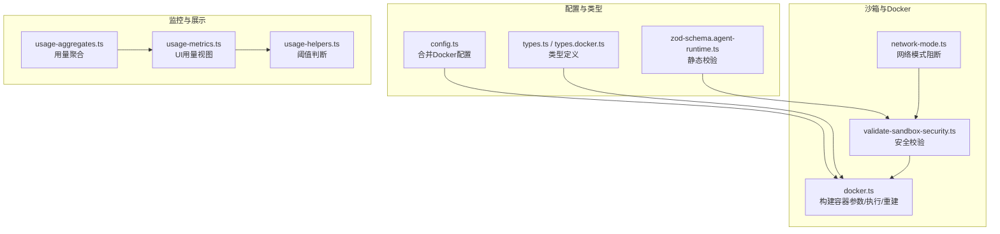
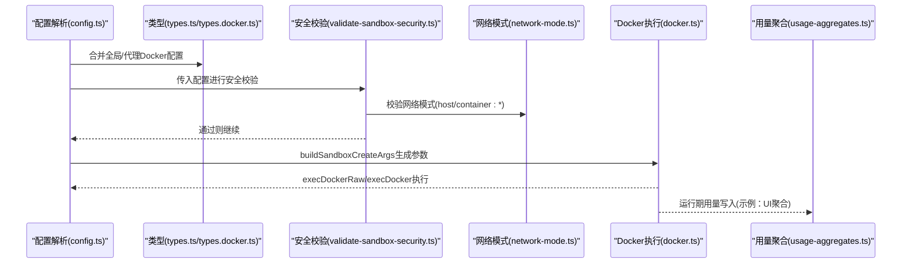
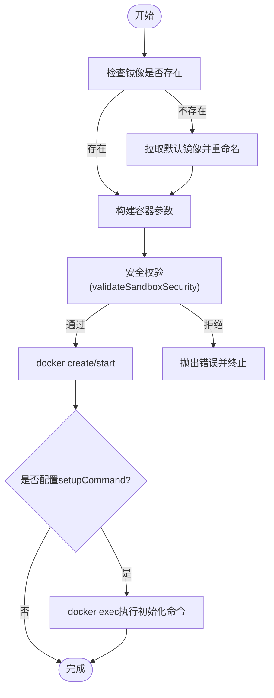
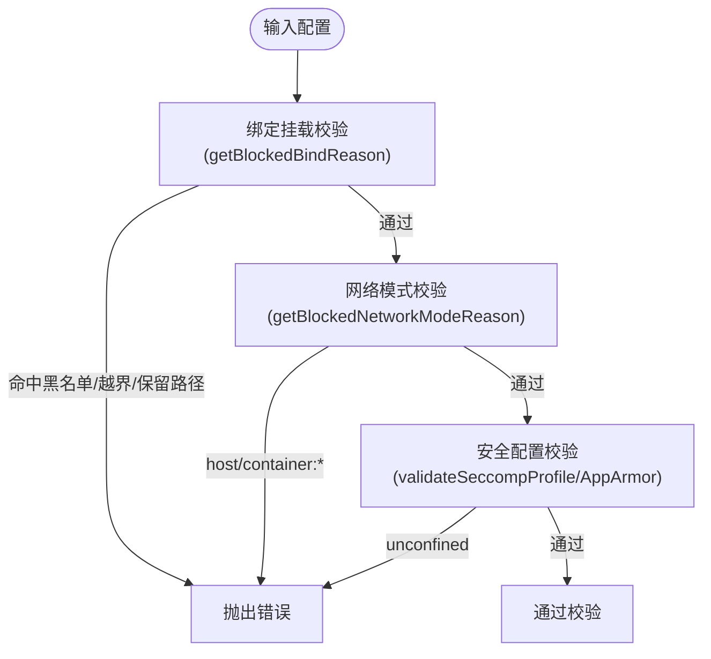
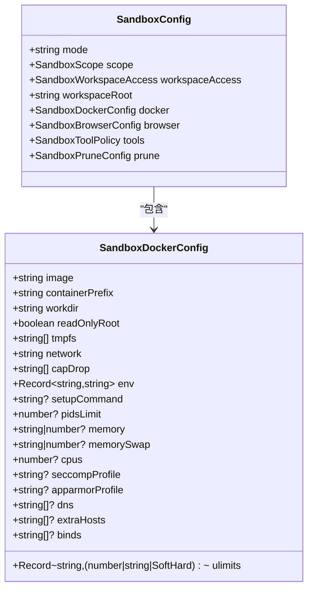
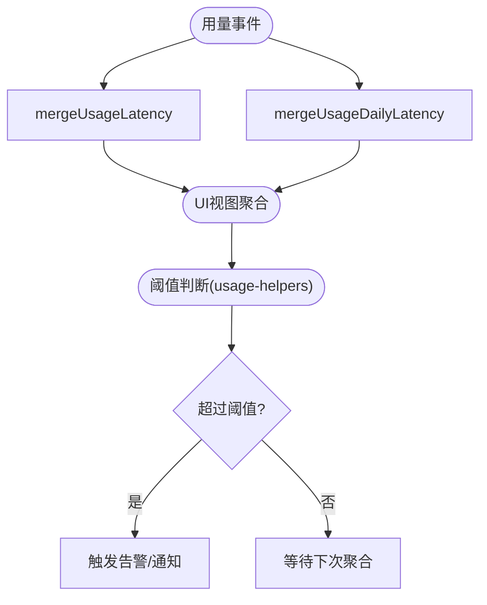
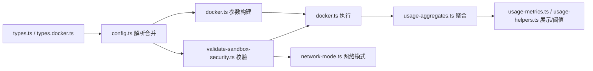

# 资源限制

<cite>
**本文引用的文件**
- [src/agents/sandbox/docker.ts](file://src/agents/sandbox/docker.ts)
- [src/agents/sandbox/validate-sandbox-security.ts](file://src/agents/sandbox/validate-sandbox-security.ts)
- [src/agents/sandbox/network-mode.ts](file://src/agents/sandbox/network-mode.ts)
- [src/agents/sandbox/config.ts](file://src/agents/sandbox/config.ts)
- [src/agents/sandbox/types.ts](file://src/agents/sandbox/types.ts)
- [src/agents/sandbox/types.docker.ts](file://src/agents/sandbox/types.docker.ts)
- [src/config/zod-schema.agent-runtime.ts](file://src/config/zod-schema.agent-runtime.ts)
- [src/shared/usage-aggregates.ts](file://src/shared/usage-aggregates.ts)
- [ui/src/ui/views/usage-metrics.ts](file://ui/src/ui/views/usage-metrics.ts)
- [ui/src/ui/usage-helpers.ts](file://ui/src/ui/usage-helpers.ts)
</cite>

## 目录
1. [简介](#简介)
2. [项目结构](#项目结构)
3. [核心组件](#核心组件)
4. [架构总览](#架构总览)
5. [详细组件分析](#详细组件分析)
6. [依赖关系分析](#依赖关系分析)
7. [性能考量](#性能考量)
8. [故障排查指南](#故障排查指南)
9. [结论](#结论)
10. [附录](#附录)

## 简介
本文件面向OpenClaw的资源限制与容器沙箱体系，系统性阐述CPU配额、内存限制、磁盘挂载与网络隔离在运行时的实现方式，并结合仓库中的Docker集成、安全校验、配置解析与度量聚合能力，给出限额监控、自动调整与容量规划的实践建议。内容覆盖：
- CPU配额：通过Docker --cpus参数进行核数级配额与节流
- 内存限制：通过--memory与--memory-swap实现硬上限与交换控制
- 磁盘配额：通过bind mount与tmpfs、只读根文件系统等策略约束持久化与临时数据
- 网络带宽控制：通过网络模式与DNS/hosts配置实现隔离与访问控制
- 安全与合规：seccomp/AppArmor、危险网络模式与保留路径的阻断
- 监控与告警：使用会话/通道/代理维度的用量聚合与阈值触发
- 自动调整与容量规划：基于历史用量与峰值的策略建议

## 项目结构
围绕资源限制与监控的关键代码主要集中在以下模块：
- 沙箱与Docker集成：构建容器参数、执行命令、状态查询与重建逻辑
- 安全校验：阻止危险绑定、网络模式与安全配置
- 配置解析：合并全局与代理级Docker配置，生成最终运行时参数
- 类型定义：统一Docker配置与沙箱上下文
- 运行时配置校验：Zod Schema对危险设置进行静态检查
- 用量聚合与UI展示：按日/代理/通道聚合延迟与计数指标

**图表来源**
- [src/agents/sandbox/docker.ts](file://src/agents/sandbox/docker.ts#L315-L424)
- [src/agents/sandbox/validate-sandbox-security.ts](file://src/agents/sandbox/validate-sandbox-security.ts#L328-L343)
- [src/agents/sandbox/network-mode.ts](file://src/agents/sandbox/network-mode.ts#L1-L28)
- [src/agents/sandbox/config.ts](file://src/agents/sandbox/config.ts#L76-L120)
- [src/agents/sandbox/types.ts](file://src/agents/sandbox/types.ts#L55-L64)
- [src/agents/sandbox/types.docker.ts](file://src/agents/sandbox/types.docker.ts#L1-L14)
- [src/config/zod-schema.agent-runtime.ts](file://src/config/zod-schema.agent-runtime.ts#L160-L204)
- [src/shared/usage-aggregates.ts](file://src/shared/usage-aggregates.ts#L32-L66)
- [ui/src/ui/views/usage-metrics.ts](file://ui/src/ui/views/usage-metrics.ts#L407-L431)
- [ui/src/ui/usage-helpers.ts](file://ui/src/ui/usage-helpers.ts#L227-L245)

**章节来源**
- [src/agents/sandbox/docker.ts](file://src/agents/sandbox/docker.ts#L315-L424)
- [src/agents/sandbox/config.ts](file://src/agents/sandbox/config.ts#L76-L120)
- [src/agents/sandbox/types.ts](file://src/agents/sandbox/types.ts#L55-L64)
- [src/agents/sandbox/types.docker.ts](file://src/agents/sandbox/types.docker.ts#L1-L14)
- [src/agents/sandbox/validate-sandbox-security.ts](file://src/agents/sandbox/validate-sandbox-security.ts#L328-L343)
- [src/agents/sandbox/network-mode.ts](file://src/agents/sandbox/network-mode.ts#L1-L28)
- [src/config/zod-schema.agent-runtime.ts](file://src/config/zod-schema.agent-runtime.ts#L160-L204)
- [src/shared/usage-aggregates.ts](file://src/shared/usage-aggregates.ts#L32-L66)
- [ui/src/ui/views/usage-metrics.ts](file://ui/src/ui/views/usage-metrics.ts#L407-L431)
- [ui/src/ui/usage-helpers.ts](file://ui/src/ui/usage-helpers.ts#L227-L245)

## 核心组件
- Docker容器参数构建与执行
  - 通过buildSandboxCreateArgs将Docker配置映射为CLI参数，包括CPU配额(--cpus)、内存限制(--memory与--memory-swap)、PID限制(--pids-limit)、ulimit、DNS与hosts、只读根文件系统、tmpfs、安全选项(seccomp/apparmor/cap-drop/no-new-privileges)等
  - 执行execDockerRaw/execDocker封装子进程调用，支持中断、失败处理与错误包装
- 安全校验与网络隔离
  - validateSandboxSecurity对bind mount、网络模式(host/container:*)、seccomp与AppArmor配置进行阻断式校验
  - getBlockedNetworkModeReason阻止host与container命名空间加入，默认允许bridge/none
- 配置解析与合并
  - resolveSandboxDockerConfig按作用域合并全局与代理级Docker配置，统一默认值并处理危险布尔开关
- 类型与运行时校验
  - types.ts/types.docker.ts定义Docker配置与沙箱上下文；zod-schema.agent-runtime.ts在运行时Schema层阻止危险设置
- 用量聚合与阈值
  - usage-aggregates.ts提供延迟与计数聚合工具；UI侧usage-metrics.ts按代理/通道/会话聚合；usage-helpers.ts提供阈值判断

**章节来源**
- [src/agents/sandbox/docker.ts](file://src/agents/sandbox/docker.ts#L315-L424)
- [src/agents/sandbox/validate-sandbox-security.ts](file://src/agents/sandbox/validate-sandbox-security.ts#L328-L343)
- [src/agents/sandbox/network-mode.ts](file://src/agents/sandbox/network-mode.ts#L8-L23)
- [src/agents/sandbox/config.ts](file://src/agents/sandbox/config.ts#L76-L120)
- [src/agents/sandbox/types.ts](file://src/agents/sandbox/types.ts#L55-L64)
- [src/agents/sandbox/types.docker.ts](file://src/agents/sandbox/types.docker.ts#L1-L14)
- [src/config/zod-schema.agent-runtime.ts](file://src/config/zod-schema.agent-runtime.ts#L160-L204)
- [src/shared/usage-aggregates.ts](file://src/shared/usage-aggregates.ts#L32-L66)
- [ui/src/ui/views/usage-metrics.ts](file://ui/src/ui/views/usage-metrics.ts#L407-L431)
- [ui/src/ui/usage-helpers.ts](file://ui/src/ui/usage-helpers.ts#L227-L245)

## 架构总览
下图展示了从配置到容器创建、再到安全校验与监控的整体流程。

**图表来源**
- [src/agents/sandbox/config.ts](file://src/agents/sandbox/config.ts#L76-L120)
- [src/agents/sandbox/types.ts](file://src/agents/sandbox/types.ts#L55-L64)
- [src/agents/sandbox/types.docker.ts](file://src/agents/sandbox/types.docker.ts#L1-L14)
- [src/agents/sandbox/validate-sandbox-security.ts](file://src/agents/sandbox/validate-sandbox-security.ts#L328-L343)
- [src/agents/sandbox/network-mode.ts](file://src/agents/sandbox/network-mode.ts#L8-L23)
- [src/agents/sandbox/docker.ts](file://src/agents/sandbox/docker.ts#L315-L424)
- [src/shared/usage-aggregates.ts](file://src/shared/usage-aggregates.ts#L32-L66)

## 详细组件分析

### 组件A：Docker资源参数构建与执行
- CPU配额
  - 通过--cpus设置容器可用CPU核数上限，数值>0时生效
- 内存限制
  - --memory设置内存上限；--memory-swap设置内存+交换总上限；均支持数字或字符串形式
- PID限制
  - --pids-limit限制容器内最大进程数
- ulimit
  - 支持软/硬限制组合格式，用于文件描述符、核心转储等资源限制
- 安全与网络
  - --cap-drop、--security-opt no-new-privileges、seccomp与AppArmor配置
  - DNS与hosts注入；tmpfs挂载；只读根文件系统
- 容器生命周期
  - ensureDockerImage拉取镜像；ensureSandboxContainer负责存在性/运行态/热重建与注册更新

**图表来源**
- [src/agents/sandbox/docker.ts](file://src/agents/sandbox/docker.ts#L256-L267)
- [src/agents/sandbox/docker.ts](file://src/agents/sandbox/docker.ts#L315-L424)
- [src/agents/sandbox/validate-sandbox-security.ts](file://src/agents/sandbox/validate-sandbox-security.ts#L328-L343)

**章节来源**
- [src/agents/sandbox/docker.ts](file://src/agents/sandbox/docker.ts#L315-L424)
- [src/agents/sandbox/docker.ts](file://src/agents/sandbox/docker.ts#L256-L267)

### 组件B：安全校验与网络隔离
- 绑定挂载校验
  - 阻止目标路径覆盖/命中黑名单路径（如/etc、/proc、/sys、/dev、/root、/run*、Docker套接字等）
  - 阻止非绝对路径与超出允许根目录的挂载
  - 阻止覆盖保留容器路径（如/workspace与代理工作区路径）
- 网络模式阻断
  - 默认禁止host模式与container:*命名空间加入，避免绕过网络隔离
- 安全配置阻断
  - 禁止seccomp与AppArmor使用unconfined，强制使用自定义配置或禁用

**图表来源**
- [src/agents/sandbox/validate-sandbox-security.ts](file://src/agents/sandbox/validate-sandbox-security.ts#L96-L117)
- [src/agents/sandbox/validate-sandbox-security.ts](file://src/agents/sandbox/validate-sandbox-security.ts#L145-L162)
- [src/agents/sandbox/validate-sandbox-security.ts](file://src/agents/sandbox/validate-sandbox-security.ts#L164-L180)
- [src/agents/sandbox/network-mode.ts](file://src/agents/sandbox/network-mode.ts#L8-L23)
- [src/agents/sandbox/validate-sandbox-security.ts](file://src/agents/sandbox/validate-sandbox-security.ts#L308-L326)

**章节来源**
- [src/agents/sandbox/validate-sandbox-security.ts](file://src/agents/sandbox/validate-sandbox-security.ts#L96-L117)
- [src/agents/sandbox/validate-sandbox-security.ts](file://src/agents/sandbox/validate-sandbox-security.ts#L145-L162)
- [src/agents/sandbox/validate-sandbox-security.ts](file://src/agents/sandbox/validate-sandbox-security.ts#L164-L180)
- [src/agents/sandbox/network-mode.ts](file://src/agents/sandbox/network-mode.ts#L8-L23)
- [src/agents/sandbox/validate-sandbox-security.ts](file://src/agents/sandbox/validate-sandbox-security.ts#L308-L326)

### 组件C：配置解析与合并
- Docker配置合并
  - 环境变量以代理级覆盖全局级；ulimits以代理级覆盖全局级；binds拼接
  - 默认值：只读根、tmpfs、网络none、capDrop ALL、LANG=C.UTF-8等
- 危险布尔开关
  - 允许外部绑定源、保留容器目标、容器命名空间加入需显式开启
- 浏览器容器配置
  - 可独立覆盖网络、镜像与binds，便于浏览器访问需求

**图表来源**
- [src/agents/sandbox/types.ts](file://src/agents/sandbox/types.ts#L55-L64)
- [src/agents/sandbox/types.docker.ts](file://src/agents/sandbox/types.docker.ts#L1-L14)
- [src/agents/sandbox/config.ts](file://src/agents/sandbox/config.ts#L76-L120)

**章节来源**
- [src/agents/sandbox/config.ts](file://src/agents/sandbox/config.ts#L76-L120)
- [src/agents/sandbox/types.ts](file://src/agents/sandbox/types.ts#L55-L64)
- [src/agents/sandbox/types.docker.ts](file://src/agents/sandbox/types.docker.ts#L1-L14)

### 组件D：用量聚合与阈值
- 延迟与计数聚合
  - mergeUsageLatency与mergeUsageDailyLatency按天/总量聚合延迟指标
- UI侧聚合
  - 按代理、通道、会话维度汇总用量，支持按provider聚合
- 阈值判断
  - 使用usage-helpers.ts对消息数量等阈值进行判断

**图表来源**
- [src/shared/usage-aggregates.ts](file://src/shared/usage-aggregates.ts#L32-L66)
- [ui/src/ui/views/usage-metrics.ts](file://ui/src/ui/views/usage-metrics.ts#L407-L431)
- [ui/src/ui/usage-helpers.ts](file://ui/src/ui/usage-helpers.ts#L227-L245)

**章节来源**
- [src/shared/usage-aggregates.ts](file://src/shared/usage-aggregates.ts#L32-L66)
- [ui/src/ui/views/usage-metrics.ts](file://ui/src/ui/views/usage-metrics.ts#L407-L431)
- [ui/src/ui/usage-helpers.ts](file://ui/src/ui/usage-helpers.ts#L227-L245)

## 依赖关系分析
- 配置解析依赖类型定义，再驱动Docker参数构建
- 安全校验在参数构建前执行，确保不产出危险容器
- 网络模式校验与安全配置校验共同构成网络与隔离边界
- 用量聚合与UI展示形成闭环，支撑告警与容量规划

**图表来源**
- [src/agents/sandbox/types.ts](file://src/agents/sandbox/types.ts#L55-L64)
- [src/agents/sandbox/types.docker.ts](file://src/agents/sandbox/types.docker.ts#L1-L14)
- [src/agents/sandbox/config.ts](file://src/agents/sandbox/config.ts#L76-L120)
- [src/agents/sandbox/docker.ts](file://src/agents/sandbox/docker.ts#L315-L424)
- [src/agents/sandbox/validate-sandbox-security.ts](file://src/agents/sandbox/validate-sandbox-security.ts#L328-L343)
- [src/agents/sandbox/network-mode.ts](file://src/agents/sandbox/network-mode.ts#L8-L23)
- [src/shared/usage-aggregates.ts](file://src/shared/usage-aggregates.ts#L32-L66)
- [ui/src/ui/views/usage-metrics.ts](file://ui/src/ui/views/usage-metrics.ts#L407-L431)
- [ui/src/ui/usage-helpers.ts](file://ui/src/ui/usage-helpers.ts#L227-L245)

**章节来源**
- [src/agents/sandbox/config.ts](file://src/agents/sandbox/config.ts#L76-L120)
- [src/agents/sandbox/docker.ts](file://src/agents/sandbox/docker.ts#L315-L424)
- [src/agents/sandbox/validate-sandbox-security.ts](file://src/agents/sandbox/validate-sandbox-security.ts#L328-L343)
- [src/agents/sandbox/network-mode.ts](file://src/agents/sandbox/network-mode.ts#L8-L23)
- [src/shared/usage-aggregates.ts](file://src/shared/usage-aggregates.ts#L32-L66)
- [ui/src/ui/views/usage-metrics.ts](file://ui/src/ui/views/usage-metrics.ts#L407-L431)
- [ui/src/ui/usage-helpers.ts](file://ui/src/ui/usage-helpers.ts#L227-L245)

## 性能考量
- CPU配额
  - 使用--cpus进行核数级节流，适合多代理共享宿主机CPU的场景；过高会导致调度抖动，过低影响吞吐
- 内存限制
  - 合理设置--memory与--memory-swap，避免频繁OOM；swap过大可能放大抖动
- PID限制
  - 控制容器内进程数，防止“僵尸进程”导致资源泄漏
- tmpfs与只读根
  - 将临时数据放入tmpfs可降低磁盘IO；只读根减少持久化风险
- 网络隔离
  - 默认none网络最小化暴露面；浏览器容器可单独配置网络以满足访问需求
- 用量聚合频率
  - UI侧按会话/通道/代理聚合，建议结合滚动窗口与分位数（p95）评估尾延迟

[本节为通用指导，无需特定文件来源]

## 故障排查指南
- Docker命令不可用
  - 现象：找不到docker命令
  - 处理：安装Docker并确保docker在PATH中；或关闭沙箱模式
  - 参考：[docker.ts](file://src/agents/sandbox/docker.ts#L114-L122)
- 容器创建失败
  - 现象：docker create失败，返回非零退出码
  - 处理：检查--cpus、--memory、--memory-swap、--pids-limit、binds、网络模式等参数
  - 参考：[docker.ts](file://src/agents/sandbox/docker.ts#L137-L149)
- 安全校验失败
  - 现象：绑定挂载、网络模式或安全配置被阻断
  - 处理：修正为受支持的路径/网络/配置；必要时使用危险开关但需充分信任
  - 参考：[validate-sandbox-security.ts](file://src/agents/sandbox/validate-sandbox-security.ts#L201-L227), [network-mode.ts](file://src/agents/sandbox/network-mode.ts#L8-L23)
- 镜像缺失
  - 现象：默认镜像未找到
  - 处理：拉取debian:bookworm-slim并重命名为默认镜像
  - 参考：[docker.ts](file://src/agents/sandbox/docker.ts#L256-L267)
- 用量聚合异常
  - 现象：延迟/计数聚合结果异常
  - 处理：检查输入数据格式与空值处理；确认按天聚合键正确
  - 参考：[usage-aggregates.ts](file://src/shared/usage-aggregates.ts#L32-L66)

**章节来源**
- [src/agents/sandbox/docker.ts](file://src/agents/sandbox/docker.ts#L114-L122)
- [src/agents/sandbox/docker.ts](file://src/agents/sandbox/docker.ts#L137-L149)
- [src/agents/sandbox/validate-sandbox-security.ts](file://src/agents/sandbox/validate-sandbox-security.ts#L201-L227)
- [src/agents/sandbox/network-mode.ts](file://src/agents/sandbox/network-mode.ts#L8-L23)
- [src/agents/sandbox/docker.ts](file://src/agents/sandbox/docker.ts#L256-L267)
- [src/shared/usage-aggregates.ts](file://src/shared/usage-aggregates.ts#L32-L66)

## 结论
OpenClaw通过“配置解析—安全校验—容器执行—用量聚合”的闭环，实现了对CPU、内存、磁盘与网络的可控限制与可观测性。结合危险开关与默认隔离策略，既保障了安全性，又提供了灵活的资源治理手段。建议在生产环境中：
- 明确各代理/会话的CPU与内存配额，结合历史用量与峰值设定初始值
- 对磁盘持久化严格限制，优先使用tmpfs与只读根
- 默认使用none网络，仅在浏览器等特殊场景开放受限网络
- 建立基于分位数的延迟与计数阈值告警，配合滚动窗口进行容量规划

[本节为总结，无需特定文件来源]

## 附录
- 关键参数速查
  - CPU：--cpus
  - 内存：--memory、--memory-swap
  - PID：--pids-limit
  - ulimit：--ulimit
  - 安全：--cap-drop、--security-opt no-new-privileges、seccomp、AppArmor
  - 网络：--network（默认none）、--dns、--add-host
  - 文件系统：--read-only、--tmpfs、-v（bind）

[本节为概览，无需特定文件来源]