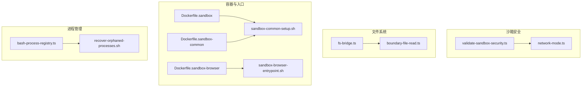
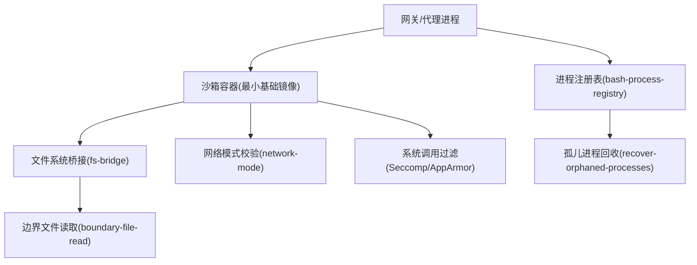
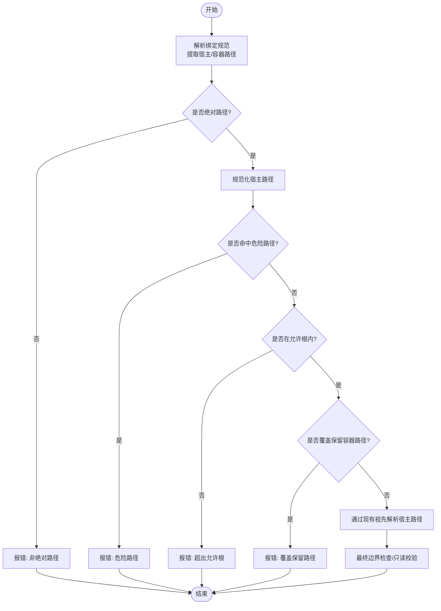
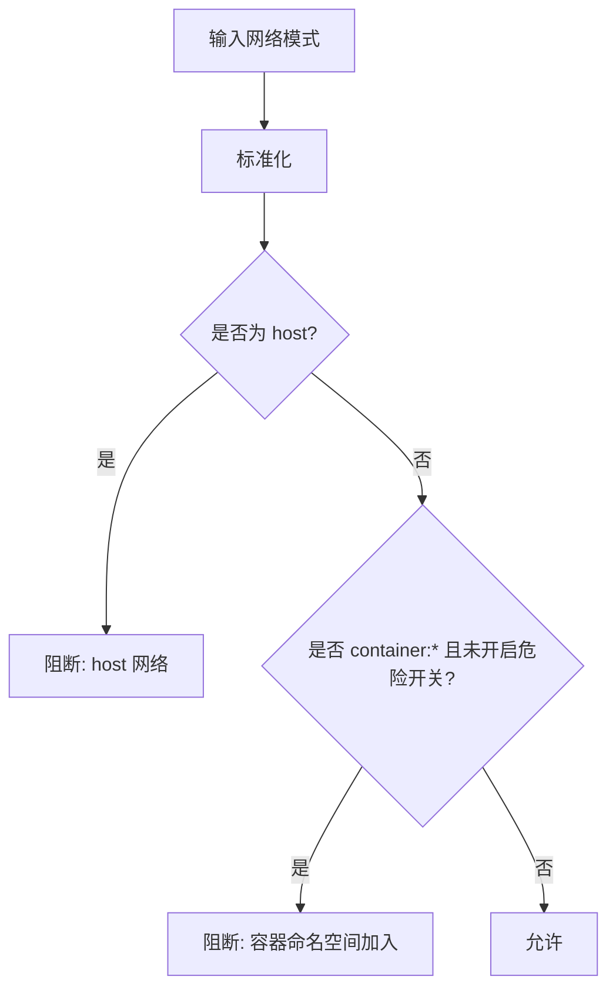
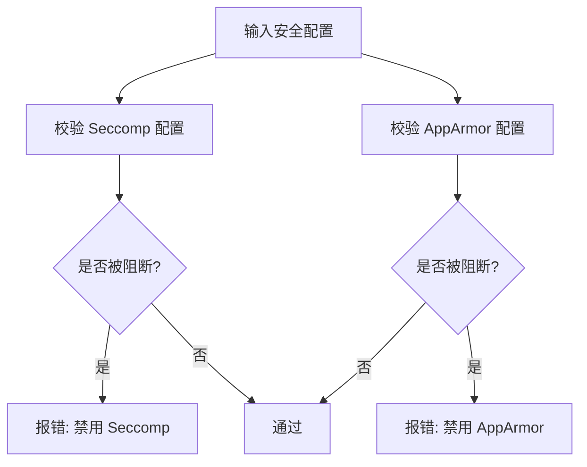
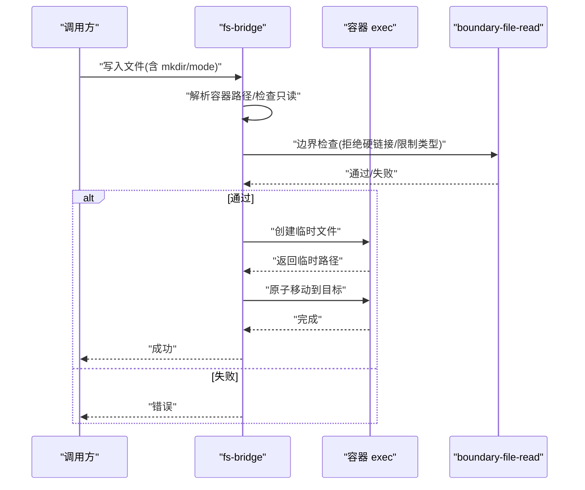
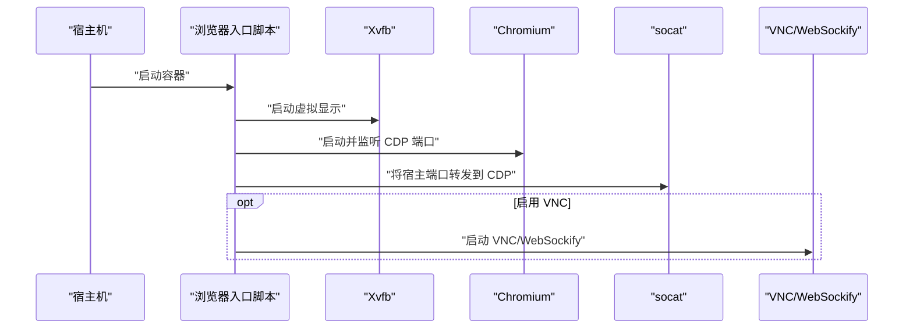
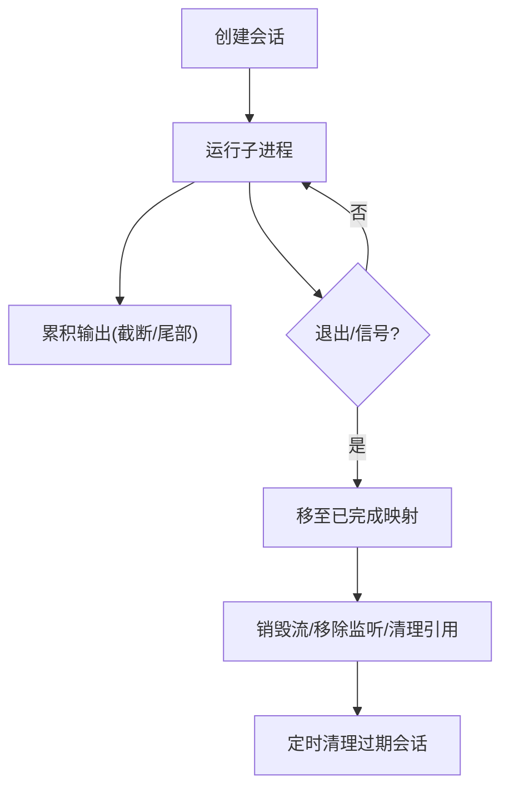
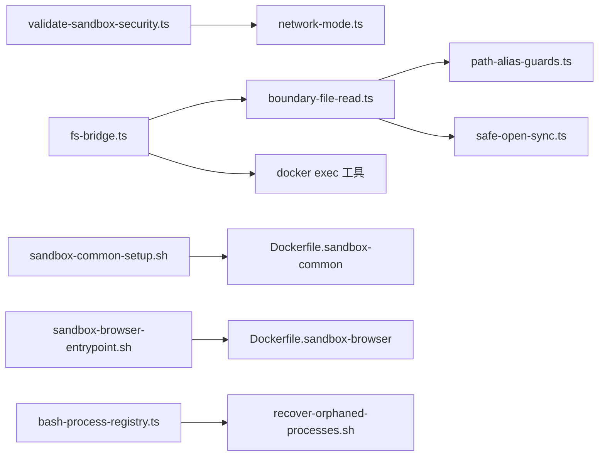

# 进程隔离

<cite>
**本文引用的文件**
- [src/agents/sandbox/validate-sandbox-security.ts](file://src/agents/sandbox/validate-sandbox-security.ts)
- [src/agents/sandbox/network-mode.ts](file://src/agents/sandbox/network-mode.ts)
- [src/agents/sandbox/fs-bridge.ts](file://src/agents/sandbox/fs-bridge.ts)
- [src/infra/boundary-file-read.ts](file://src/infra/boundary-file-read.ts)
- [scripts/sandbox-browser-entrypoint.sh](file://scripts/sandbox-browser-entrypoint.sh)
- [scripts/sandbox-common-setup.sh](file://scripts/sandbox-common-setup.sh)
- [Dockerfile.sandbox](file://Dockerfile.sandbox)
- [Dockerfile.sandbox-common](file://Dockerfile.sandbox-common)
- [Dockerfile.sandbox-browser](file://Dockerfile.sandbox-browser)
- [src/agents/bash-process-registry.ts](file://src/agents/bash-process-registry.ts)
- [scripts/recover-orphaned-processes.sh](file://scripts/recover-orphaned-processes.sh)
</cite>

## 目录
1. [引言](#引言)
2. [项目结构](#项目结构)
3. [核心组件](#核心组件)
4. [架构总览](#架构总览)
5. [组件详解](#组件详解)
6. [依赖关系分析](#依赖关系分析)
7. [性能考量](#性能考量)
8. [故障排查指南](#故障排查指南)
9. [结论](#结论)
10. [附录](#附录)

## 引言
本文件系统性阐述 OpenClaw 的进程隔离机制，覆盖进程间通信隔离、命名空间隔离、权限分离、系统调用过滤、文件系统挂载点隔离与网络命名空间配置，并结合进程监控、信号处理与资源审计实践，给出安全基线、权限最小化原则与隔离边界定义。内容基于仓库中的沙箱安全校验、文件系统桥接、边界文件读取、容器镜像与入口脚本、以及进程生命周期管理等实现。

## 项目结构
围绕进程隔离的关键代码分布在以下模块：
- 沙箱安全校验：绑定挂载、网络模式、安全策略（Seccomp/AppArmor）阻断
- 文件系统桥接：容器内路径解析、边界检查、只读/可写约束
- 边界文件读取：硬链接拒绝、类型限制、字节上限、别名策略
- 容器镜像与入口：基础镜像、通用工具链、浏览器沙箱入口
- 进程生命周期：会话注册、输出缓冲、退出清理、定时清理

**图示来源**
- [src/agents/sandbox/validate-sandbox-security.ts](file://src/agents/sandbox/validate-sandbox-security.ts#L1-L344)
- [src/agents/sandbox/network-mode.ts](file://src/agents/sandbox/network-mode.ts#L1-L29)
- [src/agents/sandbox/fs-bridge.ts](file://src/agents/sandbox/fs-bridge.ts#L1-L505)
- [src/infra/boundary-file-read.ts](file://src/infra/boundary-file-read.ts#L1-L203)
- [Dockerfile.sandbox](file://Dockerfile.sandbox#L1-L21)
- [Dockerfile.sandbox-common](file://Dockerfile.sandbox-common#L1-L46)
- [Dockerfile.sandbox-browser](file://Dockerfile.sandbox-browser#L1-L33)
- [scripts/sandbox-common-setup.sh](file://scripts/sandbox-common-setup.sh#L1-L41)
- [scripts/sandbox-browser-entrypoint.sh](file://scripts/sandbox-browser-entrypoint.sh#L1-L128)
- [src/agents/bash-process-registry.ts](file://src/agents/bash-process-registry.ts#L1-L310)
- [scripts/recover-orphaned-processes.sh](file://scripts/recover-orphaned-processes.sh#L1-L192)

**章节来源**
- [src/agents/sandbox/validate-sandbox-security.ts](file://src/agents/sandbox/validate-sandbox-security.ts#L1-L344)
- [src/agents/sandbox/network-mode.ts](file://src/agents/sandbox/network-mode.ts#L1-L29)
- [src/agents/sandbox/fs-bridge.ts](file://src/agents/sandbox/fs-bridge.ts#L1-L505)
- [src/infra/boundary-file-read.ts](file://src/infra/boundary-file-read.ts#L1-L203)
- [Dockerfile.sandbox](file://Dockerfile.sandbox#L1-L21)
- [Dockerfile.sandbox-common](file://Dockerfile.sandbox-common#L1-L46)
- [Dockerfile.sandbox-browser](file://Dockerfile.sandbox-browser#L1-L33)
- [scripts/sandbox-common-setup.sh](file://scripts/sandbox-common-setup.sh#L1-L41)
- [scripts/sandbox-browser-entrypoint.sh](file://scripts/sandbox-browser-entrypoint.sh#L1-L128)
- [src/agents/bash-process-registry.ts](file://src/agents/bash-process-registry.ts#L1-L310)
- [scripts/recover-orphaned-processes.sh](file://scripts/recover-orphaned-processes.sh#L1-L192)

## 核心组件
- 绑定挂载安全校验：阻止危险宿主路径暴露、保留容器关键挂载点、允许根白名单与符号链接硬化
- 网络模式校验：禁止 host 网络与容器命名空间加入，防止绕过网络隔离
- 系统调用过滤：阻断禁用 Seccomp/AppArmor 的配置，强制启用安全策略
- 文件系统边界：容器内路径解析、只读挂载约束、别名策略与硬链接拒绝
- 容器镜像与入口：最小基础镜像、通用工具链、浏览器沙箱参数与端口转发
- 进程生命周期：会话注册、输出缓冲与截断、退出状态记录、定时清理与孤儿进程回收

**章节来源**
- [src/agents/sandbox/validate-sandbox-security.ts](file://src/agents/sandbox/validate-sandbox-security.ts#L16-L343)
- [src/agents/sandbox/network-mode.ts](file://src/agents/sandbox/network-mode.ts#L1-L29)
- [src/agents/sandbox/fs-bridge.ts](file://src/agents/sandbox/fs-bridge.ts#L318-L367)
- [src/infra/boundary-file-read.ts](file://src/infra/boundary-file-read.ts#L26-L166)
- [Dockerfile.sandbox](file://Dockerfile.sandbox#L1-L21)
- [Dockerfile.sandbox-common](file://Dockerfile.sandbox-common#L1-L46)
- [Dockerfile.sandbox-browser](file://Dockerfile.sandbox-browser#L1-L33)
- [scripts/sandbox-browser-entrypoint.sh](file://scripts/sandbox-browser-entrypoint.sh#L1-L128)
- [src/agents/bash-process-registry.ts](file://src/agents/bash-process-registry.ts#L1-L310)
- [scripts/recover-orphaned-processes.sh](file://scripts/recover-orphaned-processes.sh#L1-L192)

## 架构总览
OpenClaw 的进程隔离以“容器 + 文件系统边界 + 网络与系统调用控制”为核心，形成多层防护：

**图示来源**
- [src/agents/sandbox/fs-bridge.ts](file://src/agents/sandbox/fs-bridge.ts#L73-L75)
- [src/infra/boundary-file-read.ts](file://src/infra/boundary-file-read.ts#L142-L166)
- [src/agents/sandbox/network-mode.ts](file://src/agents/sandbox/network-mode.ts#L8-L23)
- [src/agents/sandbox/validate-sandbox-security.ts](file://src/agents/sandbox/validate-sandbox-security.ts#L308-L326)
- [src/agents/bash-process-registry.ts](file://src/agents/bash-process-registry.ts#L86-L102)
- [scripts/recover-orphaned-processes.sh](file://scripts/recover-orphaned-processes.sh#L102-L142)

## 组件详解

### 绑定挂载与文件系统隔离
- 危险宿主路径阻断：禁止挂载 /etc、/proc、/sys、/dev、/root、/boot 及常见 Docker 套接字路径
- 路径规范化与白名单：支持绝对路径、规范化、同源解析；可配置允许根目录白名单
- 符号链接硬化：通过现有祖先解析宿主路径，避免 symlink 逃逸
- 容器目标保留：禁止覆盖 /workspace 与代理工作区挂载点
- 写入约束：仅在挂载为可写时允许写操作，否则报错

**图示来源**
- [src/agents/sandbox/validate-sandbox-security.ts](file://src/agents/sandbox/validate-sandbox-security.ts#L96-L281)

**章节来源**
- [src/agents/sandbox/validate-sandbox-security.ts](file://src/agents/sandbox/validate-sandbox-security.ts#L16-L343)
- [src/agents/sandbox/fs-bridge.ts](file://src/agents/sandbox/fs-bridge.ts#L318-L367)

### 网络命名空间与模式控制
- 禁止 host 网络：直接绕过容器网络隔离
- 禁止 container:* 命名空间加入：可能连接到其他容器命名空间
- 提供 bridge/none 作为默认安全选项；必要时可通过危险开关放行

**图示来源**
- [src/agents/sandbox/network-mode.ts](file://src/agents/sandbox/network-mode.ts#L8-L23)
- [src/agents/sandbox/validate-sandbox-security.ts](file://src/agents/sandbox/validate-sandbox-security.ts#L283-L306)

**章节来源**
- [src/agents/sandbox/network-mode.ts](file://src/agents/sandbox/network-mode.ts#L1-L29)
- [src/agents/sandbox/validate-sandbox-security.ts](file://src/agents/sandbox/validate-sandbox-security.ts#L283-L306)

### 系统调用过滤与权限分离
- 禁止禁用 Seccomp/AppArmor 的配置，强制启用安全策略
- 结合容器最小权限用户运行，降低提权风险

**图示来源**
- [src/agents/sandbox/validate-sandbox-security.ts](file://src/agents/sandbox/validate-sandbox-security.ts#L308-L326)

**章节来源**
- [src/agents/sandbox/validate-sandbox-security.ts](file://src/agents/sandbox/validate-sandbox-security.ts#L308-L326)
- [Dockerfile.sandbox](file://Dockerfile.sandbox#L16-L17)
- [Dockerfile.sandbox-common](file://Dockerfile.sandbox-common#L43-L44)

### 文件系统挂载点与边界审计
- 容器内路径解析：按挂载顺序匹配最近前缀，确保路径不逃逸
- 边界文件打开：拒绝硬链接、限制类型与大小、执行别名策略
- 写入流程：先写临时文件，再原子移动，失败回滚清理

**图示来源**
- [src/agents/sandbox/fs-bridge.ts](file://src/agents/sandbox/fs-bridge.ts#L114-L147)
- [src/infra/boundary-file-read.ts](file://src/infra/boundary-file-read.ts#L142-L166)

**章节来源**
- [src/agents/sandbox/fs-bridge.ts](file://src/agents/sandbox/fs-bridge.ts#L318-L367)
- [src/infra/boundary-file-read.ts](file://src/infra/boundary-file-read.ts#L26-L166)

### 浏览器沙箱与网络端口转发
- 使用 Xvfb + Chromium，禁用扩展与 GPU，限制渲染进程数量
- 通过 socat 将容器外端口转发至容器内 CDP 端口
- 支持 VNC/WebSocket 访问（可选），并生成随机密码

**图示来源**
- [scripts/sandbox-browser-entrypoint.sh](file://scripts/sandbox-browser-entrypoint.sh#L38-L125)
- [Dockerfile.sandbox-browser](file://Dockerfile.sandbox-browser#L1-L33)

**章节来源**
- [scripts/sandbox-browser-entrypoint.sh](file://scripts/sandbox-browser-entrypoint.sh#L1-L128)
- [Dockerfile.sandbox-browser](file://Dockerfile.sandbox-browser#L1-L33)

### 进程监控、信号处理与资源审计
- 会话注册表：记录命令、工作目录、输出缓冲、退出码/信号、后台态
- 输出截断与尾部保留：防止内存膨胀
- 清理策略：销毁子进程与流、移除事件监听、定时清理已完成会话
- 孤儿进程扫描：重启后扫描残留的编码代理进程，输出诊断信息

**图示来源**
- [src/agents/bash-process-registry.ts](file://src/agents/bash-process-registry.ts#L86-L213)
- [src/agents/bash-process-registry.ts](file://src/agents/bash-process-registry.ts#L286-L301)

**章节来源**
- [src/agents/bash-process-registry.ts](file://src/agents/bash-process-registry.ts#L1-L310)
- [scripts/recover-orphaned-processes.sh](file://scripts/recover-orphaned-processes.sh#L1-L192)

## 依赖关系分析
- 沙箱安全校验依赖网络模式与主机路径解析工具
- 文件系统桥接依赖边界文件读取与容器 exec 工具
- 边界文件读取依赖路径别名策略与安全打开工具
- 容器镜像构建脚本依赖 Dockerfile 与安装清单
- 进程注册表与孤儿进程回收脚本相互配合

**图示来源**
- [src/agents/sandbox/validate-sandbox-security.ts](file://src/agents/sandbox/validate-sandbox-security.ts#L8-L14)
- [src/agents/sandbox/fs-bridge.ts](file://src/agents/sandbox/fs-bridge.ts#L1-L13)
- [src/infra/boundary-file-read.ts](file://src/infra/boundary-file-read.ts#L1-L13)
- [scripts/sandbox-common-setup.sh](file://scripts/sandbox-common-setup.sh#L22-L33)
- [scripts/sandbox-browser-entrypoint.sh](file://scripts/sandbox-browser-entrypoint.sh#L1-L33)
- [src/agents/bash-process-registry.ts](file://src/agents/bash-process-registry.ts#L1-L3)
- [scripts/recover-orphaned-processes.sh](file://scripts/recover-orphaned-processes.sh#L40-L65)

**章节来源**
- [src/agents/sandbox/validate-sandbox-security.ts](file://src/agents/sandbox/validate-sandbox-security.ts#L1-L344)
- [src/agents/sandbox/fs-bridge.ts](file://src/agents/sandbox/fs-bridge.ts#L1-L505)
- [src/infra/boundary-file-read.ts](file://src/infra/boundary-file-read.ts#L1-L203)
- [scripts/sandbox-common-setup.sh](file://scripts/sandbox-common-setup.sh#L1-L41)
- [scripts/sandbox-browser-entrypoint.sh](file://scripts/sandbox-browser-entrypoint.sh#L1-L128)
- [src/agents/bash-process-registry.ts](file://src/agents/bash-process-registry.ts#L1-L310)
- [scripts/recover-orphaned-processes.sh](file://scripts/recover-orphaned-processes.sh#L1-L192)

## 性能考量
- 输出缓冲与截断：避免长时间累积导致内存占用过高
- 定时清理：根据会话 TTL 动态调整清理频率，平衡资源与可观测性
- 文件系统操作：写入采用临时文件 + 原子移动，减少部分场景下的锁竞争
- 容器镜像：最小基础镜像 + 按需安装工具，缩短构建时间与减小攻击面

[本节为通用指导，无需具体文件分析]

## 故障排查指南
- 绑定挂载报错：确认宿主路径为绝对路径、不在危险列表、在允许根内、未覆盖保留路径
- 网络模式报错：使用 bridge/none；如确需容器命名空间加入，请评估风险并使用危险开关
- 文件写入失败：检查挂载是否可写、是否存在硬链接、目标类型是否受限
- 孤儿进程：运行回收脚本获取诊断信息，定位残留进程并决定处理方式
- 浏览器沙箱：检查 Xvfb 启动、CDP/VNC 端口可达性、参数冲突

**章节来源**
- [src/agents/sandbox/validate-sandbox-security.ts](file://src/agents/sandbox/validate-sandbox-security.ts#L201-L227)
- [src/agents/sandbox/network-mode.ts](file://src/agents/sandbox/network-mode.ts#L16-L22)
- [src/agents/sandbox/fs-bridge.ts](file://src/agents/sandbox/fs-bridge.ts#L318-L367)
- [scripts/recover-orphaned-processes.sh](file://scripts/recover-orphaned-processes.sh#L153-L183)
- [scripts/sandbox-browser-entrypoint.sh](file://scripts/sandbox-browser-entrypoint.sh#L96-L125)

## 结论
OpenClaw 的进程隔离通过“容器 + 文件系统边界 + 网络与系统调用控制”的组合实现，辅以进程生命周期管理与资源审计，形成从路径、网络、权限到运行时行为的多维安全防线。遵循权限最小化与隔离边界定义，可在保证可用性的同时显著降低风险。

[本节为总结，无需具体文件分析]

## 附录

### 安全基线与最佳实践
- 路径与挂载
  - 仅挂载项目相关绝对路径，避免 /、/etc、/proc、/sys、/dev、/root、/boot、Docker 套接字等
  - 使用允许根白名单与符号链接硬化，避免逃逸
  - 不覆盖 /workspace 与代理工作区挂载点
- 网络
  - 默认使用 bridge/none；禁止 host 与 container:* 命名空间加入
- 系统调用
  - 不禁用 Seccomp/AppArmor；使用自定义策略文件
- 权限
  - 容器内以非特权用户运行；最小权限原则
- 进程
  - 明确会话 TTL，定期清理；对孤儿进程进行诊断与处置

**章节来源**
- [src/agents/sandbox/validate-sandbox-security.ts](file://src/agents/sandbox/validate-sandbox-security.ts#L16-L343)
- [src/agents/sandbox/network-mode.ts](file://src/agents/sandbox/network-mode.ts#L1-L29)
- [Dockerfile.sandbox](file://Dockerfile.sandbox#L16-L17)
- [Dockerfile.sandbox-common](file://Dockerfile.sandbox-common#L43-L44)
- [src/agents/bash-process-registry.ts](file://src/agents/bash-process-registry.ts#L286-L301)
- [scripts/recover-orphaned-processes.sh](file://scripts/recover-orphaned-processes.sh#L1-L192)