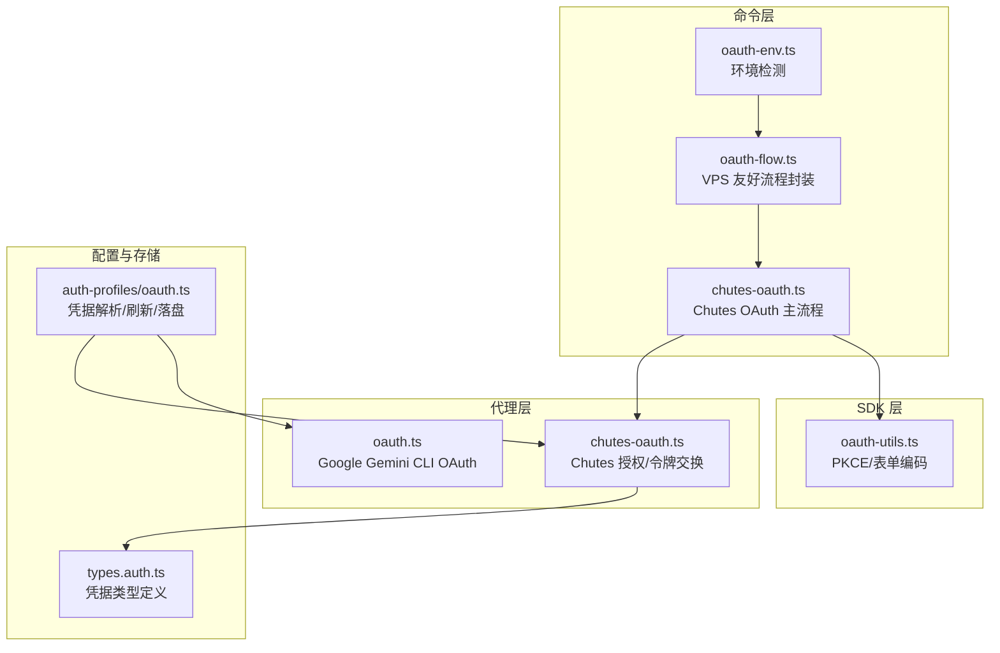
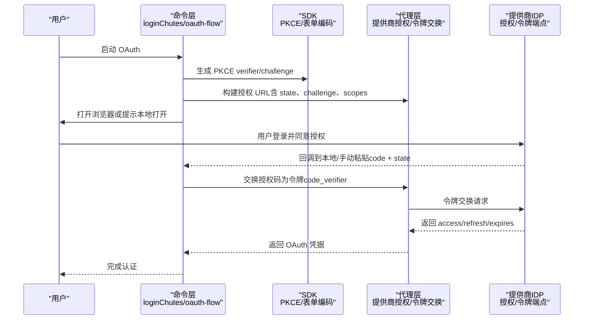
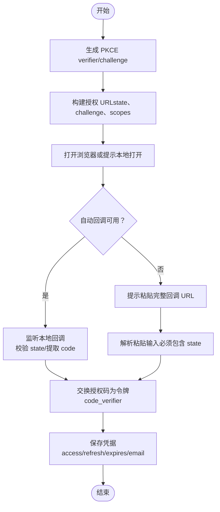
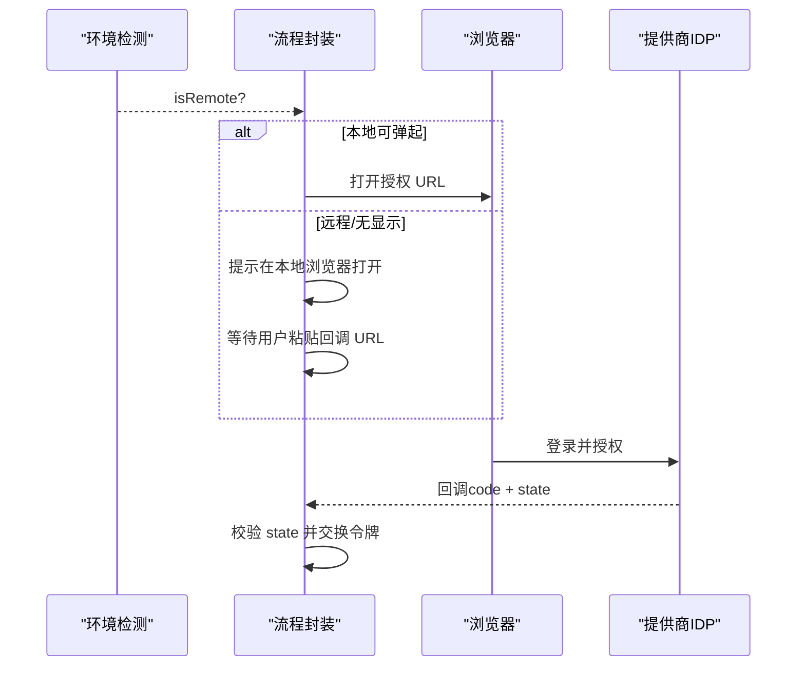
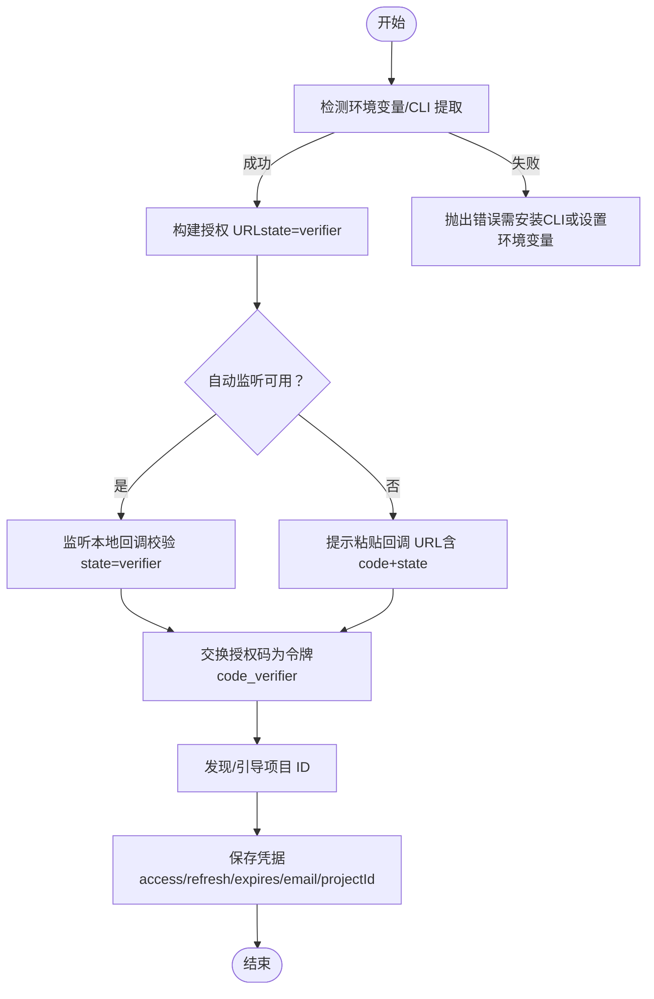
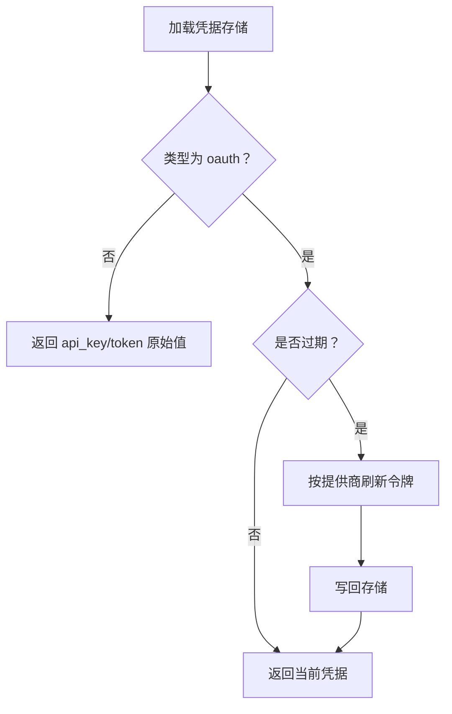
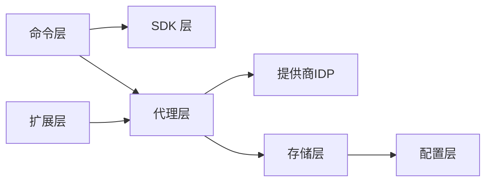

# OAuth认证流程

<cite>
**本文档引用的文件**
- [oauth-utils.ts](file://src/plugin-sdk/oauth-utils.ts)
- [chutes-oauth.ts](file://src/agents/chutes-oauth.ts)
- [chutes-oauth.ts](file://src/commands/chutes-oauth.ts)
- [oauth-flow.ts](file://src/commands/oauth-flow.ts)
- [oauth-env.ts](file://src/commands/oauth-env.ts)
- [oauth.ts](file://src/agents/auth-profiles/oauth.ts)
- [oauth.test.ts](file://src/commands/chutes-oauth.test.ts)
- [oauth.test.ts](file://extensions/google-gemini-cli-auth/oauth.test.ts)
- [oauth.ts](file://extensions/google-gemini-cli-auth/oauth.ts)
- [types.auth.ts](file://src/config/types.auth.ts)
- [provider-usage.auth.ts](file://src/infra/provider-usage.auth.ts)
- [list.status-command.ts](file://src/commands/models/list.status-command.ts)
</cite>

## 目录
1. [简介](#简介)
2. [项目结构](#项目结构)
3. [核心组件](#核心组件)
4. [架构总览](#架构总览)
5. [详细组件分析](#详细组件分析)
6. [依赖关系分析](#依赖关系分析)
7. [性能考量](#性能考量)
8. [故障排除指南](#故障排除指南)
9. [结论](#结论)
10. [附录](#附录)

## 简介
本文件系统性梳理 OpenClaw 的 OAuth 认证体系，覆盖 OAuth 2.0 授权码流程、PKCE 增强安全性、自动回调与手动回退机制、令牌刷新、作用域管理与权限控制，并提供 GitHub、Google、Microsoft 等主流提供商的集成参考路径。文档同时总结安全考虑与最佳实践，帮助开发者在不同平台（本地、远程、容器、WSL）下稳定完成 OAuth 集成。

## 项目结构
OpenClaw 将 OAuth 能力分布在多个层次：
- 插件 SDK 层：通用工具（PKCE、表单编码）
- 命令层：面向用户的交互式 OAuth 流程封装（Chutes、通用 VPS 友好流程）
- 代理层：具体提供商的授权端点、令牌交换与用户信息获取
- 配置与存储层：OAuth 凭据类型定义、凭据存储与刷新策略
- 扩展层：特定提供商的 OAuth 实现（如 Google Gemini CLI）

**图表来源**
- [chutes-oauth.ts](file://src/commands/chutes-oauth.ts#L156-L218)
- [oauth-flow.ts](file://src/commands/oauth-flow.ts#L8-L54)
- [oauth-env.ts](file://src/commands/oauth-env.ts#L3-L22)
- [chutes-oauth.ts](file://src/agents/chutes-oauth.ts#L1-L227)
- [oauth.ts](file://extensions/google-gemini-cli-auth/oauth.ts#L659-L735)
- [oauth-utils.ts](file://src/plugin-sdk/oauth-utils.ts#L1-L14)
- [types.auth.ts](file://src/config/types.auth.ts#L1-L29)
- [oauth.ts](file://src/agents/auth-profiles/oauth.ts#L158-L215)

**章节来源**
- [chutes-oauth.ts](file://src/commands/chutes-oauth.ts#L1-L218)
- [oauth-flow.ts](file://src/commands/oauth-flow.ts#L1-L54)
- [oauth-env.ts](file://src/commands/oauth-env.ts#L1-L23)
- [chutes-oauth.ts](file://src/agents/chutes-oauth.ts#L1-L227)
- [oauth.ts](file://extensions/google-gemini-cli-auth/oauth.ts#L1-L735)
- [oauth-utils.ts](file://src/plugin-sdk/oauth-utils.ts#L1-L14)
- [types.auth.ts](file://src/config/types.auth.ts#L1-L29)
- [oauth.ts](file://src/agents/auth-profiles/oauth.ts#L158-L215)

## 核心组件
- PKCE 工具：生成 code_verifier 与 code_challenge，保障移动应用与本地回调的安全性
- Chutes OAuth：授权端点、令牌交换、用户信息查询、刷新逻辑
- 通用 OAuth 流程：自动监听本地回调，失败时切换手动粘贴模式；VPS/远程环境提示本地浏览器打开
- 凭据存储与刷新：按配置类型（api_key/token/oauth）解析与刷新，支持跨代理继承与降级
- 环境检测：SSH/容器/无显示环境识别，自动切换手动流程

**章节来源**
- [oauth-utils.ts](file://src/plugin-sdk/oauth-utils.ts#L9-L13)
- [chutes-oauth.ts](file://src/agents/chutes-oauth.ts#L30-L34)
- [chutes-oauth.ts](file://src/commands/chutes-oauth.ts#L65-L154)
- [oauth-flow.ts](file://src/commands/oauth-flow.ts#L8-L54)
- [oauth.ts](file://src/agents/auth-profiles/oauth.ts#L158-L215)
- [oauth-env.ts](file://src/commands/oauth-env.ts#L3-L22)

## 架构总览
OpenClaw 的 OAuth 架构遵循“命令层编排、代理层对接提供商、SDK 层提供通用能力、配置层定义凭据模型”的分层设计。命令层负责用户体验与环境适配，代理层负责与提供商的授权/令牌端点交互，SDK 层提供 PKCE 等安全工具，配置层定义凭据类型与刷新策略。

**图表来源**
- [chutes-oauth.ts](file://src/commands/chutes-oauth.ts#L156-L218)
- [oauth-flow.ts](file://src/commands/oauth-flow.ts#L8-L54)
- [oauth-utils.ts](file://src/plugin-sdk/oauth-utils.ts#L9-L13)
- [chutes-oauth.ts](file://src/agents/chutes-oauth.ts#L107-L165)

**章节来源**
- [chutes-oauth.ts](file://src/commands/chutes-oauth.ts#L156-L218)
- [oauth-flow.ts](file://src/commands/oauth-flow.ts#L8-L54)
- [oauth-utils.ts](file://src/plugin-sdk/oauth-utils.ts#L9-L13)
- [chutes-oauth.ts](file://src/agents/chutes-oauth.ts#L107-L165)

## 详细组件分析

### 组件A：Chutes OAuth 主流程
- 自动回调监听：基于用户提供的 redirect_uri，启动本地 HTTP 服务器监听回调，校验 state 并提取 code
- 手动回退：若自动监听失败或不可用，提示用户粘贴完整回调 URL（包含 code 与 state）
- 令牌交换：使用 code_verifier 进行授权码交换，获取 access/refresh/expires，并拉取用户信息
- 刷新逻辑：当 access 过期时，使用 refresh_token 换取新 access，必要时保留/更新 refresh_token

**图表来源**
- [chutes-oauth.ts](file://src/commands/chutes-oauth.ts#L65-L154)
- [chutes-oauth.ts](file://src/commands/chutes-oauth.ts#L156-L218)
- [chutes-oauth.ts](file://src/agents/chutes-oauth.ts#L36-L81)
- [chutes-oauth.ts](file://src/agents/chutes-oauth.ts#L107-L165)

**章节来源**
- [chutes-oauth.ts](file://src/commands/chutes-oauth.ts#L65-L154)
- [chutes-oauth.ts](file://src/commands/chutes-oauth.ts#L156-L218)
- [chutes-oauth.ts](file://src/agents/chutes-oauth.ts#L36-L81)
- [chutes-oauth.ts](file://src/agents/chutes-oauth.ts#L107-L165)

### 组件B：通用 OAuth 流程（VPS/远程友好）
- 环境检测：通过 SSH/容器/无显示环境判断是否为远程环境
- 自动流程：本地可弹起浏览器时，直接打开授权 URL
- 手动流程：远程环境提示用户在本地浏览器打开，粘贴回调 URL
- 输入校验：强制要求粘贴完整 URL（包含 code 与 state），避免 CSRF 攻击

**图表来源**
- [oauth-env.ts](file://src/commands/oauth-env.ts#L3-L22)
- [oauth-flow.ts](file://src/commands/oauth-flow.ts#L8-L54)

**章节来源**
- [oauth-env.ts](file://src/commands/oauth-env.ts#L3-L22)
- [oauth-flow.ts](file://src/commands/oauth-flow.ts#L8-L54)

### 组件C：Google Gemini CLI OAuth（扩展）
- 客户端配置：优先从环境变量读取，其次尝试从已安装的 gemini CLI 中提取
- 授权与回调：使用固定本地回调端口，支持自动监听与手动粘贴两种模式
- 令牌交换：返回 access/refresh/expires，并补充用户邮箱与项目 ID
- 项目发现：通过多端点探测与引导，最终确定项目 ID 或要求显式设置

**图表来源**
- [oauth.ts](file://extensions/google-gemini-cli-auth/oauth.ts#L197-L215)
- [oauth.ts](file://extensions/google-gemini-cli-auth/oauth.ts#L261-L275)
- [oauth.ts](file://extensions/google-gemini-cli-auth/oauth.ts#L305-L396)
- [oauth.ts](file://extensions/google-gemini-cli-auth/oauth.ts#L398-L450)
- [oauth.ts](file://extensions/google-gemini-cli-auth/oauth.ts#L467-L604)

**章节来源**
- [oauth.ts](file://extensions/google-gemini-cli-auth/oauth.ts#L197-L215)
- [oauth.ts](file://extensions/google-gemini-cli-auth/oauth.ts#L261-L275)
- [oauth.ts](file://extensions/google-gemini-cli-auth/oauth.ts#L305-L396)
- [oauth.ts](file://extensions/google-gemini-cli-auth/oauth.ts#L398-L450)
- [oauth.ts](file://extensions/google-gemini-cli-auth/oauth.ts#L467-L604)

### 组件D：凭据解析与刷新（凭据存储层）
- 类型定义：api_key、token、oauth 三种模式，其中 oauth 包含 access/refresh/expires
- 解析流程：优先使用存储中的 oauth/token，若过期则触发刷新；若仍不可用，尝试主代理继承或降级
- 刷新策略：针对不同提供商（如 Chutes、Qwen Portal）采用专用刷新逻辑，否则委托底层 SDK 获取新 access

**图表来源**
- [types.auth.ts](file://src/config/types.auth.ts#L1-L29)
- [oauth.ts](file://src/agents/auth-profiles/oauth.ts#L158-L215)
- [oauth.ts](file://src/agents/auth-profiles/oauth.ts#L217-L256)

**章节来源**
- [types.auth.ts](file://src/config/types.auth.ts#L1-L29)
- [oauth.ts](file://src/agents/auth-profiles/oauth.ts#L158-L215)
- [oauth.ts](file://src/agents/auth-profiles/oauth.ts#L217-L256)

## 依赖关系分析
- 命令层依赖 SDK 层的 PKCE 工具与代理层的授权/令牌交换
- 代理层依赖提供商的授权/令牌端点与用户信息端点
- 存储层依赖配置层的凭据类型定义与刷新策略
- 扩展层（如 Google Gemini CLI）独立实现，但遵循统一的凭据模型与刷新接口

**图表来源**
- [chutes-oauth.ts](file://src/commands/chutes-oauth.ts#L1-L218)
- [oauth-utils.ts](file://src/plugin-sdk/oauth-utils.ts#L1-L14)
- [chutes-oauth.ts](file://src/agents/chutes-oauth.ts#L1-L227)
- [oauth.ts](file://src/agents/auth-profiles/oauth.ts#L158-L215)
- [types.auth.ts](file://src/config/types.auth.ts#L1-L29)
- [oauth.ts](file://extensions/google-gemini-cli-auth/oauth.ts#L659-L735)

**章节来源**
- [chutes-oauth.ts](file://src/commands/chutes-oauth.ts#L1-L218)
- [oauth-utils.ts](file://src/plugin-sdk/oauth-utils.ts#L1-L14)
- [chutes-oauth.ts](file://src/agents/chutes-oauth.ts#L1-L227)
- [oauth.ts](file://src/agents/auth-profiles/oauth.ts#L158-L215)
- [types.auth.ts](file://src/config/types.auth.ts#L1-L29)
- [oauth.ts](file://extensions/google-gemini-cli-auth/oauth.ts#L659-L735)

## 性能考量
- 回调监听超时：命令层为回调监听设置合理超时时间，避免长时间阻塞
- 令牌交换并发：在支持并发的场景下，建议复用 fetch 实例并启用连接预热以降低延迟
- 刷新策略：对频繁调用的提供商采用“到期前刷新”策略，减少请求失败率
- 项目发现：Google Gemini CLI 的多端点探测应限制重试次数与间隔，避免阻塞主线程

[本节为通用指导，无需列出章节来源]

## 故障排除指南
- 回调未捕获：检查 redirect_uri 是否为 http://127.0.0.1:*，且端口未被占用；若端口监听失败，自动切换至手动粘贴模式
- 缺少 state 参数：手动粘贴时必须包含完整的回调 URL（含 code 与 state），否则会拒绝
- 状态不匹配：state 必须与授权请求一致，防止 CSRF 攻击
- 令牌交换失败：检查客户端凭据、授权码是否过期、网络连通性
- 刷新失败：检查 refresh_token 是否存在、提供商是否支持刷新、环境变量是否正确

**章节来源**
- [chutes-oauth.ts](file://src/commands/chutes-oauth.ts#L65-L154)
- [chutes-oauth.ts](file://src/commands/chutes-oauth.ts#L156-L218)
- [chutes-oauth.ts](file://src/agents/chutes-oauth.ts#L36-L81)
- [chutes-oauth.ts](file://src/agents/chutes-oauth.ts#L107-L165)
- [oauth.ts](file://extensions/google-gemini-cli-auth/oauth.ts#L305-L396)

## 结论
OpenClaw 的 OAuth 认证体系通过命令层的环境感知与流程编排、代理层的提供商对接、SDK 层的安全工具以及配置层的凭据模型，实现了跨平台、可扩展、安全可靠的 OAuth 集成。结合 PKCE、自动回调与手动回退、令牌刷新与凭据继承等机制，能够在本地、远程、容器、WSL 等多种环境下稳定运行。

[本节为总结性内容，无需列出章节来源]

## 附录

### OAuth 配置步骤与最佳实践
- 客户端注册：在各提供商处注册应用，获取 client_id（client_secret 可选）
- 回调 URL 设置：Chutes 使用 http://127.0.0.1:*，Google 使用 http://localhost:8085/oauth2callback
- 作用域管理：仅申请最小必要范围，避免过度授权
- 状态参数验证：始终校验 state，防止 CSRF 攻击
- 令牌刷新：在凭据过期前主动刷新，避免业务中断
- 安全存储：敏感信息（client_secret、refresh_token）避免明文存储

**章节来源**
- [chutes-oauth.ts](file://src/agents/chutes-oauth.ts#L19-L24)
- [oauth.ts](file://extensions/google-gemini-cli-auth/oauth.ts#L12-L29)
- [oauth.ts](file://extensions/google-gemini-cli-auth/oauth.ts#L261-L275)

### 常见提供商集成参考
- GitHub Copilot：通过配置文件声明提供商与模式，使用 OAuth 凭据进行鉴权
- Google Gemini CLI：支持从环境变量或 gemini CLI 提取客户端凭据，自动项目发现
- Microsoft（Azure AD）：在 Azure 注册应用，设置 redirect_uri 为 http://localhost:*，使用授权码+PKCE 流程
- GitHub：在 GitHub Developer Settings 创建 OAuth App，设置回调地址为 http://127.0.0.1:*，使用授权码流程

**章节来源**
- [provider-usage.auth.ts](file://src/infra/provider-usage.auth.ts#L182-L209)
- [list.status-command.ts](file://src/commands/models/list.status-command.ts#L258-L277)

### OAuth 安全考虑与最佳实践
- 强制使用 PKCE，禁止在客户端隐藏 code_verifier
- 回调 URL 必须为 http://127.0.0.1:* 或 localhost，避免公网暴露
- 始终校验 state，严格区分授权请求与回调响应
- 令牌存储加密，避免明文泄露
- 定期轮换 client_secret，限制刷新令牌有效期
- 在远程/容器环境中，优先采用手动粘贴回调的方式，避免本地监听失败

**章节来源**
- [oauth-utils.ts](file://src/plugin-sdk/oauth-utils.ts#L9-L13)
- [chutes-oauth.ts](file://src/commands/chutes-oauth.ts#L65-L154)
- [oauth-flow.ts](file://src/commands/oauth-flow.ts#L8-L54)
- [oauth-env.ts](file://src/commands/oauth-env.ts#L3-L22)