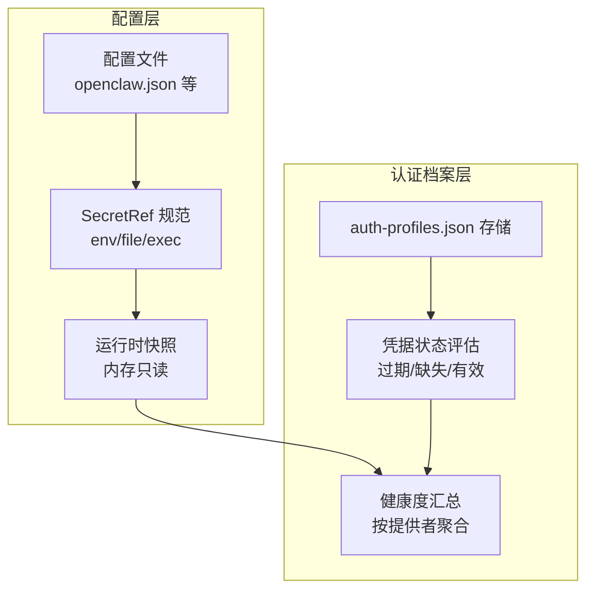
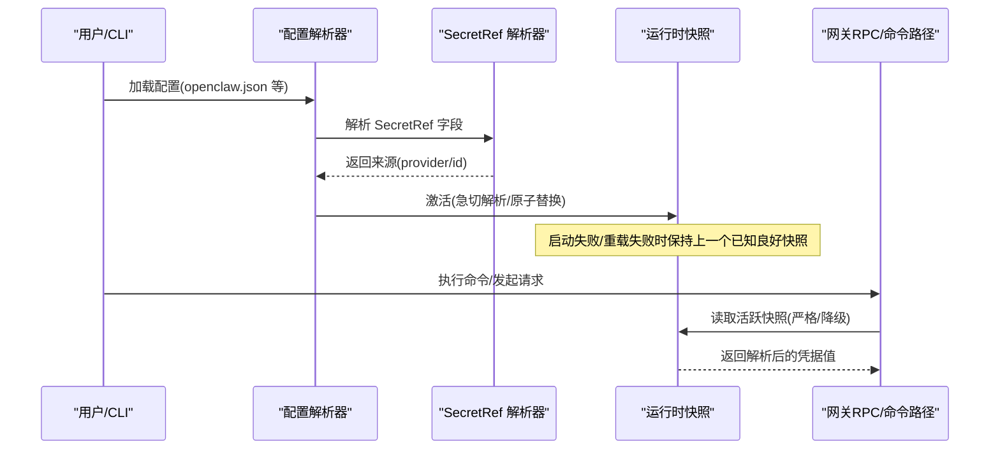
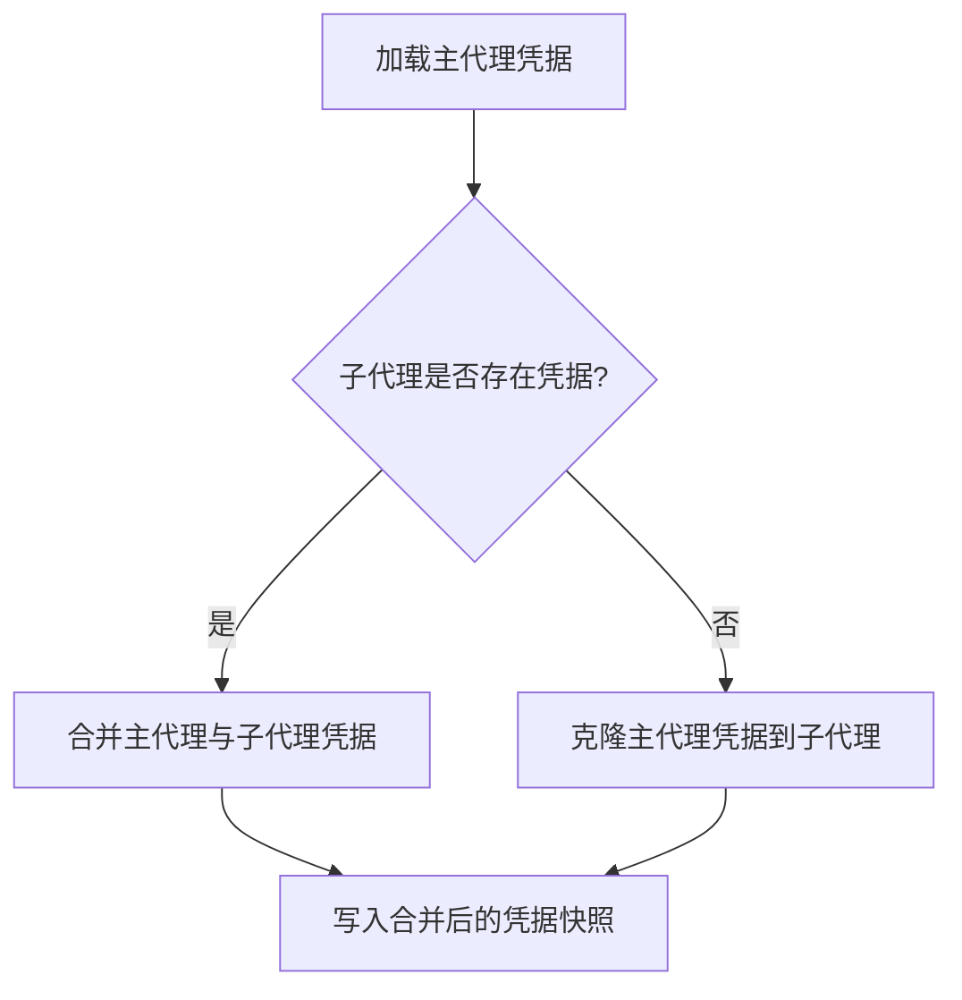
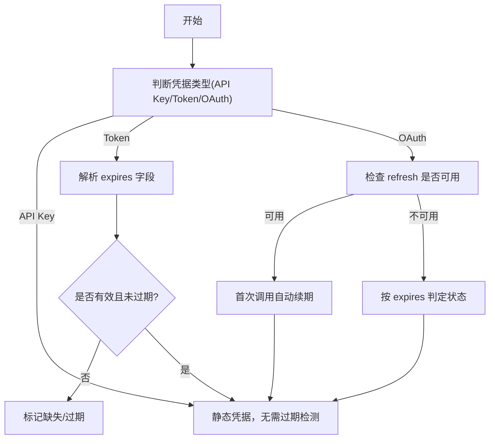
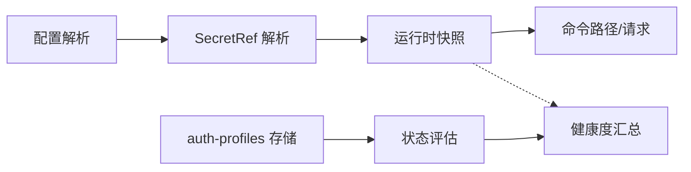

# 凭据管理

<cite>
**本文引用的文件**
- [docs/gateway/secrets.md](file://docs/gateway/secrets.md)
- [docs/reference/secretref-credential-surface.md](file://docs/reference/secretref-credential-surface.md)
- [src/config/types.secrets.ts](file://src/config/types.secrets.ts)
- [src/agents/auth-profiles/types.ts](file://src/agents/auth-profiles/types.ts)
- [src/agents/auth-profiles/store.ts](file://src/agents/auth-profiles/store.ts)
- [src/agents/auth-profiles/credential-state.ts](file://src/agents/auth-profiles/credential-state.ts)
- [src/agents/auth-health.ts](file://src/agents/auth-health.ts)
- [src/gateway/protocol/schema/secrets.ts](file://src/gateway/protocol/schema/secrets.ts)
- [src/secrets/ref-contract.ts](file://src/secrets/ref-contract.ts)
- [src/security/audit-extra.async.ts](file://src/security/audit-extra.async.ts)
</cite>

## 目录
1. [简介](#简介)
2. [项目结构](#项目结构)
3. [核心组件](#核心组件)
4. [架构总览](#架构总览)
5. [详细组件分析](#详细组件分析)
6. [依赖关系分析](#依赖关系分析)
7. [性能考量](#性能考量)
8. [故障排除指南](#故障排除指南)
9. [结论](#结论)
10. [附录](#附录)

## 简介
本文件系统性阐述 OpenClaw 的凭据管理体系，覆盖凭据存储结构、SecretRef 机制、优先级与继承规则、加密与安全存储、访问控制、凭据轮换与过期检测、自动续期策略、配置示例、安全审计与故障排除等。目标是帮助不同技术背景的读者快速理解并正确使用凭据管理能力。

## 项目结构
凭据管理涉及两大层面：
- 配置层：通过 SecretRef 将“用户提供的静态凭据”从配置中解耦，支持环境变量、文件与外部命令三种来源，并在运行时解析到内存快照。
- 认证档案层（auth-profiles）：面向代理的凭据存储与健康状态评估，支持 API Key、Bearer Token 与 OAuth 三类凭据类型，内置过期检测与自动续期逻辑。

图示来源
- [docs/gateway/secrets.md](file://docs/gateway/secrets.md#L16-L446)
- [src/config/types.secrets.ts](file://src/config/types.secrets.ts#L1-L225)
- [src/agents/auth-profiles/store.ts](file://src/agents/auth-profiles/store.ts#L1-L510)
- [src/agents/auth-profiles/credential-state.ts](file://src/agents/auth-profiles/credential-state.ts#L1-L75)
- [src/agents/auth-health.ts](file://src/agents/auth-health.ts#L1-L284)

章节来源
- [docs/gateway/secrets.md](file://docs/gateway/secrets.md#L16-L446)
- [src/config/types.secrets.ts](file://src/config/types.secrets.ts#L1-L225)
- [src/agents/auth-profiles/types.ts](file://src/agents/auth-profiles/types.ts#L1-L82)
- [src/agents/auth-profiles/store.ts](file://src/agents/auth-profiles/store.ts#L1-L510)
- [src/agents/auth-profiles/credential-state.ts](file://src/agents/auth-profiles/credential-state.ts#L1-L75)
- [src/agents/auth-health.ts](file://src/agents/auth-health.ts#L1-L284)

## 核心组件
- SecretRef 类型与解析
  - 定义 SecretRef 结构与校验规则，支持 env/file/exec 三种来源；提供解析、归一化与断言工具。
- 运行时快照与激活
  - 在启动与重载时进行“急切解析”，失败则启动失败或保持上一个已知良好快照；命令路径可选择严格或降级读取。
- 凭据存储与继承
  - auth-profiles.json 支持 API Key、Bearer Token、OAuth 三类凭据；支持主代理与子代理之间的凭据继承与合并。
- 凭据状态与健康度
  - 对 Token 与 OAuth 凭据进行过期状态判定与健康度聚合，支持“即将过期/已过期/缺失/静态”等状态。
- 凭据表面与兼容性
  - 明确支持与不支持的凭据范围，避免对会话类、旋转类凭据进行只读 SecretRef 解析。

章节来源
- [src/config/types.secrets.ts](file://src/config/types.secrets.ts#L1-L225)
- [docs/gateway/secrets.md](file://docs/gateway/secrets.md#L16-L446)
- [src/agents/auth-profiles/types.ts](file://src/agents/auth-profiles/types.ts#L1-L82)
- [src/agents/auth-profiles/store.ts](file://src/agents/auth-profiles/store.ts#L1-L510)
- [src/agents/auth-profiles/credential-state.ts](file://src/agents/auth-profiles/credential-state.ts#L1-L75)
- [src/agents/auth-health.ts](file://src/agents/auth-health.ts#L1-L284)
- [docs/reference/secretref-credential-surface.md](file://docs/reference/secretref-credential-surface.md#L1-L126)

## 架构总览
下图展示凭据从配置到运行时的全链路：

图示来源
- [docs/gateway/secrets.md](file://docs/gateway/secrets.md#L16-L446)
- [src/gateway/protocol/schema/secrets.ts](file://src/gateway/protocol/schema/secrets.ts#L1-L35)
- [src/config/types.secrets.ts](file://src/config/types.secrets.ts#L125-L174)

## 详细组件分析

### SecretRef 机制与凭据加密存储
- SecretRef 规范
  - 统一对象形状：包含 source、provider、id；支持 env/file/exec 三类来源。
  - 校验规则：对 provider 与 id 的格式进行正则约束，确保输入合法性。
- 凭据加密存储与访问控制
  - 支持将敏感凭据保存在外部密钥库或加密文件中，通过 exec provider 调用外部工具解密后返回。
  - 文件与命令路径的安全检查：在不支持 ACL 的平台上默认失败，可通过受信目录与允许的符号链接策略提升安全性。
- 命令路径解析
  - 严格路径：要求所有必需 SecretRef 可用，否则失败。
  - 降级路径：在网关不可用或解析不完整时，尝试本地回退，但不会影响启动/重载的严格契约。

章节来源
- [src/config/types.secrets.ts](file://src/config/types.secrets.ts#L1-L225)
- [src/secrets/ref-contract.ts](file://src/secrets/ref-contract.ts#L56-L71)
- [docs/gateway/secrets.md](file://docs/gateway/secrets.md#L74-L446)

### 凭据存储结构与继承规则
- auth-profiles.json 结构
  - 支持 API Key、Bearer Token、OAuth 三类凭据；每条记录包含 provider、类型字段与可选元数据。
  - 支持 per-agent 的偏好顺序覆盖与使用统计，用于轮询与冷却控制。
- 存储加载与继承
  - 主代理与子代理之间可继承凭据；子代理无凭据时可克隆主代理凭据副本。
  - 运行时快照合并：主代理与子代理凭据合并，后者覆盖前者同名键。
- 写入与清理
  - 保存时对明文凭据进行清理，仅保留引用；同时保留 order/lastGood/usageStats 等元信息。

图示来源
- [src/agents/auth-profiles/store.ts](file://src/agents/auth-profiles/store.ts#L374-L460)

章节来源
- [src/agents/auth-profiles/types.ts](file://src/agents/auth-profiles/types.ts#L1-L82)
- [src/agents/auth-profiles/store.ts](file://src/agents/auth-profiles/store.ts#L1-L510)

### 优先级排序与继承规则
- 优先级
  - 当同一路径同时存在明文与 SecretRef 时，SecretRef 具有更高优先级（在受支持的优先级路径上）。
  - 在某些兼容场景（如 Google Chat 的 serviceAccountRef），Sibling 引用优先于明文字段。
- 继承
  - 子代理可继承主代理凭据；若子代理未配置凭据，系统会自动复制主代理凭据到子代理目录。
- 认证档案优先级
  - auth-profiles.json 中的凭据可覆盖 openclaw.json 中的 SecretRef（审计与配置流程中会报告 REF_SHADOWED）。

章节来源
- [docs/gateway/secrets.md](file://docs/gateway/secrets.md#L293-L308)
- [src/agents/auth-profiles/store.ts](file://src/agents/auth-profiles/store.ts#L391-L421)
- [src/agents/auth-health.ts](file://src/agents/auth-health.ts#L171-L174)

### 凭据加密存储与访问控制
- 外部密钥库集成
  - 通过 exec provider 调用外部工具（如 1Password、Vault、sops）解密获取凭据。
  - 支持超时、输出大小限制、环境变量白名单、受信目录等安全参数。
- 文件与命令路径安全
  - 文件 provider 支持单值与 JSON 模式；Windows 平台在无法验证 ACL 时默认失败，可通过 allowInsecurePath 放宽。
  - 命令路径支持符号链接与受信目录策略，建议配合 trustedDirs 使用。

章节来源
- [docs/gateway/secrets.md](file://docs/gateway/secrets.md#L157-L173)
- [src/security/audit-extra.async.ts](file://src/security/audit-extra.async.ts#L983-L1018)

### 凭据轮换策略、过期检测与自动续期
- 过期检测
  - 对 Token 与 OAuth 凭据进行过期状态判定：缺失、无效、已过期、有效。
  - OAuth 健康度聚合：按 provider 聚合最小剩余时间与整体状态（ok/expiring/expired/missing）。
- 自动续期
  - 若存在有效的 refresh 凭据，首次调用会触发自动续期，因此对这类凭据不再警告过期。
- 命令触发重载
  - 后端凭据轮换后，通过 openclaw secrets reload 刷新运行时快照。

图示来源
- [src/agents/auth-profiles/credential-state.ts](file://src/agents/auth-profiles/credential-state.ts#L13-L75)
- [src/agents/auth-health.ts](file://src/agents/auth-health.ts#L80-L184)

章节来源
- [src/agents/auth-profiles/credential-state.ts](file://src/agents/auth-profiles/credential-state.ts#L1-L75)
- [src/agents/auth-health.ts](file://src/agents/auth-health.ts#L1-L284)

### 凭据配置示例与安全审计
- 配置示例
  - 提供 env/file/exec 三种 provider 的典型配置与集成示例（1Password、Vault、sops）。
  - 支持 secrets.configure 交互式配置与 secrets.apply 应用计划。
- 安全审计
  - audit 发现包括明文凭据、未解析引用、优先级遮蔽（auth-profiles 覆盖 openclaw.json）、遗留凭据等。
  - 安全模型：预检成功后提交、运行时激活验证、应用更新采用原子替换与最佳恢复。

章节来源
- [docs/gateway/secrets.md](file://docs/gateway/secrets.md#L361-L446)
- [docs/reference/secretref-credential-surface.md](file://docs/reference/secretref-credential-surface.md#L19-L126)

## 依赖关系分析
- 组件耦合
  - 配置层与运行时快照：配置解析器依赖 SecretRef 解析器；运行时快照仅读取，保证热路径不受密钥源故障影响。
  - 认证档案层：凭据状态评估依赖 SecretRef 解析结果；健康度汇总按 provider 聚合。
- 外部依赖
  - exec provider 依赖外部二进制与环境变量；文件 provider 依赖文件系统权限与模式。
- 接口契约
  - 网关 RPC secrets.resolve 用于命令路径解析；schema 定义了参数与结果结构。

图示来源
- [src/gateway/protocol/schema/secrets.ts](file://src/gateway/protocol/schema/secrets.ts#L1-L35)
- [src/config/types.secrets.ts](file://src/config/types.secrets.ts#L125-L174)
- [src/agents/auth-profiles/store.ts](file://src/agents/auth-profiles/store.ts#L1-L510)
- [src/agents/auth-profiles/credential-state.ts](file://src/agents/auth-profiles/credential-state.ts#L1-L75)
- [src/agents/auth-health.ts](file://src/agents/auth-health.ts#L1-L284)

章节来源
- [src/gateway/protocol/schema/secrets.ts](file://src/gateway/protocol/schema/secrets.ts#L1-L35)
- [src/config/types.secrets.ts](file://src/config/types.secrets.ts#L1-L225)
- [src/agents/auth-profiles/store.ts](file://src/agents/auth-profiles/store.ts#L1-L510)
- [src/agents/auth-profiles/credential-state.ts](file://src/agents/auth-profiles/credential-state.ts#L1-L75)
- [src/agents/auth-health.ts](file://src/agents/auth-health.ts#L1-L284)

## 性能考量
- 急切解析与原子替换
  - 启动与重载阶段进行急切解析，避免在热路径上触发 IO 或外部调用。
- 并发与批处理
  - 支持最大并发、每提供者的最大引用数与批量字节数限制，防止资源滥用。
- 降级读取
  - 读取命令路径在网关不可用时可降级，避免阻塞 CLI/Doctor 流程。

章节来源
- [docs/gateway/secrets.md](file://docs/gateway/secrets.md#L14-L446)

## 故障排除指南
- 启动/重载失败
  - 症状：启动失败或重载失败。
  - 排查：确认 SecretRef 是否在当前生效面；检查 provider 配置与权限；查看日志中的 SECRETS_RELOADER_DEGRADED/RECOVERED 事件。
- 未解析引用
  - 症状：命令报错提示未解析的 SecretRef。
  - 排查：确保在活跃快照下执行命令；检查 provider id 与格式；确认环境变量/文件/命令可访问。
- 优先级遮蔽
  - 症状：auth-profiles.json 中的凭据覆盖了 openclaw.json 的 SecretRef。
  - 排查：使用审计命令检查 REF_SHADOWED；必要时调整 auth-profiles 或移除冗余明文。
- 权限问题
  - 症状：文件/命令路径无法读取或被拒绝。
  - 排查：检查文件权限与 ACL；在 Windows 上考虑 allowInsecurePath；为命令路径设置 trustedDirs 与符号链接策略。

章节来源
- [docs/gateway/secrets.md](file://docs/gateway/secrets.md#L324-L446)
- [src/security/audit-extra.async.ts](file://src/security/audit-extra.async.ts#L983-L1018)

## 结论
OpenClaw 的凭据管理以 SecretRef 为核心，结合运行时快照与严格的激活契约，实现了“明文不落地、来源可审计、过期可检测、自动可续期”的安全凭据生命周期管理。通过清晰的优先级与继承规则、完善的审计与配置流程，以及对 exec/file/env 三类来源的安全策略，系统在易用性与安全性之间取得了平衡。

## 附录
- 支持的凭据表面
  - 列表覆盖 openclaw.json 与 auth-profiles.json 的关键凭据字段；明确不支持的旋转/会话类凭据。
- 关键流程参考
  - SecretRef 合同与校验规则
  - 运行时快照激活与命令路径解析
  - 凭据状态评估与健康度汇总

章节来源
- [docs/reference/secretref-credential-surface.md](file://docs/reference/secretref-credential-surface.md#L19-L126)
- [src/secrets/ref-contract.ts](file://src/secrets/ref-contract.ts#L56-L71)
- [docs/gateway/secrets.md](file://docs/gateway/secrets.md#L16-L446)
- [src/agents/auth-health.ts](file://src/agents/auth-health.ts#L187-L284)