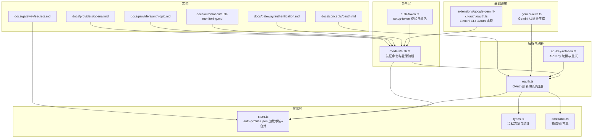
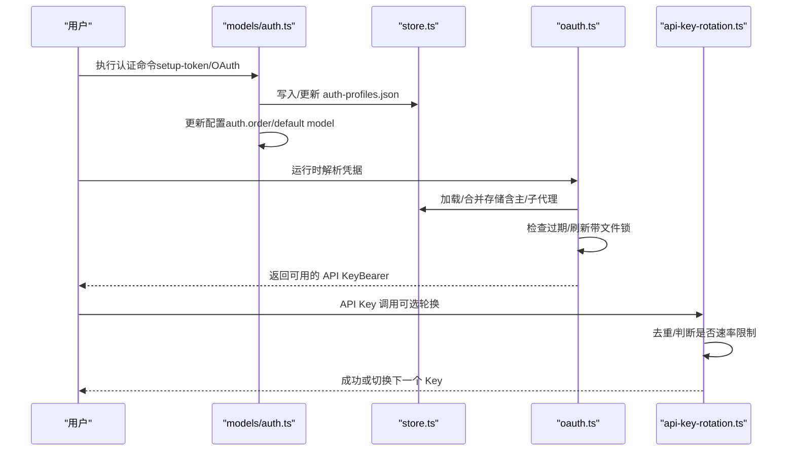
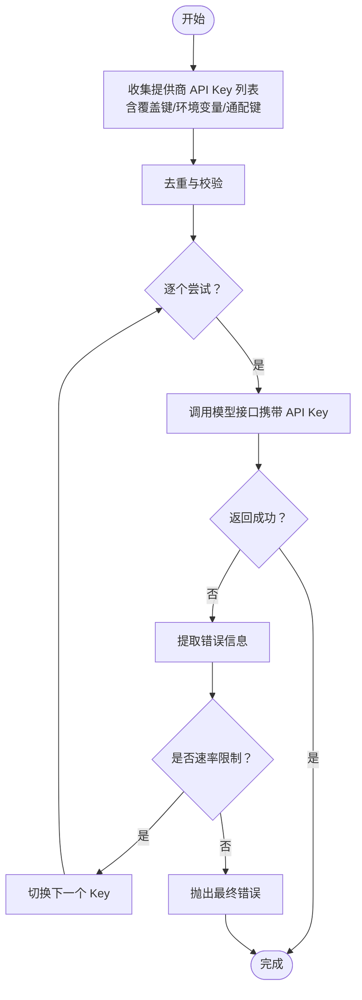
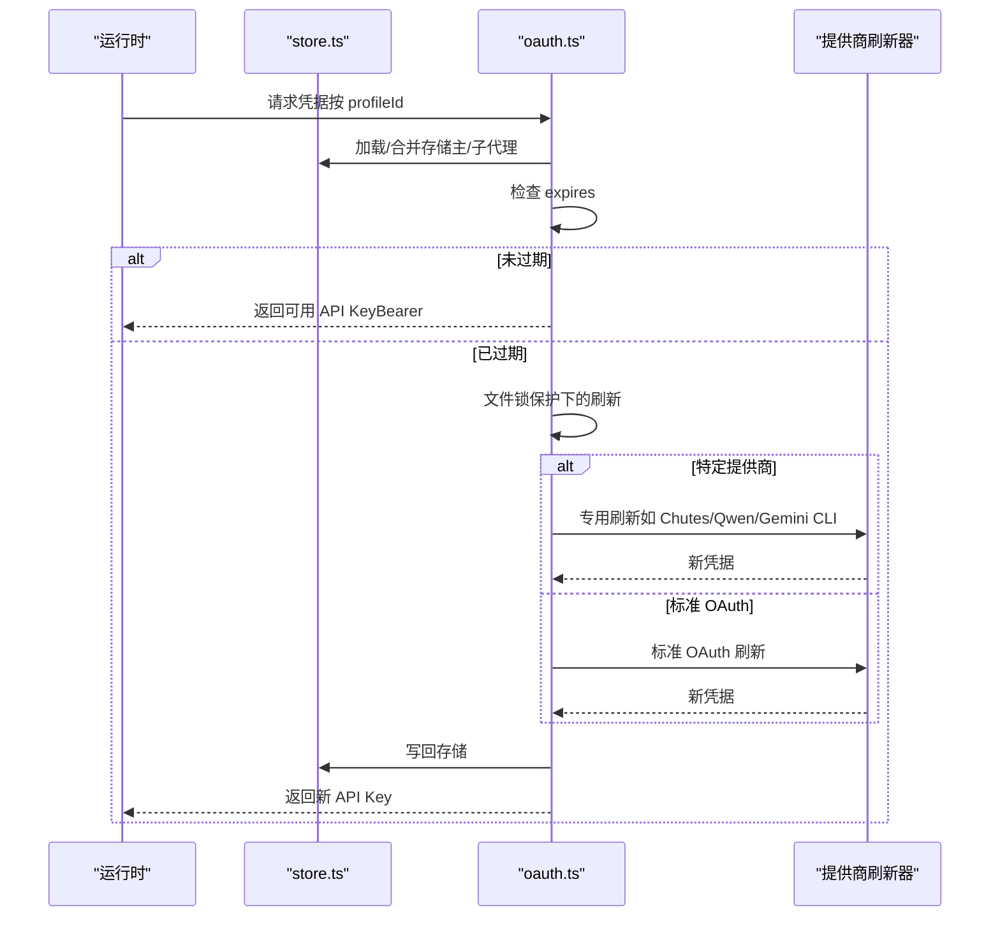
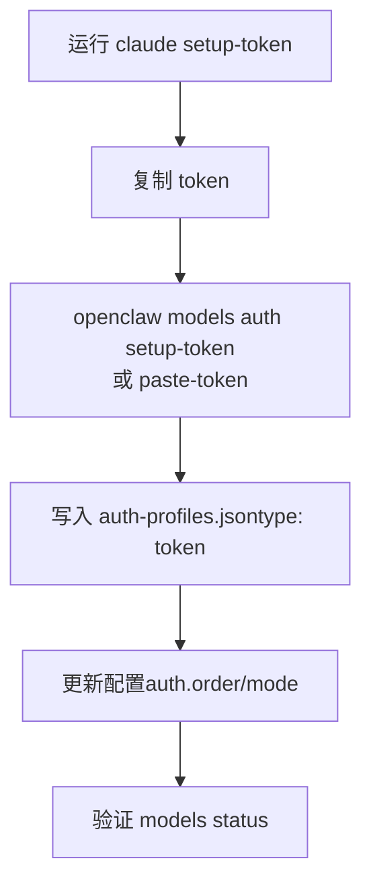
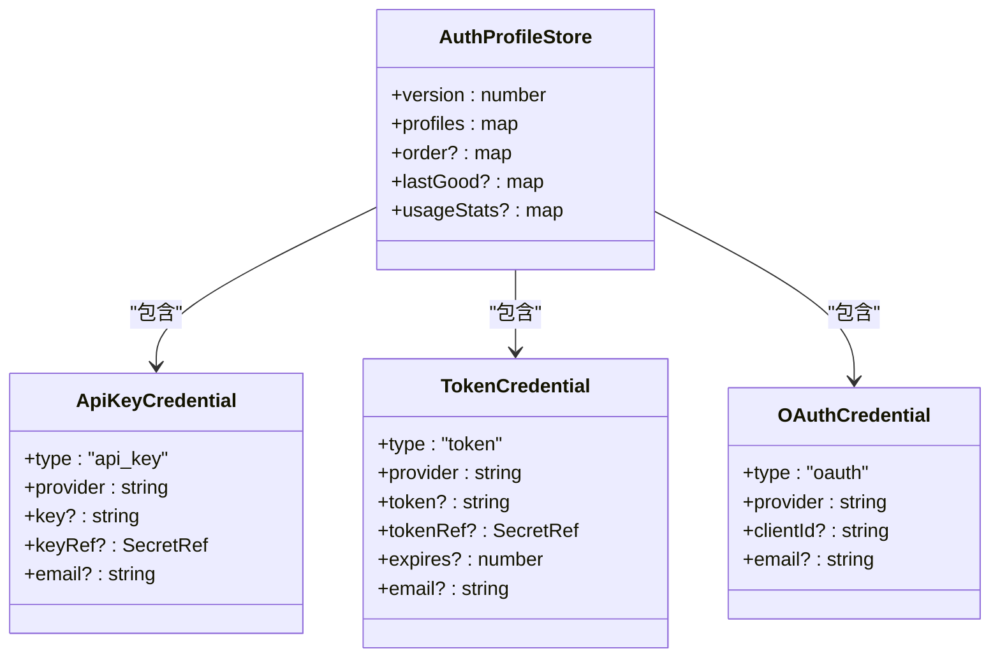
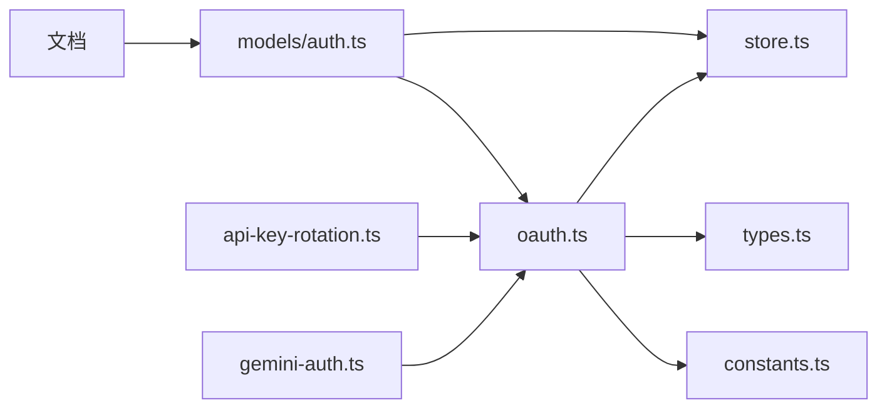

# 模型认证机制

<cite>
**本文引用的文件**
- [oauth.ts](file://src/agents/auth-profiles/oauth.ts)
- [auth.ts](file://src/commands/models/auth.ts)
- [store.ts](file://src/agents/auth-profiles/store.ts)
- [types.ts](file://src/agents/auth-profiles/types.ts)
- [constants.ts](file://src/agents/auth-profiles/constants.ts)
- [auth-token.ts](file://src/commands/auth-token.ts)
- [api-key-rotation.ts](file://src/agents/api-key-rotation.ts)
- [authentication.md](file://docs/gateway/authentication.md)
- [oauth.md](file://docs/concepts/oauth.md)
- [anthropic.md](file://docs/providers/anthropic.md)
- [openai.md](file://docs/providers/openai.md)
- [secrets.md](file://docs/gateway/secrets.md)
- [auth-monitoring.md](file://docs/automation/auth-monitoring.md)
- [gemini-auth.ts](file://src/infra/gemini-auth.ts)
- [oauth.ts（Google Gemini CLI）](file://extensions/google-gemini-cli-auth/oauth.ts)
</cite>

## 目录
1. [简介](#简介)
2. [项目结构](#项目结构)
3. [核心组件](#核心组件)
4. [架构总览](#架构总览)
5. [详细组件分析](#详细组件分析)
6. [依赖关系分析](#依赖关系分析)
7. [性能考虑](#性能考虑)
8. [故障排除指南](#故障排除指南)
9. [结论](#结论)
10. [附录](#附录)

## 简介
本文件系统性阐述 OpenClaw 的模型认证机制，覆盖三类认证方式：API 密钥认证、OAuth 认证与 setup-token 认证。内容包括认证配置流程、凭据存储与同步、认证轮换策略、多提供商适配（Anthropic、OpenAI、Google 等）、故障排除、安全最佳实践与性能优化建议。目标是帮助开发者与运维人员在不同场景下正确配置与维护认证，确保稳定、安全与高性能的模型访问。

## 项目结构
围绕认证的核心代码与文档分布如下：
- 命令层：提供认证命令入口与交互式登录流程
- 存储层：负责认证资料的持久化、合并与运行时快照
- 解析层：解析与构建 API Key、OAuth 凭据、令牌过期状态
- 轮换层：针对 API Key 的轮换与重试策略
- 文档层：认证与提供商使用说明、监控与排障指南

图表来源
- [auth.ts](file://src/commands/models/auth.ts#L1-L451)
- [oauth.ts](file://src/agents/auth-profiles/oauth.ts#L1-L492)
- [store.ts](file://src/agents/auth-profiles/store.ts#L1-L510)
- [types.ts](file://src/agents/auth-profiles/types.ts#L1-L82)
- [constants.ts](file://src/agents/auth-profiles/constants.ts#L1-L27)
- [auth-token.ts](file://src/commands/auth-token.ts#L1-L39)
- [api-key-rotation.ts](file://src/agents/api-key-rotation.ts#L1-L72)
- [gemini-auth.ts](file://src/infra/gemini-auth.ts#L1-L40)
- [oauth.ts（Google Gemini CLI）](file://extensions/google-gemini-cli-auth/oauth.ts#L1-L200)
- [authentication.md](file://docs/gateway/authentication.md#L1-L180)
- [oauth.md](file://docs/concepts/oauth.md#L1-L159)
- [secrets.md](file://docs/gateway/secrets.md#L1-L446)
- [auth-monitoring.md](file://docs/automation/auth-monitoring.md#L1-L45)
- [anthropic.md](file://docs/providers/anthropic.md#L1-L232)
- [openai.md](file://docs/providers/openai.md#L1-L246)

章节来源
- [auth.ts](file://src/commands/models/auth.ts#L1-L451)
- [oauth.ts](file://src/agents/auth-profiles/oauth.ts#L1-L492)
- [store.ts](file://src/agents/auth-profiles/store.ts#L1-L510)
- [types.ts](file://src/agents/auth-profiles/types.ts#L1-L82)
- [constants.ts](file://src/agents/auth-profiles/constants.ts#L1-L27)
- [auth-token.ts](file://src/commands/auth-token.ts#L1-L39)
- [api-key-rotation.ts](file://src/agents/api-key-rotation.ts#L1-L72)
- [gemini-auth.ts](file://src/infra/gemini-auth.ts#L1-L40)
- [oauth.ts（Google Gemini CLI）](file://extensions/google-gemini-cli-auth/oauth.ts#L1-L200)
- [authentication.md](file://docs/gateway/authentication.md#L1-L180)
- [oauth.md](file://docs/concepts/oauth.md#L1-L159)
- [secrets.md](file://docs/gateway/secrets.md#L1-L446)
- [auth-monitoring.md](file://docs/automation/auth-monitoring.md#L1-L45)
- [anthropic.md](file://docs/providers/anthropic.md#L1-L232)
- [openai.md](file://docs/providers/openai.md#L1-L246)

## 核心组件
- 认证命令与登录流程：提供 setup-token、粘贴 token、OAuth 登录等交互式能力，并写入 auth-profiles.json 与配置。
- 认证存储与合并：统一加载/保存 auth-profiles.json；支持主代理与子代理继承与合并；兼容旧版 auth.json。
- 凭据类型与统计：定义 api_key、token、oauth 三种类型及使用统计，用于轮换与冷却控制。
- OAuth 解析与刷新：按需自动刷新 OAuth 凭据，处理过期、兼容模式与回退逻辑。
- API Key 轮换：对同一提供商的多个 API Key 进行去重与轮换，仅在速率限制错误时切换。
- 基础设施与提供商适配：Gemini 认证头生成、Google Gemini CLI OAuth 流程等。

章节来源
- [auth.ts](file://src/commands/models/auth.ts#L74-L123)
- [store.ts](file://src/agents/auth-profiles/store.ts#L346-L460)
- [types.ts](file://src/agents/auth-profiles/types.ts#L5-L82)
- [oauth.ts](file://src/agents/auth-profiles/oauth.ts#L158-L256)
- [api-key-rotation.ts](file://src/agents/api-key-rotation.ts#L40-L72)
- [gemini-auth.ts](file://src/infra/gemini-auth.ts#L15-L40)
- [oauth.ts（Google Gemini CLI）](file://extensions/google-gemini-cli-auth/oauth.ts#L398-L441)

## 架构总览
OpenClaw 的认证体系由“命令层—存储层—解析层—轮换层—基础设施”构成，形成闭环：命令层触发认证动作并写入存储；存储层保证并发安全与跨代理合并；解析层负责凭据有效性与刷新；轮换层在 API Key 场景下进行容错；基础设施提供特定提供商的适配。

图表来源
- [auth.ts](file://src/commands/models/auth.ts#L74-L123)
- [store.ts](file://src/agents/auth-profiles/store.ts#L443-L460)
- [oauth.ts](file://src/agents/auth-profiles/oauth.ts#L217-L256)
- [api-key-rotation.ts](file://src/agents/api-key-rotation.ts#L40-L72)

## 详细组件分析

### API 密钥认证
- 配置与优先级
  - 支持单个覆盖键、列表键、通配键与 Google 特有键，按优先级顺序解析并去重。
  - 仅在速率限制错误时自动切换到下一个 Key。
- 使用场景
  - 长期网关主机推荐使用 API Key；支持 SecretRef 存储与运行时快照激活。
- 安全与合规
  - SecretRef 可配置 env/file/exec 提供商，启动失败快速终止，避免泄露明文。
  - 运行时读取来自活动快照，命令路径可选择严格或降级读取。

图表来源
- [api-key-rotation.ts](file://src/agents/api-key-rotation.ts#L32-L72)
- [authentication.md](file://docs/gateway/authentication.md#L123-L139)
- [secrets.md](file://docs/gateway/secrets.md#L1-L446)

章节来源
- [api-key-rotation.ts](file://src/agents/api-key-rotation.ts#L1-L72)
- [authentication.md](file://docs/gateway/authentication.md#L123-L139)
- [secrets.md](file://docs/gateway/secrets.md#L1-L446)

### OAuth 认证
- 存储与布局
  - 每个代理独立存储 auth-profiles.json；支持主代理凭据继承到子代理。
  - 兼容旧版 auth.json 与外部 CLI 同步（如 Claude Code、Codex）。
- 刷新与过期
  - 若未过期直接使用；过期则在文件锁保护下刷新并写回；支持特定提供商的专用刷新逻辑。
  - 对 OpenAI Codex 在特定错误条件下提供访问令牌回退。
- 多账户与路由
  - 支持多 profile（同一提供商），通过全局配置或会话级覆盖选择。
- 令牌交换与回调
  - OpenAI Codex 使用 PKCE；远程/无头环境支持手动粘贴回调 URL。

图表来源
- [oauth.ts](file://src/agents/auth-profiles/oauth.ts#L158-L256)
- [store.ts](file://src/agents/auth-profiles/store.ts#L374-L460)
- [oauth.md](file://docs/concepts/oauth.md#L83-L122)

章节来源
- [oauth.ts](file://src/agents/auth-profiles/oauth.ts#L1-L492)
- [store.ts](file://src/agents/auth-profiles/store.ts#L1-L510)
- [oauth.md](file://docs/concepts/oauth.md#L1-L159)

### Setup-token 认证（Anthropic）
- 适用场景
  - 使用 Claude 订阅账号而非 API Key；适合需要订阅权限的场景。
- 配置流程
  - 在网关主机上运行 Claude CLI 获取 setup-token，再粘贴到 OpenClaw。
  - 支持向导与命令行两种方式；也可手动粘贴 token 并指定过期时间。
- 注意事项
  - Anthropic 对订阅外用（非 Claude Code）曾有限制，使用前请自行确认政策。

图表来源
- [auth.ts](file://src/commands/models/auth.ts#L74-L123)
- [auth-token.ts](file://src/commands/auth-token.ts#L26-L39)
- [authentication.md](file://docs/gateway/authentication.md#L58-L98)
- [anthropic.md](file://docs/providers/anthropic.md#L161-L198)

章节来源
- [auth.ts](file://src/commands/models/auth.ts#L74-L123)
- [auth-token.ts](file://src/commands/auth-token.ts#L1-L39)
- [authentication.md](file://docs/gateway/authentication.md#L58-L98)
- [anthropic.md](file://docs/providers/anthropic.md#L161-L198)

### 凭据存储与同步
- 存储位置
  - 每个代理目录下独立存储 auth-profiles.json；兼容旧版 auth.json；支持外部 CLI 同步。
- 运行时行为
  - 主代理凭据可继承到子代理；运行时快照合并；支持只读加载（Secrets 运行时）。
- SecretRef 支持
  - env/file/exec 提供商；启动失败快速终止；命令路径可选择严格或降级读取。

图表来源
- [types.ts](file://src/agents/auth-profiles/types.ts#L5-L82)
- [store.ts](file://src/agents/auth-profiles/store.ts#L484-L510)
- [secrets.md](file://docs/gateway/secrets.md#L1-L446)

章节来源
- [store.ts](file://src/agents/auth-profiles/store.ts#L1-L510)
- [types.ts](file://src/agents/auth-profiles/types.ts#L1-L82)
- [secrets.md](file://docs/gateway/secrets.md#L1-L446)

### 认证轮换策略
- API Key 轮换
  - 自动收集同一提供商的多个 Key，去重后按顺序尝试；仅在速率限制错误时切换。
- OAuth 回退
  - 特定错误条件下回退到缓存的访问令牌；主代理凭据继承到子代理。
- 多账户路由
  - 通过 auth.order 或会话级覆盖选择不同 profile。

章节来源
- [api-key-rotation.ts](file://src/agents/api-key-rotation.ts#L1-L72)
- [oauth.ts](file://src/agents/auth-profiles/oauth.ts#L434-L476)
- [oauth.md](file://docs/concepts/oauth.md#L123-L159)

### 多提供商认证配置示例

#### Anthropic（API Key 与 Setup-token）
- API Key：在网关主机设置环境变量或使用向导导入。
- Setup-token：在 Claude CLI 生成 token，粘贴到 OpenClaw。

章节来源
- [anthropic.md](file://docs/providers/anthropic.md#L14-L198)
- [authentication.md](file://docs/gateway/authentication.md#L21-L98)

#### OpenAI（API Key 与 Codex OAuth）
- API Key：平台直连；支持 SecretRef。
- Codex OAuth：通过内置流程登录，支持远程/无头环境手动回调。

章节来源
- [openai.md](file://docs/providers/openai.md#L15-L101)
- [auth.ts](file://src/commands/models/auth.ts#L280-L323)

#### Google（Gemini API Key 与 Gemini CLI OAuth）
- API Key：传统 x-goog-api-key 头。
- OAuth：Gemini CLI OAuth，自动发现客户端、PKCE 交换、项目 ID 发现与邮箱获取。

章节来源
- [gemini-auth.ts](file://src/infra/gemini-auth.ts#L15-L40)
- [oauth.ts（Google Gemini CLI）](file://extensions/google-gemini-cli-auth/oauth.ts#L398-L441)
- [oauth.md](file://docs/concepts/oauth.md#L101-L109)

## 依赖关系分析
- 命令层依赖存储层写入与合并；依赖解析层提供可用 API Key。
- 解析层依赖存储层与类型定义；在刷新时依赖提供商专用刷新器。
- 轮换层依赖解析层返回的 API Key 与错误信息。
- 文档层为命令与流程提供规范与示例。

图表来源
- [auth.ts](file://src/commands/models/auth.ts#L1-L451)
- [oauth.ts](file://src/agents/auth-profiles/oauth.ts#L1-L492)
- [store.ts](file://src/agents/auth-profiles/store.ts#L1-L510)
- [types.ts](file://src/agents/auth-profiles/types.ts#L1-L82)
- [constants.ts](file://src/agents/auth-profiles/constants.ts#L1-L27)
- [api-key-rotation.ts](file://src/agents/api-key-rotation.ts#L1-L72)
- [gemini-auth.ts](file://src/infra/gemini-auth.ts#L1-L40)
- [authentication.md](file://docs/gateway/authentication.md#L1-L180)
- [oauth.md](file://docs/concepts/oauth.md#L1-L159)

章节来源
- [auth.ts](file://src/commands/models/auth.ts#L1-L451)
- [oauth.ts](file://src/agents/auth-profiles/oauth.ts#L1-L492)
- [store.ts](file://src/agents/auth-profiles/store.ts#L1-L510)
- [types.ts](file://src/agents/auth-profiles/types.ts#L1-L82)
- [constants.ts](file://src/agents/auth-profiles/constants.ts#L1-L27)
- [api-key-rotation.ts](file://src/agents/api-key-rotation.ts#L1-L72)
- [gemini-auth.ts](file://src/infra/gemini-auth.ts#L1-L40)
- [authentication.md](file://docs/gateway/authentication.md#L1-L180)
- [oauth.md](file://docs/concepts/oauth.md#L1-L159)

## 性能考虑
- 文件锁与原子写：存储操作使用文件锁与原子替换，减少竞争与损坏风险。
- 运行时快照：Secrets 运行时采用内存快照，避免热路径上的外部依赖抖动。
- 轮换策略：仅在速率限制错误时切换 Key，降低不必要的重试成本。
- OAuth 刷新：按需刷新并在锁内执行，避免并发冲突导致的重复刷新。

章节来源
- [store.ts](file://src/agents/auth-profiles/store.ts#L80-L99)
- [constants.ts](file://src/agents/auth-profiles/constants.ts#L12-L21)
- [secrets.md](file://docs/gateway/secrets.md#L16-L26)
- [api-key-rotation.ts](file://src/agents/api-key-rotation.ts#L56-L65)

## 故障排除指南
- “无可用凭据/凭据缺失”
  - 检查 models status；确认网关主机上已粘贴 setup-token 或 API Key。
- “令牌即将到期/已过期”
  - 使用 models status --check 获取退出码；结合自动化脚本定时告警。
- “OAuth 刷新失败”
  - 尝试重新登录；对于特定提供商使用访问令牌回退；检查主代理凭据继承。
- “401/403 错误”
  - 检查 Key 是否被撤销；必要时更换 Key 或重新授权。

章节来源
- [authentication.md](file://docs/gateway/authentication.md#L160-L179)
- [auth-monitoring.md](file://docs/automation/auth-monitoring.md#L14-L26)
- [oauth.ts](file://src/agents/auth-profiles/oauth.ts#L402-L490)

## 结论
OpenClaw 的认证机制以“命令—存储—解析—轮换—基础设施”协同工作，既满足长期稳定运行的 API Key 场景，也覆盖 OAuth 与订阅型 setup-token 的灵活性需求。通过 SecretRef、文件锁、运行时快照与智能轮换，系统在安全性、可靠性与性能之间取得平衡。建议在生产环境中优先使用 API Key 并配合 SecretRef 管理，在需要订阅权限时谨慎使用 Anthropic setup-token，并通过自动化监控与告警保障认证健康。

## 附录
- 相关文档
  - 认证与提供商使用：[Authentication](file://docs/gateway/authentication.md#L1-L180)、[OAuth](file://docs/concepts/oauth.md#L1-L159)、[Anthropic](file://docs/providers/anthropic.md#L1-L232)、[OpenAI](file://docs/providers/openai.md#L1-L246)
  - Secrets 管理：[Secrets Management](file://docs/gateway/secrets.md#L1-L446)
  - 认证监控：[Auth Monitoring](file://docs/automation/auth-monitoring.md#L1-L45)