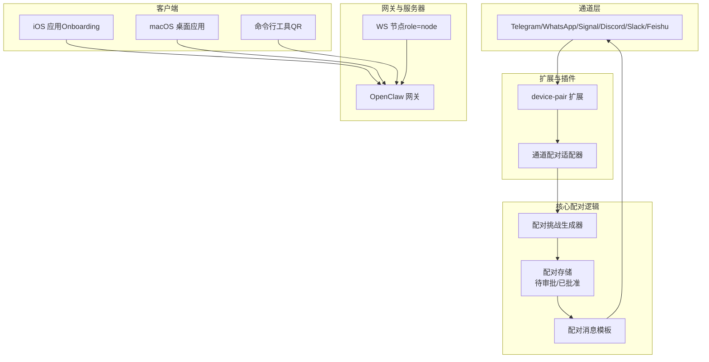
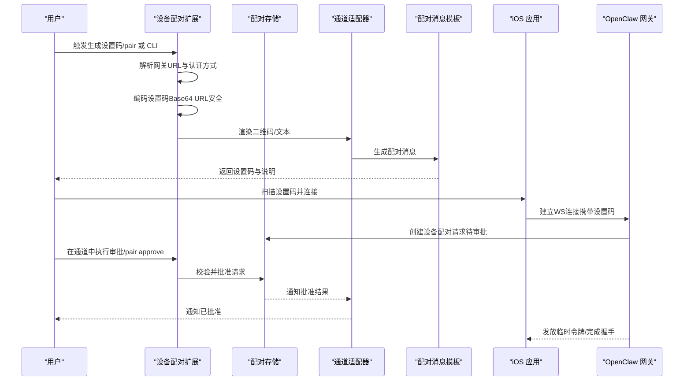
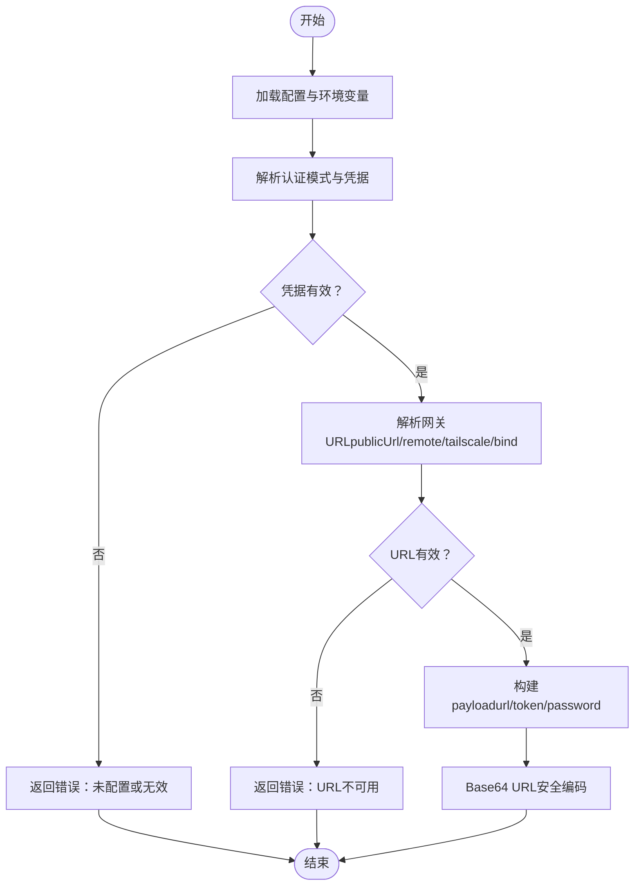
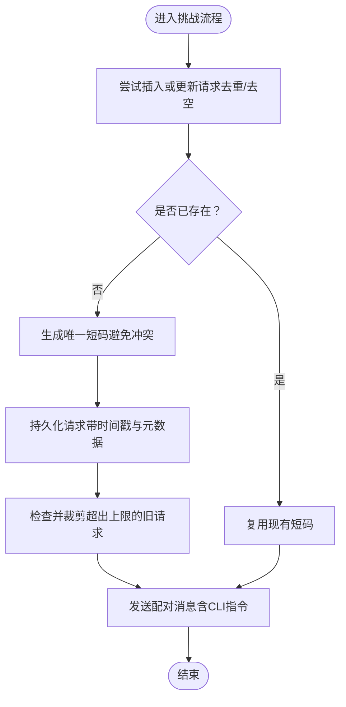
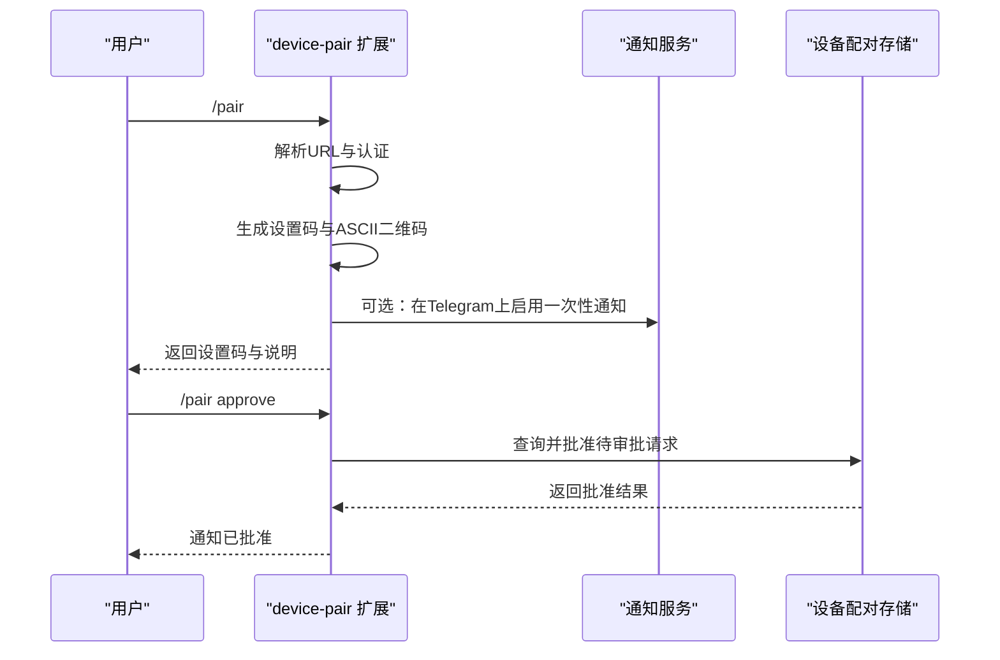
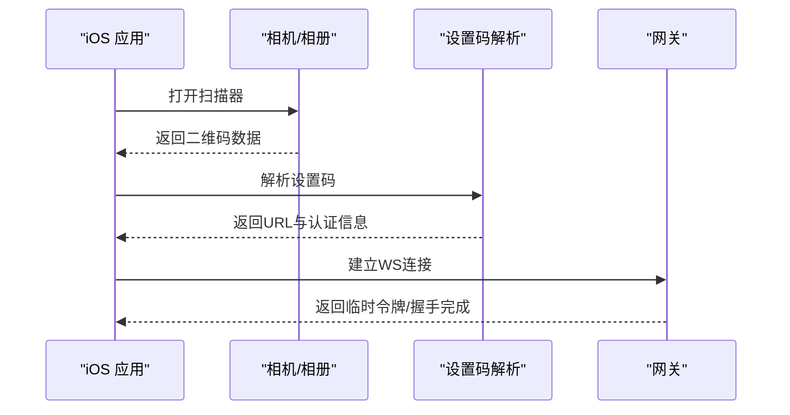
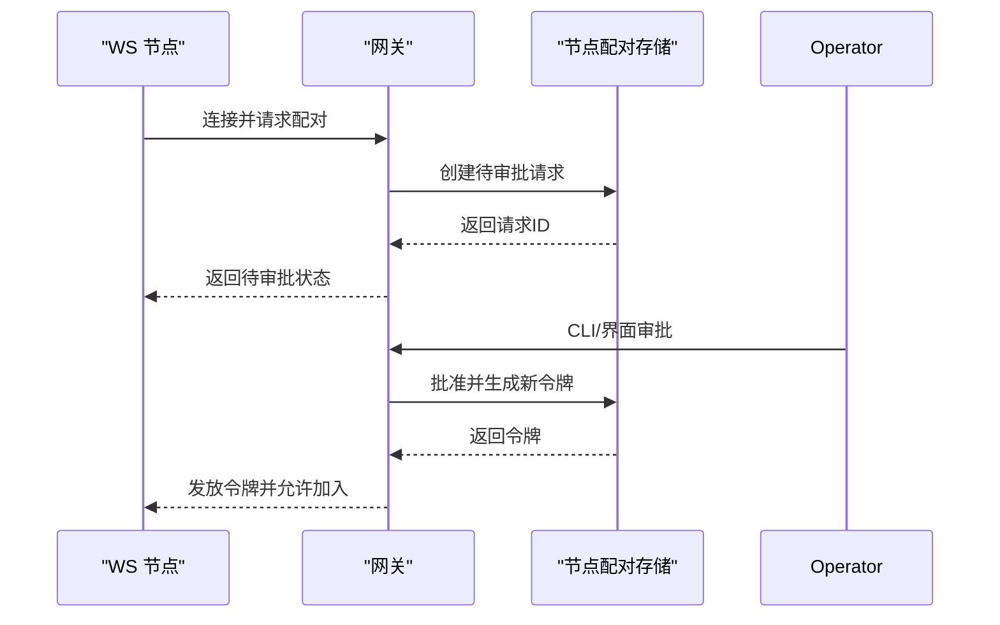
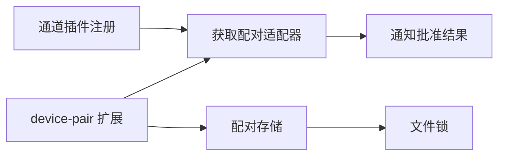

# 设备配对协议

<cite>
**本文引用的文件**
- [src/pairing/setup-code.ts](file://src/pairing/setup-code.ts)
- [src/pairing/pairing-challenge.ts](file://src/pairing/pairing-challenge.ts)
- [src/pairing/pairing-store.ts](file://src/pairing/pairing-store.ts)
- [src/pairing/pairing-messages.ts](file://src/pairing/pairing-messages.ts)
- [extensions/device-pair/index.ts](file://extensions/device-pair/index.ts)
- [apps/ios/Sources/Onboarding/OnboardingWizardView.swift](file://apps/ios/Sources/Onboarding/OnboardingWizardView.swift)
- [src/cli/qr-cli.ts](file://src/cli/qr-cli.ts)
- [docs/channels/pairing.md](file://docs/channels/pairing.md)
- [docs/gateway/pairing.md](file://docs/gateway/pairing.md)
- [docs/cli/pairing.md](file://docs/cli/pairing.md)
- [src/channels/plugins/pairing.ts](file://src/channels/plugins/pairing.ts)
</cite>

## 目录
1. [简介](#简介)
2. [项目结构](#项目结构)
3. [核心组件](#核心组件)
4. [架构总览](#架构总览)
5. [详细组件分析](#详细组件分析)
6. [依赖关系分析](#依赖关系分析)
7. [性能考量](#性能考量)
8. [故障排除指南](#故障排除指南)
9. [结论](#结论)
10. [附录](#附录)

## 简介
本文件系统性阐述 OpenClaw 的设备配对协议，覆盖设备发现与连接、安全握手与信任建立、QR 码配对、PIN 码验证、证书与令牌交换等关键流程。文档同时面向移动设备（iOS）、桌面应用（macOS）与服务器节点（WS 客户端），并提供跨平台实现要点、安全验证与会话管理建议，以及常见问题排查方法。

## 项目结构
OpenClaw 将配对能力拆分为“通道级 DM 配对”和“设备级节点配对”两类：
- 通道级 DM 配对：通过消息通道（如 Telegram、WhatsApp 等）进行入站消息访问控制，采用一次性短码（8 字母数字，不含易混淆字符）进行审批。
- 设备级节点配对：用于移动端/桌面/无头节点首次接入网关，生成可扫描的“设置码”，随后在服务端审批后完成握手与会话建立。

图表来源
- [extensions/device-pair/index.ts](file://extensions/device-pair/index.ts#L326-L549)
- [src/pairing/pairing-challenge.ts](file://src/pairing/pairing-challenge.ts#L24-L48)
- [src/pairing/pairing-store.ts](file://src/pairing/pairing-store.ts#L649-L789)
- [src/pairing/pairing-messages.ts](file://src/pairing/pairing-messages.ts#L4-L20)
- [apps/ios/Sources/Onboarding/OnboardingWizardView.swift](file://apps/ios/Sources/Onboarding/OnboardingWizardView.swift#L661-L722)
- [src/cli/qr-cli.ts](file://src/cli/qr-cli.ts#L231-L280)

章节来源
- [docs/channels/pairing.md](file://docs/channels/pairing.md#L10-L111)
- [docs/gateway/pairing.md](file://docs/gateway/pairing.md#L10-L100)

## 核心组件
- 设置码生成与解析：负责从配置中解析网关地址、认证方式，并编码为可扫描的设置码。
- 配对挑战与消息：统一生成一次性短码、构建回复消息模板，确保跨通道一致性。
- 配对存储：维护待审批请求与已批准允许列表，支持账户隔离与过期清理。
- 设备配对扩展：在消息通道内生成设置码、渲染二维码、处理审批与通知。
- 客户端集成：iOS/macOS/CLI 读取设置码、发起连接、触发自动重连与状态恢复。
- 网关与节点：WS 节点以 role=node 连接，经由网关审批后获得令牌并建立会话。

章节来源
- [src/pairing/setup-code.ts](file://src/pairing/setup-code.ts#L16-L52)
- [src/pairing/pairing-challenge.ts](file://src/pairing/pairing-challenge.ts#L5-L18)
- [src/pairing/pairing-store.ts](file://src/pairing/pairing-store.ts#L13-L50)
- [extensions/device-pair/index.ts](file://extensions/device-pair/index.ts#L28-L50)
- [src/pairing/pairing-messages.ts](file://src/pairing/pairing-messages.ts#L4-L20)

## 架构总览
下图展示从“生成设置码”到“客户端扫码连接”再到“服务端审批”的完整链路，以及 iOS/macOS/CLI 的交互位置。

图表来源
- [extensions/device-pair/index.ts](file://extensions/device-pair/index.ts#L396-L431)
- [src/pairing/pairing-store.ts](file://src/pairing/pairing-store.ts#L689-L789)
- [src/pairing/pairing-messages.ts](file://src/pairing/pairing-messages.ts#L4-L20)
- [apps/ios/Sources/Onboarding/OnboardingWizardView.swift](file://apps/ios/Sources/Onboarding/OnboardingWizardView.swift#L708-L722)

章节来源
- [docs/channels/pairing.md](file://docs/channels/pairing.md#L57-L98)
- [docs/gateway/pairing.md](file://docs/gateway/pairing.md#L27-L67)

## 详细组件分析

### 组件A：设置码生成与解析
- 功能职责
  - 从配置解析网关 URL（支持本地绑定、远程、Tailscale、显式 publicUrl）。
  - 从配置解析认证模式（token/password），并进行环境变量优先级处理。
  - 将 URL 与认证信息打包为 JSON，再进行 Base64 URL 安全编码，去除填充字符。
- 关键点
  - URL 规范化：支持 http/https 自动转 ws/wss；非法格式直接报错。
  - 认证选择：若配置为 token/password，则必须提供对应凭据；否则回退到另一可用模式。
  - 存储与回写：生成的 payload 仅在内存中使用，不落盘。
- 复杂度
  - 时间复杂度 O(1)，空间复杂度 O(1)。

图表来源
- [src/pairing/setup-code.ts](file://src/pairing/setup-code.ts#L158-L197)
- [src/pairing/setup-code.ts](file://src/pairing/setup-code.ts#L299-L359)
- [src/pairing/setup-code.ts](file://src/pairing/setup-code.ts#L367-L407)

章节来源
- [src/pairing/setup-code.ts](file://src/pairing/setup-code.ts#L16-L52)
- [src/pairing/setup-code.ts](file://src/pairing/setup-code.ts#L361-L407)

### 组件B：配对挑战与消息模板
- 功能职责
  - 为 DM 配对策略提供统一的挑战生成流程：不存在则创建并返回一次性短码；存在则按需复用。
  - 提供消息模板函数，输出标准化的配对提示与 CLI 操作指引。
- 关键点
  - 短码长度与字符集：8 个字符，不含 0O1I，提升可读性与安全性。
  - TTL 与上限：默认每通道每小时最多保留 3 个待审批请求，超时自动清理。
  - 元数据：支持附加 accountId 等元信息，便于多账户隔离。
- 复杂度
  - 时间复杂度 O(n)（n 为当前待审批请求数），空间复杂度 O(n)。

图表来源
- [src/pairing/pairing-challenge.ts](file://src/pairing/pairing-challenge.ts#L24-L48)
- [src/pairing/pairing-store.ts](file://src/pairing/pairing-store.ts#L689-L789)
- [src/pairing/pairing-messages.ts](file://src/pairing/pairing-messages.ts#L4-L20)

章节来源
- [src/pairing/pairing-challenge.ts](file://src/pairing/pairing-challenge.ts#L5-L18)
- [src/pairing/pairing-store.ts](file://src/pairing/pairing-store.ts#L13-L50)
- [src/pairing/pairing-messages.ts](file://src/pairing/pairing-messages.ts#L4-L20)

### 组件C：设备配对扩展（QR/PIN/通知）
- 功能职责
  - 在消息通道内生成设置码与二维码，支持 Telegram 一键通知与自动轮询。
  - 支持 CLI/Web/TUI 环境下的纯文本二维码渲染。
  - 提供 /pair status/list/approve 等命令，便于审批与查询。
- 关键点
  - 二维码渲染：使用 ASCII QR，兼容无图形界面环境。
  - 通知机制：在 Telegram 上可一次性开启“到达即通知”，减少手动轮询。
  - 安全提示：设置码有效期短、传输时当作密码对待。
- 复杂度
  - 时间复杂度 O(1)，空间复杂度 O(1)（渲染二维码除外）。

图表来源
- [extensions/device-pair/index.ts](file://extensions/device-pair/index.ts#L326-L549)
- [extensions/device-pair/index.ts](file://extensions/device-pair/index.ts#L412-L502)

章节来源
- [extensions/device-pair/index.ts](file://extensions/device-pair/index.ts#L18-L24)
- [extensions/device-pair/index.ts](file://extensions/device-pair/index.ts#L326-L549)

### 组件D：客户端（iOS/macOS/CLI）
- iOS/macOS
  - 支持 QR 扫描与手动输入两种方式；自动重连与状态恢复；检测 QR 并解析设置码。
- CLI
  - 提供生成设置码与渲染二维码的能力，便于无图形界面环境使用。
- 关键点
  - 自动重连：在配对期间暂停频繁重连，避免产生多个待审批请求。
  - 状态粘性：在配对阶段保持状态稳定，避免 UI 抖动。
- 复杂度
  - 时间复杂度 O(1)，空间复杂度 O(1)。

图表来源
- [apps/ios/Sources/Onboarding/OnboardingWizardView.swift](file://apps/ios/Sources/Onboarding/OnboardingWizardView.swift#L661-L722)
- [src/cli/qr-cli.ts](file://src/cli/qr-cli.ts#L231-L280)

章节来源
- [apps/ios/Sources/Onboarding/OnboardingWizardView.swift](file://apps/ios/Sources/Onboarding/OnboardingWizardView.swift#L661-L722)
- [src/cli/qr-cli.ts](file://src/cli/qr-cli.ts#L231-L280)

### 组件E：网关与节点配对（WS）
- 功能职责
  - WS 节点以 role=node 连接网关，请求配对；网关创建待审批请求并发出事件。
  - 通过 CLI 或 UI 审批后发放新令牌，节点使用该令牌重新连接。
- 关键点
  - 请求 TTL：默认 5 分钟，到期自动清理。
  - 令牌轮换：每次重新配对都会生成新令牌，旧令牌失效。
  - 存储：本地私有目录保存待审批与已配对节点清单。
- 复杂度
  - 时间复杂度 O(1)，空间复杂度 O(1)。

图表来源
- [docs/gateway/pairing.md](file://docs/gateway/pairing.md#L27-L67)
- [docs/gateway/pairing.md](file://docs/gateway/pairing.md#L81-L100)

章节来源
- [docs/gateway/pairing.md](file://docs/gateway/pairing.md#L10-L100)

## 依赖关系分析
- 通道适配器注册与调用：通道插件通过 pairing 字段声明支持配对，运行时按通道名获取适配器并调用通知接口。
- 存储隔离：通道级与账户级允许列表独立存储，非默认账户仅能读写自身作用域文件。
- 文件锁与并发：配对存储使用文件锁保证并发安全，避免竞态导致的数据损坏。
- 通知链路：设备配对扩展可调用通道适配器的 notifyApproval，实现“请求到达即通知”。

图表来源
- [src/channels/plugins/pairing.ts](file://src/channels/plugins/pairing.ts#L18-L29)
- [src/channels/plugins/pairing.ts](file://src/channels/plugins/pairing.ts#L51-L69)
- [src/pairing/pairing-store.ts](file://src/pairing/pairing-store.ts#L141-L150)

章节来源
- [src/channels/plugins/pairing.ts](file://src/channels/plugins/pairing.ts#L11-L29)
- [src/pairing/pairing-store.ts](file://src/pairing/pairing-store.ts#L57-L105)

## 性能考量
- 存储操作加锁：配对存储在读写前加锁，重试与超时参数已优化，避免长时间阻塞。
- 请求裁剪：定期清理过期与超额请求，降低磁盘占用与 IO 压力。
- 二维码渲染：ASCII QR 渲染为纯文本，适合无图形环境，但会增加输出体积；可按需关闭。
- 网络解析：URL 解析与认证解析为常数时间操作，整体开销极低。

## 故障排除指南
- 无法生成设置码
  - 检查网关绑定与可达性：若仅绑定到环回地址且未配置 publicUrl/tailscale/remote，将提示 URL 不可用。
  - 检查认证配置：若配置为 token/password，必须提供对应凭据，否则报错。
- 二维码无法扫描
  - 确认渲染环境支持等宽字体；在 CLI/Web 中可复制设置码手动粘贴。
  - iOS/macOS 可尝试从相册导入二维码图片。
- 审批无响应
  - Telegram：确认已启用一次性通知；若未收到提醒，可手动查询最新请求并批准。
  - CLI：使用 openclaw devices list 查看待审批请求，再执行 approve。
- 节点无法连接
  - 确认请求未过期（默认 5 分钟）；若已过期，重新发起配对。
  - 确认使用最新令牌；令牌轮换后旧令牌立即失效。
- 多账户隔离
  - 非默认账户仅能读写自身作用域的允许列表文件；默认账户兼容历史通道级允许列表。

章节来源
- [extensions/device-pair/index.ts](file://extensions/device-pair/index.ts#L396-L431)
- [src/pairing/setup-code.ts](file://src/pairing/setup-code.ts#L355-L359)
- [docs/gateway/pairing.md](file://docs/gateway/pairing.md#L35-L70)
- [docs/channels/pairing.md](file://docs/channels/pairing.md#L26-L56)

## 结论
OpenClaw 的设备配对协议通过“设置码 + 通道审批 + 令牌轮换”的组合，在保障安全的前提下实现了跨平台、跨通道的一致体验。通道级 DM 配对与设备级节点配对分别满足不同场景的安全边界与操作习惯，配合严格的 TTL、账户隔离与文件锁机制，确保了系统的可靠性与可维护性。

## 附录
- 相关文档
  - 通道配对概览与 CLI 使用：[通道配对](file://docs/channels/pairing.md#L10-L111)
  - 网关自有配对（WS 节点）：[网关配对](file://docs/gateway/pairing.md#L10-L100)
  - CLI 配对命令参考：[CLI 配对](file://docs/cli/pairing.md#L8-L33)