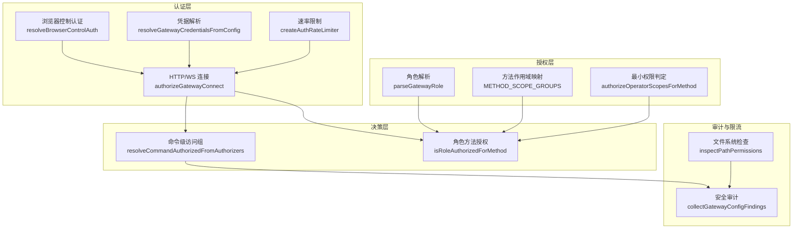
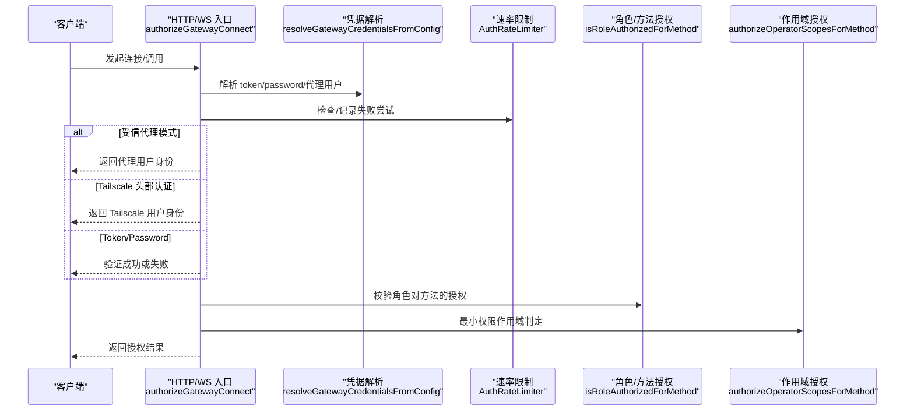
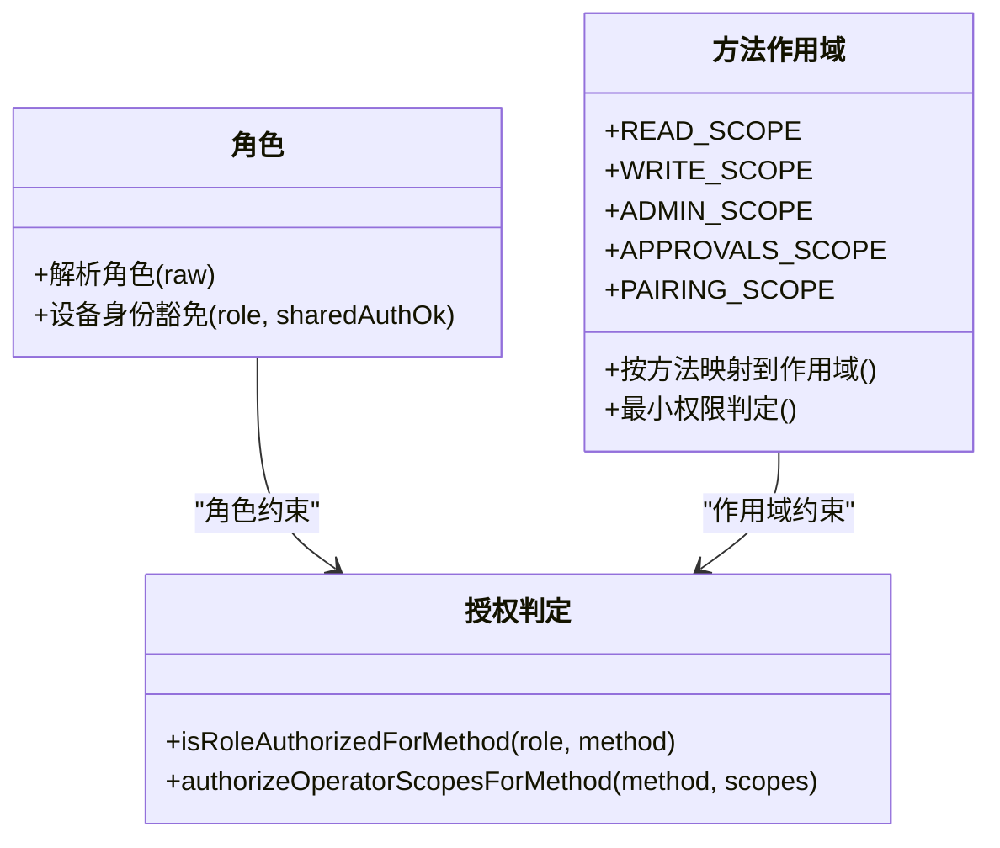
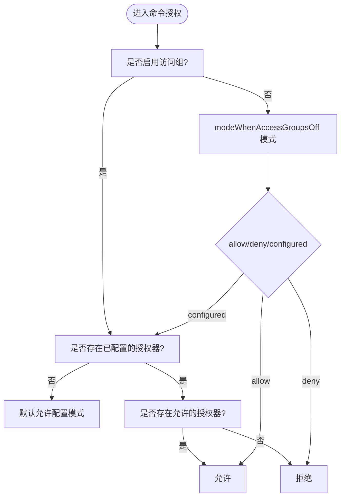
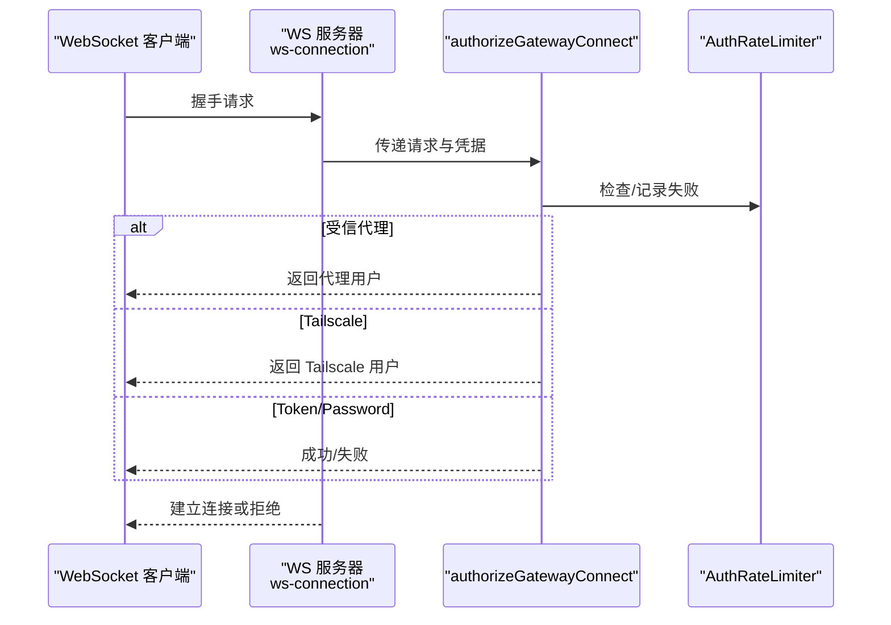
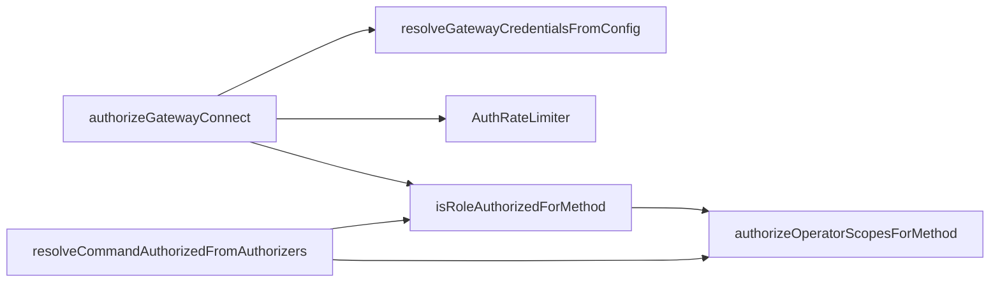

# 访问控制策略

<cite>
**本文引用的文件**
- [src/gateway/auth.ts](file://src/gateway/auth.ts)
- [src/gateway/role-policy.ts](file://src/gateway/role-policy.ts)
- [src/gateway/method-scopes.ts](file://src/gateway/method-scopes.ts)
- [src/gateway/auth-rate-limit.ts](file://src/gateway/auth-rate-limit.ts)
- [src/gateway/credentials.ts](file://src/gateway/credentials.ts)
- [src/gateway/net.ts](file://src/gateway/net.ts)
- [src/gateway/probe-auth.ts](file://src/gateway/probe-auth.ts)
- [src/browser/control-auth.ts](file://src/browser/control-auth.ts)
- [src/channels/command-gating.ts](file://src/channels/command-gating.ts)
- [src/shared/operator-scope-compat.ts](file://src/shared/operator-scope-compat.ts)
- [src/security/audit.ts](file://src/security/audit.ts)
- [src/security/audit-extra.async.ts](file://src/security/audit-extra.async.ts)
- [src/gateway/server.canvas-auth.test.ts](file://src/gateway/server.canvas-auth.test.ts)
- [src/gateway/server.auth.default-token.suite.ts](file://src/gateway/server.auth.default-token.suite.ts)
- [src/gateway/ws-connection.ts](file://src/gateway/ws-connection.ts)
- [src/gateway/ws-types.ts](file://src/gateway/ws-types.ts)
</cite>

## 目录
1. [简介](#简介)
2. [项目结构](#项目结构)
3. [核心组件](#核心组件)
4. [架构总览](#架构总览)
5. [详细组件分析](#详细组件分析)
6. [依赖关系分析](#依赖关系分析)
7. [性能考量](#性能考量)
8. [故障排查指南](#故障排查指南)
9. [结论](#结论)
10. [附录](#附录)

## 简介
本文件系统性梳理 OpenClaw 的访问控制系统，围绕基于角色的访问控制（RBAC）、权限矩阵与访问决策引擎展开，覆盖授权策略、角色继承与权限链路，并结合 HTTP、WebSocket 以及 API 密钥认证的实际实现，提供配置示例、审计日志与权限调试方法，帮助在多场景下构建安全可控的访问边界。

## 项目结构
OpenClaw 的访问控制由“认证层 + 授权层 + 决策层 + 审计与限流”构成，核心代码集中在 gateway、browser、channels 与 security 子模块中：
- 认证层：支持 token、密码、受信代理与 Tailscale 头部认证；提供速率限制与客户端 IP 解析。
- 授权层：定义网关角色与方法作用域映射，提供最小权限授权判定。
- 决策层：统一接入点进行认证与授权决策，处理命令级访问组与通道侧授权器。
- 审计与限流：提供安全审计报告、文件系统与配置权限检查，以及认证尝试的滑动窗口限流。

图表来源
- [src/gateway/auth.ts](file://src/gateway/auth.ts#L367-L490)
- [src/browser/control-auth.ts](file://src/browser/control-auth.ts#L11-L26)
- [src/gateway/credentials.ts](file://src/gateway/credentials.ts#L129-L278)
- [src/gateway/auth-rate-limit.ts](file://src/gateway/auth-rate-limit.ts#L95-L232)
- [src/gateway/role-policy.ts](file://src/gateway/role-policy.ts#L7-L23)
- [src/gateway/method-scopes.ts](file://src/gateway/method-scopes.ts#L29-L205)
- [src/channels/command-gating.ts](file://src/channels/command-gating.ts#L8-L45)
- [src/security/audit.ts](file://src/security/audit.ts#L339-L686)
- [src/security/audit-extra.async.ts](file://src/security/audit-extra.async.ts#L1095-L1127)

章节来源
- [src/gateway/auth.ts](file://src/gateway/auth.ts#L1-L491)
- [src/gateway/role-policy.ts](file://src/gateway/role-policy.ts#L1-L24)
- [src/gateway/method-scopes.ts](file://src/gateway/method-scopes.ts#L1-L213)
- [src/gateway/auth-rate-limit.ts](file://src/gateway/auth-rate-limit.ts#L1-L233)
- [src/gateway/credentials.ts](file://src/gateway/credentials.ts#L1-L279)
- [src/gateway/net.ts](file://src/gateway/net.ts#L1-L451)
- [src/browser/control-auth.ts](file://src/browser/control-auth.ts#L1-L99)
- [src/channels/command-gating.ts](file://src/channels/command-gating.ts#L1-L46)
- [src/security/audit.ts](file://src/security/audit.ts#L1-L800)
- [src/security/audit-extra.async.ts](file://src/security/audit-extra.async.ts#L1095-L1127)

## 核心组件
- 角色与方法作用域
  - 角色：operator、node；角色解析与设备身份豁免规则。
  - 方法作用域：READ/WRITE/ADMIN/APPROVALS/PAIRING 等，按方法映射到最小所需作用域。
- 命令级访问组
  - 基于 authorizer 列表与 useAccessGroups 开关，决定是否允许文本命令执行。
- 凭据与认证
  - 支持 token、password、trusted-proxy、none 模式；凭据优先级与回退策略。
- 速率限制
  - 滑动窗口计数，按 scope/IP 维度统计失败次数并锁定。
- 审计与安全
  - 配置与文件系统权限检查，暴露面与危险配置告警。

章节来源
- [src/gateway/role-policy.ts](file://src/gateway/role-policy.ts#L3-L23)
- [src/gateway/method-scopes.ts](file://src/gateway/method-scopes.ts#L29-L205)
- [src/channels/command-gating.ts](file://src/channels/command-gating.ts#L8-L45)
- [src/gateway/credentials.ts](file://src/gateway/credentials.ts#L129-L278)
- [src/gateway/auth-rate-limit.ts](file://src/gateway/auth-rate-limit.ts#L95-L232)
- [src/security/audit.ts](file://src/security/audit.ts#L339-L686)

## 架构总览
下图展示从请求进入网关到完成认证与授权决策的关键路径，包括 HTTP/WS 与浏览器控制端点。

图表来源
- [src/gateway/auth.ts](file://src/gateway/auth.ts#L367-L490)
- [src/gateway/credentials.ts](file://src/gateway/credentials.ts#L129-L278)
- [src/gateway/auth-rate-limit.ts](file://src/gateway/auth-rate-limit.ts#L95-L232)
- [src/gateway/role-policy.ts](file://src/gateway/role-policy.ts#L18-L23)
- [src/gateway/method-scopes.ts](file://src/gateway/method-scopes.ts#L187-L205)

## 详细组件分析

### 基于角色的访问控制（RBAC）
- 角色定义与解析
  - 支持 operator 与 node 两种角色；非预期值返回空。
  - 设备身份豁免：仅当共享认证可用时，operator 可跳过设备身份校验。
- 方法授权
  - node 角色仅能调用节点事件与能力刷新等方法；operator 能调用管理类方法。
  - 未分类方法默认拒绝，确保最小权限原则。

图表来源
- [src/gateway/role-policy.ts](file://src/gateway/role-policy.ts#L3-L23)
- [src/gateway/method-scopes.ts](file://src/gateway/method-scopes.ts#L29-L205)

章节来源
- [src/gateway/role-policy.ts](file://src/gateway/role-policy.ts#L1-L24)
- [src/gateway/method-scopes.ts](file://src/gateway/method-scopes.ts#L1-L213)

### 权限矩阵与访问决策引擎
- 命令级访问组
  - 当启用 useAccessGroups 时，需至少一个 authorizer 配置且允许；否则拒绝。
  - 当关闭时，可选择 allow/deny/configured 三种模式，默认 allow。
- 作用域兼容性
  - operator.admin 可满足所有 operator.* 请求；operator.read 可被 read/write/admin 满足。
- 方法分类与最小权限
  - 按方法映射到 READ/WRITE/ADMIN/APPROVALS/PAIRING，未分类默认拒绝。

图表来源
- [src/channels/command-gating.ts](file://src/channels/command-gating.ts#L8-L45)
- [src/shared/operator-scope-compat.ts](file://src/shared/operator-scope-compat.ts#L18-L49)

章节来源
- [src/channels/command-gating.ts](file://src/channels/command-gating.ts#L1-L46)
- [src/shared/operator-scope-compat.ts](file://src/shared/operator-scope-compat.ts#L1-L50)

### HTTP 认证与 WebSocket 认证
- HTTP 连接
  - 支持 token/password/trusted-proxy/none 模式；速率限制贯穿失败记录与重试时间提示。
  - 本地直连检测与受信代理校验，避免伪造源地址。
- WebSocket 控制界面
  - 在特定表面允许 Tailscale 头部认证，便于无令牌登录；其他场景严格要求凭据。
- 浏览器控制端点
  - 自动复用网关凭据；若缺失则在允许条件下自动生成并持久化。

图表来源
- [src/gateway/ws-connection.ts](file://src/gateway/ws-connection.ts#L115-L139)
- [src/gateway/auth.ts](file://src/gateway/auth.ts#L367-L490)
- [src/gateway/auth-rate-limit.ts](file://src/gateway/auth-rate-limit.ts#L95-L232)

章节来源
- [src/gateway/auth.ts](file://src/gateway/auth.ts#L367-L490)
- [src/gateway/ws-connection.ts](file://src/gateway/ws-connection.ts#L115-L139)
- [src/gateway/ws-types.ts](file://src/gateway/ws-types.ts#L4-L13)
- [src/browser/control-auth.ts](file://src/browser/control-auth.ts#L11-L99)

### API 密钥认证与凭据管理
- 凭据来源与优先级
  - 支持显式传入、环境变量、配置文件与远程凭据；提供多种回退策略。
  - 对 secret ref 未解析场景抛出明确错误，指导修复路径。
- 远程/本地模式切换
  - 在 remote 模式下，token/password 可从远程配置回退；在 local 模式下优先本地配置。
- 安全生成与注入
  - 浏览器控制端点在必要时自动生成 token 并写回配置，避免明文泄露。

章节来源
- [src/gateway/credentials.ts](file://src/gateway/credentials.ts#L129-L278)
- [src/gateway/probe-auth.ts](file://src/gateway/probe-auth.ts#L7-L40)
- [src/browser/control-auth.ts](file://src/browser/control-auth.ts#L40-L99)

### 审计日志与安全边界
- 配置与网络暴露
  - 检测 gateway.bind 非 loopback 且无认证、Control UI 未设置允许来源、X-Real-IP 回退等高危配置。
- 文件系统与日志
  - 检查 state/config 文件权限，防止世界可读/可写；日志文件可包含敏感信息，建议收紧权限。
- 渠道与工具安全
  - 对危险工具与插件信任矩阵进行扫描与告警，降低供应链风险。

章节来源
- [src/security/audit.ts](file://src/security/audit.ts#L339-L686)
- [src/security/audit-extra.async.ts](file://src/security/audit-extra.async.ts#L1095-L1127)

## 依赖关系分析
- 认证与授权耦合
  - authorizeGatewayConnect 同时承担认证与授权职责，内部依赖凭据解析、速率限制与角色/方法授权。
- 作用域与角色的协作
  - 角色决定“能否做”，作用域决定“能做多少”，二者共同形成最小权限模型。
- 通道与命令级授权
  - 命令级访问组通过 authorizer 列表与 useAccessGroups 协同，实现细粒度的命令控制。

图表来源
- [src/gateway/auth.ts](file://src/gateway/auth.ts#L367-L490)
- [src/gateway/credentials.ts](file://src/gateway/credentials.ts#L129-L278)
- [src/gateway/auth-rate-limit.ts](file://src/gateway/auth-rate-limit.ts#L95-L232)
- [src/gateway/role-policy.ts](file://src/gateway/role-policy.ts#L18-L23)
- [src/gateway/method-scopes.ts](file://src/gateway/method-scopes.ts#L187-L205)
- [src/channels/command-gating.ts](file://src/channels/command-gating.ts#L8-L45)

章节来源
- [src/gateway/auth.ts](file://src/gateway/auth.ts#L367-L490)
- [src/gateway/role-policy.ts](file://src/gateway/role-policy.ts#L1-L24)
- [src/gateway/method-scopes.ts](file://src/gateway/method-scopes.ts#L1-L213)
- [src/channels/command-gating.ts](file://src/channels/command-gating.ts#L1-L46)

## 性能考量
- 速率限制
  - 使用内存 Map 存储滑动窗口状态，定期清理避免无限增长；默认对本地回环豁免，减少误伤。
- IP 解析与本地判断
  - 通过 isLocalDirectRequest 与 isLocalishHost 快速过滤本地流量，降低鉴权成本。
- 方法授权缓存
  - 方法到作用域的映射采用预计算 Map，查询为常数时间复杂度。

章节来源
- [src/gateway/auth-rate-limit.ts](file://src/gateway/auth-rate-limit.ts#L95-L232)
- [src/gateway/net.ts](file://src/gateway/net.ts#L125-L146)
- [src/gateway/method-scopes.ts](file://src/gateway/method-scopes.ts#L133-L137)

## 故障排查指南
- 常见问题定位
  - 未配置认证：当 gateway.bind 非 loopback 且未设置 token/password 时会触发严重告警。
  - 受信代理配置错误：未配置 trustedProxies 或 userHeader 缺失会导致认证失败。
  - 速率限制触发：频繁失败会被锁定，需等待重试时间或调整策略。
  - WebSocket 握手失败：检查协议版本、首帧类型与主机头/来源头合法性。
- 审计与诊断
  - 使用安全审计命令输出报告，关注文件权限、暴露面与危险配置项。
  - 结合日志与审计报告定位具体问题根因。

章节来源
- [src/security/audit.ts](file://src/security/audit.ts#L339-L686)
- [src/gateway/server.auth.default-token.suite.ts](file://src/gateway/server.auth.default-token.suite.ts#L301-L330)
- [src/gateway/server.canvas-auth.test.ts](file://src/gateway/server.canvas-auth.test.ts#L37-L77)

## 结论
OpenClaw 的访问控制以 RBAC 为核心，结合方法作用域与命令级访问组，形成“角色+作用域+访问组”的三层授权体系。认证层提供多模式凭据与速率限制，决策层统一处理角色与作用域授权，审计层持续监控配置与文件系统安全。通过严格的最小权限原则与可观测的审计机制，可在多场景下构建稳健的安全边界。

## 附录

### 访问控制配置示例（要点）
- 网关绑定与认证
  - loopback 绑定建议配合 token；非 loopback 绑定必须配置强 token 或受信代理。
  - 受信代理模式需明确 trustedProxies 与 userHeader，并限制允许用户列表。
- 角色与方法授权
  - operator 默认具备管理能力；node 仅限节点相关方法。
  - 未分类方法默认拒绝，避免越权。
- 命令级访问组
  - 启用访问组时，需配置授权器并确保至少一个允许；关闭时可选择 allow/deny/configured。
- 审计与加固
  - 严格限制 state/config 文件权限；避免使用通配符允许来源；开启速率限制。

章节来源
- [src/gateway/auth.ts](file://src/gateway/auth.ts#L339-L686)
- [src/gateway/role-policy.ts](file://src/gateway/role-policy.ts#L18-L23)
- [src/gateway/method-scopes.ts](file://src/gateway/method-scopes.ts#L187-L205)
- [src/channels/command-gating.ts](file://src/channels/command-gating.ts#L8-L45)
- [src/security/audit.ts](file://src/security/audit.ts#L208-L337)