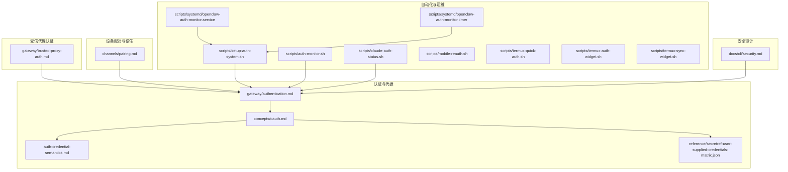
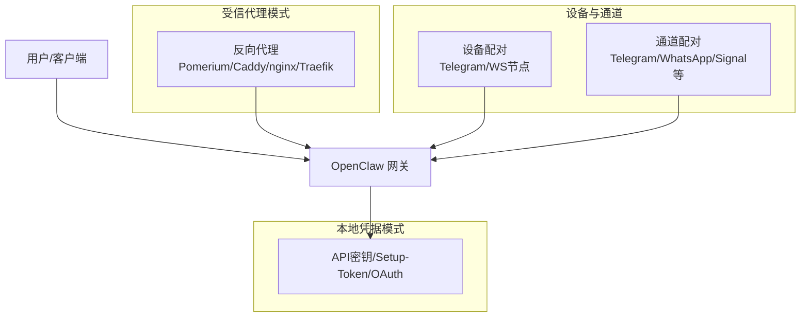
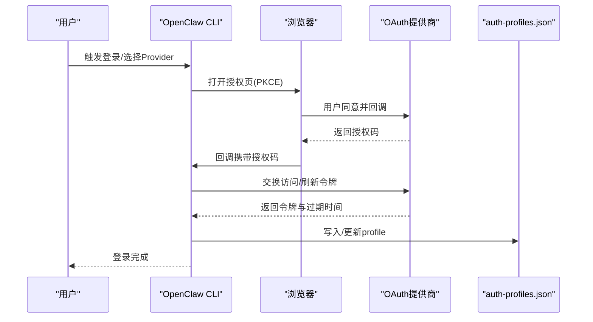
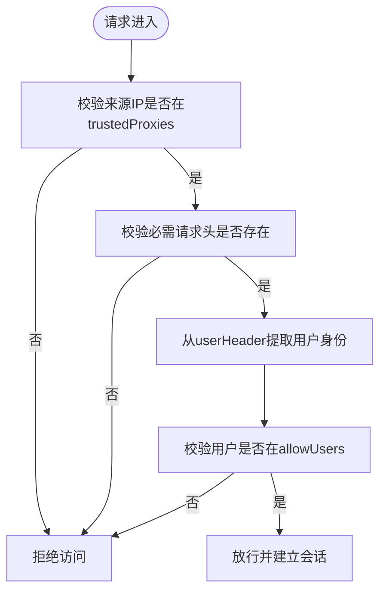
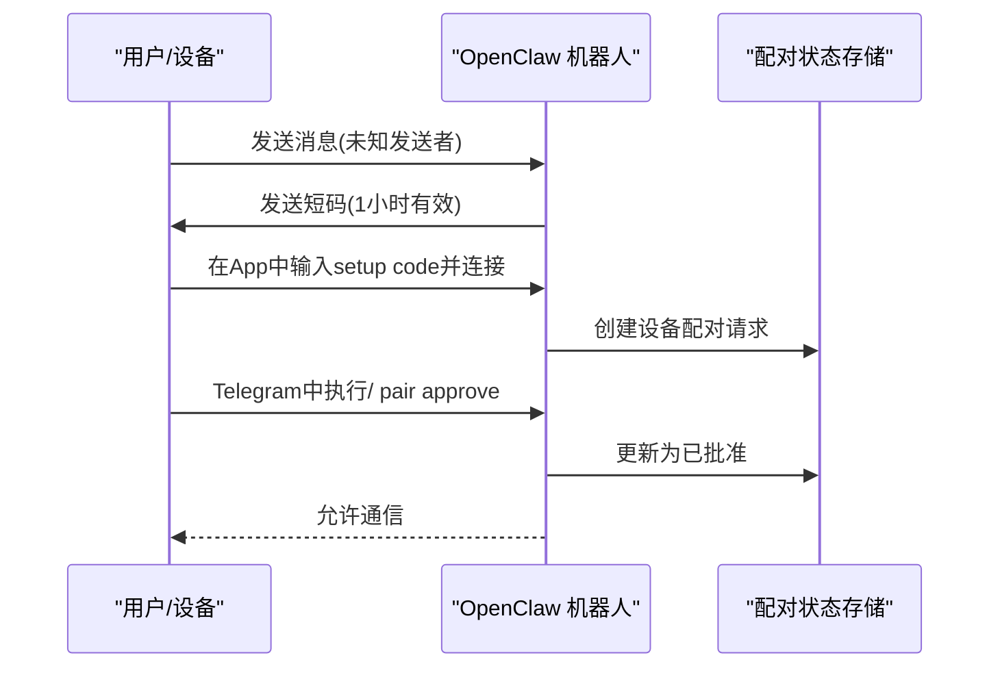
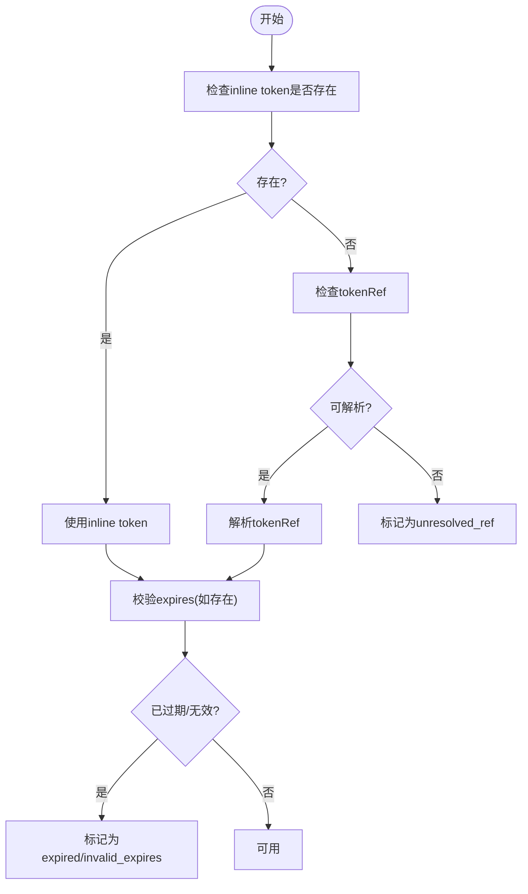
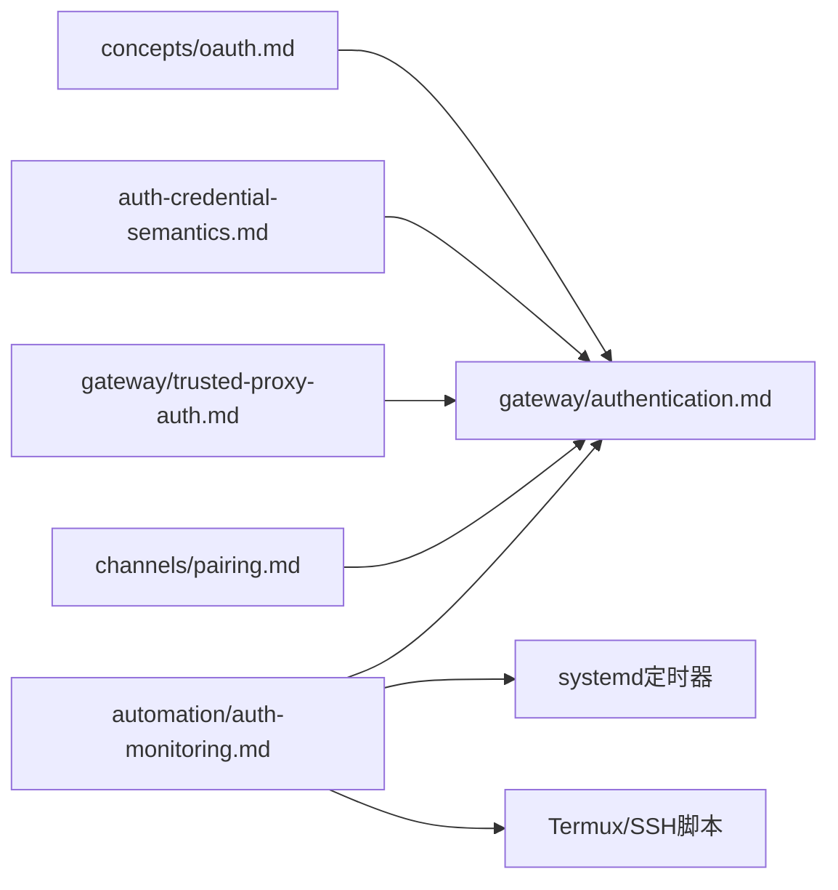

# 身份验证和授权

<cite>
**本文引用的文件**
- [docs/gateway/authentication.md](file://docs/gateway/authentication.md)
- [docs/concepts/oauth.md](file://docs/concepts/oauth.md)
- [docs/auth-credential-semantics.md](file://docs/auth-credential-semantics.md)
- [docs/automation/auth-monitoring.md](file://docs/automation/auth-monitoring.md)
- [docs/gateway/trusted-proxy-auth.md](file://docs/gateway/trusted-proxy-auth.md)
- [docs/channels/pairing.md](file://docs/channels/pairing.md)
- [docs/cli/security.md](file://docs/cli/security.md)
- [docs/reference/secretref-user-supplied-credentials-matrix.json](file://docs/reference/secretref-user-supplied-credentials-matrix.json)
- [scripts/setup-auth-system.sh](file://scripts/setup-auth-system.sh)
- [scripts/systemd/openclaw-auth-monitor.service](file://scripts/systemd/openclaw-auth-monitor.service)
- [scripts/systemd/openclaw-auth-monitor.timer](file://scripts/systemd/openclaw-auth-monitor.timer)
- [scripts/auth-monitor.sh](file://scripts/auth-monitor.sh)
- [scripts/claude-auth-status.sh](file://scripts/claude-auth-status.sh)
- [scripts/mobile-reauth.sh](file://scripts/mobile-reauth.sh)
- [scripts/termux-quick-auth.sh](file://scripts/termux-quick-auth.sh)
- [scripts/termux-auth-widget.sh](file://scripts/termux-auth-widget.sh)
- [scripts/termux-sync-widget.sh](file://scripts/termux-sync-widget.sh)
</cite>

## 目录
1. [简介](#简介)
2. [项目结构](#项目结构)
3. [核心组件](#核心组件)
4. [架构总览](#架构总览)
5. [详细组件分析](#详细组件分析)
6. [依赖关系分析](#依赖关系分析)
7. [性能考量](#性能考量)
8. [故障排除指南](#故障排除指南)
9. [结论](#结论)
10. [附录](#附录)

## 简介
本文件面向OpenClaw的身份验证与授权体系，覆盖多因素身份验证机制、OAuth流程、令牌管理与会话生命周期、设备配对与信任建立、权限继承与访问控制策略，并提供配置示例、故障排除与安全审计要点。内容以仓库内官方文档与脚本为基础，确保可操作性与一致性。

## 项目结构
围绕身份验证与授权的关键文档与脚本分布如下：
- 认证与凭据：gateway/authentication.md、concepts/oauth.md、auth-credential-semantics.md、reference/secretref-user-supplied-credentials-matrix.json
- 受信代理认证（反向代理+外部身份源）：gateway/trusted-proxy-auth.md
- 设备配对与信任建立：channels/pairing.md
- 自动化监控与运维脚本：scripts/*（含systemd定时任务）
- 安全审计与CLI安全命令：docs/cli/security.md

**图表来源**
- [docs/gateway/authentication.md](file://docs/gateway/authentication.md#L1-L180)
- [docs/concepts/oauth.md](file://docs/concepts/oauth.md#L1-L159)
- [docs/auth-credential-semantics.md](file://docs/auth-credential-semantics.md#L1-L46)
- [docs/gateway/trusted-proxy-auth.md](file://docs/gateway/trusted-proxy-auth.md#L1-L330)
- [docs/channels/pairing.md](file://docs/channels/pairing.md#L1-L111)
- [scripts/setup-auth-system.sh](file://scripts/setup-auth-system.sh)
- [scripts/systemd/openclaw-auth-monitor.service](file://scripts/systemd/openclaw-auth-monitor.service)
- [scripts/systemd/openclaw-auth-monitor.timer](file://scripts/systemd/openclaw-auth-monitor.timer)
- [scripts/auth-monitor.sh](file://scripts/auth-monitor.sh)
- [scripts/claude-auth-status.sh](file://scripts/claude-auth-status.sh)
- [scripts/mobile-reauth.sh](file://scripts/mobile-reauth.sh)
- [scripts/termux-quick-auth.sh](file://scripts/termux-quick-auth.sh)
- [scripts/termux-auth-widget.sh](file://scripts/termux-auth-widget.sh)
- [scripts/termux-sync-widget.sh](file://scripts/termux-sync-widget.sh)
- [docs/cli/security.md](file://docs/cli/security.md)

**章节来源**
- [docs/gateway/authentication.md](file://docs/gateway/authentication.md#L1-L180)
- [docs/concepts/oauth.md](file://docs/concepts/oauth.md#L1-L159)
- [docs/auth-credential-semantics.md](file://docs/auth-credential-semantics.md#L1-L46)
- [docs/gateway/trusted-proxy-auth.md](file://docs/gateway/trusted-proxy-auth.md#L1-L330)
- [docs/channels/pairing.md](file://docs/channels/pairing.md#L1-L111)
- [docs/cli/security.md](file://docs/cli/security.md)

## 核心组件
- 凭据与认证模式
  - API密钥、订阅型setup-token、OAuth（PKCE）、静态凭据引用（SecretRef）
  - 多账户/多配置文件路由与选择顺序
- OAuth与令牌管理
  - 令牌交换（PKCE）、存储位置、刷新与过期处理、多账户模式
- 受信代理认证（Trusted Proxy Auth）
  - 将认证委托给反向代理，通过特定请求头传递已认证用户身份
- 设备配对与信任建立
  - DM入站消息配对、节点设备配对、状态存储与有效期
- 运维与监控
  - CLI健康检查、退出码语义、systemd定时任务、移动端快速重认证
- 安全审计
  - 配置合规性检查、关键风险提示

**章节来源**
- [docs/gateway/authentication.md](file://docs/gateway/authentication.md#L11-L180)
- [docs/concepts/oauth.md](file://docs/concepts/oauth.md#L11-L159)
- [docs/gateway/trusted-proxy-auth.md](file://docs/gateway/trusted-proxy-auth.md#L10-L330)
- [docs/channels/pairing.md](file://docs/channels/pairing.md#L10-L111)
- [docs/automation/auth-monitoring.md](file://docs/automation/auth-monitoring.md#L9-L45)

## 架构总览
下图展示OpenClaw在不同部署形态下的认证与授权交互：

**图表来源**
- [docs/gateway/authentication.md](file://docs/gateway/authentication.md#L11-L180)
- [docs/concepts/oauth.md](file://docs/concepts/oauth.md#L11-L159)
- [docs/gateway/trusted-proxy-auth.md](file://docs/gateway/trusted-proxy-auth.md#L30-L90)
- [docs/channels/pairing.md](file://docs/channels/pairing.md#L10-L111)

## 详细组件分析

### 组件A：OAuth与令牌管理（含PKCE与多账户）
- 流程要点
  - OAuth使用PKCE交换，回调端口与状态参数用于绑定与防重放
  - 令牌作为“令牌池”，统一写入到每个Agent的auth-profiles.json中，避免跨应用互相挤占刷新令牌导致的随机登出
  - 存储位置与兼容文件：按Agent隔离；支持历史导入文件
  - 刷新与过期：运行时根据expires判断是否自动刷新并更新存储
  - 多账户/多配置文件：支持同一Provider多个profile ID，可通过全局排序或会话级覆盖选择
- 关键行为
  - 令牌作为“水池”减少跨客户端冲突
  - 支持provider插件自定义登录入口
  - 退出码与健康检查：--check返回0/1/2，便于自动化告警

**图表来源**
- [docs/concepts/oauth.md](file://docs/concepts/oauth.md#L83-L122)
- [docs/gateway/authentication.md](file://docs/gateway/authentication.md#L15-L113)

**章节来源**
- [docs/concepts/oauth.md](file://docs/concepts/oauth.md#L11-L159)
- [docs/gateway/authentication.md](file://docs/gateway/authentication.md#L15-L113)
- [docs/auth-credential-semantics.md](file://docs/auth-credential-semantics.md#L12-L46)

### 组件B：受信代理认证（Trusted Proxy Auth）
- 使用场景
  - 在容器/Kubernetes环境或需要统一身份入口时，由反向代理负责认证
  - 解决WebSocket无法携带令牌的问题
- 工作原理
  - 代理认证用户后在请求头中注入已认证身份
  - 网关仅允许来自trustedProxies的请求，校验必要请求头与用户白名单
- 配置要点
  - bind、trustedProxies、userHeader、requiredHeaders、allowUsers
  - 控制界面WebSocket在该模式下可无需设备配对即可连接
- 安全建议
  - 仅允许代理作为唯一入口；最小化trustedProxies；代理必须正确剥离/覆盖转发头
  - 推荐在代理层终止TLS并设置HSTS

**图表来源**
- [docs/gateway/trusted-proxy-auth.md](file://docs/gateway/trusted-proxy-auth.md#L30-L90)

**章节来源**
- [docs/gateway/trusted-proxy-auth.md](file://docs/gateway/trusted-proxy-auth.md#L14-L330)

### 组件C：设备配对与信任建立
- DM入站配对
  - 未知发送者需经短码审批，消息不被处理，短码有效期约1小时，默认每小时最多3个待处理请求
  - 状态存储于~/.openclaw/credentials/，包含待处理与已批准清单
- 节点设备配对（iOS/Android/macOS/无头节点）
  - 通过Telegram插件完成首次配对：生成一次性setup code（包含网关URL与短期token），在App中粘贴并连接，随后在Telegram中批准
  - 状态存储于~/.openclaw/devices/，包含待处理与已配对设备信息
- 权限与继承
  - 默认账户使用频道级未作用域的allowFrom文件；非默认账户读写其作用域内的allowFrom文件
  - 节点设备角色为node，WS节点仍需设备配对

**图表来源**
- [docs/channels/pairing.md](file://docs/channels/pairing.md#L57-L98)

**章节来源**
- [docs/channels/pairing.md](file://docs/channels/pairing.md#L10-L111)

### 组件D：凭据解析与选择语义（含SecretRef）
- 令牌凭据语义
  - 支持inline token与tokenRef；expires可选但若存在需为有限正数
  - 过期或无效expires将导致profile不可用，并给出稳定reason code
- SecretRef凭据矩阵
  - 提供用户自定义凭据来源（env/file/exec）与Provider映射参考，便于在不同环境中选择合适的凭据加载方式
- 运行时与探测
  - models status --probe输出稳定reason code；doctor-auth辅助诊断

**图表来源**
- [docs/auth-credential-semantics.md](file://docs/auth-credential-semantics.md#L20-L46)
- [docs/reference/secretref-user-supplied-credentials-matrix.json](file://docs/reference/secretref-user-supplied-credentials-matrix.json)

**章节来源**
- [docs/auth-credential-semantics.md](file://docs/auth-credential-semantics.md#L1-L46)
- [docs/reference/secretref-user-supplied-credentials-matrix.json](file://docs/reference/secretref-user-supplied-credentials-matrix.json)

### 组件E：会话生命周期与API密钥轮换
- 会话与模型选择
  - 支持会话级模型切换与profile覆盖，便于在一次对话中指定特定凭据
  - 支持按Agent覆盖凭据顺序，实现多账户/多用途的凭据优先级
- API密钥轮换
  - 按优先级顺序尝试多个密钥，仅在速率限制错误时回退到下一个密钥
  - 密钥列表去重，最终失败返回最后一次尝试的错误

**章节来源**
- [docs/gateway/authentication.md](file://docs/gateway/authentication.md#L140-L160)

### 组件F：自动化监控与运维脚本
- 健康检查与退出码
  - openclaw models status --check：0正常、1缺失/过期、2即将过期（24小时内）
- systemd定时任务
  - openclaw-auth-monitor.{service,timer}：周期性触发检查并可推送告警
- 移动端与手机工作流
  - termux-quick-auth.sh、termux-auth-widget.sh、termux-sync-widget.sh、mobile-reauth.sh等，覆盖一键状态查看、引导重认证、同步代理凭据等场景
- 通用脚本
  - auth-monitor.sh：综合告警与通知；claude-auth-status.sh：聚合状态输出

**章节来源**
- [docs/automation/auth-monitoring.md](file://docs/automation/auth-monitoring.md#L9-L45)
- [scripts/systemd/openclaw-auth-monitor.service](file://scripts/systemd/openclaw-auth-monitor.service)
- [scripts/systemd/openclaw-auth-monitor.timer](file://scripts/systemd/openclaw-auth-monitor.timer)
- [scripts/auth-monitor.sh](file://scripts/auth-monitor.sh)
- [scripts/claude-auth-status.sh](file://scripts/claude-auth-status.sh)
- [scripts/mobile-reauth.sh](file://scripts/mobile-reauth.sh)
- [scripts/termux-quick-auth.sh](file://scripts/termux-quick-auth.sh)
- [scripts/termux-auth-widget.sh](file://scripts/termux-auth-widget.sh)
- [scripts/termux-sync-widget.sh](file://scripts/termux-sync-widget.sh)

### 组件G：安全审计与合规检查
- trusted-proxy模式被安全审计标记为高风险，需严格核验配置项
- 审计关注点：是否配置trustedProxies、是否配置userHeader、allowUsers是否为空（允许所有已认证用户）

**章节来源**
- [docs/gateway/trusted-proxy-auth.md](file://docs/gateway/trusted-proxy-auth.md#L266-L275)
- [docs/cli/security.md](file://docs/cli/security.md)

## 依赖关系分析
- 文档间耦合
  - concepts/oauth.md与gateway/authentication.md共同描述OAuth与凭据管理
  - auth-credential-semantics.md为凭据解析与选择提供稳定语义
  - gateway/trusted-proxy-auth.md依赖authentication与pairing的边界（受信代理不替代设备配对）
- 运维脚本与配置
  - systemd定时器依赖setup-auth-system.sh与auth-monitor.sh
  - 各平台脚本（Termux/SSH）依赖CLI健康检查能力

**图表来源**
- [docs/concepts/oauth.md](file://docs/concepts/oauth.md#L1-L159)
- [docs/gateway/authentication.md](file://docs/gateway/authentication.md#L1-L180)
- [docs/auth-credential-semantics.md](file://docs/auth-credential-semantics.md#L1-L46)
- [docs/gateway/trusted-proxy-auth.md](file://docs/gateway/trusted-proxy-auth.md#L1-L330)
- [docs/channels/pairing.md](file://docs/channels/pairing.md#L1-L111)
- [docs/automation/auth-monitoring.md](file://docs/automation/auth-monitoring.md#L1-L45)

**章节来源**
- [docs/concepts/oauth.md](file://docs/concepts/oauth.md#L1-L159)
- [docs/gateway/authentication.md](file://docs/gateway/authentication.md#L1-L180)
- [docs/auth-credential-semantics.md](file://docs/auth-credential-semantics.md#L1-L46)
- [docs/gateway/trusted-proxy-auth.md](file://docs/gateway/trusted-proxy-auth.md#L1-L330)
- [docs/channels/pairing.md](file://docs/channels/pairing.md#L1-L111)
- [docs/automation/auth-monitoring.md](file://docs/automation/auth-monitoring.md#L1-L45)

## 性能考量
- OAuth刷新采用文件锁保护，避免并发刷新导致的竞态
- API密钥轮换仅在速率限制错误时生效，降低不必要的重试成本
- 受信代理模式下，认证前置至代理，减少网关侧认证开销
- CLI健康检查与systemd定时器结合，避免频繁轮询带来的资源浪费

[本节为通用指导，无需具体文件分析]

## 故障排除指南
- “无凭据/过期/即将过期”
  - 使用openclaw models status --check获取退出码，定位问题类型
  - 对OAuth：重新登录或手动粘贴token；对API密钥：更换或轮换
- 受信代理相关错误
  - trusted_proxy_untrusted_source：确认trustedProxies配置与实际代理IP一致
  - trusted_proxy_user_missing：确认代理正确注入userHeader且用户已认证
  - trusted_proxy_missing_header_*：检查代理链路是否丢失必需请求头
  - trusted_proxy_user_not_allowed：调整allowUsers或移除白名单
  - WebSocket仍失败：确认代理支持WebSocket升级且在握手阶段传递身份头
- 设备/通道配对
  - DM配对：检查短码有效期与待处理上限；确认approve指令执行成功
  - 节点配对：确认setup code未过期；检查Telegram插件流程与批准步骤
- 移动端与SSH工作流
  - 使用termux-quick-auth.sh与mobile-reauth.sh进行快速重认证
  - 使用termux-sync-widget.sh同步代理凭据到OpenClaw

**章节来源**
- [docs/automation/auth-monitoring.md](file://docs/automation/auth-monitoring.md#L14-L45)
- [docs/gateway/trusted-proxy-auth.md](file://docs/gateway/trusted-proxy-auth.md#L276-L312)
- [docs/channels/pairing.md](file://docs/channels/pairing.md#L20-L98)

## 结论
OpenClaw通过“令牌池”式OAuth存储、多账户profile路由、受信代理认证与设备/通道配对机制，构建了灵活且安全的身份验证与授权体系。配合CLI健康检查与systemd定时任务，实现了自动化运维与可观测性。在生产部署中，建议优先采用API密钥或受信代理认证，并严格遵循安全审计与配置核查清单，确保访问控制与合规要求得到满足。

[本节为总结，无需具体文件分析]

## 附录

### A. 常见配置片段与路径
- OAuth存储位置（按Agent隔离）
  - ~/.openclaw/agents/<agentId>/agent/auth-profiles.json
  - ~/.openclaw/agents/<agentId>/agent/auth.json（兼容导入）
  - ~/.openclaw/credentials/oauth.json（导入兼容）
- 设备配对状态
  - ~/.openclaw/devices/pending.json
  - ~/.openclaw/devices/paired.json
- 通道配对状态
  - ~/.openclaw/credentials/<channel>-pairing.json
  - ~/.openclaw/credentials/<channel>-allowFrom.json 或 <channel>-<accountId>-allowFrom.json

**章节来源**
- [docs/concepts/oauth.md](file://docs/concepts/oauth.md#L41-L56)
- [docs/channels/pairing.md](file://docs/channels/pairing.md#L41-L56)

### B. CLI与脚本速查
- 健康检查与退出码
  - openclaw models status --check：0/1/2
- 受信代理模式配置要点
  - bind、trustedProxies、auth.mode=trusted-proxy、userHeader、requiredHeaders、allowUsers
- systemd定时任务
  - openclaw-auth-monitor.{service,timer}

**章节来源**
- [docs/automation/auth-monitoring.md](file://docs/automation/auth-monitoring.md#L14-L27)
- [docs/gateway/trusted-proxy-auth.md](file://docs/gateway/trusted-proxy-auth.md#L50-L90)
- [scripts/systemd/openclaw-auth-monitor.service](file://scripts/systemd/openclaw-auth-monitor.service)
- [scripts/systemd/openclaw-auth-monitor.timer](file://scripts/systemd/openclaw-auth-monitor.timer)