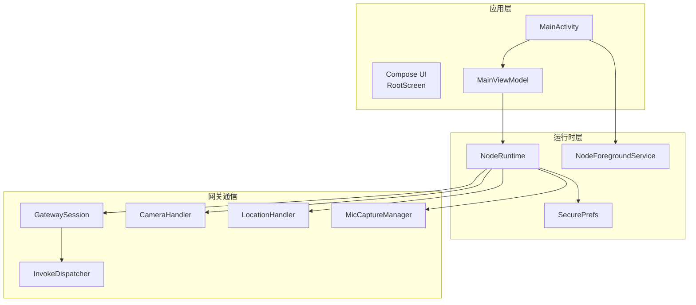
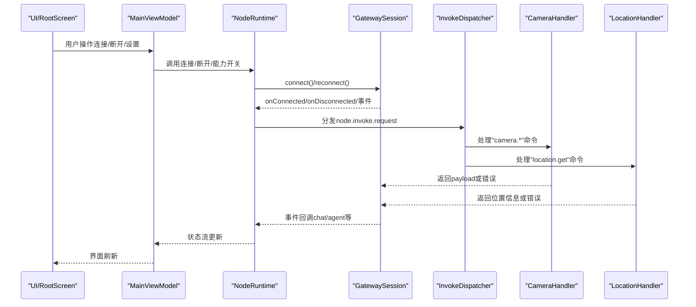
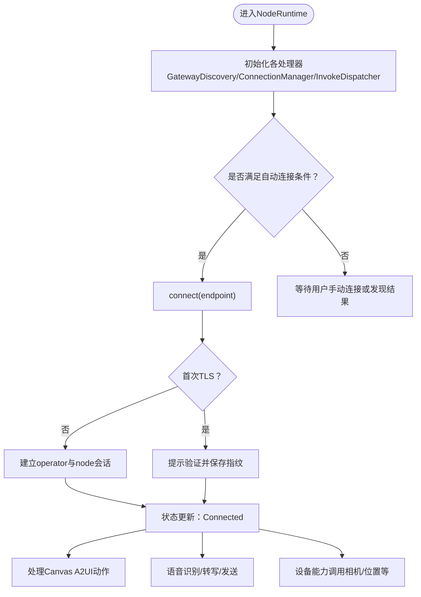
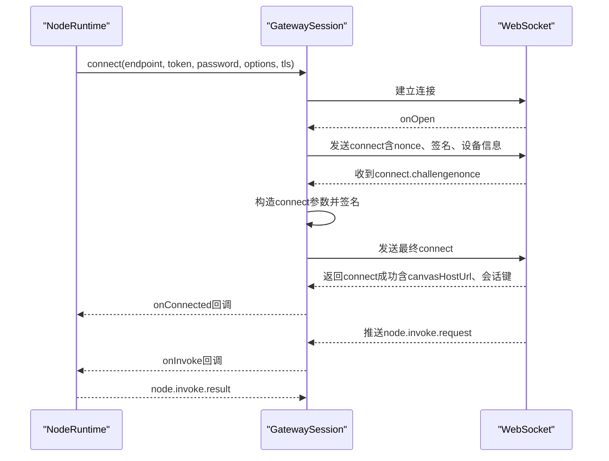
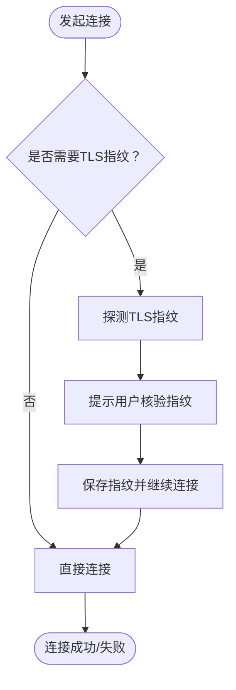
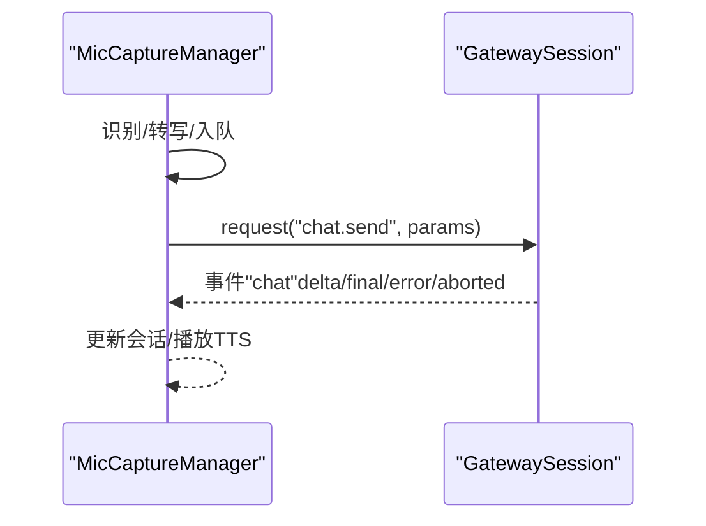
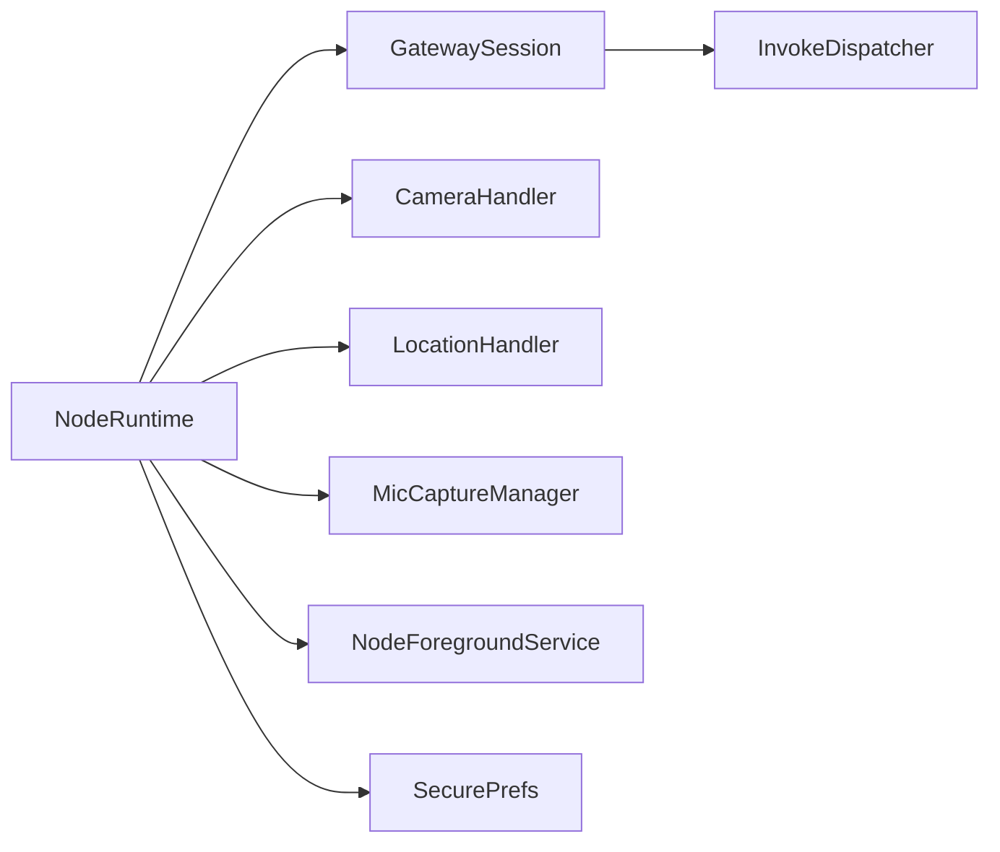

# Android节点

<cite>
**本文引用的文件**
- [apps/android/app/src/main/java/ai/openclaw/android/MainActivity.kt](file://apps/android/app/src/main/java/ai/openclaw/android/MainActivity.kt)
- [apps/android/app/src/main/java/ai/openclaw/android/NodeApp.kt](file://apps/android/app/src/main/java/ai/openclaw/android/NodeApp.kt)
- [apps/android/app/src/main/java/ai/openclaw/android/MainViewModel.kt](file://apps/android/app/src/main/java/ai/openclaw/android/MainViewModel.kt)
- [apps/android/app/src/main/java/ai/openclaw/android/NodeRuntime.kt](file://apps/android/app/src/main/java/ai/openclaw/android/NodeRuntime.kt)
- [apps/android/app/src/main/java/ai/openclaw/android/NodeForegroundService.kt](file://apps/android/app/src/main/java/ai/openclaw/android/NodeForegroundService.kt)
- [apps/android/app/src/main/java/ai/openclaw/android/SecurePrefs.kt](file://apps/android/app/src/main/java/ai/openclaw/android/SecurePrefs.kt)
- [apps/android/app/src/main/AndroidManifest.xml](file://apps/android/app/src/main/AndroidManifest.xml)
- [apps/android/app/src/main/java/ai/openclaw/android/node/CameraHandler.kt](file://apps/android/app/src/main/java/ai/openclaw/android/node/CameraHandler.kt)
- [apps/android/app/src/main/java/ai/openclaw/android/node/LocationHandler.kt](file://apps/android/app/src/main/java/ai/openclaw/android/node/LocationHandler.kt)
- [apps/android/app/src/main/java/ai/openclaw/android/voice/MicCaptureManager.kt](file://apps/android/app/src/main/java/ai/openclaw/android/voice/MicCaptureManager.kt)
- [apps/android/app/src/main/java/ai/openclaw/android/ui/RootScreen.kt](file://apps/android/app/src/main/java/ai/openclaw/android/ui/RootScreen.kt)
- [apps/android/app/src/main/java/ai/openclaw/android/gateway/GatewaySession.kt](file://apps/android/app/src/main/java/ai/openclaw/android/gateway/GatewaySession.kt)
</cite>

## 目录
1. [简介](#简介)
2. [项目结构](#项目结构)
3. [核心组件](#核心组件)
4. [架构总览](#架构总览)
5. [详细组件分析](#详细组件分析)
6. [依赖关系分析](#依赖关系分析)
7. [性能考量](#性能考量)
8. [故障排除指南](#故障排除指南)
9. [结论](#结论)
10. [附录](#附录)

## 简介
本文件面向OpenClaw的Android节点应用，系统性阐述其功能特性、安装配置、使用方法与技术实现。重点覆盖以下方面：
- 与网关的通信协议与握手流程
- 设备配对与信任机制（TLS指纹校验）
- 权限管理与后台服务限制
- 电池优化策略与网络连接处理
- Android特有能力：语音通话、相机访问、位置服务、通知管理
- 配置项、权限申请流程、故障排除与性能优化建议

## 项目结构
Android节点位于apps/android目录，采用Kotlin语言与Jetpack Compose UI，核心运行时在NodeRuntime中集中编排，通过GatewaySession与网关建立WebSocket连接，辅以NodeForegroundService维持前台状态，配合SecurePrefs进行加密本地存储。

图表来源
- [apps/android/app/src/main/java/ai/openclaw/android/MainActivity.kt](file://apps/android/app/src/main/java/ai/openclaw/android/MainActivity.kt#L18-L68)
- [apps/android/app/src/main/java/ai/openclaw/android/MainViewModel.kt](file://apps/android/app/src/main/java/ai/openclaw/android/MainViewModel.kt#L14-L206)
- [apps/android/app/src/main/java/ai/openclaw/android/NodeRuntime.kt](file://apps/android/app/src/main/java/ai/openclaw/android/NodeRuntime.kt#L44-L320)
- [apps/android/app/src/main/java/ai/openclaw/android/NodeForegroundService.kt](file://apps/android/app/src/main/java/ai/openclaw/android/NodeForegroundService.kt#L23-L181)
- [apps/android/app/src/main/java/ai/openclaw/android/SecurePrefs.kt](file://apps/android/app/src/main/java/ai/openclaw/android/SecurePrefs.kt#L18-L313)
- [apps/android/app/src/main/java/ai/openclaw/android/gateway/GatewaySession.kt](file://apps/android/app/src/main/java/ai/openclaw/android/gateway/GatewaySession.kt#L55-L135)

章节来源
- [apps/android/app/src/main/java/ai/openclaw/android/MainActivity.kt](file://apps/android/app/src/main/java/ai/openclaw/android/MainActivity.kt#L18-L68)
- [apps/android/app/src/main/java/ai/openclaw/android/NodeApp.kt](file://apps/android/app/src/main/java/ai/openclaw/android/NodeApp.kt#L6-L27)
- [apps/android/app/src/main/java/ai/openclaw/android/MainViewModel.kt](file://apps/android/app/src/main/java/ai/openclaw/android/MainViewModel.kt#L14-L206)
- [apps/android/app/src/main/java/ai/openclaw/android/NodeRuntime.kt](file://apps/android/app/src/main/java/ai/openclaw/android/NodeRuntime.kt#L44-L320)
- [apps/android/app/src/main/java/ai/openclaw/android/NodeForegroundService.kt](file://apps/android/app/src/main/java/ai/openclaw/android/NodeForegroundService.kt#L23-L181)
- [apps/android/app/src/main/java/ai/openclaw/android/SecurePrefs.kt](file://apps/android/app/src/main/java/ai/openclaw/android/SecurePrefs.kt#L18-L313)
- [apps/android/app/src/main/AndroidManifest.xml](file://apps/android/app/src/main/AndroidManifest.xml#L1-L85)

## 核心组件
- NodeRuntime：应用运行时中枢，负责网关发现、连接、事件分发、能力刷新、Canvas A2UI交互、设备能力开关（相机、位置、语音）等。
- GatewaySession：封装WebSocket连接、认证挑战、请求/响应、事件分发、invoke处理与重连逻辑。
- NodeForegroundService：前台服务，持续显示连接状态通知，并根据麦克风使用需求动态更新前台类型。
- SecurePrefs：基于EncryptedSharedPreferences的安全偏好存储，保存实例ID、显示名、网关令牌、TLS指纹、位置模式、语音开关等。
- MainViewModel：将NodeRuntime的状态与命令暴露给UI，统一管理连接、聊天、Canvas、语音等状态流。
- MainActivity：初始化权限请求器、屏幕录制请求器、保持前台服务启动、设置主题与根界面。
- 摄像头/位置处理器：CameraHandler、LocationHandler分别实现“拍照/视频”和“位置获取”的网关调用封装与错误处理。
- 语音：MicCaptureManager负责语音识别、转写、队列发送、等待网关回复、播放TTS等。

章节来源
- [apps/android/app/src/main/java/ai/openclaw/android/NodeRuntime.kt](file://apps/android/app/src/main/java/ai/openclaw/android/NodeRuntime.kt#L44-L320)
- [apps/android/app/src/main/java/ai/openclaw/android/gateway/GatewaySession.kt](file://apps/android/app/src/main/java/ai/openclaw/android/gateway/GatewaySession.kt#L55-L135)
- [apps/android/app/src/main/java/ai/openclaw/android/NodeForegroundService.kt](file://apps/android/app/src/main/java/ai/openclaw/android/NodeForegroundService.kt#L23-L181)
- [apps/android/app/src/main/java/ai/openclaw/android/SecurePrefs.kt](file://apps/android/app/src/main/java/ai/openclaw/android/SecurePrefs.kt#L18-L313)
- [apps/android/app/src/main/java/ai/openclaw/android/MainViewModel.kt](file://apps/android/app/src/main/java/ai/openclaw/android/MainViewModel.kt#L14-L206)
- [apps/android/app/src/main/java/ai/openclaw/android/MainActivity.kt](file://apps/android/app/src/main/java/ai/openclaw/android/MainActivity.kt#L18-L68)
- [apps/android/app/src/main/java/ai/openclaw/android/node/CameraHandler.kt](file://apps/android/app/src/main/java/ai/openclaw/android/node/CameraHandler.kt#L22-L176)
- [apps/android/app/src/main/java/ai/openclaw/android/node/LocationHandler.kt](file://apps/android/app/src/main/java/ai/openclaw/android/node/LocationHandler.kt#L15-L117)
- [apps/android/app/src/main/java/ai/openclaw/android/voice/MicCaptureManager.kt](file://apps/android/app/src/main/java/ai/openclaw/android/voice/MicCaptureManager.kt#L39-L574)

## 架构总览
下图展示从UI到运行时、网关会话以及各能力处理器之间的交互路径，体现Android节点如何在前台服务保障下，持续与网关通信并执行设备能力调用。

图表来源
- [apps/android/app/src/main/java/ai/openclaw/android/ui/RootScreen.kt](file://apps/android/app/src/main/java/ai/openclaw/android/ui/RootScreen.kt#L10-L21)
- [apps/android/app/src/main/java/ai/openclaw/android/MainViewModel.kt](file://apps/android/app/src/main/java/ai/openclaw/android/MainViewModel.kt#L14-L206)
- [apps/android/app/src/main/java/ai/openclaw/android/NodeRuntime.kt](file://apps/android/app/src/main/java/ai/openclaw/android/NodeRuntime.kt#L238-L318)
- [apps/android/app/src/main/java/ai/openclaw/android/gateway/GatewaySession.kt](file://apps/android/app/src/main/java/ai/openclaw/android/gateway/GatewaySession.kt#L502-L547)
- [apps/android/app/src/main/java/ai/openclaw/android/node/CameraHandler.kt](file://apps/android/app/src/main/java/ai/openclaw/android/node/CameraHandler.kt#L30-L94)
- [apps/android/app/src/main/java/ai/openclaw/android/node/LocationHandler.kt](file://apps/android/app/src/main/java/ai/openclaw/android/node/LocationHandler.kt#L44-L96)

## 详细组件分析

### 运行时与生命周期（NodeRuntime）
- 职责：集中管理网关发现、自动连接、Canvas A2UI交互、设备能力开关、状态聚合与UI绑定。
- 关键点：
  - 自动连接策略：依据上次发现的稳定ID与已保存的TLS指纹进行可信连接；手动模式需开启TLS且提供有效主机端口。
  - Canvas A2UI：支持从WebView接收动作并转化为agent.request消息，具备超时与错误反馈。
  - 语音与TTS：MicCaptureManager与TalkModeManager协同，支持“仅TTS响应”和“语音对话”两种模式。
  - 状态聚合：连接状态、节点状态、Canvas状态、调试信息等统一通过StateFlow对外暴露。

图表来源
- [apps/android/app/src/main/java/ai/openclaw/android/NodeRuntime.kt](file://apps/android/app/src/main/java/ai/openclaw/android/NodeRuntime.kt#L542-L622)
- [apps/android/app/src/main/java/ai/openclaw/android/NodeRuntime.kt](file://apps/android/app/src/main/java/ai/openclaw/android/NodeRuntime.kt#L720-L756)
- [apps/android/app/src/main/java/ai/openclaw/android/NodeRuntime.kt](file://apps/android/app/src/main/java/ai/openclaw/android/NodeRuntime.kt#L882-L886)

章节来源
- [apps/android/app/src/main/java/ai/openclaw/android/NodeRuntime.kt](file://apps/android/app/src/main/java/ai/openclaw/android/NodeRuntime.kt#L44-L320)
- [apps/android/app/src/main/java/ai/openclaw/android/NodeRuntime.kt](file://apps/android/app/src/main/java/ai/openclaw/android/NodeRuntime.kt#L542-L622)
- [apps/android/app/src/main/java/ai/openclaw/android/NodeRuntime.kt](file://apps/android/app/src/main/java/ai/openclaw/android/NodeRuntime.kt#L720-L756)
- [apps/android/app/src/main/java/ai/openclaw/android/NodeRuntime.kt](file://apps/android/app/src/main/java/ai/openclaw/android/NodeRuntime.kt#L882-L886)

### 网关通信协议（GatewaySession）
- 协议要点：
  - 使用WebSocket，支持TLS（wss）与非TLS（ws）。
  - 连接前由网关下发“connect.challenge”nonce，客户端签名后完成认证。
  - 请求/响应模型：请求携带id，响应按id匹配；支持超时控制与重试退避。
  - 事件模型：支持“event”事件推送；支持“node.invoke.request”远端调用，返回“node.invoke.result”确认。
- 安全与容错：
  - 建立连接后缓存canvasHostUrl与主会话键，支持后续能力刷新与URL重写。
  - 断线自动重连，指数退避，最大延迟上限可控。

图表来源
- [apps/android/app/src/main/java/ai/openclaw/android/gateway/GatewaySession.kt](file://apps/android/app/src/main/java/ai/openclaw/android/gateway/GatewaySession.kt#L241-L251)
- [apps/android/app/src/main/java/ai/openclaw/android/gateway/GatewaySession.kt](file://apps/android/app/src/main/java/ai/openclaw/android/gateway/GatewaySession.kt#L345-L359)
- [apps/android/app/src/main/java/ai/openclaw/android/gateway/GatewaySession.kt](file://apps/android/app/src/main/java/ai/openclaw/android/gateway/GatewaySession.kt#L502-L547)

章节来源
- [apps/android/app/src/main/java/ai/openclaw/android/gateway/GatewaySession.kt](file://apps/android/app/src/main/java/ai/openclaw/android/gateway/GatewaySession.kt#L55-L135)
- [apps/android/app/src/main/java/ai/openclaw/android/gateway/GatewaySession.kt](file://apps/android/app/src/main/java/ai/openclaw/android/gateway/GatewaySession.kt#L345-L359)
- [apps/android/app/src/main/java/ai/openclaw/android/gateway/GatewaySession.kt](file://apps/android/app/src/main/java/ai/openclaw/android/gateway/GatewaySession.kt#L502-L547)

### 设备配对与信任机制（TLS指纹）
- 首次连接时探测网关TLS指纹，提示用户核验，核验通过后持久化保存，后续自动连接仅允许已信任网关。
- 手动连接模式要求启用TLS且提供合法主机端口，否则拒绝自动连接。

图表来源
- [apps/android/app/src/main/java/ai/openclaw/android/NodeRuntime.kt](file://apps/android/app/src/main/java/ai/openclaw/android/NodeRuntime.kt#L720-L756)
- [apps/android/app/src/main/java/ai/openclaw/android/NodeRuntime.kt](file://apps/android/app/src/main/java/ai/openclaw/android/NodeRuntime.kt#L745-L755)

章节来源
- [apps/android/app/src/main/java/ai/openclaw/android/NodeRuntime.kt](file://apps/android/app/src/main/java/ai/openclaw/android/NodeRuntime.kt#L720-L756)

### 权限管理与后台服务限制
- 权限清单：INTERNET、ACCESS_NETWORK_STATE、FOREGROUND_SERVICE、FOREGROUND_SERVICE_DATA_SYNC、FOREGROUND_SERVICE_MICROPHONE、FOREGROUND_SERVICE_MEDIA_PROJECTION、POST_NOTIFICATIONS、Wi-Fi发现、位置（粗/精/后台）、相机、录音、短信、联系人、日历、运动识别、安装包等。
- 后台服务：NodeForegroundService以“数据同步+麦克风+媒体投影”类型启动，动态更新通知内容与前台类型；当检测到录音权限变化时调整前台类型。
- 电池优化：通过前台服务与合理的重连退避策略降低被系统回收风险；UI层面提供“阻止休眠”开关，结合Window标志位保持屏幕常亮。

章节来源
- [apps/android/app/src/main/AndroidManifest.xml](file://apps/android/app/src/main/AndroidManifest.xml#L1-L85)
- [apps/android/app/src/main/java/ai/openclaw/android/NodeForegroundService.kt](file://apps/android/app/src/main/java/ai/openclaw/android/NodeForegroundService.kt#L138-L153)
- [apps/android/app/src/main/java/ai/openclaw/android/MainActivity.kt](file://apps/android/app/src/main/java/ai/openclaw/android/MainActivity.kt#L34-L44)

### Android特有能力实现

#### 语音通话与语音输入
- MicCaptureManager：封装Android SpeechRecognizer，支持连续会话、静音检测、队列发送、等待网关回复、TTS播放。
- 与GatewaySession协作：发送“chat.send”，解析“chat”事件中的delta/final/error/aborted状态，驱动UI与TTS播放。

图表来源
- [apps/android/app/src/main/java/ai/openclaw/android/voice/MicCaptureManager.kt](file://apps/android/app/src/main/java/ai/openclaw/android/voice/MicCaptureManager.kt#L140-L181)
- [apps/android/app/src/main/java/ai/openclaw/android/gateway/GatewaySession.kt](file://apps/android/app/src/main/java/ai/openclaw/android/gateway/GatewaySession.kt#L491-L507)

章节来源
- [apps/android/app/src/main/java/ai/openclaw/android/voice/MicCaptureManager.kt](file://apps/android/app/src/main/java/ai/openclaw/android/voice/MicCaptureManager.kt#L39-L574)

#### 相机访问
- CameraHandler：支持列出设备、拍照、录制带/不带音频的短视频；内置payload大小限制与错误处理；触发HUD提示与闪光灯脉冲。
- 与NodeRuntime集成：通过InvokeDispatcher分发“camera.list/devices/snap/clip”命令，返回JSON或Base64视频片段。

章节来源
- [apps/android/app/src/main/java/ai/openclaw/android/node/CameraHandler.kt](file://apps/android/app/src/main/java/ai/openclaw/android/node/CameraHandler.kt#L22-L176)
- [apps/android/app/src/main/java/ai/openclaw/android/NodeRuntime.kt](file://apps/android/app/src/main/java/ai/openclaw/android/NodeRuntime.kt#L66-L73)

#### 位置服务
- LocationHandler：根据前台状态与位置模式（关闭/后台/始终）决定是否允许获取位置；支持粗/精/平衡策略；超时与权限缺失时返回明确错误码。
- 与NodeRuntime集成：通过“location.get”命令返回位置信息。

章节来源
- [apps/android/app/src/main/java/ai/openclaw/android/node/LocationHandler.kt](file://apps/android/app/src/main/java/ai/openclaw/android/node/LocationHandler.kt#L15-L117)
- [apps/android/app/src/main/java/ai/openclaw/android/NodeRuntime.kt](file://apps/android/app/src/main/java/ai/openclaw/android/NodeRuntime.kt#L85-L92)

#### 通知管理
- NodeForegroundService：监听运行时状态流，动态更新通知标题/内容与前台类型；提供“断开连接”快捷操作。
- 通知通道：低重要性，仅显示连接状态与麦克风占用提示。

章节来源
- [apps/android/app/src/main/java/ai/openclaw/android/NodeForegroundService.kt](file://apps/android/app/src/main/java/ai/openclaw/android/NodeForegroundService.kt#L23-L181)

### 配置选项与UI入口
- 配置项（通过SecurePrefs暴露）：
  - 显示名、实例ID、相机开关、位置模式、精确位置、阻止休眠、手动连接（主机/端口/TLS）、网关令牌/密码、Canvas调试状态、唤醒词、语音唤醒模式、语音开关、扬声器开关等。
- UI入口：
  - RootScreen根据“引导完成”状态切换到引导流程或主标签页。
  - MainViewModel将上述状态与操作统一暴露给UI。

章节来源
- [apps/android/app/src/main/java/ai/openclaw/android/SecurePrefs.kt](file://apps/android/app/src/main/java/ai/openclaw/android/SecurePrefs.kt#L18-L313)
- [apps/android/app/src/main/java/ai/openclaw/android/ui/RootScreen.kt](file://apps/android/app/src/main/java/ai/openclaw/android/ui/RootScreen.kt#L10-L21)
- [apps/android/app/src/main/java/ai/openclaw/android/MainViewModel.kt](file://apps/android/app/src/main/java/ai/openclaw/android/MainViewModel.kt#L14-L206)

## 依赖关系分析
- 组件耦合：
  - NodeRuntime聚合多个处理器（相机、位置、通知、系统、日历、联系人、运动、屏幕、短信、A2UI、调试、应用更新），并通过GatewaySession统一调度。
  - GatewaySession与InvokeDispatcher解耦，后者负责具体命令分发。
- 外部依赖：
  - OkHttp WebSocket用于长连接；EncryptedSharedPreferences用于敏感配置存储。
  - Android系统权限与前台服务框架。

图表来源
- [apps/android/app/src/main/java/ai/openclaw/android/NodeRuntime.kt](file://apps/android/app/src/main/java/ai/openclaw/android/NodeRuntime.kt#L66-L181)
- [apps/android/app/src/main/java/ai/openclaw/android/gateway/GatewaySession.kt](file://apps/android/app/src/main/java/ai/openclaw/android/gateway/GatewaySession.kt#L55-L135)

章节来源
- [apps/android/app/src/main/java/ai/openclaw/android/NodeRuntime.kt](file://apps/android/app/src/main/java/ai/openclaw/android/NodeRuntime.kt#L66-L181)
- [apps/android/app/src/main/java/ai/openclaw/android/gateway/GatewaySession.kt](file://apps/android/app/src/main/java/ai/openclaw/android/gateway/GatewaySession.kt#L55-L135)

## 性能考量
- 连接与重连：
  - 指数退避重连，避免频繁抖动；连接超时与RPC超时合理配置，减少阻塞。
- 语音处理：
  - 识别参数（最小会话时长、静默阈值）影响体验与耗电；队列发送与超时保护避免堆积。
- Canvas A2UI：
  - 限制重连次数与超时时间，防止无响应时资源浪费。
- 后台与电量：
  - 前台服务类型随麦克风占用动态切换；阻止休眠仅在必要时开启。

[本节为通用指导，无需特定文件引用]

## 故障排除指南
- 无法连接网关：
  - 检查是否首次TLS且未保存指纹；确认主机/端口/TLS设置正确；查看状态文本与错误提示。
- 位置权限问题：
  - 后台定位需“始终”模式并授予后台定位权限；否则返回背景定位不可用错误。
- 语音权限问题：
  - 缺少录音权限或语言不支持时，识别器会禁用麦克风；检查权限与系统语音服务。
- Canvas A2UI无响应：
  - 确认节点已连接；检查agent.request发送与超时；查看错误文案与重试按钮。
- 通知无法显示：
  - 检查通知渠道创建与权限；确认前台服务已启动。

章节来源
- [apps/android/app/src/main/java/ai/openclaw/android/NodeRuntime.kt](file://apps/android/app/src/main/java/ai/openclaw/android/NodeRuntime.kt#L720-L756)
- [apps/android/app/src/main/java/ai/openclaw/android/node/LocationHandler.kt](file://apps/android/app/src/main/java/ai/openclaw/android/node/LocationHandler.kt#L44-L96)
- [apps/android/app/src/main/java/ai/openclaw/android/voice/MicCaptureManager.kt](file://apps/android/app/src/main/java/ai/openclaw/android/voice/MicCaptureManager.kt#L505-L546)
- [apps/android/app/src/main/java/ai/openclaw/android/NodeForegroundService.kt](file://apps/android/app/src/main/java/ai/openclaw/android/NodeForegroundService.kt#L138-L153)

## 结论
Android节点以NodeRuntime为核心，结合GatewaySession与多种能力处理器，提供了稳定可靠的网关通信与设备能力调用能力。通过前台服务、权限与电池策略的合理设计，兼顾了用户体验与系统兼容性。开发者可基于现有架构扩展更多Android特性，同时遵循安全与性能最佳实践。

[本节为总结性内容，无需特定文件引用]

## 附录

### 安装与首次配置
- 安装APK后进入引导流程，设置显示名与实例ID（自动生成）。
- 选择自动发现或手动连接（主机/端口/TLS），首次连接会提示核验TLS指纹。
- 授权所需权限（位置、相机、录音、通知等）。

章节来源
- [apps/android/app/src/main/java/ai/openclaw/android/ui/RootScreen.kt](file://apps/android/app/src/main/java/ai/openclaw/android/ui/RootScreen.kt#L10-L21)
- [apps/android/app/src/main/java/ai/openclaw/android/NodeRuntime.kt](file://apps/android/app/src/main/java/ai/openclaw/android/NodeRuntime.kt#L720-L756)
- [apps/android/app/src/main/AndroidManifest.xml](file://apps/android/app/src/main/AndroidManifest.xml#L1-L85)

### 常用配置项速览（SecurePrefs）
- 显示名、实例ID、相机开关、位置模式、精确位置、阻止休眠、手动连接（主机/端口/TLS）、网关令牌/密码、Canvas调试状态、唤醒词、语音唤醒模式、语音开关、扬声器开关。

章节来源
- [apps/android/app/src/main/java/ai/openclaw/android/SecurePrefs.kt](file://apps/android/app/src/main/java/ai/openclaw/android/SecurePrefs.kt#L18-L313)