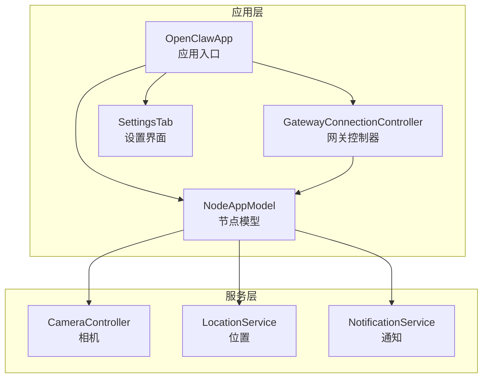
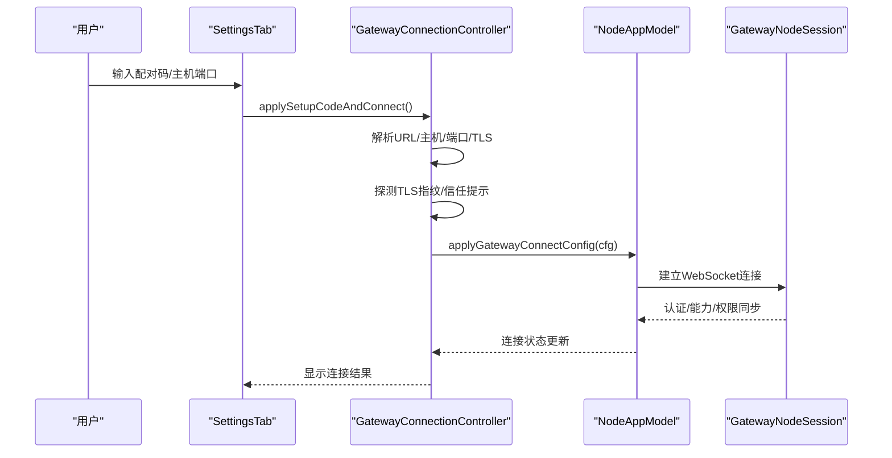
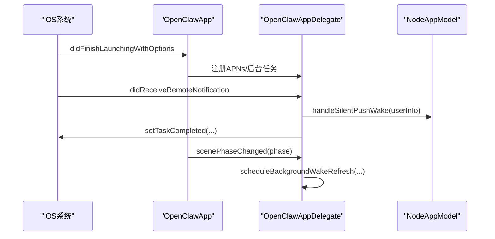
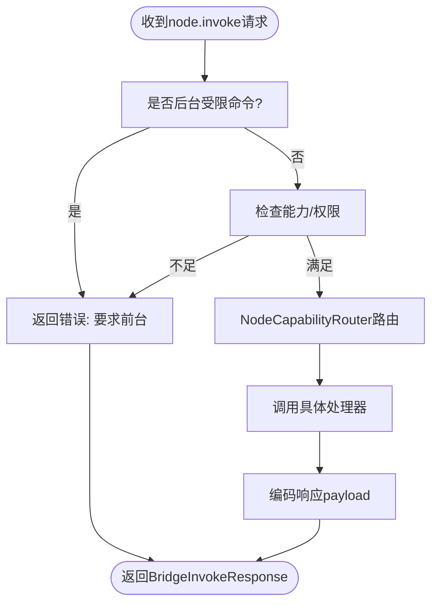
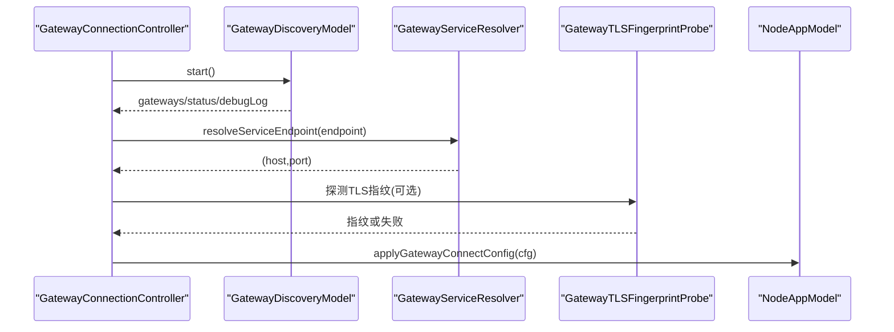
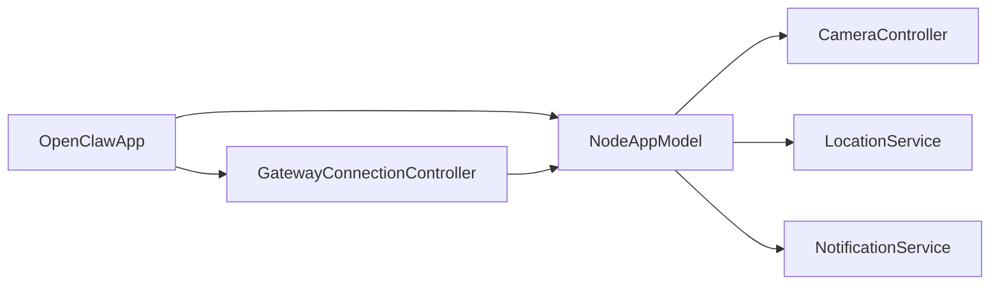

# iOS节点

<cite>
**本文引用的文件**
- [OpenClawApp.swift](file://apps/ios/Sources/OpenClawApp.swift)
- [NodeAppModel.swift](file://apps/ios/Sources/Model/NodeAppModel.swift)
- [GatewayConnectionController.swift](file://apps/ios/Sources/Gateway/GatewayConnectionController.swift)
- [README.md](file://apps/ios/README.md)
- [CameraController.swift](file://apps/ios/Sources/Camera/CameraController.swift)
- [LocationService.swift](file://apps/ios/Sources/Location/LocationService.swift)
- [NotificationService.swift](file://apps/ios/Sources/Services/NotificationService.swift)
- [SettingsTab.swift](file://apps/ios/Sources/Settings/SettingsTab.swift)
</cite>

## 目录
1. [简介](#简介)
2. [项目结构](#项目结构)
3. [核心组件](#核心组件)
4. [架构总览](#架构总览)
5. [详细组件分析](#详细组件分析)
6. [依赖关系分析](#依赖关系分析)
7. [性能考虑](#性能考虑)
8. [故障排除指南](#故障排除指南)
9. [结论](#结论)
10. [附录](#附录)

## 简介
本文件面向OpenClaw的iOS节点应用，系统性阐述其功能特性、安装配置、使用方法与后台行为，并深入解析与网关的通信协议、设备配对机制与权限控制体系。文档同时覆盖iOS特有的能力（如相机、位置、通知与语音通话），并提供配置选项、故障排除与性能优化建议，帮助开发者与用户正确使用iOS节点。

## 项目结构
iOS节点位于apps/ios目录，采用SwiftUI与Swift语言开发，核心模块包括：
- 应用入口与生命周期：OpenClawApp.swift
- 节点模型与命令路由：NodeAppModel.swift
- 网关连接与发现：GatewayConnectionController.swift
- 设备能力与服务封装：相机、位置、通知等
- 设置界面与参数持久化：SettingsTab.swift
- 平台说明与部署指引：README.md

图表来源
- [OpenClawApp.swift](file://apps/ios/Sources/OpenClawApp.swift#L492-L526)
- [NodeAppModel.swift](file://apps/ios/Sources/Model/NodeAppModel.swift#L50-L219)
- [GatewayConnectionController.swift](file://apps/ios/Sources/Gateway/GatewayConnectionController.swift#L22-L80)

章节来源
- [OpenClawApp.swift](file://apps/ios/Sources/OpenClawApp.swift#L492-L526)
- [README.md](file://apps/ios/README.md#L1-L142)

## 核心组件
- 应用入口与生命周期
  - OpenClawAppDelegate负责APNs注册、静默推送唤醒、后台任务调度与手表提示动作桥接。
  - OpenClawApp初始化NodeAppModel与GatewayConnectionController，注入环境变量并处理深链入栈。
- 节点模型与命令路由
  - NodeAppModel集中处理canvas、camera、screen、location、device、watch、photos、contacts、calendar、reminders、motion、talk等命令分发与权限校验。
  - 支持前台/后台限制、健康检查、会话键管理、A2UI画布集成等。
- 网关连接与发现
  - GatewayConnectionController负责Bonjour/TXT服务发现、TLS指纹探测、信任提示、自动重连与连接参数构建。
  - 提供手动连接、上次已知连接恢复、首选网关稳定ID等策略。
- 设备能力与服务
  - 相机：支持拍照、短视频录制、设备枚举与质量/时长裁剪。
  - 位置：支持授权请求、一次性定位、显著位置变化监听与精度控制。
  - 通知：统一通知中心接口，支持授权状态查询与消息投递。
- 设置界面
  - 集成网关配对码、自动连接、手动主机端口、TLS开关、发现日志、设备信息与功能开关等。

章节来源
- [OpenClawApp.swift](file://apps/ios/Sources/OpenClawApp.swift#L16-L263)
- [NodeAppModel.swift](file://apps/ios/Sources/Model/NodeAppModel.swift#L50-L219)
- [GatewayConnectionController.swift](file://apps/ios/Sources/Gateway/GatewayConnectionController.swift#L22-L1072)
- [CameraController.swift](file://apps/ios/Sources/Camera/CameraController.swift#L6-L354)
- [LocationService.swift](file://apps/ios/Sources/Location/LocationService.swift#L6-L179)
- [NotificationService.swift](file://apps/ios/Sources/Services/NotificationService.swift#L12-L58)
- [SettingsTab.swift](file://apps/ios/Sources/Settings/SettingsTab.swift#L9-L509)

## 架构总览
iOS节点以NodeAppModel为核心协调器，通过GatewayNodeSession与网关建立双向通信；通过NodeCapabilityRouter将来自网关的node.invoke命令路由到具体服务；通过GatewayConnectionController完成网关发现、信任与连接；通过各服务模块（相机、位置、通知）提供设备能力。

图表来源
- [SettingsTab.swift](file://apps/ios/Sources/Settings/SettingsTab.swift#L714-L733)
- [GatewayConnectionController.swift](file://apps/ios/Sources/Gateway/GatewayConnectionController.swift#L95-L156)
- [NodeAppModel.swift](file://apps/ios/Sources/Model/NodeAppModel.swift#L141-L143)

## 详细组件分析

### 应用入口与生命周期（OpenClawApp）
- AppDelegate职责
  - 注册APNs、处理静默推送唤醒、调度后台刷新任务、桥接手表提示动作至NodeAppModel。
  - 在appModel可用时回填APNs设备令牌与待处理的手表动作队列。
- 应用生命周期
  - 监听scenePhase变化，触发后台任务调度与连接状态调整。
  - 处理深链入栈，交由NodeAppModel统一处理。

图表来源
- [OpenClawApp.swift](file://apps/ios/Sources/OpenClawApp.swift#L50-L96)
- [OpenClawApp.swift](file://apps/ios/Sources/OpenClawApp.swift#L104-L156)

章节来源
- [OpenClawApp.swift](file://apps/ios/Sources/OpenClawApp.swift#L16-L263)

### 节点模型与命令路由（NodeAppModel）
- 能力与命令路由
  - 通过NodeCapabilityRouter将命令映射到具体处理器，如canvas、camera、screen、location、device、watch、photos、contacts、calendar、reminders、motion、talk等。
  - 对后台受限命令进行拦截（canvas.*, camera.*, screen.*, talk.*），要求前台执行。
- 权限与状态
  - 维护网关连接状态、健康检查、会话键、设备状态、通知授权状态等。
  - 与VoiceWakeManager、TalkModeManager协作，避免麦克风资源冲突。
- 画布与A2UI
  - 支持canvas.present/hide/navigate/evalJS/snapshot与canvas.a2ui.push/reset等。
  - 与ScreenController交互，执行JavaScript与截图。

图表来源
- [NodeAppModel.swift](file://apps/ios/Sources/Model/NodeAppModel.swift#L711-L757)
- [NodeAppModel.swift](file://apps/ios/Sources/Model/NodeAppModel.swift#L1366-L1488)

章节来源
- [NodeAppModel.swift](file://apps/ios/Sources/Model/NodeAppModel.swift#L50-L219)
- [NodeAppModel.swift](file://apps/ios/Sources/Model/NodeAppModel.swift#L711-L821)
- [NodeAppModel.swift](file://apps/ios/Sources/Model/NodeAppModel.swift#L823-L962)
- [NodeAppModel.swift](file://apps/ios/Sources/Model/NodeAppModel.swift#L964-L1059)
- [NodeAppModel.swift](file://apps/ios/Sources/Model/NodeAppModel.swift#L1061-L1158)
- [NodeAppModel.swift](file://apps/ios/Sources/Model/NodeAppModel.swift#L1160-L1213)
- [NodeAppModel.swift](file://apps/ios/Sources/Model/NodeAppModel.swift#L1215-L1362)

### 网关连接与发现（GatewayConnectionController）
- 发现与信任
  - 通过Bonjour/TXT解析服务端点，必要时探测TLS指纹并弹出信任提示。
  - 自动连接策略：手动启用、上次已知连接、首选稳定ID、最近发现ID、单网关直连。
- 连接参数
  - 动态生成clientId/displayName、角色与能力/命令/权限集合，按当前系统状态实时更新。
- TLS与安全
  - 强制TLS（除本地回环场景），存储指纹用于后续信任复用。

图表来源
- [GatewayConnectionController.swift](file://apps/ios/Sources/Gateway/GatewayConnectionController.swift#L285-L429)
- [GatewayConnectionController.swift](file://apps/ios/Sources/Gateway/GatewayConnectionController.swift#L525-L538)
- [GatewayConnectionController.swift](file://apps/ios/Sources/Gateway/GatewayConnectionController.swift#L516-L523)

章节来源
- [GatewayConnectionController.swift](file://apps/ios/Sources/Gateway/GatewayConnectionController.swift#L22-L1072)

### 相机服务（CameraController）
- 能力
  - 列举视频设备、拍照（JPEG）、短视频录制（MP4，含音频可选）。
  - 参数裁剪：最大宽度、质量、时长、前置/后置摄像头选择。
- 错误处理
  - 权限缺失、设备不可用、导出失败等错误类型化，便于上层展示与日志追踪。

章节来源
- [CameraController.swift](file://apps/ios/Sources/Camera/CameraController.swift#L6-L354)

### 位置服务（LocationService）
- 能力
  - 授权请求（WhenInUse/Always）、一次性定位、显著位置变化监听、位置流式输出。
  - 支持超时与年龄过滤，适配前台/后台不同精度需求。
- 注意
  - 后台位置需Always授权；显著位置变化适合自动化信号而非持续保活。

章节来源
- [LocationService.swift](file://apps/ios/Sources/Location/LocationService.swift#L6-L179)

### 通知服务（NotificationService）
- 能力
  - 统一通知中心接口：授权状态查询、授权请求、消息添加。
  - 为系统通知与手表镜像通知提供一致抽象。
- 使用
  - NodeAppModel在需要时请求授权并投递通知，支持优先级与声音控制。

章节来源
- [NotificationService.swift](file://apps/ios/Sources/Services/NotificationService.swift#L12-L58)
- [NodeAppModel.swift](file://apps/ios/Sources/Model/NodeAppModel.swift#L1061-L1158)

### 设置界面（SettingsTab）
- 网关
  - 配对码输入与应用、自动连接开关、手动主机端口/TLS、发现日志与调试信息。
- 设备功能
  - 语音唤醒、Talk模式、后台监听、相机权限、位置访问模式、防止休眠、默认分享指令等。
- 设备信息
  - 名称、实例ID、设备型号、平台与版本等。

章节来源
- [SettingsTab.swift](file://apps/ios/Sources/Settings/SettingsTab.swift#L9-L509)

## 依赖关系分析
- 组件耦合
  - OpenClawApp依赖NodeAppModel与GatewayConnectionController作为主要运行时依赖。
  - NodeAppModel聚合多个服务（相机、位置、通知、设备状态等），并通过NodeCapabilityRouter解耦命令处理。
  - GatewayConnectionController与NodeAppModel双向协作，前者负责连接，后者负责会话与命令处理。
- 外部依赖
  - 网络：WebSocket（wss/ws）连接网关。
  - 系统框架：UserNotifications、CoreLocation、AVFoundation、Photos、EventKit、Watch Connectivity等。
- 循环依赖
  - 未见直接循环依赖；通过协议与弱引用降低耦合。

图表来源
- [OpenClawApp.swift](file://apps/ios/Sources/OpenClawApp.swift#L492-L526)
- [NodeAppModel.swift](file://apps/ios/Sources/Model/NodeAppModel.swift#L50-L219)
- [GatewayConnectionController.swift](file://apps/ios/Sources/Gateway/GatewayConnectionController.swift#L22-L80)

章节来源
- [OpenClawApp.swift](file://apps/ios/Sources/OpenClawApp.swift#L492-L526)
- [NodeAppModel.swift](file://apps/ios/Sources/Model/NodeAppModel.swift#L50-L219)
- [GatewayConnectionController.swift](file://apps/ios/Sources/Gateway/GatewayConnectionController.swift#L22-L1072)

## 性能考虑
- 后台限制
  - canvas.*, camera.*, screen.*, talk.*在后台被限制，需前台执行；NodeAppModel在路由时进行严格检查。
- 连接与健康
  - 健康检查周期与失败回退策略，避免死连接与频繁重试。
- 资源占用
  - 位置显著变化监听适合自动化信号，不建议用作持续保活；相机导出与屏幕录制默认限制时长与分辨率，避免大负载。
- 电池优化
  - 后台任务调度与连接宽限期设计，减少不必要的网络活动；Talk后台监听需谨慎开启。

[本节为通用指导，无需特定文件引用]

## 故障排除指南
- 常见问题
  - 前台优先：后台命令无法执行，需先在前台验证功能再测试后台。
  - 位置权限：后台位置需Always授权；显著位置变化测试需足够移动距离或穿越地理围栏。
  - 配对与认证：配对/认证错误会暂停重连，需人工批准后再重连。
  - APNs：本地签名/推送能力/主题需匹配，否则注册失败。
- 调试步骤
  - 重新生成Xcode工程、确认团队与Bundle ID。
  - 在“设置->网关”查看状态、服务器名与远端地址，确认是否处于配对/认证阻塞。
  - 启用“发现调试日志”，查看“设置->网关->发现日志”。
  - 切换到手动主机端口+TLS，排查网络路径。
  - 在Xcode控制台按子系统/类别过滤日志（ai.openclaw.ios、GatewayDiag、APNs registration failed）。
  - 先在前台复现，再测试后台切换与回到前台后的重连。

章节来源
- [README.md](file://apps/ios/README.md#L101-L142)

## 结论
iOS节点以NodeAppModel为中心，结合GatewayConnectionController完成安全可靠的网关连接与能力同步；通过NodeCapabilityRouter将各类设备能力与命令进行解耦路由；配合设置界面与系统服务，提供完整的前台/后台使用体验。遵循后台限制、合理配置位置与通知权限、正确处理配对与认证流程，是获得稳定与高效使用体验的关键。

[本节为总结，无需特定文件引用]

## 附录

### 安装与部署
- 手动部署流程（Xcode 16+、pnpm、xcodegen、Apple开发签名）。
- 本地签名与推送能力要求，Debug/Release的APNs环境差异。

章节来源
- [README.md](file://apps/ios/README.md#L21-L61)

### iOS节点功能清单
- 前台可用命令：canvas.present/hide/navigate/evalJS/snapshot、camera.list/snap/clip、screen.record、location.get、device.status/info、watch.status/notify、photos.latest、contacts.search/add、calendar.events/add、reminders.list/add、motion.activity/pedometer、talk.pttStart/Stop/Cancel/Once。
- 限制命令：canvas.*, camera.*, screen.*, talk.*在后台不可用。
- 位置自动化：显著位置变化事件用于到达/离开/移动检测，非持续保活用途。

章节来源
- [NodeAppModel.swift](file://apps/ios/Sources/Model/NodeAppModel.swift#L1366-L1488)
- [README.md](file://apps/ios/README.md#L62-L100)