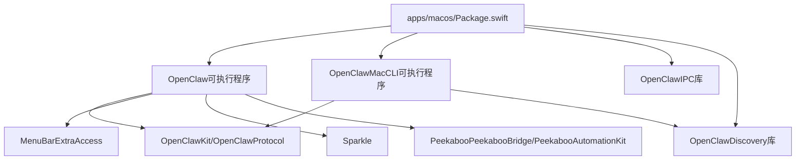
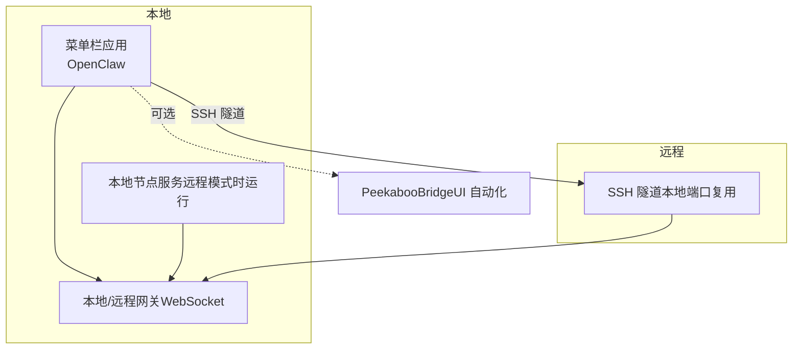
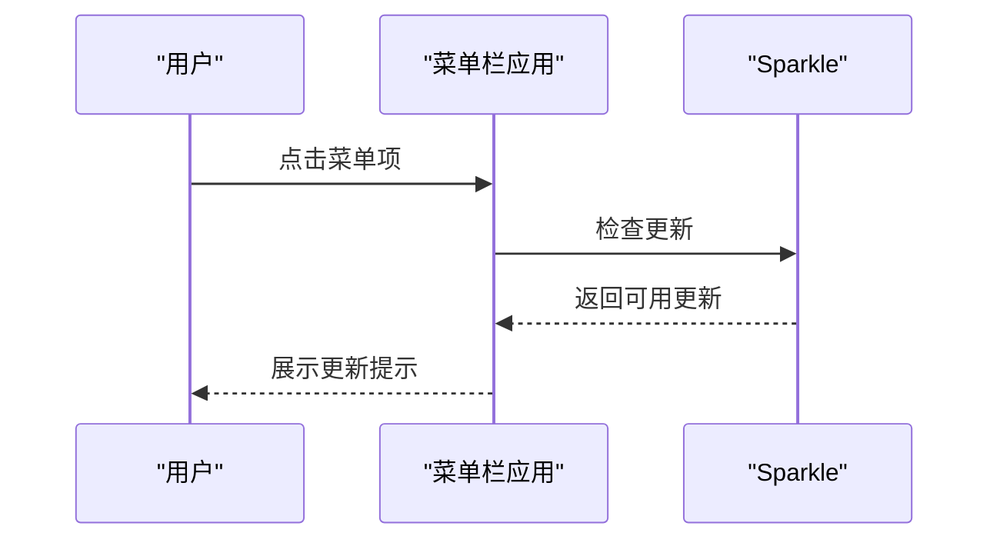
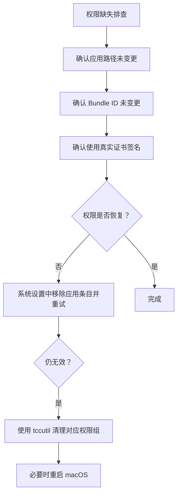
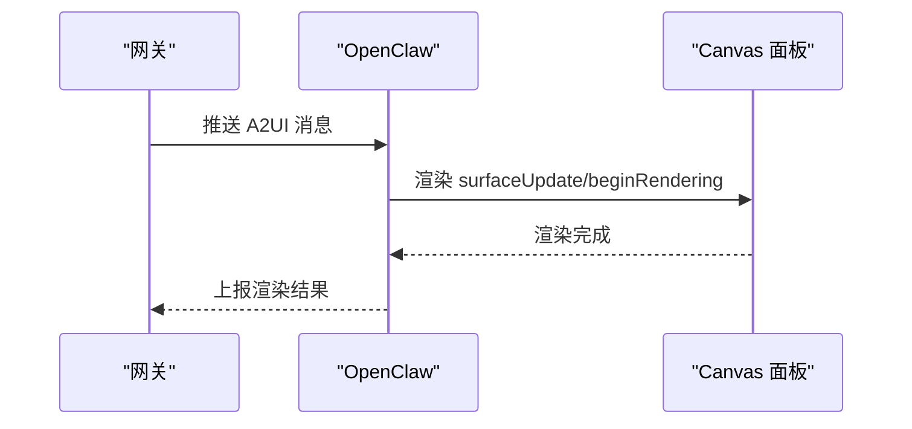
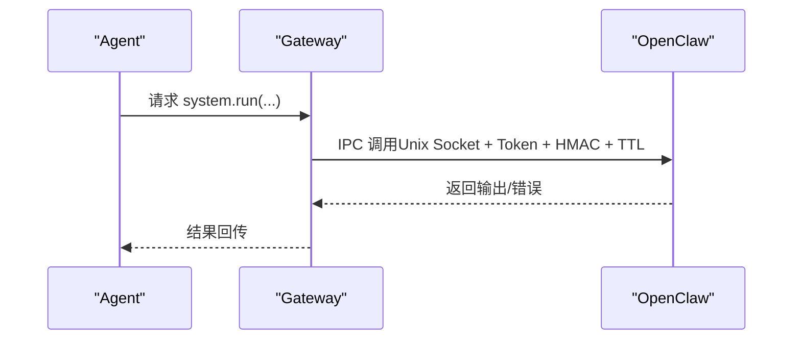
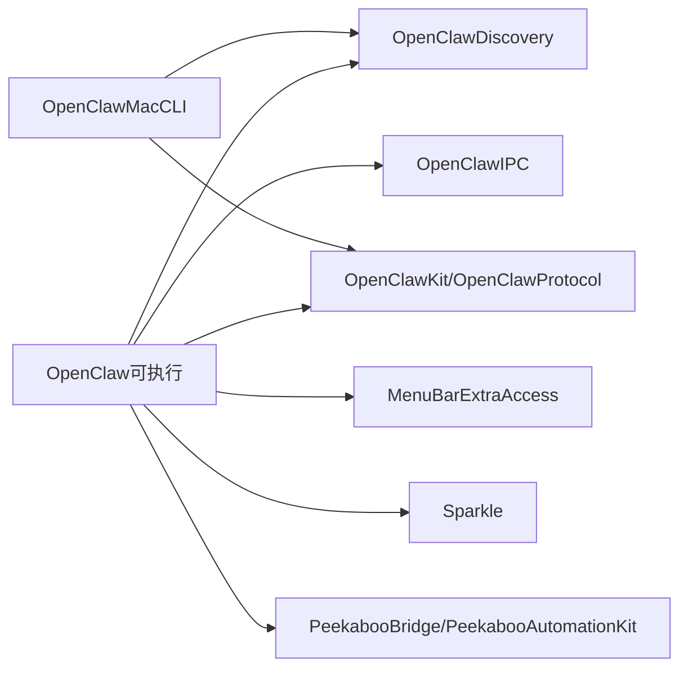

# macOS应用

<cite>
**本文引用的文件**
- [apps/macos/README.md](file://apps/macos/README.md)
- [apps/macos/Package.swift](file://apps/macos/Package.swift)
- [docs/platforms/macos.md](file://docs/platforms/macos.md)
- [docs/platforms/mac/permissions.md](file://docs/platforms/mac/permissions.md)
- [docs/platforms/mac/canvas.md](file://docs/platforms/mac/canvas.md)
- [apps/macos/Sources/OpenClaw/Resources/OpenClaw.icns](file://apps/macos/Sources/OpenClaw/Resources/OpenClaw.icns)
</cite>

## 目录
1. [简介](#简介)
2. [项目结构](#项目结构)
3. [核心组件](#核心组件)
4. [架构总览](#架构总览)
5. [详细组件分析](#详细组件分析)
6. [依赖关系分析](#依赖关系分析)
7. [性能考虑](#性能考虑)
8. [故障排除指南](#故障排除指南)
9. [结论](#结论)
10. [附录](#附录)

## 简介
OpenClaw 的 macOS 应用是一个菜单栏伴侣应用，负责：
- 在菜单栏显示状态与通知
- 统一管理 TCC 权限（通知、辅助功能、屏幕录制、麦克风、语音识别、自动化/AppleScript）
- 启动或连接到本地/远程网关（Gateway）
- 将 macOS 特有能力暴露为节点（Canvas、相机、屏幕录制、system.run）
- 在远程模式下启动/停止本地节点服务，并可选承载 PeekabooBridge 进行 UI 自动化
- 可按需安装全局 CLI（openclaw）

该应用通过 Swift 包组织，目标平台为 macOS 15+，并使用 MenuBarExtraAccess、Sparkle、Peekaboo 等第三方库。

## 项目结构
macOS 应用位于 apps/macos，核心文件包括：
- Package.swift：定义产品（可执行程序 OpenClaw、OpenClawMacCLI，以及库 OpenClawIPC、OpenClawDiscovery）
- README.md：开发运行与打包签名流程说明
- 文档目录 docs/platforms/mac 下的 macOS 平台相关文档，涵盖权限、Canvas、远程连接等主题

图表来源
- [apps/macos/Package.swift](file://apps/macos/Package.swift#L6-L92)

章节来源
- [apps/macos/Package.swift](file://apps/macos/Package.swift#L1-L93)
- [apps/macos/README.md](file://apps/macos/README.md#L1-L65)

## 核心组件
- OpenClaw（菜单栏应用）
  - 负责权限管理、网关生命周期控制、节点能力暴露、UI 自动化桥接（可选）
  - 使用 MenuBarExtraAccess 提供菜单栏入口，Sparkle 实现更新，Peekaboo 提供 UI 自动化能力
- OpenClawMacCLI（调试/连接 CLI）
  - 用于在不启动图形界面的情况下进行网关发现与连接测试
- OpenClawIPC（IPC 库）
  - 为应用与外部进程间通信提供基础能力
- OpenClawDiscovery（发现库）
  - 与网关发现与健康探测逻辑相关

章节来源
- [apps/macos/Package.swift](file://apps/macos/Package.swift#L26-L92)
- [docs/platforms/macos.md](file://docs/platforms/macos.md#L15-L34)

## 架构总览
OpenClaw macOS 应用与网关的交互采用“菜单栏 + 网关代理”的模式：
- 本地模式：若本地已有运行中的网关则附加；否则通过 launchd 安装并启动
- 远程模式：通过 SSH 隧道将本地 UI 组件与远程网关连通，保持控制面稳定

图表来源
- [docs/platforms/macos.md](file://docs/platforms/macos.md#L26-L34)
- [docs/platforms/macos.md](file://docs/platforms/macos.md#L200-L219)

章节来源
- [docs/platforms/macos.md](file://docs/platforms/macos.md#L26-L34)
- [docs/platforms/macos.md](file://docs/platforms/macos.md#L200-L219)

## 详细组件分析

### 菜单栏与系统集成
- 菜单栏入口由 MenuBarExtraAccess 提供，应用在托盘区域显示状态与快捷操作
- Sparkle 用于应用更新检查与安装
- 应用图标资源位于 OpenClaw.icns，作为菜单栏与 Dock 的标识

图表来源
- [apps/macos/Package.swift](file://apps/macos/Package.swift#L18-L21)
- [apps/macos/Package.swift](file://apps/macos/Package.swift#L51-L56)

章节来源
- [apps/macos/Package.swift](file://apps/macos/Package.swift#L18-L21)
- [apps/macos/Package.swift](file://apps/macos/Package.swift#L51-L56)
- [apps/macos/Sources/OpenClaw/Resources/OpenClaw.icns](file://apps/macos/Sources/OpenClaw/Resources/OpenClaw.icns#L1-L594)

### 权限管理与 TCC
- macOS 权限（TCC）与应用签名、Bundle ID、路径绑定，任一变化可能导致权限丢失
- 建议固定路径、使用真实证书签名、保持 Bundle ID 一致
- 若权限消失，可通过系统设置移除条目后重新授予，必要时使用 tccutil 清理并重启

图表来源
- [docs/platforms/mac/permissions.md](file://docs/platforms/mac/permissions.md#L16-L26)
- [docs/platforms/mac/permissions.md](file://docs/platforms/mac/permissions.md#L27-L33)

章节来源
- [docs/platforms/mac/permissions.md](file://docs/platforms/mac/permissions.md#L10-L51)

### Canvas 面板与 A2UI
- Canvas 以 WKWebView 嵌入，提供无边框、可调整大小的面板，靠近菜单栏或鼠标位置
- 文件通过自定义 URL 方案 openclaw-canvas:// 访问，支持自动重载与会话隔离
- 支持 A2UI v0.8 的推送消息（beginRendering、surfaceUpdate、dataModelUpdate、deleteSurface），默认 A2UI 主机地址为网关主机的 18789 端口

图表来源
- [docs/platforms/mac/canvas.md](file://docs/platforms/mac/canvas.md#L67-L89)
- [docs/platforms/mac/canvas.md](file://docs/platforms/mac/canvas.md#L73-L77)

章节来源
- [docs/platforms/mac/canvas.md](file://docs/platforms/mac/canvas.md#L10-L126)

### 网关通信与本地执行
- 本地模式：若存在本地网关则附加；否则通过 launchd 安装并启动
- 远程模式：通过 SSH 隧道将本地 UI 组件与远程网关连通，控制面端口稳定复用
- system.run 在应用上下文中执行，受 Exec 审批策略控制，支持环境变量过滤与白名单

图表来源
- [docs/platforms/macos.md](file://docs/platforms/macos.md#L61-L73)
- [docs/platforms/macos.md](file://docs/platforms/macos.md#L75-L111)

章节来源
- [docs/platforms/macos.md](file://docs/platforms/macos.md#L26-L34)
- [docs/platforms/macos.md](file://docs/platforms/macos.md#L61-L73)
- [docs/platforms/macos.md](file://docs/platforms/macos.md#L75-L111)

### 设置与快捷键
- 设置项包括：是否允许 Canvas、Exec 审批策略（安全策略、询问策略、允许列表）、远程模式下的隧道行为等
- 快捷键：菜单栏应用提供常用操作入口；Canvas 可通过 deep link 触发 agent 运行

章节来源
- [docs/platforms/macos.md](file://docs/platforms/macos.md#L75-L111)
- [docs/platforms/mac/canvas.md](file://docs/platforms/mac/canvas.md#L107-L120)

## 依赖关系分析
- 外部依赖
  - MenuBarExtraAccess：菜单栏入口
  - Subprocess：子进程管理
  - Logging：日志记录
  - Sparkle：应用更新
  - Peekaboo（PeekabooBridge、PeekabooAutomationKit）：UI 自动化
- 内部依赖
  - OpenClawKit/OpenClawProtocol：与网关通信协议与 UI 协作
  - OpenClawIPC：IPC 能力
  - OpenClawDiscovery：网关发现与健康探测

图表来源
- [apps/macos/Package.swift](file://apps/macos/Package.swift#L42-L78)

章节来源
- [apps/macos/Package.swift](file://apps/macos/Package.swift#L17-L57)

## 性能考虑
- Canvas 自动重载与文件监控可能带来 I/O 开销，建议在开发阶段启用，生产环境谨慎开启
- 远程模式下的 SSH 隧道应避免频繁重建，保持端口复用以降低握手成本
- system.run 的环境变量过滤与命令解析应在保证安全的前提下尽量减少额外处理

## 故障排除指南
- 权限问题
  - 固定应用路径、使用真实证书签名、保持 Bundle ID 一致
  - 如权限消失，先在系统设置中移除应用条目并重试；仍无效时使用 tccutil 清理对应权限组；必要时重启 macOS
- Canvas 无法加载或样式异常
  - 确认 openclaw-canvas:// 会话根目录下文件存在且未越权访问
  - 检查 A2UI 消息格式是否符合 v0.8
- 远程连接失败
  - 检查 SSH 隧道端口占用与连通性；确认网关控制面端口稳定复用
- CLI 调试
  - 使用 OpenClawMacCLI 的 discover/connect 命令验证网关发现与连接逻辑

章节来源
- [docs/platforms/mac/permissions.md](file://docs/platforms/mac/permissions.md#L27-L51)
- [docs/platforms/macos.md](file://docs/platforms/macos.md#L171-L198)
- [docs/platforms/mac/canvas.md](file://docs/platforms/mac/canvas.md#L121-L126)

## 结论
OpenClaw 的 macOS 应用通过菜单栏入口、权限统一管理、网关连接与本地执行能力，为 Agent 提供了强大的 macOS 原生能力。配合 Sparkle 的更新机制与 Canvas/A2UI 的可视化工作区，用户可在本地或远程环境下高效地使用与扩展应用功能。遵循签名与权限稳定性要求、合理配置 Exec 审批策略与 Canvas 行为，是保障体验与安全的关键。

## 附录
- 开发与打包
  - 开发运行：使用 scripts/restart-mac.sh 快速启动
  - 打包签名：scripts/package-mac-app.sh 生成并签名 dist/OpenClaw.app
  - 签名策略：自动选择 Developer ID Application / Apple Distribution / Apple Development / 第一个可用身份；可使用环境变量切换 ad-hoc 签名或跳过团队 ID 校验
- 运行模式
  - 本地模式：附加本地网关或通过 launchd 安装并启动
  - 远程模式：通过 SSH 隧道连接远程网关，本地节点服务在远程模式下运行以供网关访问

章节来源
- [apps/macos/README.md](file://apps/macos/README.md#L3-L65)
- [docs/platforms/macos.md](file://docs/platforms/macos.md#L26-L34)
- [docs/platforms/macos.md](file://docs/platforms/macos.md#L200-L219)