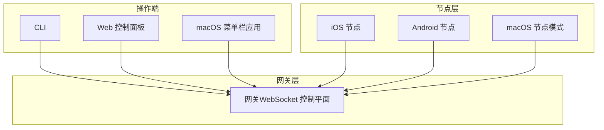
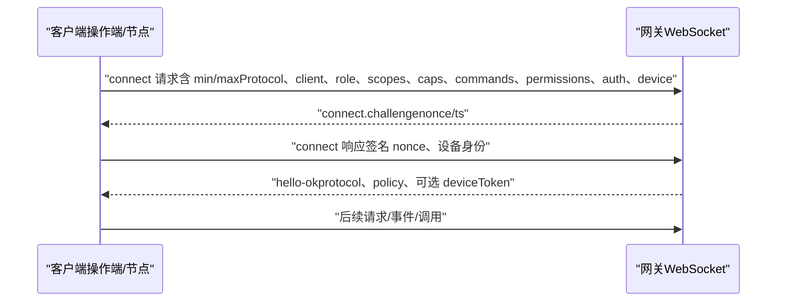
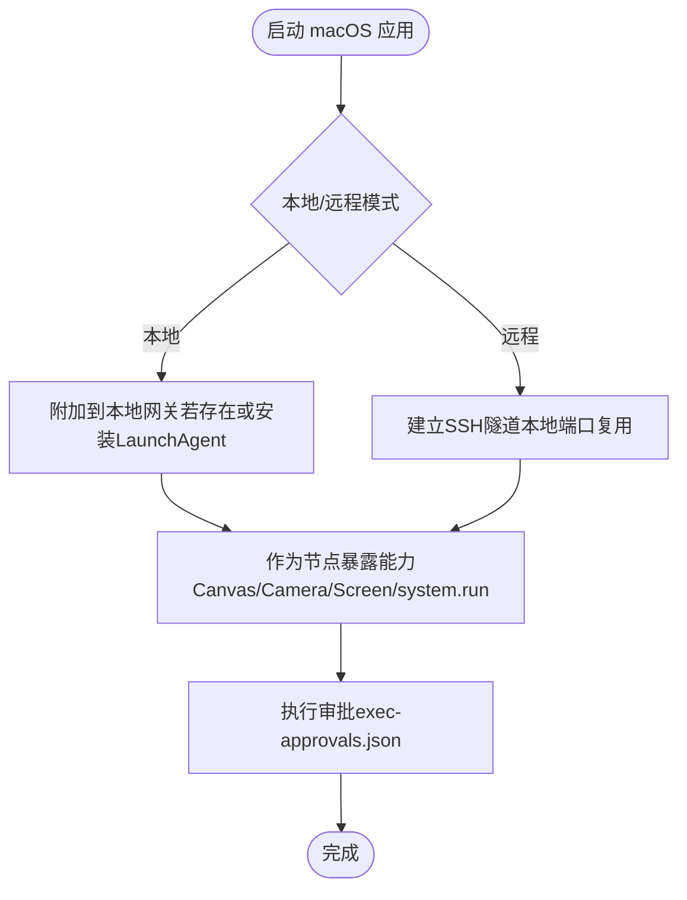
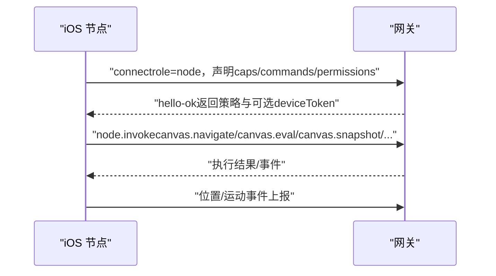
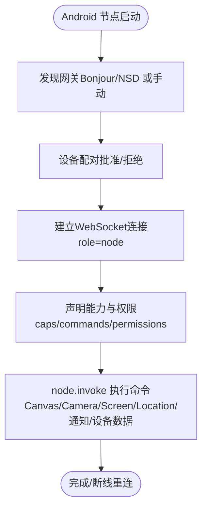
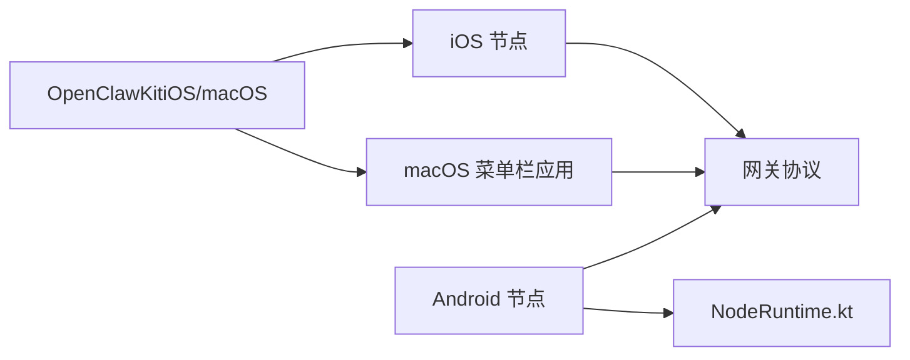

# 平台应用

<cite>
**本文引用的文件**
- [README.md](file://README.md)
- [apps/macos/README.md](file://apps/macos/README.md)
- [apps/ios/README.md](file://apps/ios/README.md)
- [apps/android/README.md](file://apps/android/README.md)
- [docs/platforms/macos.md](file://docs/platforms/macos.md)
- [docs/platforms/ios.md](file://docs/platforms/ios.md)
- [docs/platforms/android.md](file://docs/platforms/android.md)
- [docs/gateway/protocol.md](file://docs/gateway/protocol.md)
- [docs/nodes/index.md](file://docs/nodes/index.md)
- [docs/gateway/configuration.md](file://docs/gateway/configuration.md)
- [apps/shared/OpenClawKit/Package.swift](file://apps/shared/OpenClawKit/Package.swift)
- [apps/android/app/src/main/java/ai/openclaw/android/NodeRuntime.kt](file://apps/android/app/src/main/java/ai/openclaw/android/NodeRuntime.kt)
</cite>

## 目录
1. [简介](#简介)
2. [项目结构](#项目结构)
3. [核心组件](#核心组件)
4. [架构总览](#架构总览)
5. [详细组件分析](#详细组件分析)
6. [依赖关系分析](#依赖关系分析)
7. [性能考虑](#性能考虑)
8. [故障排除指南](#故障排除指南)
9. [结论](#结论)
10. [附录](#附录)

## 简介
本文件面向OpenClaw多平台应用（macOS菜单栏应用、iOS节点与Android节点）的最终用户与平台开发者，系统性阐述以下主题：
- 各平台应用的功能特性与使用方法
- 设备节点通信协议、权限管理、远程访问与本地执行机制
- 平台特定的集成方式、配置选项与最佳实践
- 故障排除与性能优化建议

OpenClaw以“网关控制平面 + 多客户端/节点”的架构运行：网关负责会话、通道、工具与事件；操作端（CLI/网页/菜单栏）与节点（macOS/iOS/Android）通过WebSocket连接，声明角色与作用域，实现跨平台协作与本地能力调用。

## 项目结构
- 平台应用位于 apps/ 下：
  - macOS：菜单栏应用与本地/远程模式、节点能力暴露、权限与执行审批
  - iOS：节点角色，Canvas渲染、语音唤醒/通话、位置自动化
  - Android：节点角色，Connect/Chat/Voice/Canvas命令面
- 协议与节点规范位于 docs/：
  - 网关协议（WebSocket握手、帧格式、版本与鉴权）
  - 节点（配对、能力、权限、系统命令、Canvas/A2UI等）
- 配置参考位于 docs/gateway/configuration.md
- 共享库（iOS/macOS）位于 apps/shared/OpenClawKit



图示来源
- [docs/gateway/protocol.md](file://docs/gateway/protocol.md#L10-L257)
- [docs/platforms/macos.md](file://docs/platforms/macos.md#L9-L227)
- [docs/platforms/ios.md](file://docs/platforms/ios.md#L10-L109)
- [docs/platforms/android.md](file://docs/platforms/android.md#L10-L170)

章节来源
- [README.md](file://README.md#L1-L560)
- [docs/gateway/protocol.md](file://docs/gateway/protocol.md#L1-L257)

## 核心组件
- 网关协议（WebSocket）：统一的控制平面与节点传输，支持握手、鉴权、事件与RPC调用
- 节点（Node）：以role=node连接，暴露Canvas、Camera、Screen、Location、System等命令
- 操作端（Operator）：以role=operator连接，具备读写/管理权限
- macOS菜单栏应用：可作为节点，提供Canvas、Camera、Screen Recording、system.run等能力，并管理本地/远程模式与执行审批
- iOS/Android节点：通过配对连接网关，提供Canvas、语音、相机/屏幕录制、位置、设备数据等命令

章节来源
- [docs/gateway/protocol.md](file://docs/gateway/protocol.md#L10-L257)
- [docs/nodes/index.md](file://docs/nodes/index.md#L10-L374)
- [docs/platforms/macos.md](file://docs/platforms/macos.md#L9-L227)
- [docs/platforms/ios.md](file://docs/platforms/ios.md#L10-L109)
- [docs/platforms/android.md](file://docs/platforms/android.md#L10-L170)

## 架构总览
OpenClaw采用“单WebSocket控制平面 + 多角色客户端”的统一协议模型。所有客户端在握手时声明：
- 客户端标识（id/version/platform/mode）
- 角色（operator/node）
- 作用域（scopes）
- 能力声明（caps）、命令白名单（commands）、权限映射（permissions）
- 鉴权（token/device签名）



图示来源
- [docs/gateway/protocol.md](file://docs/gateway/protocol.md#L22-L125)

章节来源
- [docs/gateway/protocol.md](file://docs/gateway/protocol.md#L10-L257)

## 详细组件分析

### macOS 应用（菜单栏 + 网关代理）
- 功能要点
  - 菜单栏状态与通知
  - 权限管理（TCC：通知、辅助功能、屏幕录制、麦克风、语音识别、自动化）
  - 本地/远程模式：本地Attach或通过SSH隧道连接远程网关
  - 作为节点暴露Canvas、Camera、Screen Recording、system.run等能力
  - 可选PeekabooBridge用于UI自动化
  - 可按需安装全局CLI（openclaw）
- 执行审批（system.run）
  - 存储于本地的exec-approvals.json，支持安全策略、询问与白名单
  - 对环境变量进行过滤与限制，避免危险注入
- 远程连接（SSH隧道）
  - 在远程模式下，应用打开SSH隧道，使本地UI组件能像本地一样访问远程网关
- 深链（openclaw://）
  - 支持从系统调起执行Agent请求，带确认与无钥匙静默模式



图示来源
- [docs/platforms/macos.md](file://docs/platforms/macos.md#L26-L111)
- [docs/platforms/macos.md](file://docs/platforms/macos.md#L200-L220)

章节来源
- [docs/platforms/macos.md](file://docs/platforms/macos.md#L9-L227)
- [apps/macos/README.md](file://apps/macos/README.md#L1-L65)

### iOS 节点（Canvas + 语音 + 位置）
- 角色与连接
  - 以role=node连接网关，支持Bonjour/LAN、Tailnet DNS-SD、手动主机端口
  - 通过设备配对（device pairing）建立信任
- 能力与命令
  - Canvas（WKWebView承载）、Screen快照、Camera抓拍/录制、Location、Talk模式、语音唤醒
  - 通过node.invoke驱动Canvas/A2UI、相机、屏幕录制、位置等
- 位置自动化
  - 使用后台位置权限触发移动/到达/离开事件，注意避免持续高功耗轮询
- 已知限制
  - 背景命令受限（Canvas/Camera/Screen/Talk在后台被限制）
  - 语音唤醒与Talk共用麦克风，Talk激活时抑制唤醒捕获
  - APNs可靠性依赖本地签名/配置/Topic一致性



图示来源
- [docs/platforms/ios.md](file://docs/platforms/ios.md#L14-L109)
- [docs/gateway/protocol.md](file://docs/gateway/protocol.md#L92-L125)

章节来源
- [docs/platforms/ios.md](file://docs/platforms/ios.md#L10-L109)
- [apps/ios/README.md](file://apps/ios/README.md#L1-L142)

### Android 节点（Connect/Chat/Voice/Canvas）
- 角色与连接
  - 以role=node直连网关WebSocket，默认端口18789；支持Bonjour/LAN、Tailnet DNS-SD、手动主机端口
  - 通过设备配对批准后自动重连
- 能力与命令
  - Canvas（A2UI）、Camera（snap/clip）、Screen（record）、Location、通知、联系人/日历、运动、照片、应用更新等
  - 语音：ElevenLabs或系统TTS回放；Talk模式在Android上已移除，仅保留语音开关
- 权限与体验
  - 需要相机/录音/位置/通知等权限；部分命令需前台运行
  - 通过前台服务维持连接与通知
- 运行与调试
  - 支持USB直连测试（adb reverse），无需局域网依赖
  - 提供集成能力测试套件与性能基准脚本



图示来源
- [docs/platforms/android.md](file://docs/platforms/android.md#L24-L170)
- [apps/android/README.md](file://apps/android/README.md#L1-L229)

章节来源
- [docs/platforms/android.md](file://docs/platforms/android.md#L10-L170)
- [apps/android/README.md](file://apps/android/README.md#L1-L229)
- [apps/android/app/src/main/java/ai/openclaw/android/NodeRuntime.kt](file://apps/android/app/src/main/java/ai/openclaw/android/NodeRuntime.kt#L1-L934)

### 协议与节点（通用）
- 角色与作用域
  - operator：控制平面客户端（CLI/UI/自动化）
  - node：能力宿主（Canvas/Camera/Screen/System等）
- 能力声明
  - caps：能力类别
  - commands：invoke允许列表
  - permissions：细粒度开关（如screen.record、camera.capture）
- 鉴权与设备身份
  - 首次握手需等待connect.challenge，客户端签名nonce并携带device身份
  - 成功后网关颁发deviceToken，可用于后续连接
- 执行审批（exec approvals）
  - 当需要system.run时，网关广播exec.approval.requested，由operator解析resolve
  - 不同平台的审批存储与策略一致（macOS本地exec-approvals.json、headless node host本地）

```mermaid
classDiagram
class Gateway {
+connect()
+hello_ok()
+exec_approval_requested()
+exec_approval_resolve()
}
class Node {
+role : "node"
+caps : ["canvas","camera","screen","location","voice"]
+commands : ["canvas.*","camera.*","screen.record","location.get",...]
+permissions : {"screen.record" : true/false,...}
}
class Operator {
+role : "operator"
+scopes : ["operator.read","operator.write",...]
}
Gateway <-- Node : "握手/鉴权/调用"
Gateway <-- Operator : "握手/鉴权/调用"
```

图示来源
- [docs/gateway/protocol.md](file://docs/gateway/protocol.md#L135-L257)
- [docs/nodes/index.md](file://docs/nodes/index.md#L145-L374)

章节来源
- [docs/gateway/protocol.md](file://docs/gateway/protocol.md#L10-L257)
- [docs/nodes/index.md](file://docs/nodes/index.md#L10-L374)

### 远程访问与本地执行
- 远程网关
  - 支持通过Tailscale Serve/Funnel或SSH隧道访问网关
  - macOS远程模式通过SSH隧道将本地端口映射到远程网关端口
- 本地执行（system.run）
  - macOS节点模式下，system.run在macOS应用上下文执行，受TCC与执行审批约束
  - headless node host在目标机器执行system.run，同样受本地exec-approvals.json约束
- 代理节点主机（node host）
  - 将执行转发至远端节点主机，结合SSH隧道与令牌认证

章节来源
- [docs/platforms/macos.md](file://docs/platforms/macos.md#L200-L220)
- [docs/nodes/index.md](file://docs/nodes/index.md#L45-L144)

## 依赖关系分析
- 平台共享库（iOS/macOS）
  - OpenClawKit：协议与聊天UI基础库
  - OpenClawProtocol：协议定义
  - OpenClawChatUI：基于Textual的聊天界面
- 平台特定实现
  - iOS：节点角色，Canvas、语音、位置、APNs注册
  - Android：节点角色，Connect/Chat/Voice/Canvas命令面，前台服务与权限管理
  - macOS：菜单栏应用，节点能力与执行审批



图示来源
- [apps/shared/OpenClawKit/Package.swift](file://apps/shared/OpenClawKit/Package.swift#L1-L62)
- [apps/android/app/src/main/java/ai/openclaw/android/NodeRuntime.kt](file://apps/android/app/src/main/java/ai/openclaw/android/NodeRuntime.kt#L1-L934)

章节来源
- [apps/shared/OpenClawKit/Package.swift](file://apps/shared/OpenClawKit/Package.swift#L1-L62)
- [apps/android/app/src/main/java/ai/openclaw/android/NodeRuntime.kt](file://apps/android/app/src/main/java/ai/openclaw/android/NodeRuntime.kt#L1-L934)

## 性能考虑
- 连接与重连
  - iOS：后台音频可能被挂起，建议前台使用；自动重连与场景切换恢复需优化
  - Android：前台服务维持连接；Canvas/A2UI/相机/屏幕录制需前台运行
- 传输与资源
  - Canvas快照/视频片段大小受控，避免超大负载
  - 语音回放（ElevenLabs + 系统TTS）按需启用，减少不必要的TTS开销
- 电池与热管理
  - iOS位置自动化避免持续高功耗轮询；Android后台任务严格限制
- 配置热重载
  - 大多数配置变更即时生效；网关服务器相关变更需重启

章节来源
- [apps/ios/README.md](file://apps/ios/README.md#L101-L142)
- [apps/android/README.md](file://apps/android/README.md#L165-L229)
- [docs/platforms/android.md](file://docs/platforms/android.md#L158-L170)
- [docs/gateway/configuration.md](file://docs/gateway/configuration.md#L349-L387)

## 故障排除指南
- 连接问题
  - iOS：检查APNs注册失败、推送能力/配置/Topic一致性；必要时开启发现调试日志
  - Android：USB直连测试（adb reverse）；确认前台服务与通知权限；校验TLS指纹与手动主机端口
  - macOS：对比macOS应用与CLI的发现逻辑差异，使用debug CLI验证握手与健康探测
- 权限与执行
  - macOS：system.run需执行审批；检查exec-approvals.json策略与白名单
  - Android：前台运行才能执行Canvas/Camera/Screen命令；相机/录音/位置权限缺失时报权限错误
- 节点状态
  - 使用nodes status与gateway call node.list确认节点配对与连接状态
  - 如出现“节点后台不可用”，请将应用置于前台并重试

章节来源
- [apps/ios/README.md](file://apps/ios/README.md#L120-L142)
- [apps/android/README.md](file://apps/android/README.md#L196-L229)
- [docs/platforms/macos.md](file://docs/platforms/macos.md#L171-L199)
- [docs/nodes/index.md](file://docs/nodes/index.md#L24-L44)

## 结论
OpenClaw通过统一的网关协议与节点模型，实现了跨平台协作与本地能力的安全调用。macOS菜单栏应用提供强大的本地权限与执行审批能力；iOS与Android节点则分别针对移动场景提供Canvas、语音、相机/屏幕录制与位置自动化等能力。配合远程访问与严格的权限/鉴权机制，OpenClaw在保证安全性的同时，提供了灵活且可扩展的多平台个人AI助手方案。

## 附录
- 快速开始
  - 启动网关：openclaw gateway --port 18789
  - iOS/Android：在设置中选择发现的网关或手动输入主机端口
  - 批准配对：openclaw devices list 与 openclaw devices approve <requestId>
- 配置参考
  - 网关配置：agents、channels、tools、session、sandbox、hooks、cron等
  - 节点命令：canvas.*、camera.*、screen.record、location.get、system.run等
- 平台特定最佳实践
  - iOS：前台优先；谨慎使用后台命令；APNs配置与推送能力保持一致
  - Android：前台服务与通知权限；USB直连测试；权限与命令联动
  - macOS：执行审批策略与环境变量过滤；远程模式下的SSH隧道稳定性

章节来源
- [README.md](file://README.md#L63-L81)
- [docs/gateway/configuration.md](file://docs/gateway/configuration.md#L1-L547)
- [docs/nodes/index.md](file://docs/nodes/index.md#L10-L374)
- [docs/platforms/ios.md](file://docs/platforms/ios.md#L28-L51)
- [docs/platforms/android.md](file://docs/platforms/android.md#L39-L112)
- [docs/platforms/macos.md](file://docs/platforms/macos.md#L139-L164)