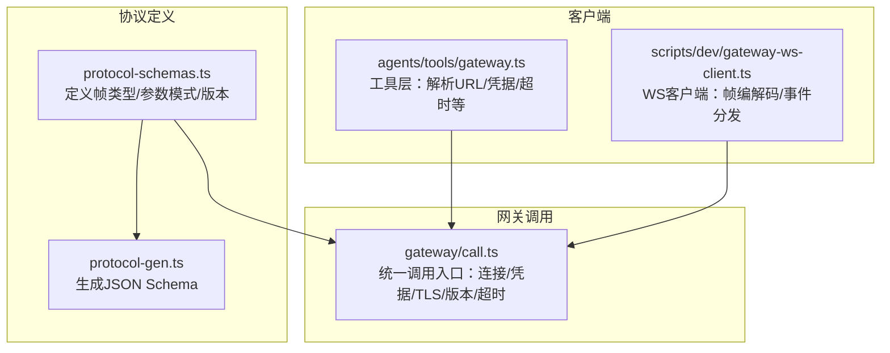
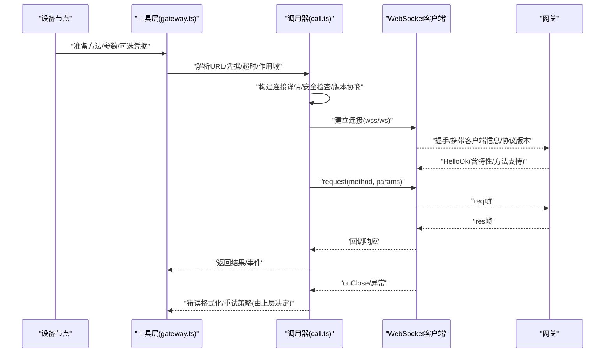
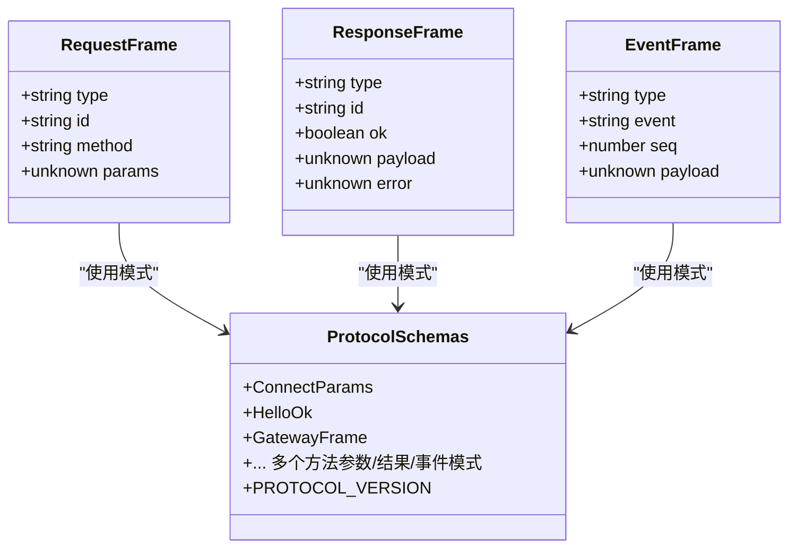
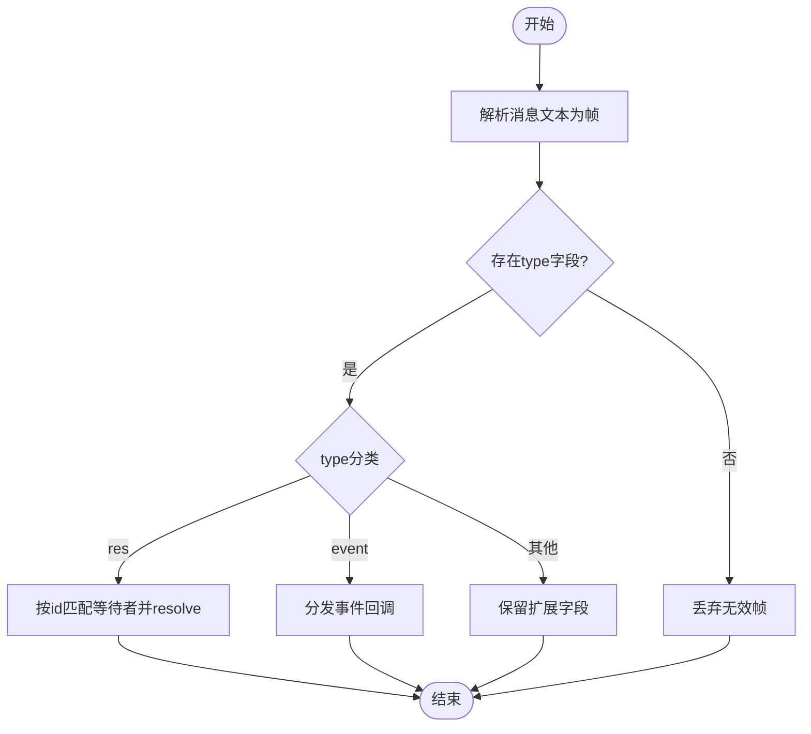
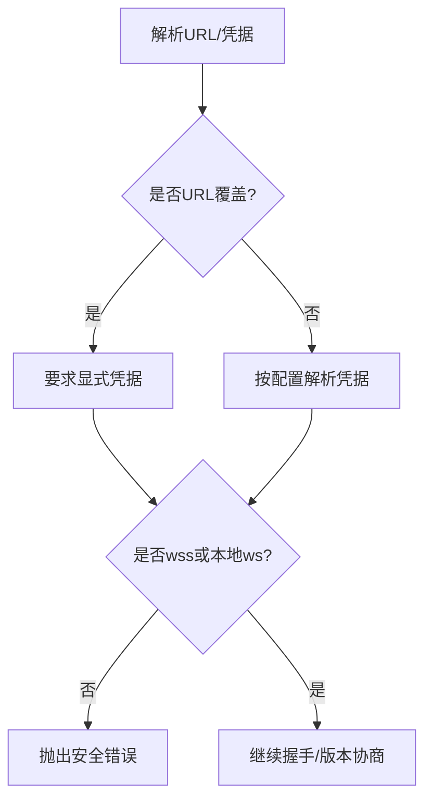
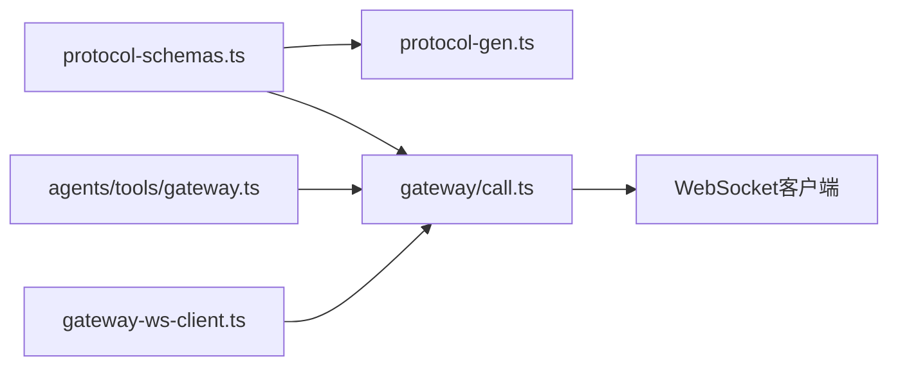

# 设备节点通信协议

<cite>
**本文引用的文件**
- [scripts/dev/gateway-ws-client.ts](file://scripts/dev/gateway-ws-client.ts)
- [src/gateway/protocol/schema/protocol-schemas.ts](file://src/gateway/protocol/schema/protocol-schemas.ts)
- [scripts/protocol-gen.ts](file://scripts/protocol-gen.ts)
- [src/agents/tools/gateway.ts](file://src/agents/tools/gateway.ts)
- [src/gateway/call.ts](file://src/gateway/call.ts)
</cite>

## 目录
1. [引言](#引言)
2. [项目结构](#项目结构)
3. [核心组件](#核心组件)
4. [架构总览](#架构总览)
5. [详细组件分析](#详细组件分析)
6. [依赖关系分析](#依赖关系分析)
7. [性能考虑](#性能考虑)
8. [故障排查指南](#故障排查指南)
9. [结论](#结论)
10. [附录](#附录)

## 引言
本文件面向设备节点（Node）与网关（Gateway）之间的通信协议，系统性阐述基于 WebSocket 的握手、请求/响应与事件帧格式、身份认证与权限控制、安全传输、协议版本管理与兼容策略、以及实现细节、调试方法与性能优化建议。目标是帮助开发者正确实现并集成设备节点的通信能力。

## 项目结构
围绕设备节点与网关通信的相关代码主要分布在以下模块：
- 协议定义与版本：协议帧类型、参数模式与版本常量
- 客户端工具：用于构建与网关交互的客户端封装
- 网关调用器：统一解析连接参数、凭据、TLS 指纹、超时与最小/最大协议版本，并发起请求
- 协议生成器：导出 JSON Schema 以描述协议帧集合

图表来源
- [src/gateway/protocol/schema/protocol-schemas.ts](file://src/gateway/protocol/schema/protocol-schemas.ts#L157-L292)
- [scripts/protocol-gen.ts](file://scripts/protocol-gen.ts#L1-L52)
- [src/agents/tools/gateway.ts](file://src/agents/tools/gateway.ts#L1-L161)
- [scripts/dev/gateway-ws-client.ts](file://scripts/dev/gateway-ws-client.ts#L1-L133)
- [src/gateway/call.ts](file://src/gateway/call.ts#L1-L758)

章节来源
- [src/gateway/protocol/schema/protocol-schemas.ts](file://src/gateway/protocol/schema/protocol-schemas.ts#L157-L292)
- [scripts/protocol-gen.ts](file://scripts/protocol-gen.ts#L1-L52)
- [src/agents/tools/gateway.ts](file://src/agents/tools/gateway.ts#L1-L161)
- [scripts/dev/gateway-ws-client.ts](file://scripts/dev/gateway-ws-client.ts#L1-L133)
- [src/gateway/call.ts](file://src/gateway/call.ts#L1-L758)

## 核心组件
- 协议帧与模式
  - 请求帧（req）、响应帧（res）、事件帧（event）三类帧通过字段 type 进行区分
  - 参数与结果均以 TypeBox 模式定义，便于运行时校验与生成 JSON Schema
  - 协议版本常量在协议定义中集中声明，当前版本号为 3
- 客户端工具
  - 解析命令行或配置中的网关地址，校验协议、路径、凭据等约束
  - 支持本地回环与远程网关的凭据解析与覆盖策略
- 网关调用器
  - 统一解析连接详情（URL 来源、绑定模式、远程回退提示）
  - 强制安全传输（ws 仅限 loopback；远程必须 wss），支持 TLS 指纹固定
  - 设置最小/最大协议版本，确保兼容性
  - 超时控制与关闭错误格式化
- 协议生成器
  - 将协议模式导出为 JSON Schema，支持外部工具进行校验与文档生成

章节来源
- [src/gateway/protocol/schema/protocol-schemas.ts](file://src/gateway/protocol/schema/protocol-schemas.ts#L157-L292)
- [scripts/protocol-gen.ts](file://scripts/protocol-gen.ts#L9-L42)
- [src/agents/tools/gateway.ts](file://src/agents/tools/gateway.ts#L26-L97)
- [src/gateway/call.ts](file://src/gateway/call.ts#L130-L219)

## 架构总览
下图展示从设备节点侧发起一次请求到接收响应的关键流程，包括握手、参数校验、凭据解析、TLS 固定与版本协商、请求发送与响应等待、以及错误处理与关闭事件。

图表来源
- [src/agents/tools/gateway.ts](file://src/agents/tools/gateway.ts#L116-L138)
- [src/gateway/call.ts](file://src/gateway/call.ts#L605-L677)
- [scripts/dev/gateway-ws-client.ts](file://scripts/dev/gateway-ws-client.ts#L52-L94)

章节来源
- [src/agents/tools/gateway.ts](file://src/agents/tools/gateway.ts#L116-L138)
- [src/gateway/call.ts](file://src/gateway/call.ts#L605-L677)
- [scripts/dev/gateway-ws-client.ts](file://scripts/dev/gateway-ws-client.ts#L52-L94)

## 详细组件分析

### 协议帧与数据模型
- 帧类型
  - req：请求帧，包含 type、id、method、params
  - res：响应帧，包含 type、id、ok、payload 或 error
  - event：事件帧，包含 type、event、seq、payload
- 参数与结果模式
  - 使用 TypeBox 模式对各方法的入参、返回值、事件载荷进行建模
  - 协议版本号集中定义于协议模式集合文件
- JSON Schema 导出
  - 通过协议生成器将所有模式打包为 JSON Schema，使用 discriminator 指定 type 字段映射

图表来源
- [src/gateway/protocol/schema/protocol-schemas.ts](file://src/gateway/protocol/schema/protocol-schemas.ts#L157-L292)
- [scripts/protocol-gen.ts](file://scripts/protocol-gen.ts#L9-L42)

章节来源
- [src/gateway/protocol/schema/protocol-schemas.ts](file://src/gateway/protocol/schema/protocol-schemas.ts#L157-L292)
- [scripts/protocol-gen.ts](file://scripts/protocol-gen.ts#L9-L42)

### WebSocket 客户端与消息序列化
- 帧编解码
  - 客户端将请求对象序列化为 JSON 文本并通过 WebSocket 发送
  - 接收端解析 JSON 并根据 type 分发至请求等待队列或事件回调
- 请求/响应匹配
  - 每个请求分配唯一 id，响应通过 id 匹配对应等待者
  - 超时触发拒绝并清理等待状态
- 事件处理
  - 事件帧按 event 名称分发给注册的回调函数
- 连接生命周期
  - 提供等待打开、关闭与清理逻辑，确保资源释放

图表来源
- [scripts/dev/gateway-ws-client.ts](file://scripts/dev/gateway-ws-client.ts#L96-L121)

章节来源
- [scripts/dev/gateway-ws-client.ts](file://scripts/dev/gateway-ws-client.ts#L1-L133)

### 身份验证、权限控制与安全传输
- 凭据解析与覆盖
  - 工具层支持显式传入 gatewayUrl 与 gatewayToken，或从配置解析
  - 对于 URL 覆盖场景，要求显式凭据，避免静默复用隐式凭据
- 安全传输强制
  - 非本地地址的 ws:// 明确禁止（CWE-319 高风险）
  - 远程访问默认要求 wss://；支持特定环境变量作为“断路”开关（仅限受信私网）
- TLS 指纹固定
  - 支持本地 TLS 运行时指纹或远程配置指纹，防止中间人攻击
- 最小/最大协议版本
  - 调用器在握手阶段设置 min/maxProtocol，确保兼容性与升级策略

图表来源
- [src/agents/tools/gateway.ts](file://src/agents/tools/gateway.ts#L56-L97)
- [src/gateway/call.ts](file://src/gateway/call.ts#L178-L200)
- [src/gateway/call.ts](file://src/gateway/call.ts#L638-L639)

章节来源
- [src/agents/tools/gateway.ts](file://src/agents/tools/gateway.ts#L56-L97)
- [src/gateway/call.ts](file://src/gateway/call.ts#L178-L200)
- [src/gateway/call.ts](file://src/gateway/call.ts#L638-L639)

### 协议版本管理、向后兼容与升级策略
- 版本常量
  - 协议版本号集中定义，当前版本为 3
- 最小/最大协议范围
  - 调用器在握手时设置 minProtocol 与 maxProtocol，确保新旧网关间平滑过渡
- 方法能力检测
  - 通过 HelloOk 中的 features.methods 列表校验所需方法是否可用，避免因方法缺失导致失败
- 升级策略
  - 新版本网关应保持对历史方法的支持；客户端可逐步提升 minProtocol 以推动迁移

章节来源
- [src/gateway/protocol/schema/protocol-schemas.ts](file://src/gateway/protocol/schema/protocol-schemas.ts#L291-L292)
- [src/gateway/call.ts](file://src/gateway/call.ts#L638-L646)

### 错误处理与重连机制
- 错误处理
  - 关闭事件格式化：包含关闭码与原因，并附带连接详情
  - 超时错误：明确超时时间与连接详情
  - 方法能力不足：当网关不支持所需方法时直接报错
- 重连机制
  - 当前客户端工具未内置自动重连逻辑；建议上层业务在捕获异常后自行决策重试策略（指数退避、最大重试次数、幂等键）

章节来源
- [src/gateway/call.ts](file://src/gateway/call.ts#L547-L564)
- [src/gateway/call.ts](file://src/gateway/call.ts#L566-L593)
- [scripts/dev/gateway-ws-client.ts](file://scripts/dev/gateway-ws-client.ts#L68-L78)

## 依赖关系分析
- 协议定义依赖 TypeBox 模式，统一了参数与结果的结构化约束
- 客户端工具依赖网关调用器提供的连接解析与凭据解析能力
- 调用器依赖协议版本常量与安全检查逻辑，保证连接安全与版本兼容
- 协议生成器依赖协议模式集合，输出 JSON Schema 供外部工具使用

图表来源
- [src/gateway/protocol/schema/protocol-schemas.ts](file://src/gateway/protocol/schema/protocol-schemas.ts#L157-L292)
- [scripts/protocol-gen.ts](file://scripts/protocol-gen.ts#L1-L52)
- [src/agents/tools/gateway.ts](file://src/agents/tools/gateway.ts#L1-L161)
- [scripts/dev/gateway-ws-client.ts](file://scripts/dev/gateway-ws-client.ts#L1-L133)
- [src/gateway/call.ts](file://src/gateway/call.ts#L1-L758)

章节来源
- [src/gateway/protocol/schema/protocol-schemas.ts](file://src/gateway/protocol/schema/protocol-schemas.ts#L157-L292)
- [scripts/protocol-gen.ts](file://scripts/protocol-gen.ts#L1-L52)
- [src/agents/tools/gateway.ts](file://src/agents/tools/gateway.ts#L1-L161)
- [scripts/dev/gateway-ws-client.ts](file://scripts/dev/gateway-ws-client.ts#L1-L133)
- [src/gateway/call.ts](file://src/gateway/call.ts#L1-L758)

## 性能考虑
- 连接复用
  - 在单次会话内复用同一 WebSocket 连接，减少握手开销
- 超时设置
  - 合理设置请求超时与打开超时，避免长时间阻塞
- 帧大小与事件频率
  - 控制事件载荷大小与事件发送频率，避免拥塞
- 幂等性
  - 对关键请求引入幂等键，便于在需要时进行去重与重放控制

## 故障排查指南
- 安全错误
  - 若出现“明文 ws 到非本地地址”的安全错误，请改用 wss:// 或通过受信隧道访问
- URL 覆盖与凭据
  - 使用 CLI/环境变量覆盖网关 URL 时，必须同时提供显式凭据
- 远程模式配置
  - 在远程模式下，若未配置远程 URL，将触发回退提示
- 关闭与超时
  - 记录关闭码与原因，结合连接详情定位问题
  - 超时错误需检查网络延迟、网关负载与超时阈值设置
- 方法能力
  - 当提示不支持某方法时，确认网关版本与方法列表

章节来源
- [src/gateway/call.ts](file://src/gateway/call.ts#L178-L200)
- [src/gateway/call.ts](file://src/gateway/call.ts#L129-L128)
- [src/gateway/call.ts](file://src/gateway/call.ts#L296-L307)
- [src/gateway/call.ts](file://src/gateway/call.ts#L547-L564)
- [src/gateway/call.ts](file://src/gateway/call.ts#L566-L593)

## 结论
OpenClaw 的设备节点与网关通信协议以清晰的帧模型、严格的凭据与安全策略、以及版本化的兼容设计为核心。通过工具层与调用器的协作，开发者可以快速、安全地实现与网关的交互。建议在生产环境中遵循安全传输、凭据显式化与版本兼容策略，并结合 JSON Schema 进行契约校验与文档生成。

## 附录
- JSON Schema 输出位置
  - 协议生成器会在仓库根目录的 dist 子目录生成 protocol.schema.json 文件
- 常用参数与字段
  - req：type、id、method、params
  - res：type、id、ok、payload 或 error
  - event：type、event、seq、payload
  - 协议版本：PROTOCOL_VERSION=3

章节来源
- [scripts/protocol-gen.ts](file://scripts/protocol-gen.ts#L36-L41)
- [src/gateway/protocol/schema/protocol-schemas.ts](file://src/gateway/protocol/schema/protocol-schemas.ts#L291-L292)