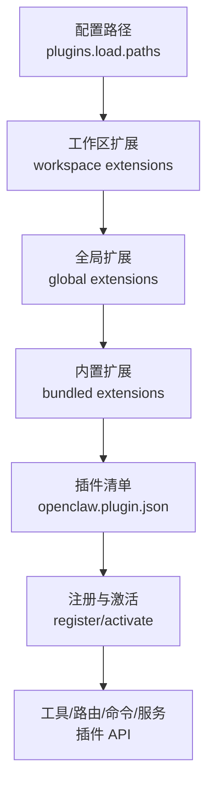
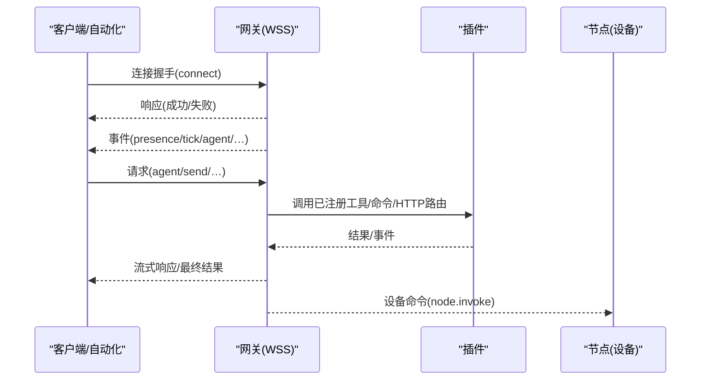
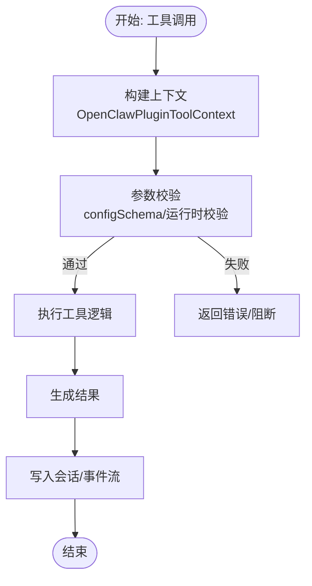
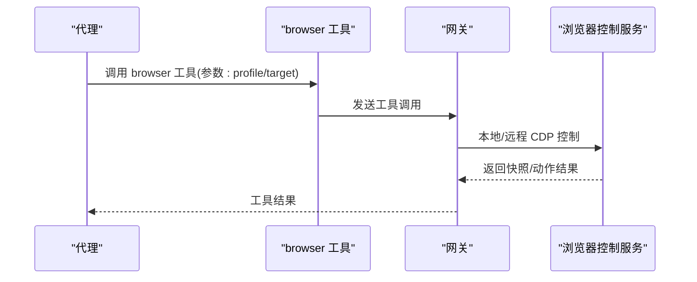
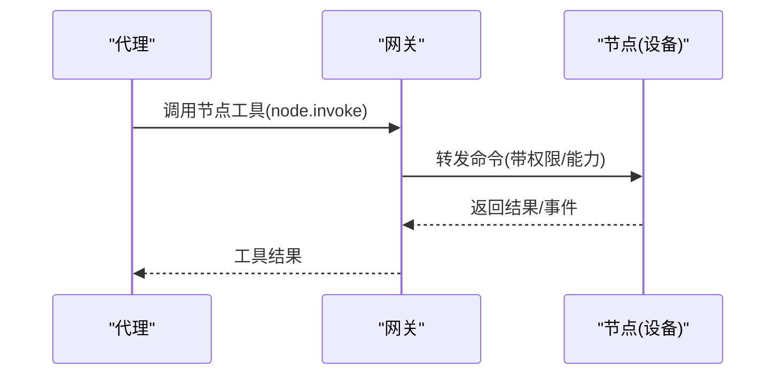
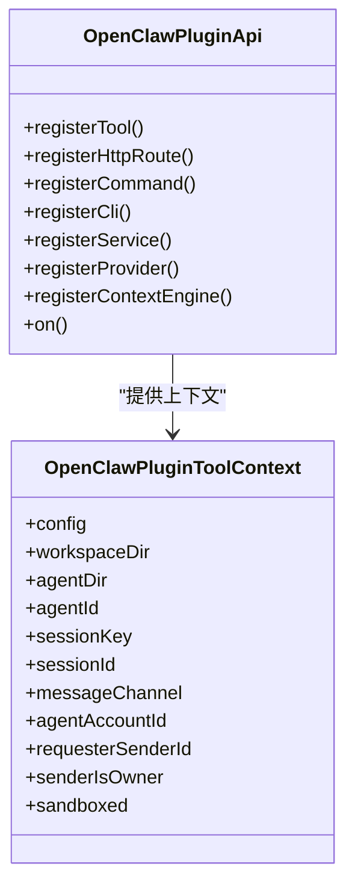
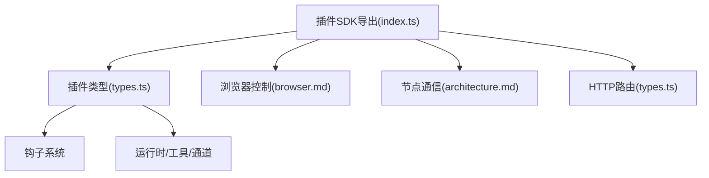

# 工具插件开发

<cite>
**本文引用的文件**
- [README.md](file://README.md)
- [plugin.md](file://docs/tools/plugin.md)
- [architecture.md](file://docs/concepts/architecture.md)
- [index.ts](file://src/plugin-sdk/index.ts)
- [types.ts](file://src/plugins/types.ts)
- [browser.md](file://docs/tools/browser.md)
- [exec.md](file://docs/tools/exec.md)
</cite>

## 目录
1. [简介](#简介)
2. [项目结构](#项目结构)
3. [核心组件](#核心组件)
4. [架构总览](#架构总览)
5. [详细组件分析](#详细组件分析)
6. [依赖关系分析](#依赖关系分析)
7. [性能考虑](#性能考虑)
8. [故障排查指南](#故障排查指南)
9. [结论](#结论)
10. [附录](#附录)

## 简介
本指南面向希望在 OpenClaw 平台上开发“工具插件”的开发者，系统讲解插件架构、开发模式与实现方法，覆盖工具定义、参数校验、执行流程、结果处理、权限与安全、错误处理与调试、测试策略、性能优化与发布流程等主题。文档同时提供浏览器控制工具、节点通信工具与自定义工具的完整实现思路与参考路径。

## 项目结构
OpenClaw 将“插件”作为扩展点，通过统一的插件 API 注册工具、HTTP 路由、命令、上下文引擎、通道适配器等能力。插件以 TypeScript 模块形式加载，运行于网关进程内，具备与核心系统同等的信任级别。

- 插件发现与加载顺序（优先级从高到低）：
  - 配置路径（plugins.load.paths）
  - 工作区扩展（workspace extensions）
  - 全局扩展（global extensions）
  - 内置扩展（bundled extensions）

- 插件清单与配置：
  - 每个插件根目录需包含 openclaw.plugin.json 清单文件
  - 支持 JSON Schema 校验与 UI 提示字段
  - 插件可通过 plugins.entries.<id> 进行启用与配置

- 安全与信任：
  - 对非内置插件进行路径安全检查与来源审计
  - 可通过 plugins.allow 列表限定可加载插件
  - 加载后未被追踪的插件会发出警告，建议使用安装跟踪或白名单

图表来源
- [plugin.md](file://docs/tools/plugin.md#L227-L276)
- [plugin.md](file://docs/tools/plugin.md#L356-L391)

章节来源
- [plugin.md](file://docs/tools/plugin.md#L227-L276)
- [plugin.md](file://docs/tools/plugin.md#L356-L391)

## 核心组件
- 插件 API（OpenClawPluginApi）：提供注册工具、HTTP 路由、命令、通道、网关方法、CLI、服务、上下文引擎、生命周期钩子等能力
- 插件类型与上下文（OpenClawPluginToolContext）：提供会话、代理、工作区、沙箱状态等上下文信息
- 插件钩子（PluginHookName）：贯穿提示构建、消息收发、工具调用、会话生命周期等阶段
- 插件 HTTP 路由：支持精确匹配或前缀匹配，支持插件自管认证或网关认证
- 插件命令：无需触发大模型推理的自动回复命令
- 插件服务：后台服务的启动/停止生命周期

章节来源
- [types.ts](file://src/plugins/types.ts#L257-L300)
- [types.ts](file://src/plugins/types.ts#L58-L77)
- [types.ts](file://src/plugins/types.ts#L315-L366)
- [types.ts](file://src/plugins/types.ts#L207-L213)
- [types.ts](file://src/plugins/types.ts#L186-L197)
- [types.ts](file://src/plugins/types.ts#L231-L235)

## 架构总览
OpenClaw 的网关通过 WebSocket 控制平面承载所有消息面与事件；客户端（桌面应用、CLI、Web UI、自动化）与节点（macOS/iOS/Android/headless）均连接到同一网关。插件在网关进程中以受信方式运行，可注册工具、HTTP 路由、命令、服务等。

图表来源
- [architecture.md](file://docs/concepts/architecture.md#L59-L78)

章节来源
- [architecture.md](file://docs/concepts/architecture.md#L12-L140)

## 详细组件分析

### 工具插件开发（核心概念）
- 工具定义：通过 registerTool 注册 AnyAgentTool 或工厂函数，支持单工具或多工具返回
- 参数验证：插件清单中的 configSchema 与 JSON Schema 用于配置校验；插件也可在运行时进行参数校验
- 执行流程：工具在 OpenClawPluginToolContext 上下文中执行，包含会话键、代理标识、请求者身份、沙箱状态等
- 结果处理：工具返回值将进入会话转录与后续处理链，插件可利用 before_tool_call/after_tool_call 钩子进行拦截与增强

图表来源
- [types.ts](file://src/plugins/types.ts#L58-L77)
- [types.ts](file://src/plugins/types.ts#L44-L56)

章节来源
- [types.ts](file://src/plugins/types.ts#L58-L77)
- [types.ts](file://src/plugins/types.ts#L44-L56)

### 浏览器控制工具（浏览器插件）
- 功能概述：OpenClaw 提供专用的 openclaw 浏览器与 Chrome 扩展中继两种模式，支持标签页控制、快照、截图、PDF、动作、等待、状态设置等
- 配置要点：支持多配置文件、远程 CDP、SSRF 策略、无头模式、可执行路径选择等
- 安全与隔离：浏览器 profile 与个人浏览器隔离；Loopback 仅访问；远程 CDP 需隧道保护
- 与插件结合：可通过工具参数选择 profile 与执行目标（沙箱/主机/节点），并在沙箱会话中通过 target="host" 或允许主机控制策略启用宿主控制

图表来源
- [browser.md](file://docs/tools/browser.md#L358-L370)
- [browser.md](file://docs/tools/browser.md#L592-L611)

章节来源
- [browser.md](file://docs/tools/browser.md#L54-L103)
- [browser.md](file://docs/tools/browser.md#L245-L252)
- [browser.md](file://docs/tools/browser.md#L592-L611)

### 节点通信工具（节点插件）
- 节点角色：节点通过 WebSocket 连接网关，声明 capabilities 与命令集合
- 设备权限：macOS TCC 权限、屏幕录制、通知等需要显式授权
- 通信模式：网关通过 node.invoke 路由到节点，节点返回执行结果
- 插件侧关注：注册节点能力、处理节点状态、在工具中选择 target=node 或自动路由

图表来源
- [architecture.md](file://docs/concepts/architecture.md#L42-L48)

章节来源
- [architecture.md](file://docs/concepts/architecture.md#L42-L48)

### 自定义工具（通用插件）
- 工具工厂：通过 OpenClawPluginToolFactory 在不同上下文中返回不同的工具实例
- 参数校验：结合 JSON Schema 与运行时校验，确保输入安全与正确性
- 钩子集成：在 before_tool_call/after_tool_call 中进行参数修改、结果过滤或日志记录
- 结果持久化：利用 tool_result_persist 钩子对转录内容进行裁剪或增强

章节来源
- [types.ts](file://src/plugins/types.ts#L75-L77)
- [types.ts](file://src/plugins/types.ts#L600-L627)
- [types.ts](file://src/plugins/types.ts#L629-L651)

### 插件 HTTP 路由与命令
- HTTP 路由：registerHttpRoute 支持精确匹配与前缀匹配，auth 可选 gateway 或 plugin
- 插件命令：registerCommand 注册无需大模型参与的自动回复命令，优先于内置命令与代理调用
- CLI 扩展：registerCli 注册插件专属 CLI 子命令

章节来源
- [types.ts](file://src/plugins/types.ts#L207-L213)
- [types.ts](file://src/plugins/types.ts#L186-L197)
- [types.ts](file://src/plugins/types.ts#L215-L222)

### 插件钩子（生命周期与提示注入）
- 提示注入钩子：before_model_resolve、before_prompt_build、before_agent_start（兼容）
- 消息与工具钩子：message_received/sending/sent、before_tool_call/after_tool_call、tool_result_persist、before_message_write
- 会话与子代理钩子：session_start/end、subagent_spawning/delivery_target/spawned/ended
- 网关钩子：gateway_start、gateway_stop

图表来源
- [types.ts](file://src/plugins/types.ts#L257-L300)
- [types.ts](file://src/plugins/types.ts#L58-L77)

章节来源
- [types.ts](file://src/plugins/types.ts#L315-L366)
- [types.ts](file://src/plugins/types.ts#L781-L800)

## 依赖关系分析
- 插件 SDK 导出：index.ts 汇总了插件开发常用类型、工具、通道适配器、运行时、Webhook、SSRF 等能力
- 插件 API 与核心系统的耦合：插件在网关进程中运行，与配置、通道、钩子、运行时紧密耦合
- 外部依赖：浏览器控制依赖 CDP/Playwright；节点通信依赖 WebSocket；HTTP 路由依赖网关 HTTP 服务器

图表来源
- [index.ts](file://src/plugin-sdk/index.ts#L1-L727)
- [types.ts](file://src/plugins/types.ts#L1-L800)
- [browser.md](file://docs/tools/browser.md#L1-L611)
- [architecture.md](file://docs/concepts/architecture.md#L1-L140)

章节来源
- [index.ts](file://src/plugin-sdk/index.ts#L1-L727)

## 性能考虑
- 插件发现与清单缓存：可通过环境变量禁用或调整缓存窗口，减少启动/重载抖动
- 工具执行：避免在工具中进行昂贵的同步操作；必要时采用异步与分片策略
- HTTP 路由：合理使用 exact/prefix 匹配，避免重复注册导致冲突
- 浏览器控制：在非 Playwright 构建下仅使用可用能力，避免 501 错误带来的回退开销
- 节点通信：尽量复用节点连接，减少频繁握手与切换

章节来源
- [plugin.md](file://docs/tools/plugin.md#L218-L226)
- [browser.md](file://docs/tools/browser.md#L333-L357)

## 故障排查指南
- 插件加载问题：
  - 检查 openclaw.plugin.json 是否存在且位于插件根目录
  - 确认插件 ID 与配置一致，避免同名覆盖
  - 使用 plugins doctor 查看诊断信息
- 工具执行失败：
  - 在 before_tool_call 中拦截参数，确认必填项与格式
  - 在 after_tool_call 中记录错误与耗时
  - 使用 tool_result_persist 钩子检查转录内容是否异常
- 浏览器控制问题：
  - 确认 profile 与 target 设置正确（沙箱/主机/节点）
  - Playwright 缺失会导致部分功能不可用，按文档安装后重启
- 节点通信问题：
  - 确认节点已配对并通过 node.list/node.describe 获取能力
  - 检查 TCC 权限与屏幕录制授权状态

章节来源
- [plugin.md](file://docs/tools/plugin.md#L261-L269)
- [types.ts](file://src/plugins/types.ts#L600-L627)
- [types.ts](file://src/plugins/types.ts#L629-L651)
- [browser.md](file://docs/tools/browser.md#L333-L357)
- [architecture.md](file://docs/concepts/architecture.md#L240-L254)

## 结论
OpenClaw 的插件体系以统一 API 为核心，围绕工具、HTTP 路由、命令、服务与钩子提供强大的扩展能力。开发者可基于此快速实现浏览器控制、节点通信与自定义工具，同时通过严格的配置校验、安全策略与钩子机制保障安全性与可观测性。遵循本文档的开发模式与最佳实践，可高效构建功能强大且安全的工具插件。

## 附录

### 开发步骤速览
- 创建插件模块与 openclaw.plugin.json
- 在 register 中调用 api.registerTool/api.registerHttpRoute 等
- 使用 configSchema 与 UI 提示完善配置体验
- 通过钩子实现提示注入、工具拦截与结果持久化
- 使用插件 CLI 与命令扩展用户交互
- 在沙箱/主机/节点之间选择合适的执行目标

章节来源
- [plugin.md](file://docs/tools/plugin.md#L483-L520)
- [types.ts](file://src/plugins/types.ts#L257-L300)