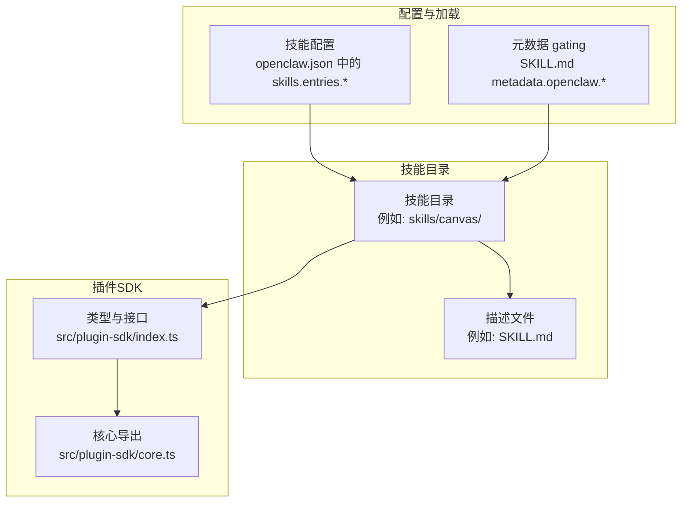
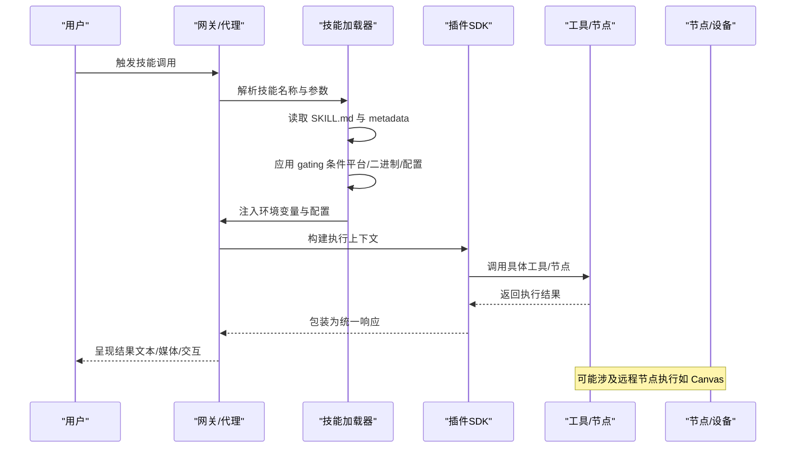
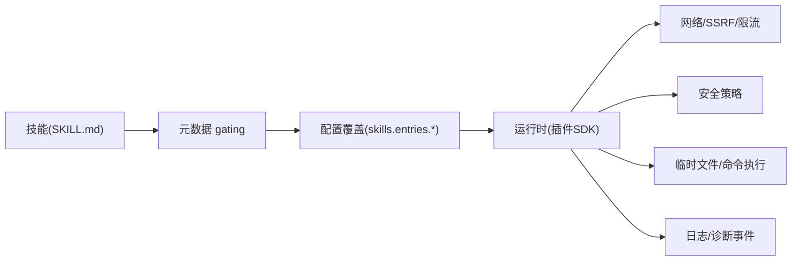

# 技能开发

<cite>
**本文引用的文件**
- [README.md](file://README.md)
- [docs/tools/skills.md](file://docs/tools/skills.md)
- [src/plugin-sdk/index.ts](file://src/plugin-sdk/index.ts)
- [src/plugin-sdk/core.ts](file://src/plugin-sdk/core.ts)
- [extensions/lobster/SKILL.md](file://extensions/lobster/SKILL.md)
- [extensions/lobster/openclaw.plugin.json](file://extensions/lobster/openclaw.plugin.json)
- [skills/canvas/SKILL.md](file://skills/canvas/SKILL.md)
</cite>

## 目录
1. [简介](#简介)
2. [项目结构](#项目结构)
3. [核心组件](#核心组件)
4. [架构总览](#架构总览)
5. [详细组件分析](#详细组件分析)
6. [依赖关系分析](#依赖关系分析)
7. [性能考量](#性能考量)
8. [故障排查指南](#故障排查指南)
9. [结论](#结论)
10. [附录](#附录)

## 简介
本指南面向希望在 OpenClaw 平台上开发“技能（Skill）”的开发者，目标是帮助你从零开始理解技能系统的设计与实现，掌握技能定义、参数配置、执行逻辑与结果处理，并提供从简单工具型技能到复杂工作流型技能的完整实践路径。文档同时覆盖配置管理、依赖处理、错误处理、性能优化、测试与调试以及发布流程，确保你能构建高质量、可维护的技能插件。

## 项目结构
OpenClaw 的技能体系由“技能目录 + 插件 SDK + 配置与加载机制”三部分组成：
- 技能目录：每个技能是一个独立目录，包含描述文件（如 SKILL.md）与可选的资源或脚本。
- 插件 SDK：提供统一的类型、运行时、通道适配、安全与网络等能力，支撑技能在不同渠道与环境中的稳定运行。
- 加载与配置：通过配置文件与元数据（metadata）控制技能的可用性、注入环境变量、安装器与平台要求等。

图示来源
- [src/plugin-sdk/index.ts](file://src/plugin-sdk/index.ts#L1-L727)
- [src/plugin-sdk/core.ts](file://src/plugin-sdk/core.ts#L1-L37)
- [docs/tools/skills.md](file://docs/tools/skills.md#L1-L302)

章节来源
- [README.md](file://README.md#L1-L560)
- [docs/tools/skills.md](file://docs/tools/skills.md#L1-L302)

## 核心组件
- 技能定义与格式
  - 每个技能以目录形式存在，目录内包含描述文件（如 SKILL.md），采用 YAML 前言段（frontmatter）声明基本信息与元数据。
  - 元数据支持平台过滤、二进制依赖、环境变量依赖、配置依赖、主密钥别名、安装器等。
- 插件 SDK
  - 提供统一的类型与运行时能力，包括通道适配、安全策略、网络请求、临时文件、命令执行、钩子与诊断事件等。
  - 为技能提供一致的上下文与工具集，降低跨渠道差异带来的开发成本。
- 配置与加载
  - 支持多级优先级：工作空间技能 > 本地/托管技能 > 内置技能；可通过配置覆盖启用状态、注入环境变量、传递自定义参数。
  - 支持按平台、二进制、配置项进行“门禁”过滤，保证技能在满足条件时才被加载与使用。

章节来源
- [docs/tools/skills.md](file://docs/tools/skills.md#L77-L246)
- [src/plugin-sdk/index.ts](file://src/plugin-sdk/index.ts#L1-L727)
- [src/plugin-sdk/core.ts](file://src/plugin-sdk/core.ts#L1-L37)

## 架构总览
下图展示了技能从“定义、加载、注入环境、构建提示词、执行与结果处理”的全链路：

图示来源
- [docs/tools/skills.md](file://docs/tools/skills.md#L105-L246)
- [src/plugin-sdk/index.ts](file://src/plugin-sdk/index.ts#L1-L727)

## 详细组件分析

### 组件A：技能定义与元数据（SKILL.md）
- 必备字段
  - name、description 等基础信息。
  - metadata.openclaw：用于 gating 与 UI 展示。
- 元数据关键项
  - requires.bins/anyBins：主机 PATH 上的二进制依赖。
  - requires.env：进程环境变量或配置中提供的值。
  - requires.config：openclaw.json 中的布尔/对象路径。
  - os：仅在指定平台可见。
  - primaryEnv：与 skills.entries.<name>.apiKey 对应的密钥别名。
  - install：安装器清单（brew/node/go/download 等），用于 UI 引导安装。
- 命令与调度
  - user-invocable：是否暴露为用户斜杠命令。
  - disable-model-invocation：是否从模型提示词中排除该技能。
  - command-dispatch/tool/arg-mode：直接路由到工具并传参模式。

章节来源
- [docs/tools/skills.md](file://docs/tools/skills.md#L77-L184)

### 组件B：插件 SDK 与运行时
- 类型与接口
  - 通道适配器、消息动作、登录/登出、心跳、安全策略、线程/目录等类型，统一了各渠道的接入方式。
- 运行时与工具
  - 提供运行命令、临时路径、SSRF 策略、HTTP 请求守卫、Webhook 目标解析与限流、去重缓存、日志传输、诊断事件等。
- 网络与安全
  - SSRF 策略、HTTPS 主机后缀白名单、请求体大小限制、速率限制与异常追踪，保障外部调用安全与稳定性。
- 诊断与可观测性
  - 诊断事件注册、心跳、队列事件、会话状态事件、Webhook 处理事件等，便于问题定位与性能分析。

章节来源
- [src/plugin-sdk/index.ts](file://src/plugin-sdk/index.ts#L1-L727)
- [src/plugin-sdk/core.ts](file://src/plugin-sdk/core.ts#L1-L37)

### 组件C：配置与加载（skills.entries.* 与 gating）
- 启用与覆盖
  - skills.entries.<name>：启用/禁用、注入 env、apiKey、自定义 config。
  - allowBundled：仅允许内置技能列表。
- 加载时过滤
  - metadata.openclaw.always：无条件包含。
  - metadata.openclaw.os：平台过滤。
  - metadata.openclaw.requires.*：二进制/环境/配置依赖。
- 热更新与会话快照
  - 技能快照在会话开始时生成，后续回合复用；支持监视器自动刷新（watch/watchDebounceMs）。

章节来源
- [docs/tools/skills.md](file://docs/tools/skills.md#L188-L246)

### 组件D：示例技能一：Canvas（可视化展示）
- 场景与能力
  - 在连接的节点（Mac/iOS/Android）上展示 HTML 内容，支持 present/hide/navigate/eval/snapshot 等操作。
- 架构与集成
  - Canvas Host（HTTP 服务器）→ Node Bridge（TCP）→ Node App（WebView）。
  - Tailscale 集成：根据 gateway.bind 推导访问 URL，避免 localhost 不可达问题。
- 工作流
  - 创建 HTML → 获取绑定模式与端口 → 列出已连接节点 → 发送 present 命令 → 可选导航/截图/隐藏。
- 调试要点
  - URL 与绑定模式不匹配、节点离线、liveReload 未生效等问题的排查步骤。

章节来源
- [skills/canvas/SKILL.md](file://skills/canvas/SKILL.md#L1-L199)

### 组件E：示例技能二：Lobster（工作流与审批）
- 场景与能力
  - 多步骤工作流，支持审批检查点、可恢复执行、结构化输出。
- 使用建议
  - 适合需要人类审批的重复性自动化任务；不适合单步查询或一次性任务。
- 关键行为
  - deterministic 执行、approval gate 返回 resumeToken、resume 动作继续执行。

章节来源
- [extensions/lobster/SKILL.md](file://extensions/lobster/SKILL.md#L1-L98)

### 组件F：插件与技能联动（以 lobster 插件为例）
- 插件清单
  - openclaw.plugin.json 定义插件 id/name/description 与空配置模式。
- 技能加载
  - 插件可自带 skills 目录，启用后参与技能优先级与 gating 规则。

章节来源
- [extensions/lobster/openclaw.plugin.json](file://extensions/lobster/openclaw.plugin.json#L1-L11)
- [docs/tools/skills.md](file://docs/tools/skills.md#L41-L48)

## 依赖关系分析
- 技能对系统依赖
  - 二进制依赖（PATH）、环境变量、配置项（openclaw.json）。
  - 沙箱容器内需同步安装二进制（通过 agents.defaults.sandbox.docker.setupCommand）。
- 技能对 SDK 依赖
  - 通过插件 SDK 的类型与运行时能力，屏蔽渠道差异，统一安全策略与网络访问。
- 技能间耦合
  - 通过命令式调度（command-dispatch/tool）可直接路由到工具，减少模型解释误差。

图示来源
- [docs/tools/skills.md](file://docs/tools/skills.md#L105-L184)
- [src/plugin-sdk/index.ts](file://src/plugin-sdk/index.ts#L372-L413)

章节来源
- [docs/tools/skills.md](file://docs/tools/skills.md#L137-L184)
- [src/plugin-sdk/index.ts](file://src/plugin-sdk/index.ts#L372-L413)

## 性能考量
- 技能列表注入开销
  - 将可用技能列表注入系统提示词会产生确定性的字符/令牌开销，建议控制技能数量与字段长度。
- 会话快照与热更新
  - 会话开始时快照技能列表，后续回合复用；开启监视器可在变更后热更新，减少重启成本。
- 远程节点执行
  - 当节点具备特定能力且二进制可用时，可将其作为“远程执行器”，提升功能覆盖但需考虑网络与权限。

章节来源
- [docs/tools/skills.md](file://docs/tools/skills.md#L241-L285)

## 故障排查指南
- URL 与绑定模式不匹配（Canvas）
  - 现象：白屏或内容无法加载。
  - 步骤：确认 gateway.bind、端口占用、直接 curl 测试 URL；使用与绑定模式一致的完整主机名。
- 节点相关错误
  - 现象：“node required/未连接”。
  - 步骤：列出在线节点、确认节点具备所需能力。
- liveReload 未生效
  - 现象：保存文件后画布未更新。
  - 步骤：检查 liveReload 开关、文件位于根目录、查看日志中的监听错误。
- 安全与网络
  - 使用 SSRF 策略与 HTTPS 白名单，避免私有地址与不安全主机；合理设置请求体大小与速率限制。
- 诊断事件
  - 启用诊断事件与日志传输，收集 Webhook、队列、会话状态等事件，辅助定位问题。

章节来源
- [skills/canvas/SKILL.md](file://skills/canvas/SKILL.md#L151-L180)
- [src/plugin-sdk/index.ts](file://src/plugin-sdk/index.ts#L372-L413)
- [src/plugin-sdk/index.ts](file://src/plugin-sdk/index.ts#L532-L555)

## 结论
OpenClaw 的技能系统以“目录化技能 + 元数据 gating + 插件 SDK 运行时”为核心，既保证了跨渠道的一致性，又提供了灵活的配置与扩展能力。通过合理的技能定义、严格的 gating 与安全策略、完善的诊断与监控，你可以构建从简单工具到复杂工作流的高质量技能插件，并在生产环境中保持稳定与可维护性。

## 附录

### A. 技能开发最佳实践
- 明确意图与边界：单一技能聚焦一个明确任务，避免“大杂烩”。
- 清晰的元数据：准确声明二进制/环境/配置依赖，提供安装器说明。
- 最小化提示词开销：控制技能字段长度，避免冗余描述。
- 安全优先：默认启用 SSRF 与 HTTPS 白名单，谨慎注入敏感环境变量。
- 可观测性：启用诊断事件与日志传输，记录关键路径与异常。

### B. 从零到一：创建你的第一个技能
- 步骤
  - 新建目录与 SKILL.md，填写 name/description/metadata。
  - 在 skills.entries.<name> 中启用并注入必要 env/apiKey/config。
  - 编写工具调用逻辑（可借助插件 SDK 的命令执行与网络能力）。
  - 在本地/托管/工作空间目录中放置技能，验证 gating 与加载。
  - 使用诊断事件与日志定位问题，逐步完善。

章节来源
- [docs/tools/skills.md](file://docs/tools/skills.md#L188-L246)
- [src/plugin-sdk/index.ts](file://src/plugin-sdk/index.ts#L325-L328)