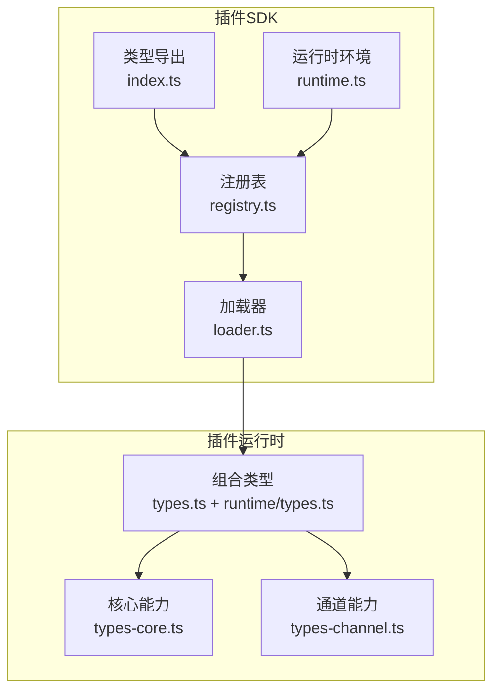
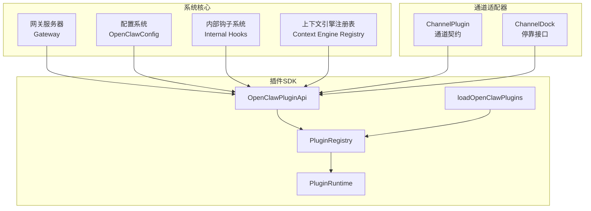
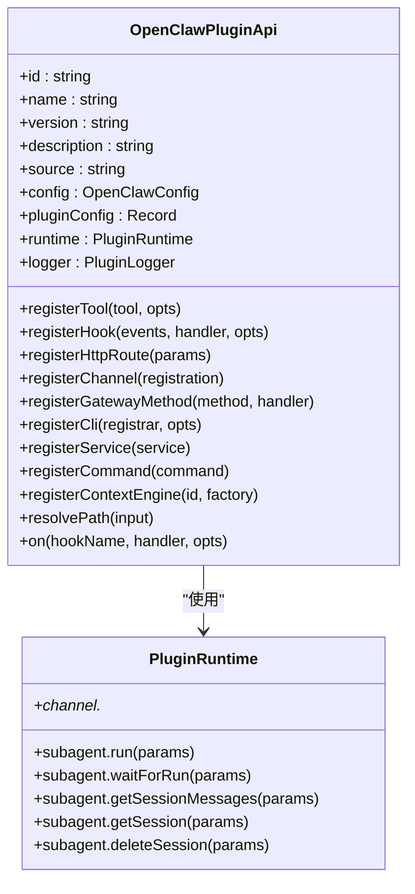
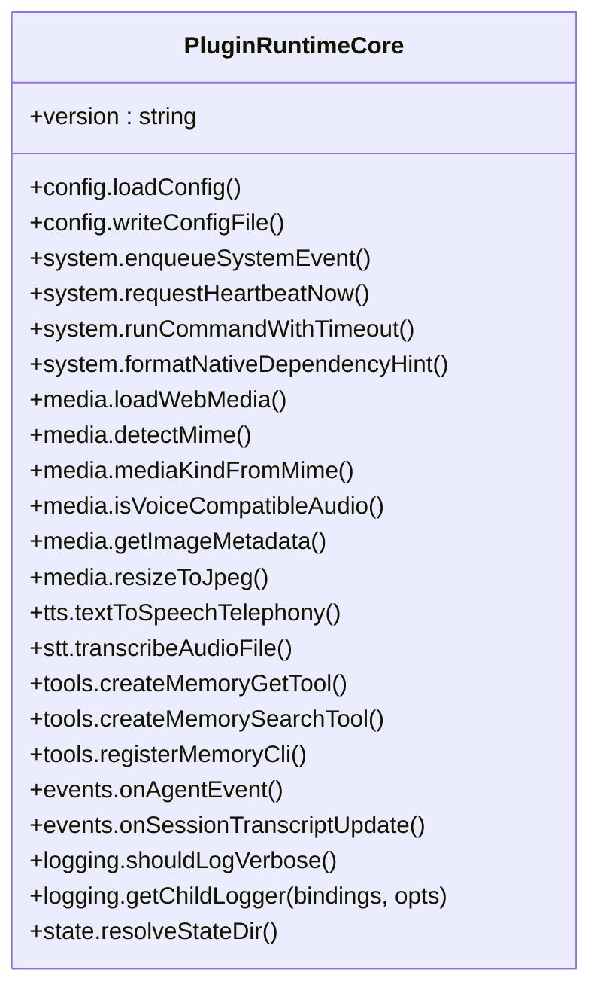
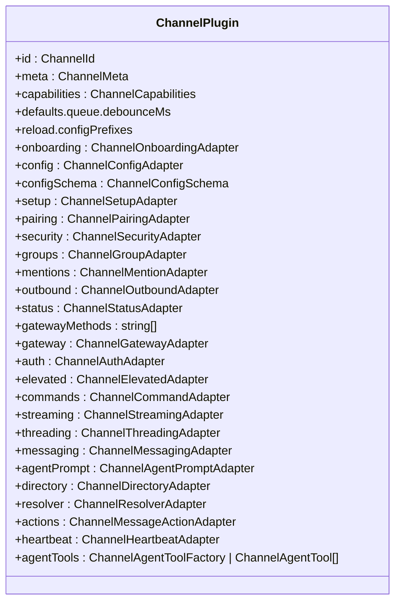
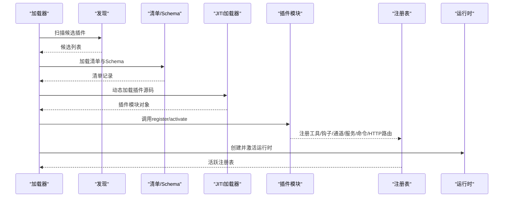
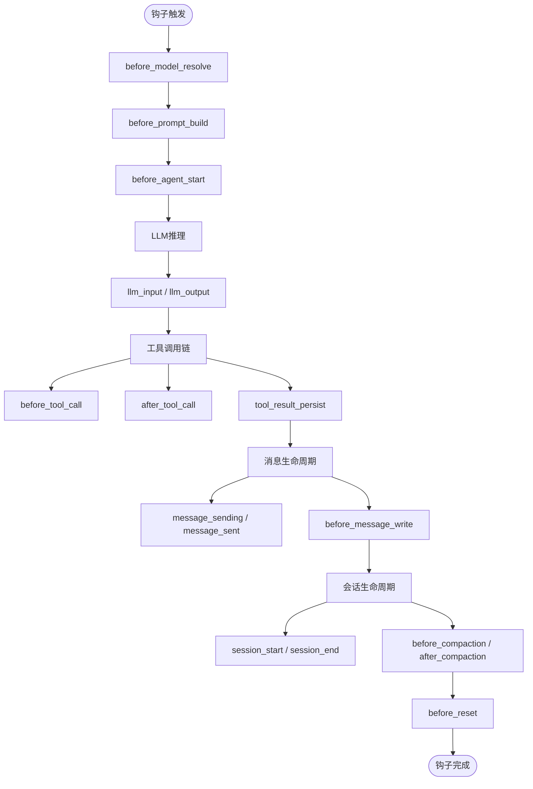
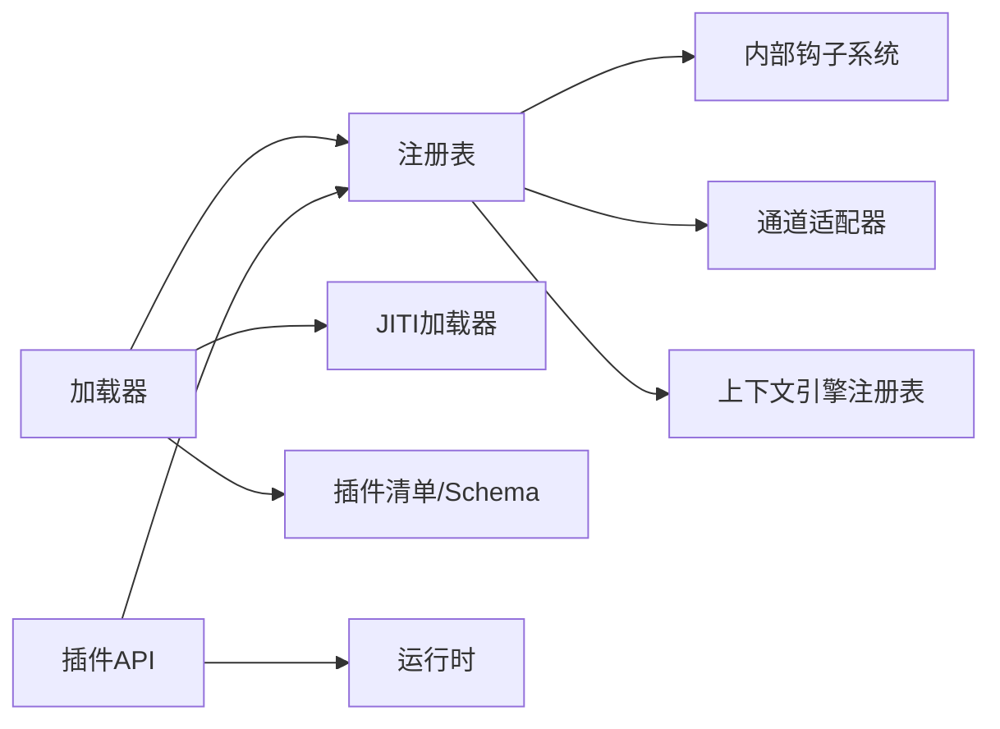

# 插件SDK架构

<cite>
**本文档引用的文件**
- [index.ts](file://src/plugin-sdk/index.ts)
- [runtime.ts](file://src/plugin-sdk/runtime.ts)
- [types.ts](file://src/plugins/types.ts)
- [runtime/types.ts](file://src/plugins/runtime/types.ts)
- [runtime/types-core.ts](file://src/plugins/runtime/types-core.ts)
- [runtime/types-channel.ts](file://src/plugins/runtime/types-channel.ts)
- [types.ts](file://src/channels/plugins/types.ts)
- [types.plugin.ts](file://src/channels/plugins/types.plugin.ts)
- [registry.ts](file://src/plugins/registry.ts)
- [loader.ts](file://src/plugins/loader.ts)
</cite>

## 目录
1. [引言](#引言)
2. [项目结构](#项目结构)
3. [核心组件](#核心组件)
4. [架构总览](#架构总览)
5. [详细组件分析](#详细组件分析)
6. [依赖关系分析](#依赖关系分析)
7. [性能考量](#性能考量)
8. [故障排查指南](#故障排查指南)
9. [结论](#结论)
10. [附录](#附录)

## 引言
本文件面向OpenClaw插件SDK的开发者与维护者，系统化阐述插件系统的整体架构、核心接口、运行时机制与扩展点设计。内容覆盖类型系统、API接口规范、生命周期管理、配置系统集成、安全机制与性能优化，并通过架构图与序列图展示插件如何与网关系统、通道适配器和代理运行时交互，帮助读者从基础概念到高级架构模式建立完整的知识体系。

## 项目结构
OpenClaw插件SDK位于src/plugin-sdk目录，围绕“类型导出”“运行时环境”“插件注册表”“插件加载器”等模块组织，形成清晰的分层结构：
- 类型导出层：统一对外暴露插件SDK能力（如HTTP路由、Webhook、状态辅助、命令授权等）
- 运行时层：抽象插件运行所需的系统能力（配置读写、媒体处理、TTS/STT、事件订阅等）
- 注册表层：集中管理插件工具、钩子、通道、服务、命令、HTTP路由等注册项
- 加载器层：负责发现、校验、实例化插件并构建活跃注册表

**图表来源**
- [index.ts](file://src/plugin-sdk/index.ts#L1-L727)
- [runtime.ts](file://src/plugin-sdk/runtime.ts#L1-L25)
- [registry.ts](file://src/plugins/registry.ts#L1-L608)
- [loader.ts](file://src/plugins/loader.ts#L1-L862)
- [runtime/types-core.ts](file://src/plugins/runtime/types-core.ts#L1-L56)
- [runtime/types-channel.ts](file://src/plugins/runtime/types-channel.ts#L1-L165)
- [runtime/types.ts](file://src/plugins/runtime/types.ts#L1-L64)

**章节来源**
- [index.ts](file://src/plugin-sdk/index.ts#L1-L727)
- [runtime.ts](file://src/plugin-sdk/runtime.ts#L1-L25)
- [registry.ts](file://src/plugins/registry.ts#L1-L608)
- [loader.ts](file://src/plugins/loader.ts#L1-L862)

## 核心组件
- 插件API与类型系统
  - OpenClawPluginApi：插件注册入口，提供注册工具、钩子、HTTP路由、通道、网关方法、CLI、服务、命令、上下文引擎等能力
  - OpenClawPluginDefinition/OpenClawPluginModule：插件定义与模块导出形式
  - 插件钩子体系：覆盖模型解析、提示构建、消息收发、工具调用、会话生命周期、子代理派生等
- 运行时环境
  - PluginRuntime：聚合核心能力与通道能力，提供子代理运行、等待、会话消息查询、删除会话等
  - RuntimeLogger：统一日志接口
- 注册表与加载器
  - PluginRegistry：集中存储已注册的工具、钩子、通道、提供商、网关方法、HTTP路由、CLI、服务、命令及诊断信息
  - createPluginRegistry/createApi：将插件导出映射为注册表项
  - loadOpenClawPlugins：发现、校验、实例化插件并构建活跃注册表

**章节来源**
- [types.ts](file://src/plugins/types.ts#L257-L300)
- [runtime/types.ts](file://src/plugins/runtime/types.ts#L51-L64)
- [runtime/types-core.ts](file://src/plugins/runtime/types-core.ts#L10-L56)
- [runtime/types-channel.ts](file://src/plugins/runtime/types-channel.ts#L16-L165)
- [registry.ts](file://src/plugins/registry.ts#L128-L141)
- [loader.ts](file://src/plugins/loader.ts#L480-L862)

## 架构总览
下图展示了插件SDK在系统中的位置以及与核心子系统的交互关系：

**图表来源**
- [types.ts](file://src/plugins/types.ts#L257-L300)
- [registry.ts](file://src/plugins/registry.ts#L184-L607)
- [loader.ts](file://src/plugins/loader.ts#L480-L862)
- [types.plugin.ts](file://src/channels/plugins/types.plugin.ts#L49-L85)

## 详细组件分析

### 组件A：插件API与类型系统
- 职责
  - 定义插件可使用的扩展点：工具、钩子、HTTP路由、通道、网关方法、CLI、服务、命令、上下文引擎
  - 提供统一的运行时访问接口（配置、系统事件、媒体、TTS/STT、工具库、事件订阅、日志、状态目录）
- 关键接口
  - registerTool/registerHook/registerHttpRoute/registerChannel/registerGatewayMethod/registerCli/registerService/registerCommand/registerContextEngine/on
  - runtime.config/runtime.system/runtime.media/runtime.tts/runtime.stt/runtime.tools/runtime.events/runtime.logging/runtime.state
- 设计要点
  - 类型驱动：所有扩展点均以强类型定义约束，降低误用风险
  - 松耦合：通过注册表集中管理，避免插件直接依赖具体实现细节

**图表来源**
- [types.ts](file://src/plugins/types.ts#L257-L300)
- [runtime/types.ts](file://src/plugins/runtime/types.ts#L51-L64)

**章节来源**
- [types.ts](file://src/plugins/types.ts#L257-L300)
- [runtime/types.ts](file://src/plugins/runtime/types.ts#L51-L64)

### 组件B：运行时环境与能力抽象
- 职责
  - 将底层系统能力抽象为统一接口，供插件在不同运行环境下一致使用
- 能力域
  - 配置：加载/写入配置文件
  - 系统：系统事件入队、心跳触发、命令执行、原生依赖提示
  - 媒体：远程媒体获取、MIME检测、图像元数据、音频兼容性、图片缩放
  - TTS/STT：电话级文本转语音、音频转写
  - 工具：内存检索/搜索工具、CLI注册
  - 事件：代理事件、会话转录更新
  - 日志：日志级别、子日志器
  - 状态：状态目录解析
- 设计要点
  - 接口稳定：通过类型约束保证跨版本兼容
  - 按需懒加载：运行时按需初始化，减少启动成本

**图表来源**
- [runtime/types-core.ts](file://src/plugins/runtime/types-core.ts#L10-L56)

**章节来源**
- [runtime/types-core.ts](file://src/plugins/runtime/types-core.ts#L10-L56)

### 组件C：通道适配器与停靠接口
- 职责
  - 定义通道适配器契约（认证、配置、配对、安全、群组、提及、出站、状态、网关、命令、流式、线程、消息、代理提示、目录、解析器、动作、心跳等）
  - ChannelPlugin：通道实现的统一入口；ChannelDock：通道停靠接口
- 设计要点
  - 可选适配器：通道仅实现所需能力
  - 能力组合：通过ChannelPlugin聚合多种适配器，形成完整通道能力集

**图表来源**
- [types.plugin.ts](file://src/channels/plugins/types.plugin.ts#L49-L85)

**章节来源**
- [types.ts](file://src/channels/plugins/types.ts#L1-L66)
- [types.plugin.ts](file://src/channels/plugins/types.plugin.ts#L1-L86)

### 组件D：注册表与生命周期管理
- 职责
  - 统一收集插件注册项（工具、钩子、通道、提供商、网关方法、HTTP路由、CLI、服务、命令），并生成诊断信息
  - 生命周期：发现→校验→实例化→注册→激活
- 关键流程
  - 发现：扫描候选插件
  - 校验：插件清单、配置Schema、路径边界检查
  - 实例化：动态加载模块，调用register/activate
  - 注册：将插件导出映射为注册表项
  - 激活：设置活跃注册表并初始化全局钩子运行器

**图表来源**
- [loader.ts](file://src/plugins/loader.ts#L542-L800)
- [registry.ts](file://src/plugins/registry.ts#L184-L607)

**章节来源**
- [registry.ts](file://src/plugins/registry.ts#L128-L141)
- [loader.ts](file://src/plugins/loader.ts#L480-L862)

### 组件E：插件生命周期与钩子机制
- 生命周期阶段
  - before_model_resolve：覆盖模型/提供商
  - before_prompt_build：注入系统/前缀/后缀上下文
  - before_agent_start：兼容旧钩子（合并阶段）
  - llm_input/llm_output：LLM输入输出观察
  - agent_end：一次推理结束
  - before_compaction/after_compaction：会话压缩前后
  - before_reset：会话重置
  - message_received/message_sending/message_sent：消息生命周期
  - before_tool_call/after_tool_call/tool_result_persist：工具调用链
  - before_message_write：消息写入前过滤
  - session_start/session_end：会话开始/结束
  - subagent_spawning/subagent_delivery_target/subagent_spawned/subagent_ended：子代理派生与结束
  - gateway_start/gateway_stop：网关启停
- 设计要点
  - 类型安全：每个钩子事件与结果均有明确类型
  - 兼容性：保留旧钩子行为并提供迁移策略
  - 可控性：支持禁用或限制特定钩子（如禁止提示注入）

**图表来源**
- [types.ts](file://src/plugins/types.ts#L315-L800)

**章节来源**
- [types.ts](file://src/plugins/types.ts#L315-L800)

## 依赖关系分析
- 组件耦合
  - 插件API依赖注册表与运行时；注册表依赖钩子系统、通道适配器、上下文引擎注册表
  - 加载器依赖发现、清单、Schema校验、JITI动态加载
- 外部依赖
  - Node.js运行时、JITI模块加载器、内部子系统（配置、事件、媒体、会话等）
- 循环依赖
  - 通过接口与类型约束避免循环导入；注册表与钩子系统通过事件机制解耦

**图表来源**
- [loader.ts](file://src/plugins/loader.ts#L542-L800)
- [registry.ts](file://src/plugins/registry.ts#L1-L608)

**章节来源**
- [loader.ts](file://src/plugins/loader.ts#L542-L800)
- [registry.ts](file://src/plugins/registry.ts#L1-L608)

## 性能考量
- 启动优化
  - 运行时懒加载：通过Proxy延迟创建运行时，避免无用依赖加载
  - 缓存：基于配置与插件集合构建缓存键，命中则直接激活注册表
- 动态加载
  - 使用JITI按需加载插件源码，减少冷启动时间
- 资源隔离
  - 插件路径边界检查与别名映射，防止越界与重复加载
- 钩子执行
  - 类型化钩子注册，避免无效钩子占用执行资源
- I/O与网络
  - 媒体加载、远程请求采用统一接口，便于限流与缓存策略接入

[本节为通用指导，无需列出具体文件来源]

## 故障排查指南
- 常见问题
  - 插件加载失败：检查插件导出是否包含register/activate，确认路径边界检查通过
  - HTTP路由冲突：检查路径与匹配方式，确认replaceExisting策略
  - 钩子未生效：确认钩子名称有效且内部钩子系统已启用
  - 配置校验失败：核对插件Schema与实际配置值
- 诊断手段
  - 查看注册表诊断信息（错误/警告级别）
  - 使用日志接口定位问题
  - 校验插件来源与安装记录，确保可信路径

**章节来源**
- [registry.ts](file://src/plugins/registry.ts#L289-L317)
- [loader.ts](file://src/plugins/loader.ts#L648-L724)

## 结论
OpenClaw插件SDK通过清晰的类型系统、稳定的运行时抽象、完善的注册表与加载器机制，实现了对工具、钩子、通道、服务、命令与HTTP路由的统一扩展。其生命周期管理与安全机制保障了插件在复杂场景下的稳定性与可控性，同时通过懒加载与缓存策略兼顾性能。建议在开发新插件时严格遵循类型约束与注册流程，充分利用钩子扩展点与通道适配器能力，确保与系统核心的无缝协作。

[本节为总结性内容，无需列出具体文件来源]

## 附录
- 关键术语
  - 插件：实现OpenClawPluginDefinition或导出register函数的模块
  - 注册表：集中管理插件注册项的数据结构
  - 运行时：插件可用的系统能力抽象
  - 钩子：在系统关键节点触发的扩展回调
  - 通道：消息渠道的适配器实现
- 最佳实践
  - 明确插件职责与能力范围，避免过度耦合
  - 使用类型化钩子，确保参数与返回值正确
  - 对外暴露HTTP路由时，明确鉴权与匹配策略
  - 在多账户/多通道场景中，合理使用会话与线程上下文

[本节为补充说明，无需列出具体文件来源]