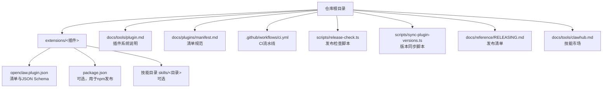
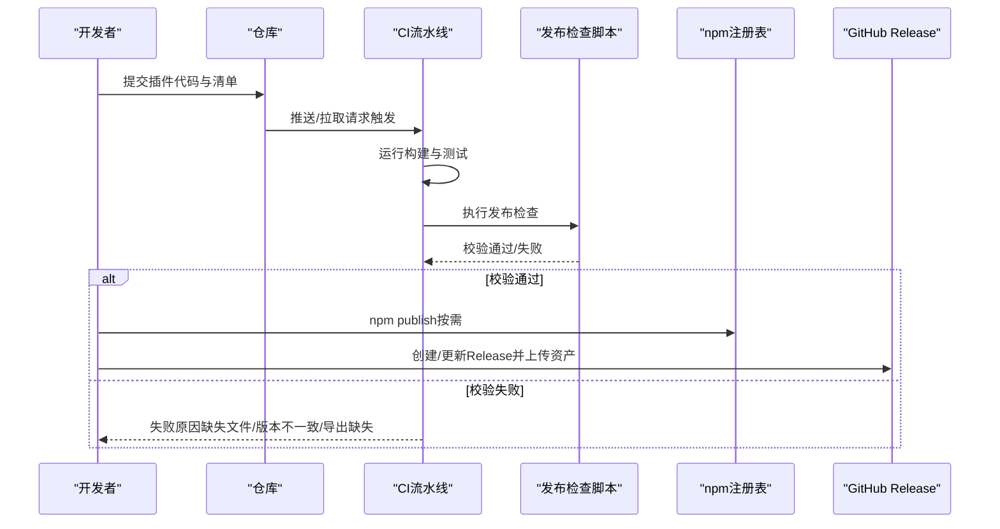
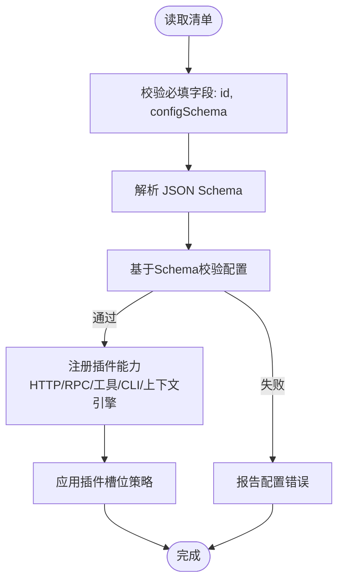
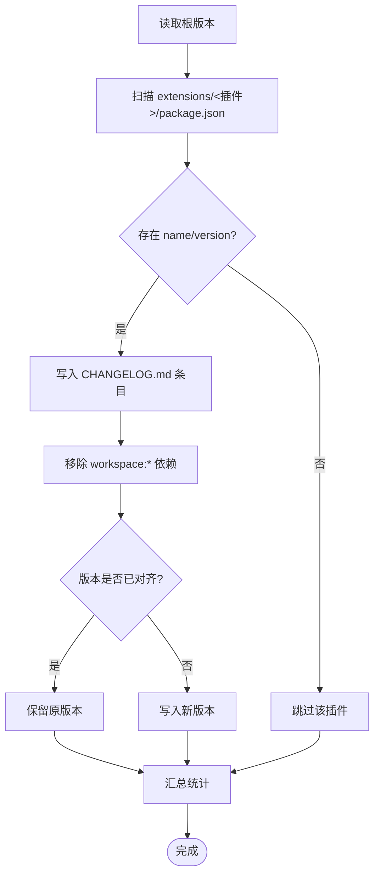
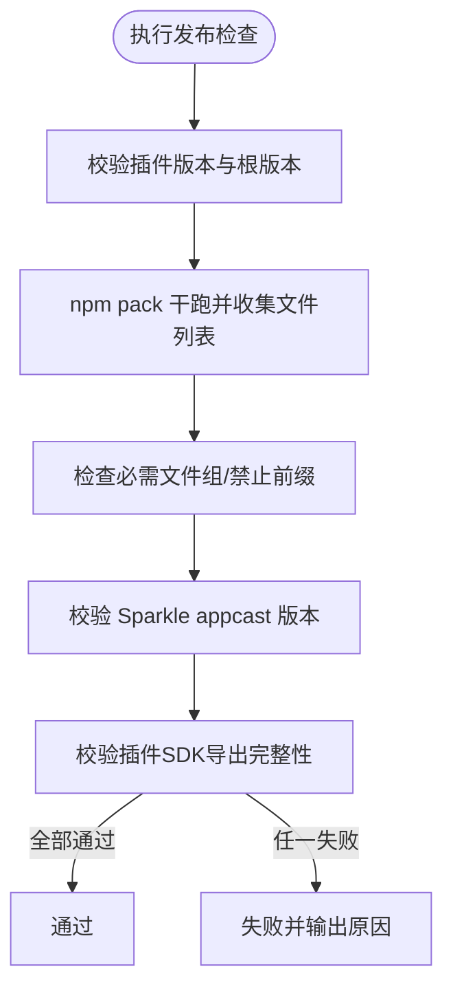
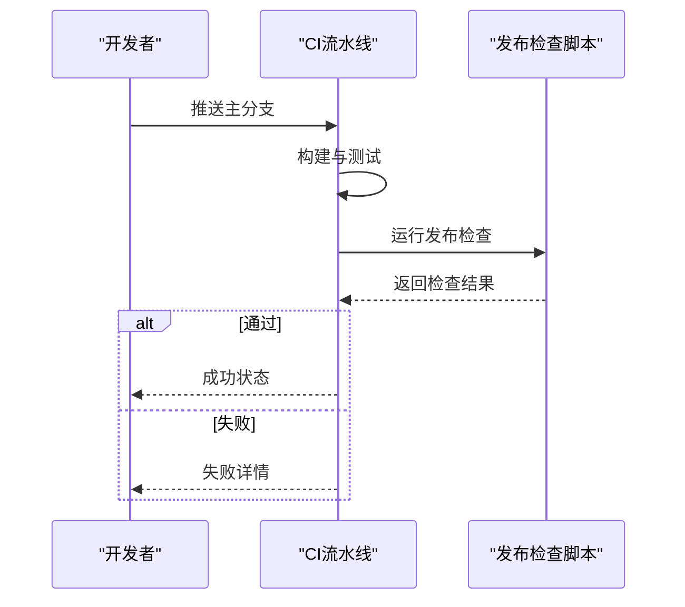
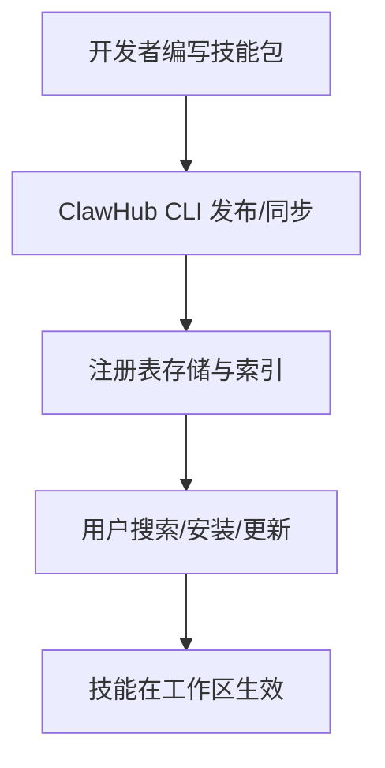
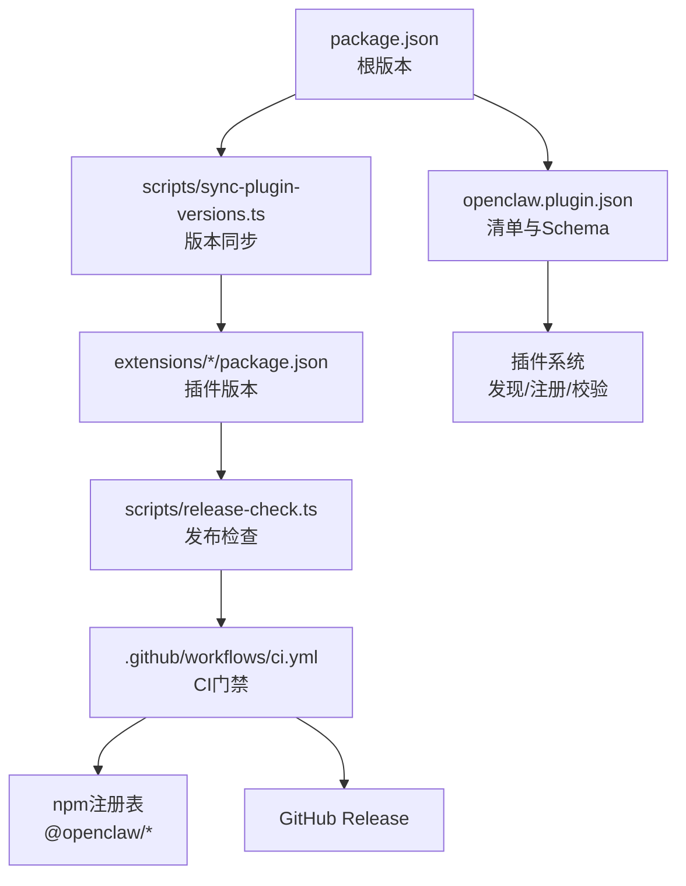

# 插件发布与分发

<cite>
**本文引用的文件**
- [docs/plugins/manifest.md](file://docs/plugins/manifest.md)
- [docs/tools/plugin.md](file://docs/tools/plugin.md)
- [docs/reference/RELEASING.md](file://docs/reference/RELEASING.md)
- [docs/plugins/community.md](file://docs/plugins/community.md)
- [docs/tools/clawhub.md](file://docs/tools/clawhub.md)
- [scripts/release-check.ts](file://scripts/release-check.ts)
- [scripts/sync-plugin-versions.ts](file://scripts/sync-plugin-versions.ts)
- [.github/workflows/ci.yml](file://.github/workflows/ci.yml)
- [package.json](file://package.json)
- [extensions/voice-call/openclaw.plugin.json](file://extensions/voice-call/openclaw.plugin.json)
- [extensions/discord/openclaw.plugin.json](file://extensions/discord/openclaw.plugin.json)
- [extensions/diffs/openclaw.plugin.json](file://extensions/diffs/openclaw.plugin.json)
- [extensions/acpx/openclaw.plugin.json](file://extensions/acpx/openclaw.plugin.json)
</cite>

## 目录
1. [简介](#简介)
2. [项目结构](#项目结构)
3. [核心组件](#核心组件)
4. [架构总览](#架构总览)
5. [详细组件分析](#详细组件分析)
6. [依赖关系分析](#依赖关系分析)
7. [性能考虑](#性能考虑)
8. [故障排查指南](#故障排查指南)
9. [结论](#结论)
10. [附录](#附录)

## 简介
本指南面向希望在 OpenClaw 生态中发布与分发插件（扩展）的开发者，覆盖从清单编写、版本管理、打包校验到发布部署的全流程；同时说明社区插件的收录路径、技能市场的使用方式以及更新回滚与用户支持策略。通过统一的清单规范、严格的发布检查脚本与 CI 流水线，确保插件质量与兼容性。

## 项目结构
OpenClaw 将插件以“扩展”的形式组织在 extensions 目录下，每个插件需在根目录提供 openclaw.plugin.json 清单文件，并可选地提供 package.json 与技能目录。官方文档对插件发现、加载、配置与安全策略有明确约束，CI 流程负责构建产物与发布前校验。

图示来源
- [docs/tools/plugin.md](file://docs/tools/plugin.md#L227-L303)
- [docs/plugins/manifest.md](file://docs/plugins/manifest.md#L9-L76)
- [.github/workflows/ci.yml](file://.github/workflows/ci.yml#L113-L138)
- [scripts/release-check.ts](file://scripts/release-check.ts#L12-L105)
- [scripts/sync-plugin-versions.ts](file://scripts/sync-plugin-versions.ts#L41-L101)

章节来源
- [docs/tools/plugin.md](file://docs/tools/plugin.md#L227-L303)
- [docs/plugins/manifest.md](file://docs/plugins/manifest.md#L9-L76)
- [.github/workflows/ci.yml](file://.github/workflows/ci.yml#L113-L138)
- [scripts/release-check.ts](file://scripts/release-check.ts#L12-L105)
- [scripts/sync-plugin-versions.ts](file://scripts/sync-plugin-versions.ts#L41-L101)

## 核心组件
- 插件清单（openclaw.plugin.json）
  - 必填字段：id、configSchema
  - 可选字段：kind、channels、providers、skills、name、description、uiHints、version
  - 清单用于在不执行插件代码的前提下进行配置校验与发现
- 插件系统与运行时
  - 支持注册 HTTP 路由、RPC 方法、工具、CLI 命令、上下文引擎等
  - 严格的安全与缓存策略，支持插件槽位（exclusive slots）选择
- 发布与版本管理
  - 通过 scripts/sync-plugin-versions.ts 同步插件版本与变更日志
  - 通过 scripts/release-check.ts 校验 npm 包内容、Sparkle 版本与插件 SDK 导出完整性
  - CI 中的 release-check job 在主分支推送时自动执行
- 分发与市场
  - 官方 npm 插件发布范围限定于 @openclaw/* 作用域
  - 技能市场 ClawHub 提供公共技能注册与分发
  - 社区插件收录遵循质量门槛与提交流程

章节来源
- [docs/plugins/manifest.md](file://docs/plugins/manifest.md#L18-L76)
- [docs/tools/plugin.md](file://docs/tools/plugin.md#L483-L520)
- [scripts/sync-plugin-versions.ts](file://scripts/sync-plugin-versions.ts#L41-L101)
- [scripts/release-check.ts](file://scripts/release-check.ts#L134-L180)
- [.github/workflows/ci.yml](file://.github/workflows/ci.yml#L113-L138)
- [docs/reference/RELEASING.md](file://docs/reference/RELEASING.md#L93-L122)
- [docs/tools/clawhub.md](file://docs/tools/clawhub.md#L1-L258)

## 架构总览
下图展示从开发到发布的端到端流程：开发者编写清单与代码 → CI 构建产物 → 发布前校验 → npm 发布与 GitHub Release → 用户安装与使用。

图示来源
- [.github/workflows/ci.yml](file://.github/workflows/ci.yml#L113-L138)
- [scripts/release-check.ts](file://scripts/release-check.ts#L320-L358)
- [docs/reference/RELEASING.md](file://docs/reference/RELEASING.md#L67-L91)

## 详细组件分析

### 组件A：插件清单与元数据
- 必填项与校验
  - id：插件唯一标识
  - configSchema：内联 JSON Schema，用于配置校验
  - 其他可选字段：kind、channels、providers、skills、name、description、uiHints、version
- 配置与 UI 提示
  - uiHints 用于增强控制界面的标签、占位符与敏感字段标记
- 兼容性与槽位
  - 通过 kind 与 plugins.slots.* 选择独占类插件（如 memory、contextEngine）

图示来源
- [docs/plugins/manifest.md](file://docs/plugins/manifest.md#L18-L76)
- [docs/tools/plugin.md](file://docs/tools/plugin.md#L392-L425)

章节来源
- [docs/plugins/manifest.md](file://docs/plugins/manifest.md#L18-L76)
- [docs/tools/plugin.md](file://docs/tools/plugin.md#L392-L425)

### 组件B：版本管理与同步
- 同步逻辑
  - 读取根 package.json 的版本，遍历 extensions 下各插件 package.json，将版本对齐至根版本
  - 自动为每个插件生成或更新 CHANGELOG.md 条目
  - 移除 workspace:* 开发依赖以避免发布污染
- 使用场景
  - 发布前统一版本，保证插件与核心版本一致
  - 保持变更日志一致性，便于审计与用户理解

图示来源
- [scripts/sync-plugin-versions.ts](file://scripts/sync-plugin-versions.ts#L41-L101)

章节来源
- [scripts/sync-plugin-versions.ts](file://scripts/sync-plugin-versions.ts#L41-L101)

### 组件C：发布检查与校验
- 检查项
  - 插件版本与根版本一致性
  - npm pack 内容完整性（必需文件组、禁止文件前缀）
  - Sparkle appcast 版本楼层校验（macOS 应用）
  - 插件 SDK 关键导出完整性（防止运行时崩溃）
- 触发时机
  - CI 中的 release-check job 在主分支推送时执行

图示来源
- [scripts/release-check.ts](file://scripts/release-check.ts#L134-L180)
- [scripts/release-check.ts](file://scripts/release-check.ts#L320-L358)
- [scripts/release-check.ts](file://scripts/release-check.ts#L188-L245)
- [scripts/release-check.ts](file://scripts/release-check.ts#L285-L318)
- [.github/workflows/ci.yml](file://.github/workflows/ci.yml#L113-L138)

章节来源
- [scripts/release-check.ts](file://scripts/release-check.ts#L134-L180)
- [scripts/release-check.ts](file://scripts/release-check.ts#L188-L245)
- [scripts/release-check.ts](file://scripts/release-check.ts#L285-L318)
- [.github/workflows/ci.yml](file://.github/workflows/ci.yml#L113-L138)

### 组件D：CI 流水线与发布
- CI 任务
  - 文档变更检测、变更范围检测、构建产物、类型与格式检查、测试、发布检查、平台特定测试
- 发布流程
  - 本地执行发布清单中的步骤（版本、元数据、构建、校验、安装烟雾测试、macOS AppCast、npm 发布、GitHub Release）
  - CI 中自动执行 release-check 作为硬性门禁

图示来源
- [.github/workflows/ci.yml](file://.github/workflows/ci.yml#L113-L138)
- [docs/reference/RELEASING.md](file://docs/reference/RELEASING.md#L14-L91)

章节来源
- [.github/workflows/ci.yml](file://.github/workflows/ci.yml#L113-L138)
- [docs/reference/RELEASING.md](file://docs/reference/RELEASING.md#L14-L91)

### 组件E：技能市场（ClawHub）与社区插件
- 技能市场（ClawHub）
  - 公共技能注册与分发，支持搜索、下载、版本化与标签管理
  - CLI 提供登录、搜索、安装、更新、发布、同步等命令
- 社区插件
  - 列表收录需满足 npm 发布、源码托管、文档与问题跟踪、维护信号等要求
  - 通过 PR 提交，采用固定格式添加条目

图示来源
- [docs/tools/clawhub.md](file://docs/tools/clawhub.md#L1-L258)
- [docs/plugins/community.md](file://docs/plugins/community.md#L15-L35)

章节来源
- [docs/tools/clawhub.md](file://docs/tools/clawhub.md#L1-L258)
- [docs/plugins/community.md](file://docs/plugins/community.md#L15-L35)

## 依赖关系分析
- 插件清单与系统约束
  - 清单决定插件发现、配置校验与能力注册
  - 通过 channels、providers、skills 字段声明对外能力
- 版本与发布
  - package.json 的版本驱动插件版本同步
  - CI 与发布检查脚本共同保障发布质量
- 分发与生态
  - npm 发布范围限定于 @openclaw/* 作用域
  - 技能市场与社区插件补充生态多样性

图示来源
- [package.json](file://package.json#L3-L444)
- [scripts/sync-plugin-versions.ts](file://scripts/sync-plugin-versions.ts#L41-L101)
- [scripts/release-check.ts](file://scripts/release-check.ts#L134-L180)
- [.github/workflows/ci.yml](file://.github/workflows/ci.yml#L113-L138)
- [docs/plugins/manifest.md](file://docs/plugins/manifest.md#L9-L76)

章节来源
- [package.json](file://package.json#L3-L444)
- [scripts/sync-plugin-versions.ts](file://scripts/sync-plugin-versions.ts#L41-L101)
- [scripts/release-check.ts](file://scripts/release-check.ts#L134-L180)
- [.github/workflows/ci.yml](file://.github/workflows/ci.yml#L113-L138)
- [docs/plugins/manifest.md](file://docs/plugins/manifest.md#L9-L76)

## 性能考虑
- 插件发现与清单缓存
  - 插件发现与清单元数据使用短时缓存减少启动/重载开销
  - 可通过环境变量禁用缓存或调整缓存窗口
- CI 并行与资源
  - CI 采用矩阵与分片策略，合理分配资源，缩短整体耗时
- 发布检查
  - 通过 npm pack 干跑快速定位缺失文件，避免无效发布

章节来源
- [docs/tools/plugin.md](file://docs/tools/plugin.md#L218-L226)
- [.github/workflows/ci.yml](file://.github/workflows/ci.yml#L372-L492)
- [scripts/release-check.ts](file://scripts/release-check.ts#L320-L358)

## 故障排查指南
- 发布检查失败
  - 插件版本不一致：使用版本同步脚本对齐
  - 缺失必需文件：核对 npm pack 输出，补齐 dist/* 或移除禁止前缀
  - Sparkle 版本不合规：修正 appcast.xml 中的版本与楼层
  - 插件 SDK 导出缺失：确认 dist/plugin-sdk/index.js 导出完整
- 安装烟雾测试
  - 使用提供的 Docker 安装烟雾测试脚本验证安装与基本功能
- 清单与配置
  - 若配置校验失败，检查 openclaw.plugin.json 的 id 与 configSchema 是否符合规范
  - 对于通道插件，确保 channels.* 与清单声明一致

章节来源
- [scripts/sync-plugin-versions.ts](file://scripts/sync-plugin-versions.ts#L41-L101)
- [scripts/release-check.ts](file://scripts/release-check.ts#L320-L358)
- [docs/reference/RELEASING.md](file://docs/reference/RELEASING.md#L49-L56)
- [docs/plugins/manifest.md](file://docs/plugins/manifest.md#L53-L76)

## 结论
通过统一的清单规范、严格的版本同步与发布检查、完善的 CI 门禁以及清晰的分发渠道（npm 与 ClawHub），OpenClaw 为插件开发者提供了稳定可靠的发布与分发路径。遵循本文档的流程与最佳实践，可显著降低发布风险并提升用户体验。

## 附录
- 实操清单（摘自发布清单）
  - 版本与元数据：更新根版本、同步插件版本、更新 CLI/UA、校验 package.json 元数据
  - 构建与产物：构建 dist、校验 npm 包 files、确认 build-info.json
  - 校验：构建、检查、测试、发布检查、安装烟雾测试
  - macOS App（Sparkle）：构建签名、生成 AppCast、更新 appcast.xml
  - 发布：npm 登录、npm 发布、GitHub Release、公告

章节来源
- [docs/reference/RELEASING.md](file://docs/reference/RELEASING.md#L22-L91)