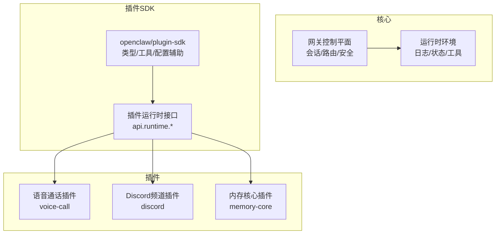
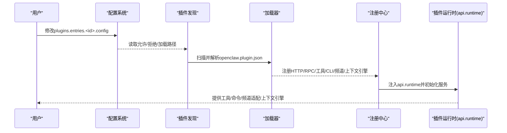
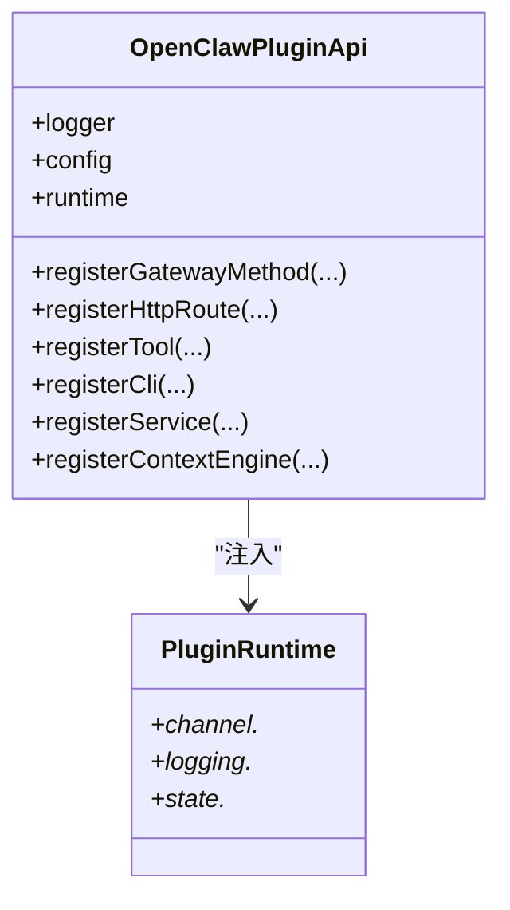
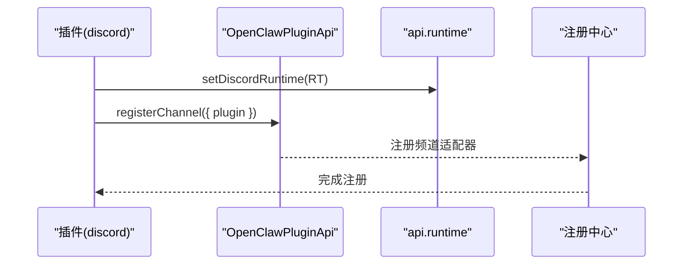
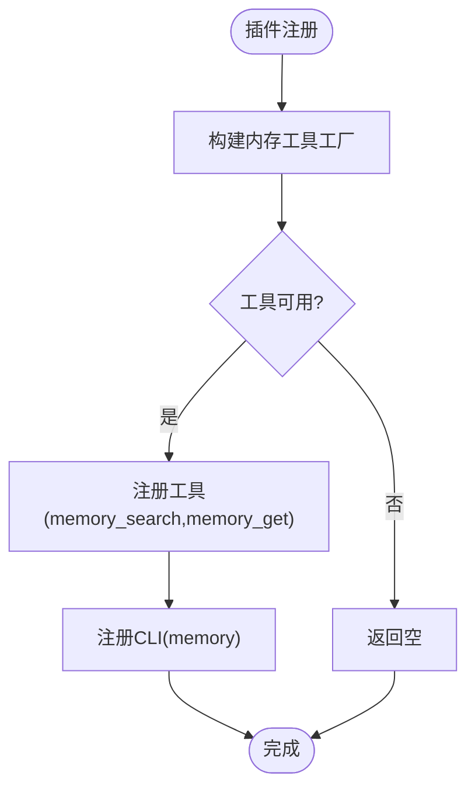
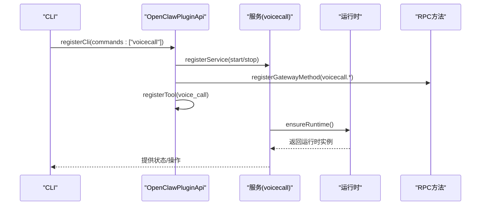
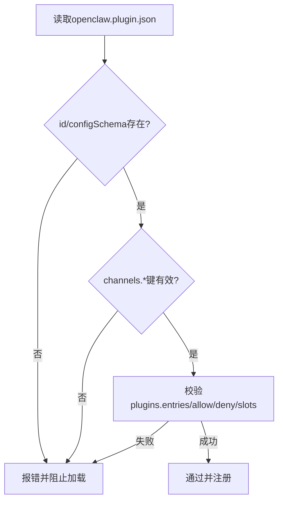
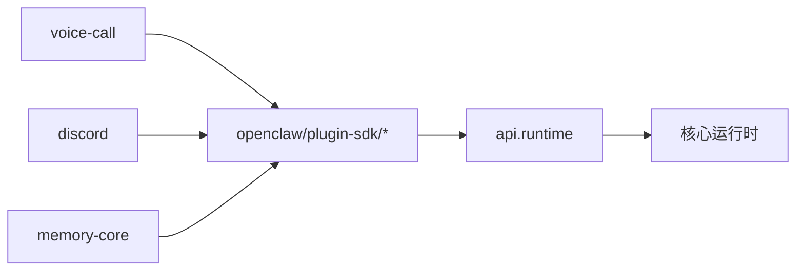

# 插件开发

<cite>
**本文引用的文件**
- [README.md](file://README.md)
- [docs/tools/plugin.md](file://docs/tools/plugin.md)
- [docs/plugins/manifest.md](file://docs/plugins/manifest.md)
- [docs/refactor/plugin-sdk.md](file://docs/refactor/plugin-sdk.md)
- [src/plugin-sdk/index.ts](file://src/plugin-sdk/index.ts)
- [src/plugin-sdk/core.ts](file://src/plugin-sdk/core.ts)
- [src/plugin-sdk/runtime.ts](file://src/plugin-sdk/runtime.ts)
- [src/plugin-sdk/telegram.ts](file://src/plugin-sdk/telegram.ts)
- [extensions/voice-call/index.ts](file://extensions/voice-call/index.ts)
- [extensions/voice-call/openclaw.plugin.json](file://extensions/voice-call/openclaw.plugin.json)
- [extensions/discord/index.ts](file://extensions/discord/index.ts)
- [extensions/discord/openclaw.plugin.json](file://extensions/discord/openclaw.plugin.json)
- [extensions/memory-core/index.ts](file://extensions/memory-core/index.ts)
</cite>

## 目录
1. [简介](#简介)
2. [项目结构](#项目结构)
3. [核心组件](#核心组件)
4. [架构总览](#架构总览)
5. [详细组件分析](#详细组件分析)
6. [依赖分析](#依赖分析)
7. [性能考虑](#性能考虑)
8. [故障排查指南](#故障排查指南)
9. [结论](#结论)
10. [附录](#附录)

## 简介
本指南面向OpenClaw插件开发者，系统阐述插件SDK的架构设计、扩展开发框架与API接口规范；详解渠道适配器插件、工具插件与技能插件的开发方法；覆盖插件生命周期管理、配置系统集成、安全机制与性能优化最佳实践，并提供完整开发示例、调试技巧与发布流程，兼顾初学者入门与高级开发者深度技术细节。

## 项目结构
OpenClaw采用“核心+插件”的分层架构：核心运行时负责会话、路由、安全与网关控制平面；插件通过统一SDK注册能力（HTTP路由、RPC方法、工具、CLI命令、上下文引擎、通道适配器等），在进程内扩展功能。官方文档与插件示例位于docs与extensions目录；插件SDK位于src/plugin-sdk。

图示来源
- [docs/refactor/plugin-sdk.md](file://docs/refactor/plugin-sdk.md#L19-L45)
- [src/plugin-sdk/index.ts](file://src/plugin-sdk/index.ts#L1-L120)

章节来源
- [README.md](file://README.md#L1-L120)
- [docs/tools/plugin.md](file://docs/tools/plugin.md#L1-L120)
- [docs/refactor/plugin-sdk.md](file://docs/refactor/plugin-sdk.md#L1-L60)

## 核心组件
- 插件SDK（openclaw/plugin-sdk）：提供稳定API子路径（core、telegram、discord等），封装类型、配置辅助与运行时访问点。
- 插件运行时（api.runtime）：以受控方式访问核心行为（文本分片、回复派发、路由、媒体、去重、SSRF策略、日志等），避免直接导入src内部实现。
- 插件清单（openclaw.plugin.json）：声明插件id、配置Schema、可选字段（kind、channels、providers、skills、uiHints、version）及验证规则。
- 官方插件示例：voice-call（RPC+工具+CLI+服务）、discord（频道适配器）、memory-core（工具+CLI）。

章节来源
- [src/plugin-sdk/index.ts](file://src/plugin-sdk/index.ts#L1-L120)
- [docs/tools/plugin.md](file://docs/tools/plugin.md#L145-L185)
- [docs/plugins/manifest.md](file://docs/plugins/manifest.md#L1-L76)
- [extensions/voice-call/index.ts](file://extensions/voice-call/index.ts#L146-L197)
- [extensions/discord/index.ts](file://extensions/discord/index.ts#L7-L17)
- [extensions/memory-core/index.ts](file://extensions/memory-core/index.ts#L4-L36)

## 架构总览
OpenClaw插件体系由“发现—加载—注册—执行”构成：按优先级扫描配置路径、工作区扩展、全局扩展与内置扩展；每个插件必须提供openclaw.plugin.json；插件通过SDK注册能力，运行于Gateway进程内，严格遵循安全与配置校验。

图示来源
- [docs/tools/plugin.md](file://docs/tools/plugin.md#L227-L303)
- [docs/plugins/manifest.md](file://docs/plugins/manifest.md#L11-L28)
- [src/plugin-sdk/index.ts](file://src/plugin-sdk/index.ts#L125-L127)

章节来源
- [docs/tools/plugin.md](file://docs/tools/plugin.md#L227-L303)
- [docs/plugins/manifest.md](file://docs/plugins/manifest.md#L11-L76)

## 详细组件分析

### 插件SDK与运行时
- SDK导出：类型定义、配置Schema构建器、账户与目录辅助、SSRF策略、Webhook守卫、去重缓存、临时路径、Windows程序解析、OAuth工具、运行时日志桥接等。
- 运行时接口：提供channel、logging、state等子域，屏蔽核心实现细节，确保插件不直接依赖src内部模块。

图示来源
- [src/plugin-sdk/index.ts](file://src/plugin-sdk/index.ts#L97-L124)
- [src/plugin-sdk/runtime.ts](file://src/plugin-sdk/runtime.ts#L9-L24)

章节来源
- [src/plugin-sdk/index.ts](file://src/plugin-sdk/index.ts#L1-L120)
- [src/plugin-sdk/runtime.ts](file://src/plugin-sdk/runtime.ts#L1-L25)

### 渠道适配器插件（以Discord为例）
- 通过api.registerChannel注册频道插件，声明元数据、能力、配置解析与出站发送等。
- 使用SDK提供的账户解析、目录配置、提及/群组策略、状态诊断等工具。
- 示例插件仅需设置运行时并注册频道，即可接入OpenClaw通道生态。

图示来源
- [extensions/discord/index.ts](file://extensions/discord/index.ts#L12-L16)
- [extensions/discord/openclaw.plugin.json](file://extensions/discord/openclaw.plugin.json#L1-L10)

章节来源
- [extensions/discord/index.ts](file://extensions/discord/index.ts#L1-L20)
- [extensions/discord/openclaw.plugin.json](file://extensions/discord/openclaw.plugin.json#L1-L10)

### 工具插件（以Memory Core为例）
- 声明kind: "memory"，注册内存搜索与获取工具，绑定到当前会话键。
- 暴露CLI命令，便于调试与运维。

图示来源
- [extensions/memory-core/index.ts](file://extensions/memory-core/index.ts#L10-L36)

章节来源
- [extensions/memory-core/index.ts](file://extensions/memory-core/index.ts#L1-L39)

### 技能插件（以voice-call为例）
- 通过openclaw.plugin.json声明skills数组，SDK自动加载技能目录。
- 插件同时注册：
  - Gateway RPC方法（voicecall.*）
  - Agent工具（voice_call）
  - CLI命令（voicecall）
  - 后台服务（启动/停止）

图示来源
- [extensions/voice-call/index.ts](file://extensions/voice-call/index.ts#L486-L526)
- [extensions/voice-call/openclaw.plugin.json](file://extensions/voice-call/openclaw.plugin.json#L1-L10)

章节来源
- [extensions/voice-call/index.ts](file://extensions/voice-call/index.ts#L146-L530)
- [extensions/voice-call/openclaw.plugin.json](file://extensions/voice-call/openclaw.plugin.json#L1-L161)

### 插件清单与配置Schema
- 必填：id、configSchema（严格JSON Schema）。
- 可选：kind、channels、providers、skills、name、description、uiHints、version。
- 验证规则：未知channels键需在清单中声明；plugins.entries/allow/deny/slots中的id必须可发现；禁用插件保留配置并告警。

图示来源
- [docs/plugins/manifest.md](file://docs/plugins/manifest.md#L18-L76)

章节来源
- [docs/plugins/manifest.md](file://docs/plugins/manifest.md#L1-L76)

## 依赖分析
- 插件对SDK的依赖：通过SDK子路径导入（如core、telegram、discord），避免直接依赖src内部模块。
- 插件对运行时的依赖：通过api.runtime访问核心能力，保持隔离与可测试性。
- 插件间耦合：通过插件槽位（如memory、contextEngine）实现互斥选择，避免冲突。

图示来源
- [docs/refactor/plugin-sdk.md](file://docs/refactor/plugin-sdk.md#L19-L45)
- [src/plugin-sdk/index.ts](file://src/plugin-sdk/index.ts#L1-L120)

章节来源
- [docs/refactor/plugin-sdk.md](file://docs/refactor/plugin-sdk.md#L1-L60)
- [src/plugin-sdk/index.ts](file://src/plugin-sdk/index.ts#L1-L120)

## 性能考虑
- 缓存与预热：插件发现与清单元数据使用短时缓存减少启动/重载抖动；可通过环境变量禁用或调整缓存窗口。
- 并发与限流：Webhook请求体大小限制、速率限制与异常追踪，避免资源耗尽。
- 媒体与SSRF：远程媒体下载与保存、SSRF白名单策略，降低网络风险。
- 日志与可观测：运行时日志桥接与诊断事件，便于定位性能瓶颈。

章节来源
- [docs/tools/plugin.md](file://docs/tools/plugin.md#L218-L226)
- [src/plugin-sdk/index.ts](file://src/plugin-sdk/index.ts#L372-L408)

## 故障排查指南
- 插件安装/更新：使用openclaw plugins doctor检查清单与配置错误；npm安装受版本与预发布策略约束。
- 配置校验：若插件已安装但清单缺失/损坏，Doctor会报告错误；禁用插件保留配置并告警。
- 安全与权限：默认工具在主会话运行；群组/频道安全建议启用沙箱；设备节点权限需经TCC授权。
- 调试技巧：利用api.runtime.logging.getChildLogger创建子日志器；结合诊断事件与SSRF守卫定位问题。

章节来源
- [docs/tools/plugin.md](file://docs/tools/plugin.md#L478-L482)
- [docs/plugins/manifest.md](file://docs/plugins/manifest.md#L53-L63)
- [README.md](file://README.md#L332-L339)

## 结论
OpenClaw插件体系以SDK为稳定边界、以运行时为受控入口，结合严格的清单与配置Schema，实现了可扩展、可审计、可维护的插件生态。通过官方示例与最佳实践，开发者可以快速构建渠道适配器、工具与技能插件，并在保证安全与性能的前提下持续演进。

## 附录

### 开发步骤速查
- 创建openclaw.plugin.json（id、configSchema必填，可选kind/channels/providers/skills/uiHints）
- 在插件根目录实现register函数，使用SDK子路径与api.runtime
- 通过api.register*注册能力（HTTP/RPC/工具/CLI/频道/上下文引擎/服务）
- 使用plugins.entries.<id>.config进行配置，重启Gateway生效
- 使用openclaw plugins doctor与openclaw plugins info排查问题

章节来源
- [docs/tools/plugin.md](file://docs/tools/plugin.md#L356-L482)
- [docs/plugins/manifest.md](file://docs/plugins/manifest.md#L18-L76)