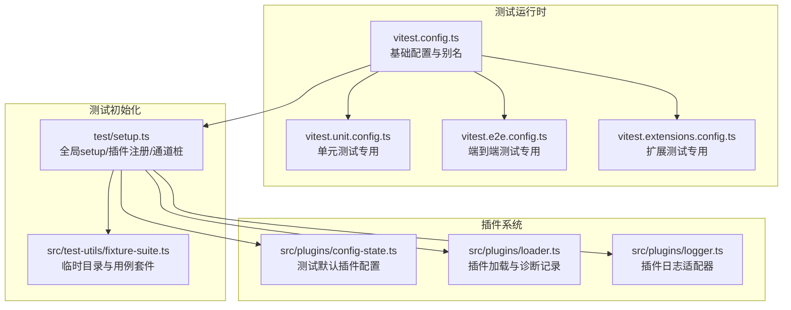
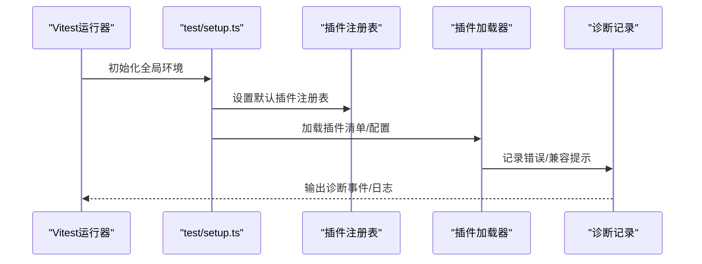
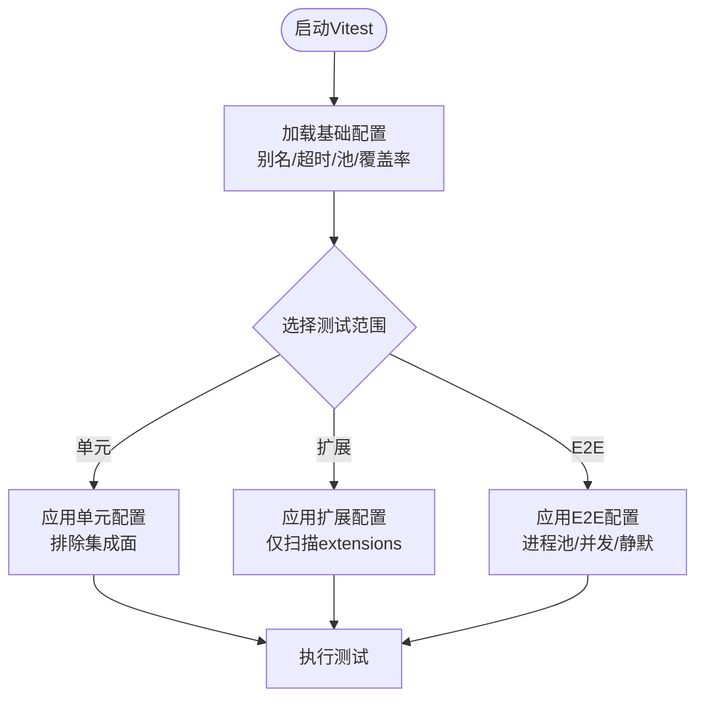
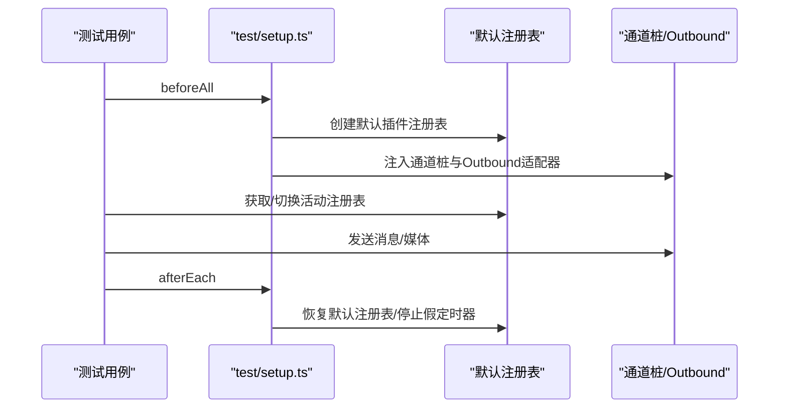
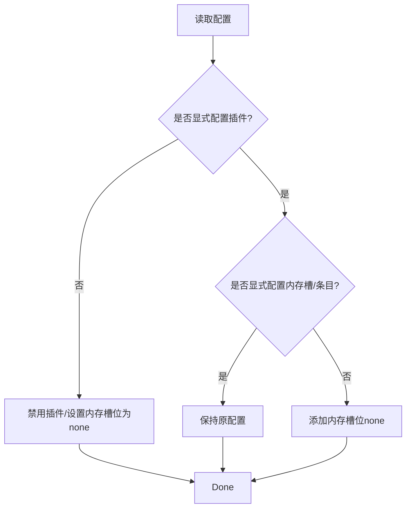
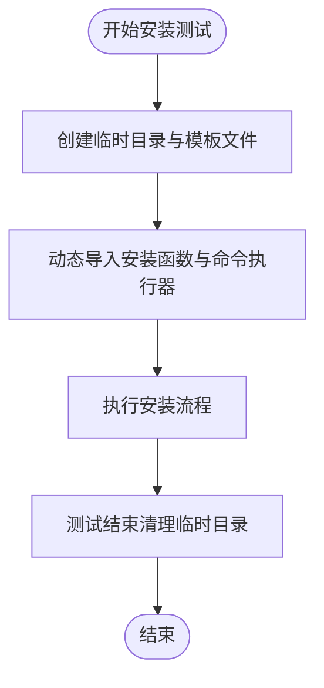
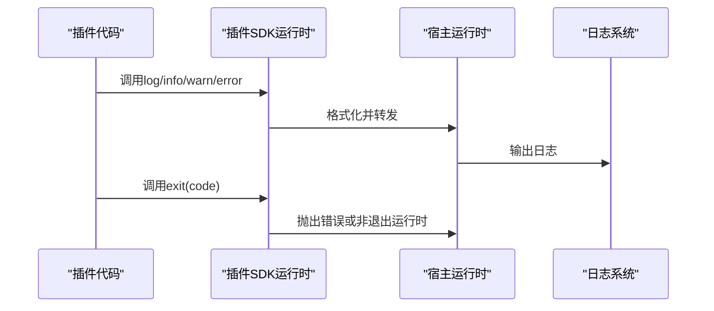
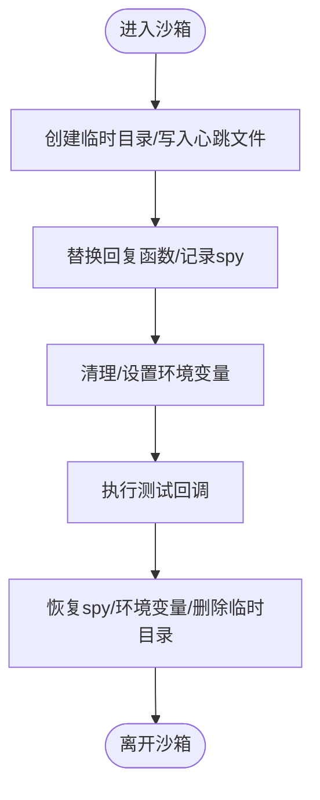
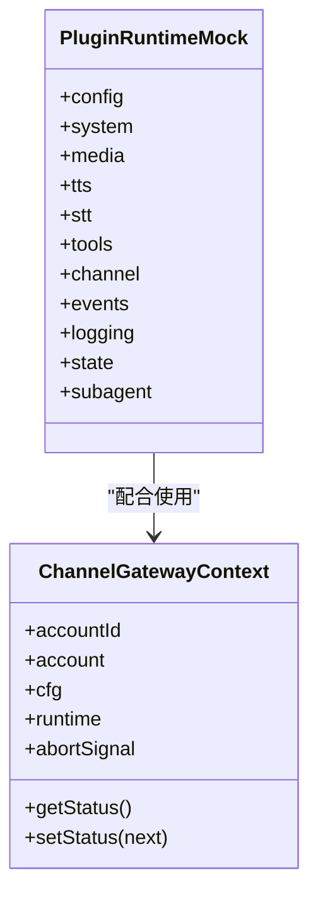
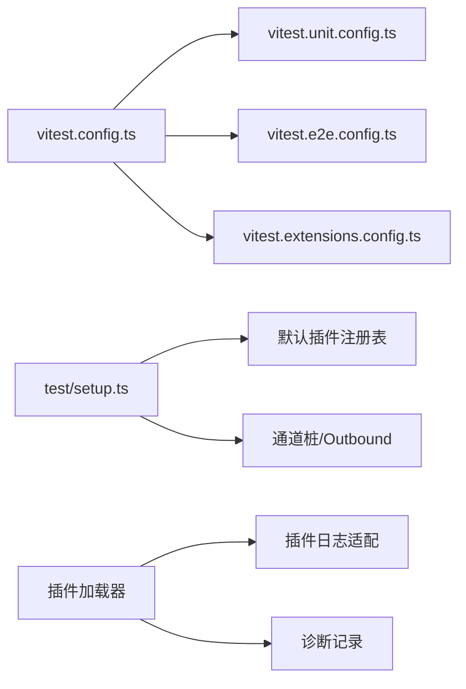

# 插件测试与调试

<cite>
**本文引用的文件**
- [vitest.config.ts](file://vitest.config.ts)
- [vitest.extensions.config.ts](file://vitest.extensions.config.ts)
- [vitest.unit.config.ts](file://vitest.unit.config.ts)
- [vitest.e2e.config.ts](file://vitest.e2e.config.ts)
- [test/setup.ts](file://test/setup.ts)
- [src/plugins/config-state.ts](file://src/plugins/config-state.ts)
- [src/plugins/loader.ts](file://src/plugins/loader.ts)
- [src/plugins/logger.ts](file://src/plugins/logger.ts)
- [src/plugins/install.test.ts](file://src/plugins/install.test.ts)
- [src/runtime.ts](file://src/runtime.ts)
- [src/plugin-sdk/runtime.ts](file://src/plugin-sdk/runtime.ts)
- [extensions/test-utils/plugin-runtime-mock.ts](file://extensions/test-utils/plugin-runtime-mock.ts)
- [extensions/test-utils/runtime-env.ts](file://extensions/test-utils/runtime-env.ts)
- [extensions/test-utils/start-account-context.ts](file://extensions/test-utils/start-account-context.ts)
- [src/gateway/server.impl.ts](file://src/gateway/server.impl.ts)
- [src/infra/heartbeat-runner.test-utils.ts](file://src/infra/heartbeat-runner.test-utils.ts)
- [src/test-utils/fixture-suite.ts](file://src/test-utils/fixture-suite.ts)
- [package.json](file://package.json)
</cite>

## 目录
1. [引言](#引言)
2. [项目结构](#项目结构)
3. [核心组件](#核心组件)
4. [架构总览](#架构总览)
5. [详细组件分析](#详细组件分析)
6. [依赖分析](#依赖分析)
7. [性能考虑](#性能考虑)
8. [故障排查指南](#故障排查指南)
9. [结论](#结论)
10. [附录](#附录)

## 引言
本指南面向OpenClaw插件开发者，系统性讲解如何在本地与CI中高效进行插件测试与调试。内容覆盖测试框架使用、单元测试编写、集成测试与端到端测试的设计与实现，以及调试工具（日志、错误追踪、性能分析）的使用方法。同时提供测试数据准备、模拟环境搭建与自动化测试流程的最佳实践，帮助你快速定位问题并提升开发效率。

## 项目结构
OpenClaw采用多包工作区与分层架构组织代码，测试体系基于Vitest，按“单元/扩展/网关/通道/E2E”等维度拆分配置，结合统一的setup与fixtures，确保隔离与可重复性。

图表来源
- [vitest.config.ts](file://vitest.config.ts#L57-L203)
- [vitest.unit.config.ts](file://vitest.unit.config.ts#L1-L31)
- [vitest.e2e.config.ts](file://vitest.e2e.config.ts#L1-L33)
- [vitest.extensions.config.ts](file://vitest.extensions.config.ts#L1-L4)
- [test/setup.ts](file://test/setup.ts#L1-L195)
- [src/test-utils/fixture-suite.ts](file://src/test-utils/fixture-suite.ts#L1-L29)
- [src/plugins/config-state.ts](file://src/plugins/config-state.ts#L112-L173)
- [src/plugins/loader.ts](file://src/plugins/loader.ts#L289-L331)
- [src/plugins/logger.ts](file://src/plugins/logger.ts#L1-L17)

章节来源
- [vitest.config.ts](file://vitest.config.ts#L57-L203)
- [test/setup.ts](file://test/setup.ts#L1-L195)

## 核心组件
- 测试运行时与配置
  - 基础Vitest配置：包含插件SDK别名映射、超时、池类型、覆盖率阈值与排除规则。
  - 单元测试配置：排除网关/通道等集成面，聚焦纯逻辑单元。
  - E2E配置：进程池隔离、默认并发与静默控制，便于容器化执行。
  - 扩展测试配置：仅扫描extensions目录下的测试文件。
- 全局setup与测试环境
  - 安装进程警告过滤、隔离HOME状态目录、安装默认插件注册表、清理假定时器。
  - 提供通道桩（ChannelPlugin）与Outbound适配器，屏蔽真实通道调用。
- 插件系统测试支持
  - 测试默认插件配置：在Vitest环境下自动禁用插件或设置内存槽位为none，避免干扰。
  - 插件加载与诊断：记录错误、兼容提示与诊断事件，便于定位问题。
  - 插件日志适配：将插件日志转发至宿主日志系统，统一可观测性。

章节来源
- [vitest.config.ts](file://vitest.config.ts#L57-L203)
- [vitest.unit.config.ts](file://vitest.unit.config.ts#L1-L31)
- [vitest.e2e.config.ts](file://vitest.e2e.config.ts#L1-L33)
- [vitest.extensions.config.ts](file://vitest.extensions.config.ts#L1-L4)
- [test/setup.ts](file://test/setup.ts#L1-L195)
- [src/plugins/config-state.ts](file://src/plugins/config-state.ts#L112-L173)
- [src/plugins/loader.ts](file://src/plugins/loader.ts#L289-L331)
- [src/plugins/logger.ts](file://src/plugins/logger.ts#L1-L17)

## 架构总览
下图展示从测试入口到插件加载与诊断的关键路径，帮助理解测试与调试的全链路。

图表来源
- [test/setup.ts](file://test/setup.ts#L182-L194)
- [src/plugins/loader.ts](file://src/plugins/loader.ts#L289-L331)
- [src/plugins/config-state.ts](file://src/plugins/config-state.ts#L137-L173)

## 详细组件分析

### 组件A：测试运行时与配置
- 基础配置要点
  - 别名映射：将openclaw/plugin-sdk子路径解析到src/plugin-sdk对应文件，便于插件SDK测试。
  - 超时与池：测试与钩子超时、进程池forks、最大worker数随平台与CI动态调整。
  - 覆盖率：仅统计实际被测试覆盖的源码，排除入口、CLI、UI等非核心模块。
- 单元/扩展/E2E配置差异
  - 单元：排除网关/通道/浏览器等集成面，聚焦纯函数与类。
  - 扩展：仅扫描extensions目录。
  - E2E：进程池隔离、默认并发与静默控制，便于容器化执行。

图表来源
- [vitest.config.ts](file://vitest.config.ts#L57-L203)
- [vitest.unit.config.ts](file://vitest.unit.config.ts#L1-L31)
- [vitest.extensions.config.ts](file://vitest.extensions.config.ts#L1-L4)
- [vitest.e2e.config.ts](file://vitest.e2e.config.ts#L1-L33)

章节来源
- [vitest.config.ts](file://vitest.config.ts#L57-L203)
- [vitest.unit.config.ts](file://vitest.unit.config.ts#L1-L31)
- [vitest.extensions.config.ts](file://vitest.extensions.config.ts#L1-L4)
- [vitest.e2e.config.ts](file://vitest.e2e.config.ts#L1-L33)

### 组件B：全局setup与测试环境
- 环境隔离
  - 使用隔离HOME目录，避免跨用例污染；设置插件清单缓存时间，减少重复发现开销。
  - 安装进程警告过滤，降低噪音。
- 默认插件注册表
  - 预置Discord/Slack/Telegram/WhatsApp/Signal/iMessage等通道桩插件，统一测试入口。
  - 每个测试结束后恢复默认注册表，防止跨文件污染。
- 通道桩与Outbound适配器
  - 将真实发送封装为可注入的stub，便于断言与控制行为。

图表来源
- [test/setup.ts](file://test/setup.ts#L182-L194)
- [test/setup.ts](file://test/setup.ts#L131-L176)
- [test/setup.ts](file://test/setup.ts#L59-L82)

章节来源
- [test/setup.ts](file://test/setup.ts#L1-L195)

### 组件C：插件系统测试支持
- 测试默认插件配置
  - 在Vitest环境下，若未显式配置插件，则自动禁用插件并设置内存槽位为none，避免对测试造成干扰。
- 插件加载与诊断
  - 记录加载错误、兼容性提示（如api.registerHttpHandler已移除），并将诊断事件输出到日志。
- 插件日志适配
  - 将插件日志转发至宿主日志系统，统一info/warn/error/debug输出。

图表来源
- [src/plugins/config-state.ts](file://src/plugins/config-state.ts#L112-L173)

章节来源
- [src/plugins/config-state.ts](file://src/plugins/config-state.ts#L112-L173)
- [src/plugins/loader.ts](file://src/plugins/loader.ts#L289-L331)
- [src/plugins/logger.ts](file://src/plugins/logger.ts#L1-L17)

### 组件D：插件安装与测试夹具
- 测试夹具
  - 使用临时目录创建插件安装模板，生成package.json与dist/index.js，模拟真实插件结构。
  - 在测试结束后清理临时目录，避免残留。
- 运行命令超时
  - 通过runCommandWithTimeout控制外部命令执行，避免阻塞测试。

图表来源
- [src/plugins/install.test.ts](file://src/plugins/install.test.ts#L315-L356)

章节来源
- [src/plugins/install.test.ts](file://src/plugins/install.test.ts#L315-L356)

### 组件E：调试工具与日志
- 运行时日志
  - 在Vitest中可通过环境变量控制是否输出日志，避免测试期间终端输出干扰。
  - 提供非退出运行时，便于在测试中捕获退出异常。
- 插件SDK运行时
  - 将插件日志桥接到宿主logger，统一格式化输出。
- 诊断事件
  - 插件加载失败、兼容性提示等通过诊断事件上报，便于定位问题。

图表来源
- [src/runtime.ts](file://src/runtime.ts#L1-L53)
- [src/plugin-sdk/runtime.ts](file://src/plugin-sdk/runtime.ts#L1-L24)
- [src/plugins/loader.ts](file://src/plugins/loader.ts#L289-L331)

章节来源
- [src/runtime.ts](file://src/runtime.ts#L1-L53)
- [src/plugin-sdk/runtime.ts](file://src/plugin-sdk/runtime.ts#L1-L24)
- [src/plugins/loader.ts](file://src/plugins/loader.ts#L289-L331)

### 组件F：心跳与测试沙箱
- 心跳沙箱
  - 为心跳功能创建临时目录与会话存储，替换回复函数以断言行为，并在测试后恢复环境变量。
- Telegram心跳沙箱
  - 针对Telegram特定环境变量进行清理与恢复，保证测试隔离。

图表来源
- [src/infra/heartbeat-runner.test-utils.ts](file://src/infra/heartbeat-runner.test-utils.ts#L49-L106)

章节来源
- [src/infra/heartbeat-runner.test-utils.ts](file://src/infra/heartbeat-runner.test-utils.ts#L49-L106)

### 组件G：测试数据与模拟环境
- 通道桩与账户上下文
  - 提供通道桩插件与账户上下文，便于在不同通道场景下启动/停止插件生命周期。
- 插件运行时Mock
  - 深度合并策略构建完整的插件运行时Mock，覆盖配置、系统、媒体、TTS/STT、工具、通道、事件、日志、状态与子代理等接口，便于断言与控制行为。

图表来源
- [extensions/test-utils/plugin-runtime-mock.ts](file://extensions/test-utils/plugin-runtime-mock.ts#L35-L255)
- [extensions/test-utils/start-account-context.ts](file://extensions/test-utils/start-account-context.ts#L9-L33)

章节来源
- [extensions/test-utils/plugin-runtime-mock.ts](file://extensions/test-utils/plugin-runtime-mock.ts#L35-L255)
- [extensions/test-utils/start-account-context.ts](file://extensions/test-utils/start-account-context.ts#L9-L33)

## 依赖分析
- 配置依赖
  - 所有测试配置均继承自基础配置，通过include/exclude与pool/maxWorkers等参数细化范围与隔离级别。
- 运行时依赖
  - 插件加载器依赖日志适配器与诊断记录，统一错误处理与可观测性。
- 环境依赖
  - 全局setup依赖通道桩与默认注册表，确保测试在可控环境中运行。

图表来源
- [vitest.config.ts](file://vitest.config.ts#L57-L203)
- [vitest.unit.config.ts](file://vitest.unit.config.ts#L1-L31)
- [vitest.e2e.config.ts](file://vitest.e2e.config.ts#L1-L33)
- [vitest.extensions.config.ts](file://vitest.extensions.config.ts#L1-L4)
- [test/setup.ts](file://test/setup.ts#L131-L176)
- [src/plugins/loader.ts](file://src/plugins/loader.ts#L289-L331)
- [src/plugins/logger.ts](file://src/plugins/logger.ts#L1-L17)

章节来源
- [vitest.config.ts](file://vitest.config.ts#L57-L203)
- [test/setup.ts](file://test/setup.ts#L131-L176)
- [src/plugins/loader.ts](file://src/plugins/loader.ts#L289-L331)

## 性能考虑
- 并发与隔离
  - 单元测试使用进程池隔离，避免VM上下文共享导致的状态泄漏；E2E使用进程池确保确定性。
  - CI下根据平台限制最大worker数量，Windows默认更保守。
- 覆盖率与排除
  - 仅统计实际被测试覆盖的源码，排除入口、CLI、UI、网关服务器等集成面，降低覆盖率计算成本。
- 缓存与监听
  - 提升MaxListeners上限，减少测试进程警告；设置插件清单缓存时间，加速多次发现。

章节来源
- [vitest.config.ts](file://vitest.config.ts#L71-L203)
- [test/setup.ts](file://test/setup.ts#L1-L13)

## 故障排查指南
- 插件加载失败
  - 查看诊断事件与错误记录，确认是否使用了已废弃API（如registerHttpHandler）；根据提示改用registerHttpRoute或registerPluginHttpRoute。
- 日志输出异常
  - 在Vitest中可通过环境变量控制日志输出；若测试期间日志过多，可启用测试专用日志开关。
- 环境变量污染
  - 使用心跳沙箱或通道桩测试工具，确保环境变量在测试前后正确恢复。
- 安装测试失败
  - 检查临时目录与模板文件是否正确生成；确认runCommandWithTimeout未超时。

章节来源
- [src/plugins/loader.ts](file://src/plugins/loader.ts#L289-L331)
- [src/runtime.ts](file://src/runtime.ts#L10-L19)
- [src/infra/heartbeat-runner.test-utils.ts](file://src/infra/heartbeat-runner.test-utils.ts#L49-L106)
- [src/plugins/install.test.ts](file://src/plugins/install.test.ts#L315-L356)

## 结论
通过统一的测试配置、严格的环境隔离与完善的诊断机制，OpenClaw为插件开发提供了高可靠性的测试与调试保障。建议在开发过程中遵循“先单元、再集成、最后E2E”的策略，充分利用通道桩、运行时Mock与心跳沙箱，结合日志与诊断事件，快速定位并解决问题。

## 附录
- 常用命令
  - 单元测试：参见基础配置include范围与单元配置排除项。
  - 扩展测试：仅扫描extensions目录。
  - E2E测试：使用进程池隔离，支持并发与静默控制。
  - 网关/通道/插件安装等专项测试：参考package.json中的脚本定义。

章节来源
- [package.json](file://package.json#L224-L314)