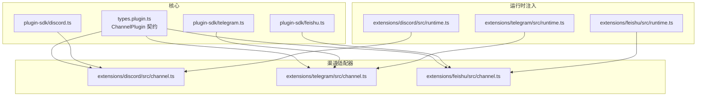
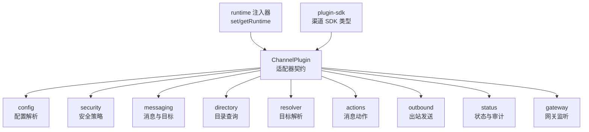
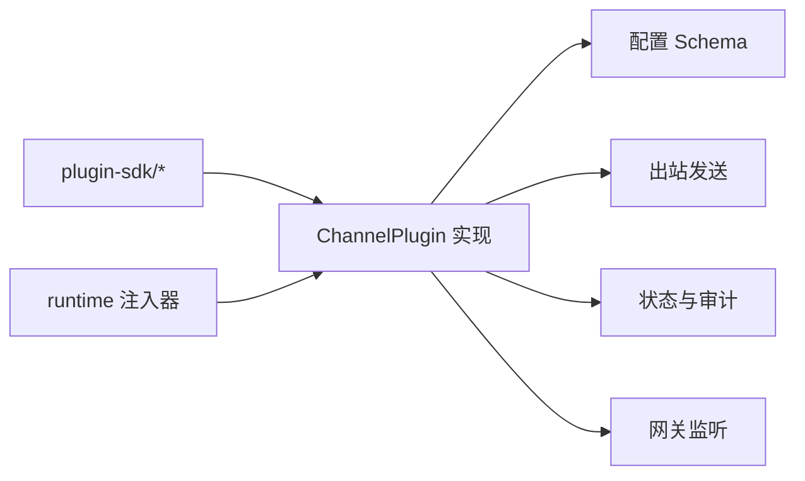

# 渠道适配器开发

<cite>
**本文引用的文件**
- [src/channels/plugins/types.plugin.ts](file://src/channels/plugins/types.plugin.ts)
- [extensions/discord/src/channel.ts](file://extensions/discord/src/channel.ts)
- [extensions/telegram/src/channel.ts](file://extensions/telegram/src/channel.ts)
- [extensions/feishu/src/channel.ts](file://extensions/feishu/src/channel.ts)
- [extensions/discord/src/runtime.ts](file://extensions/discord/src/runtime.ts)
- [extensions/telegram/src/runtime.ts](file://extensions/telegram/src/runtime.ts)
- [extensions/feishu/src/runtime.ts](file://extensions/feishu/src/runtime.ts)
- [extensions/shared/resolve-target-test-helpers.ts](file://extensions/shared/resolve-target-test-helpers.ts)
- [src/plugin-sdk/discord.ts](file://src/plugin-sdk/discord.ts)
- [src/plugin-sdk/telegram.ts](file://src/plugin-sdk/telegram.ts)
- [src/plugin-sdk/feishu.ts](file://src/plugin-sdk/feishu.ts)
</cite>

## 目录
1. [简介](#简介)
2. [项目结构](#项目结构)
3. [核心组件](#核心组件)
4. [架构总览](#架构总览)
5. [详细组件分析](#详细组件分析)
6. [依赖关系分析](#依赖关系分析)
7. [性能考量](#性能考量)
8. [故障排查指南](#故障排查指南)
9. [结论](#结论)
10. [附录](#附录)

## 简介
本指南面向希望为 OpenClaw 开发“消息渠道适配器”的开发者，目标是帮助你从零开始实现一个新的渠道适配器，覆盖以下关键主题：
- 适配器接口与契约：ChannelPlugin 及其子适配器（如 ChannelMessagingAdapter、ChannelAuthAdapter、ChannelOutboundAdapter 等）
- 认证与配对：渠道特有的凭据管理、配对通知与访问控制
- 消息路由与发送：目标解析、消息分片、线程与回复处理
- 状态监控与审计：运行时状态采集、健康检查与权限审计
- 错误处理与测试：常见错误场景与单元测试辅助工具
- 性能优化与最佳实践：限流、分片、连接模式选择

通过本指南，你将掌握如何在不深入理解整个系统的情况下，快速完成一个可上线的渠道适配器。

## 项目结构
OpenClaw 的渠道适配器遵循“插件化 + SDK”的设计：
- 核心插件契约与类型定义位于 src/channels/plugins/types.plugin.ts
- 各渠道适配器位于 extensions/<channel>/src/channel.ts
- 各渠道的运行时注入器位于 extensions/<channel>/src/runtime.ts
- 渠道 SDK 定义位于 src/plugin-sdk/<channel>.ts

图表来源
- [src/channels/plugins/types.plugin.ts](file://src/channels/plugins/types.plugin.ts#L49-L85)
- [extensions/discord/src/channel.ts](file://extensions/discord/src/channel.ts#L54-L472)
- [extensions/telegram/src/channel.ts](file://extensions/telegram/src/channel.ts#L90-L580)
- [extensions/feishu/src/channel.ts](file://extensions/feishu/src/channel.ts#L57-L385)
- [extensions/discord/src/runtime.ts](file://extensions/discord/src/runtime.ts#L1-L15)
- [extensions/telegram/src/runtime.ts](file://extensions/telegram/src/runtime.ts#L1-L15)
- [extensions/feishu/src/runtime.ts](file://extensions/feishu/src/runtime.ts#L1-L15)

章节来源
- [src/channels/plugins/types.plugin.ts](file://src/channels/plugins/types.plugin.ts#L49-L85)
- [extensions/discord/src/channel.ts](file://extensions/discord/src/channel.ts#L54-L472)
- [extensions/telegram/src/channel.ts](file://extensions/telegram/src/channel.ts#L90-L580)
- [extensions/feishu/src/channel.ts](file://extensions/feishu/src/channel.ts#L57-L385)

## 核心组件
本节聚焦于 ChannelPlugin 及其关键子适配器，说明它们在适配器中的职责与典型实现要点。

- ChannelPlugin
  - 负责声明渠道标识、元信息、能力、重载策略、配置与 Schema、配对、安全策略、群组、提及、消息、目录、解析器、动作、出站、状态、网关、认证、命令、流式、线程、代理提示、目录、解析器、动作、心跳、代理工具等。
  - 关键字段参考：id、meta、capabilities、reload、config、configSchema、pairing、security、groups、mentions、messaging、directory、resolver、actions、outbound、status、gateway、auth、commands、streaming、threading、agentPrompt、heartbeat、agentTools 等。

- ChannelMessagingAdapter
  - 职责：消息发送、目标规范化、目标解析器（识别是否像目标 ID、提示）。
  - 典型实现：各渠道在 outbound 中调用 runtime 的发送函数，并在 messaging.normalizeTarget 与 targetResolver.looksLikeId/hint 中完成目标标准化与校验。

- ChannelAuthAdapter
  - 职责：认证流程（OAuth、令牌、密钥等）与登录/登出生命周期管理。
  - 实现建议：在 auth.setup/validate/apply 中完成凭据输入校验与落盘；在 auth.login/logout 中处理登录与清理；结合 runtime 提供的认证服务。

- ChannelOutboundAdapter
  - 职责：文本/媒体/投票等消息的发送；分片策略与限制；投递模式（direct/poll/webhook）。
  - 实现建议：根据渠道 API 限制设置 textChunkLimit、pollMaxOptions；必要时提供自定义 chunker；支持 replyTo/threadId 等上下文参数。

- ChannelStatusAdapter
  - 职责：运行时状态默认值、健康探针、权限审计、快照构建与问题收集。
  - 实现建议：probeAccount 返回渠道可用性与身份信息；auditAccount 执行权限/订阅审计；buildAccountSnapshot 统一聚合状态。

- ChannelGatewayAdapter
  - 职责：启动/停止账户级网关，监听入站事件，转发到核心处理。
  - 实现建议：根据渠道特性选择轮询或 Webhook；在 startAccount 中初始化监听器并上报状态。

章节来源
- [src/channels/plugins/types.plugin.ts](file://src/channels/plugins/types.plugin.ts#L49-L85)

## 架构总览
下图展示了 ChannelPlugin 在 OpenClaw 中的协作关系：适配器通过 runtime 注入器获取渠道运行时能力，status/outbound/gateway 等模块协同工作，形成“配置—认证—路由—发送—监控”的闭环。

图表来源
- [src/channels/plugins/types.plugin.ts](file://src/channels/plugins/types.plugin.ts#L49-L85)
- [extensions/discord/src/runtime.ts](file://extensions/discord/src/runtime.ts#L1-L15)
- [extensions/telegram/src/runtime.ts](file://extensions/telegram/src/runtime.ts#L1-L15)
- [extensions/feishu/src/runtime.ts](file://extensions/feishu/src/runtime.ts#L1-L15)

## 详细组件分析

### ChannelPlugin 接口与实现要点
- 必填字段
  - id、meta、capabilities、config、outbound、status、gateway
- 可选字段
  - onboarding、pairing、security、groups、mentions、messaging、directory、resolver、actions、streaming、threading、agentPrompt、heartbeat、agentTools 等
- 设计原则
  - 将渠道特定逻辑封装在 runtime 中，适配器仅负责编排与契约对接
  - 配置 Schema 与 UI Hints 明确敏感项与高级选项，提升可维护性

章节来源
- [src/channels/plugins/types.plugin.ts](file://src/channels/plugins/types.plugin.ts#L49-L85)

### 认证与配对（ChannelAuthAdapter 与 ChannelPairingAdapter）
- 配对流程
  - pairing.notifyApproval：向用户发送批准提示（如“已批准”消息）
  - pairing.normalizeAllowEntry：允许条目归一化（去除前缀、提取 ID）
- 认证流程
  - auth.setup.validate/apply：校验输入并写入配置
  - auth.login/logout：登录与登出，清理凭据
  - auth.credentials：凭据读取与投影（如 tokenSource）

示例参考
- Discord：使用 token 进行配对与批准通知
- Telegram：支持 token/tokenFile/use-env，重复 token 校验
- Feishu：多账户与域名/连接模式配置

章节来源
- [extensions/discord/src/channel.ts](file://extensions/discord/src/channel.ts#L60-L69)
- [extensions/telegram/src/channel.ts](file://extensions/telegram/src/channel.ts#L97-L113)
- [extensions/feishu/src/channel.ts](file://extensions/feishu/src/channel.ts#L62-L72)

### 消息路由与发送（ChannelMessagingAdapter 与 ChannelOutboundAdapter）
- 目标规范化
  - messaging.normalizeTarget：将用户输入标准化为目标 ID 或路径
  - targetResolver.looksLikeId/hint：辅助识别与提示
- 出站发送
  - outbound.sendText/sendMedia/sendPoll：调用 runtime 发送
  - outbound.chunker/textChunkLimit/pollMaxOptions：按渠道限制进行分片与选项上限控制
  - outbound.deliveryMode：direct/poll/webhook 等模式
- 上下文参数
  - replyToId、threadId、silent 等透传至 runtime

示例参考
- Discord：支持组件、表单、投票；blockStreamingCoalesceDefaults 控制流式输出
- Telegram：Markdown 分片、线程与回复解析
- Feishu：卡片渲染、编辑/回复、话题会话模式

章节来源
- [extensions/discord/src/channel.ts](file://extensions/discord/src/channel.ts#L181-L187)
- [extensions/discord/src/channel.ts](file://extensions/discord/src/channel.ts#L303-L349)
- [extensions/telegram/src/channel.ts](file://extensions/telegram/src/channel.ts#L233-L239)
- [extensions/telegram/src/channel.ts](file://extensions/telegram/src/channel.ts#L321-L376)
- [extensions/feishu/src/channel.ts](file://extensions/feishu/src/channel.ts#L304-L310)
- [extensions/feishu/src/channel.ts](file://extensions/feishu/src/channel.ts#L342-L342)

### 状态监控与审计（ChannelStatusAdapter）
- 默认运行时状态：defaultRuntime
- 健康探针：probeAccount 返回应用/机器人信息
- 权限审计：auditAccount 收集未解析目标/群组并执行权限检查
- 快照构建：buildAccountSnapshot 聚合配置、运行时、探针与审计结果

示例参考
- Discord：收集应用/机器人信息、意图状态、审计频道权限
- Telegram：检测重复 token、Webhook/Polling 模式、未提及群组
- Feishu：端口、连接模式、探针结果

章节来源
- [extensions/discord/src/channel.ts](file://extensions/discord/src/channel.ts#L350-L424)
- [extensions/telegram/src/channel.ts](file://extensions/telegram/src/channel.ts#L377-L461)
- [extensions/feishu/src/channel.ts](file://extensions/feishu/src/channel.ts#L343-L366)

### 网关启动（ChannelGatewayAdapter）
- startAccount：初始化监听器、设置状态、记录日志
- logoutAccount（可选）：清理凭据与配置

示例参考
- Discord：启动 monitorDiscordProvider，检查消息内容意图
- Telegram：根据 webhookUrl 决定连接模式
- Feishu：根据 connectionMode 启动 websocket/webhook

章节来源
- [extensions/discord/src/channel.ts](file://extensions/discord/src/channel.ts#L425-L471)
- [extensions/telegram/src/channel.ts](file://extensions/telegram/src/channel.ts#L463-L510)
- [extensions/feishu/src/channel.ts](file://extensions/feishu/src/channel.ts#L367-L383)

### 目标解析流程（resolver.resolveTargets）
- 输入一组原始目标，返回标准化后的解析结果（含 id/name/note）
- 支持 group/user 两类解析，不同渠道调用各自 runtime 的 resolveXxxAllowlist

示例参考
- Discord：resolveChannelAllowlist/resolveUserAllowlist
- Telegram/Feishu：对应渠道的解析函数

章节来源
- [extensions/discord/src/channel.ts](file://extensions/discord/src/channel.ts#L197-L236)

### 消息动作（actions.ChannelMessageActionAdapter）
- listActions/extractToolSend/handleAction：支持渠道内按钮/表单等交互动作
- 未实现时抛出明确错误，避免静默失败

示例参考
- Discord/Telegram/Feishu：均提供统一的动作适配器桥接

章节来源
- [extensions/discord/src/channel.ts](file://extensions/discord/src/channel.ts#L40-L52)
- [extensions/telegram/src/channel.ts](file://extensions/telegram/src/channel.ts#L76-L88)
- [extensions/feishu/src/channel.ts](file://extensions/feishu/src/channel.ts#L1-L29)

### 运行时注入器（runtime 注入）
- 各渠道通过 runtime.ts 提供 setXxxRuntime/getXxxRuntime，适配器通过 getRuntime 获取能力
- 未初始化时抛错，便于早期发现配置问题

章节来源
- [extensions/discord/src/runtime.ts](file://extensions/discord/src/runtime.ts#L1-L15)
- [extensions/telegram/src/runtime.ts](file://extensions/telegram/src/runtime.ts#L1-L15)
- [extensions/feishu/src/runtime.ts](file://extensions/feishu/src/runtime.ts#L1-L15)

### 测试辅助：目标解析错误用例
- 提供通用的 resolveTarget 错误场景测试用例：空/无效/空白目标、无 allowlist 等
- 便于新适配器复用，保证一致性

章节来源
- [extensions/shared/resolve-target-test-helpers.ts](file://extensions/shared/resolve-target-test-helpers.ts#L17-L66)

## 依赖关系分析
- 适配器对 SDK 的依赖：通过 plugin-sdk/<channel>.ts 导出的类型与工具函数
- 适配器对 runtime 的依赖：通过 runtime.ts 注入器获取运行时能力
- 适配器对自身配置 Schema 的依赖：用于 CLI 配置与 UI 呈现

图表来源
- [src/plugin-sdk/discord.ts](file://src/plugin-sdk/discord.ts)
- [src/plugin-sdk/telegram.ts](file://src/plugin-sdk/telegram.ts)
- [src/plugin-sdk/feishu.ts](file://src/plugin-sdk/feishu.ts)
- [extensions/discord/src/channel.ts](file://extensions/discord/src/channel.ts#L54-L472)
- [extensions/telegram/src/channel.ts](file://extensions/telegram/src/channel.ts#L90-L580)
- [extensions/feishu/src/channel.ts](file://extensions/feishu/src/channel.ts#L57-L385)

## 性能考量
- 文本分片与长度限制
  - 根据渠道 API 限制设置 textChunkLimit 与 chunker
  - 对长文本采用分片发送，避免超限
- 投票与多媒体
  - 严格遵守 pollMaxOptions 与 mediaMaxMb 限制
- 连接模式
  - Webhook 优先于轮询，降低延迟与资源消耗
- 流式输出
  - 使用 streaming.blockStreamingCoalesceDefaults 控制合并策略，平衡实时性与吞吐
- 并发与去重
  - 利用 keyed 异步队列与持久化去重，避免重复处理

## 故障排查指南
- 初始化错误
  - 运行时未初始化：检查 runtime 注入器是否在适配器加载前设置
- 配置错误
  - 缺少凭据或重复 token：参考 Telegram 的重复 token 校验与错误提示
  - 配置路径错误：确认 configSchema 与 config.setAccountEnabled 的落盘路径
- 发送失败
  - 目标解析失败：核对 messaging.targetResolver.looksLikeId/hint 与 normalizeTarget
  - 权限不足：使用 status.auditAccount 与 security.collectWarnings 获取审计与警告
- 监听异常
  - Webhook 地址/端口冲突：检查 webhookHost/port 与防火墙
  - 轮询超时：调整超时时间与重试策略

章节来源
- [extensions/telegram/src/channel.ts](file://extensions/telegram/src/channel.ts#L42-L64)
- [extensions/telegram/src/channel.ts](file://extensions/telegram/src/channel.ts#L145-L163)
- [extensions/telegram/src/channel.ts](file://extensions/telegram/src/channel.ts#L393-L421)
- [extensions/telegram/src/channel.ts](file://extensions/telegram/src/channel.ts#L463-L510)

## 结论
通过以上分析与示例，你可以基于 ChannelPlugin 契约与渠道 SDK，快速实现一个功能完备的消息渠道适配器。关键在于：
- 明确适配器边界：只做编排与契约对接，具体能力由 runtime 提供
- 重视配置与 Schema：让 CLI 与 UI 自动获得良好体验
- 完善认证与安全：从配对到权限审计，形成闭环
- 注重测试与可观测：利用测试辅助与状态快照定位问题

## 附录
- 开发步骤建议
  - 复制现有适配器结构，替换 id/meta/capabilities 等基本信息
  - 实现 config/configSchema 与 setup/validate/apply
  - 实现 messaging.normalizeTarget 与 targetResolver
  - 实现 outbound.sendText/sendMedia/sendPoll 与分片策略
  - 实现 status.probeAccount/auditAccount/buildAccountSnapshot
  - 实现 gateway.startAccount 与可选 logoutAccount
  - 通过 runtime 注入器获取能力并进行单元测试
- 参考实现
  - Discord：完整示例，包含组件、表单、投票与流式输出
  - Telegram：重复 token 校验、Webhook/Polling 模式切换
  - Feishu：卡片渲染、编辑/回复、话题会话模式