# 故障排除

<cite>
**本文引用的文件**
- [故障排除（帮助）](file://docs/help/troubleshooting.md)
- [网关故障排除](file://docs/gateway/troubleshooting.md)
- [频道故障排除](file://docs/channels/troubleshooting.md)
- [节点故障排除](file://docs/nodes/troubleshooting.md)
- [自动化故障排除](file://docs/automation/troubleshooting.md)
- [浏览器故障排除（Linux）](file://docs/tools/browser-linux-troubleshooting.md)
- [日志与诊断](file://docs/logging.md)
- [调试与开发辅助](file://docs/help/debugging.md)
- [常见问题（FAQ）](file://docs/help/faq.md)
</cite>

## 目录
1. [简介](#简介)
2. [项目结构](#项目结构)
3. [核心组件](#核心组件)
4. [架构总览](#架构总览)
5. [详细组件分析](#详细组件分析)
6. [依赖关系分析](#依赖关系分析)
7. [性能注意事项](#性能注意事项)
8. [故障排除指南](#故障排除指南)
9. [结论](#结论)
10. [附录](#附录)

## 简介
本指南面向使用 OpenClaw 的用户与技术支持人员，提供系统化的问题定位、诊断与修复流程，覆盖渠道连接、代理运行时异常、工具执行失败与性能问题等场景。内容以“症状—命令—信号—修复”为主线，配合日志分析、错误解读与常见问题解答，帮助快速恢复服务稳定。

## 项目结构
OpenClaw 文档采用按主题分层组织的方式，故障排除相关文档分布在“帮助/故障排除”“网关/故障排除”“频道/故障排除”“节点/故障排除”“自动化/故障排除”“工具/浏览器（Linux）”“日志与诊断”“调试与开发辅助”“常见问题（FAQ）”等章节中，便于按问题域快速检索。

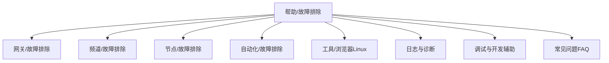

**图表来源**
- [故障排除（帮助）](file://docs/help/troubleshooting.md#L1-L297)
- [网关故障排除](file://docs/gateway/troubleshooting.md#L1-L367)
- [频道故障排除](file://docs/channels/troubleshooting.md#L1-L118)
- [节点故障排除](file://docs/nodes/troubleshooting.md#L1-L115)
- [自动化故障排除](file://docs/automation/troubleshooting.md#L1-L123)
- [浏览器故障排除（Linux）](file://docs/tools/browser-linux-troubleshooting.md#L1-L140)
- [日志与诊断](file://docs/logging.md#L1-L353)
- [调试与开发辅助](file://docs/help/debugging.md#L1-L163)
- [常见问题（FAQ）](file://docs/help/faq.md#L1-L800)

**章节来源**
- [故障排除（帮助）](file://docs/help/troubleshooting.md#L1-L297)

## 核心组件
- 命令行诊断阶梯：通过一系列标准命令快速判断健康状态，如状态检查、网关探测、医生检查、通道探测、日志跟踪等。
- 日志系统：文件日志（JSON Lines）与控制界面日志，支持级别调整、格式切换与敏感信息脱敏。
- 调试工具：开发者模式、原始流日志、原始块日志、调试覆盖开关等，用于深入分析推理泄漏与流式输出。
- 领域专项手册：网关、频道、节点、自动化、浏览器等模块的故障排除清单与修复步骤。

**章节来源**
- [故障排除（帮助）](file://docs/help/troubleshooting.md#L13-L36)
- [日志与诊断](file://docs/logging.md#L10-L124)
- [调试与开发辅助](file://docs/help/debugging.md#L10-L163)

## 架构总览
下图展示从用户到 CLI、网关、通道与外部服务的交互路径，以及日志与诊断在其中的位置。

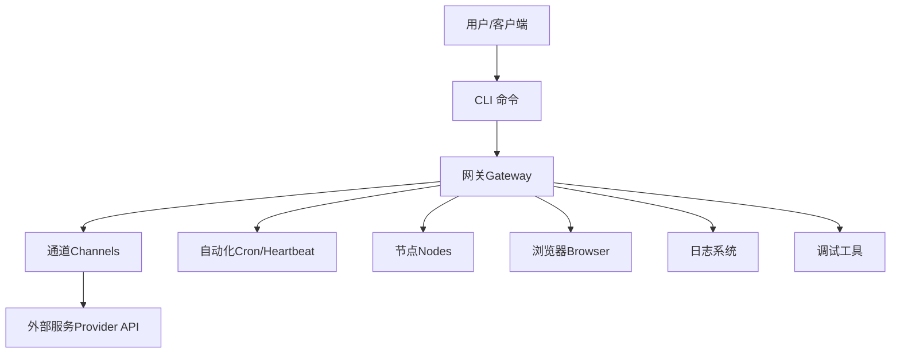

**图表来源**
- [网关故障排除](file://docs/gateway/troubleshooting.md#L14-L31)
- [日志与诊断](file://docs/logging.md#L10-L124)
- [调试与开发辅助](file://docs/help/debugging.md#L10-L163)

## 详细组件分析

### 症状导向诊断流程
- 快速三分钟流程：先用状态、网关探测、医生、通道探测与日志跟踪确认基本健康状况。
- 决策树：根据“最先出现的故障表现”选择对应子流程（无回复、控制界面无法连接、网关不启动、通道连通但消息不流动、自动化未触发、节点工具失败、浏览器工具失败）。

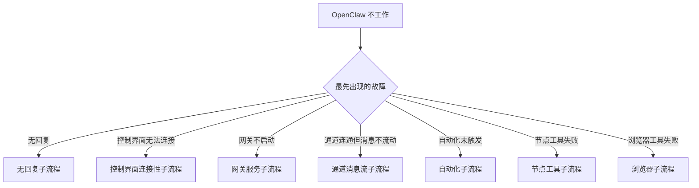

**图表来源**
- [故障排除（帮助）](file://docs/help/troubleshooting.md#L68-L88)

**章节来源**
- [故障排除（帮助）](file://docs/help/troubleshooting.md#L68-L88)

### 网关（Gateway）
- 健康检查顺序：状态、网关状态、日志跟踪、医生、通道探测。
- 常见信号：运行态、RPC 探针、端口绑定与鉴权、升级后配置漂移、设备身份与配对状态。
- 修复要点：本地模式开关、URL 与鉴权一致性、严格绑定与鉴权策略、重新安装服务元数据。

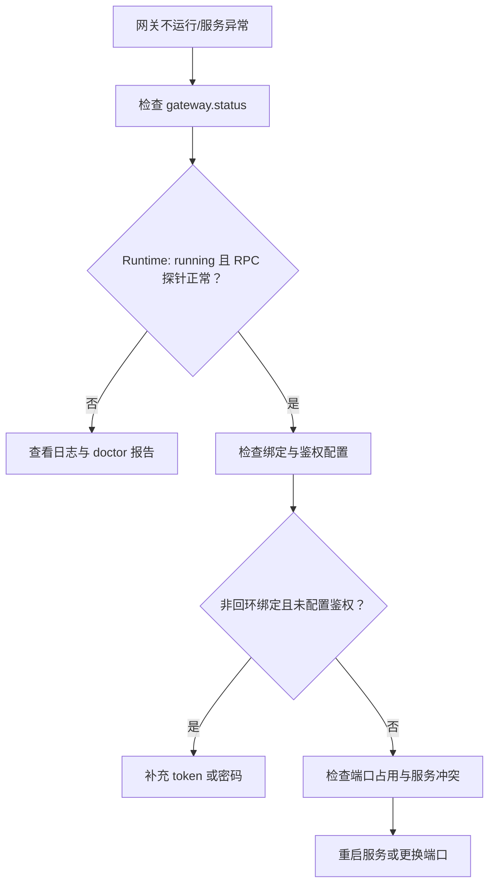

**图表来源**
- [网关故障排除](file://docs/gateway/troubleshooting.md#L14-L31)
- [网关故障排除](file://docs/gateway/troubleshooting.md#L139-L168)

**章节来源**
- [网关故障排除](file://docs/gateway/troubleshooting.md#L14-L31)
- [网关故障排除](file://docs/gateway/troubleshooting.md#L139-L168)

### 频道（Channels）
- 健康基线：运行态、RPC 探针、通道探测显示已连接/就绪。
- 典型问题域：WhatsApp、Telegram、Discord、Slack、iMessage/BlueBubbles、Signal、Matrix。
- 失败信号与修复：提及要求、允许列表、权限缺失、隐私模式、网络路由、升级后的白名单变更。

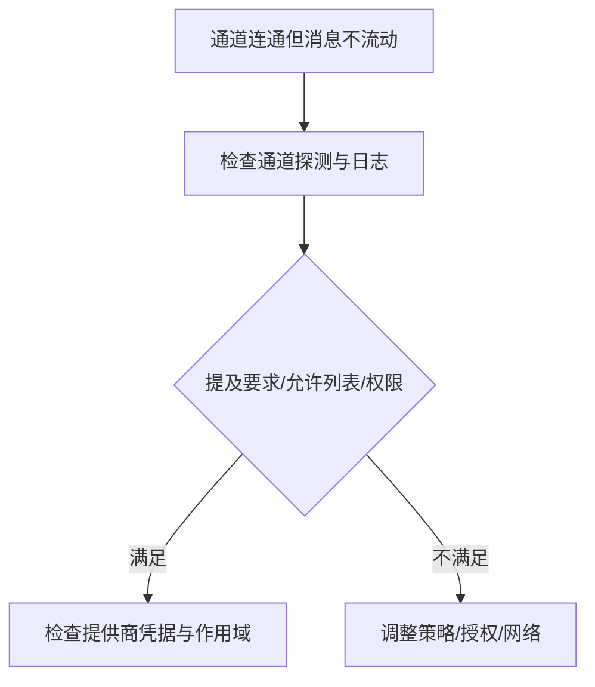

**图表来源**
- [频道故障排除](file://docs/channels/troubleshooting.md#L13-L30)
- [频道故障排除](file://docs/channels/troubleshooting.md#L31-L118)

**章节来源**
- [频道故障排除](file://docs/channels/troubleshooting.md#L13-L30)
- [频道故障排除](file://docs/channels/troubleshooting.md#L31-L118)

### 节点（Nodes）
- 健康信号：节点在线且具备所需能力、执行审批状态正确。
- 前台限制：iOS/Android 的 canvas/screen/camera 需前台运行。
- 权限矩阵：相机、屏幕录制、位置、系统执行等权限与错误码。
- 配对与审批：设备配对与执行审批是两道不同的门。

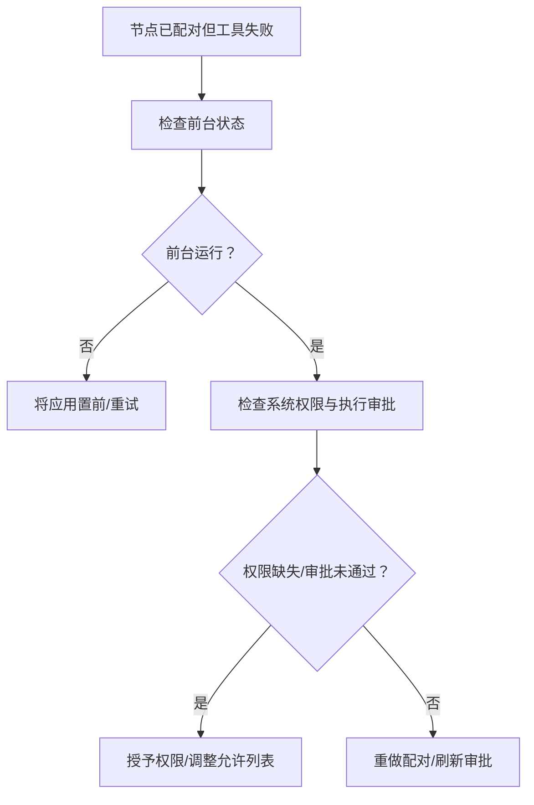

**图表来源**
- [节点故障排除](file://docs/nodes/troubleshooting.md#L13-L30)
- [节点故障排除](file://docs/nodes/troubleshooting.md#L37-L50)
- [节点故障排除](file://docs/nodes/troubleshooting.md#L51-L91)

**章节来源**
- [节点故障排除](file://docs/nodes/troubleshooting.md#L13-L30)
- [节点故障排除](file://docs/nodes/troubleshooting.md#L37-L50)
- [节点故障排除](file://docs/nodes/troubleshooting.md#L51-L91)

### 自动化（Cron/Heartbeat）
- 健康检查：计划器启用与下次唤醒、作业运行历史、心跳跳过原因。
- 常见信号：调度器禁用、定时器失败、静默时段、队列繁忙、目标账户无效。
- 时间区与时钟：活动时段、用户时区、主机时区与 cron at 语义。

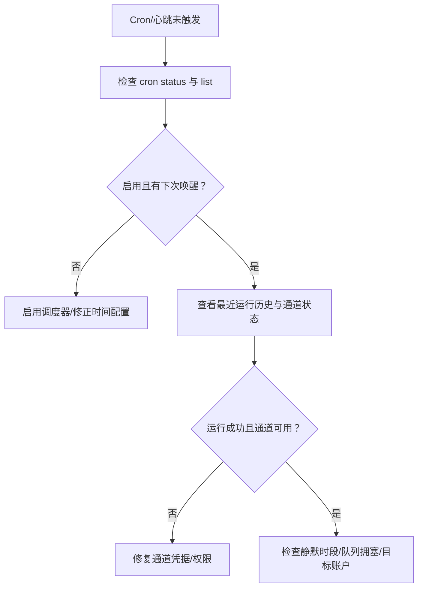

**图表来源**
- [自动化故障排除](file://docs/automation/troubleshooting.md#L14-L31)
- [自动化故障排除](file://docs/automation/troubleshooting.md#L32-L73)
- [自动化故障排除](file://docs/automation/troubleshooting.md#L74-L94)

**章节来源**
- [自动化故障排除](file://docs/automation/troubleshooting.md#L14-L31)
- [自动化故障排除](file://docs/automation/troubleshooting.md#L32-L73)
- [自动化故障排除](file://docs/automation/troubleshooting.md#L74-L94)

### 浏览器工具（Linux）
- 常见问题：CDP 启动失败、扩展中继无标签连接、Snap 包干扰。
- 解决方案：安装官方 Chrome、使用 attach-only 模式手动启动、systemd 用户服务自启。
- 验证：通过 HTTP 接口查询运行状态与标签页。

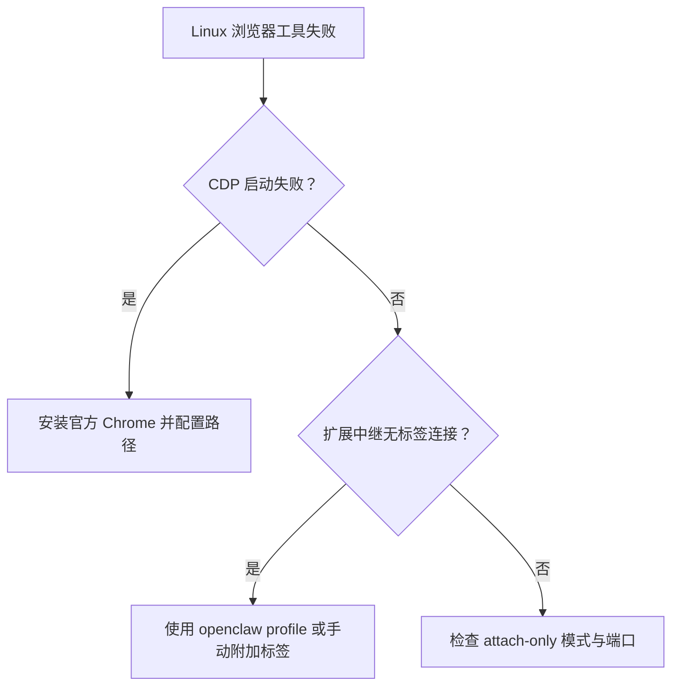

**图表来源**
- [浏览器故障排除（Linux）](file://docs/tools/browser-linux-troubleshooting.md#L9-L16)
- [浏览器故障排除（Linux）](file://docs/tools/browser-linux-troubleshooting.md#L30-L52)
- [浏览器故障排除（Linux）](file://docs/tools/browser-linux-troubleshooting.md#L53-L97)
- [浏览器故障排除（Linux）](file://docs/tools/browser-linux-troubleshooting.md#L124-L140)

**章节来源**
- [浏览器故障排除（Linux）](file://docs/tools/browser-linux-troubleshooting.md#L9-L16)
- [浏览器故障排除（Linux）](file://docs/tools/browser-linux-troubleshooting.md#L30-L52)
- [浏览器故障排除（Linux）](file://docs/tools/browser-linux-troubleshooting.md#L53-L97)
- [浏览器故障排除（Linux）](file://docs/tools/browser-linux-troubleshooting.md#L124-L140)

### 日志与诊断
- 日志位置：默认滚动文件位于临时目录，可通过配置覆盖；CLI 支持实时跟踪与多种输出模式。
- 控制界面：日志页签同样跟踪同一文件。
- 诊断事件：模型用量、消息流转、队列与会话状态等结构化事件，可导出至 OTLP 收集器。
- 安全提示：原始流日志可能包含完整提示词与用户数据，注意脱敏与删除。

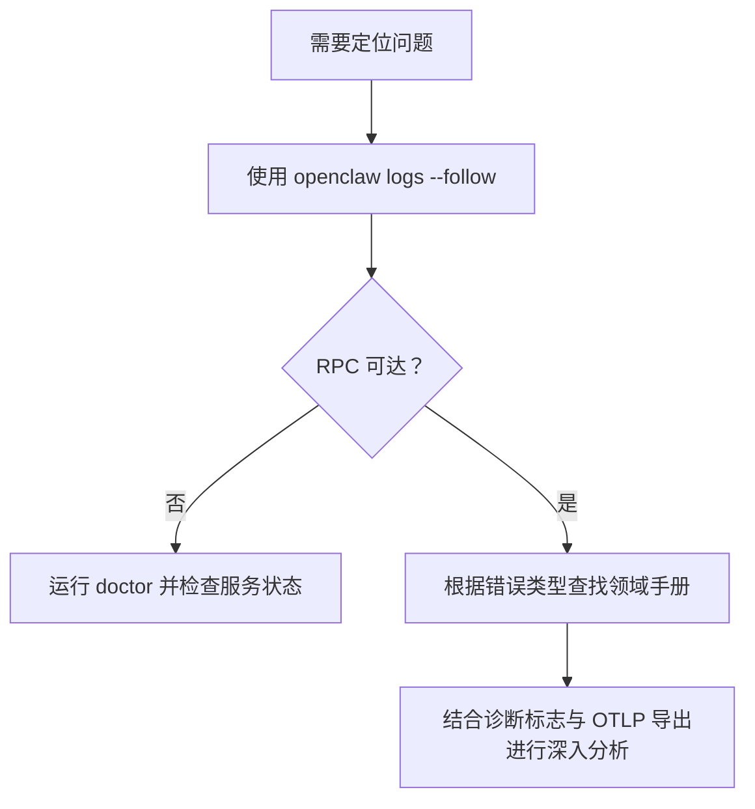

**图表来源**
- [日志与诊断](file://docs/logging.md#L40-L62)
- [日志与诊断](file://docs/logging.md#L142-L223)
- [日志与诊断](file://docs/logging.md#L224-L353)

**章节来源**
- [日志与诊断](file://docs/logging.md#L40-L62)
- [日志与诊断](file://docs/logging.md#L142-L223)
- [日志与诊断](file://docs/logging.md#L224-L353)

### 调试与开发辅助
- 运行时调试覆盖：/debug 命令临时覆盖配置，无需修改磁盘配置。
- 开发者模式：watch 模式与 dev 配置隔离，便于重复调试。
- 原始流日志：捕获原始助手流与 OpenAI 兼容块，用于分析推理泄漏。

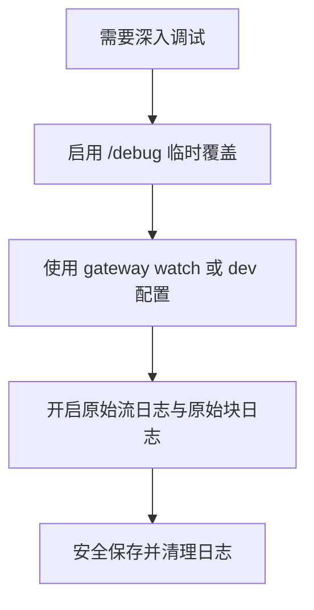

**图表来源**
- [调试与开发辅助](file://docs/help/debugging.md#L15-L31)
- [调试与开发辅助](file://docs/help/debugging.md#L32-L48)
- [调试与开发辅助](file://docs/help/debugging.md#L49-L97)
- [调试与开发辅助](file://docs/help/debugging.md#L107-L135)
- [调试与开发辅助](file://docs/help/debugging.md#L136-L157)

**章节来源**
- [调试与开发辅助](file://docs/help/debugging.md#L15-L31)
- [调试与开发辅助](file://docs/help/debugging.md#L32-L48)
- [调试与开发辅助](file://docs/help/debugging.md#L49-L97)
- [调试与开发辅助](file://docs/help/debugging.md#L107-L135)
- [调试与开发辅助](file://docs/help/debugging.md#L136-L157)

## 依赖关系分析
- 组件耦合：CLI 是入口，网关为核心协调者，通道、自动化、节点、浏览器围绕网关提供能力；日志与诊断贯穿各模块。
- 外部依赖：各通道对接外部 Provider API，浏览器依赖系统默认或指定二进制；OTLP 导出依赖外部收集器。
- 潜在循环：模块间通过 CLI 与网关交互，未见直接循环依赖。

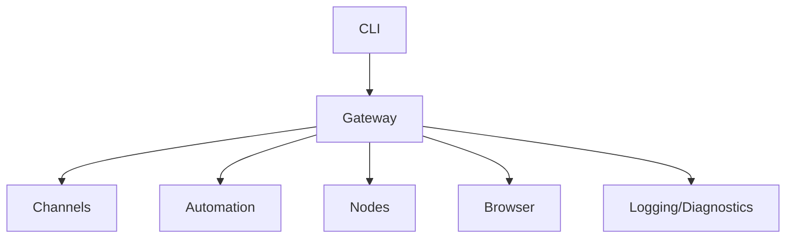

**图表来源**
- [故障排除（帮助）](file://docs/help/troubleshooting.md#L14-L24)
- [网关故障排除](file://docs/gateway/troubleshooting.md#L14-L24)
- [日志与诊断](file://docs/logging.md#L10-L124)

**章节来源**
- [故障排除（帮助）](file://docs/help/troubleshooting.md#L14-L24)
- [网关故障排除](file://docs/gateway/troubleshooting.md#L14-L24)
- [日志与诊断](file://docs/logging.md#L10-L124)

## 性能注意事项
- 日志级别与导出：在高负载场景建议降低文件日志级别或启用 OTLP 采样与过滤，避免日志写入成为瓶颈。
- 队列与会话：关注队列深度与等待时间指标，必要时调整并发与批处理策略。
- 模型用量：监控令牌用量与成本，合理设置降级与回退模型，减少长上下文请求失败带来的重试开销。

[本节为通用指导，无需特定文件引用]

## 故障排除指南

### 一、常见问题与解决路径

- 渠道连接问题
  - 症状：通道显示已连接但无回复或消息不流动。
  - 诊断命令：状态、网关状态、日志跟踪、医生、通道探测。
  - 信号与修复：提及要求、允许列表、权限缺失、隐私模式、网络路由、升级后白名单变更。
  - 参考：频道故障排除手册与各平台快速清单。

  **章节来源**
  - [频道故障排除](file://docs/channels/troubleshooting.md#L13-L30)
  - [频道故障排除](file://docs/channels/troubleshooting.md#L31-L118)

- 代理运行时异常
  - 症状：网关服务未启动、RPC 探测失败、端口被占用。
  - 诊断命令：状态、网关状态、日志跟踪、医生、网关深度状态。
  - 信号与修复：本地模式开关、URL/鉴权不一致、严格绑定与鉴权策略、端口冲突、重新安装服务元数据。
  - 参考：网关故障排除手册。

  **章节来源**
  - [网关故障排除](file://docs/gateway/troubleshooting.md#L14-L31)
  - [网关故障排除](file://docs/gateway/troubleshooting.md#L139-L168)

- 工具执行失败
  - 节点工具失败：前台不可用、系统权限缺失、执行审批未通过、允许列表阻断。
  - 浏览器工具失败（Linux）：CDP 启动失败、扩展中继无标签连接、Snap 干扰。
  - 诊断命令：节点状态/描述、审批查询、浏览器状态/启动、日志跟踪、医生。
  - 信号与修复：前台运行、授予权限、调整允许列表、安装官方浏览器、attach-only 模式。
  - 参考：节点与浏览器故障排除手册。

  **章节来源**
  - [节点故障排除](file://docs/nodes/troubleshooting.md#L13-L30)
  - [节点故障排除](file://docs/nodes/troubleshooting.md#L37-L50)
  - [节点故障排除](file://docs/nodes/troubleshooting.md#L51-L91)
  - [浏览器故障排除（Linux）](file://docs/tools/browser-linux-troubleshooting.md#L9-L16)
  - [浏览器故障排除（Linux）](file://docs/tools/browser-linux-troubleshooting.md#L30-L52)
  - [浏览器故障排除（Linux）](file://docs/tools/browser-linux-troubleshooting.md#L53-L97)
  - [浏览器故障排除（Linux）](file://docs/tools/browser-linux-troubleshooting.md#L124-L140)

- 性能问题
  - 症状：自动化延迟、心跳跳过、队列积压、日志写入高。
  - 诊断命令：状态、网关状态、日志跟踪、医生、通道探测、自动化状态。
  - 信号与修复：静默时段、队列拥塞、目标账户无效、时间区与时钟偏差、降级与回退模型。
  - 参考：自动化与日志诊断手册。

  **章节来源**
  - [自动化故障排除](file://docs/automation/troubleshooting.md#L14-L31)
  - [自动化故障排除](file://docs/automation/troubleshooting.md#L74-L94)
  - [日志与诊断](file://docs/logging.md#L142-L223)
  - [日志与诊断](file://docs/logging.md#L224-L353)

### 二、系统化调试方法
- 快速三分钟流程：状态、网关探测、医生、通道探测、日志跟踪。
- 深入诊断：使用 /debug 临时覆盖、watch 模式与 dev 配置、原始流日志与原始块日志。
- 日志分析：CLI 实时跟踪、控制界面日志页签、通道专用日志、OTLP 导出与采样。

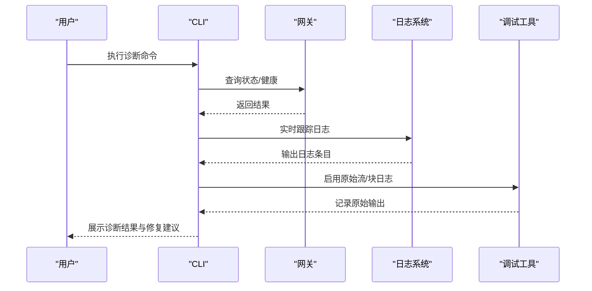

**图表来源**
- [故障排除（帮助）](file://docs/help/troubleshooting.md#L13-L36)
- [调试与开发辅助](file://docs/help/debugging.md#L107-L135)
- [日志与诊断](file://docs/logging.md#L40-L62)

**章节来源**
- [故障排除（帮助）](file://docs/help/troubleshooting.md#L13-L36)
- [调试与开发辅助](file://docs/help/debugging.md#L107-L135)
- [日志与诊断](file://docs/logging.md#L40-L62)

### 三、日志分析技巧与错误解读
- 文件日志（JSON Lines）：逐行解析，提取时间、级别、子系统、消息。
- 控制界面日志：与 CLI 同源，便于 Web 端查看。
- 敏感信息脱敏：控制台输出可配置脱敏策略，文件日志保持完整。
- 错误信号：设备身份、nonce/签名、unauthorized、gateway connect failed、mention required、pairing/pending、missing_scope、heartbeat skipped、NODE_BACKGROUND_UNAVAILABLE、*_PERMISSION_REQUIRED、SYSTEM_RUN_DENIED 等。

**章节来源**
- [日志与诊断](file://docs/logging.md#L82-L141)
- [网关故障排除](file://docs/gateway/troubleshooting.md#L91-L118)
- [网关故障排除](file://docs/gateway/troubleshooting.md#L169-L192)
- [自动化故障排除](file://docs/automation/troubleshooting.md#L74-L94)
- [节点故障排除](file://docs/nodes/troubleshooting.md#L79-L91)

### 四、FAQ 与常见问题
- 首 60 秒快速排查：状态、深探、日志跟踪、医生、快照。
- 安装与环境：Windows 路径与编码、Linux 发行版差异、Raspberry Pi 注意事项。
- 模型与配额：Anthropic 429 限额、订阅与 API Key 差异、回退模型配置。
- 远程访问与安全：Tailscale、SSH 隧道、设备身份与鉴权。
- 升级后异常：鉴权与 URL 行为变化、绑定与鉴权护栏、配对与设备身份状态。

**章节来源**
- [常见问题（FAQ）](file://docs/help/faq.md#L203-L267)
- [常见问题（FAQ）](file://docs/help/faq.md#L268-L316)
- [常见问题（FAQ）](file://docs/help/faq.md#L318-L387)
- [常见问题（FAQ）](file://docs/help/faq.md#L388-L438)
- [常见问题（FAQ）](file://docs/help/faq.md#L448-L457)
- [常见问题（FAQ）](file://docs/help/faq.md#L747-L763)
- [常见问题（FAQ）](file://docs/help/faq.md#L166-L176)

### 五、社区支持与问题报告
- 使用“可复现报告”：status --all 输出，含日志尾部（已脱敏）。
- 提交问题：在 GitHub Issues 中附带诊断输出与最小复现步骤。
- 社区资源：文档镜像、安装与更新指南、平台支持页面。

**章节来源**
- [常见问题（FAQ）](file://docs/help/faq.md#L294-L297)
- [常见问题（FAQ）](file://docs/help/faq.md#L298-L314)

## 结论
通过“症状—命令—信号—修复”的闭环流程，结合日志与诊断工具，大多数 OpenClaw 问题可在短时间内定位并解决。建议在日常运维中建立标准化的诊断阶梯与日志级别策略，并在升级前后进行配置一致性检查，以降低风险与恢复时间。

[本节为总结，无需特定文件引用]

## 附录

### A. 快速命令清单
- 基础诊断：status、gateway status、logs --follow、doctor、channels status --probe
- 网关专项：gateway status --deep、gateway install --force && restart
- 通道专项：channels status --probe、pairing list、config get channels
- 节点专项：nodes status、nodes describe、approvals get
- 自动化专项：cron status、cron list、cron runs、system heartbeat last
- 浏览器专项：browser status、browser start、browser profiles

**章节来源**
- [故障排除（帮助）](file://docs/help/troubleshooting.md#L17-L25)
- [网关故障排除](file://docs/gateway/troubleshooting.md#L14-L24)
- [频道故障排除](file://docs/channels/troubleshooting.md#L17-L23)
- [节点故障排除](file://docs/nodes/troubleshooting.md#L15-L29)
- [自动化故障排除](file://docs/automation/troubleshooting.md#L16-L30)
- [浏览器故障排除（Linux）](file://docs/tools/browser-linux-troubleshooting.md#L267-L292)

### B. 关键错误信号速查
- 设备身份与鉴权：device identity required、device nonce required/expired、device signature invalid/expired、unauthorized、gateway connect failed
- 通道与权限：mention required、pairing/pending、missing_scope/not_in_channel/Forbidden、401/403
- 自动化：scheduler disabled、timer tick failed、heartbeat skipped（quiet-hours/requests-in-flight）、unknown accountId
- 节点：NODE_BACKGROUND_UNAVAILABLE、*_PERMISSION_REQUIRED、LOCATION_PERMISSION_REQUIRED、SYSTEM_RUN_DENIED
- 浏览器：Failed to start Chrome CDP、browser.executablePath not found、Chrome extension relay is running but no tab is connected、attachOnly not reachable

**章节来源**
- [网关故障排除](file://docs/gateway/troubleshooting.md#L91-L118)
- [网关故障排除](file://docs/gateway/troubleshooting.md#L169-L192)
- [自动化故障排除](file://docs/automation/troubleshooting.md#L74-L94)
- [节点故障排除](file://docs/nodes/troubleshooting.md#L79-L91)
- [浏览器故障排除（Linux）](file://docs/tools/browser-linux-troubleshooting.md#L124-L140)