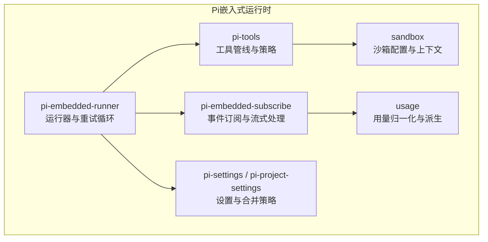
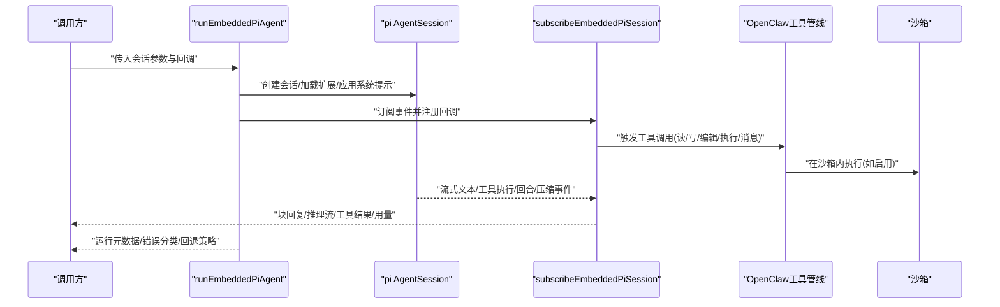
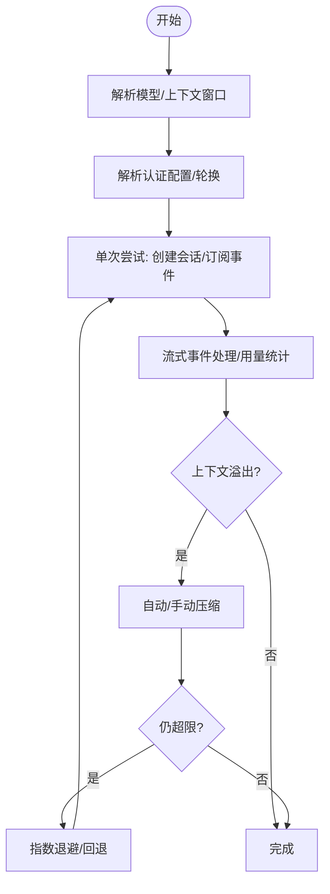
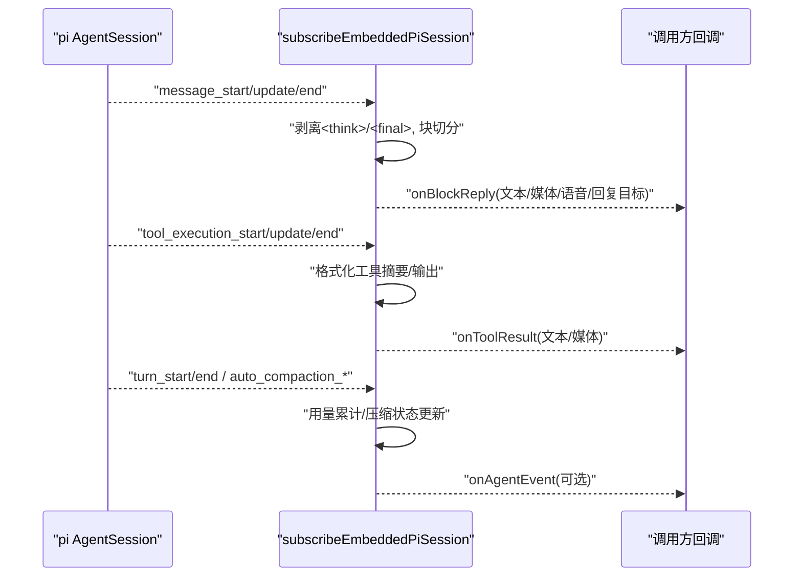
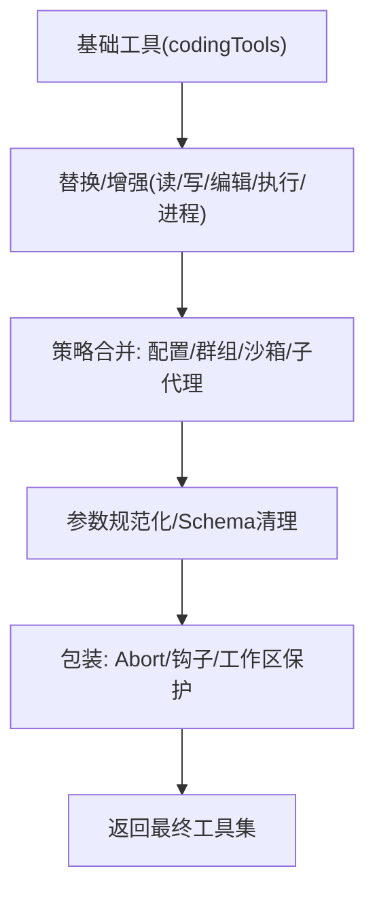
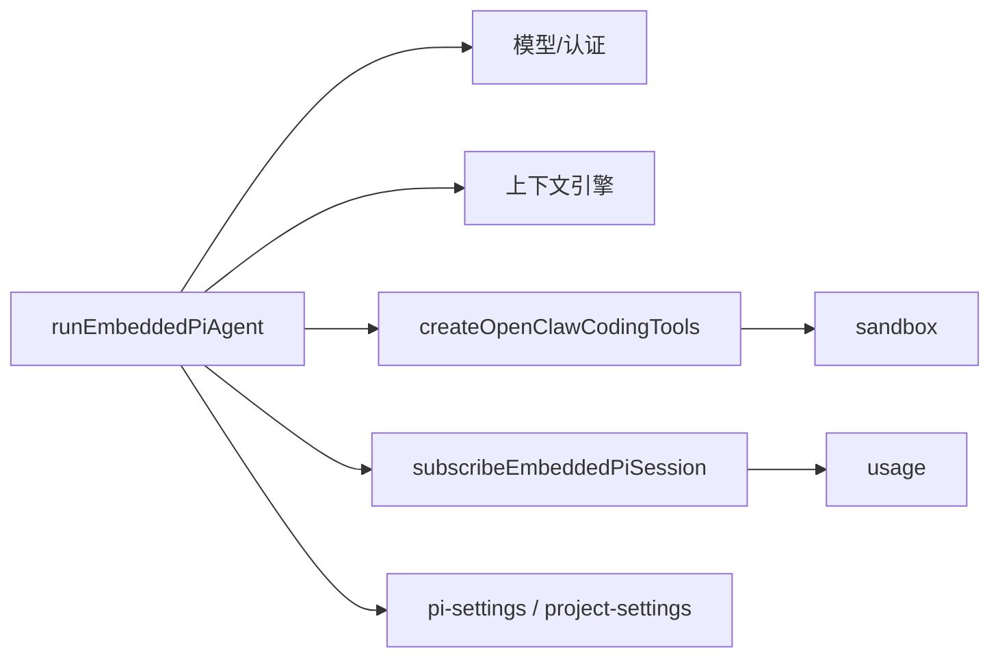

# Pi嵌入式运行时

<cite>
**本文引用的文件**
- [docs/pi.md](file://docs/pi.md)
- [src/agents/pi-embedded-runner/run.ts](file://src/agents/pi-embedded-runner/run.ts)
- [src/agents/pi-embedded-subscribe.ts](file://src/agents/pi-embedded-subscribe.ts)
- [src/agents/pi-embedded-runner/types.ts](file://src/agents/pi-embedded-runner/types.ts)
- [src/agents/sandbox.ts](file://src/agents/sandbox.ts)
- [src/agents/sandbox/config.ts](file://src/agents/sandbox/config.ts)
- [src/agents/pi-settings.ts](file://src/agents/pi-settings.ts)
- [src/agents/pi-project-settings.ts](file://src/agents/pi-project-settings.ts)
- [src/agents/pi-tools.ts](file://src/agents/pi-tools.ts)
- [src/agents/usage.ts](file://src/agents/usage.ts)
- [docs/platforms/raspberry-pi.md](file://docs/platforms/raspberry-pi.md)
</cite>

## 目录
1. [简介](#简介)
2. [项目结构](#项目结构)
3. [核心组件](#核心组件)
4. [架构总览](#架构总览)
5. [详细组件分析](#详细组件分析)
6. [依赖关系分析](#依赖关系分析)
7. [性能考量](#性能考量)
8. [故障排查指南](#故障排查指南)
9. [结论](#结论)
10. [附录](#附录)

## 简介
本文件系统化阐述 OpenClaw 的 Pi 嵌入式运行时：如何以“嵌入式”方式集成 pi SDK（而非子进程或 RPC），在网关中直接实例化并驱动 AgentSession；如何管理会话生命周期、事件订阅与消息分发；如何通过沙箱隔离与工具策略实现安全可控的执行环境；以及在树莓派等嵌入式设备上的部署与优化实践。文档面向开发者与运维人员，既提供代码级细节，也给出可操作的使用与排障建议。

## 项目结构
围绕 Pi 嵌入式运行时的关键目录与文件：
- 运行器与会话控制：pi-embedded-runner
- 事件订阅与流式输出：pi-embedded-subscribe
- 沙箱与工具体系：sandbox、pi-tools
- 设置与上下文：pi-settings、pi-project-settings
- 使用统计与用量：usage
- 平台部署参考：raspberry-pi

图示来源
- [src/agents/pi-embedded-runner/run.ts](file://src/agents/pi-embedded-runner/run.ts#L253-L800)
- [src/agents/pi-embedded-subscribe.ts](file://src/agents/pi-embedded-subscribe.ts#L34-L724)
- [src/agents/pi-tools.ts](file://src/agents/pi-tools.ts#L197-L574)
- [src/agents/sandbox/config.ts](file://src/agents/sandbox/config.ts#L170-L217)
- [src/agents/pi-settings.ts](file://src/agents/pi-settings.ts#L58-L123)
- [src/agents/usage.ts](file://src/agents/usage.ts#L88-L191)

章节来源
- [docs/pi.md](file://docs/pi.md#L42-L134)

## 核心组件
- 运行器 runEmbeddedPiAgent：负责模型解析、认证轮换、上下文窗口评估、重试与回退、自动压缩、用量统计与错误分类。
- 订阅器 subscribeEmbeddedPiSession：将 pi 的 AgentSession 事件映射为 OpenClaw 的块回复、工具结果、推理流等回调。
- 工具管线 createOpenClawCodingTools：统一替换/增强基础工具，注入沙箱读写/编辑、执行/进程、消息通道工具，并按策略过滤与参数规范化。
- 沙箱 resolveSandboxConfigForAgent：解析容器镜像、网络、卷绑定、资源限制、浏览器桥接等，支持 per-session/shared 等作用域。
- 设置与项目设置：SettingsManager 合并全局与项目设置，提供“信任/净化/忽略”策略，保障项目本地设置不破坏执行安全。
- 用量统计：normalizeUsage/derivePromptTokens 等，统一不同提供商的用量字段，派生 prompt 总量用于上下文展示。

章节来源
- [src/agents/pi-embedded-runner/run.ts](file://src/agents/pi-embedded-runner/run.ts#L253-L800)
- [src/agents/pi-embedded-subscribe.ts](file://src/agents/pi-embedded-subscribe.ts#L34-L724)
- [src/agents/pi-tools.ts](file://src/agents/pi-tools.ts#L197-L574)
- [src/agents/sandbox/config.ts](file://src/agents/sandbox/config.ts#L170-L217)
- [src/agents/pi-settings.ts](file://src/agents/pi-settings.ts#L58-L123)
- [src/agents/usage.ts](file://src/agents/usage.ts#L88-L191)

## 架构总览
Pi 嵌入式运行时采用“嵌入式 SDK 驱动 + 事件订阅 + 工具策略 + 沙箱隔离”的组合架构。运行器负责端到端编排，订阅器负责流式输出与去噪，工具管线负责安全可控的外部能力扩展，沙箱提供容器级隔离与资源约束，设置模块确保项目本地配置的安全合并。

图示来源
- [docs/pi.md](file://docs/pi.md#L135-L238)
- [src/agents/pi-embedded-runner/run.ts](file://src/agents/pi-embedded-runner/run.ts#L253-L800)
- [src/agents/pi-embedded-subscribe.ts](file://src/agents/pi-embedded-subscribe.ts#L34-L724)
- [src/agents/pi-tools.ts](file://src/agents/pi-tools.ts#L197-L574)

## 详细组件分析

### 运行器：runEmbeddedPiAgent
- 职责
  - 解析模型与上下文窗口，评估是否阻断或警告。
  - 多认证配置轮换与冷却，失败时触发回退与重试。
  - 统计用量并派生 prompt 总量，用于会话上下文展示。
  - 自动压缩与手动压缩协调，避免上下文溢出。
  - 错误分类与降级（如思维层级降级）。
- 关键流程
  - 重试上限与每档配置数线性扩展，避免无限重试。
  - Copilot Token 刷新与定时调度，保证授权稳定。
  - 上下文引擎接管时禁用 Pi 内部自动压缩，避免重复工作。
- 输出
  - 运行结果 payloads、元数据（含错误类别）、是否通过消息工具发送过、成功 cron 添加次数等。

图示来源
- [src/agents/pi-embedded-runner/run.ts](file://src/agents/pi-embedded-runner/run.ts#L253-L800)
- [src/agents/usage.ts](file://src/agents/usage.ts#L88-L191)

章节来源
- [src/agents/pi-embedded-runner/run.ts](file://src/agents/pi-embedded-runner/run.ts#L253-L800)
- [src/agents/pi-embedded-runner/types.ts](file://src/agents/pi-embedded-runner/types.ts#L57-L77)

### 订阅器：subscribeEmbeddedPiSession
- 职责
  - 将 pi 的 AgentSession 事件（消息/工具/回合/压缩）映射为 OpenClaw 的块回复、推理流、工具结果等。
  - 去噪与标签剥离（去除<think>/<final>等），提取媒体指令与语音指令。
  - 去重：基于消息工具已发送内容抑制重复块回复。
  - 用量聚合：累计 input/output/cache 用量，派生 total。
  - 压缩等待：在压缩进行时阻塞后续输出，保证一致性。
- 回调接口
  - onBlockReply、onReasoningStream、onToolResult、onAgentEvent 等。

图示来源
- [src/agents/pi-embedded-subscribe.ts](file://src/agents/pi-embedded-subscribe.ts#L34-L724)

章节来源
- [src/agents/pi-embedded-subscribe.ts](file://src/agents/pi-embedded-subscribe.ts#L34-L724)

### 工具管线：createOpenClawCodingTools
- 覆盖范围
  - 替换基础工具：读取/写入/编辑/执行/进程，注入 OpenClaw 特性（如 apply_patch、消息工具、浏览器桥接）。
  - 策略过滤：按配置、群组、沙箱、子代理深度等维度合并策略，形成最终允许集合。
  - 参数规范化：针对不同提供商（如 Gemini/OpenAI）清理/标准化工具 Schema。
  - 安全包装：AbortSignal、参数归一化、工作区根路径保护、宿主/沙箱执行差异。
- 与沙箱协作
  - 在启用沙箱时，读写/编辑/执行均走容器桥接，避免越权访问主机文件系统。

图示来源
- [src/agents/pi-tools.ts](file://src/agents/pi-tools.ts#L197-L574)

章节来源
- [src/agents/pi-tools.ts](file://src/agents/pi-tools.ts#L197-L574)

### 沙箱：resolveSandboxConfigForAgent
- 配置项
  - 模式/作用域/工作区访问权限/工作区根目录
  - Docker 镜像/网络/卷绑定/只读根/临时文件系统/资源限制/安全配置
  - 浏览器容器镜像/端口/自动启动/无头模式/桥接/主机控制
  - 清理策略（空闲/最大年龄）
- 与工具管线协作
  - 当启用沙箱时，读写/编辑/执行/浏览器均受限于容器与策略。

章节来源
- [src/agents/sandbox.ts](file://src/agents/sandbox.ts#L1-L45)
- [src/agents/sandbox/config.ts](file://src/agents/sandbox/config.ts#L170-L217)

### 设置与项目设置：SettingsManager 合并与策略
- 全局与项目设置合并，支持三种策略：
  - trusted：信任项目设置（谨慎使用）
  - sanitize：净化项目设置（默认），移除 shell 执行相关键
  - ignore：忽略项目设置，仅用全局
- 同步 OpenClaw 的压缩设置（保留令牌/最近保留令牌）到 Pi 设置管理器。

章节来源
- [src/agents/pi-project-settings.ts](file://src/agents/pi-project-settings.ts#L22-L75)
- [src/agents/pi-settings.ts](file://src/agents/pi-settings.ts#L58-L123)

### 用量统计：normalizeUsage/derivePromptTokens
- 归一化不同提供商的用量字段，派生 prompt 总量，用于会话上下文展示。
- 在多轮工具调用场景中，区分“最近一次调用缓存字段”与“累计输出”，避免高估上下文大小。

章节来源
- [src/agents/usage.ts](file://src/agents/usage.ts#L88-L191)

## 依赖关系分析
- 运行器依赖
  - 模型解析与认证：resolveModel、authStore、failover
  - 上下文引擎：ensureContextEnginesInitialized、resolveContextEngine
  - 工具管线：createOpenClawCodingTools
  - 订阅器：subscribeEmbeddedPiSession
  - 用量：normalizeUsage/derivePromptTokens
- 订阅器依赖
  - 工具管线输出
  - 设置与项目设置（决定是否剥离项目设置）
  - 用量统计
- 沙箱依赖
  - 配置解析与上下文创建
  - 工具管线在启用沙箱时切换执行路径

图示来源
- [src/agents/pi-embedded-runner/run.ts](file://src/agents/pi-embedded-runner/run.ts#L253-L800)
- [src/agents/pi-embedded-subscribe.ts](file://src/agents/pi-embedded-subscribe.ts#L34-L724)
- [src/agents/pi-tools.ts](file://src/agents/pi-tools.ts#L197-L574)
- [src/agents/sandbox/config.ts](file://src/agents/sandbox/config.ts#L170-L217)
- [src/agents/pi-settings.ts](file://src/agents/pi-settings.ts#L58-L123)
- [src/agents/usage.ts](file://src/agents/usage.ts#L88-L191)

章节来源
- [src/agents/pi-embedded-runner/run.ts](file://src/agents/pi-embedded-runner/run.ts#L253-L800)
- [src/agents/pi-embedded-subscribe.ts](file://src/agents/pi-embedded-subscribe.ts#L34-L724)
- [src/agents/pi-tools.ts](file://src/agents/pi-tools.ts#L197-L574)
- [src/agents/sandbox/config.ts](file://src/agents/sandbox/config.ts#L170-L217)
- [src/agents/pi-settings.ts](file://src/agents/pi-settings.ts#L58-L123)
- [src/agents/usage.ts](file://src/agents/usage.ts#L88-L191)

## 性能考量
- 上下文窗口与压缩
  - 通过上下文窗口评估与自动/手动压缩，避免频繁超限导致的重试风暴。
  - 在上下文引擎接管时禁用 Pi 内部自动压缩，减少重复工作。
- 用量统计与展示
  - 使用“最后一次调用缓存字段”派生 total，避免累计值误导上下文占用。
- 沙箱与容器
  - 合理设置只读根、临时文件系统、资源限制与 DNS/网络策略，降低容器开销。
- 设备侧优化（树莓派）
  - 使用 USB SSD、启用模块编译缓存、调整 systemd 启动策略、关闭不必要的服务、降低 GPU 内存分配等。

章节来源
- [src/agents/pi-embedded-runner/run.ts](file://src/agents/pi-embedded-runner/run.ts#L177-L203)
- [src/agents/pi-settings.ts](file://src/agents/pi-settings.ts#L108-L123)
- [docs/platforms/raspberry-pi.md](file://docs/platforms/raspberry-pi.md#L182-L242)

## 故障排查指南
- 常见错误分类
  - 上下文溢出、压缩失败、角色顺序问题、图像尺寸/维度错误、超时、配额/速率限制、鉴权失败等。
  - 对应处理：降级思维层级、触发压缩、回退到备用认证配置、指数退避后重试。
- 认证轮换与冷却
  - 若所有认证配置均处于冷却，根据错误类型推断失败原因并触发回退；必要时允许瞬时探测以判断瞬时不可用。
- Copilot Token 刷新
  - 在鉴权错误且为认证类失败时，尝试刷新 Token 并重新调度定时刷新。
- 订阅器稳定性
  - 压缩进行时阻塞输出，避免竞态；取消订阅时拒绝未完成等待并中止在途压缩，防止资源泄漏。

章节来源
- [src/agents/pi-embedded-runner/run.ts](file://src/agents/pi-embedded-runner/run.ts#L44-L105)
- [src/agents/pi-embedded-subscribe.ts](file://src/agents/pi-embedded-subscribe.ts#L644-L676)

## 结论
Pi 嵌入式运行时通过“嵌入式 SDK 驱动 + 事件订阅 + 工具策略 + 沙箱隔离 + 设置合并”的设计，在保持对会话生命周期与事件流完全控制的同时，提供了强大的安全性与可扩展性。结合上下文窗口治理、用量统计与压缩策略，可在资源受限的嵌入式设备（如树莓派）上稳定运行。建议在生产中启用沙箱、合理配置工具策略与压缩保留令牌，并利用用量指标持续优化上下文占用与响应质量。

## 附录

### 使用示例（概念性流程）
- 初始化运行器参数（会话标识、工作区、配置、提示、模型/供应商、回调等）。
- 调用 runEmbeddedPiAgent，等待返回 payloads 与元数据。
- 在订阅器回调中处理块回复、推理流与工具结果。
- 如遇上下文溢出，触发压缩或回退策略，必要时调整模型/提示。

章节来源
- [docs/pi.md](file://docs/pi.md#L135-L238)

### 配置要点（节选）
- 沙箱模式与作用域：mode/scope/workspaceAccess/workspaceRoot/docker/browser/prune。
- 项目设置策略：projectSettingsPolicy（trusted/sanitize/ignore）。
- 压缩设置：reserveTokens/keepRecentTokens 及其最小阈值。

章节来源
- [src/agents/sandbox/config.ts](file://src/agents/sandbox/config.ts#L170-L217)
- [src/agents/pi-project-settings.ts](file://src/agents/pi-project-settings.ts#L22-L75)
- [src/agents/pi-settings.ts](file://src/agents/pi-settings.ts#L58-L123)