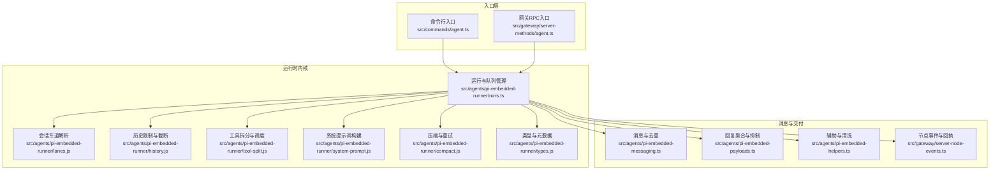
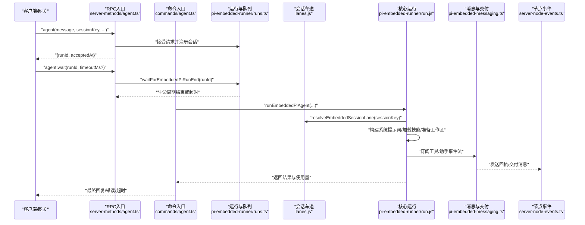
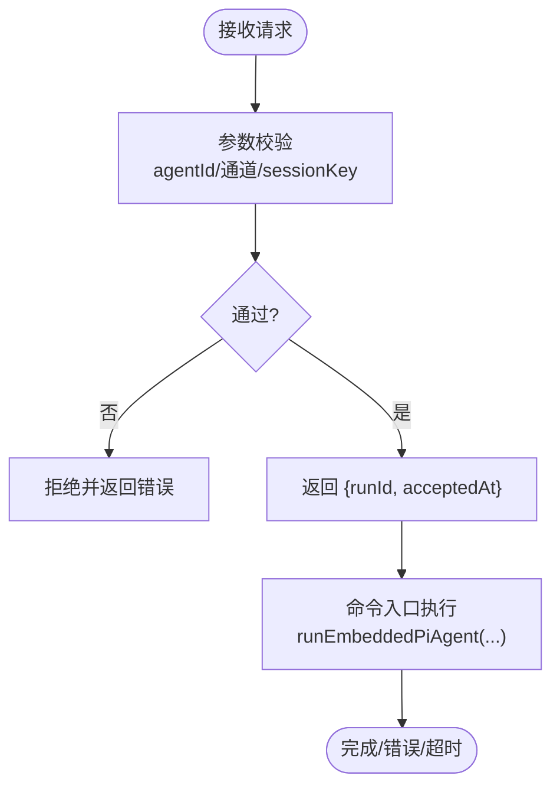
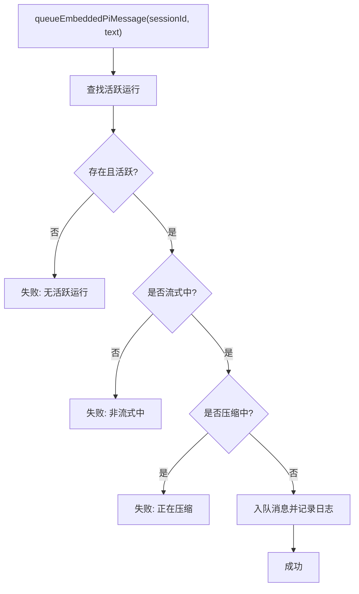
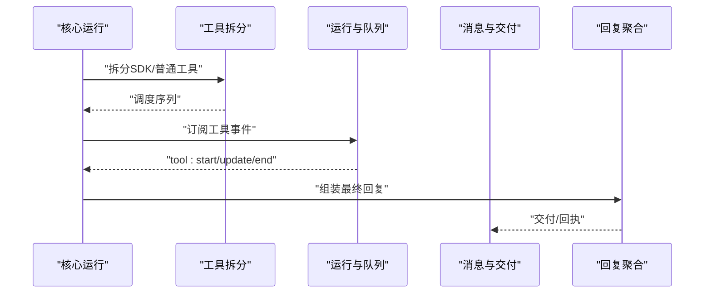
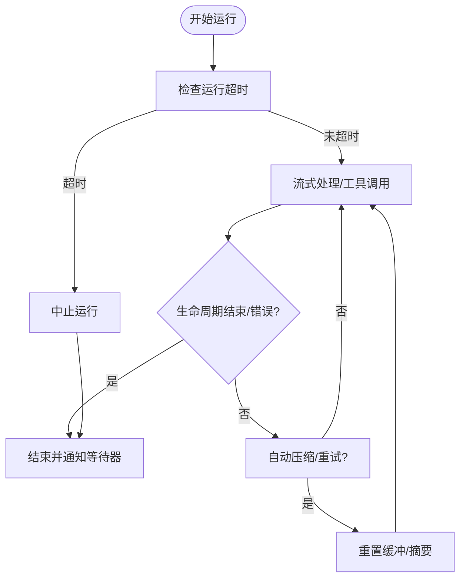
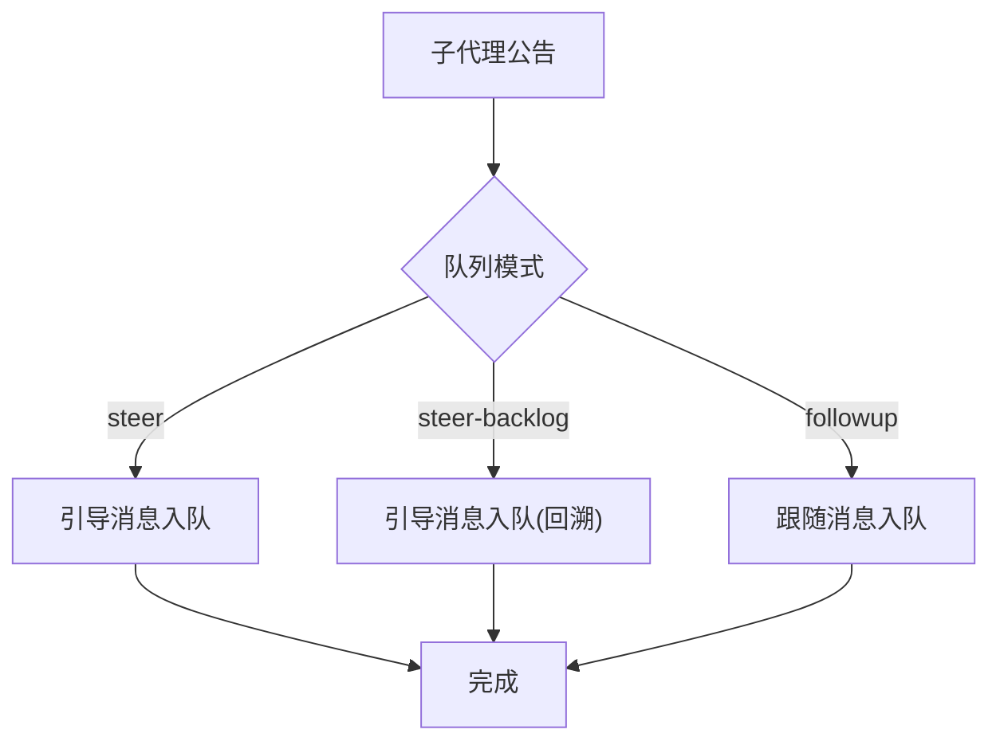
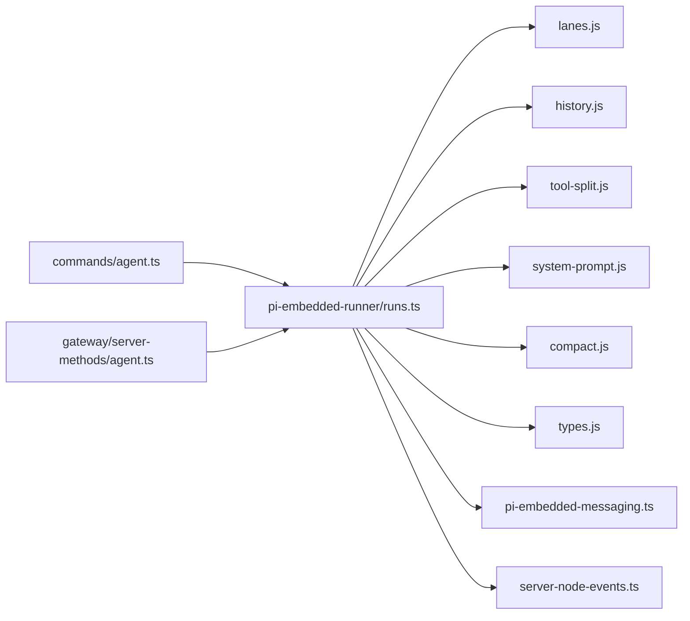

# 代理循环机制

<cite>
**本文引用的文件**
- [docs/concepts/agent-loop.md](file://docs/concepts/agent-loop.md)
- [src/agents/pi-embedded-runner.ts](file://src/agents/pi-embedded-runner.ts)
- [src/agents/pi-embedded-runner/runs.ts](file://src/agents/pi-embedded-runner/runs.ts)
- [src/agents/pi-embedded-runner/lanes.js](file://src/agents/pi-embedded-runner/lanes.js)
- [src/agents/pi-embedded-runner/history.js](file://src/agents/pi-embedded-runner/history.js)
- [src/agents/pi-embedded-runner/tool-split.js](file://src/agents/pi-embedded-runner/tool-split.js)
- [src/agents/pi-embedded-runner/system-prompt.js](file://src/agents/pi-embedded-runner/system-prompt.js)
- [src/agents/pi-embedded-runner/compact.js](file://src/agents/pi-embedded-runner/compact.js)
- [src/agents/pi-embedded-runner/types.js](file://src/agents/pi-embedded-runner/types.js)
- [src/agents/pi-embedded-messaging.ts](file://src/agents/pi-embedded-messaging.ts)
- [src/agents/pi-embedded-payloads.ts](file://src/agents/pi-embedded-payloads.ts)
- [src/agents/pi-embedded-helpers.ts](file://src/agents/pi-embedded-helpers.ts)
- [src/commands/agent.ts](file://src/commands/agent.ts)
- [src/gateway/server-methods/agent.ts](file://src/gateway/server-methods/agent.ts)
- [src/gateway/server-node-events.ts](file://src/gateway/server-node-events.ts)
- [src/gateway/server.sessions-send.test.ts](file://src/gateway/server.sessions-send.test.ts)
- [src/agents/openclaw-tools.sessions.test.ts](file://src/agents/openclaw-tools.sessions.test.ts)
- [apps/macos/Tests/OpenClawIPCTests/GatewayConnectionControlTests.swift](file://apps/macos/Tests/OpenClawIPCTests/GatewayConnectionControlTests.swift)
- [src/agents/subagent-announce.ts](file://src/agents/subagent-announce.ts)
- [src/agents/tool-loop-detection.ts](file://src/agents/tool-loop-detection.ts)
- [src/agents/agent-paths.ts](file://src/agents/agent-paths.ts)
</cite>

## 目录
1. [简介](#简介)
2. [项目结构](#项目结构)
3. [核心组件](#核心组件)
4. [架构总览](#架构总览)
5. [详细组件分析](#详细组件分析)
6. [依赖关系分析](#依赖关系分析)
7. [性能考量](#性能考量)
8. [故障排查指南](#故障排查指南)
9. [结论](#结论)
10. [附录](#附录)

## 简介
本文件系统性阐述 OpenClaw 的“代理循环（Agent Loop）”机制，覆盖从入口到收尾的完整生命周期：消息入站、会话准备、模型推理、工具调用、流式回复、持久化与收尾事件。重点说明：
- 启动流程与入口点（RPC 与 CLI）
- 消息处理循环与队列并发控制
- 工具调用序列与结果聚合
- 状态管理、错误恢复与超时处理
- 配置项与性能优化策略
- 调试方法与常见问题定位

## 项目结构
围绕代理循环的关键目录与文件：
- 文档与概念：docs/concepts/agent-loop.md
- 运行时与队列：src/agents/pi-embedded-runner/*
- 命令入口：src/commands/agent.ts
- 网关入口：src/gateway/server-methods/agent.ts
- 会话与消息：src/gateway/server-node-events.ts
- 测试与样例：src/gateway/server.sessions-send.test.ts、src/agents/openclaw-tools.sessions.test.ts、apps/macos/Tests/OpenClawIPCTests/GatewayConnectionControlTests.swift
- 子代理与抑制：src/agents/subagent-announce.ts、src/agents/tool-loop-detection.ts
- 辅助与路径：src/agents/agent-paths.ts

图表来源
- [src/commands/agent.ts](file://src/commands/agent.ts#L414-L1047)
- [src/gateway/server-methods/agent.ts](file://src/gateway/server-methods/agent.ts#L275-L290)
- [src/agents/pi-embedded-runner/runs.ts](file://src/agents/pi-embedded-runner/runs.ts#L1-L154)
- [src/agents/pi-embedded-runner/lanes.js](file://src/agents/pi-embedded-runner/lanes.js)
- [src/agents/pi-embedded-runner/history.js](file://src/agents/pi-embedded-runner/history.js)
- [src/agents/pi-embedded-runner/tool-split.js](file://src/agents/pi-embedded-runner/tool-split.js)
- [src/agents/pi-embedded-runner/system-prompt.js](file://src/agents/pi-embedded-runner/system-prompt.js)
- [src/agents/pi-embedded-runner/compact.js](file://src/agents/pi-embedded-runner/compact.js)
- [src/agents/pi-embedded-runner/types.js](file://src/agents/pi-embedded-runner/types.js)
- [src/agents/pi-embedded-messaging.ts](file://src/agents/pi-embedded-messaging.ts)
- [src/agents/pi-embedded-payloads.ts](file://src/agents/pi-embedded-payloads.ts)
- [src/agents/pi-embedded-helpers.ts](file://src/agents/pi-embedded-helpers.ts)
- [src/gateway/server-node-events.ts](file://src/gateway/server-node-events.ts#L397-L435)

章节来源
- [docs/concepts/agent-loop.md](file://docs/concepts/agent-loop.md#L1-L149)
- [src/agents/pi-embedded-runner.ts](file://src/agents/pi-embedded-runner.ts#L1-L29)

## 核心组件
- 运行与队列管理（runs.ts）
  - 维护活跃运行、等待器集合、消息入队、中止、等待结束、活跃计数等
  - 提供会话级并发控制与超时等待
- 会话车道（lanes.js）
  - 将 sessionKey 映射到会话车道，保证每会话串行执行
- 历史限制（history.js）
  - 基于会话键的历史轮次限制与截断
- 工具拆分（tool-split.js）
  - 将 SDK 工具与普通工具分离，按策略调度
- 系统提示词（system-prompt.js）
  - 构建系统提示词，注入技能与引导上下文
- 压缩与重试（compact.js）
  - 自动压缩与重试，避免重复输出
- 类型与元数据（types.js）
  - 定义嵌入式运行的元信息与结果类型
- 消息与交付（pi-embedded-messaging.ts、server-node-events.ts）
  - 工具事件与助手增量的流式传输；消息发送与回执
- 回复聚合与抑制（pi-embedded-payloads.ts、pi-embedded-helpers.ts）
  - 最终回复组装、去重、抑制与错误兜底
- 入口与命令（commands/agent.ts、gateway/server-methods/agent.ts）
  - RPC 与 CLI 的统一入口，参数校验与会话解析

章节来源
- [src/agents/pi-embedded-runner/runs.ts](file://src/agents/pi-embedded-runner/runs.ts#L1-L154)
- [src/agents/pi-embedded-runner/lanes.js](file://src/agents/pi-embedded-runner/lanes.js)
- [src/agents/pi-embedded-runner/history.js](file://src/agents/pi-embedded-runner/history.js)
- [src/agents/pi-embedded-runner/tool-split.js](file://src/agents/pi-embedded-runner/tool-split.js)
- [src/agents/pi-embedded-runner/system-prompt.js](file://src/agents/pi-embedded-runner/system-prompt.js)
- [src/agents/pi-embedded-runner/compact.js](file://src/agents/pi-embedded-runner/compact.js)
- [src/agents/pi-embedded-runner/types.js](file://src/agents/pi-embedded-runner/types.js)
- [src/agents/pi-embedded-messaging.ts](file://src/agents/pi-embedded-messaging.ts)
- [src/gateway/server-node-events.ts](file://src/gateway/server-node-events.ts#L397-L435)
- [src/agents/pi-embedded-payloads.ts](file://src/agents/pi-embedded-payloads.ts)
- [src/agents/pi-embedded-helpers.ts](file://src/agents/pi-embedded-helpers.ts)
- [src/commands/agent.ts](file://src/commands/agent.ts#L414-L1047)
- [src/gateway/server-methods/agent.ts](file://src/gateway/server-methods/agent.ts#L275-L290)

## 架构总览
代理循环以“单会话串行、全局可选并行”的方式组织，确保会话一致性与工具调用安全。

图表来源
- [src/gateway/server-methods/agent.ts](file://src/gateway/server-methods/agent.ts#L275-L290)
- [src/commands/agent.ts](file://src/commands/agent.ts#L414-L1047)
- [src/agents/pi-embedded-runner/runs.ts](file://src/agents/pi-embedded-runner/runs.ts#L71-L103)
- [src/agents/pi-embedded-runner/lanes.js](file://src/agents/pi-embedded-runner/lanes.js)
- [src/agents/pi-embedded-messaging.ts](file://src/agents/pi-embedded-messaging.ts)
- [src/gateway/server-node-events.ts](file://src/gateway/server-node-events.ts#L397-L435)

## 详细组件分析

### 启动流程与入口
- RPC 入口（网关）
  - 参数校验、agentId 与 sessionKey 匹配检查、未知通道拒绝
  - 返回 runId 与受理时间，随后由命令入口执行
- CLI 入口
  - 解析模型与思考/详细模式默认值，加载技能快照，调用嵌入式运行器
  - 若嵌入式循环未发出生命周期事件，则发出回退事件

图表来源
- [src/gateway/server-methods/agent.ts](file://src/gateway/server-methods/agent.ts#L275-L290)
- [src/commands/agent.ts](file://src/commands/agent.ts#L414-L1047)
- [docs/concepts/agent-loop.md](file://docs/concepts/agent-loop.md#L25-L36)

章节来源
- [src/gateway/server-methods/agent.ts](file://src/gateway/server-methods/agent.ts#L275-L290)
- [src/commands/agent.ts](file://src/commands/agent.ts#L414-L1047)
- [docs/concepts/agent-loop.md](file://docs/concepts/agent-loop.md#L18-L44)

### 消息处理循环与队列
- 会话串行化
  - 每个 sessionKey 对应一条“会话车道”，同一会话内的运行串行执行
  - 可选全局车道，用于跨会话的全局约束
- 运行注册与等待
  - 注册活跃运行、记录等待器、超时回调、结束通知
  - 支持中止与状态变更日志
- 消息入队
  - 仅在运行处于“流式中”且非“压缩中”时允许入队
  - 记录入队诊断日志

图表来源
- [src/agents/pi-embedded-runner/runs.ts](file://src/agents/pi-embedded-runner/runs.ts#L21-L38)

章节来源
- [src/agents/pi-embedded-runner/runs.ts](file://src/agents/pi-embedded-runner/runs.ts#L1-L154)
- [src/agents/pi-embedded-runner/lanes.js](file://src/agents/pi-embedded-runner/lanes.js)

### 工具调用序列与结果聚合
- 工具拆分与调度
  - 将 SDK 工具与普通工具分离，按策略调度，减少耦合
- 工具事件流
  - 工具开始/更新/结束事件通过“tool”流广播
- 结果聚合与抑制
  - 组装助手文本、推理文本、工具摘要
  - 去除重复消息与静默标记，必要时发出兜底工具错误回复

图表来源
- [src/agents/pi-embedded-runner/tool-split.js](file://src/agents/pi-embedded-runner/tool-split.js)
- [src/agents/pi-embedded-runner/runs.ts](file://src/agents/pi-embedded-runner/runs.ts#L71-L103)
- [src/agents/pi-embedded-messaging.ts](file://src/agents/pi-embedded-messaging.ts)
- [src/agents/pi-embedded-payloads.ts](file://src/agents/pi-embedded-payloads.ts)

章节来源
- [src/agents/pi-embedded-runner/tool-split.js](file://src/agents/pi-embedded-runner/tool-split.js)
- [src/agents/pi-embedded-payloads.ts](file://src/agents/pi-embedded-payloads.ts)
- [src/agents/pi-embedded-helpers.ts](file://src/agents/pi-embedded-helpers.ts)

### 状态管理、错误恢复与超时处理
- 状态管理
  - 运行注册/清除、活跃计数、状态变更日志
- 错误恢复
  - 自动压缩触发重试，重置内存缓冲与工具摘要，避免重复输出
- 超时处理
  - agent.wait 默认等待超时；运行器内置运行超时（默认 600 秒），超过后中止
  - 等待器超时回调返回 false，避免无限等待

图表来源
- [docs/concepts/agent-loop.md](file://docs/concepts/agent-loop.md#L138-L149)
- [src/agents/pi-embedded-runner/runs.ts](file://src/agents/pi-embedded-runner/runs.ts#L71-L103)
- [src/agents/pi-embedded-runner/compact.js](file://src/agents/pi-embedded-runner/compact.js)

章节来源
- [docs/concepts/agent-loop.md](file://docs/concepts/agent-loop.md#L138-L149)
- [src/agents/pi-embedded-runner/runs.ts](file://src/agents/pi-embedded-runner/runs.ts#L71-L103)
- [src/agents/pi-embedded-runner/compact.js](file://src/agents/pi-embedded-runner/compact.js)

### 子代理与抑制机制
- 子代理公告与引导
  - 根据队列设置决定“引导/排队/跳过”，将引导消息写入嵌入式会话
- 循环检测
  - 工具调用循环检测，防止重复触发与无限回路

图表来源
- [src/agents/subagent-announce.ts](file://src/agents/subagent-announce.ts#L658-L694)
- [src/agents/tool-loop-detection.ts](file://src/agents/tool-loop-detection.ts)

章节来源
- [src/agents/subagent-announce.ts](file://src/agents/subagent-announce.ts#L658-L694)
- [src/agents/tool-loop-detection.ts](file://src/agents/tool-loop-detection.ts)

### 会话与工作区准备
- 工作区解析与创建
  - 根据状态目录与默认代理 ID 解析代理目录，必要时注入环境变量
- 技能加载与注入
  - 加载技能快照并注入环境与提示词
- 引导文件与系统提示词
  - 引导文件在系统提示词最终化前构建，支持动态上下文注入

章节来源
- [src/agents/agent-paths.ts](file://src/agents/agent-paths.ts#L1-L26)
- [docs/concepts/agent-loop.md](file://docs/concepts/agent-loop.md#L52-L63)

### 交付与回执
- 交付路由
  - 当请求 deliver=true 且具备 channel/to 时启用交付；否则记录警告
- 回执
  - 需要回执时，向指定渠道发送确认文本，缺失路由则记录警告

章节来源
- [src/gateway/server-node-events.ts](file://src/gateway/server-node-events.ts#L397-L435)

## 依赖关系分析
- 入口依赖运行内核
  - CLI/RPC 入口依赖运行与队列模块，后者提供会话车道、历史限制、工具拆分、系统提示词、压缩与类型定义
- 运行内核内部耦合
  - runs.ts 作为中枢协调 lanes/history/tool-split/system-prompt/compact/types
- 消息与交付
  - 运行内核通过 pi-embedded-messaging.ts 与 server-node-events.ts 协作，完成事件流与交付

图表来源
- [src/commands/agent.ts](file://src/commands/agent.ts#L414-L1047)
- [src/gateway/server-methods/agent.ts](file://src/gateway/server-methods/agent.ts#L275-L290)
- [src/agents/pi-embedded-runner/runs.ts](file://src/agents/pi-embedded-runner/runs.ts#L1-L154)
- [src/agents/pi-embedded-runner/lanes.js](file://src/agents/pi-embedded-runner/lanes.js)
- [src/agents/pi-embedded-runner/history.js](file://src/agents/pi-embedded-runner/history.js)
- [src/agents/pi-embedded-runner/tool-split.js](file://src/agents/pi-embedded-runner/tool-split.js)
- [src/agents/pi-embedded-runner/system-prompt.js](file://src/agents/pi-embedded-runner/system-prompt.js)
- [src/agents/pi-embedded-runner/compact.js](file://src/agents/pi-embedded-runner/compact.js)
- [src/agents/pi-embedded-runner/types.js](file://src/agents/pi-embedded-runner/types.js)
- [src/agents/pi-embedded-messaging.ts](file://src/agents/pi-embedded-messaging.ts)
- [src/gateway/server-node-events.ts](file://src/gateway/server-node-events.ts#L397-L435)

## 性能考量
- 并发与串行
  - 每会话串行避免竞态与历史不一致；全局可选并行提升吞吐
- 压缩与重试
  - 自动压缩降低上下文开销，重试避免重复输出
- 流式输出
  - 助手增量与工具事件流式传输，缩短首字节延迟
- 超时与中止
  - 运行超时与等待超时双保险，防止资源泄漏

## 故障排查指南
- 空消息/无效通道
  - 网关侧对空消息与未知通道进行拒绝，检查请求体与通道配置
- 会话键不匹配
  - agentId 与 sessionKey 不一致会被拒绝，核对会话标识
- agent.wait 超时
  - 等待超时返回 false，检查运行是否卡住或被中止
- 交付失败
  - 缺失交付路由时记录警告，检查 channel/to 是否正确
- 子代理引导无效
  - steered/queued 判定失败时，检查队列模式与嵌入式会话状态

章节来源
- [apps/macos/Tests/OpenClawIPCTests/GatewayConnectionControlTests.swift](file://apps/macos/Tests/OpenClawIPCTests/GatewayConnectionControlTests.swift#L41-L59)
- [src/gateway/server-methods/agent.ts](file://src/gateway/server-methods/agent.ts#L275-L290)
- [src/agents/pi-embedded-runner/runs.ts](file://src/agents/pi-embedded-runner/runs.ts#L71-L103)
- [src/gateway/server-node-events.ts](file://src/gateway/server-node-events.ts#L414-L435)
- [src/agents/subagent-announce.ts](file://src/agents/subagent-announce.ts#L658-L694)

## 结论
OpenClaw 的代理循环以“会话串行、事件驱动、流式交付”为核心设计，结合运行队列、自动压缩与超时中止，形成稳定可靠的代理生命周期。通过统一入口、清晰的事件流与严格的会话一致性保障，开发者可在复杂场景下可靠地扩展工具链与消息处理逻辑。

## 附录
- 配置参考
  - 运行超时：agents.defaults.timeoutSeconds（默认 600 秒）
  - agent.wait 默认：30 秒（可通过 timeoutMs 覆盖）
- 关键测试用例参考
  - 网关回环发送与回复：gateway/server.sessions-send.test.ts
  - 会话工具调用与等待语义：agents/openclaw-tools.sessions.test.ts
  - 网关连接控制与空消息拒绝：macos 测试

章节来源
- [docs/concepts/agent-loop.md](file://docs/concepts/agent-loop.md#L138-L149)
- [src/gateway/server.sessions-send.test.ts](file://src/gateway/server.sessions-send.test.ts#L101-L140)
- [src/agents/openclaw-tools.sessions.test.ts](file://src/agents/openclaw-tools.sessions.test.ts#L512-L545)
- [apps/macos/Tests/OpenClawIPCTests/GatewayConnectionControlTests.swift](file://apps/macos/Tests/OpenClawIPCTests/GatewayConnectionControlTests.swift#L41-L59)