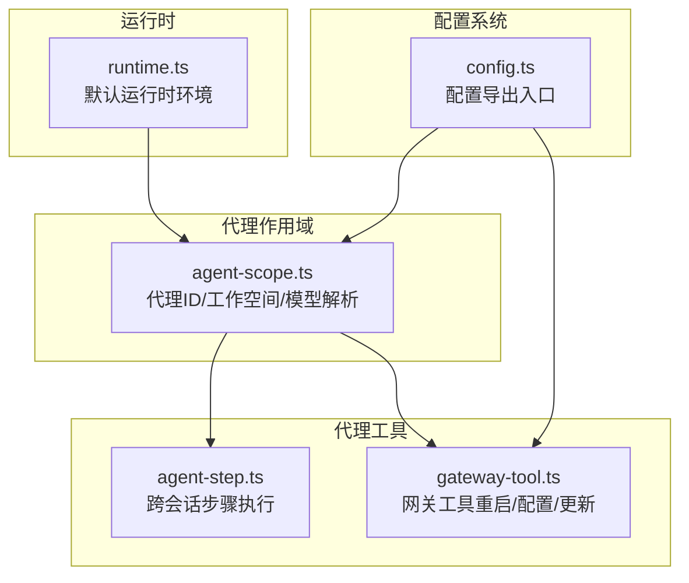
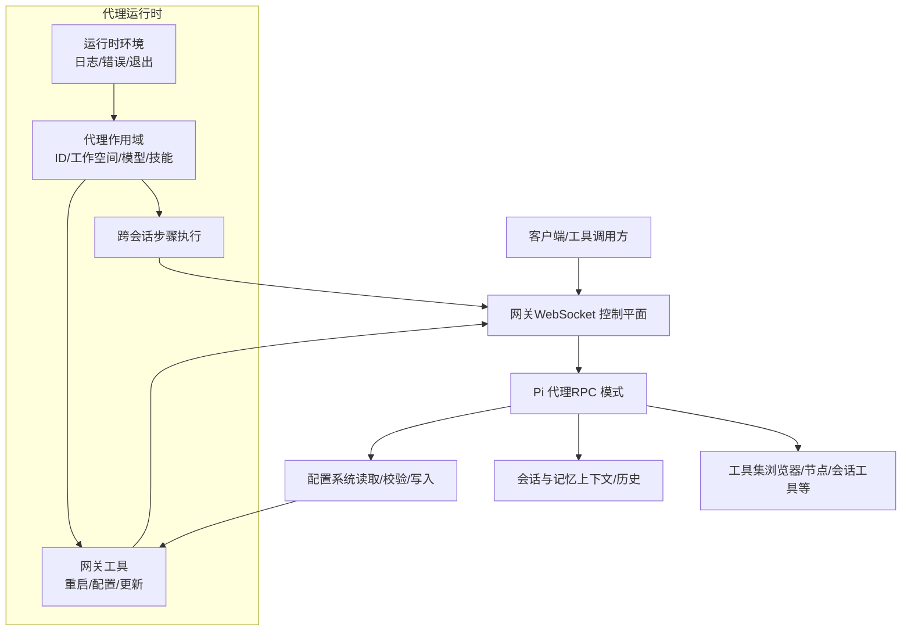
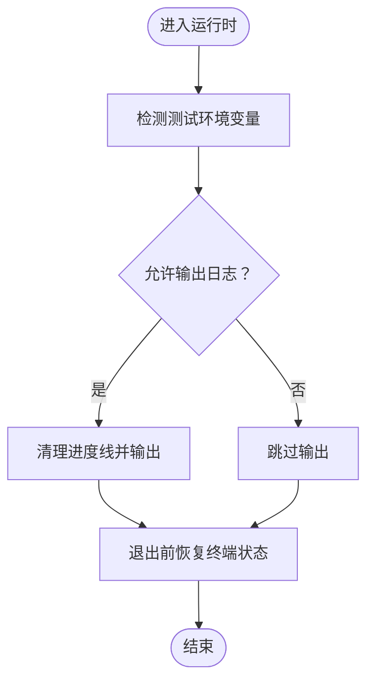
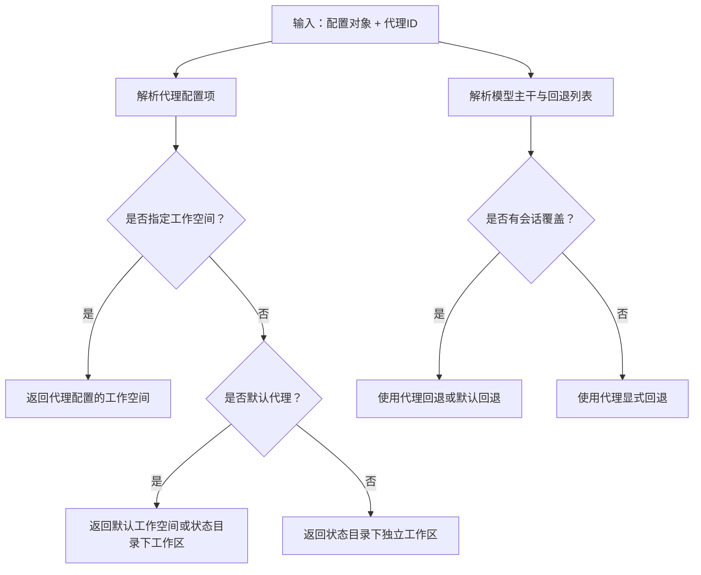
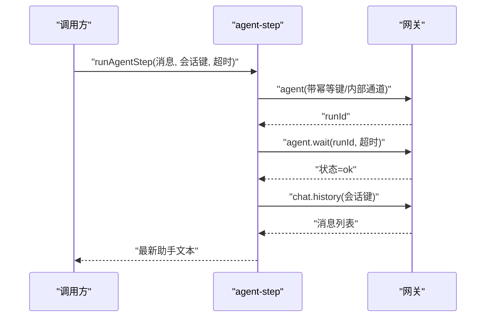
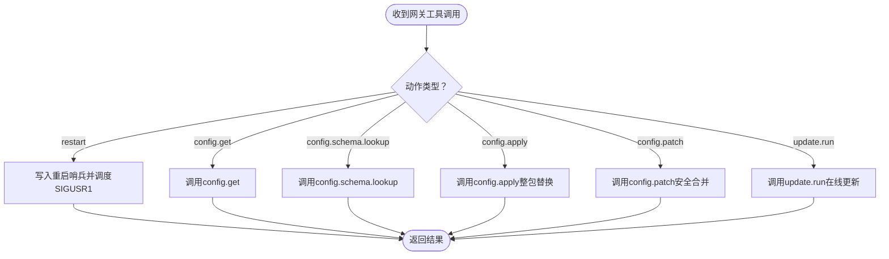
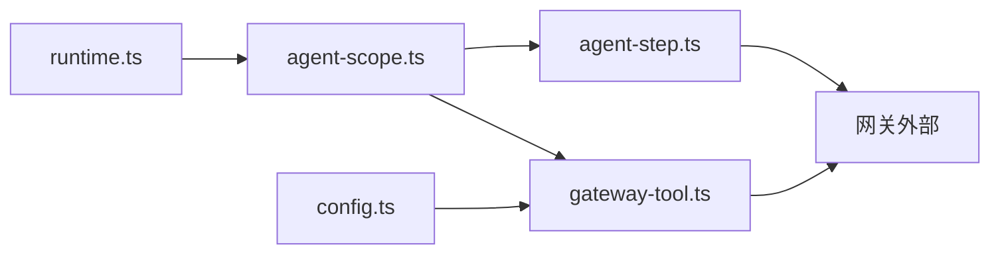

# 代理运行时

<cite>
**本文引用的文件**
- [README.md](file://README.md)
- [runtime.ts](file://src/runtime.ts)
- [agent-scope.ts](file://src/agents/agent-scope.ts)
- [agent-step.ts](file://src/agents/tools/agent-step.ts)
- [gateway-tool.ts](file://src/agents/tools/gateway-tool.ts)
- [config.ts](file://src/config/config.ts)
</cite>

## 目录
1. [简介](#简介)
2. [项目结构](#项目结构)
3. [核心组件](#核心组件)
4. [架构总览](#架构总览)
5. [详细组件分析](#详细组件分析)
6. [依赖关系分析](#依赖关系分析)
7. [性能考量](#性能考量)
8. [故障排查指南](#故障排查指南)
9. [结论](#结论)
10. [附录](#附录)

## 简介
本文件面向OpenClaw代理运行时系统，聚焦Pi代理运行时（Pi agent runtime）的设计与实现，系统性阐述以下主题：
- Pi代理运行时的设计原理与控制流
- 代理循环处理机制与消息通道模型
- 工具调用系统与跨会话协作
- 启动流程、状态管理与错误处理策略
- 嵌入式代理与沙箱机制、资源限制
- 配置选项、性能监控与调试工具
- 开发指南、最佳实践与常见问题解决方案

目标是帮助开发者快速掌握代理运行时的核心概念与实现细节，并通过具体代码路径定位到实现位置。

## 项目结构
OpenClaw采用多模块分层组织，代理运行时相关的关键目录与文件包括：
- 运行时基础设施：终端交互、日志输出、进程退出等
- 代理作用域与配置解析：代理ID解析、工作空间与模型选择、技能过滤
- 代理工具链：跨会话调用、网关工具（重启、配置读写、更新）
- 配置系统：加载、校验、快照与写入

图表来源
- [runtime.ts](file://src/runtime.ts#L1-L54)
- [agent-scope.ts](file://src/agents/agent-scope.ts#L1-L282)
- [agent-step.ts](file://src/agents/tools/agent-step.ts#L1-L81)
- [gateway-tool.ts](file://src/agents/tools/gateway-tool.ts#L1-L229)
- [config.ts](file://src/config/config.ts#L1-L24)

章节来源
- [README.md](file://README.md#L1-L560)
- [runtime.ts](file://src/runtime.ts#L1-L54)
- [agent-scope.ts](file://src/agents/agent-scope.ts#L1-L282)
- [agent-step.ts](file://src/agents/tools/agent-step.ts#L1-L81)
- [gateway-tool.ts](file://src/agents/tools/gateway-tool.ts#L1-L229)
- [config.ts](file://src/config/config.ts#L1-L24)

## 核心组件
- 运行时环境与日志输出
  - 提供统一的日志/错误输出接口，支持测试场景下的日志开关与非退出式退出封装
  - 参考路径：[运行时环境定义与默认实现](file://src/runtime.ts#L4-L54)

- 代理作用域与配置解析
  - 解析代理ID、默认代理、会话路由；解析工作空间、模型主干与回退列表；解析技能过滤
  - 参考路径：[代理作用域解析](file://src/agents/agent-scope.ts#L117-L144)、[工作空间解析](file://src/agents/agent-scope.ts#L255-L271)

- 跨会话代理步骤执行
  - 通过网关方法“agent”提交任务，使用“agent.wait”等待完成，再从会话历史中提取最新助手回复
  - 参考路径：[跨会话步骤执行](file://src/agents/tools/agent-step.ts#L33-L81)

- 网关工具（重启/配置/更新）
  - 支持重启（SIGUSR1）、读取配置、查找配置模式、应用/修补配置、在线更新（update.run）
  - 参考路径：[网关工具定义与执行](file://src/agents/tools/gateway-tool.ts#L70-L229)

- 配置系统
  - 导出配置加载、快照、校验、写入等能力，供代理与工具使用
  - 参考路径：[配置导出入口](file://src/config/config.ts#L1-L24)

章节来源
- [runtime.ts](file://src/runtime.ts#L1-L54)
- [agent-scope.ts](file://src/agents/agent-scope.ts#L117-L282)
- [agent-step.ts](file://src/agents/tools/agent-step.ts#L33-L81)
- [gateway-tool.ts](file://src/agents/tools/gateway-tool.ts#L70-L229)
- [config.ts](file://src/config/config.ts#L1-L24)

## 架构总览
Pi代理运行时以“网关（Gateway）”为中心，通过WebSocket控制平面承载会话、工具与事件。代理在运行时通过工具调用与网关交互，实现跨会话协作与系统级操作。

图表来源
- [README.md](file://README.md#L185-L202)
- [runtime.ts](file://src/runtime.ts#L1-L54)
- [agent-scope.ts](file://src/agents/agent-scope.ts#L1-L282)
- [agent-step.ts](file://src/agents/tools/agent-step.ts#L1-L81)
- [gateway-tool.ts](file://src/agents/tools/gateway-tool.ts#L1-L229)
- [config.ts](file://src/config/config.ts#L1-L24)

## 详细组件分析

### 组件A：运行时环境与日志输出
- 设计要点
  - 封装日志/错误输出，避免与进度线冲突
  - 在测试环境下可按需开启日志输出
  - 提供“非退出式”运行时用于测试断言
- 关键路径
  - [运行时环境定义](file://src/runtime.ts#L4-L19)
  - [日志/错误输出实现](file://src/runtime.ts#L21-L35)
  - [默认退出行为](file://src/runtime.ts#L37-L44)
  - [非退出式运行时](file://src/runtime.ts#L46-L54)

图表来源
- [runtime.ts](file://src/runtime.ts#L10-L44)

章节来源
- [runtime.ts](file://src/runtime.ts#L1-L54)

### 组件B：代理作用域与配置解析
- 设计要点
  - 代理ID解析与规范化，支持会话键解析
  - 工作空间解析：优先代理配置，其次默认配置，最后回退到状态目录
  - 模型主干与回退列表解析，支持显式覆盖与全局回退
  - 技能过滤标准化
- 关键路径
  - [代理ID解析与会话路由](file://src/agents/agent-scope.ts#L85-L110)
  - [工作空间解析](file://src/agents/agent-scope.ts#L255-L271)
  - [模型主干与回退解析](file://src/agents/agent-scope.ts#L169-L253)
  - [技能过滤解析](file://src/agents/agent-scope.ts#L146-L151)

图表来源
- [agent-scope.ts](file://src/agents/agent-scope.ts#L117-L282)

章节来源
- [agent-scope.ts](file://src/agents/agent-scope.ts#L1-L282)

### 组件C：跨会话代理步骤执行
- 设计要点
  - 使用“agent”方法提交任务，带幂等键与内部通道
  - 使用“agent.wait”等待完成，超时控制
  - 从会话历史中提取最新助手文本作为结果
- 关键路径
  - [读取最新助手回复](file://src/agents/tools/agent-step.ts#L7-L31)
  - [执行代理步骤并等待](file://src/agents/tools/agent-step.ts#L33-L81)

图表来源
- [agent-step.ts](file://src/agents/tools/agent-step.ts#L33-L81)

章节来源
- [agent-step.ts](file://src/agents/tools/agent-step.ts#L1-L81)

### 组件D：网关工具（重启/配置/更新）
- 设计要点
  - 动作枚举：restart、config.get、config.schema.lookup、config.apply、config.patch、update.run
  - 重启：写入重启哨兵，调度SIGUSR1重启
  - 配置：支持读取、查找模式、应用（整包替换）与修补（安全合并），均触发重启
  - 更新：在线更新（update.run），支持超时参数
- 关键路径
  - [动作定义与参数Schema](file://src/agents/tools/gateway-tool.ts#L34-L68)
  - [重启逻辑](file://src/agents/tools/gateway-tool.ts#L84-L132)
  - [配置读取/查找/应用/修补](file://src/agents/tools/gateway-tool.ts#L173-L208)
  - [在线更新](file://src/agents/tools/gateway-tool.ts#L209-L223)

图表来源
- [gateway-tool.ts](file://src/agents/tools/gateway-tool.ts#L34-L229)

章节来源
- [gateway-tool.ts](file://src/agents/tools/gateway-tool.ts#L1-L229)

### 组件E：配置系统（加载/校验/写入）
- 设计要点
  - 导出配置加载、快照、校验、写入等能力
  - 支持运行时覆盖与插件校验
- 关键路径
  - [配置导出入口](file://src/config/config.ts#L1-L24)

章节来源
- [config.ts](file://src/config/config.ts#L1-L24)

## 依赖关系分析
- 运行时对代理作用域的影响
  - 运行时负责日志与退出，代理作用域负责代理生命周期内的配置解析与工作空间管理
- 代理工具对网关的依赖
  - 跨会话步骤与网关工具均通过“callGateway”调用网关方法
- 配置系统对工具与代理的作用
  - 网关工具在写入配置后触发重启，确保新配置生效

图表来源
- [runtime.ts](file://src/runtime.ts#L1-L54)
- [agent-scope.ts](file://src/agents/agent-scope.ts#L1-L282)
- [agent-step.ts](file://src/agents/tools/agent-step.ts#L1-L81)
- [gateway-tool.ts](file://src/agents/tools/gateway-tool.ts#L1-L229)
- [config.ts](file://src/config/config.ts#L1-L24)

章节来源
- [runtime.ts](file://src/runtime.ts#L1-L54)
- [agent-scope.ts](file://src/agents/agent-scope.ts#L1-L282)
- [agent-step.ts](file://src/agents/tools/agent-step.ts#L1-L81)
- [gateway-tool.ts](file://src/agents/tools/gateway-tool.ts#L1-L229)
- [config.ts](file://src/config/config.ts#L1-L24)

## 性能考量
- 日志与终端交互
  - 运行时在输出日志前清理活动进度线，避免界面闪烁与重绘开销
  - 测试环境下可选择性开启日志，减少噪声
  - 参考：[日志输出与测试开关](file://src/runtime.ts#L10-L35)
- 跨会话步骤等待
  - 步骤等待超时上限与请求超时协同，避免长时间阻塞
  - 参考：[步骤等待与超时](file://src/agents/tools/agent-step.ts#L67-L75)
- 配置写入与重启
  - 配置应用/修补后触发重启，确保一致性；建议在批量变更时合并为一次重启
  - 参考：[配置写入与重启调度](file://src/agents/tools/gateway-tool.ts#L185-L208)

[本节为通用指导，不直接分析具体文件]

## 故障排查指南
- 运行时日志与退出
  - 若出现日志被吞掉或测试断言失败，检查测试环境变量与非退出式运行时的使用
  - 参考：[运行时日志与退出](file://src/runtime.ts#L10-L54)
- 跨会话步骤无响应
  - 检查“agent.wait”的返回状态与超时设置
  - 参考：[步骤等待与返回状态](file://src/agents/tools/agent-step.ts#L68-L78)
- 网关工具重启失败
  - 确认命令启用状态与重启调度是否成功
  - 参考：[重启逻辑与调度](file://src/agents/tools/gateway-tool.ts#L84-L132)
- 配置写入冲突
  - 确保提供正确的baseHash，避免并发写入冲突
  - 参考：[配置写入与baseHash解析](file://src/agents/tools/gateway-tool.ts#L160-L171)

章节来源
- [runtime.ts](file://src/runtime.ts#L10-L54)
- [agent-step.ts](file://src/agents/tools/agent-step.ts#L68-L78)
- [gateway-tool.ts](file://src/agents/tools/gateway-tool.ts#L84-L132)
- [gateway-tool.ts](file://src/agents/tools/gateway-tool.ts#L160-L171)

## 结论
Pi代理运行时围绕“网关控制平面 + 代理RPC + 工具链”的架构设计，通过运行时环境、代理作用域、跨会话步骤与网关工具形成闭环。其特性包括：
- 明确的消息通道与幂等键保障
- 严格的配置快照与回退策略
- 可观测的重启与更新机制
- 清晰的错误处理与测试友好设计

这些能力共同支撑了OpenClaw在多通道、多平台、多代理场景下的稳定运行与扩展能力。

[本节为总结性内容，不直接分析具体文件]

## 附录

### A. 代理启动与状态管理
- 启动流程
  - 通过网关控制平面启动代理实例，代理根据会话键解析代理ID与工作空间
  - 参考：[代理ID解析与会话路由](file://src/agents/agent-scope.ts#L85-L110)
- 状态管理
  - 使用“agent.wait”进行步骤级状态轮询，结合“chat.history”提取最新回复
  - 参考：[步骤等待与历史读取](file://src/agents/tools/agent-step.ts#L33-L81)

章节来源
- [agent-scope.ts](file://src/agents/agent-scope.ts#L85-L110)
- [agent-step.ts](file://src/agents/tools/agent-step.ts#L33-L81)

### B. 工具调用系统与跨会话协作
- 工具调用
  - 通过“agent”方法提交任务，使用“agent.wait”等待完成
  - 参考：[跨会话步骤执行](file://src/agents/tools/agent-step.ts#L33-L81)
- 跨会话协作
  - 使用“sessions_*”工具族进行会话间通信与协调
  - 参考：[README中的会话工具说明](file://README.md#L255-L262)

章节来源
- [agent-step.ts](file://src/agents/tools/agent-step.ts#L33-L81)
- [README.md](file://README.md#L255-L262)

### C. 嵌入式代理与沙箱机制
- 嵌入式代理
  - 代理在网关控制平面内以RPC模式运行，工具通过网关方法调用
  - 参考：[README中的Pi代理说明](file://README.md#L147-L148)
- 沙箱机制与资源限制
  - 非主会话（群组/频道）可启用Docker沙箱，默认工具白名单与黑名单
  - 参考：[README中的沙箱与安全模型](file://README.md#L332-L338)

章节来源
- [README.md](file://README.md#L147-L148)
- [README.md](file://README.md#L332-L338)

### D. 代理配置选项与性能监控
- 配置选项
  - 代理模型、工作空间、技能、心跳、身份、子代理、沙箱、工具等
  - 参考：[代理配置解析](file://src/agents/agent-scope.ts#L117-L144)
- 性能监控
  - 使用“/usage”等聊天命令查看用量与成本
  - 参考：[README中的聊天命令](file://README.md#L270-L282)

章节来源
- [agent-scope.ts](file://src/agents/agent-scope.ts#L117-L144)
- [README.md](file://README.md#L270-L282)

### E. 调试工具与最佳实践
- 调试工具
  - 使用“/status”、“/usage”等命令查看状态与用量
  - 参考：[README中的聊天命令](file://README.md#L270-L282)
- 最佳实践
  - 批量配置变更时先“config.schema.lookup”，再“config.patch”
  - 使用“agent.wait”设置合理超时，避免阻塞
  - 参考：[网关工具与步骤等待](file://src/agents/tools/gateway-tool.ts#L177-L208)、[步骤等待与超时](file://src/agents/tools/agent-step.ts#L67-L75)

章节来源
- [README.md](file://README.md#L270-L282)
- [gateway-tool.ts](file://src/agents/tools/gateway-tool.ts#L177-L208)
- [agent-step.ts](file://src/agents/tools/agent-step.ts#L67-L75)