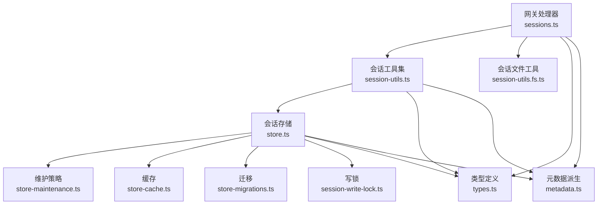
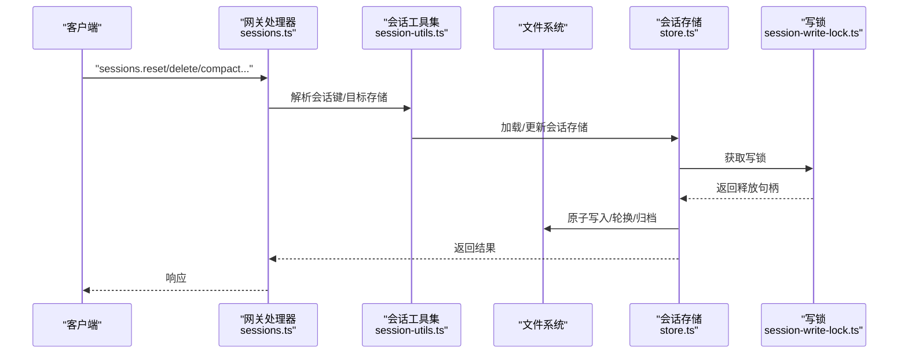
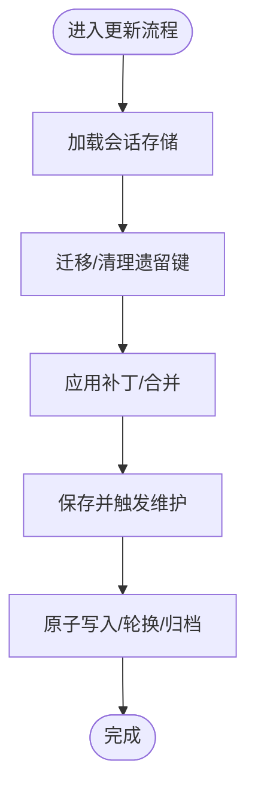
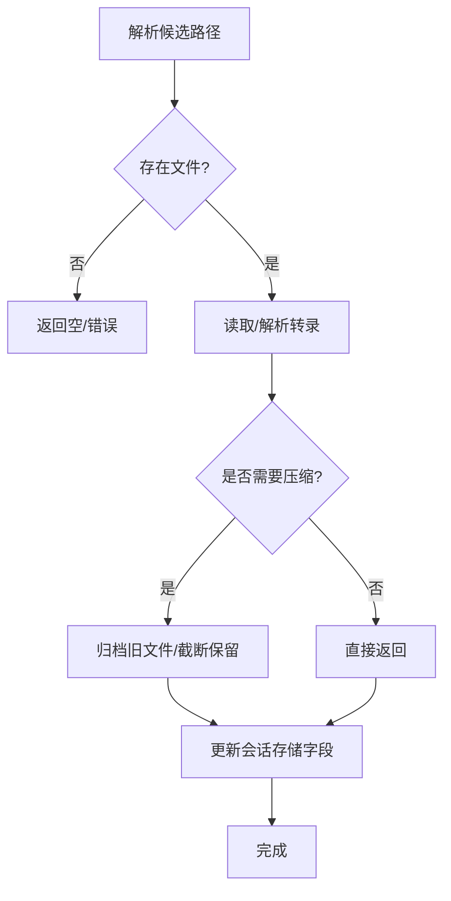
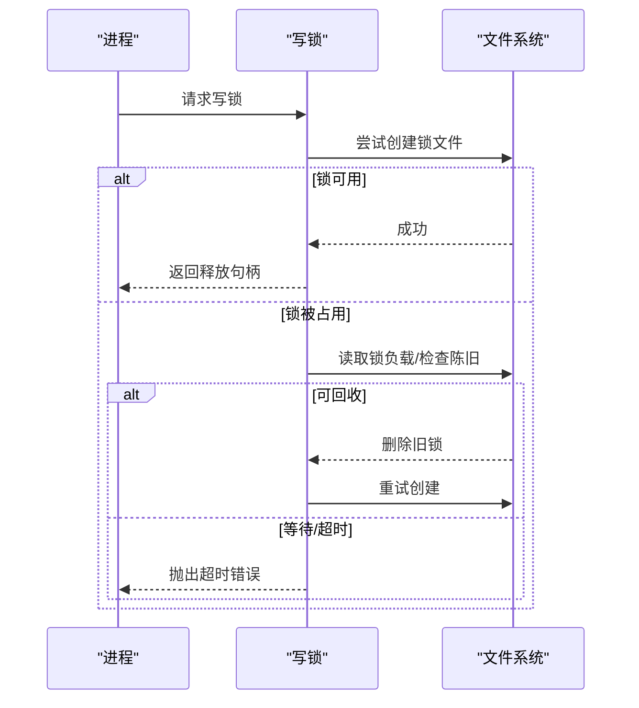
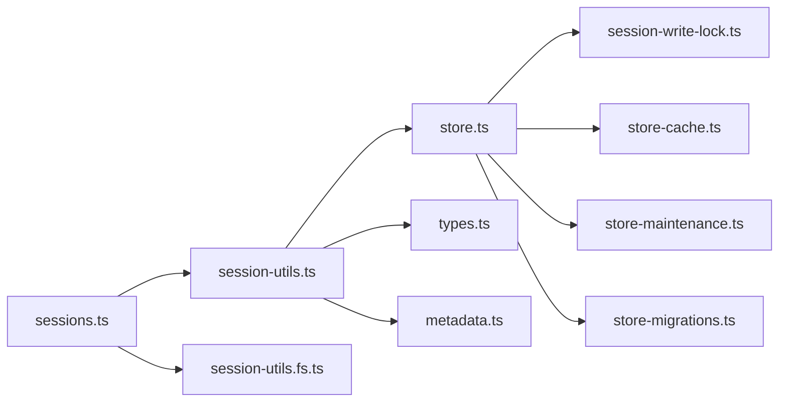

# 会话管理

<cite>
**本文引用的文件**
- [src/gateway/server-methods/sessions.ts](file://src/gateway/server-methods/sessions.ts)
- [src/gateway/session-utils.ts](file://src/gateway/session-utils.ts)
- [src/gateway/session-utils.fs.ts](file://src/gateway/session-utils.fs.ts)
- [src/config/sessions/store.ts](file://src/config/sessions/store.ts)
- [src/config/sessions/types.ts](file://src/config/sessions/types.ts)
- [src/config/sessions/store-maintenance.ts](file://src/config/sessions/store-maintenance.ts)
- [src/config/sessions/store-cache.ts](file://src/config/sessions/store-cache.ts)
- [src/config/sessions/store-migrations.ts](file://src/config/sessions/store-migrations.ts)
- [src/config/sessions/metadata.ts](file://src/config/sessions/metadata.ts)
- [src/agents/session-write-lock.ts](file://src/agents/session-write-lock.ts)
- [src/config/types.base.ts](file://src/config/types.base.ts)
</cite>

## 目录
1. [简介](#简介)
2. [项目结构](#项目结构)
3. [核心组件](#核心组件)
4. [架构总览](#架构总览)
5. [详细组件分析](#详细组件分析)
6. [依赖关系分析](#依赖关系分析)
7. [性能考量](#性能考量)
8. [故障排除指南](#故障排除指南)
9. [结论](#结论)
10. [附录](#附录)

## 简介
本文件系统性阐述 OpenClaw 会话管理系统的实现与使用方法，覆盖会话创建、状态维护、历史记录管理、转录存储与修复、压缩策略、会话锁与并发控制、数据一致性保障、配置选项、清理与归档、备份与恢复、最佳实践与性能优化等主题。目标是帮助开发者高效管理代理会话生命周期，并在多平台、多通道环境下保持稳定与可维护性。

## 项目结构
OpenClaw 的会话管理由“网关层”和“配置层”协同完成：
- 网关层负责对外暴露会话操作接口（列出、预览、重置、删除、获取消息、压缩），并协调会话元数据解析与模型引用解析。
- 配置层负责会话存储的读写、缓存、维护（裁剪、过期清理、磁盘配额、文件轮换）、迁移与一致性保障。
- 并发与锁机制确保跨进程/线程安全地更新会话存储与转录文件。

图表来源
- [src/gateway/server-methods/sessions.ts](file://src/gateway/server-methods/sessions.ts#L1-L754)
- [src/gateway/session-utils.ts](file://src/gateway/session-utils.ts#L1-L800)
- [src/gateway/session-utils.fs.ts](file://src/gateway/session-utils.fs.ts#L1-L737)
- [src/config/sessions/store.ts](file://src/config/sessions/store.ts#L1-L863)
- [src/config/sessions/store-maintenance.ts](file://src/config/sessions/store-maintenance.ts#L1-L328)
- [src/config/sessions/store-cache.ts](file://src/config/sessions/store-cache.ts#L1-L82)
- [src/config/sessions/store-migrations.ts](file://src/config/sessions/store-migrations.ts#L1-L28)
- [src/config/sessions/metadata.ts](file://src/config/sessions/metadata.ts#L1-L173)
- [src/agents/session-write-lock.ts](file://src/agents/session-write-lock.ts#L1-L561)
- [src/config/sessions/types.ts](file://src/config/sessions/types.ts#L1-L376)

章节来源
- [src/gateway/server-methods/sessions.ts](file://src/gateway/server-methods/sessions.ts#L1-L754)
- [src/gateway/session-utils.ts](file://src/gateway/session-utils.ts#L1-L800)
- [src/gateway/session-utils.fs.ts](file://src/gateway/session-utils.fs.ts#L1-L737)
- [src/config/sessions/store.ts](file://src/config/sessions/store.ts#L1-L863)

## 核心组件
- 会话存储与维护：提供加载、更新、保存、裁剪、过期清理、磁盘配额、文件轮换等能力，保证会话索引文件的稳定性与可维护性。
- 会话锁与并发控制：通过原子写入与文件锁，避免并发写入冲突；同时提供锁清理与看门狗机制，防止僵尸锁。
- 转录文件管理：支持多候选路径解析、转录读取、预览生成、压缩与归档、清理过期归档。
- 元数据与模型解析：从消息上下文派生会话元数据，解析会话使用的模型引用，确保展示与统计一致。
- 类型与配置：统一的会话条目结构、维护配置、重置策略、线程绑定等，便于扩展与治理。

章节来源
- [src/config/sessions/store.ts](file://src/config/sessions/store.ts#L1-L863)
- [src/agents/session-write-lock.ts](file://src/agents/session-write-lock.ts#L1-L561)
- [src/gateway/session-utils.fs.ts](file://src/gateway/session-utils.fs.ts#L1-L737)
- [src/gateway/session-utils.ts](file://src/gateway/session-utils.ts#L1-L800)
- [src/config/sessions/types.ts](file://src/config/sessions/types.ts#L1-L376)
- [src/config/types.base.ts](file://src/config/types.base.ts#L1-L239)

## 架构总览
下图展示了从网关请求到会话存储与转录文件的完整调用链路，以及关键的并发与一致性保障点。

图表来源
- [src/gateway/server-methods/sessions.ts](file://src/gateway/server-methods/sessions.ts#L422-L752)
- [src/gateway/session-utils.ts](file://src/gateway/session-utils.ts#L480-L533)
- [src/config/sessions/store.ts](file://src/config/sessions/store.ts#L526-L538)
- [src/agents/session-write-lock.ts](file://src/agents/session-write-lock.ts#L444-L553)

## 详细组件分析

### 会话创建与状态维护
- 创建与迁移：网关在处理会话变更前，先迁移旧键、清理遗留键，确保同一会话的多变体只保留一个规范键。
- 更新策略：采用“读取-修改-保存”的短临界区模式，所有写操作均通过写锁保护，避免竞态。
- 活动时间戳：合并策略尊重活动时间戳，避免因元数据更新而误刷新活跃度。
- 缓存与序列化：读取时支持缓存与序列化缓存，写入后同步更新缓存，减少重复解析成本。

图表来源
- [src/gateway/server-methods/sessions.ts](file://src/gateway/server-methods/sessions.ts#L435-L445)
- [src/config/sessions/store.ts](file://src/config/sessions/store.ts#L526-L538)
- [src/config/sessions/store.ts](file://src/config/sessions/store.ts#L340-L460)

章节来源
- [src/gateway/server-methods/sessions.ts](file://src/gateway/server-methods/sessions.ts#L106-L129)
- [src/config/sessions/store.ts](file://src/config/sessions/store.ts#L156-L166)
- [src/config/sessions/store.ts](file://src/config/sessions/store.ts#L708-L733)

### 历史记录管理与转录存储
- 多候选路径：根据会话 ID、存储路径、会话文件、代理 ID 等组合解析可能的转录文件位置。
- 读取与预览：支持从尾部读取最近消息、提取首条用户消息、构建预览项，用于列表与标题派生。
- 压缩与归档：当转录过大时进行压缩（保留最近若干行），并将旧内容归档；删除或重置时对相关转录进行归档清理。
- 清理策略：按时间与数量裁剪、定期清理过期归档文件，支持按原因（重置/删除）分类清理。

图表来源
- [src/gateway/session-utils.fs.ts](file://src/gateway/session-utils.fs.ts#L121-L164)
- [src/gateway/session-utils.fs.ts](file://src/gateway/session-utils.fs.ts#L74-L119)
- [src/gateway/server-methods/sessions.ts](file://src/gateway/server-methods/sessions.ts#L651-L752)
- [src/gateway/session-utils.fs.ts](file://src/gateway/session-utils.fs.ts#L188-L228)

章节来源
- [src/gateway/session-utils.fs.ts](file://src/gateway/session-utils.fs.ts#L1-L737)
- [src/gateway/server-methods/sessions.ts](file://src/gateway/server-methods/sessions.ts#L651-L752)

### 会话锁机制与并发控制
- 写锁：每个会话存储文件对应一个锁文件，采用互斥打开与写入，失败时重试并判断锁是否陈旧。
- 可重入：同进程内允许可重入持有，计数释放，避免递归调用导致死锁。
- 看门狗：超时持有自动释放，防止长时间占用导致系统僵局。
- 进程退出清理：注册信号处理器与退出钩子，确保锁文件被清理。

图表来源
- [src/agents/session-write-lock.ts](file://src/agents/session-write-lock.ts#L444-L553)
- [src/agents/session-write-lock.ts](file://src/agents/session-write-lock.ts#L193-L212)
- [src/agents/session-write-lock.ts](file://src/agents/session-write-lock.ts#L247-L272)

章节来源
- [src/agents/session-write-lock.ts](file://src/agents/session-write-lock.ts#L1-L561)

### 数据一致性保障
- 原子写入：会话存储采用原子写入策略，避免部分写入导致的不一致。
- 读写隔离：读取阶段使用缓存与序列化缓存，写入阶段在锁内执行维护与写入，确保一致性。
- 迁移与兼容：对旧字段进行迁移（如 provider→channel、room→groupChannel），提升长期兼容性。
- 维护策略：在写入前执行裁剪、过期清理、磁盘配额检查与文件轮换，降低后续读取压力。

章节来源
- [src/config/sessions/store.ts](file://src/config/sessions/store.ts#L577-L588)
- [src/config/sessions/store-migrations.ts](file://src/config/sessions/store-migrations.ts#L1-L28)
- [src/config/sessions/store.ts](file://src/config/sessions/store.ts#L340-L460)

### 会话配置选项与清理策略
- 维护模式：支持“仅告警”和“强制执行”，分别在写入前后评估是否需要裁剪/清理。
- 过期清理：基于 updatedAt 与阈值（天/毫秒）清理陈旧条目。
- 数量裁剪：按最近更新时间排序，超过上限的最旧条目被裁剪。
- 文件轮换：超过阈值大小时重命名为带时间戳的备份，最多保留最近 3 份。
- 磁盘配额：按代理目录设置上限与高水位，超出时清理以回到高水位。
- 归档保留：重置与删除归档文件按不同保留期清理，避免无限增长。

章节来源
- [src/config/types.base.ts](file://src/config/types.base.ts#L140-L166)
- [src/config/sessions/store-maintenance.ts](file://src/config/sessions/store-maintenance.ts#L130-L148)
- [src/config/sessions/store-maintenance.ts](file://src/config/sessions/store-maintenance.ts#L155-L174)
- [src/config/sessions/store-maintenance.ts](file://src/config/sessions/store-maintenance.ts#L226-L259)
- [src/config/sessions/store-maintenance.ts](file://src/config/sessions/store-maintenance.ts#L275-L327)

### 备份与恢复机制
- 备份：会话存储文件轮换时自动备份，转录压缩时也进行归档备份。
- 恢复：删除/重置时对相关转录进行归档，可通过清理过期归档文件策略进行回收。
- 建议：生产环境建议开启轮换与归档清理，结合磁盘配额策略，避免磁盘膨胀。

章节来源
- [src/config/sessions/store-maintenance.ts](file://src/config/sessions/store-maintenance.ts#L275-L327)
- [src/gateway/session-utils.fs.ts](file://src/gateway/session-utils.fs.ts#L177-L182)
- [src/gateway/session-utils.fs.ts](file://src/gateway/session-utils.fs.ts#L230-L267)

### 会话模型与元数据
- 模型解析：优先使用会话运行时记录的模型，其次考虑显式覆盖，最后回退到默认配置。
- 元数据派生：从消息上下文派生会话来源、聊天类型、群组标识、显示名等，用于展示与路由。
- 派生规则：群组场景自动推导频道、主题、空间、显示名，避免重复记录冗余字段。

章节来源
- [src/gateway/session-utils.ts](file://src/gateway/session-utils.ts#L627-L683)
- [src/config/sessions/metadata.ts](file://src/config/sessions/metadata.ts#L45-L87)
- [src/config/sessions/metadata.ts](file://src/config/sessions/metadata.ts#L96-L151)

## 依赖关系分析
- 网关处理器依赖会话工具集解析键与目标存储，再委托存储模块完成读写。
- 存储模块依赖写锁、缓存、维护策略、迁移与类型定义，形成闭环。
- 转录文件工具独立于存储，但与存储路径解析紧密耦合，共同支撑预览与压缩。

图表来源
- [src/gateway/server-methods/sessions.ts](file://src/gateway/server-methods/sessions.ts#L1-L754)
- [src/gateway/session-utils.ts](file://src/gateway/session-utils.ts#L1-L800)
- [src/gateway/session-utils.fs.ts](file://src/gateway/session-utils.fs.ts#L1-L737)
- [src/config/sessions/store.ts](file://src/config/sessions/store.ts#L1-L863)
- [src/agents/session-write-lock.ts](file://src/agents/session-write-lock.ts#L1-L561)
- [src/config/sessions/store-cache.ts](file://src/config/sessions/store-cache.ts#L1-L82)
- [src/config/sessions/store-maintenance.ts](file://src/config/sessions/store-maintenance.ts#L1-L328)
- [src/config/sessions/store-migrations.ts](file://src/config/sessions/store-migrations.ts#L1-L28)
- [src/config/sessions/types.ts](file://src/config/sessions/types.ts#L1-L376)
- [src/config/sessions/metadata.ts](file://src/config/sessions/metadata.ts#L1-L173)

章节来源
- [src/gateway/server-methods/sessions.ts](file://src/gateway/server-methods/sessions.ts#L1-L754)
- [src/config/sessions/store.ts](file://src/config/sessions/store.ts#L1-L863)

## 性能考量
- 缓存命中：启用会话存储缓存与序列化缓存，显著降低重复解析成本。
- 原子写入：减少中间态文件，避免并发读取到损坏状态。
- 维护前置：在写入前执行裁剪、过期清理与轮换，降低后续读取与遍历成本。
- 预览与压缩：按需读取尾部内容，避免全量扫描；压缩时保留最近若干行，兼顾历史完整性与体积。
- 锁粒度：按会话存储文件粒度加锁，避免全局阻塞；可重入与看门狗降低锁竞争与死锁风险。

章节来源
- [src/config/sessions/store-cache.ts](file://src/config/sessions/store-cache.ts#L1-L82)
- [src/config/sessions/store.ts](file://src/config/sessions/store.ts#L340-L460)
- [src/gateway/session-utils.fs.ts](file://src/gateway/session-utils.fs.ts#L662-L709)
- [src/agents/session-write-lock.ts](file://src/agents/session-write-lock.ts#L444-L553)

## 故障排除指南
- 会话存储无法写入/超时
  - 检查是否存在陈旧锁文件，必要时清理或等待看门狗释放。
  - 关注写锁超时与最大持有时间配置，适当放宽超时或缩短持有时间。
- 会话预览为空
  - 确认候选转录路径是否存在且可读；检查转录是否为空或被归档。
  - 使用“预览项”读取函数确认最近消息是否可解析。
- 会话重置/删除未生效
  - 确认已正确归档相关转录；检查维护策略是否处于“仅告警”模式。
  - 核对主会话键限制，避免误删主会话。
- 磁盘空间不足
  - 调整磁盘配额与高水位比例；启用轮换与归档清理策略。
  - 定期清理过期归档文件，避免历史积累。

章节来源
- [src/agents/session-write-lock.ts](file://src/agents/session-write-lock.ts#L387-L442)
- [src/gateway/session-utils.fs.ts](file://src/gateway/session-utils.fs.ts#L121-L164)
- [src/gateway/server-methods/sessions.ts](file://src/gateway/server-methods/sessions.ts#L558-L627)
- [src/config/sessions/store-maintenance.ts](file://src/config/sessions/store-maintenance.ts#L275-L327)

## 结论
OpenClaw 的会话管理体系通过“网关—工具—存储—锁—维护”的分层设计，在保证强一致性的前提下实现了高可用与可扩展。借助原子写入、缓存、维护策略与严格的锁机制，系统能够在多通道、多代理场景中稳定运行。配合合理的配置与清理策略，可有效控制磁盘占用并提升查询与写入性能。

## 附录
- 最佳实践
  - 明确会话键命名规范，避免遗留键混杂；使用“迁移/清理遗留键”流程统一入口。
  - 在写入前启用维护策略，提前裁剪与轮换，降低写入开销。
  - 合理设置磁盘配额与高水位，避免磁盘膨胀；定期清理过期归档。
  - 对关键路径启用缓存，减少重复解析；在测试环境中及时清理缓存。
  - 使用可重入写锁与看门狗，避免递归与僵尸锁；在进程退出时确保锁清理。
- 性能优化建议
  - 预览与压缩按需读取尾部内容，避免全量扫描。
  - 将频繁访问的会话键纳入缓存，合理设置 TTL。
  - 控制维护频率与阈值，避免在高峰期集中执行重型任务。
  - 使用原子写入与文件轮换，减少碎片与并发冲突。