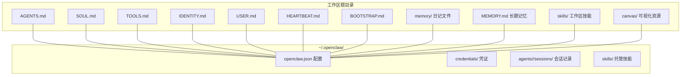
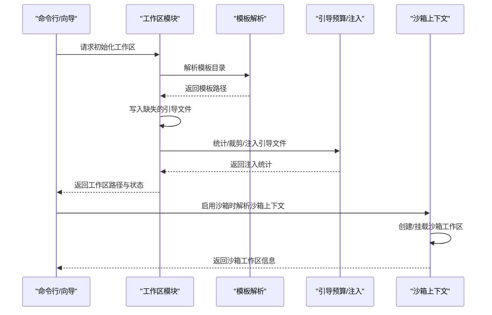
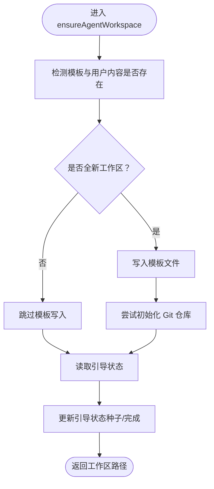
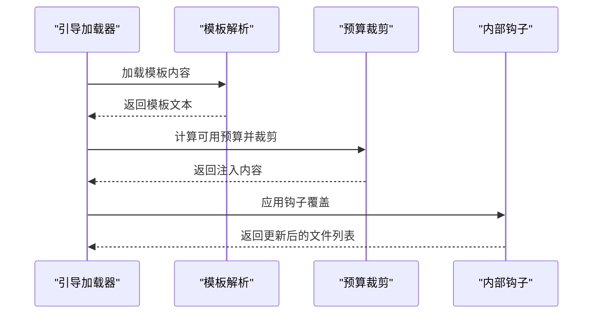
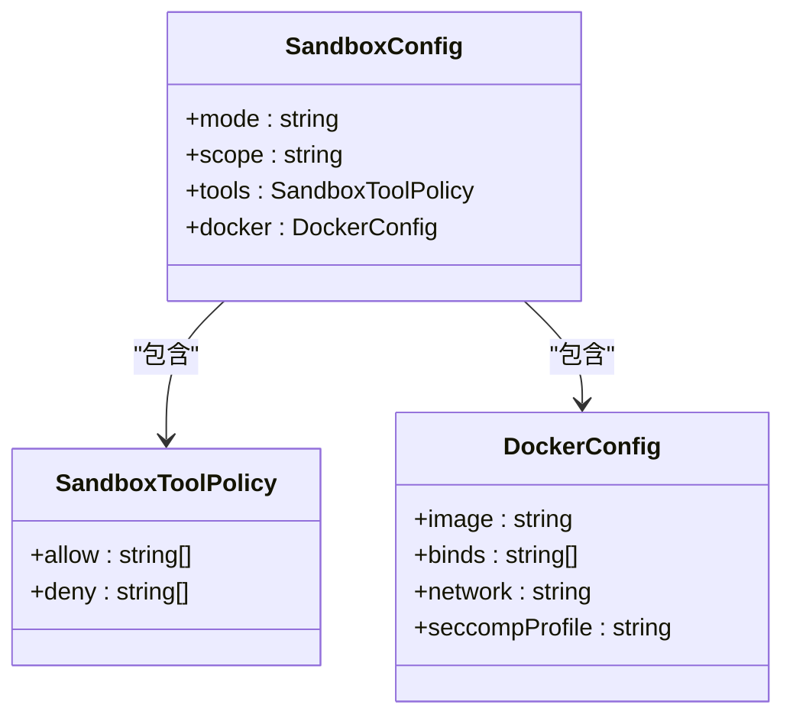
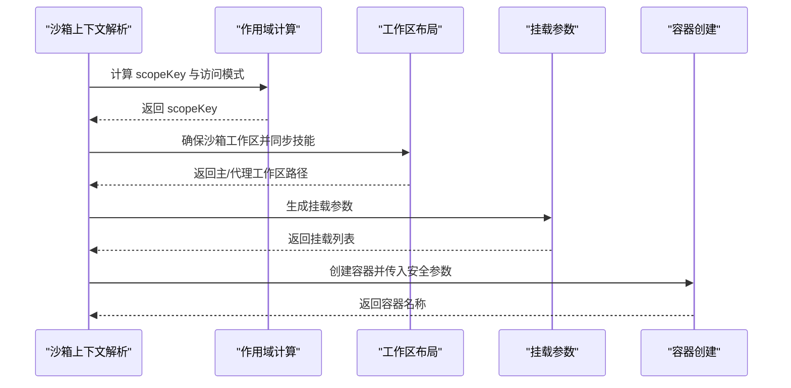
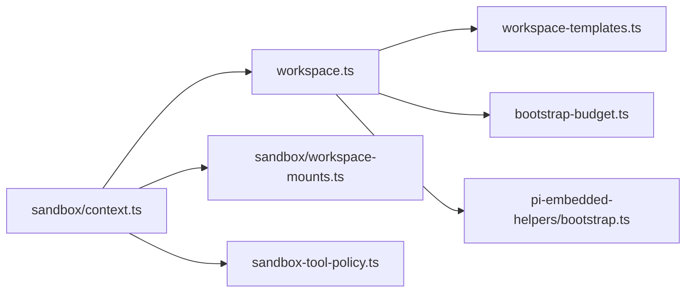

# 工作空间管理

<cite>
**本文引用的文件**
- [README.md](file://README.md)
- [agent-workspace.md](file://docs/zh-CN/concepts/agent-workspace.md)
- [workspace.ts](file://src/agents/workspace.ts)
- [workspace-dir.ts](file://src/agents/workspace-dir.ts)
- [workspace-templates.ts](file://src/agents/workspace-templates.ts)
- [context.ts](file://src/agents/sandbox/context.ts)
- [shared.ts](file://src/agents/sandbox/shared.ts)
- [workspace-mounts.ts](file://src/agents/sandbox/workspace-mounts.ts)
- [bootstrap-budget.ts](file://src/agents/bootstrap-budget.ts)
- [bootstrap-hooks.test.ts](file://src/agents/bootstrap-hooks.test.ts)
- [pi-embedded-helpers/bootstrap.ts](file://src/agents/pi-embedded-helpers/bootstrap.ts)
- [configure.wizard.ts](file://src/commands/configure.wizard.ts)
- [AgentWorkspace.swift](file://apps/macos/Sources/OpenClaw/AgentWorkspace.swift)
- [workspace.ts](file://src/test-helpers/workspace.ts)
- [workspace.test.ts](file://src/agents/workspace.test.ts)
- [config.sandbox-docker.test.ts](file://src/config/config.sandbox-docker.test.ts)
- [sandbox-tool-policy.ts](file://src/agents/sandbox-tool-policy.ts)
- [fix.ts](file://src/security/fix.ts)
</cite>

## 目录
1. [简介](#简介)
2. [项目结构](#项目结构)
3. [核心组件](#核心组件)
4. [架构总览](#架构总览)
5. [详细组件分析](#详细组件分析)
6. [依赖关系分析](#依赖关系分析)
7. [性能考量](#性能考量)
8. [故障排除指南](#故障排除指南)
9. [结论](#结论)
10. [附录](#附录)

## 简介
本文件面向开发者与运维人员，系统化阐述 OpenClaw 代理工作空间的结构布局、文件组织、权限与安全模型、初始化流程、文件注入与引导预算、备份策略、与沙箱的关系及多会话隔离机制，并提供配置选项、文件模板系统、自定义扩展方法、设置示例与最佳实践。

## 项目结构
- 工作空间是智能体的“家”，默认位于用户主目录下的专用目录，可通过配置覆盖。
- 工作空间内包含一组标准引导文件（如 AGENTS.md、SOUL.md、TOOLS.md、IDENTITY.md、USER.md、HEARTBEAT.md、BOOTSTRAP.md），以及可选的记忆文件与技能目录。
- 工作空间与配置、凭证、会话等状态分离，后者位于用户主目录下的独立目录中，不应纳入工作区版本控制。

图示来源
- [agent-workspace.md](file://docs/zh-CN/concepts/agent-workspace.md#L26-L125)

章节来源
- [agent-workspace.md](file://docs/zh-CN/concepts/agent-workspace.md#L16-L125)
- [README.md](file://README.md#L312-L317)

## 核心组件
- 工作区文件加载与引导：负责加载标准引导文件、处理缺失文件、应用额外文件、过滤会话上下文、写入引导状态。
- 模板系统：从包内或文档目录解析模板，剥离前置元数据，缓存以提升性能。
- 沙箱集成：在启用沙箱时，为会话创建隔离工作区，挂载主工作区与代理工作区，同步技能，解析 Docker 用户映射。
- 引导预算与注入：对大文件进行预算裁剪与截断，统计注入情况，支持内部钩子扩展。
- 安全与权限：校验沙箱配置、限制危险绑定与网络模式，统一工具策略合并。

章节来源
- [workspace.ts](file://src/agents/workspace.ts#L12-L656)
- [workspace-templates.ts](file://src/agents/workspace-templates.ts#L1-L60)
- [context.ts](file://src/agents/sandbox/context.ts#L1-L211)
- [bootstrap-budget.ts](file://src/agents/bootstrap-budget.ts#L124-L162)
- [pi-embedded-helpers/bootstrap.ts](file://src/agents/pi-embedded-helpers/bootstrap.ts#L230-L257)

## 架构总览
下图展示工作空间初始化、模板加载、引导注入与沙箱隔离的关键交互：

图示来源
- [workspace.ts](file://src/agents/workspace.ts#L321-L459)
- [workspace-templates.ts](file://src/agents/workspace-templates.ts#L14-L54)
- [bootstrap-budget.ts](file://src/agents/bootstrap-budget.ts#L124-L162)
- [context.ts](file://src/agents/sandbox/context.ts#L108-L186)

## 详细组件分析

### 工作区结构与文件组织
- 默认位置与覆盖：默认工作区位于用户主目录下的固定路径，可通过配置覆盖；支持按 Profile 切换不同工作区。
- 标准引导文件：包含 AGENTS、SOUL、TOOLS、IDENTITY、USER、HEARTBEAT、BOOTSTRAP；可选 MEMORY 与每日日记目录。
- 额外内容：skills/、canvas/ 等；不纳入版本控制。
- 初始化与迁移：新工作区自动初始化 Git 仓库；若检测到已有用户内容则跳过重建 BOOTSTRAP 并标记完成。

图示来源
- [workspace.ts](file://src/agents/workspace.ts#L321-L459)
- [workspace.test.ts](file://src/agents/workspace.test.ts#L126-L149)

章节来源
- [workspace.ts](file://src/agents/workspace.ts#L12-L656)
- [agent-workspace.md](file://docs/zh-CN/concepts/agent-workspace.md#L26-L125)
- [workspace.test.ts](file://src/agents/workspace.test.ts#L126-L149)

### 模板系统与文件注入
- 模板解析：优先从包内文档目录解析模板，否则回退到内置目录；解析后剥离前置元数据，缓存以避免重复 IO。
- 引导预算：对注入的引导文件进行字符预算裁剪，支持截断提示与最大字符限制；统计注入量与截断情况。
- 钩子扩展：允许内部钩子动态修改引导文件集合，实现按需注入。

图示来源
- [workspace-templates.ts](file://src/agents/workspace-templates.ts#L14-L54)
- [pi-embedded-helpers/bootstrap.ts](file://src/agents/pi-embedded-helpers/bootstrap.ts#L230-L257)
- [bootstrap-budget.ts](file://src/agents/bootstrap-budget.ts#L124-L162)
- [bootstrap-hooks.test.ts](file://src/agents/bootstrap-hooks.test.ts#L21-L47)

章节来源
- [workspace-templates.ts](file://src/agents/workspace-templates.ts#L1-L60)
- [pi-embedded-helpers/bootstrap.ts](file://src/agents/pi-embedded-helpers/bootstrap.ts#L230-L257)
- [bootstrap-budget.ts](file://src/agents/bootstrap-budget.ts#L124-L162)
- [bootstrap-hooks.test.ts](file://src/agents/bootstrap-hooks.test.ts#L21-L47)

### 权限管理与安全模型
- 工作区默认 cwd，非强制沙箱；启用沙箱后，工具在沙箱工作区内操作，而非直接访问主机工作区。
- 沙箱工具策略：支持 allow/deny 列表，合并策略遵循“最严格优先”；默认允许有限工具集，拒绝高危能力。
- Docker 安全校验：禁止危险绑定、网络模式与安全配置；通过模式校验与安全审计发现潜在风险。
- 文件权限修复：凭证与代理根目录权限统一修正，保障最小暴露面。

图示来源
- [sandbox-tool-policy.ts](file://src/agents/sandbox-tool-policy.ts#L1-L37)
- [context.ts](file://src/agents/sandbox/context.ts#L169-L186)
- [config.sandbox-docker.test.ts](file://src/config/config.sandbox-docker.test.ts#L136-L180)

章节来源
- [context.ts](file://src/agents/sandbox/context.ts#L1-L211)
- [sandbox-tool-policy.ts](file://src/agents/sandbox-tool-policy.ts#L1-L37)
- [config.sandbox-docker.test.ts](file://src/config/config.sandbox-docker.test.ts#L136-L180)
- [fix.ts](file://src/security/fix.ts#L319-L355)

### 沙箱与多会话隔离
- 作用域与命名：支持 session、agent、shared 三种作用域；会话键经哈希与规范化生成稳定目录名。
- 工作区布局：根据作用域与访问模式决定挂载策略；rw 模式直接挂载主工作区，只读模式挂载代理工作区并同步技能。
- 容器与用户：自动解析容器内用户 UID/GID 与 Docker 安全参数，确保最小权限与一致权限映射。

图示来源
- [shared.ts](file://src/agents/sandbox/shared.ts#L1-L46)
- [context.ts](file://src/agents/sandbox/context.ts#L20-L65)
- [workspace-mounts.ts](file://src/agents/sandbox/workspace-mounts.ts#L12-L28)

章节来源
- [shared.ts](file://src/agents/sandbox/shared.ts#L1-L46)
- [context.ts](file://src/agents/sandbox/context.ts#L1-L211)
- [workspace-mounts.ts](file://src/agents/sandbox/workspace-mounts.ts#L1-L29)

### 初始化流程与设置示例
- 向导与配置：向导可交互式选择工作区路径，检测既有内容并提示不会覆盖；最终写入配置并确保工作区存在。
- macOS 应用侧：提供工作区路径解析、空工作区判断、模板工作区识别等辅助逻辑，便于 GUI 层展示与引导。

章节来源
- [configure.wizard.ts](file://src/commands/configure.wizard.ts#L436-L482)
- [AgentWorkspace.swift](file://apps/macos/Sources/OpenClaw/AgentWorkspace.swift#L40-L71)

### 备份策略与迁移
- 推荐使用私有 Git 仓库备份工作区；初始化仓库、添加远程、持续更新均有步骤指引。
- 不应提交凭证与会话数据；迁移时单独复制会话与配置。
- 测试辅助：提供临时工作区创建与文件写入工具，便于测试与验证。

章节来源
- [agent-workspace.md](file://docs/zh-CN/concepts/agent-workspace.md#L127-L220)
- [workspace.ts](file://src/agents/workspace.ts#L278-L319)
- [workspace.ts](file://src/test-helpers/workspace.ts#L1-L17)

## 依赖关系分析
- 工作区模块依赖模板解析模块以加载引导文件；依赖边界安全读取以防止越界访问。
- 沙箱模块依赖工作区模块确定挂载路径，依赖 Docker 参数校验与安全策略。
- 引导预算模块依赖注入统计与裁剪逻辑，受内部钩子影响。

图示来源
- [workspace.ts](file://src/agents/workspace.ts#L1-L656)
- [workspace-templates.ts](file://src/agents/workspace-templates.ts#L1-L60)
- [bootstrap-budget.ts](file://src/agents/bootstrap-budget.ts#L124-L162)
- [pi-embedded-helpers/bootstrap.ts](file://src/agents/pi-embedded-helpers/bootstrap.ts#L230-L257)
- [context.ts](file://src/agents/sandbox/context.ts#L1-L211)
- [workspace-mounts.ts](file://src/agents/sandbox/workspace-mounts.ts#L1-L29)
- [sandbox-tool-policy.ts](file://src/agents/sandbox-tool-policy.ts#L1-L37)

## 性能考量
- 模板与文件缓存：模板与工作区文件内容通过缓存避免重复读取与解析，降低 IO 开销。
- 边界安全读取：通过文件标识（inode/dev/大小/修改时间）缓存内容，减少重复读取与越界风险。
- 引导预算裁剪：对大文件进行预算内裁剪，避免注入超限导致上下文膨胀。

章节来源
- [workspace.ts](file://src/agents/workspace.ts#L38-L88)
- [pi-embedded-helpers/bootstrap.ts](file://src/agents/pi-embedded-helpers/bootstrap.ts#L230-L257)

## 故障排除指南
- 引导文件缺失：系统会注入“缺失文件”标记并继续；可通过设置最大引导字符限制调整截断阈值。
- Git 初始化失败：忽略失败不影响工作区创建；可在后续手动初始化。
- 沙箱配置不当：启用沙箱但未启用模式时，配置不会生效；危险 Docker 配置会被校验拒绝。
- 权限问题：凭证与代理根目录权限会被统一修正；检查权限修复动作与日志定位问题。

章节来源
- [agent-workspace.md](file://docs/zh-CN/concepts/agent-workspace.md#L113-L114)
- [workspace.ts](file://src/agents/workspace.ts#L304-L319)
- [config.sandbox-docker.test.ts](file://src/config/config.sandbox-docker.test.ts#L136-L180)
- [fix.ts](file://src/security/fix.ts#L319-L355)

## 结论
OpenClaw 的工作空间管理以“默认 cwd + 可选沙箱隔离”为核心设计，结合模板系统、引导预算与安全策略，既保证易用性又兼顾安全性。通过 Git 备份与严格的权限控制，开发者可以安全地维护个人代理的“记忆”与“知识库”。

## 附录

### 配置选项速查
- 工作区路径：agents.defaults.workspace
- 跳过引导：agents.defaults.skipBootstrap
- 引导最大字符：agents.defaults.bootstrapMaxChars
- 沙箱模式：agents.defaults.sandbox.mode
- 沙箱作用域：agents.defaults.sandbox.scope
- 工具策略：agents.defaults.sandbox.tools.allow/deny
- Docker 安全：agents.defaults.sandbox.docker.binds/network/seccompProfile 等

章节来源
- [agent-workspace.md](file://docs/zh-CN/concepts/agent-workspace.md#L26-L47)
- [README.md](file://README.md#L318-L338)