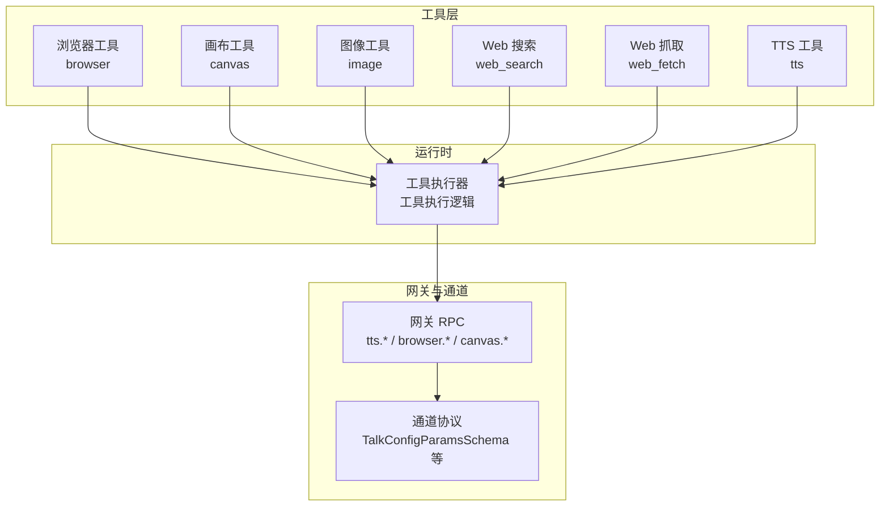
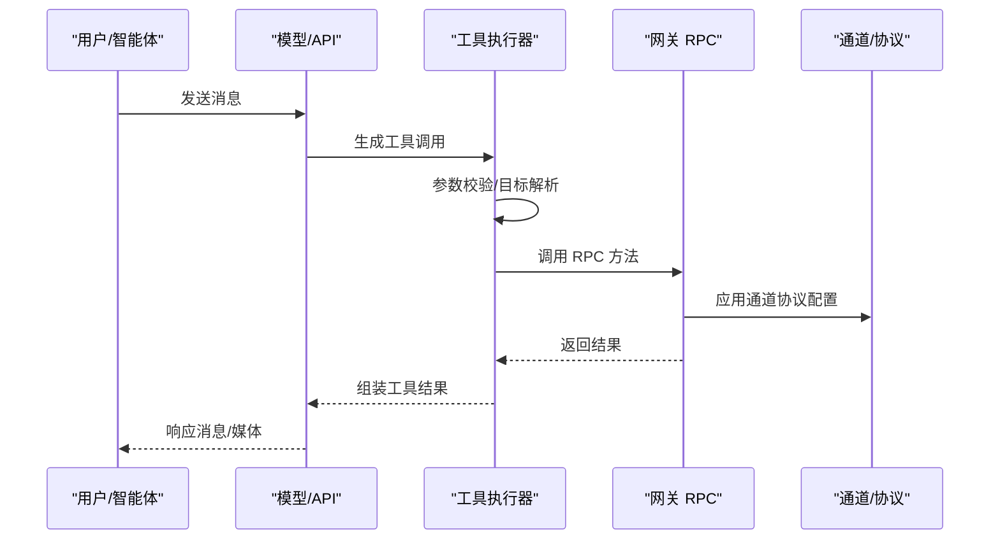
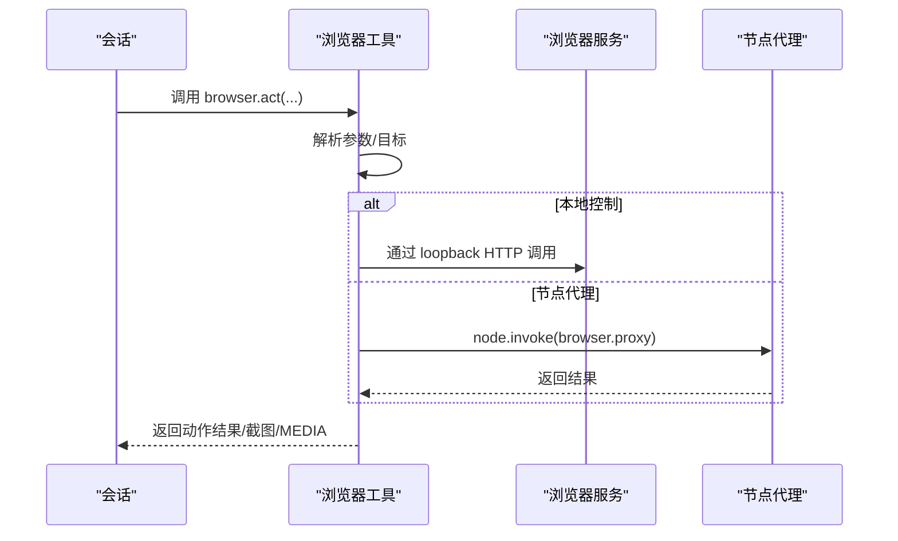
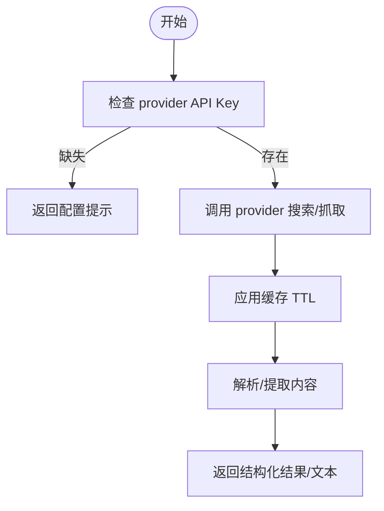
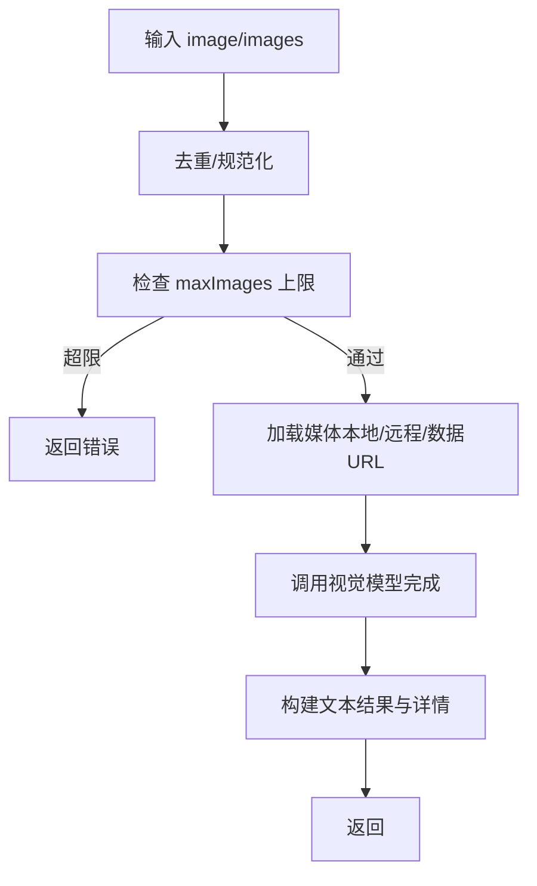
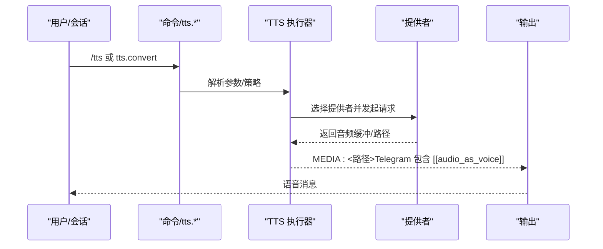
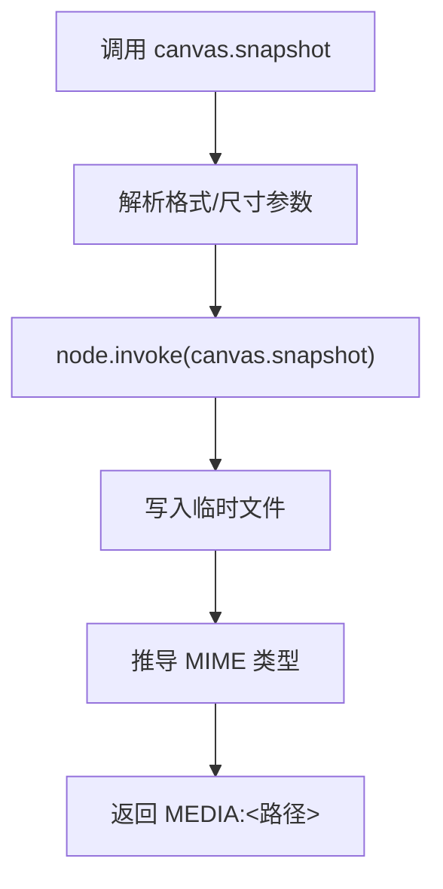
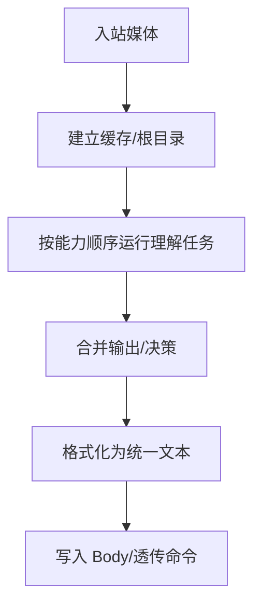
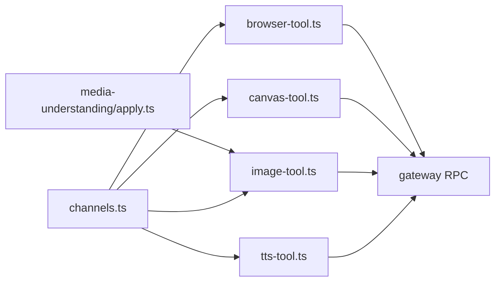

# 内置工具详解

<cite>
**本文引用的文件**
- [docs/tools/index.md](file://docs/tools/index.md)
- [docs/tools/browser.md](file://docs/tools/browser.md)
- [docs/tools/web.md](file://docs/tools/web.md)
- [docs/tts.md](file://docs/tts.md)
- [docs/nodes/images.md](file://docs/nodes/images.md)
- [src/agents/tools/browser-tool.ts](file://src/agents/tools/browser-tool.ts)
- [src/agents/tools/web-search.ts](file://src/agents/tools/web-search.ts)
- [src/agents/tools/canvas-tool.ts](file://src/agents/tools/canvas-tool.ts)
- [src/agents/tools/image-tool.ts](file://src/agents/tools/image-tool.ts)
- [src/agents/tools/tts-tool.ts](file://src/agents/tools/tts-tool.ts)
- [src/gateway/server-methods/tts.ts](file://src/gateway/server-methods/tts.ts)
- [src/config/types.tts.ts](file://src/config/types.tts.ts)
- [src/tts/tts.ts](file://src/tts/tts.ts)
- [src/media-understanding/apply.ts](file://src/media-understanding/apply.ts)
- [src/media-understanding/format.ts](file://src/media-understanding/format.ts)
- [src/media-understanding/errors.ts](file://src/media-understanding/errors.ts)
- [src/gateway/protocol/schema/channels.ts](file://src/gateway/protocol/schema/channels.ts)
- [docs/tools/slash-commands.md](file://docs/tools/slash-commands.md)
</cite>

## 目录
1. [简介](#简介)
2. [项目结构](#项目结构)
3. [核心组件](#核心组件)
4. [架构总览](#架构总览)
5. [详细组件分析](#详细组件分析)
6. [依赖关系分析](#依赖关系分析)
7. [性能考量](#性能考量)
8. [故障排除指南](#故障排除指南)
9. [结论](#结论)
10. [附录](#附录)

## 简介
本文件面向 OpenClaw 的内置工具集合，系统性梳理浏览器工具、Web 搜索与抓取工具、图像处理工具、文本转语音（TTS）工具的功能特性、API 接口、参数配置、输出格式、适用场景、性能特点与限制条件，并提供使用示例、集成方法、故障排除与优化建议，帮助用户高效利用内置工具能力。

## 项目结构
OpenClaw 将“工具”作为一等公民暴露给智能体，替代旧式技能（skills）。工具具备强类型定义、无 Shell 依赖、可被模型直接调用。内置工具包括：
- 浏览器控制（browser）
- 画布渲染（canvas）
- 图像理解（image）
- Web 搜索（web_search）、Web 抓取（web_fetch）
- 文本转语音（tts）

这些工具通过统一的工具描述与函数定义注入到系统提示与模型 API 中，确保智能体既能看到可用工具，也能正确调用。

**图表来源**
- [docs/tools/index.md](file://docs/tools/index.md#L1-L571)
- [src/agents/tools/browser-tool.ts](file://src/agents/tools/browser-tool.ts#L280-L658)
- [src/agents/tools/canvas-tool.ts](file://src/agents/tools/canvas-tool.ts#L80-L216)
- [src/agents/tools/image-tool.ts](file://src/agents/tools/image-tool.ts#L270-L512)
- [src/agents/tools/web-search.ts](file://src/agents/tools/web-search.ts#L1469-L1497)
- [src/agents/tools/tts-tool.ts](file://src/agents/tools/tts-tool.ts#L37-L61)
- [src/gateway/server-methods/tts.ts](file://src/gateway/server-methods/tts.ts#L52-L157)
- [src/gateway/protocol/schema/channels.ts](file://src/gateway/protocol/schema/channels.ts#L1-L28)

**章节来源**
- [docs/tools/index.md](file://docs/tools/index.md#L1-L571)

## 核心组件
- 浏览器工具（browser）：提供状态查询、启动/停止、标签页管理、快照、截图、PDF 导出、上传/对话框钩子、导航与动作（点击/输入/拖拽/选择/填充/等待/评估）等。
- 画布工具（canvas）：在节点上呈现/隐藏页面、导航、JavaScript 评估、截图、A2UI 推送与重置。
- 图像工具（image）：以指定提示对单张或多张图片进行视觉理解，支持多模型回退与本地/远程资源加载。
- Web 搜索（web_search）：基于 Perplexity、Brave、Gemini、Grok、Kimi 的搜索 API，返回结构化结果。
- Web 抓取（web_fetch）：HTTP 获取并提取可读内容（HTML → markdown/text），支持 Firecrawl 备选。
- TTS 工具（tts）：将文本转换为音频，返回 MEDIA 路径；在 Telegram 上生成圆形语音气泡。

**章节来源**
- [docs/tools/browser.md](file://docs/tools/browser.md#L1-L611)
- [docs/tools/web.md](file://docs/tools/web.md#L1-L308)
- [docs/tts.md](file://docs/tts.md#L1-L404)
- [src/agents/tools/browser-tool.ts](file://src/agents/tools/browser-tool.ts#L280-L658)
- [src/agents/tools/canvas-tool.ts](file://src/agents/tools/canvas-tool.ts#L80-L216)
- [src/agents/tools/image-tool.ts](file://src/agents/tools/image-tool.ts#L270-L512)
- [src/agents/tools/web-search.ts](file://src/agents/tools/web-search.ts#L1469-L1497)
- [src/agents/tools/tts-tool.ts](file://src/agents/tools/tts-tool.ts#L37-L61)

## 架构总览
OpenClaw 的工具由“工具描述 + 执行器 + 网关 RPC + 通道协议”构成。工具描述注入系统提示与模型 API；执行器负责参数解析、目标定位（本地/宿主/节点）、调用网关 RPC；网关 RPC 对外暴露统一方法；通道协议定义配置模式（如 TalkConfig）。

**图表来源**
- [docs/tools/index.md](file://docs/tools/index.md#L562-L571)
- [src/gateway/protocol/schema/channels.ts](file://src/gateway/protocol/schema/channels.ts#L1-L28)
- [src/agents/tools/browser-tool.ts](file://src/agents/tools/browser-tool.ts#L303-L658)
- [src/agents/tools/canvas-tool.ts](file://src/agents/tools/canvas-tool.ts#L88-L216)
- [src/agents/tools/image-tool.ts](file://src/agents/tools/image-tool.ts#L321-L512)
- [src/agents/tools/web-search.ts](file://src/agents/tools/web-search.ts#L1469-L1497)
- [src/agents/tools/tts-tool.ts](file://src/agents/tools/tts-tool.ts#L37-L61)

## 详细组件分析

### 浏览器工具（browser）
- 功能要点
  - 支持 openclaw 独立浏览器与 Chrome 扩展中继两种模式，多配置文件（profile）隔离。
  - 提供状态、启动/停止、标签页管理、快照（AI/ARIA 角色）、截图、PDF 导出、上传/对话框钩子、导航与动作（点击/输入/拖拽/选择/填充/等待/评估）。
  - 支持本地/远程控制与节点代理，自动路由至可用节点。
- API 与参数
  - 动作：status/start/stop/profiles/tabs/open/focus/close/snapshot/screenshot/pdf/upload/dialog/act/navigate/console 等。
  - 关键参数：profile、target（sandbox/host/node）、node、timeoutMs、以及各动作的专用参数（如 act 的 ref、type、submit 等）。
- 输出格式
  - 快照：文本树（AI/ARIA）或角色列表（含 refs）。
  - 截图：返回 MEDIA:<路径>。
  - PDF：返回 FILE:<路径>。
- 适用场景
  - 自动化网页交互、UI 验证、数据采集、登录态维持。
- 性能与限制
  - Playwright 可选：部分高级操作需要安装 Playwright；缺失时仅提供基础能力。
  - SSRF/私网访问策略可配置，默认严格模式。
- 使用示例
  - 启动并打开页面：browser → start → open <URL> → snapshot → act → screenshot。
  - 远程控制：指定 target=node 或 node=<id>，或启用 gateway.nodes.browser.mode。
- 集成方法
  - 在工具策略中允许 browser；若需扩展能力，可在 tools.allow 中加入 group:ui。
- 故障排除
  - Playwright 缺失：安装 Playwright 并重启网关。
  - 私网访问受限：调整 browser.ssrfPolicy 或允许白名单主机名。
  - Chrome 扩展中继：确认扩展已附加到目标标签页。

**图表来源**
- [src/agents/tools/browser-tool.ts](file://src/agents/tools/browser-tool.ts#L303-L658)
- [docs/tools/browser.md](file://docs/tools/browser.md#L309-L343)

**章节来源**
- [docs/tools/browser.md](file://docs/tools/browser.md#L1-L611)
- [src/agents/tools/browser-tool.ts](file://src/agents/tools/browser-tool.ts#L280-L658)

### Web 搜索与抓取工具（web_search / web_fetch）
- 功能要点
  - web_search：支持 Perplexity、Brave、Gemini、Grok、Kimi，返回结构化结果（标题、URL、摘要）。
  - web_fetch：HTTP 获取 + Readability 提取，JS 驱动站点优先尝试 Firecrawl；支持缓存与限流。
- API 与参数
  - web_search：query（必填）、count、country、language、freshness、date_after、date_before、ui_lang、domain_filter、max_tokens、max_tokens_per_page 等。
  - web_fetch：url（必填）、extractMode（markdown/text）、maxChars。
- 输出格式
  - web_search：结构化结果列表。
  - web_fetch：文本或 Markdown。
- 适用场景
  - 快速检索、信息聚合、网页内容抽取。
- 性能与限制
  - 结果缓存（默认 15 分钟）；超时与重定向限制可配置；私有/内部主机名默认阻断。
- 使用示例
  - 搜索德国本地新闻：设置 country=DE、language=de。
  - 最近一周结果：设置 freshness=week。
  - 日期范围：设置 date_after/date_before。
  - 域名过滤：Perplexity 支持 allowlist/denylist。
- 集成方法
  - 在工具策略中允许 web_search/web_fetch 或 group:web；配置对应 API Key。
- 故障排除
  - 缺少 API Key：根据 provider 提示配置；或使用环境变量。
  - Firecrawl 备选：开启 tools.web.fetch.firecrawl.* 并设置密钥。

**图表来源**
- [docs/tools/web.md](file://docs/tools/web.md#L157-L308)
- [src/agents/tools/web-search.ts](file://src/agents/tools/web-search.ts#L1469-L1497)

**章节来源**
- [docs/tools/web.md](file://docs/tools/web.md#L1-L308)
- [src/agents/tools/web-search.ts](file://src/agents/tools/web-search.ts#L1469-L1497)

### 图像处理工具（image）
- 功能要点
  - 使用配置的视觉模型对单张或多张图片进行理解；支持多模型回退与本地/远程资源加载。
  - 当主模型具备视觉能力时，工具描述会提示仅在未提供图片时使用。
- API 与参数
  - prompt（可选）、image（单张路径/URL）、images（多张，最多默认 20）、model（覆盖）、maxBytesMb、maxImages。
- 输出格式
  - 文本结果（模型回答），并携带 provider/model 与加载的图片元信息。
- 适用场景
  - 图片标注、OCR 辅助、视觉问答、合规审查辅助。
- 性能与限制
  - 单次最多 20 张图片；支持最大字节数限制；MiniMax VLM 仅支持单图。
- 使用示例
  - 单图理解：传入 image 与可选 prompt。
  - 多图理解：传入 images 数组。
- 集成方法
  - 在工具策略中允许 image；配置 agents.defaults.imageModel 或自动配对主模型的视觉能力。
- 故障排除
  - 不支持的媒体类型：确保为图片；数据 URL/文件 URL/HTTP(S) URL 均受支持。
  - 超过最大图片数量：减少 images 数量或调整 maxImages。

**图表来源**
- [src/agents/tools/image-tool.ts](file://src/agents/tools/image-tool.ts#L321-L512)

**章节来源**
- [src/agents/tools/image-tool.ts](file://src/agents/tools/image-tool.ts#L270-L512)

### 文本转语音（TTS）工具
- 功能要点
  - 支持 ElevenLabs、OpenAI、Edge TTS；可自动总结长回复并附带音频；Telegram 发送圆形语音气泡。
  - 支持 per-session 切换（/tts）、提供者切换、长度限制、摘要阈值等。
- API 与参数
  - 网关 RPC：tts.status、tts.enable、tts.disable、tts.convert、tts.setProvider、tts.providers。
  - 工具：tts.convert 返回 MEDIA 路径；当 Telegram 兼容时包含 [[audio_as_voice]]。
- 输出格式
  - Telegram：opus（语音气泡）。
  - 其他通道：mp3。
  - Edge TTS：可配置输出格式（遵循微软 Speech 输出格式）。
- 适用场景
  - 语音播报、无障碍支持、移动端语音体验。
- 性能与限制
  - Edge TTS 为在线服务，无 SLA 与配额；OpenAI/ElevenLabs 更稳定。
  - 文本长度上限可配置；超限则跳过 TTS 或先摘要再合成。
- 使用示例
  - /tts always 开启自动 TTS；/tts provider openai 切换提供者；/tts limit 2000 设置长度限制。
- 集成方法
  - 在工具策略中允许 tts；配置 messages.tts.*；通过 /tts 命令或网关 RPC 控制。
- 故障排除
  - 缺少 API Key：配置 ElevenLabs/OpenAI Key；Edge TTS 无需 Key。
  - Telegram 语音气泡：确保使用兼容格式（opus）。

**图表来源**
- [src/gateway/server-methods/tts.ts](file://src/gateway/server-methods/tts.ts#L52-L157)
- [src/agents/tools/tts-tool.ts](file://src/agents/tools/tts-tool.ts#L37-L61)
- [docs/tts.md](file://docs/tts.md#L388-L404)

**章节来源**
- [docs/tts.md](file://docs/tts.md#L1-L404)
- [src/gateway/server-methods/tts.ts](file://src/gateway/server-methods/tts.ts#L52-L157)
- [src/agents/tools/tts-tool.ts](file://src/agents/tools/tts-tool.ts#L37-L61)
- [src/config/types.tts.ts](file://src/config/types.tts.ts#L28-L85)
- [src/tts/tts.ts](file://src/tts/tts.ts#L740-L783)

### 画布工具（canvas）与媒体支持
- 功能要点
  - 在节点上呈现/隐藏页面、导航、JavaScript 评估、截图、A2UI 推送与重置。
  - 截图支持 png/jpg，可设置最大宽度与质量；A2UI 支持 JSONL 推送。
- API 与参数
  - 动作：present/hide/navigate/eval/snapshot/a2ui_push/a2ui_reset。
  - 关键参数：gatewayUrl/gatewayToken/timeoutMs、node、target/url、javaScript、outputFormat/maxWidth/quality、jsonl/jsonlPath。
- 输出格式
  - snapshot 返回 MEDIA:<路径>（PNG/JPG）。
- 适用场景
  - UI 渲染验证、可视化展示、A2UI 交互。
- 性能与限制
  - A2UI 仅支持 v0.8；JSONL 路径需在允许根目录内。
- 使用示例
  - canvas present --target https://example.com；canvas snapshot --outputFormat jpeg --maxWidth 1280。
- 集成方法
  - 在工具策略中允许 canvas；若无 node 指定，工具会选择默认节点。
- 故障排除
  - JSONL 路径越权：确保路径在默认媒体根目录内。

**图表来源**
- [src/agents/tools/canvas-tool.ts](file://src/agents/tools/canvas-tool.ts#L162-L193)

**章节来源**
- [src/agents/tools/canvas-tool.ts](file://src/agents/tools/canvas-tool.ts#L80-L216)

### 媒体理解与格式化（媒体理解流水线）
- 功能要点
  - 对入站图片/音频/视频进行理解（描述/转录），并格式化为统一文本块，便于后续处理或命令解析。
- API 与参数
  - 通过 tools.media.* 配置能力（image/audio/video）与并发度、超时、大小限制等。
- 输出格式
  - 统一格式化文本（如“Image/N: 描述/转录”）。
- 适用场景
  - 自动回复中嵌入媒体理解结果；命令解析保留原始文本上下文。
- 性能与限制
  - 超大/不支持/空/过小媒体会跳过理解；可配置附件策略（最多附件、偏好等）。
- 使用示例
  - 在 inbound 媒体后，自动插入 [Image]/[Audio]/[Video] 块，保留原始 caption 供命令解析。

**图表来源**
- [src/media-understanding/apply.ts](file://src/media-understanding/apply.ts#L466-L517)
- [src/media-understanding/format.ts](file://src/media-understanding/format.ts#L47-L98)
- [src/media-understanding/errors.ts](file://src/media-understanding/errors.ts#L1-L20)
- [docs/nodes/images.md](file://docs/nodes/images.md#L42-L51)

**章节来源**
- [src/media-understanding/apply.ts](file://src/media-understanding/apply.ts#L466-L517)
- [src/media-understanding/format.ts](file://src/media-understanding/format.ts#L47-L98)
- [src/media-understanding/errors.ts](file://src/media-understanding/errors.ts#L1-L20)
- [docs/nodes/images.md](file://docs/nodes/images.md#L1-L73)

## 依赖关系分析
- 工具与网关
  - 浏览器/画布工具通过 node.invoke 访问节点能力；TTS 工具通过网关 RPC tts.convert 返回 MEDIA 路径。
- 通道协议
  - 通道配置模式（如 TalkConfigParamsSchema）影响工具行为与可见性。
- 媒体理解
  - 媒体理解在命令前执行，可能向 Body 注入媒体块，影响后续命令解析。

**图表来源**
- [src/agents/tools/browser-tool.ts](file://src/agents/tools/browser-tool.ts#L303-L658)
- [src/agents/tools/canvas-tool.ts](file://src/agents/tools/canvas-tool.ts#L88-L216)
- [src/agents/tools/image-tool.ts](file://src/agents/tools/image-tool.ts#L321-L512)
- [src/agents/tools/tts-tool.ts](file://src/agents/tools/tts-tool.ts#L37-L61)
- [src/media-understanding/apply.ts](file://src/media-understanding/apply.ts#L466-L517)
- [src/gateway/protocol/schema/channels.ts](file://src/gateway/protocol/schema/channels.ts#L1-L28)

**章节来源**
- [src/gateway/protocol/schema/channels.ts](file://src/gateway/protocol/schema/channels.ts#L1-L28)

## 性能考量
- 浏览器工具
  - Playwright 安装可显著提升功能完整性；Docker 环境请使用打包 CLI 安装浏览器驱动。
  - SSRF 策略与端口分配避免冲突；远程 CDP 需短时令牌与私有网络。
- Web 工具
  - 搜索结果与抓取内容默认缓存 15 分钟；合理设置 maxChars 与 maxCharsCap。
  - Firecrawl 作为备选可提高反爬站点成功率。
- 图像工具
  - 控制 maxImages 与 maxBytesMb；MiniMax VLM 仅单图。
- TTS
  - Edge TTS 为在线服务，建议在需要稳定性与配额时使用 OpenAI/ElevenLabs。
  - 合理设置 maxTextLength 与摘要阈值，避免超长文本导致失败。
- 画布工具
  - 截图质量与尺寸参数影响体积与传输时间；A2UI JSONL 需在允许根目录内。

[本节为通用指导，无需特定文件引用]

## 故障排除指南
- 浏览器工具
  - Playwright 缺失：安装 Playwright 并重启网关；Docker 使用打包 CLI 安装驱动。
  - 私网访问受限：调整 browser.ssrfPolicy 或允许白名单主机名。
  - Chrome 扩展中继：确认扩展已附加到目标标签页。
- Web 工具
  - 缺少 API Key：按 provider 提示配置；或使用环境变量。
  - Firecrawl 备选：开启 tools.web.fetch.firecrawl.* 并设置密钥。
- 图像工具
  - 不支持的媒体类型：确保为图片；数据 URL/文件 URL/HTTP(S) URL 均受支持。
  - 超过最大图片数量：减少 images 数量或调整 maxImages。
- TTS
  - 缺少 API Key：配置 ElevenLabs/OpenAI Key；Edge TTS 无需 Key。
  - Telegram 语音气泡：确保使用兼容格式（opus）。
- 画布工具
  - JSONL 路径越权：确保路径在默认媒体根目录内。
- 通用
  - 工具不可见：检查 tools.allow/deny 与工具策略；确认 provider key 已配置。

**章节来源**
- [docs/tools/browser.md](file://docs/tools/browser.md#L340-L357)
- [docs/tools/web.md](file://docs/tools/web.md#L250-L308)
- [src/agents/tools/image-tool.ts](file://src/agents/tools/image-tool.ts#L424-L426)
- [docs/tts.md](file://docs/tts.md#L316-L331)
- [src/agents/tools/canvas-tool.ts](file://src/agents/tools/canvas-tool.ts#L30-L51)
- [docs/tools/index.md](file://docs/tools/index.md#L15-L31)

## 结论
OpenClaw 的内置工具以强类型、可组合的方式提供端到端能力：从浏览器自动化、Web 搜索/抓取、图像理解，到 TTS 与画布渲染。通过统一的工具描述与网关 RPC，结合通道协议与媒体理解流水线，用户可以灵活地在不同场景下组合使用这些工具，实现从信息获取到内容生成再到语音反馈的完整闭环。

[本节为总结，无需特定文件引用]

## 附录
- 工具使用示例与集成
  - 浏览器：browser → start → open → snapshot → act → screenshot。
  - Web：web_search 设置 country/language/freshness；web_fetch 指定 extractMode 与 maxChars。
  - 图像：image 传入 image/images 与可选 prompt。
  - TTS：/tts always；/tts provider openai；/tts limit 2000。
  - 画布：canvas present --target URL；canvas snapshot --outputFormat jpeg。
- 命令与权限
  - /tts、/config、/debug 等命令需授权；详见 slash-commands 文档。
- 通道协议参考
  - TalkConfigParamsSchema 等定义了配置模式与字段约束。

**章节来源**
- [docs/tools/slash-commands.md](file://docs/tools/slash-commands.md#L68-L223)
- [src/gateway/protocol/schema/channels.ts](file://src/gateway/protocol/schema/channels.ts#L1-L28)