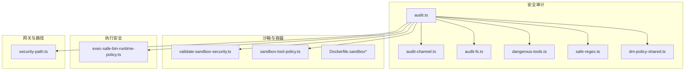
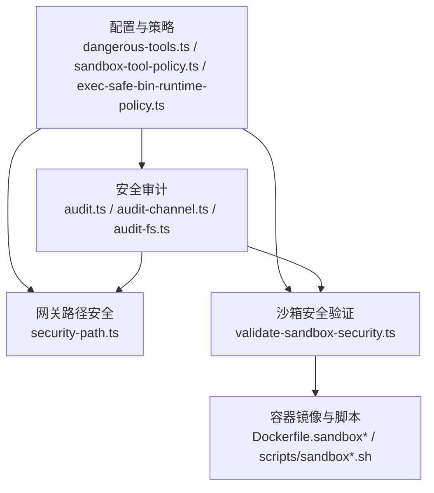
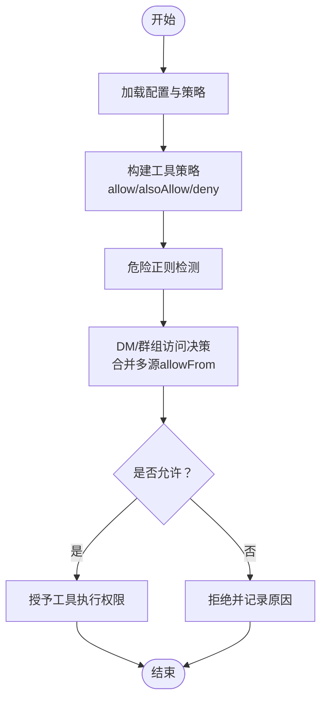
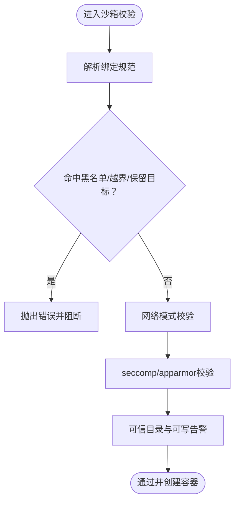
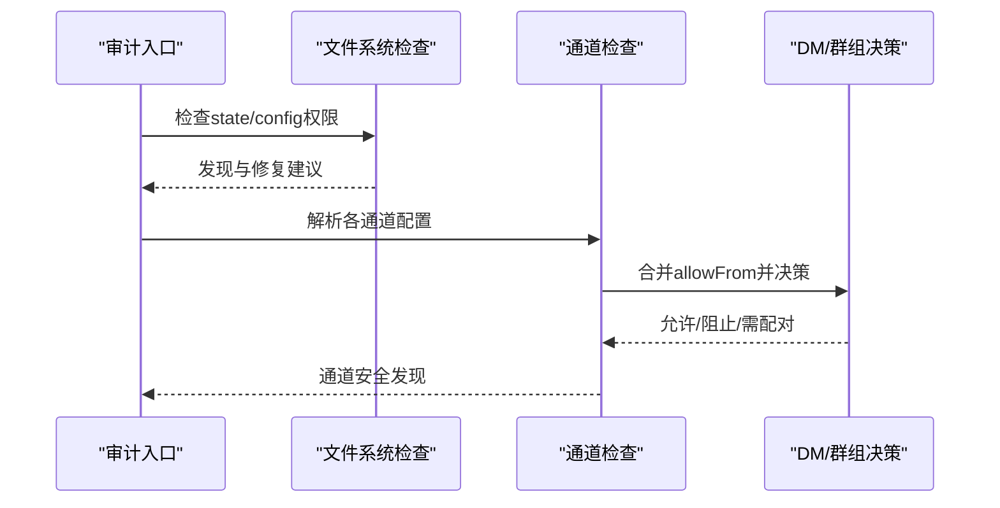
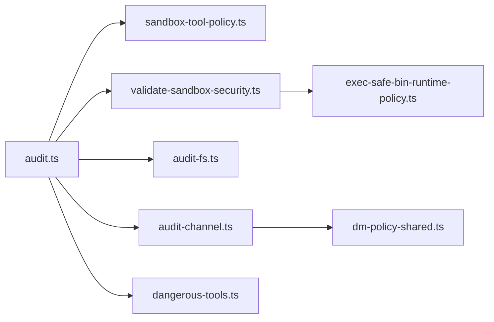
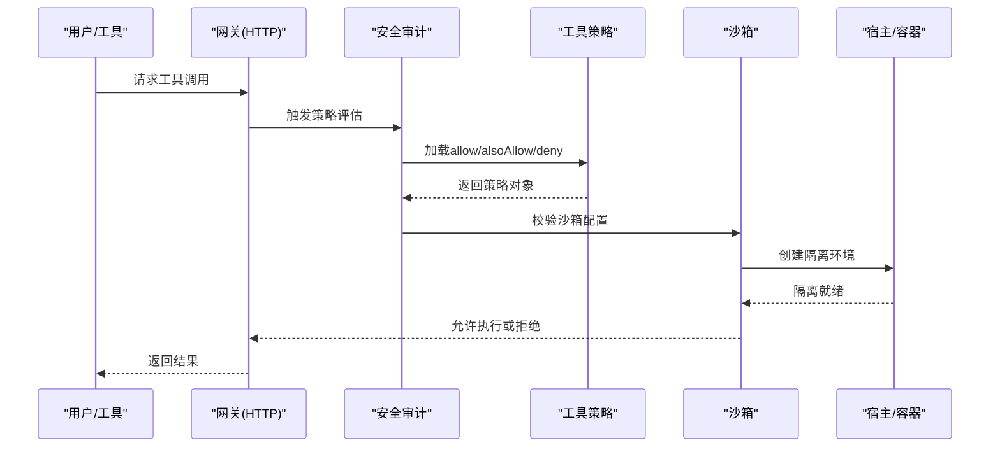

# 工具权限控制

<cite>
**本文引用的文件**
- [src/security/audit.ts](file://src/security/audit.ts)
- [src/security/audit-tool-policy.ts](file://src/security/audit-tool-policy.ts)
- [src/security/dangerous-tools.ts](file://src/security/dangerous-tools.ts)
- [src/security/safe-regex.ts](file://src/security/safe-regex.ts)
- [src/security/dm-policy-shared.ts](file://src/security/dm-policy-shared.ts)
- [src/security/audit-channel.ts](file://src/security/audit-channel.ts)
- [src/security/audit-fs.ts](file://src/security/audit-fs.ts)
- [src/agents/sandbox/validate-sandbox-security.ts](file://src/agents/sandbox/validate-sandbox-security.ts)
- [src/agents/sandbox-tool-policy.ts](file://src/agents/sandbox-tool-policy.ts)
- [src/infra/exec-safe-bin-runtime-policy.ts](file://src/infra/exec-safe-bin-runtime-policy.ts)
- [src/gateway/security-path.ts](file://src/gateway/security-path.ts)
- [docs/gateway/sandboxing.md](file://docs/gateway/sandboxing.md)
- [docs/gateway/sandbox-vs-tool-policy-vs-elevated.md](file://docs/gateway/sandbox-vs-tool-policy-vs-elevated.md)
- [docs/tools/multi-agent-sandbox-tools.md](file://docs/tools/multi-agent-sandbox-tools.md)
- [scripts/sandbox-setup.sh](file://scripts/sandbox-setup.sh)
- [scripts/sandbox-browser-setup.sh](file://scripts/sandbox-browser-setup.sh)
- [scripts/sandbox-common-setup.sh](file://scripts/sandbox-common-setup.sh)
- [Dockerfile.sandbox](file://Dockerfile.sandbox)
- [Dockerfile.sandbox-browser](file://Dockerfile.sandbox-browser)
- [Dockerfile.sandbox-common](file://Dockerfile.sandbox-common)
</cite>

## 目录
1. [简介](#简介)
2. [项目结构](#项目结构)
3. [核心组件](#核心组件)
4. [架构总览](#架构总览)
5. [详细组件分析](#详细组件分析)
6. [依赖关系分析](#依赖关系分析)
7. [性能考量](#性能考量)
8. [故障排查指南](#故障排查指南)
9. [结论](#结论)
10. [附录](#附录)

## 简介
本文件面向OpenClaw工具权限控制系统，系统化梳理权限模型、访问控制列表（ACL）、沙箱安全机制与策略评估算法，覆盖工具授权流程、权限继承规则、动态权限调整、文件系统权限、网络访问控制、进程执行限制等关键主题。文档同时提供权限配置语法、策略评估流程图、审计日志记录建议、权限配置示例与安全最佳实践，帮助开发者构建安全可控的工具执行环境。

## 项目结构
围绕权限控制的关键代码分布在以下模块：
- 安全审计与策略：src/security/*
- 沙箱与容器隔离：src/agents/sandbox* 与 Dockerfile.sandbox*
- 执行安全与可选安全二进制：src/infra/exec-safe-bin*
- 网关与路径安全：src/gateway/security-path.ts
- 文档与脚本：docs/* 与 scripts/*

图表来源
- [src/security/audit.ts](file://src/security/audit.ts#L1-L1254)
- [src/security/audit-channel.ts](file://src/security/audit-channel.ts#L1-L726)
- [src/security/audit-fs.ts](file://src/security/audit-fs.ts#L1-L207)
- [src/security/dangerous-tools.ts](file://src/security/dangerous-tools.ts#L1-L40)
- [src/security/safe-regex.ts](file://src/security/safe-regex.ts#L1-L333)
- [src/security/dm-policy-shared.ts](file://src/security/dm-policy-shared.ts#L1-L321)
- [src/agents/sandbox/validate-sandbox-security.ts](file://src/agents/sandbox/validate-sandbox-security.ts#L1-L344)
- [src/agents/sandbox-tool-policy.ts](file://src/agents/sandbox-tool-policy.ts#L1-L38)
- [src/infra/exec-safe-bin-runtime-policy.ts](file://src/infra/exec-safe-bin-runtime-policy.ts#L1-L158)
- [src/gateway/security-path.ts](file://src/gateway/security-path.ts#L1-L200)
- [Dockerfile.sandbox](file://Dockerfile.sandbox#L1-L200)
- [Dockerfile.sandbox-browser](file://Dockerfile.sandbox-browser#L1-L200)
- [Dockerfile.sandbox-common](file://Dockerfile.sandbox-common#L1-L200)

章节来源
- [src/security/audit.ts](file://src/security/audit.ts#L1-L1254)
- [src/security/audit-channel.ts](file://src/security/audit-channel.ts#L1-L726)
- [src/security/audit-fs.ts](file://src/security/audit-fs.ts#L1-L207)
- [src/security/dangerous-tools.ts](file://src/security/dangerous-tools.ts#L1-L40)
- [src/security/safe-regex.ts](file://src/security/safe-regex.ts#L1-L333)
- [src/security/dm-policy-shared.ts](file://src/security/dm-policy-shared.ts#L1-L321)
- [src/agents/sandbox/validate-sandbox-security.ts](file://src/agents/sandbox/validate-sandbox-security.ts#L1-L344)
- [src/agents/sandbox-tool-policy.ts](file://src/agents/sandbox-tool-policy.ts#L1-L38)
- [src/infra/exec-safe-bin-runtime-policy.ts](file://src/infra/exec-safe-bin-runtime-policy.ts#L1-L158)
- [src/gateway/security-path.ts](file://src/gateway/security-path.ts#L1-L200)
- [Dockerfile.sandbox](file://Dockerfile.sandbox#L1-L200)
- [Dockerfile.sandbox-browser](file://Dockerfile.sandbox-browser#L1-L200)
- [Dockerfile.sandbox-common](file://Dockerfile.sandbox-common#L1-L200)

## 核心组件
- 权限模型与策略评估
  - 默认高危工具清单与HTTP默认拒绝：用于网关HTTP调用的默认安全基线。
  - 工具策略选择器：支持allow/alsoAllow/deny组合，形成沙箱工具策略。
  - 危险正则检测：对配置中的正则表达式进行嵌套重复分析，避免危险模式。
  - DM/群组访问决策：基于多源allowFrom合并、分组策略与配对存储，输出允许/阻止/需配对。
- 沙箱安全验证
  - 绑定挂载校验：禁止挂载系统根、/proc、/sys、/dev、/run*、Docker套接字等；禁止保留目标路径覆盖；支持白名单根目录与危险例外。
  - 网络模式校验：默认禁止host与容器命名空间加入；可配置危险例外。
  - 安全计算配置：禁用unconfined seccomp/apparmor；信任可信安全二进制目录并告警可写目录。
- 文件系统与通道安全审计
  - 文件权限检查：POSIX与Windows ACL双轨检查，生成修复建议。
  - 通道安全发现：针对Discord/Slack/Telegram等通道的命令启用状态、允许列表、名称匹配风险、群组访问策略等。
- 网关与路径安全
  - 路径安全检查：确保网关暴露面最小化，严格Origin/代理头校验，速率限制与认证强度评估。

章节来源
- [src/security/dangerous-tools.ts](file://src/security/dangerous-tools.ts#L1-L40)
- [src/agents/sandbox-tool-policy.ts](file://src/agents/sandbox-tool-policy.ts#L1-L38)
- [src/security/safe-regex.ts](file://src/security/safe-regex.ts#L1-L333)
- [src/security/dm-policy-shared.ts](file://src/security/dm-policy-shared.ts#L1-L321)
- [src/agents/sandbox/validate-sandbox-security.ts](file://src/agents/sandbox/validate-sandbox-security.ts#L1-L344)
- [src/infra/exec-safe-bin-runtime-policy.ts](file://src/infra/exec-safe-bin-runtime-policy.ts#L1-L158)
- [src/security/audit-fs.ts](file://src/security/audit-fs.ts#L1-L207)
- [src/security/audit-channel.ts](file://src/security/audit-channel.ts#L1-L726)
- [src/gateway/security-path.ts](file://src/gateway/security-path.ts#L1-L200)

## 架构总览
OpenClaw的权限控制以“审计先行、策略内建、沙箱隔离”为核心，形成从配置到运行时的闭环：

图表来源
- [src/security/dangerous-tools.ts](file://src/security/dangerous-tools.ts#L1-L40)
- [src/agents/sandbox-tool-policy.ts](file://src/agents/sandbox-tool-policy.ts#L1-L38)
- [src/infra/exec-safe-bin-runtime-policy.ts](file://src/infra/exec-safe-bin-runtime-policy.ts#L1-L158)
- [src/security/audit.ts](file://src/security/audit.ts#L1-L1254)
- [src/security/audit-channel.ts](file://src/security/audit-channel.ts#L1-L726)
- [src/security/audit-fs.ts](file://src/security/audit-fs.ts#L1-L207)
- [src/gateway/security-path.ts](file://src/gateway/security-path.ts#L1-L200)
- [src/agents/sandbox/validate-sandbox-security.ts](file://src/agents/sandbox/validate-sandbox-security.ts#L1-L344)
- [Dockerfile.sandbox](file://Dockerfile.sandbox#L1-L200)
- [scripts/sandbox-setup.sh](file://scripts/sandbox-setup.sh#L1-L200)
- [scripts/sandbox-browser-setup.sh](file://scripts/sandbox-browser-setup.sh#L1-L200)
- [scripts/sandbox-common-setup.sh](file://scripts/sandbox-common-setup.sh#L1-L200)

## 详细组件分析

### 权限模型与策略评估
- 默认高危工具与HTTP拒绝清单
  - 网关HTTP默认拒绝：会话 Spawn/Send、定时任务、网关控制、交互式登录等，防止通过非交互HTTP表面发起远程RCE或控制平面操作。
- 工具策略选择器
  - 支持allow/alsoAllow/deny三元组合；当仅使用alsoAllow而无allow时，隐式视为允许全部再叠加。
- 危险正则检测
  - 对嵌套重复与歧义分支进行静态分析，避免指数级回溯风险；对输入进行窗口化测试，兼顾性能与安全性。
- DM/群组访问决策
  - 多源合并：allowFrom、groupAllowFrom、配对存储；支持“回退至allowFrom”的分组策略；输出决策与原因码，便于审计与排障。

图表来源
- [src/agents/sandbox-tool-policy.ts](file://src/agents/sandbox-tool-policy.ts#L1-L38)
- [src/security/safe-regex.ts](file://src/security/safe-regex.ts#L1-L333)
- [src/security/dm-policy-shared.ts](file://src/security/dm-policy-shared.ts#L1-L321)

章节来源
- [src/security/dangerous-tools.ts](file://src/security/dangerous-tools.ts#L1-L40)
- [src/agents/sandbox-tool-policy.ts](file://src/agents/sandbox-tool-policy.ts#L1-L38)
- [src/security/safe-regex.ts](file://src/security/safe-regex.ts#L1-L333)
- [src/security/dm-policy-shared.ts](file://src/security/dm-policy-shared.ts#L1-L321)

### 沙箱安全机制
- 绑定挂载校验
  - 禁止挂载系统关键路径与Docker套接字；支持白名单根目录与祖先解析；保留目标路径保护，避免覆盖工作区。
- 网络模式校验
  - 默认禁止host与容器命名空间加入；可配置危险例外参数。
- 安全计算配置
  - 禁用unconfined seccomp/apparmor；对可信安全二进制目录进行权限告警；列出未配置profile的解释器型安全二进制。

图表来源
- [src/agents/sandbox/validate-sandbox-security.ts](file://src/agents/sandbox/validate-sandbox-security.ts#L1-L344)
- [src/infra/exec-safe-bin-runtime-policy.ts](file://src/infra/exec-safe-bin-runtime-policy.ts#L1-L158)

章节来源
- [src/agents/sandbox/validate-sandbox-security.ts](file://src/agents/sandbox/validate-sandbox-security.ts#L1-L344)
- [src/infra/exec-safe-bin-runtime-policy.ts](file://src/infra/exec-safe-bin-runtime-policy.ts#L1-L158)

### 文件系统与通道安全审计
- 文件系统权限
  - 双轨检查：POSIX与Windows ACL；对世界/组可读写、符号链接、软链接目标等给出修复建议。
- 通道安全
  - 针对Discord/Slack/Telegram等通道，检查命令启用状态、允许列表、名称匹配风险、群组策略与配对存储一致性；对无效条目与通配符发出严重警告。

图表来源
- [src/security/audit.ts](file://src/security/audit.ts#L1-L1254)
- [src/security/audit-fs.ts](file://src/security/audit-fs.ts#L1-L207)
- [src/security/audit-channel.ts](file://src/security/audit-channel.ts#L1-L726)
- [src/security/dm-policy-shared.ts](file://src/security/dm-policy-shared.ts#L1-L321)

章节来源
- [src/security/audit.ts](file://src/security/audit.ts#L1-L1254)
- [src/security/audit-fs.ts](file://src/security/audit-fs.ts#L1-L207)
- [src/security/audit-channel.ts](file://src/security/audit-channel.ts#L1-L726)
- [src/security/dm-policy-shared.ts](file://src/security/dm-policy-shared.ts#L1-L321)

### 网关与路径安全
- 路径安全检查
  - 严格Origin/代理头校验、反向代理信任边界、速率限制、令牌长度与强度评估、mDNS暴露级别、Tailscale模式影响等。
- 与沙箱/工具策略协同
  - 网关暴露面与工具策略共同决定HTTP调用的可用性与风险等级。

章节来源
- [src/gateway/security-path.ts](file://src/gateway/security-path.ts#L1-L200)
- [src/security/dangerous-tools.ts](file://src/security/dangerous-tools.ts#L1-L40)

## 依赖关系分析
- 组件耦合
  - 审计模块对工具策略、沙箱安全、通道与文件系统检查存在直接依赖；沙箱安全验证依赖容器与主机路径解析；执行安全策略依赖可信目录与profile配置。
- 外部集成点
  - Docker运行时（容器网络、seccomp/apparmor）；Windows ACL工具；通道插件生态。

图表来源
- [src/security/audit.ts](file://src/security/audit.ts#L1-L1254)
- [src/agents/sandbox-tool-policy.ts](file://src/agents/sandbox-tool-policy.ts#L1-L38)
- [src/agents/sandbox/validate-sandbox-security.ts](file://src/agents/sandbox/validate-sandbox-security.ts#L1-L344)
- [src/security/audit-fs.ts](file://src/security/audit-fs.ts#L1-L207)
- [src/security/audit-channel.ts](file://src/security/audit-channel.ts#L1-L726)
- [src/security/dangerous-tools.ts](file://src/security/dangerous-tools.ts#L1-L40)
- [src/security/dm-policy-shared.ts](file://src/security/dm-policy-shared.ts#L1-L321)
- [src/infra/exec-safe-bin-runtime-policy.ts](file://src/infra/exec-safe-bin-runtime-policy.ts#L1-L158)

章节来源
- [src/security/audit.ts](file://src/security/audit.ts#L1-L1254)
- [src/agents/sandbox-tool-policy.ts](file://src/agents/sandbox-tool-policy.ts#L1-L38)
- [src/agents/sandbox/validate-sandbox-security.ts](file://src/agents/sandbox/validate-sandbox-security.ts#L1-L344)
- [src/security/audit-fs.ts](file://src/security/audit-fs.ts#L1-L207)
- [src/security/audit-channel.ts](file://src/security/audit-channel.ts#L1-L726)
- [src/security/dangerous-tools.ts](file://src/security/dangerous-tools.ts#L1-L40)
- [src/security/dm-policy-shared.ts](file://src/security/dm-policy-shared.ts#L1-L321)
- [src/infra/exec-safe-bin-runtime-policy.ts](file://src/infra/exec-safe-bin-runtime-policy.ts#L1-L158)

## 性能考量
- 正则检测窗口化：对超长输入采用前后窗口测试，平衡准确性与性能。
- 缓存与去重：安全正则编译结果缓存、审计发现去重，降低重复扫描成本。
- I/O最小化：沙箱路径解析通过祖先路径解析减少多次stat/lstat调用。

## 故障排查指南
- 常见问题定位
  - 沙箱启动失败：检查绑定挂载是否指向系统关键路径或保留目标；确认网络模式未使用host或容器命名空间加入。
  - 工具调用被拒：核对工具策略allow/alsoAllow/deny组合；确认未在HTTP默认拒绝清单中。
  - 文件权限告警：根据POSIX或Windows ACL建议修正权限；必要时使用脚本自动修复。
  - 通道命令不可用：检查allowFrom与配对存储一致性；确认未误用通配符或无效条目。
- 排障步骤
  - 运行深度审计，收集报告摘要与详细发现。
  - 针对高危项优先处理（如网关暴露、令牌强度、通配符、可写可信目录）。
  - 结合沙箱与容器脚本（scripts/sandbox*.sh）复现问题，确认隔离与策略生效。

章节来源
- [src/security/audit.ts](file://src/security/audit.ts#L1-L1254)
- [src/security/audit-fs.ts](file://src/security/audit-fs.ts#L1-L207)
- [src/security/audit-channel.ts](file://src/security/audit-channel.ts#L1-L726)
- [src/agents/sandbox/validate-sandbox-security.ts](file://src/agents/sandbox/validate-sandbox-security.ts#L1-L344)
- [scripts/sandbox-setup.sh](file://scripts/sandbox-setup.sh#L1-L200)
- [scripts/sandbox-browser-setup.sh](file://scripts/sandbox-browser-setup.sh#L1-L200)
- [scripts/sandbox-common-setup.sh](file://scripts/sandbox-common-setup.sh#L1-L200)

## 结论
OpenClaw通过“默认拒绝高危工具、多源allowFrom合并、沙箱强隔离、双轨文件系统检查、通道与网关路径安全”构成完整的权限控制闭环。遵循本文的策略评估流程与最佳实践，可在保证可用性的同时显著降低RCE与越权风险。

## 附录

### 权限配置语法与示例（要点）
- 工具策略
  - allow/alsoAllow/deny三元组合；alsoAllow可叠加于隐式允许全部。
- 沙箱绑定
  - 使用绝对路径；避免挂载系统关键路径与Docker套接字；保留目标路径不得覆盖工作区。
- 通道允许列表
  - 使用稳定标识（如用户ID），避免名称/标签匹配；群组策略与配对存储保持一致。
- 网关安全
  - 严格Origin/代理头校验；启用速率限制；令牌长度与强度达标；mDNS与Tailscale模式按需配置。

章节来源
- [src/agents/sandbox-tool-policy.ts](file://src/agents/sandbox-tool-policy.ts#L1-L38)
- [src/agents/sandbox/validate-sandbox-security.ts](file://src/agents/sandbox/validate-sandbox-security.ts#L1-L344)
- [src/security/audit-channel.ts](file://src/security/audit-channel.ts#L1-L726)
- [src/gateway/security-path.ts](file://src/gateway/security-path.ts#L1-L200)

### 策略评估算法（序列图）

图表来源
- [src/security/audit.ts](file://src/security/audit.ts#L1-L1254)
- [src/agents/sandbox-tool-policy.ts](file://src/agents/sandbox-tool-policy.ts#L1-L38)
- [src/agents/sandbox/validate-sandbox-security.ts](file://src/agents/sandbox/validate-sandbox-security.ts#L1-L344)

### 审计日志记录建议
- 记录字段
  - 时间戳、严重级别、检查ID、标题、详情、修复建议、网关探测结果（如适用）。
- 存储与检索
  - 建议将报告持久化并支持按严重级别与检查ID检索；结合CI/CD在部署前强制通过安全阈值。

章节来源
- [src/security/audit.ts](file://src/security/audit.ts#L1-L1254)

### 安全最佳实践
- 最小暴露面：仅在必要时开放网关与控制UI；严格Origin与代理头校验。
- 强认证：优先使用长随机令牌；为反向代理设置严格的用户身份映射。
- 沙箱强隔离：禁用unconfined seccomp/apparmor；严格绑定挂载与网络模式。
- 允许列表治理：使用稳定标识；定期清理通配符与无效条目；通道命令启用需配套allowFrom。
- 配置扫描：启用安全正则检测与危险标志检查；对可写可信目录发出告警。

章节来源
- [src/gateway/security-path.ts](file://src/gateway/security-path.ts#L1-L200)
- [src/agents/sandbox/validate-sandbox-security.ts](file://src/agents/sandbox/validate-sandbox-security.ts#L1-L344)
- [src/security/safe-regex.ts](file://src/security/safe-regex.ts#L1-L333)
- [src/security/audit-channel.ts](file://src/security/audit-channel.ts#L1-L726)